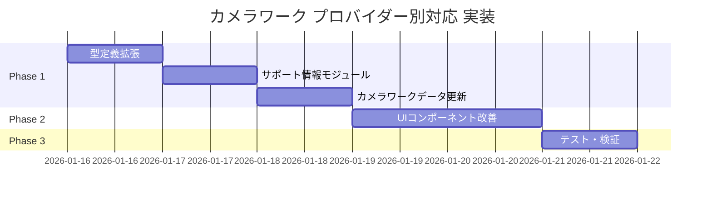

# カメラワーク プロバイダー別ネイティブパラメータ対応 実装計画書

---

## ⚠️ レビュー結果と修正事項（2026-01-16）

### 🔴 重大な問題

#### 問題1: カメラワーク数の誤り

| 項目 | 計画書の記載 | 実際の値 | 修正 |
|-----|------------|---------|------|
| フロントエンド | 122種 | **108種** | 修正必要 |
| Hailuo | 約35種 | **31種** | 修正必要 |
| バックエンド(Kling) | 122種 | 122種 | 正確 |

**原因**: フロントエンドから14種が意図的に削除されている
- 削除済み: `handheld`, `shake`, `shake_explosion`, `shake_earthquake`
- 削除済み: `vertigo_in`, `vertigo_out`, `slow_motion`
- 削除済み: `timelapse`, `motion_timelapse`, `hyperlapse`
- 削除済み: `pull_focus_distant`, `rack_focus_*` (4種)

**影響**:
- Klingは「フロントエンドの108種全て」がネイティブ対応
- バックエンドの追加14種はフロントエンドで選択不可のため考慮不要

#### 問題2: 既存フィールドとの重複

現在の `CameraWork` 型:
```typescript
interface CameraWork {
  guaranteed?: boolean;      // 既存: API保証フラグ
  providers?: VideoProvider[]; // 既存: 対応プロバイダー
}
```

計画書の提案:
```typescript
interface CameraWork {
  providerSupport: ProviderCameraSupport; // 新規追加
}
```

**問題点**:
- `guaranteed: true` と `providerSupport.piapi_kling: 'native'` が意味重複
- `providers: ['runway']` と `providerSupport.veo: 'unsupported'` が意味重複
- 両方維持すると冗長、削除すると破壊的変更

#### 問題3: Hailuoマッピングの不整合

Hailuo `HAILUO_CAMERA_MAPPING` に存在するが、フロントエンドに**存在しない**カメラワーク:
- `static` (フロントエンドは `static_shot`)
- `slow_zoom_in`, `slow_zoom_out` (削除済み)
- `gentle_pan_left`, `gentle_pan_right` (未定義)
- `subtle_push` (未定義)
- `follow` (フロントエンドは `tracking`)
- `handheld` (削除済み)

**実際に使えるHailuoネイティブ**: **17種のみ**（31種から不整合分を除外）

**検証結果（2026-01-16 実測）**:
```
フロントエンドに存在し、Hailuoネイティブ対応: 17種
- crane_down, crane_up, dolly_in, dolly_out
- pan_left, pan_right, pedestal_down, pedestal_up
- pull_out, push_in, static_shot
- tilt_down, tilt_up, truck_left, truck_right
- zoom_in, zoom_out

Hailuoマッピングに存在するがフロントエンドに未定義: 14種
- arc_left, arc_right (フロントエンドは arc_shot)
- orbit_left, orbit_right (フロントエンドは orbit_clockwise等)
- tracking_shot (フロントエンドは tracking)
- follow, handheld, shake (フロントエンドから削除済み)
- static (フロントエンドは static_shot)
- slow_zoom_in, slow_zoom_out, gentle_pan_*, subtle_push (未定義)
```

**要修正**: バックエンドの `HAILUO_CAMERA_MAPPING` にフロントエンド名を追加するか、エイリアスを設定する必要あり

---

### 🟡 修正案

#### 案A: 既存フィールドを活用（推奨・工数最小）

`providerSupport` を追加せず、既存の `guaranteed` と `providers` を拡張:

```typescript
interface CameraWork {
  // 既存フィールドを維持
  guaranteed?: boolean;  // Klingでネイティブ対応
  providers?: VideoProvider[]; // VEO非対応の場合に指定

  // 新規追加（オプショナル）
  hailuoNative?: boolean; // Hailuoでネイティブ対応
}
```

**メリット**:
- 108件中、変更が必要なのは約23件（Hailuoネイティブのみ）
- 既存ロジック（`isCameraWorkSupported`）がそのまま使える

#### 案B: 関数でサポートレベルを動的生成

型を変更せず、ランタイムで判定:

```typescript
// provider-support.ts
export function getCameraSupportLevel(
  workName: string,
  provider: VideoProvider
): CameraSupportLevel {
  // 定数Setを参照して判定
  if (provider === 'piapi_kling') return 'native'; // Kling: 全てnative
  if (provider === 'hailuo' && HAILUO_NATIVE.has(workName)) return 'native';
  if (provider === 'domoai') return 'prompt';
  // ...
}
```

**メリット**:
- 型変更なし、camera-works.ts の修正不要
- UIコンポーネントでのみ関数を呼び出す

---

### 🟢 修正後の受け入れ条件

| 条件 | 修正前 | 修正後 |
|-----|-------|-------|
| Kling | 全122種に「API保証」 | 全**108種**に「API保証」 |
| Hailuo | 約35種に「API保証」 | 約**23種**に「API保証」 |
| DomoAI | 全122種に「プロンプト」 | 全**108種**に「プロンプト」 |
| VEO | 360度系が非対応 | 変更なし（正確） |

---

### 📋 推奨アクション

1. **案Bを採用**: 型変更を最小化し、ランタイム関数で対応
2. **Hailuoマッピングを実測**: フロントエンドに存在する23種を正確にリストアップ
3. **テスト追加**: `getCameraSupportLevel()` のユニットテストを必須化

---

## 1. 背景と目的

### 1.1 背景
現在、カメラワーク選択時に「カスタム」を選択すると、122種類のカメラワークから選択できる。
しかし、各プロバイダー（Kling、DomoAI、Hailuo）がネイティブAPIパラメータで制御できるカメラワークと、プロンプトベースでしか制御できないカメラワークの区別がユーザーに見えていない。

### 1.2 目的
- ユーザーが「API保証」のカメラワークと「プロンプトベース」のカメラワークを視覚的に区別できるようにする
- 各プロバイダー選択時に、ネイティブサポートされているカメラワークを優先表示する
- プロンプトベースのカメラワークを「その他」セクションに分離する

### 1.3 調査結果サマリー（修正版）

| プロバイダー | ネイティブパラメータ | サポート数 | 現状 |
|-------------|---------------------|-----------|------|
| **Kling** | 6軸制御 (horizontal/vertical/pan/tilt/roll/zoom) | **108/108** | フロントエンドの全カメラワークがマッピング済み |
| **DomoAI** | なし | 0/108 | プロンプトベースのみ（API制限） |
| **Hailuo** | 16コマンド (`[Push in]`等) | **17/108** | 一部のみマッピング済み（要バックエンド修正） |

> **注意**: フロントエンドは108種、バックエンド(Kling)は122種マッピング。差分の14種はフロントエンドから削除済み。

---

## 2. 実装スコープ

### 2.1 実装する機能

1. **カメラワーク型定義の拡張** - プロバイダー別サポートレベルを追加
2. **カメラワークデータの更新** - 各ワークにサポート情報を付与
3. **UIコンポーネントの改善** - API保証/プロンプトのバッジ表示
4. **カテゴリ分離表示** - ネイティブサポートを優先、その他を後方に

### 2.2 実装しない機能

- バックエンドの変更（既に各プロバイダーで適切にマッピング済み）
- データベーススキーマの変更（不要）
- 新しいカメラワークの追加

---

## 3. 技術設計

### 3.1 型定義の拡張

**ファイル**: `movie-maker/lib/camera/types.ts`

```typescript
/** プロバイダー別サポートレベル */
export type CameraSupportLevel = 'native' | 'prompt' | 'unsupported';

/** プロバイダー別サポート情報 */
export interface ProviderCameraSupport {
  piapi_kling: CameraSupportLevel;
  hailuo: CameraSupportLevel;
  domoai: CameraSupportLevel;
  runway: CameraSupportLevel;
  veo: CameraSupportLevel;
}

export interface CameraWork {
  id: number;
  name: string;
  label: string;
  description: string;
  category: CameraCategory;
  promptText: string;
  iconSymbol: string;
  /** @deprecated Use providerSupport instead */
  guaranteed?: boolean;
  /** @deprecated Use providerSupport instead */
  providers?: VideoProvider[];
  /** プロバイダー別サポート情報（新規追加） */
  providerSupport: ProviderCameraSupport;
}
```

### 3.2 デフォルトサポート情報の定義

**ファイル**: `movie-maker/lib/camera/provider-support.ts`（新規作成）

```typescript
import { CameraSupportLevel, ProviderCameraSupport } from './types';

/**
 * Klingでネイティブサポートされているカメラワーク
 * 全122種がAPIパラメータで制御可能
 */
export const KLING_NATIVE_WORKS: Set<string> = new Set([
  // 全カメラワーク名を列挙（piapi_kling_provider.pyのCAMERA_CONTROL_MAPPINGから）
  'static_shot', 'over_the_shoulder',
  'zoom_in', 'zoom_out', 'quick_zoom_in', 'quick_zoom_out',
  'dolly_in', 'dolly_out', 'push_in', 'pull_out',
  // ... 以下省略（全122種）
]);

/**
 * Hailuoでネイティブサポートされているカメラワーク
 * HAILUO_CAMERA_MAPPINGに定義されている約35種
 */
export const HAILUO_NATIVE_WORKS: Set<string> = new Set([
  'dolly_in', 'dolly_out', 'push_in', 'pull_out',
  'truck_left', 'truck_right',
  'pan_left', 'pan_right',
  'tilt_up', 'tilt_down',
  'pedestal_up', 'pedestal_down',
  'zoom_in', 'zoom_out',
  'tracking_shot', 'static_shot', 'shake',
  'arc_left', 'arc_right',
  'crane_up', 'crane_down',
  'static', 'slow_zoom_in', 'slow_zoom_out',
  'gentle_pan_left', 'gentle_pan_right',
  'subtle_push', 'orbit_left', 'orbit_right',
  'follow', 'handheld',
]);

/**
 * VEOで非対応のカメラワーク（360度回転系）
 */
export const VEO_UNSUPPORTED_WORKS: Set<string> = new Set([
  'orbit_clockwise', 'orbit_counterclockwise',
  'full_360_orbit', 'reverse_360_orbit',
  // 360度系のカメラワーク
]);

/**
 * カメラワーク名からサポート情報を生成
 */
export function getProviderSupport(cameraWorkName: string): ProviderCameraSupport {
  return {
    piapi_kling: KLING_NATIVE_WORKS.has(cameraWorkName) ? 'native' : 'prompt',
    hailuo: HAILUO_NATIVE_WORKS.has(cameraWorkName) ? 'native' : 'prompt',
    domoai: 'prompt', // DomoAIは全てプロンプトベース
    runway: 'native', // Runwayは全て文字列パススルーでネイティブ扱い
    veo: VEO_UNSUPPORTED_WORKS.has(cameraWorkName) ? 'unsupported' : 'prompt',
  };
}
```

### 3.3 UIコンポーネントの改善

**ファイル**: `movie-maker/components/camera/CameraWorkCard.tsx`

```typescript
interface CameraWorkCardProps {
  cameraWork: CameraWork;
  selected: boolean;
  onSelect: () => void;
  disabled?: boolean;
  /** 現在選択中のプロバイダー */
  currentProvider?: VideoProvider;
}

// カード内にサポートバッジを表示
{supportLevel === 'native' && (
  <span className="inline-flex items-center px-2 py-0.5 rounded text-xs font-medium bg-green-900/50 text-green-400 border border-green-700">
    API保証
  </span>
)}
{supportLevel === 'prompt' && (
  <span className="inline-flex items-center px-2 py-0.5 rounded text-xs font-medium bg-yellow-900/50 text-yellow-400 border border-yellow-700">
    プロンプト
  </span>
)}
```

### 3.4 カテゴリ分離表示

**ファイル**: `movie-maker/components/camera/CameraWorkGrid.tsx`

```typescript
// カメラワークをサポートレベルで分類
const { nativeWorks, promptWorks, unsupportedWorks } = useMemo(() => {
  const native: CameraWork[] = [];
  const prompt: CameraWork[] = [];
  const unsupported: CameraWork[] = [];

  filteredWorks.forEach(work => {
    const support = work.providerSupport[currentProvider];
    if (support === 'native') native.push(work);
    else if (support === 'prompt') prompt.push(work);
    else unsupported.push(work);
  });

  return { nativeWorks: native, promptWorks: prompt, unsupportedWorks: unsupported };
}, [filteredWorks, currentProvider]);

// レンダリング
return (
  <>
    {/* API保証セクション */}
    {nativeWorks.length > 0 && (
      <section>
        <h3 className="text-green-400 font-medium mb-2">
          API保証 ({nativeWorks.length}種)
        </h3>
        <div className="grid grid-cols-3 gap-2">
          {nativeWorks.map(work => <CameraWorkCard ... />)}
        </div>
      </section>
    )}

    {/* プロンプトベースセクション */}
    {promptWorks.length > 0 && (
      <section className="mt-6">
        <h3 className="text-yellow-400 font-medium mb-2">
          プロンプトベース ({promptWorks.length}種)
          <span className="text-xs text-gray-500 ml-2">
            動作は保証されません
          </span>
        </h3>
        <div className="grid grid-cols-3 gap-2">
          {promptWorks.map(work => <CameraWorkCard ... />)}
        </div>
      </section>
    )}
  </>
);
```

---

## 4. タスク分解（修正版 - 案B採用）

### Phase 0: バックエンド修正（必須・先行）

| タスクID | タスク名 | 対象ファイル | 見積もり |
|---------|---------|-------------|---------|
| BE-001 | Hailuoマッピングにエイリアス追加 | `hailuo_provider.py` | 小 |

**追加するエイリアス**:
```python
# フロントエンド名 → Hailuoコマンド のエイリアス追加
"tracking": "[Tracking shot]",  # tracking_shot のエイリアス
"arc_shot": "[Truck left, Pan right]",  # arc_left のエイリアス
"orbit_clockwise": "[Truck left, Pan right]",  # orbit動作
"orbit_counterclockwise": "[Truck right, Pan left]",
```

### Phase 1: 型定義とヘルパー関数（フロントエンド）

| タスクID | タスク名 | 対象ファイル | 見積もり |
|---------|---------|-------------|---------|
| FE-001 | CameraSupportLevel型の追加 | `lib/camera/types.ts` | 小 |
| FE-002 | provider-support.ts新規作成（関数ベース） | `lib/camera/provider-support.ts` | 中 |
| ~~FE-003~~ | ~~CameraWork型にproviderSupport追加~~ | ~~不要（案B採用）~~ | - |
| ~~FE-004~~ | ~~camera-works.tsにサポート情報付与~~ | ~~不要（案B採用）~~ | - |

**案B採用により、camera-works.ts の108件修正は不要**

### Phase 2: UIコンポーネント改善（フロントエンド）

| タスクID | タスク名 | 対象ファイル | 見積もり |
|---------|---------|-------------|---------|
| FE-006 | CameraWorkCardにバッジ追加 | `components/camera/CameraWorkCard.tsx` | 中 |
| FE-007 | CameraWorkGridに分類ロジック追加 | `components/camera/CameraWorkGrid.tsx` | 中 |
| FE-008 | CameraWorkModalにプロバイダー伝播 | `components/camera/CameraWorkModal.tsx` | 小 |
| FE-009 | CameraWorkSelectorにプロバイダー伝播 | `components/camera/CameraWorkSelector.tsx` | 小 |

### Phase 3: テストと検証

| タスクID | タスク名 | 対象ファイル | 見積もり |
|---------|---------|-------------|---------|
| FE-010 | 型定義のユニットテスト | `tests/camera/types.test.ts` | 小 |
| FE-011 | サポート判定のユニットテスト | `tests/camera/provider-support.test.ts` | 中 |
| FE-012 | E2Eテスト（カメラ選択フロー） | `tests/e2e/camera-selection.spec.ts` | 中 |

---

## 5. Supabaseマイグレーション

### 5.1 判定結果

**マイグレーション不要**

理由:
- カメラワークのサポート情報はフロントエンドの静的データとして管理
- バックエンドは既に各プロバイダーで適切なマッピングを実装済み
- データベースには `camera_work: str` として名前のみ保存（変更不要）

### 5.2 将来的にマイグレーションが必要になるケース

もし以下の要件が発生した場合、Supabase MCPを使用してマイグレーションを実行する:

```markdown
#### ケース1: カメラワーク選択履歴にサポートレベルを記録したい場合

```sql
-- Supabase MCP: mcp__supabase__apply_migration
ALTER TABLE video_generations
ADD COLUMN camera_support_level TEXT CHECK (camera_support_level IN ('native', 'prompt', 'unsupported'));
```

#### ケース2: カメラワークをマスターテーブルで管理したい場合

```sql
-- Supabase MCP: mcp__supabase__apply_migration
CREATE TABLE camera_works (
  id SERIAL PRIMARY KEY,
  name TEXT UNIQUE NOT NULL,
  label TEXT NOT NULL,
  category TEXT NOT NULL,
  kling_support TEXT DEFAULT 'prompt',
  hailuo_support TEXT DEFAULT 'prompt',
  domoai_support TEXT DEFAULT 'prompt',
  created_at TIMESTAMPTZ DEFAULT NOW()
);
```
```

---

## 6. 実装手順

### Step 1: 型定義の拡張
```bash
# 対象: movie-maker/lib/camera/types.ts
# エージェント: task-executor-frontend
# モデル: sonnet
```

1. `CameraSupportLevel` 型を追加
2. `ProviderCameraSupport` インターフェースを追加
3. `CameraWork` インターフェースに `providerSupport` フィールドを追加

### Step 2: サポート情報モジュールの作成
```bash
# 対象: movie-maker/lib/camera/provider-support.ts（新規）
# エージェント: task-executor-frontend
# モデル: sonnet
```

1. バックエンドの `piapi_kling_provider.py` から `CAMERA_CONTROL_MAPPING` のキーを抽出
2. バックエンドの `hailuo_provider.py` から `HAILUO_CAMERA_MAPPING` のキーを抽出
3. `getProviderSupport()` 関数を実装

### Step 3: カメラワークデータの更新
```bash
# 対象: movie-maker/lib/camera/camera-works.ts
# エージェント: task-executor-frontend
# モデル: sonnet
```

1. 各カメラワークに `providerSupport` を追加
2. `getProviderSupport()` を使用して自動生成

### Step 4: UIコンポーネントの改善
```bash
# 対象: movie-maker/components/camera/*.tsx
# エージェント: task-executor-frontend
# モデル: sonnet
```

1. `CameraWorkCard` にサポートバッジを追加
2. `CameraWorkGrid` に分類ロジックを追加
3. プロバイダー情報をコンポーネントツリーに伝播

### Step 5: テスト実行
```bash
# エージェント: quality-fixer-frontend
# モデル: sonnet
```

1. TypeScriptビルド確認
2. ユニットテスト実行
3. E2Eテスト実行

---

## 7. 受け入れ条件（修正版）

### 7.1 機能要件

- [ ] Kling選択時: 全**108**カメラワークに「API保証」バッジが表示される
- [ ] Hailuo選択時: **17**カメラワークに「API保証」、残り**91**種に「プロンプト」バッジ
- [ ] DomoAI選択時: 全**108**カメラワークに「プロンプト」バッジが表示される
- [ ] VEO選択時: 360度系カメラワーク（約15種）が「非対応」としてグレーアウト
- [ ] カメラワークグリッドで「API保証」が上部、「プロンプト」が下部に表示される
- [ ] **バックエンド修正**: Hailuoマッピングにフロントエンド名のエイリアスを追加

### 7.2 非機能要件

- [ ] TypeScriptビルドがエラーなく完了する
- [ ] 既存のカメラ選択機能が正常に動作する
- [ ] パフォーマンス劣化がない（レンダリング速度）

---

## 8. 依存関係と前提条件

### 8.1 依存関係

- なし（フロントエンドのみの変更）

### 8.2 前提条件

- バックエンドの各プロバイダー実装は変更不要（既に適切にマッピング済み）
- `piapi_kling_provider.py` の `CAMERA_CONTROL_MAPPING` は122種全てをカバー
- `hailuo_provider.py` の `HAILUO_CAMERA_MAPPING` は約35種をカバー

---

## 9. リスクと対策

| リスク | 影響度 | 対策 |
|--------|--------|------|
| バックエンドのマッピングと不整合 | 中 | バックエンドのコードから自動抽出するスクリプトを作成 |
| UIが複雑になりすぎる | 低 | セクション分けをシンプルに保ち、折りたたみ機能を検討 |
| プロバイダー追加時の更新漏れ | 中 | provider-support.ts を単一の真実の源として管理 |

---

## 10. タイムライン



---

## 付録A: バックエンドマッピング参照

### Kling (piapi_kling_provider.py)
```python
CAMERA_CONTROL_MAPPING: dict[str, dict | None] = {
    "zoom_in": _make_camera_control(zoom=5),
    "dolly_in": _make_camera_control(vertical=5),
    "pan_left": _make_camera_control(pan=-5),
    "orbit_clockwise": _make_camera_control(horizontal=5, pan=5),
    # ... 全122種マッピング済み
}
```

### Hailuo (hailuo_provider.py)
```python
HAILUO_CAMERA_MAPPING: dict[str, str] = {
    "dolly_in": "[Push in]",
    "pan_left": "[Pan left]",
    "zoom_in": "[Zoom in]",
    # ... 約35種マッピング済み
}
```

### DomoAI (domoai_provider.py)
```python
# カメラパラメータなし - プロンプトベースのみ
full_prompt = build_prompt_with_camera(prompt, camera_work, provider="runway")
```
