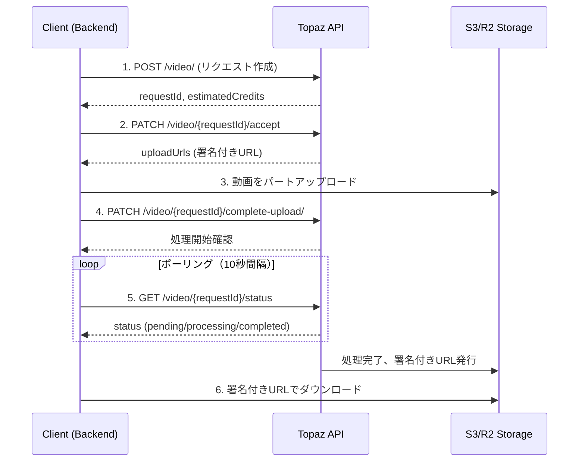
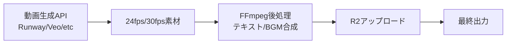
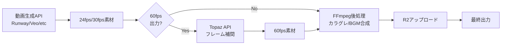

# Topaz Video API統合による60fps動画出力機能 実装計画書

## 概要

### 目的
動画出力を60fpsで行えるようにし、より滑らかな動画体験をユーザーに提供する。

### 手段
Topaz Video APIのフレーム補間機能（Apollo/Chronosモデル）を活用し、24fps/30fps動画を60fpsに変換する。

### スコープ
- 動画結合後の最終出力に60fpsオプションを追加
- Topaz API統合とエラーハンドリング
- フロントエンドでのFPS選択UI追加（オプション）

## Topaz Video API仕様

### 基本情報
- **Base URL**: `https://api.topazlabs.com/`
- **認証方式**: `X-API-Key` ヘッダー
- **必要な環境変数**: `TOPAZ_API_KEY`
- **料金体系**: クレジット制（処理時間・解像度に応じて変動）
- **レート制限**: HTTP 429応答時はバックオフ推奨

### APIワークフロー（6ステップ）



#### ステップ詳細

**1. POST /video/ - リクエスト作成**
```json
{
  "filters": [{
    "model": "apo-8",
    "fps": 60,
    "slowmo": 1,
    "duplicate": true,
    "duplicateThreshold": 0.1
  }],
  "output": {
    "format": "mp4",
    "compression": 18
  }
}
```

**2. PATCH /video/{requestId}/accept - アップロードURL取得**
```json
{
  "uploadUrls": [
    "https://s3.amazonaws.com/..."
  ],
  "partSize": 5242880
}
```

**3. 動画をパートアップロード**
- 5MB単位でマルチパートアップロード
- ストリーミング処理でメモリ効率化
- 最大500MBまで対応

**4. PATCH /video/{requestId}/complete-upload/ - アップロード完了通知**
```json
{
  "uploadId": "..."
}
```

**5. GET /video/{requestId}/status - ステータス確認**
```json
{
  "status": "completed",
  "progress": 100,
  "downloadUrl": "https://..."
}
```

**6. 署名付きURLでダウンロード**
- downloadUrlから変換後の動画をダウンロード
- URLは一定時間で期限切れ

### フレーム補間パラメータ

#### 推奨設定（60fps変換）
```json
{
  "filters": [{
    "model": "apo-8",
    "fps": 60,
    "slowmo": 1,
    "duplicate": true,
    "duplicateThreshold": 0.1
  }]
}
```

#### パラメータ説明
| パラメータ | 説明 | 推奨値 |
|-----------|------|--------|
| `model` | 使用するAIモデル | `apo-8` (汎用性高) |
| `fps` | 出力フレームレート | `60` |
| `slowmo` | スローモーション倍率 | `1` (通常速度) |
| `duplicate` | 重複フレーム検出 | `true` |
| `duplicateThreshold` | 重複判定閾値 | `0.1` (10%) |

### 利用可能なモデル

| モデル | 用途 | 特徴 | 推奨ケース |
|--------|------|------|-----------|
| **apo-8** | Apollo推奨 | 最大8xスローモ、非線形運動に強い | 汎用、スポーツ、ダンス映像 |
| **apf-2** | Apollo Fast | Apollo高速版 | 処理速度優先時 |
| **chr-2** | Chronos推奨 | 一般的なFPS変換 | ゲーム映像、24fps→60fps変換 |
| **chf-3** | Chronos Fast | Chronos高速版 | 軽量な変換 |

#### モデル選択基準
- **24fps → 60fps（2.5倍）**: `chr-2`（非整数倍に対応）
- **30fps → 60fps（2倍）**: `apo-8` または `chr-2`
- **複雑な動き（スポーツ、ダンス等）**: `apo-8`
- **ゲーム映像、静止画多め**: `chr-2`
- **処理速度優先**: `apf-2` または `chf-3`

## 既存アーキテクチャ分析

### 現在の動画処理フロー



### 修正後の正しい動画処理フロー



**重要な変更点:**
- Topaz処理をFFmpeg**前**に配置（Critical Issue #1）
- FFmpegは60fps素材に対してカラグレとBGMを適用

### 関連ファイル
- `movie-maker-api/app/services/topaz_service.py` - Topazサービス（新規作成）
- `movie-maker-api/app/services/ffmpeg_service.py` - 動画後処理
- `movie-maker-api/app/tasks/video_processor.py` - バックグラウンド処理
- `movie-maker-api/app/core/config.py` - 環境変数設定
- `movie-maker-api/app/external/runway_provider.py` - エラーハンドリング参考実装

### 既存パターンとの整合性
既存の `runway_provider.py` で実装されているエラーハンドリングパターン（日本語エラーメッセージ）を採用し、一貫性を保つ。

## データベーススキーマ拡張

### マイグレーションSQL

**ファイル**: `docs/migrations/20260121_video_target_fps.sql`

```sql
-- video_generations テーブルに target_fps カラム追加
ALTER TABLE video_generations
ADD COLUMN target_fps INTEGER DEFAULT 30 CHECK (target_fps IN (24, 30, 60));

-- インデックス追加（パフォーマンス向上）
CREATE INDEX idx_video_generations_target_fps ON video_generations(target_fps);

-- 既存レコードは30fpsと仮定
UPDATE video_generations
SET target_fps = 30
WHERE target_fps IS NULL;
```

## 実装タスク

### Phase 1: Backend基盤実装

#### 1.1 環境変数追加
**ファイル**: `movie-maker-api/.env.example`
```env
# Topaz Video API
TOPAZ_API_KEY=your_api_key_here
```

**ファイル**: `movie-maker-api/app/core/config.py`
```python
class Settings(BaseSettings):
    # ... existing settings ...

    # Topaz Video API
    TOPAZ_API_KEY: str = ""
```

#### 1.2 Topaz Interpolation Service実装
**ファイル**: `movie-maker-api/app/services/topaz_service.py` (新規作成)

```python
"""
Topaz Video API Interpolation Service

フレーム補間（60fps変換）機能を提供
"""

import logging
import asyncio
import tempfile
from typing import Optional, Literal
from pathlib import Path
import httpx

from app.core.config import settings

logger = logging.getLogger(__name__)

TOPAZ_API_BASE = "https://api.topazlabs.com"

class TopazServiceError(Exception):
    """Topaz API エラー"""
    pass

class TopazInterpolationService:
    """Topaz Video API フレーム補間サービス"""

    def __init__(self):
        self._client: Optional[httpx.AsyncClient] = None

    async def _get_client(self) -> httpx.AsyncClient:
        """HTTPクライアントの再利用"""
        if self._client is None or self._client.is_closed:
            self._client = httpx.AsyncClient(
                timeout=httpx.Timeout(600.0, connect=10.0),  # アップロード用に10分に延長
                limits=httpx.Limits(max_connections=10),
            )
        return self._client

    async def __aenter__(self):
        return self

    async def __aexit__(self, exc_type, exc_val, exc_tb):
        if self._client:
            await self._client.aclose()

    def _get_headers(self) -> dict:
        """API認証ヘッダー（APIキーをログ出力しない）"""
        return {
            "X-API-Key": settings.TOPAZ_API_KEY,
            "Content-Type": "application/json",
        }

    async def interpolate_to_60fps(
        self,
        video_url: str,
        model: Literal["apo-8", "chr-2", "apf-2", "chf-3"] = "apo-8",
        progress_callback: Optional[callable] = None,
    ) -> str:
        """
        動画を60fpsに補間

        Args:
            video_url: 入力動画URL
            model: 使用するAIモデル
            progress_callback: 進捗報告コールバック（60-90%の範囲で更新）

        Returns:
            str: 変換後の動画URL

        Raises:
            TopazServiceError: API呼び出しエラー
        """
        try:
            logger.info(f"Topaz 60fps補間開始: model={model}")

            # Step 1: リクエスト作成
            request_id = await self._create_request(video_url, model)
            logger.info(f"Topaz リクエストID: {request_id}")

            # Step 2: アップロードURL取得
            upload_info = await self._accept_request(request_id)

            # Step 3: 動画をストリーミングアップロード
            await self._upload_video_streaming(video_url, upload_info)

            # Step 4: アップロード完了通知
            await self._complete_upload(request_id, upload_info["uploadId"])

            # 進捗報告（アップロード完了）
            if progress_callback:
                await progress_callback(65)

            # Step 5: 処理完了を待つ（ポーリング、20分に延長）
            download_url = await self._wait_for_completion(
                request_id,
                max_attempts=120,  # 10分 → 20分
                progress_callback=progress_callback,
            )

            logger.info(f"Topaz 60fps補間完了: {download_url}")
            return download_url

        except httpx.HTTPStatusError as e:
            logger.error(f"Topaz HTTP error: {e.response.status_code} - {e.response.text}")
            if e.response.status_code == 429:
                raise TopazServiceError("レート制限に達しました。しばらくしてからお試しください。")
            elif e.response.status_code == 413:
                raise TopazServiceError("動画サイズが500MBを超えています。")
            elif e.response.status_code == 402:
                raise TopazServiceError("Topazクレジットが不足しています。")
            raise TopazServiceError(f"Topaz API エラー: {e.response.text}")
        except Exception as e:
            logger.exception(f"Topaz補間処理失敗: {e}")
            raise TopazServiceError(f"フレーム補間に失敗しました: {str(e)}")

    async def _create_request(self, video_url: str, model: str) -> str:
        """Step 1: リクエスト作成"""
        request_body = {
            "filters": [{
                "model": model,
                "fps": 60,
                "slowmo": 1,
                "duplicate": True,
                "duplicateThreshold": 0.1,
            }],
            "output": {
                "format": "mp4",
                "compression": 18,
            },
        }

        logger.debug(f"Topaz request body: {request_body}")

        client = await self._get_client()
        response = await client.post(
            f"{TOPAZ_API_BASE}/video/",
            headers=self._get_headers(),
            json=request_body,
        )
        response.raise_for_status()
        result = response.json()
        logger.info(f"Topaz create_request response: {result}")
        return result["requestId"]

    async def _accept_request(self, request_id: str) -> dict:
        """Step 2: アップロードURL取得"""
        client = await self._get_client()
        response = await client.patch(
            f"{TOPAZ_API_BASE}/video/{request_id}/accept",
            headers=self._get_headers(),
        )
        response.raise_for_status()
        result = response.json()
        logger.info(f"Topaz accept_request response: uploadUrls count={len(result.get('uploadUrls', []))}")
        return result

    async def _upload_video_streaming(self, video_url: str, upload_info: dict) -> None:
        """
        Step 3: 動画をストリーミングアップロード（メモリ効率化）

        500MB動画を全てメモリに読み込まず、チャンク単位で処理
        """
        client = await self._get_client()
        part_size = upload_info["partSize"]
        upload_urls = upload_info["uploadUrls"]

        logger.info(f"Topaz streaming upload: part_size={part_size}, parts={len(upload_urls)}")

        # 一時ファイルを使ってストリーミングダウンロード
        with tempfile.TemporaryDirectory() as tmpdir:
            tmp_video_path = Path(tmpdir) / "source_video.mp4"

            # ストリーミングダウンロード
            async with client.stream("GET", video_url) as response:
                response.raise_for_status()
                with open(tmp_video_path, "wb") as f:
                    async for chunk in response.aiter_bytes(chunk_size=8192):
                        f.write(chunk)

            logger.info(f"Downloaded video to temp file: {tmp_video_path}")

            # パート単位でアップロード
            with open(tmp_video_path, "rb") as f:
                for i, upload_url in enumerate(upload_urls):
                    part_data = f.read(part_size)
                    if not part_data:
                        break

                    logger.debug(f"Uploading part {i+1}/{len(upload_urls)}")
                    part_response = await client.put(
                        upload_url,
                        content=part_data,
                        timeout=600.0,  # 10分
                    )
                    part_response.raise_for_status()

        logger.info("Topaz streaming upload completed")

    async def _complete_upload(self, request_id: str, upload_id: str) -> None:
        """Step 4: アップロード完了通知"""
        client = await self._get_client()
        response = await client.patch(
            f"{TOPAZ_API_BASE}/video/{request_id}/complete-upload/",
            headers=self._get_headers(),
            json={"uploadId": upload_id},
        )
        response.raise_for_status()
        logger.info("Topaz upload complete notification sent")

    async def _wait_for_completion(
        self,
        request_id: str,
        max_attempts: int = 120,  # 20分（10秒間隔 × 120回）
        poll_interval: int = 10,
        progress_callback: Optional[callable] = None,
    ) -> str:
        """
        Step 5: 処理完了をポーリング

        進捗を60-90%の範囲で更新
        """
        client = await self._get_client()

        for attempt in range(max_attempts):
            await asyncio.sleep(poll_interval)

            response = await client.get(
                f"{TOPAZ_API_BASE}/video/{request_id}/status",
                headers=self._get_headers(),
            )
            response.raise_for_status()
            status_data = response.json()

            status = status_data.get("status")
            logger.debug(f"Topaz status check ({attempt+1}/{max_attempts}): {status}")

            # 進捗報告（60-90%の範囲）
            if progress_callback:
                progress = 60 + int((attempt / max_attempts) * 30)
                await progress_callback(min(progress, 90))

            if status == "completed":
                download_url = status_data.get("downloadUrl")
                logger.info(f"Topaz processing completed: {download_url}")
                return download_url
            elif status == "failed":
                error = status_data.get("error", "Unknown error")
                logger.error(f"Topaz processing failed: {error}")
                raise TopazServiceError(f"処理に失敗しました: {error}")

        raise TopazServiceError("処理がタイムアウトしました（20分）")

    async def cancel_task(self, request_id: str) -> bool:
        """
        タスクをキャンセル

        Args:
            request_id: Topaz リクエストID

        Returns:
            bool: キャンセル成功時True
        """
        try:
            client = await self._get_client()
            response = await client.delete(
                f"{TOPAZ_API_BASE}/video/{request_id}",
                headers=self._get_headers(),
            )
            response.raise_for_status()
            logger.info(f"Topaz task cancelled: {request_id}")
            return True
        except Exception as e:
            logger.error(f"Topaz cancel failed: {e}")
            return False

    async def estimate_cost(self, video_url: str) -> dict:
        """
        処理コストを事前見積もり

        Args:
            video_url: 動画URL

        Returns:
            dict: {"credits": int, "processing_time_minutes": int}
        """
        # TODO: Topaz APIのコスト見積もりエンドポイントを実装
        # 現在は概算値を返す
        return {
            "credits": 15,  # 概算
            "processing_time_minutes": 5,  # 概算
        }


# シングルトンインスタンス
_topaz_service = None

def get_topaz_service() -> TopazInterpolationService:
    """TopazInterpolationServiceのシングルトンインスタンスを取得"""
    global _topaz_service
    if _topaz_service is None:
        _topaz_service = TopazInterpolationService()
    return _topaz_service
```

#### 1.3 動画処理タスク修正
**ファイル**: `movie-maker-api/app/tasks/video_processor.py`

```python
# 既存のimportに追加
from app.services.topaz_service import get_topaz_service, TopazServiceError

async def process_video_generation(video_id: str) -> None:
    """
    動画生成のバックグラウンド処理

    1. Runway APIに動画生成をリクエスト
    2. 生成完了を待つ（ポーリング）
    3. 動画をダウンロード
    4. [NEW] 60fps変換（オプション、FFmpegの前）
    5. FFmpegでカラグレ/BGMを追加
    6. 最終動画をR2にアップロード
    7. ステータスを更新
    """
    supabase = get_supabase()
    ffmpeg = get_ffmpeg_service()
    topaz = get_topaz_service()

    # ... 既存の処理（Step 1-3）...

    # Step 3.5: 60fps変換（オプション、FFmpegの前）
    target_fps = video_data.get("target_fps", 30)  # デフォルト30fps

    if target_fps == 60:
        logger.info(f"60fps補間開始: video_id={video_id}")
        await update_video_status(video_id, "processing", progress=60)

        try:
            # Topaz APIで60fps変換（進捗コールバック付き）
            async def update_progress(progress: int):
                await update_video_status(video_id, "processing", progress=progress)

            interpolated_url = await topaz.interpolate_to_60fps(
                video_url=raw_video_url,
                model="apo-8",  # または chr-2
                progress_callback=update_progress,
            )

            # 変換後のURLをダウンロード
            raw_video_path = await download_video_from_url(interpolated_url)
            logger.info(f"60fps補間完了: video_id={video_id}")

        except TopazServiceError as e:
            logger.error(f"Topaz補間失敗: {e}")
            # エラーでも処理継続（30fpsのまま）
            await update_video_status(
                video_id,
                "processing",
                progress=65,
                error_message=f"60fps変換失敗（30fpsで続行）: {str(e)}"
            )

    # Step 4: FFmpegでカラグレ/BGMを追加（60fps素材を処理）
    # ... 既存の処理 ...
```

### Phase 2: API拡張

#### 2.1 スキーマ拡張
**ファイル**: `movie-maker-api/app/videos/schemas.py`

```python
from pydantic import BaseModel, Field, validator

class VideoCreate(BaseModel):
    # ... 既存フィールド ...
    target_fps: int = Field(default=30, ge=24, le=60, description="出力フレームレート (24, 30, 60)")

    @validator("target_fps")
    def validate_fps(cls, v):
        if v not in [24, 30, 60]:
            raise ValueError("target_fps must be 24, 30, or 60")
        return v

class VideoResponse(BaseModel):
    # ... 既存フィールド ...
    target_fps: int
    original_video_url: Optional[str] = None  # 元動画URLを保持（バージョニング対応）
```

#### 2.2 APIエンドポイント追加
**ファイル**: `movie-maker-api/app/videos/router.py`

```python
from app.services.topaz_service import get_topaz_service, TopazServiceError

@router.post("/videos/{video_id}/interpolate-60fps", response_model=dict)
async def interpolate_video_to_60fps(
    video_id: str,
    current_user: dict = Depends(get_current_user),
) -> dict:
    """
    既存の動画を60fpsに変換

    ストーリーボード結合後の動画に対して適用
    """
    supabase = get_supabase()
    topaz = get_topaz_service()

    # 動画情報を取得
    response = supabase.table("video_generations").select("*").eq("id", video_id).eq("user_id", current_user["id"]).single().execute()

    if not response.data:
        raise HTTPException(status_code=404, detail="動画が見つかりません")

    video_data = response.data

    # ステータスチェック
    if video_data["status"] != "completed":
        raise HTTPException(status_code=400, detail="動画が完成していません")

    # 既に60fpsの場合
    if video_data.get("target_fps") == 60:
        raise HTTPException(status_code=400, detail="既に60fps動画です")

    try:
        # コスト見積もり
        cost_estimate = await topaz.estimate_cost(video_data["final_video_url"])
        logger.info(f"Topaz cost estimate: {cost_estimate}")

        # Topaz APIで60fps変換
        interpolated_url = await topaz.interpolate_to_60fps(
            video_url=video_data["final_video_url"],
            model="apo-8",
        )

        # R2に再アップロード
        r2_url = await r2_client.upload_from_url(
            interpolated_url,
            f"videos/{video_id}_60fps.mp4"
        )

        # DBを更新（元動画URLを保持）
        supabase.table("video_generations").update({
            "original_video_url": video_data["final_video_url"],  # 元動画を保持
            "final_video_url": r2_url,
            "target_fps": 60,
            "updated_at": datetime.now(timezone.utc).isoformat(),
        }).eq("id", video_id).execute()

        return {
            "id": video_id,
            "status": "completed",
            "final_video_url": r2_url,
            "target_fps": 60,
        }

    except TopazServiceError as e:
        logger.error(f"60fps変換失敗: {e}")
        raise HTTPException(status_code=500, detail=str(e))
```

### Phase 3: フロントエンド実装（オプション）

#### 3.1 FPS選択UI
**ファイル**: `movie-maker/app/generate/storyboard/page.tsx`

```typescript
// FPS選択セクション
<div className="space-y-2">
  <label className="text-sm font-medium">出力フレームレート</label>
  <select
    value={targetFps}
    onChange={(e) => setTargetFps(Number(e.target.value))}
    className="w-full px-3 py-2 border rounded-md"
  >
    <option value={30}>30 fps（標準）</option>
    <option value={60}>60 fps（滑らか・高品質）+追加料金</option>
  </select>
  {targetFps === 60 && (
    <p className="text-sm text-gray-500">
      ※ 60fps変換には追加で2-3分かかります
    </p>
  )}
</div>
```

#### 3.2 既存動画の60fps変換ボタン
**ファイル**: `movie-maker/app/history/page.tsx`

```typescript
// 動画詳細カードに追加
{video.target_fps !== 60 && video.status === 'completed' && (
  <button
    onClick={() => handleInterpolateTo60fps(video.id)}
    className="px-4 py-2 bg-blue-600 text-white rounded-md"
  >
    60fpsに変換
  </button>
)}
```

## エラーハンドリング

### エラーケースと対応

| エラー | HTTPステータス | 原因 | 対応 |
|--------|---------------|------|------|
| 認証エラー | 401 Unauthorized | API Keyが無効 | 設定確認を促す |
| レート制限 | 429 Too Many Requests | APIリクエスト過多 | 日本語メッセージで待機を促す |
| ファイルサイズ超過 | 413 Payload Too Large | 動画サイズ > 500MB | エラーメッセージ表示、圧縮提案 |
| クレジット不足 | 402 Payment Required | Topazクレジット残高不足 | ユーザーに課金促す |
| 処理タイムアウト | 504 Gateway Timeout | 20分以内に完了せず | エラーログ記録、ユーザーに通知 |
| 処理失敗 | 500 Internal Server Error | Topaz側の処理エラー | 30fpsのまま継続、エラー記録 |

### フォールバック処理

```python
try:
    interpolated_url = await topaz.interpolate_to_60fps(video_url)
except TopazServiceError as e:
    logger.error(f"Topaz API失敗、30fpsで継続: {e}")
    # 30fpsのまま処理継続
    interpolated_url = video_url
    await update_video_status(
        video_id,
        "processing",
        progress=65,
        error_message="60fps変換失敗（30fpsで続行）"
    )
```

## テスト計画

### Unit Tests

**ファイル**: `movie-maker-api/tests/services/test_topaz_service.py`

```python
import pytest
from unittest.mock import AsyncMock, patch
from app.services.topaz_service import TopazInterpolationService, TopazServiceError

@pytest.mark.asyncio
async def test_interpolate_to_60fps_success():
    """正常系: 60fps変換成功"""
    service = TopazInterpolationService()

    with patch.object(service, "_create_request", return_value="req-123"), \
         patch.object(service, "_accept_request", return_value={"uploadId": "up-123", "uploadUrls": ["url1"], "partSize": 5242880}), \
         patch.object(service, "_upload_video_streaming", return_value=None), \
         patch.object(service, "_complete_upload", return_value=None), \
         patch.object(service, "_wait_for_completion", return_value="https://download.url"):

        result = await service.interpolate_to_60fps("https://input.mp4")
        assert result == "https://download.url"

@pytest.mark.asyncio
async def test_interpolate_rate_limit():
    """異常系: レート制限エラー"""
    service = TopazInterpolationService()

    with patch.object(service, "_create_request") as mock_create:
        mock_response = AsyncMock()
        mock_response.status_code = 429
        mock_response.text = "Rate limit"
        mock_create.side_effect = httpx.HTTPStatusError("429", request=None, response=mock_response)

        with pytest.raises(TopazServiceError, match="レート制限"):
            await service.interpolate_to_60fps("https://input.mp4")

@pytest.mark.asyncio
async def test_streaming_upload_memory_efficiency():
    """ストリーミングアップロードのメモリ効率テスト"""
    service = TopazInterpolationService()
    # メモリ使用量が500MB以下であることを確認
    # TODO: メモリプロファイリングツールで検証
    pass

@pytest.mark.asyncio
async def test_processing_timeout():
    """タイムアウトテスト（20分）"""
    service = TopazInterpolationService()

    with patch.object(service, "_wait_for_completion") as mock_wait:
        mock_wait.side_effect = TopazServiceError("処理がタイムアウトしました（20分）")

        with pytest.raises(TopazServiceError, match="タイムアウト"):
            await service.interpolate_to_60fps("https://input.mp4")
```

### Integration Tests

**ファイル**: `movie-maker-api/tests/videos/test_60fps_integration.py`

```python
@pytest.mark.asyncio
async def test_video_generation_with_60fps():
    """E2E: 60fps動画生成"""
    # 1. 動画生成リクエスト（60fps指定）
    response = await client.post("/api/v1/videos", json={
        "image_urls": ["https://test.jpg"],
        "prompt": "test prompt",
        "target_fps": 60,
    })
    assert response.status_code == 201
    video_id = response.json()["id"]

    # 2. ステータス確認（処理完了まで待機）
    # ... polling logic ...

    # 3. 最終動画を取得
    final_response = await client.get(f"/api/v1/videos/{video_id}")
    assert final_response.json()["target_fps"] == 60
    assert final_response.json()["status"] == "completed"

@pytest.mark.asyncio
async def test_fallback_to_30fps_on_topaz_error():
    """フォールバックテスト: Topazエラー時に30fpsで継続"""
    # Topaz APIをモックしてエラーを発生させる
    # 30fpsで処理が完了することを確認
    pass
```

### Manual Tests

1. **基本フロー確認**
   - 30fps動画生成 → 60fps変換ボタン → 変換完了確認

2. **エラーケース確認**
   - 無効なAPI Key → 認証エラー表示
   - 大容量動画（>500MB） → サイズエラー表示
   - クレジット不足 → 課金促進メッセージ

3. **パフォーマンス確認**
   - 5秒動画の変換時間（目安: 2-3分）
   - 10秒動画の変換時間（目安: 4-6分）
   - メモリ使用量（500MB動画で500MB以下）

4. **タイムアウト確認**
   - 20分タイムアウトの動作確認

## セキュリティ考慮事項

1. **APIキーのログ出力防止**
   - `_get_headers()` メソッドでAPIキーを含むヘッダーをログ出力しない
   - エラーログにも認証情報を含めない

2. **一時ファイルのクリーンアップ**
   - `tempfile.TemporaryDirectory()` を使って自動クリーンアップ
   - 処理失敗時もファイルが残らないようにする

3. **入力検証**
   - 動画URLの形式チェック
   - target_fpsの値検証（24, 30, 60のみ許可）

## 今後の拡張（オプション）

### 1. 120fps対応
```python
async def interpolate_to_120fps(
    self,
    video_url: str,
    model: Literal["apo-8"] = "apo-8",
) -> str:
    """120fps変換（Apollo 8xスローモ活用）"""
    request_body = {
        "filters": [{
            "model": model,
            "fps": 120,
            "slowmo": 1,
        }]
    }
    # ... 同様の処理 ...
```

### 2. アップスケール機能との組み合わせ
```python
async def upscale_and_interpolate(
    self,
    video_url: str,
    target_resolution: Literal["1080p", "4k"] = "1080p",
    target_fps: int = 60,
) -> str:
    """アップスケール + フレーム補間を一括実行"""
    request_body = {
        "filters": [
            {"model": "prob-3", "scale": 4},  # Upscale
            {"model": "apo-8", "fps": target_fps},  # Interpolate
        ]
    }
    # ... 処理 ...
```

### 3. モデル自動選択
```python
def _select_model(self, source_fps: int, target_fps: int, content_type: str) -> str:
    """コンテンツに応じてモデルを自動選択"""
    fps_ratio = target_fps / source_fps

    # 整数倍（2x, 4x, 8x）
    if fps_ratio in [2, 4, 8]:
        if content_type in ["sports", "dance"]:
            return "apo-8"  # 複雑な動き
        return "chr-2"  # 標準

    # 非整数倍（24→60など）
    return "chr-2"
```

## コスト見積もり

### Topaz APIクレジット消費

| 処理 | 入力 | クレジット（概算） | 処理時間 |
|------|------|-------------------|----------|
| 60fps変換（5秒、720p） | 24fps → 60fps | 約10クレジット | 2-3分 |
| 60fps変換（10秒、720p） | 24fps → 60fps | 約20クレジット | 4-6分 |
| 60fps変換（5秒、1080p） | 30fps → 60fps | 約15クレジット | 3-4分 |

※ Topaz API Pricing Calculatorで正確な見積もりを取得: https://developer.topazlabs.com/credit-calculator

### 月間コスト試算

**前提条件:**
- 月間100動画生成
- うち20%が60fps変換を選択
- 平均動画長: 5秒
- 平均クレジット消費: 12クレジット/動画

**計算:**
```
100動画 × 20% × 12クレジット = 240クレジット/月
```

**料金:**
- Topaz 3,000クレジットプラン: $199/月
- 240クレジット消費 → 月間$16程度（従量課金換算）

## 参考資料

### Topaz Video API公式ドキュメント
- [Frame Interpolation Documentation](https://docs.topazlabs.com/video-ai/filters/frame-interpolation) - フレーム補間機能の詳細
- [Available Models](https://developer.topazlabs.com/video-api/available-models) - 利用可能なAIモデル一覧
- [API Introduction](https://developer.topazlabs.com/video-api/introduction) - API基本仕様とワークフロー
- [Pricing Information](https://developer.topazlabs.com/whats-the-pricing) - クレジット制の料金体系
- [Credit Calculator](https://developer.topazlabs.com/credit-calculator) - クレジット消費量計算ツール

### モデル比較とベストプラクティス
- [Apollo vs. Chronos Comparison](https://community.topazlabs.com/t/apollo-vs-chronos/39411) - コミュニティによるモデル比較
- [Frame Interpolation Models Review](https://unifab.ai/resource/topaz-video-ai-frame-interpolation) - Apollo vs Chronos vs Aionの詳細レビュー
- [Topaz Video AI Faceoff](https://reelmind.ai/blog/topaz-video-ai-faceoff-apollo-vs-chronos-benchmarking-next-gen-enhancement-technologies) - Apollo vs Chronos技術ベンチマーク

### 料金・制限
- [Product Pricing](https://www.topazlabs.com/pricing) - Topaz製品の料金プラン
- [API Documentation](https://developer.topazlabs.com/) - 認証、レート制限、エラーコード

## 実装スケジュール

| Phase | タスク | 工数（日） | 担当 |
|-------|--------|----------|------|
| Phase 1 | Backend基盤実装 | 3 | Backend |
| Phase 2 | API拡張 | 2 | Backend |
| Phase 3 | フロントエンド実装 | 2 | Frontend |
| Testing | 統合テスト・手動テスト | 2 | QA |
| **合計** | | **9日** | |

## リスクと対策

| リスク | 影響度 | 対策 |
|--------|--------|------|
| Topaz APIの不安定性 | 高 | フォールバック処理（30fpsで継続） |
| クレジット消費の予想超過 | 中 | 使用量モニタリング、アラート設定 |
| 処理時間の長期化 | 中 | ユーザーへの明確な時間表示、20分タイムアウト |
| 大容量動画のメモリ不足 | 中 | ストリーミング処理で対応 |
| アップロード失敗 | 低 | 500MB制限の事前チェック、ストリーミングアップロード |

## 完了条件

- [ ] Topaz Interpolation Service実装完了
- [ ] 環境変数設定完了
- [ ] 動画処理タスク統合完了（FFmpeg前にTopaz配置）
- [ ] APIエンドポイント追加完了
- [ ] DBマイグレーション適用完了
- [ ] Unit Tests全パス
- [ ] Integration Tests全パス
- [ ] 手動テスト（基本フロー、エラーケース、メモリ、タイムアウト）完了
- [ ] ドキュメント更新（API仕様書、README）
- [ ] 本番環境デプロイ
- [ ] モニタリング設定（クレジット消費、エラー率）
