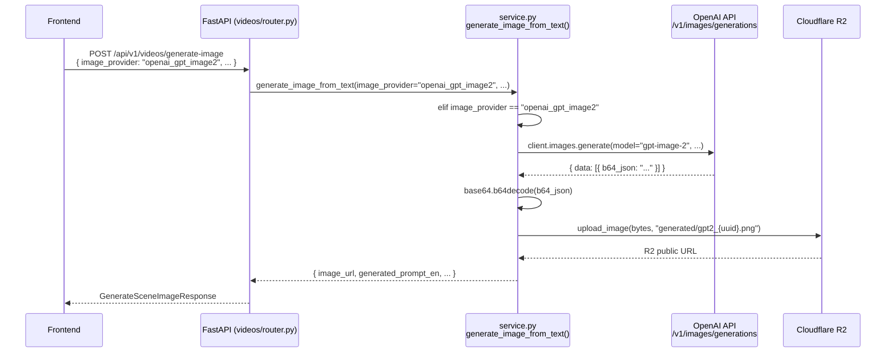
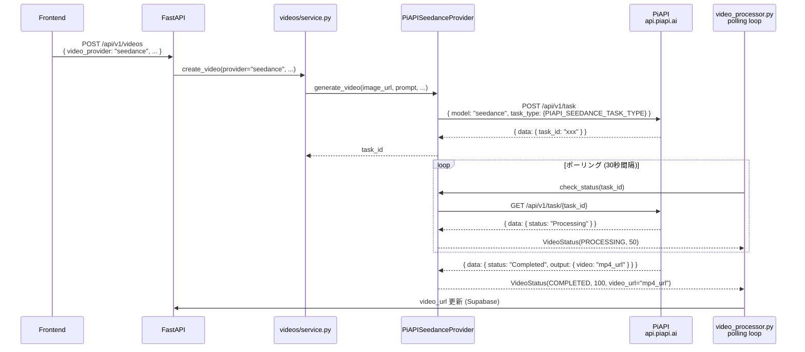
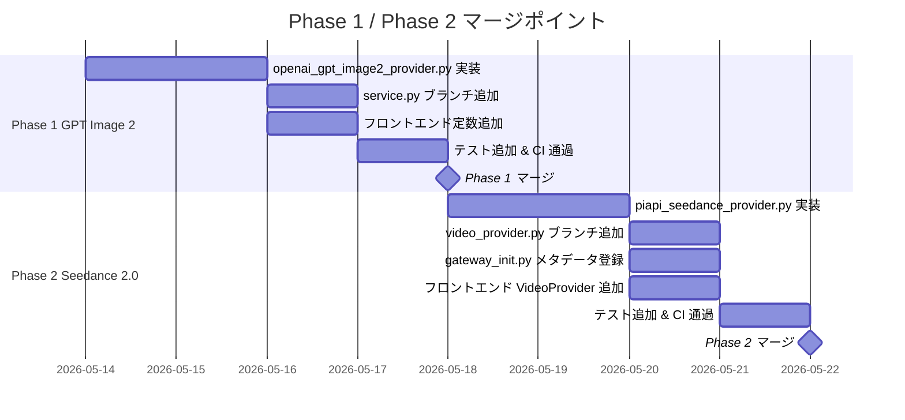

# 実装設計書: GPT Image 2 & Seedance 2.0 プロバイダー追加

**作成日**: 2026-05-13
**対象リポジトリ**: movie-project (モノレポ)
**ステータス**: Draft

---

## 合意チェックリスト

| 項目 | 内容 | 設計への反映 |
|------|------|-------------|
| スコープ (IN) | GPT Image 2 画像生成プロバイダー、Seedance 2.0 動画生成プロバイダー (PiAPI経由) | §3, §4 |
| スコープ (OUT) | ImageProviderInterface 抽象化、Seedance audio/video refs/extension、Sora 2 残骸削除、Gateway 有効化 | §10 |
| 認証 | GPT Image 2 は既存 `OPENAI_API_KEY` 使用、Seedance は既存 `PIAPI_API_KEY` 使用 | §5 |
| R2 アップロード | GPT Image 2 base64 → R2 → URL 変換必須 | §3.1 |
| Seedance audio | Phase 1 は常に `audio: false` (フィールド自体不送信) | §3.2 |
| 並行運用 | `GATEWAY_ENABLED=false` のまま維持。gateway_init.py にメタデータ登録のみ | §3.3 |
| DB マイグレーション | 不要 (検証済み、§8 参照) | §8 |
| リリース順序 | Phase 1: GPT Image 2 先行、Phase 2: Seedance | §9 |

---

## 1. 目的 / ゴール

### 出荷完了の定義

**Phase 1 (GPT Image 2)**:
- `image_provider="openai_gpt_image2"` を指定すると、OpenAI `POST /v1/images/generations` で画像生成
- 生成された base64 画像を R2 にアップロードし、URL を返却
- フロントエンドの画像プロバイダー選択UIに "GPT Image 2 (OpenAI)" が表示される
- モデレーション拒否・Org未確認エラーがユーザー向け日本語メッセージに変換される

**Phase 2 (Seedance 2.0)**:
- `VIDEO_PROVIDER=seedance` 設定時に PiAPI Seedance API でタスク作成
- 既存の `video_processor.py` ポーリングループで完了を検知し、MP4 URL を返却
- フロントエンドで Seedance がプロバイダーとして選択可能

---

## 2. アーキテクチャ概要

### 2a. GPT Image 2: generate → R2 upload → URL



### 2b. Seedance: submit → poll → URL



---

## 3. バックエンド変更

### 変更ファイル一覧

| ファイル | 変更種別 | 概要 |
|----------|----------|------|
| `app/external/openai_gpt_image2_provider.py` | **新規作成** | GPT Image 2 画像生成プロバイダー |
| `app/external/piapi_seedance_provider.py` | **新規作成** | Seedance 2.0 動画生成プロバイダー |
| `app/core/config.py` | 追記 | 新規環境変数 4件 |
| `app/videos/service.py:886` | 追記 | `openai_gpt_image2` ブランチ追加 |
| `app/external/video_provider.py:240` | 追記 | `seedance` ブランチ追加 |
| `app/external/gateway_init.py` | 追記 | Seedance メタデータ登録 |
| `app/main.py` (コメント更新) | 変更 | `/api/v1/config/video-provider` の有効値記載更新 |
| `movie-maker/lib/constants/image-generation.ts` | 追記 | `openai_gpt_image2` を `ImageProvider` 型と `IMAGE_PROVIDERS` に追加 |
| `movie-maker/lib/types/video.ts` | 追記 | `VideoProvider` 型に `'seedance'` を追加 |
| `movie-maker/lib/camera/provider-support.ts` | 追記 | Seedance のカメラワーク対応マップ追加 (prompt-fallback) |

---

### 3.1 新規ファイル: `openai_gpt_image2_provider.py`

**ファイルパス**: `movie-maker-api/app/external/openai_gpt_image2_provider.py`

参照パターン: `bfl_flux2_provider.py` のR2アップロード構造を踏襲。

```python
"""
OpenAI GPT Image 2 画像生成プロバイダー

公式 openai Python SDK を使用して gpt-image-2 モデルで画像生成する。
レスポンスは base64 のみのため、R2へのアップロードが必須。

前提条件:
- OPENAI_API_KEY が設定済みであること
- OpenAI 組織の Org Verification が完了していること（未確認時は 403 エラー）

API仕様: https://platform.openai.com/docs/api-reference/images
"""
import base64
import logging
from typing import Optional
from uuid import uuid4

from app.core.config import settings

logger = logging.getLogger(__name__)

# gpt-image-2 でサポートされるサイズ
SUPPORTED_SIZES = {
    "1024x1024", "1536x1024", "1024x1536",
    "2048x2048", "2048x1152", "3840x2160", "2160x3840", "auto",
}

# アスペクト比 → デフォルトサイズ マッピング
ASPECT_RATIO_TO_SIZE: dict[str, str] = {
    "9:16": "1024x1536",
    "16:9": "1536x1024",
    "1:1": "1024x1024",
}


class OpenAIGPTImage2Provider:
    """OpenAI GPT Image 2 画像生成プロバイダー"""

    def __init__(self) -> None:
        self.api_key: str = settings.OPENAI_API_KEY
        self.model: str = getattr(settings, "OPENAI_IMAGE_MODEL", "gpt-image-2")
        if not self.api_key:
            raise ValueError("OPENAI_API_KEY must be configured")

    async def generate_image(
        self,
        prompt: str,
        aspect_ratio: str = "9:16",
        quality: str = "auto",
        output_format: str = "png",
        size: Optional[str] = None,
        n: int = 1,
    ) -> str:
        """
        GPT Image 2 で画像を生成し R2 URL を返す

        Args:
            prompt: 英語プロンプト（事前翻訳済み）
            aspect_ratio: アスペクト比 ("9:16", "16:9", "1:1")
            quality: 品質 ("low", "medium", "high", "auto")
            output_format: 出力形式 ("png", "jpeg", "webp")
            size: サイズ（Noneの場合 aspect_ratio から自動決定）
            n: 生成枚数

        Returns:
            str: R2 にアップロードされた画像の公開 URL

        Raises:
            ValueError: 生成失敗 / モデレーション拒否 / Org未確認
        """
        # TODO: implement per Design Doc §3.1
        pass

    async def _upload_to_r2(self, image_bytes: bytes, output_format: str) -> str:
        """
        画像バイトを R2 にアップロードし公開 URL を返す

        Args:
            image_bytes: base64デコード済みバイト列
            output_format: 拡張子決定用 ("png", "jpeg", "webp")

        Returns:
            str: R2 公開 URL
        """
        # TODO: implement per Design Doc §3.1
        # upload_image(image_bytes, f"generated/gpt2_{uuid4().hex}.{output_format}") を使用
        pass

    def _resolve_size(self, aspect_ratio: str, size: Optional[str]) -> str:
        """アスペクト比またはサイズ指定を解決する"""
        if size and size in SUPPORTED_SIZES:
            return size
        return ASPECT_RATIO_TO_SIZE.get(aspect_ratio, "auto")
```

#### エラーマッピング（`generate_image` 内）

| 例外・HTTP ステータス | ユーザー向けメッセージ |
|----------------------|----------------------|
| HTTP 403 (org_verification) | `"OpenAI の組織確認が完了していません。OpenAI ダッシュボードで Org Verification を完了してください。"` |
| HTTP 400 / content_policy_violation | `"画像の生成がコンテンツポリシーにより拒否されました。プロンプトを変更して再試行してください。"` |
| HTTP 429 (rate_limit) | `"OpenAI APIのレート制限に達しました。しばらく待ってから再試行してください。"` |
| その他 HTTP エラー | `f"GPT Image 2 API エラー: {status_code}"` |
| SDK 例外 | `f"画像生成に失敗しました: {str(e)}"` |

---

### 3.2 新規ファイル: `piapi_seedance_provider.py`

**ファイルパス**: `movie-maker-api/app/external/piapi_seedance_provider.py`

参照パターン: `piapi_kling_provider.py` の認証・タスク作成・check_status・get_video_url パターンを踏襲。

```python
"""
PiAPI Seedance 2.0 Video Provider

PiAPI経由で Seedance 2.0 モデルによる動画生成を行うプロバイダー。
VideoProviderInterface を実装。

認証: PIAPI_API_KEY (既存設定と共用)
Phase 1 制限:
  - audio は常に OFF（APIに送信しない）
  - video_references / audio_references / parent_task_id は未対応
  - VIP以外 (standard) は480p のみ

API: POST/GET https://api.piapi.ai/api/v1/task
"""
import logging
from typing import Optional

import httpx

from app.core.config import settings
from app.external.video_provider import (
    VideoGenerationStatus,
    VideoProviderError,
    VideoProviderInterface,
    VideoStatus,
)

logger = logging.getLogger(__name__)

PIAPI_BASE_URL = "https://api.piapi.ai/api/v1"


class PiAPISeedanceProvider(VideoProviderInterface):
    """PiAPI Seedance 2.0 動画生成プロバイダー"""

    def __init__(self) -> None:
        self.api_key: str = getattr(settings, "PIAPI_API_KEY", "")
        self.task_type: str = getattr(
            settings, "PIAPI_SEEDANCE_TASK_TYPE", "seedance-2-preview-vip"
        )
        self.resolution: str = getattr(
            settings, "PIAPI_SEEDANCE_RESOLUTION", "720p"
        )
        if not self.api_key:
            raise ValueError("PIAPI_API_KEY must be configured")

    @property
    def provider_name(self) -> str:
        return "seedance"

    @property
    def supports_t2v(self) -> bool:
        """Seedance は T2V をサポート（image_urls を省略）"""
        return True

    def _get_headers(self) -> dict[str, str]:
        return {
            "x-api-key": self.api_key,
            "Content-Type": "application/json",
        }

    async def generate_video(
        self,
        image_url: str,
        prompt: str,
        duration: int = 5,
        aspect_ratio: str = "9:16",
        camera_work: Optional[str] = None,
    ) -> str:
        """
        Seedance 2.0 で画像+プロンプトから動画を生成

        Args:
            image_url: 先頭フレーム画像 URL
            prompt: 動画生成プロンプト（最大4000文字）
            duration: 動画長さ（5 | 10 | 15 秒）
            aspect_ratio: アスペクト比 ("9:16" | "16:9" | "4:3" | "3:4")
            camera_work: 無視（Seedanceはプロンプト追従のみ）

        Returns:
            str: task_id

        Raises:
            VideoProviderError: タスク作成失敗
        """
        # TODO: implement per Design Doc §3.2
        pass

    async def generate_video_from_text(
        self,
        prompt: str,
        duration: int = 5,
        aspect_ratio: str = "9:16",
    ) -> str:
        """
        Seedance T2V: image_urls を送信しない

        Returns:
            str: task_id
        """
        # TODO: implement per Design Doc §3.2
        pass

    async def check_status(self, task_id: str) -> VideoStatus:
        """
        PiAPI タスクステータスを確認
        piapi_kling_provider.py の check_status と同じパターン

        PiAPI ステータス → VideoGenerationStatus マッピング:
            Pending / Staged  → PENDING
            Processing        → PROCESSING
            Completed         → COMPLETED
            Failed            → FAILED

        video URL は data.output.video フィールドから取得
        """
        # TODO: implement per Design Doc §3.2
        pass

    async def get_video_url(self, task_id: str) -> Optional[str]:
        """check_status() から video_url を返す"""
        # TODO: implement per Design Doc §3.2
        pass
```

#### Seedance リクエストボディ仕様

```json
{
  "model": "seedance",
  "task_type": "{PIAPI_SEEDANCE_TASK_TYPE}",
  "input": {
    "prompt": "<4000文字以内>",
    "duration": 5,
    "aspect_ratio": "9:16",
    "image_urls": ["<image_url>"],
    "resolution": "{PIAPI_SEEDANCE_RESOLUTION}"
  },
  "config": {
    "service_mode": "public"
  }
}
```

**注意**: `audio` フィールドは Phase 1 では**送信しない**（デフォルトOFF）。

#### duration 変換

`VideoProviderInterface.generate_video()` は `duration: int` を受け取るが、Seedance は `5 | 10 | 15` のみ許容。
受け取った値を最近傍の許容値にクランプする:

```python
VALID_DURATIONS = [5, 10, 15]
duration = min(VALID_DURATIONS, key=lambda d: abs(d - duration))
```

#### カメラワーク

Seedance は API レベルのカメラ制御パラメータなし。`camera_work` 引数は無視してログ警告のみ出力。
フロントエンドでは `getCameraSupportLevel('*', 'seedance')` が `'prompt'` を返すよう設定（§4 参照）。

#### Seedance エラーマッピング（`check_status` 内）

| 条件 | ユーザー向けメッセージ |
|------|----------------------|
| `"credit"` / `"balance"` in error | `"PiAPI のクレジットが不足しています。"` |
| `"rate"` / `"limit"` in error | `"API レート制限に達しました。しばらく待ってから再試行してください。"` |
| `"queue"` in error | `"サーバーが混雑しています（09:00–15:00 GMT はピーク時間帯）。しばらく後に再試行してください。"` |
| `"nsfw"` / `"content"` in error | `"コンテンツポリシーに違反する可能性があります。プロンプトや画像を確認してください。"` |
| その他 | raw error message をそのまま返す |

---

### 3.3 既存ファイル変更

#### `app/core/config.py` — 追記する設定値

```python
# OpenAI Image Generation
OPENAI_IMAGE_MODEL: str = "gpt-image-2"

# PiAPI Seedance Settings
PIAPI_SEEDANCE_TASK_TYPE: str = "seedance-2-preview-vip"  # or "seedance-2-preview"
PIAPI_SEEDANCE_RESOLUTION: str = "720p"  # "720p" or "1080p" (VIP tier)
```

参照: `movie-maker-api/app/core/config.py` の `PIAPI_KLING_*` ブロック直下に追記。

#### `app/videos/service.py:886` — `openai_gpt_image2` ブランチ追加

`generate_image_from_text()` 内、`if image_provider == "bfl_flux2_pro":` ブロックの**前**に挿入:

```python
# OpenAI GPT Image 2 プロバイダー
if image_provider == "openai_gpt_image2":
    from app.external.openai_gpt_image2_provider import OpenAIGPTImage2Provider

    # 1. 入力テキストを決定
    if free_text_description:
        prompt_ja = free_text_description
    elif structured_input:
        prompt_ja = _structured_input_to_text(structured_input)
    else:
        raise ValueError("プロンプトが指定されていません")

    # 2. 日本語→英語翻訳
    prompt_en = await _translate_text_to_english(prompt_ja)

    # 3. GPT Image 2 で画像生成（R2 URL が返る）
    provider = OpenAIGPTImage2Provider()
    image_url = await provider.generate_image(
        prompt=prompt_en,
        aspect_ratio=aspect_ratio,
    )

    # 4. R2 key の抽出（URLからパス部分を逆算）
    r2_key = image_url.split("/", 3)[-1] if "/" in image_url else f"generated/gpt2_{uuid4().hex}.png"

    logger.info(f"GPT Image 2 generation completed: {image_url}")
    return {
        "image_url": image_url,
        "generated_prompt_ja": prompt_ja,
        "generated_prompt_en": prompt_en,
        "r2_key": r2_key,
        "width": None,   # GPT Image 2 はレスポンスにサイズ情報なし
        "height": None,
        "aspect_ratio": aspect_ratio,
        "image_provider": image_provider,
    }
```

参照: `movie-maker-api/app/videos/service.py:886–951` の `bfl_flux2_pro` ブロックを構造的に模倣。

#### `app/external/video_provider.py:240` — `seedance` ブランチ追加

`get_video_provider()` 内、`elif provider_name == "piapi_kling":` ブロックの直後に挿入:

```python
elif provider_name == "seedance":
    from app.external.piapi_seedance_provider import PiAPISeedanceProvider
    logger.info("Using PiAPI Seedance video provider")
    return PiAPISeedanceProvider()
```

`get_video_provider()` の docstring の provider_name 列挙に `"seedance"` を追記。

#### `app/external/gateway_init.py` — Seedance メタデータ登録

`init_gateway()` 内、既存の `hailuo` ブロックの直後に追記（`GATEWAY_ENABLED=false` のまま、将来の flip 備え）:

```python
try:
    from app.external.piapi_seedance_provider import PiAPISeedanceProvider
    registry.register(
        ModelMetadata(
            name="seedance",
            provider="piapi",
            capabilities=["i2v", "t2v"],
            quality_score=8,
            speed_score=6,
            cost_per_second=0.20,  # 720p VIP tier
        ),
        PiAPISeedanceProvider(),
    )
    logger.info("Gateway: Registered seedance provider")
except Exception as e:
    logger.debug(f"Gateway: Skipped seedance provider: {e}")
```

参照: `movie-maker-api/app/external/gateway_init.py:86–101` の hailuo 登録パターン。

---

## 4. フロントエンド変更

### 4.1 `movie-maker/lib/constants/image-generation.ts`

#### `ImageProvider` 型拡張 (line 9)

```typescript
// 変更前
export type ImageProvider = "nanobanana" | "bfl_flux2_pro";

// 変更後
export type ImageProvider = "nanobanana" | "bfl_flux2_pro" | "openai_gpt_image2";
```

#### `IMAGE_PROVIDERS` 配列に新規エントリ追加 (line 31 の `] as const;` の直前)

```typescript
  {
    value: "openai_gpt_image2" as const,
    label: "GPT Image 2 (OpenAI)",
    maxLength: 32000,
    description: "OpenAI 最新モデル・高解像度 (Phase 1 は text-to-image のみ)",
    supportsStructuredInput: false,
    // Phase 1 は /generations のみ。/edits は Phase 3+ で実装するため false 固定。
    // /edits 実装時に true に切り替え、`maxReferenceImages` を有効化すること。
    supportsReferenceImage: false,
    // maxReferenceImages: 1,  // Phase 3+ で /edits 実装時に有効化
  },
```

**注意**: `supportsStructuredInput: false` のため、`scene-image-generator-modal.tsx` は
`supportsStructuredInput(provider)` ガードにより自動的に構造化入力フォームを非表示にする。
UIコード自体の変更は不要（定数ファイル変更のみで自動反映）。

### 4.2 `movie-maker/lib/types/video.ts`

#### `VideoProvider` 型拡張 (line 45)

```typescript
// 変更前
export type VideoProvider = 'runway' | 'veo' | 'domoai' | 'piapi_kling' | 'hailuo';

// 変更後
export type VideoProvider = 'runway' | 'veo' | 'domoai' | 'piapi_kling' | 'hailuo' | 'seedance';
```

#### `VIDEO_PROVIDERS` 配列に新規エントリ追加

```typescript
  {
    value: "seedance" as const,
    label: "Seedance 2.0",
    description: "ByteDance製・高品質I2V/T2V (PiAPI経由)",
  },
```

### 4.3 `movie-maker/lib/camera/provider-support.ts`

`getCameraSupportLevel()` 内の `switch` ブロックに `seedance` ケース追加:

```typescript
case 'seedance':
  // Seedance はAPIレベルのカメラ制御なし。プロンプト追従のみ。
  return 'prompt';
```

**挿入位置**: `case 'domoai':` ブロックの直後 (provider-support.ts:99 付近)。

---

## 5. 設定 / 環境変数

### `.env.example` への追記

```dotenv
# OpenAI Image Generation (GPT Image 2)
# 注意: OpenAI Org Verification が完了していることが必要
OPENAI_IMAGE_MODEL=gpt-image-2

# PiAPI Seedance 2.0 Settings
# task_type: "seedance-2-preview" (480p/standard) or "seedance-2-preview-vip" (720p/1080p)
PIAPI_SEEDANCE_TASK_TYPE=seedance-2-preview-vip
# resolution: "720p" (VIP) or "1080p" (VIP, 高コスト $0.50/s)
PIAPI_SEEDANCE_RESOLUTION=720p
```

### 既存 `.env` 変数（追加設定不要）

| 変数名 | 用途 | 備考 |
|--------|------|------|
| `OPENAI_API_KEY` | GPT Image 2 認証 | 既存 |
| `PIAPI_API_KEY` | Seedance 認証 | 既存 |
| `VIDEO_PROVIDER` | Seedance 有効化時は `seedance` に変更 | 既存 |

---

## 6. エラーハンドリング

### 6.1 GPT Image 2 エラーパターン

| シナリオ | 検出方法 | ユーザー向けメッセージ |
|----------|----------|----------------------|
| **Org Verification 未完了** | `openai.PermissionDeniedError` / HTTP 403 | `"OpenAI の組織確認が完了していません。OpenAI ダッシュボードで Org Verification を完了してください。"` |
| **モデレーション拒否** | `openai.BadRequestError` + `"content_policy_violation"` in error code | `"画像の生成がコンテンツポリシーにより拒否されました。プロンプトを変更して再試行してください。"` |
| **レート制限** | `openai.RateLimitError` / HTTP 429 | `"OpenAI API のレート制限に達しました。しばらく待ってから再試行してください。"` |
| **R2 アップロード失敗** | `boto3.ClientError` | `"生成された画像のアップロードに失敗しました。再試行してください。"` |
| **その他 API エラー** | `openai.APIError` | `f"GPT Image 2 API エラー: {e.status_code}"` |

### 6.2 Seedance エラーパターン

| シナリオ | 検出方法 | ユーザー向けメッセージ |
|----------|----------|----------------------|
| **クォータ枯渇** | HTTP 402 / `"credit"` in error message | `"PiAPI のクレジットが不足しています。"` |
| **レート制限** | HTTP 429 / `"rate"` in error | `"API レート制限に達しました。しばらく待ってから再試行してください。"` |
| **ピーク時間帯キュー** | `"queue"` in error | `"サーバーが混雑しています（09:00–15:00 GMT はピーク時間帯）。しばらく後に再試行してください。"` |
| **タスク Failed** | `data.status == "Failed"` | エラー詳細に応じて §3.2 マッピング適用 |
| **ネットワークエラー** | `httpx.HTTPStatusError` | `f"Seedance API エラー: {e.response.status_code}"` |

---

## 7. テスト計画

### 追加するテストファイル

| テストファイル | テスト対象 | パターン |
|----------------|------------|---------|
| `tests/videos/test_openai_gpt_image2_provider.py` | `OpenAIGPTImage2Provider` | `test_text_to_image.py` を参照 |
| `tests/videos/test_piapi_seedance_provider.py` | `PiAPISeedanceProvider` | `test_text_to_image.py` を参照 |

### テストケース仕様

#### `test_openai_gpt_image2_provider.py`

```
test_generate_image_success:
  - openai.Client をモック（data[0].b64_json = "base64string"）
  - upload_image をモック（"https://r2.example/generated/gpt2_xxx.png" を返す）
  - 戻り値が R2 URL であることを assert

test_generate_image_moderation_rejected:
  - openai.BadRequestError(content_policy_violation) を raise するモック
  - ValueError に "コンテンツポリシー" が含まれることを assert

test_generate_image_org_not_verified:
  - openai.PermissionDeniedError を raise するモック
  - ValueError に "Org Verification" が含まれることを assert

test_resolve_size_from_aspect_ratio:
  - "9:16" → "1024x1536"
  - "16:9" → "1536x1024"
  - "1:1" → "1024x1024"
```

#### `test_piapi_seedance_provider.py`

```
test_generate_video_success:
  - httpx をモック（POST /api/v1/task → { data: { task_id: "seed_123" } }）
  - 戻り値が "seed_123" であることを assert

test_check_status_completed:
  - GET /api/v1/task/seed_123 → { data: { status: "Completed", output: { video: "mp4_url" } } }
  - VideoStatus(COMPLETED, 100, video_url="mp4_url") が返ることを assert

test_check_status_failed_credit:
  - { data: { status: "Failed", error: { message: "insufficient credit balance" } } }
  - error_message に "クレジット" が含まれることを assert

test_duration_clamping:
  - duration=7 → task body に duration=5 が設定されること
  - duration=12 → task body に duration=10 が設定されること

test_camera_work_ignored:
  - camera_work="zoom_in" を渡しても request body に camera_control が含まれないこと
```

**CI 方針**: 実 API コールなし。`pytest-asyncio` + `respx` (または `unittest.mock.AsyncMock`) でモック。

---

## 8. DB マイグレーション要否

### 検証結果: マイグレーション不要

`video_generations` テーブルの `provider` カラムは TEXT 型（CHECK 制約なし）のため、新しいプロバイダー名 (`"seedance"`) は既存スキーマに追加変更なしで保存可能。
`generation_mode` カラム (`20260315_add_t2v_support.sql` で追加) も `i2v`/`t2v` 両対応済み。

画像生成結果は `user_image_library` テーブルに保存されるが、`image_provider` カラムは TEXT 型のため同様に追加不要。

**結論**: `docs/migrations/` への新規ファイル追加は不要。

---

## 9. 段階リリース計画



### Phase 1: GPT Image 2 (先行)

**マージ条件**:
- `test_openai_gpt_image2_provider.py` 全テスト PASS
- `image_provider="openai_gpt_image2"` で画像が R2 に保存されることを手動確認
- モデレーション拒否・Org エラーが日本語メッセージで返ることを確認

### Phase 2: Seedance 2.0

**マージ条件**:
- `test_piapi_seedance_provider.py` 全テスト PASS
- `VIDEO_PROVIDER=seedance` で動画タスクが作成されることを手動確認（PiAPI ダッシュボードで確認）
- `gateway_init.py` 変更が `GATEWAY_ENABLED=false` 時に影響がないことを確認

**両 Phase 共通**:
- `pytest` 既存テスト失敗なし（既知の既存失敗 2件は除く）

---

## 10. スコープ外 / Follow-ups

以下は本実装の対象外。別タスクで対応すること。

### Sora 2 残骸削除

以下のファイルに Sora 2 関連の記述が残っている（削除前に内容確認が必要）:

| ファイル | 性質 | 対応方針 |
|----------|------|---------|
| `docs/runway_anime_best_practices.md` | Sora 2 記述混在の可能性 | 内容確認後に該当箇所を削除 |
| `docs/prompt.md` | Sora 2 プロバイダー記述 | 内容確認後に削除 |
| `docs/prompt/scene/anime/runway_anime_best_practices.md` | 同上 | 内容確認後に削除 |
| `movie-maker/components/video/voice-selector.test.tsx` | テスト内の Sora 2 参照 | テスト修正または削除 |

### 未対応機能

| 機能 | 理由 |
|------|------|
| `ImageProviderInterface` 抽象化 | Sora 2 廃止により元々の動機消滅。現在のアドホック dispatch で問題なし |
| Seedance audio / video refs / extension | Phase 2 以降で PiAPI VIP アカウント確認後に実装 |
| Seedance `-fast` variants | 品質評価後に追加 |
| Gateway 有効化 (`GATEWAY_ENABLED=true`) | コスト・安定性評価後に別 ADR で決定 |
| GPT Image 2 `/edits` エンドポイント | Phase 1 では `/generations` のみ実装。`supportsReferenceImage` は `false` 固定。Phase 3+ で `/edits` 実装と同時に `true` 化 + `maxReferenceImages` 有効化 |

---

## 11. リスク

| リスク | 影響度 | 対策 |
|--------|--------|------|
| **OpenAI Org Verification 未完了** | 高: GPT Image 2 が一切使用不可 | デプロイ前に OpenAI ダッシュボードで組織確認を完了すること (前提条件として明示) |
| **PiAPI Seedance ピーク時間帯遅延** (09:00–15:00 GMT) | 中: タスクが数分〜十数分キューに溜まる | polling タイムアウトを既存より長め (最大20分) に設定。エラーメッセージにピーク時間帯を案内 |
| **Seedance "2-preview" 名称変更** | 中: `task_type` が無効になり全タスク失敗 | `PIAPI_SEEDANCE_TASK_TYPE` を環境変数化して対応。PiAPI のリリースノートを監視 |
| **GPT Image 2 課金単価** | 低〜中: 既存プロバイダーより高コストの可能性 | `quality="low"` または `quality="medium"` をデフォルトにするか検討 (現在は `"auto"`) |
| **Seedance 1080p VIP 高コスト** ($0.50/s) | 中: 10秒動画で $5 | デフォルト設定を `720p` ($0.20/s) に固定 (§5 参照)。1080p は環境変数で明示的に有効化 |

---

## 変更影響マップ

```yaml
Change Target 1: OpenAIGPTImage2Provider (新規)
  Direct Impact:
    - app/external/openai_gpt_image2_provider.py (新規作成)
    - app/videos/service.py:886 (分岐追加)
    - app/core/config.py (OPENAI_IMAGE_MODEL 追加)
    - movie-maker/lib/constants/image-generation.ts (型・定数追加)
  Indirect Impact:
    - scene-image-generator-modal.tsx (定数から自動取得のため変更不要)
  No Ripple Effect:
    - video_processor.py (動画生成ポーリング)
    - VideoProviderInterface 実装クラス群

Change Target 2: PiAPISeedanceProvider (新規)
  Direct Impact:
    - app/external/piapi_seedance_provider.py (新規作成)
    - app/external/video_provider.py:240 (get_video_provider() 分岐)
    - app/external/gateway_init.py (メタデータ登録)
    - app/core/config.py (PIAPI_SEEDANCE_* 追加)
    - movie-maker/lib/types/video.ts (VideoProvider 型)
    - movie-maker/lib/camera/provider-support.ts (getCameraSupportLevel())
  Indirect Impact:
    - app/tasks/video_processor.py (ポーリングループは VideoProviderInterface に依存するため影響なし)
  No Ripple Effect:
    - GPT Image 2 実装
    - 画像生成パイプライン
```

---

## 統合境界コントラクト

```yaml
境界 1: service.py → OpenAIGPTImage2Provider
  Input: prompt (str, 英語翻訳済み), aspect_ratio (str), quality (str, default "auto")
  Output: str (R2 公開 URL) [同期 await]
  On Error: ValueError を raise（日本語メッセージ付き）

境界 2: video_processor.py → PiAPISeedanceProvider.check_status()
  Input: task_id (str)
  Output: VideoStatus [同期 await]
  On Error: VideoStatus(FAILED, error_message=...) を返す（例外は呑む）

境界 3: PiAPISeedanceProvider → PiAPI REST API
  Input: POST /api/v1/task (JSON body)
  Output: { data: { task_id: str } } [非同期 HTTP]
  On Error: httpx.HTTPStatusError → VideoProviderError に変換

境界 4: OpenAIGPTImage2Provider → R2
  Input: image_bytes (bytes), filename (str)
  Output: str (R2 URL) [同期 await]
  On Error: boto3.ClientError → ValueError に変換
```

---

## References

- [OpenAI Images API Reference](https://platform.openai.com/docs/api-reference/images) - gpt-image-2 エンドポイント仕様
- [OpenAI GPT Image 2 Guide](https://platform.openai.com/docs/guides/image-generation) - モデル機能・Org Verification 要件
- [PiAPI Seedance API Documentation](https://piapi.ai/docs/video/seedance) - Seedance 2.0 タスク仕様
- [PiAPI Task Lifecycle](https://piapi.ai/docs/general/task-lifecycle) - Pending/Processing/Completed/Failed ステータス
- [Cloudflare R2 with boto3](https://developers.cloudflare.com/r2/api/s3/api/) - S3互換 API リファレンス
