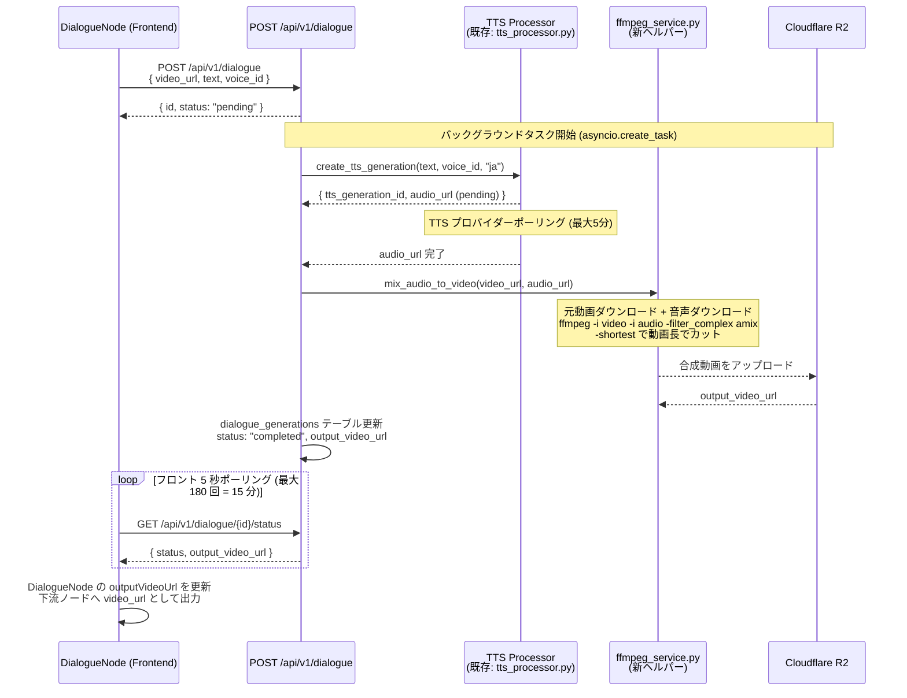
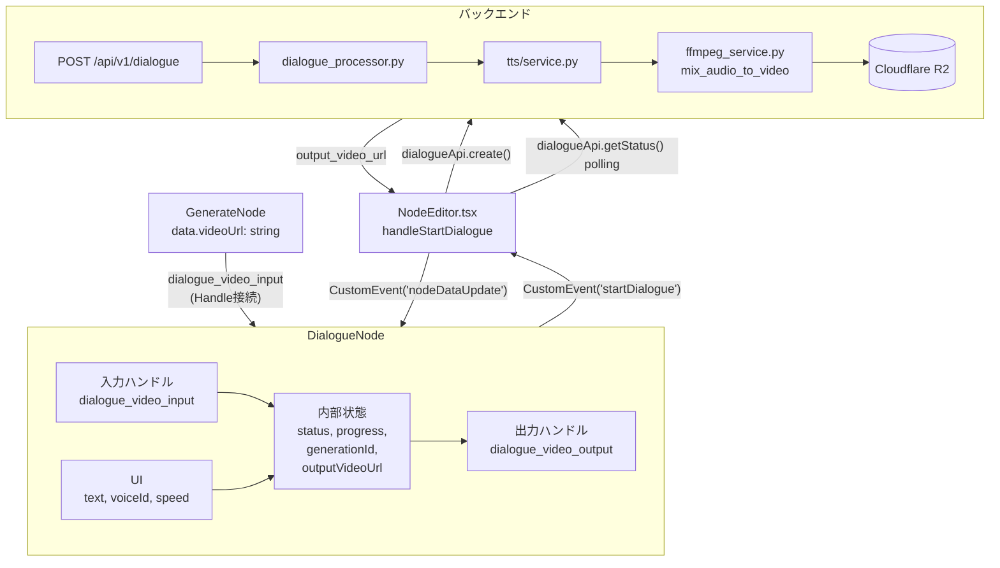

# Design Doc: Dialogue ノード実装

- **作成日**: 2026-05-14
- **ステータス**: Draft
- **対象バージョン**: movie-maker (Next.js 16 / React 19), movie-maker-api (FastAPI, Python 3.11+)

---

## 1. 目的 / ゴール

ノードエディタに `DialogueNode` を追加し、GenerateNode が生成した動画に日本語セリフ (TTS 音声) を ffmpeg でミックスして出力する Pipeline 型ノードを提供する。

**出荷完了の定義**: DialogueNode をキャンバスに配置し、GenerateNode の出力動画に接続してセリフを入力・実行すると、TTS 音声がミックスされた合成動画 URL が DialogueNode から出力される。

---

## 2. 合意チェックリスト

| 項目 | 合意内容 | 設計への反映箇所 |
|------|---------|----------------|
| ノード型 | Pipeline 型 (入力: video URL、出力: 合成後 video URL) | §4 フロントエンド: handle 設計 |
| 音声合成方式 | TTS のみ (リップシンクなし) | §3 バックエンド: processor 設計 |
| デフォルト声 | `/api/v1/tts/voices` から動的リスト取得 | §4 DialogueNode.tsx 骨格 |
| 音声ミックス方針 | 元音声を保持して被せる (overlay) | §3 ffmpeg ヘルパー |
| 長さ不一致 | 動画長でカット (`-shortest`) | §3 ffmpeg ヘルパー |
| 言語 | `language: "ja"` 固定 | §3 Pydantic schemas |
| リップシンク UI 注記 | ノードに注意書き表示 | §4 DialogueNode.tsx 骨格 |
| タイムアウト | BE: 10 分、FE: 15 分 | §4 API クライアント |
| DB テーブル | `dialogue_generations` を新設 | §8 DB マイグレーション |

**スコープ外 (今回実装しない)**:
- Hedra リップシンク統合
- 複数セリフ
- 音声タイミング指定
- BGM との音量バランス自動調整
- 言語自動判定・英語対応
- セリフのトリミング・編集 UI

---

## 3. アーキテクチャ概要



---

## 4. 既存コードベース分析

### 調査ファイル一覧

| ファイル | 役割 | 参照箇所 |
|---------|------|---------|
| `movie-maker/components/node-editor/nodes/BGMNode.tsx` | source 型ノードの参考実装 | CustomEvent パターン, Handle 定義 |
| `movie-maker/components/node-editor/nodes/OverlayNode.tsx` | source 型ノードの参考実装 | updateNodeData パターン |
| `movie-maker/components/node-editor/utils/node-types.ts` | `nodeTypes` マップ登録箇所 | L25-44 |
| `movie-maker/components/node-editor/NodePalette.tsx` | パレット登録 | `NODE_ITEMS` 配列 L33-158 |
| `movie-maker/components/node-editor/nodes/index.ts` | export 一覧 | L18-21 (Phase 3 後処理ノード) |
| `movie-maker/lib/types/node-editor.ts` | 型定義 + `createDefaultNodeData` | L140-183 (後処理), L221-348 |
| `movie-maker/components/node-editor/NodeEditor.tsx` | `handleStartGeneration` パターン | L274-418 (ポーリングロジック) |
| `movie-maker/lib/api/client.ts` | `fetchWithAuth` / API クライアント | L1-86 (共通), L119-143 (`videosApi`) |
| `movie-maker-api/app/tts/router.py` | TTS 内部サービス呼び出し | L13-14 (service import) |
| `movie-maker-api/app/tts/service.py` | `create_tts_generation` シグネチャ | L15-49 |
| `movie-maker-api/app/tasks/tts_processor.py` | バックグラウンドタスクパターン | L20-123 (process_tts_generation) |
| `movie-maker-api/app/services/ffmpeg_service.py` | ffmpeg ラッパーパターン | L78-185 (add_text_overlay 構造) |
| `movie-maker-api/app/core/config.py` | `TTS_PROVIDER` 環境変数 | L88-90 |
| `docs/migrations/20260315_tts_generations.sql` | DB テーブル構造の参考 | RLS, インデックス, トリガー |

### 類似コンポーネント検索結果

- **BGMNode.tsx** — 後処理 source 型。`Handle type="source"` のみ、データ更新は `CustomEvent('nodeDataUpdate')` で伝達。**DialogueNode は Pipeline 型 (入力＋出力 Handle 両持ち)** であり、BGM パターンとは異なる。
- **GenerateNode.tsx** — 実行ロジックを内包する executor 型。DialogueNode は同様の「実行・ポーリング」ロジックを自己完結させる設計を採用する。

### 類似コンポーネント判定

既存の "Pipeline 型" (入力 video URL → 処理 → 出力 video URL) コンポーネントは現時点で **存在しない**。新規実装を行う。ただし実装骨格は BGMNode + GenerateNode のパターンを組み合わせて踏襲する。

---

## 5. バックエンド変更

### 5-1. 新規ディレクトリ構造

```
movie-maker-api/app/
├── dialogue/            # 新規ドメイン
│   ├── __init__.py
│   ├── router.py        # POST /dialogue, GET /dialogue/{id}/status
│   ├── schemas.py       # Pydantic モデル
│   └── service.py       # CRUD
└── tasks/
    └── dialogue_processor.py   # 新規バックグラウンドタスク
```

`app/main.py` に以下を追加:
```python
from app.dialogue.router import router as dialogue_router
app.include_router(dialogue_router, prefix="/api/v1")
```

### 5-2. Pydantic スキーマ (`app/dialogue/schemas.py`)

```python
from typing import Optional, Literal
from pydantic import BaseModel, Field

DialogueStatus = Literal["pending", "processing", "completed", "failed"]


class DialogueCreateRequest(BaseModel):
    """Dialogue 生成リクエスト"""
    video_url: str = Field(..., description="入力動画の公開 URL (R2 等)")
    text: str = Field(..., min_length=1, max_length=5000, description="セリフテキスト")
    voice_id: str = Field(..., description="TTS 音声 ID")
    # language は "ja" 固定。UI には表示しないが API レベルでは保持
    language: str = Field(default="ja", description="言語コード (固定: ja)")
    speed: float = Field(default=1.0, ge=0.25, le=4.0, description="読み上げ速度")


class DialogueCreateResponse(BaseModel):
    """Dialogue 生成起動レスポンス"""
    id: str
    status: DialogueStatus
    created_at: str


class DialogueStatusResponse(BaseModel):
    """Dialogue 生成ステータスレスポンス"""
    id: str
    status: DialogueStatus
    output_video_url: Optional[str] = None
    error_message: Optional[str] = None
```

### 5-3. ルーター (`app/dialogue/router.py`) — シグネチャのみ

```python
"""Dialogue (TTS ミックス) ルーター"""

from fastapi import APIRouter, Depends, HTTPException
from app.core.dependencies import get_current_user
from app.dialogue.schemas import (
    DialogueCreateRequest,
    DialogueCreateResponse,
    DialogueStatusResponse,
)
from app.dialogue.service import create_dialogue_generation, get_dialogue_status
from app.tasks.dialogue_processor import start_dialogue_processing

router = APIRouter(tags=["dialogue"])


@router.post("/dialogue", response_model=DialogueCreateResponse)
async def create_dialogue(
    request: DialogueCreateRequest,
    current_user: dict = Depends(get_current_user),
):
    """
    Dialogue 生成を開始する

    動画 URL + セリフテキスト → TTS → ffmpeg ミックス → 合成動画 URL
    """
    user_id = current_user["user_id"]
    # TODO: create_dialogue_generation でレコード作成
    # TODO: start_dialogue_processing(generation_id) でバックグラウンドタスク起動
    # TODO: DialogueCreateResponse を返す
    ...


@router.get("/dialogue/{generation_id}/status", response_model=DialogueStatusResponse)
async def get_status(
    generation_id: str,
    current_user: dict = Depends(get_current_user),
):
    """Dialogue 生成のステータスを返す"""
    user_id = current_user["user_id"]
    # TODO: get_dialogue_status(user_id, generation_id)
    # TODO: None なら 404
    ...
```

### 5-4. サービス (`app/dialogue/service.py`) — シグネチャのみ

```python
async def create_dialogue_generation(
    user_id: str,
    video_url: str,
    text: str,
    voice_id: str,
    language: str = "ja",
    speed: float = 1.0,
) -> dict:
    """dialogue_generations テーブルにレコードを作成して返す"""
    # TODO: supabase.table("dialogue_generations").insert(...)
    ...


async def get_dialogue_status(user_id: str, generation_id: str) -> dict | None:
    """dialogue_generations からステータスを取得する"""
    # TODO: supabase.table("dialogue_generations").select(...).eq("id", ...).eq("user_id", ...)
    ...


async def update_dialogue_status(
    generation_id: str,
    status: str,
    output_video_url: str | None = None,
    error_message: str | None = None,
) -> None:
    """ステータスを更新する（バックグラウンドタスクから呼ぶ）"""
    # TODO: supabase.table("dialogue_generations").update(...)
    ...
```

### 5-5. バックグラウンドタスク (`app/tasks/dialogue_processor.py`) — 骨格

参考: `app/tasks/tts_processor.py` の `process_tts_generation` パターン

```python
"""
Dialogue (TTS + ffmpeg ミックス) バックグラウンドタスク

フロー:
  1. dialogue_generations レコード取得
  2. TTS 生成 (app/tts/service.py を直接呼び出し + tts_processor を awaiting)
  3. R2 から元動画ダウンロード
  4. ffmpeg_service.mix_audio_to_video() でミックス
  5. R2 にアップロード
  6. dialogue_generations を completed に更新
"""

import asyncio
import logging
import tempfile

from app.core.supabase import get_supabase
from app.dialogue.service import update_dialogue_status
from app.services.ffmpeg_service import get_ffmpeg_service, FFmpegError

logger = logging.getLogger(__name__)

# バックエンドは 10 分でタイムアウト
PROCESSING_TIMEOUT_SECONDS = 600


async def process_dialogue_generation(generation_id: str) -> None:
    """
    Dialogue 生成のメイン処理 (バックグラウンドで実行)

    Steps:
      1. DB からレコード取得
      2. TTS 生成を内部呼び出し (create_tts_generation + start_tts_processing)
      3. TTS 完了をポーリング (最大 5 分)
      4. 元動画 + 音声を一時ファイルにダウンロード
      5. ffmpeg_service.mix_audio_to_video() でセリフ音声をミックス
      6. 合成動画を R2 にアップロード
      7. completed に更新
    """
    # TODO: ステータスを processing に更新
    # TODO: _run_tts_and_get_audio_url(record) → audio_url
    # TODO: _download_file(video_url) → local_video_path
    # TODO: _download_file(audio_url) → local_audio_path
    # TODO: ffmpeg_service.mix_audio_to_video(local_video_path, local_audio_path, output_path)
    # TODO: r2_client.upload_video(output_path) → output_video_url
    # TODO: update_dialogue_status(generation_id, "completed", output_video_url=...)
    ...


async def _run_tts_and_get_audio_url(
    text: str,
    voice_id: str,
    language: str,
    speed: float,
    user_id: str,
) -> str:
    """
    TTS を内部的に実行して audio_url を返す

    既存の TTS サービスを HTTP 経由ではなく直接関数呼び出しで使用する。
    参考: app/tts/service.py の create_tts_generation + app/tasks/tts_processor.py
    """
    # TODO: 1. create_tts_generation(user_id, TTSCreateRequest(text, voice_id, language, speed)) → tts_record
    # TODO: 2. await process_tts_generation(tts_record.generation_id)  ← 直列実行 (B3 解決済み)
    #         この時点で DB に completed/failed が書き込まれている。
    # TODO: 3. status_response = await get_tts_status(user_id, tts_record.generation_id)
    # TODO: 4. status_response.status == "completed" なら status_response.output_url を返す
    # TODO: 5. status_response.status == "failed" なら ValueError(status_response.error_message) を投げる
    ...


async def start_dialogue_processing(generation_id: str) -> None:
    """Dialogue 処理をバックグラウンドで開始"""
    asyncio.create_task(process_dialogue_generation(generation_id))
```

> **TTS 呼び出し方針 (確定)**: HTTP リクエストではなく `app.tts.service` と `app.tasks.tts_processor` を直接 import して呼び出す。**`process_tts_generation(tts_id)` を `await` で直列実行する** (B3 解決)。`process_tts_generation` は完了時に DB に `completed` ステータスと `output_url` を書き込むため、await が返った直後に `get_tts_status(user_id, tts_id)` を一度だけ呼んで `output_url` を取得する (ポーリングループは不要)。`failed` ステータスが書き込まれていれば例外を投げる。
>
> **使用しないパターン (混乱回避)**: `start_tts_processing(tts_id)` (`asyncio.create_task` 経由) と `get_tts_status` ポーリングを組み合わせる方法は採用しない。直列 `await` で十分かつ単純。

### 5-6. ffmpeg ヘルパー追加 (`app/services/ffmpeg_service.py`)

既存 `FFmpegService` クラスにメソッドを追加する。参考: `add_text_overlay` (L78-185)

```python
async def mix_audio_to_video(
    self,
    video_path: str,
    audio_path: str,
    output_path: str,
) -> str:
    """
    動画にセリフ音声を被せる (元音声は保持)

    使用フィルター: amix (ストリーム合成) + -shortest (動画長でカット)

    ffmpeg コマンドイメージ:
        ffmpeg -y -i <video> -i <audio>
          -filter_complex "[0:a][1:a]amix=inputs=2:duration=first[aout]"
          -map 0:v -map "[aout]"
          -c:v copy -c:a aac
          -shortest
          <output>

    元動画に音声トラックがない場合のフォールバック:
        ffmpeg -y -i <video> -i <audio>
          -map 0:v -map 1:a
          -c:v copy -c:a aac
          -shortest
          <output>

    Args:
        video_path: 入力動画ファイルパス
        audio_path: 入力音声ファイルパス (TTS 出力)
        output_path: 出力動画ファイルパス

    Returns:
        str: output_path

    Raises:
        FFmpegError: ffmpeg 処理に失敗した場合
    """
    # TODO: _has_audio_track(video_path) で元音声有無を判定
    # TODO: 音声ありの場合: amix フィルターで合成
    # TODO: 音声なしの場合: 音声トラック追加のみ (-map 1:a)
    # TODO: どちらも -shortest で動画長でカット
    ...


def _has_audio_track(self, video_path: str) -> bool:
    """
    動画ファイルに音声トラックが含まれるか確認 (ffprobe 使用)

    Args:
        video_path: 動画ファイルパス

    Returns:
        bool: 音声トラックがある場合 True
    """
    # TODO: ffprobe -v quiet -select_streams a:0 -show_entries stream=codec_type
    ...
```

---

## 6. フロントエンド変更

### 6-1. 型定義 (`movie-maker/lib/types/node-editor.ts`)

**`NodeType` union に追加 (L9-29 付近)**:
```typescript
| 'dialogue'  // Pipeline 型: 動画 + TTS ミックス
```

**`DialogueNodeData` インターフェース追加 (L163 OverlayNodeData の直後)**:
```typescript
export interface DialogueNodeData extends BaseNodeData {
  type: 'dialogue'
  // 入力設定
  text: string
  voiceId: string | null
  language: 'ja'      // 固定
  speed: number       // デフォルト 1.0
  // 実行状態
  status: 'idle' | 'pending' | 'processing' | 'completed' | 'failed'
  progress: number    // 0-100 (UI 表示用、ポーリング回数ベース)
  generationId: string | null
  // 出力
  outputVideoUrl: string | null
  errorMessage: string | null
}
```

**`WorkflowNodeData` union に追加 (L167-183 付近)**:
```typescript
| DialogueNodeData
```

**`HANDLE_IDS` に追加 (L352-386 付近)**:
```typescript
// Dialogue
DIALOGUE_VIDEO_INPUT: 'dialogue_video_input',
DIALOGUE_VIDEO_OUTPUT: 'dialogue_video_output',
```

**`NODE_CATEGORIES` の `post-processing.nodes` に `'dialogue'` を追加 (L408 付近)**

**`createDefaultNodeData` の switch に追加 (L221 以降)**:
```typescript
case 'dialogue':
  return {
    type: 'dialogue',
    isValid: true,
    text: '',
    voiceId: null,
    language: 'ja',
    speed: 1.0,
    status: 'idle',
    progress: 0,
    generationId: null,
    outputVideoUrl: null,
    errorMessage: null,
  }
```

### 6-2. `DialogueNode.tsx` — コンポーネント骨格

ファイルパス: `movie-maker/components/node-editor/nodes/DialogueNode.tsx`

参考パターン:
- BGMNode.tsx: `useEffect` で API リスト取得 + `CustomEvent('nodeDataUpdate')` パターン
- NodeEditor.tsx L274-418: ポーリングロジック

```typescript
'use client'

import { useCallback, useEffect, useState } from 'react'
import { Handle, Position, type NodeProps } from '@xyflow/react'
import { Mic, Loader2, AlertCircle, CheckCircle } from 'lucide-react'
import {
  BaseNode,
  inputHandleClassName,
  outputHandleClassName,
  nodeSelectClassName,
  nodeInputClassName,
  nodeLabelClassName,
} from './BaseNode'
import type { DialogueNodeData } from '@/lib/types/node-editor'
import { dialogueApi, ttsApi, type VoiceInfo } from '@/lib/api/client'

type DialogueNodeProps = NodeProps & {
  data: DialogueNodeData
  selected: boolean
}

// フロントのタイムアウト: 15 分 (5 秒 × 180 回)
const MAX_POLLING_ATTEMPTS = 180
const POLLING_INTERVAL_MS = 5000

export function DialogueNode({ data, selected, id }: DialogueNodeProps) {
  const [voices, setVoices] = useState<VoiceInfo[]>([])
  const [isLoadingVoices, setIsLoadingVoices] = useState(false)

  // 声リストを取得 (ja 固定でフィルタリング)
  // TODO: ttsApi.listVoices("ja") で取得 → setVoices
  useEffect(() => { /* TODO */ }, [])

  const updateNodeData = useCallback(
    (updates: Partial<DialogueNodeData>) => {
      const event = new CustomEvent('nodeDataUpdate', {
        detail: { nodeId: id, updates },
      })
      window.dispatchEvent(event)
    },
    [id]
  )

  const handleExecute = useCallback(async () => {
    // TODO:
    // 1. upstream の video_url を取得 (下記「入力動画 URL の取得方法」参照)
    // 2. dialogueApi.create({ video_url, text, voice_id, speed }) を呼ぶ
    // 3. generationId を updateNodeData に保存、status を "pending" に更新
    // 4. ポーリング開始 (dialogueApi.getStatus を MAX_POLLING_ATTEMPTS 回)
    // 5. completed → outputVideoUrl を更新、CustomEvent で下流に通知
    // 6. failed → errorMessage を更新
    ...
  }, [data, id, updateNodeData])

  return (
    <BaseNode
      title="セリフ (TTS)"
      icon={<Mic className="w-4 h-4" />}
      isSelected={selected}
      isValid={data.isValid}
      errorMessage={data.errorMessage ?? undefined}
      className="min-w-[280px]"
    >
      {/* 入力動画 Handle */}
      <Handle
        type="target"
        position={Position.Left}
        id="dialogue_video_input"
        className={inputHandleClassName}
      />

      {/* セリフテキスト入力 */}
      {/* TODO: textarea で data.text をバインド */}

      {/* 声選択ドロップダウン */}
      {/* TODO: voices から select 生成 */}

      {/* 速度スライダー (0.25〜4.0) */}
      {/* TODO */}

      {/* 注意書き */}
      <div className="mt-3 p-2 rounded bg-[#2a2a2a] border border-yellow-600/30">
        <p className="text-[10px] text-yellow-500">
          ※ 口の動きは合成しません (TTS のみ)
        </p>
      </div>

      {/* 実行ボタン + 進捗表示 */}
      {/* TODO: status に応じて Loader2 / CheckCircle / AlertCircle 表示 */}

      {/* 出力動画 Handle */}
      <Handle
        type="source"
        position={Position.Right}
        id="dialogue_video_output"
        className={outputHandleClassName}
      />
    </BaseNode>
  )
}
```

#### 入力動画 URL の取得方法

DialogueNode 内部で upstream の `videoUrl` を取得するには、`CustomEvent('startDialogue')` を発火して NodeEditor.tsx 側で処理するか、または **実行ボタン押下時に `CustomEvent` を経由して NodeEditor.tsx の `useEffect` リスナーに処理を委譲する** パターンを採用する。

GenerateNode.tsx の `handleStartGeneration` (NodeEditor.tsx L274) と同じパターンを踏襲:

```typescript
// DialogueNode 実行ボタン押下時
const handleExecute = useCallback(() => {
  const event = new CustomEvent('startDialogue', {
    detail: { nodeId: id },
  })
  window.dispatchEvent(event)
}, [id])
```

NodeEditor.tsx に `handleStartDialogue` リスナーを追加し、そこで `edges` を走査して upstream ノードの動画 URL を取得する。

**B2 解決 — 共通インターフェース `HasVideoOutput`**:
GenerateNode 以外 (将来の他 Pipeline 型ノード) も upstream になり得るため、`videoUrl` または `outputVideoUrl` フィールドを持つノードを共通に扱う型ガードを `lib/types/node-editor.ts` に追加する:

```typescript
// lib/types/node-editor.ts に追加
export interface HasVideoOutput {
  videoUrl?: string | null
  outputVideoUrl?: string | null
}

export function getNodeVideoOutput(data: unknown): string | null {
  const d = data as HasVideoOutput
  return d?.outputVideoUrl ?? d?.videoUrl ?? null
}
```

`GenerateNodeData` は `videoUrl` を、`DialogueNodeData` は `outputVideoUrl` を持つので、両方の型が `HasVideoOutput` を満たす (将来の Pipeline ノード `DialogueNode` → 別の DialogueNode のチェーンも動く)。

**B4 解決 — 既存 useEffect と同じ依存配列に追加**:
`handleStartDialogue` は **既存の `useEffect` ブロック (NodeEditor.tsx L421-430、依存配列 `[nodes, edges, setNodes, onVideoGenerated]`)** に**同じ useEffect 内**で追加する。**別の useEffect (`[]` deps) を作らないこと** — `edges` が stale になり upstream 検索が失敗する。

```typescript
// NodeEditor.tsx の既存 useEffect 内 (L421 付近) に追加
const handleStartDialogue = async (e: Event) => {
  const { nodeId } = (e as CustomEvent<{ nodeId: string }>).detail
  // edges から dialogue_video_input に接続された source ノードを検索
  const upstreamEdge = edges.find(
    (edge) => edge.target === nodeId && edge.targetHandle === 'dialogue_video_input'
  )
  if (!upstreamEdge) {
    // エラー: 動画が接続されていない → DialogueNode の errorMessage を更新
    return
  }
  const upstreamNode = nodes.find((n) => n.id === upstreamEdge.source)
  // B2: GenerateNode / 他 Pipeline 型ノード両対応
  const videoUrl = getNodeVideoOutput(upstreamNode?.data)
  if (!videoUrl) {
    // エラー: 動画 URL がない (まだ生成されていない or 接続先が動画出力ノードではない)
    return
  }
  // dialogueApi.create を呼ぶ → ポーリング → nodeDataUpdate
}
window.addEventListener('startDialogue', handleStartDialogue)
// cleanup 関数で removeEventListener('startDialogue', handleStartDialogue) を呼ぶ
```

### 6-3. `nodes/index.ts` への追加

```typescript
// Phase 4: Dialogue ノード (Pipeline 型)
export { DialogueNode } from './DialogueNode'
```

追加位置: L21 (OverlayNode の export 直後)

### 6-4. `node-types.ts` への登録

ファイル: `movie-maker/components/node-editor/utils/node-types.ts`

```typescript
import { DialogueNode } from '../nodes/DialogueNode'

export const nodeTypes: NodeTypes = {
  // ... 既存 ...
  // Phase 4: Dialogue ノード
  dialogue: DialogueNode,
}
```

追加位置: L43 (overlay の次行)

### 6-5. `NodePalette.tsx` への登録

`NODE_ITEMS` 配列の後処理セクション (L121-149) に以下を追加:

```typescript
{
  type: 'dialogue',
  label: 'セリフ (TTS)',
  description: 'テキストから音声を生成して被せる',
  icon: 'mic',
  category: 'post-processing',
},
```

`getIcon` 関数 (L178-206) に `'mic'` ケースを追加:
```typescript
import { Mic } from 'lucide-react'
// ...
case 'mic':
  return <Mic className={iconClass} />
```

### 6-6. API クライアント (`movie-maker/lib/api/client.ts`)

#### `VoiceInfo` 型の export 追加

`tts/schemas.py` の `VoiceInfo` に対応する型をクライアントに追加:

```typescript
export type VoiceInfo = {
  voice_id: string
  name: string
  language: string | null
  preview_url: string | null
}
```

#### `ttsApi` オブジェクトの追加 (声リスト取得)

```typescript
export const ttsApi = {
  /** 利用可能な声リストを取得 (lang で絞り込み) */
  listVoices: (lang?: string): Promise<VoiceInfo[]> =>
    fetchWithAuth(`/api/v1/tts/voices${lang ? `?lang=${lang}` : ''}`),
}
```

#### `dialogueApi` オブジェクトの追加

```typescript
type DialogueCreatePayload = {
  video_url: string
  text: string
  voice_id: string
  speed?: number
}

type DialogueCreateResult = {
  id: string
  status: string
  created_at: string
}

type DialogueStatusResult = {
  id: string
  status: string
  output_video_url: string | null
  error_message: string | null
}

export const dialogueApi = {
  /**
   * Dialogue 生成を開始する
   * タイムアウト: 15 分 (900_000 ms) — フロント慣例
   */
  create: (payload: DialogueCreatePayload): Promise<DialogueCreateResult> =>
    fetchWithAuth('/api/v1/dialogue', {
      method: 'POST',
      body: JSON.stringify({ ...payload, language: 'ja' }),
      timeout: 900_000,
    }),

  /**
   * Dialogue 生成ステータスをポーリング
   */
  getStatus: (generationId: string): Promise<DialogueStatusResult> =>
    fetchWithAuth(`/api/v1/dialogue/${generationId}/status`),
}
```

---

## 7. 変更影響マップ

```yaml
変更対象: DialogueNode (新規)

直接影響:
  - movie-maker/lib/types/node-editor.ts
      (NodeType union, DialogueNodeData, HANDLE_IDS, createDefaultNodeData)
  - movie-maker/components/node-editor/nodes/DialogueNode.tsx  (新規作成)
  - movie-maker/components/node-editor/nodes/index.ts          (export 追加)
  - movie-maker/components/node-editor/utils/node-types.ts     (nodeTypes 登録)
  - movie-maker/components/node-editor/NodePalette.tsx         (NODE_ITEMS 追加)
  - movie-maker/components/node-editor/NodeEditor.tsx          (startDialogue リスナー追加)
  - movie-maker/lib/api/client.ts                              (ttsApi, dialogueApi 追加)
  - movie-maker-api/app/main.py                                (router 追加)
  - movie-maker-api/app/dialogue/                              (新規ドメイン)
  - movie-maker-api/app/tasks/dialogue_processor.py            (新規)
  - movie-maker-api/app/services/ffmpeg_service.py             (mix_audio_to_video 追加)

間接影響:
  - movie-maker-api/app/tts/service.py    (内部呼び出し: 変更なし、import のみ)
  - movie-maker-api/app/tasks/tts_processor.py  (process_tts_generation を await 呼び出し)

波及なし:
  - 既存の GenerateNode, BGMNode, OverlayNode 等の他ノード
  - 動画生成フロー (story_processor.py)
  - 認証・課金・テンプレート系エンドポイント
```

---

## 8. 接続 Handle 設計

```
[GenerateNode]               [DialogueNode]
   video_url (source) ──────→ dialogue_video_input (target)
                              [処理: TTS + ffmpeg]
                              dialogue_video_output (source) ──→ 下流ノード or 終端
```

| Handle ID | ノード | type | Position | 役割 |
|-----------|-------|------|----------|------|
| `dialogue_video_input` | DialogueNode | target | Left | GenerateNode の `video_url` を受け取る |
| `dialogue_video_output` | DialogueNode | source | Right | TTS ミックス済み動画 URL を出力 |

---

## 9. 設定 / 環境変数

| 変数名 | 場所 | 現状 | 変更要否 |
|--------|------|------|---------|
| `TTS_PROVIDER` | `app/core/config.py` L90 | `"elevenlabs"` or `"openai_tts"` | **不要**。DialogueProcessor は `get_tts_provider()` を通じてそのまま利用 |
| `ELEVENLABS_API_KEY` | `app/core/config.py` L86 | 既存 | **不要** |
| `OPENAI_API_KEY` | `app/core/config.py` L25 | 既存 | **不要** |
| R2 系 | `app/core/config.py` L18-22 | 既存 | **不要** |

**確認結果**: 新規環境変数は不要。`TTS_PROVIDER` の切り替えは既存の `get_tts_provider()` ファクトリ関数がそのまま処理する。

---

## 10. エラーハンドリング

### エラーケース一覧

| ケース | 原因 | バックエンド処理 | ユーザー向けメッセージ (日本語) |
|--------|------|-----------------|-------------------------------|
| TTS 文字数超過 | ElevenLabs: 5,000 文字超, OpenAI TTS: 4,096 トークン超 | `create_dialogue_generation` 前にバリデーション (max_length=5000) | 「セリフが長すぎます。5,000 文字以内で入力してください」 |
| 不正なボイス ID | TTS プロバイダーが 422 返却 | `process_dialogue_generation` の TTS ステップで例外キャッチ | 「指定した声が見つかりません。別の声を選択してください」 |
| 元動画ダウンロード失敗 | R2 404 / ネットワーク障害 | `_download_file` で `httpx.HTTPStatusError` キャッチ | 「入力動画を取得できませんでした。動画が削除されている可能性があります」 |
| ffmpeg 失敗 | フォーマット非対応 / コーデックエラー | `FFmpegError` キャッチ | 「音声の合成に失敗しました。対応フォーマット: mp4 / webm」 |
| 元動画に音声トラックなし | ffprobe で音声ストリーム検出なし | `_has_audio_track` で判定 → 音声追加フォールバック使用 | (エラーなし。`-map 1:a` で音声追加のみ実行) |
| TTS プロバイダータイムアウト | 5 秒 × 60 回 = 5 分超 | `process_tts_generation` の MAX_POLLING_ATTEMPTS 超過 | 「音声生成がタイムアウトしました。しばらくしてから再試行してください」 |
| バックエンド全体タイムアウト | 処理全体 10 分超 | `asyncio.wait_for(process_dialogue_generation, PROCESSING_TIMEOUT_SECONDS)` | 「処理がタイムアウトしました (10 分)。再試行してください」 |
| フロントポーリングタイムアウト | 5 秒 × 180 回 = 15 分超 | — | 「タイムアウトしました (15 分)。再試行してください」 |

### フロントエンドのエラー表示

`data.errorMessage` が存在する場合、DialogueNode 内の `BaseNode` の `errorMessage` prop に渡す。既存ノードと同じ赤枠表示を踏襲する。

---

## 11. テスト計画

### バックエンドテスト

参考: `movie-maker-api/tests/videos/test_*.py` のパターン

```
tests/
└── dialogue/
    ├── test_router.py           # エンドポイント疎通・ステータス遷移テスト
    └── test_dialogue_processor.py  # ユニットテスト
```

#### `test_dialogue_processor.py` の主要ケース

| テストケース | モック対象 | 検証内容 |
|------------|---------|---------|
| 正常完了 | TTS provider (sync), httpx, ffmpeg subprocess, R2 upload | `status == "completed"`, `output_video_url` が R2 URL |
| TTS 失敗 | TTS provider → `status="failed"` | `status == "failed"`, `error_message` に TTS エラー |
| 元動画ダウンロード失敗 | httpx → 404 | `status == "failed"`, エラーメッセージ確認 |
| ffmpeg 失敗 | subprocess → returncode != 0 | `FFmpegError` → `status == "failed"` |
| 元動画に音声なし | ffprobe → 音声ストリームなし | フォールバックパスの ffmpeg コマンドが呼ばれる |

#### `test_router.py` の主要ケース

| テストケース | 内容 |
|------------|------|
| POST /dialogue 正常 | `status: "pending"`, `id` が UUID 形式 |
| GET /dialogue/{id}/status pending | ステータス `pending` 返却 |
| GET /dialogue/{id}/status completed | `output_video_url` が含まれる |
| GET /dialogue/{id}/status 他ユーザー | 404 返却 (RLS) |
| POST /dialogue 5001 文字超 | 422 バリデーションエラー |

### フロントエンドテスト

参考: 既存 `nodes/*.test.tsx` パターン (存在すれば)

| テストケース | 検証内容 |
|------------|---------|
| レンダリング (idle 状態) | テキストエリア、声ドロップダウン、実行ボタンが表示される |
| 声リスト取得成功 | `ttsApi.listVoices` モック → ドロップダウンに選択肢が表示される |
| 声リスト取得失敗 | エラーログが出力される (ドロップダウンは空で表示継続) |
| 実行中 (processing 状態) | Loader2 が表示される、実行ボタンが disabled |
| 完了 (completed 状態) | CheckCircle が表示される、`outputVideoUrl` が存在する |
| 失敗 (failed 状態) | AlertCircle + エラーメッセージが表示される |
| 動画未接続で実行 | エラーメッセージ「動画ノードを接続してください」が表示される |
| 注意書き | 「口の動きは合成しません」テキストが常に表示される |

---

## 12. DB マイグレーション

新テーブル `dialogue_generations` が必要。`tts_generations` テーブル (参照: `docs/migrations/20260315_tts_generations.sql`) と類似構造。

ファイル: `docs/migrations/20260514_dialogue_generations.sql`

```sql
-- Dialogue (TTS ミックス) 生成テーブル
-- 実行日: 2026-05-14
-- 目的: Dialogue ノードの音声ミックス生成ジョブ管理

CREATE TABLE dialogue_generations (
    id UUID PRIMARY KEY DEFAULT gen_random_uuid(),
    user_id UUID NOT NULL REFERENCES auth.users(id) ON DELETE CASCADE,

    -- ステータス管理 (tts_generations と統一)
    status TEXT NOT NULL DEFAULT 'pending'
        CHECK (status IN ('pending', 'processing', 'completed', 'failed')),

    -- 入力パラメータ
    video_url TEXT NOT NULL,         -- 元動画の URL
    text TEXT NOT NULL,              -- セリフテキスト
    voice_id TEXT NOT NULL,          -- TTS 音声 ID
    language TEXT NOT NULL DEFAULT 'ja',
    speed FLOAT NOT NULL DEFAULT 1.0,

    -- プロバイダー情報
    provider TEXT NOT NULL,  -- TTS_PROVIDER の値を記録。service 層で settings.TTS_PROVIDER を必ず明示的に渡すこと (DEFAULT は付けない — env が openai_tts の場合に 'elevenlabs' で誤記録される事故防止: N3 解決済み)

    -- TTS 中間成果物への参照 (デバッグ・リトライ用)
    tts_generation_id UUID REFERENCES tts_generations(id) ON DELETE SET NULL,

    -- 出力
    output_video_url TEXT,
    error_message TEXT,

    -- タイムスタンプ
    created_at TIMESTAMPTZ NOT NULL DEFAULT NOW(),
    updated_at TIMESTAMPTZ NOT NULL DEFAULT NOW()
);

-- インデックス
CREATE INDEX idx_dialogue_generations_user_id ON dialogue_generations(user_id);
CREATE INDEX idx_dialogue_generations_status ON dialogue_generations(status);
CREATE INDEX idx_dialogue_generations_created_at ON dialogue_generations(created_at DESC);

-- RLS ポリシー
ALTER TABLE dialogue_generations ENABLE ROW LEVEL SECURITY;

CREATE POLICY "Users can view own dialogue generations"
    ON dialogue_generations FOR SELECT
    USING (auth.uid() = user_id);

CREATE POLICY "Users can create own dialogue generations"
    ON dialogue_generations FOR INSERT
    WITH CHECK (auth.uid() = user_id);

CREATE POLICY "Users can update own dialogue generations"
    ON dialogue_generations FOR UPDATE
    USING (auth.uid() = user_id);

CREATE POLICY "Users can delete own dialogue generations"
    ON dialogue_generations FOR DELETE
    USING (auth.uid() = user_id);

CREATE POLICY "Service role can manage all dialogue generations"
    ON dialogue_generations FOR ALL
    USING (auth.role() = 'service_role');

-- updated_at 自動更新トリガー
CREATE OR REPLACE FUNCTION update_dialogue_generations_updated_at()
RETURNS TRIGGER AS $$
BEGIN
    NEW.updated_at = NOW();
    RETURN NEW;
END;
$$ LANGUAGE plpgsql;

CREATE TRIGGER trigger_dialogue_generations_updated_at
    BEFORE UPDATE ON dialogue_generations
    FOR EACH ROW
    EXECUTE FUNCTION update_dialogue_generations_updated_at();
```

> `tts_generations` との差分: `video_url` の追加、`audio_url` → `output_video_url`、`tts_generation_id` FK の追加。

---

## 13. 段階リリース計画

### Phase 1: バックエンドエンドポイント + 単体テスト

**完了条件 (L1/L2/L3)**:
- L3: `pytest tests/dialogue/ -v` が全件 pass
- L2: `POST /api/v1/dialogue` が `status: "pending"` を返す (モック環境)
- L1: `GET /api/v1/dialogue/{id}/status` で `completed` と `output_video_url` が返る (ローカル動画で疎通)

**対象ファイル**:
- `movie-maker-api/app/dialogue/` (新規)
- `movie-maker-api/app/tasks/dialogue_processor.py` (新規)
- `movie-maker-api/app/services/ffmpeg_service.py` (`mix_audio_to_video` 追加)
- `movie-maker-api/app/main.py` (router 登録)
- `docs/migrations/20260514_dialogue_generations.sql` (Supabase 適用)

### Phase 2: フロント DialogueNode + パレット結線

**完了条件 (L1/L2/L3)**:
- L3: `npm run build` が成功
- L2: DialogueNode のレンダリングテストが pass
- L1: ノードエディタ上で GenerateNode → DialogueNode を接続し、実行ボタン押下後に合成動画 URL が DialogueNode から出力される

**対象ファイル**:
- `movie-maker/lib/types/node-editor.ts`
- `movie-maker/components/node-editor/nodes/DialogueNode.tsx` (新規)
- `movie-maker/components/node-editor/nodes/index.ts`
- `movie-maker/components/node-editor/utils/node-types.ts`
- `movie-maker/components/node-editor/NodePalette.tsx`
- `movie-maker/components/node-editor/NodeEditor.tsx`
- `movie-maker/lib/api/client.ts`

### Phase 3: E2E 確認 (実 API 課金あり → ユーザー承認後)

**完了条件 (L1)**:
- ElevenLabs / OpenAI TTS を実際に呼び出し、合成動画が R2 に保存される
- DialogueNode の UI で完了状態と動画 URL が正しく表示される
- 元動画の既存音声が保持されつつ、セリフ音声が重ね合わされていることを目視確認

> **注意**: Phase 3 は TTS API の課金が発生するため、実行前にユーザー承認を得ること。

---

## 14. スコープ外 / Follow-ups

### 今回実装しない機能

- **Hedra リップシンク統合**: セリフと口の動きを同期させる機能 (Hedra API 使用)
- **複数セリフ**: 1 ノードに複数のセリフを設定する機能 (1 ノード = 1 セリフ)
- **音声タイミング指定**: セリフを動画の特定時刻から開始する機能 (常に先頭から再生)
- **BGM との音量バランス自動調整**: BGMNode と DialogueNode が混在する場合の自動 normalization
- **言語自動判定・英語対応**: 現在は `language: "ja"` 固定
- **セリフのトリミング・編集 UI**: 波形表示、イン点/アウト点設定

### 将来 Hedra リップシンク版を作る場合の拡張ポイント

Hedra 統合時は以下の変更で対応できる設計にしている:

1. **`DialogueNodeData`** に `useLipSync: boolean` フィールドを追加するだけでよい。既存の `text`, `voiceId` フィールドはそのまま再利用可能。
2. **`dialogue_processor.py`** の `_run_tts_and_get_audio_url` ステップを `_run_hedra_lip_sync` に差し替えるか、`useLipSync` フラグで分岐する。
3. **`dialogue_generations` テーブル**に `lip_sync_generation_id UUID REFERENCES lip_sync_generations(id)` を ALTER TABLE で追加すれば、既存レコードへの影響なく拡張できる。
4. **バックエンドの `app/dialogue/router.py`** を変更せずに済む (スキーマに `use_lip_sync: bool = False` を追加するだけ)。

---

## 15. リスク

| リスク | 深刻度 | 確認状況 | 対応 |
|--------|--------|---------|------|
| 元動画に音声トラックがない場合の ffmpeg 挙動 | Medium | **要検証** | `ffprobe` で事前チェック → フォールバック実装 (§5-6) |
| TTS プロバイダー切替 (ElevenLabs ↔ OpenAI) による課金差 | Medium | `TTS_PROVIDER` 環境変数で切替可能と確認 | UI に「現在の TTS プロバイダー: ElevenLabs」等の表示は Phase 3 Follow-up |
| 長文セリフが TTS 上限超過 (ElevenLabs: 5,000 文字 / OpenAI TTS: 4,096 トークン) | Low | `max_length=5000` でバリデーション済み | OpenAI TTS のトークン数はバイト換算なので日本語は注意。実装時にプロバイダー別 validation を追加推奨 |
| 連続実行による課金リスク | Low | 未対応 | Phase 3 E2E 時に確認ダイアログ実装を検討 (「TTS API を呼び出します。課金が発生しますが続けますか？」) |
| `asyncio.create_task` での例外が握りつぶされるリスク | Low | 既存 `tts_processor.py` と同じパターンで許容済み | `process_dialogue_generation` は try/except で全例外をキャッチして DB に `failed` を書く |

---

## 16. インテグレーションポイントマップ

```yaml
インテグレーションポイント 1:
  既存コンポーネント: NodeEditor.tsx の CustomEvent ('nodeDataUpdate') パターン
  統合方法: window.dispatchEvent(new CustomEvent('nodeDataUpdate', ...))
  影響レベル: Low (既存ノードと同一パターン)
  テスト: DialogueNode が updateNodeData を dispatch すると NodeEditor が nodes を更新

インテグレーションポイント 2:
  既存コンポーネント: NodeEditor.tsx の useEffect イベントリスナー (L421-430)
  統合方法: 'startDialogue' CustomEvent を追加し、handleStartDialogue を登録
  影響レベル: Medium (NodeEditor.tsx に新リスナー追加)
  テスト: 既存の 'startGeneration' ハンドラの動作が変わらないことを確認

インテグレーションポイント 3:
  既存コンポーネント: app/tts/service.py の create_tts_generation
  統合方法: dialogue_processor.py が直接 import して呼び出し (HTTP 経由なし)
  影響レベル: Low (既存サービスに変更なし、参照のみ)
  テスト: TTS のモックが dialogue_processor のテストで正しく機能するか確認

インテグレーションポイント 4:
  既存コンポーネント: app/services/ffmpeg_service.py の FFmpegService クラス
  統合方法: mix_audio_to_video メソッドを既存クラスに追加
  影響レベル: Low (既存メソッドへの変更なし、追加のみ)
  テスト: mix_audio_to_video の単体テスト (subprocess モック使用)
```

---

## 17. コンポーネント階層とデータフロー図



---

## 18. 参考ファイル (File:Line)

| ファイル | 行 | 内容 |
|---------|-----|------|
| `movie-maker/components/node-editor/nodes/BGMNode.tsx` | L21-121 | source 型ノードの全実装 |
| `movie-maker/components/node-editor/nodes/OverlayNode.tsx` | L43-156 | updateNodeData パターン |
| `movie-maker/components/node-editor/utils/node-types.ts` | L25-44 | `nodeTypes` マップ |
| `movie-maker/components/node-editor/NodePalette.tsx` | L33-158 | `NODE_ITEMS` 配列 |
| `movie-maker/components/node-editor/nodes/index.ts` | L18-21 | Phase 3 export パターン |
| `movie-maker/lib/types/node-editor.ts` | L9-29 | `NodeType` union |
| `movie-maker/lib/types/node-editor.ts` | L140-183 | 後処理ノード型定義 |
| `movie-maker/lib/types/node-editor.ts` | L221-348 | `createDefaultNodeData` |
| `movie-maker/lib/types/node-editor.ts` | L352-386 | `HANDLE_IDS` |
| `movie-maker/components/node-editor/NodeEditor.tsx` | L247-430 | nodeDataUpdate + startGeneration リスナー |
| `movie-maker/lib/api/client.ts` | L22-86 | `fetchWithAuth` |
| `movie-maker-api/app/tts/router.py` | L21-102 | TTS エンドポイント |
| `movie-maker-api/app/tts/schemas.py` | L1-40 | Pydantic モデル参考 |
| `movie-maker-api/app/tts/service.py` | L15-49 | `create_tts_generation` |
| `movie-maker-api/app/tasks/tts_processor.py` | L20-123 | バックグラウンドタスクパターン |
| `movie-maker-api/app/services/ffmpeg_service.py` | L78-185 | `add_text_overlay` 構造 |
| `movie-maker-api/app/core/config.py` | L85-90 | `ELEVENLABS_API_KEY`, `TTS_PROVIDER` |
| `docs/migrations/20260315_tts_generations.sql` | L1-73 | `tts_generations` テーブル構造 |
