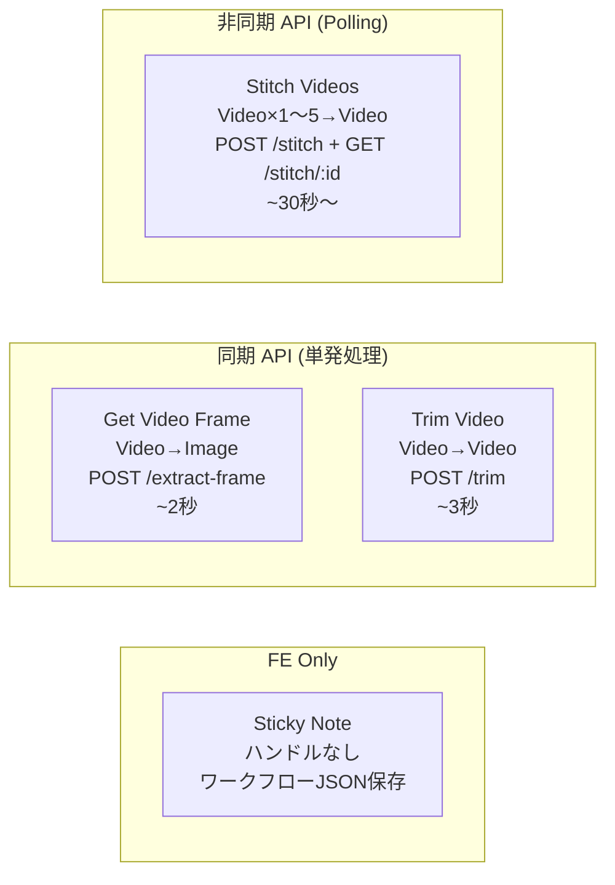
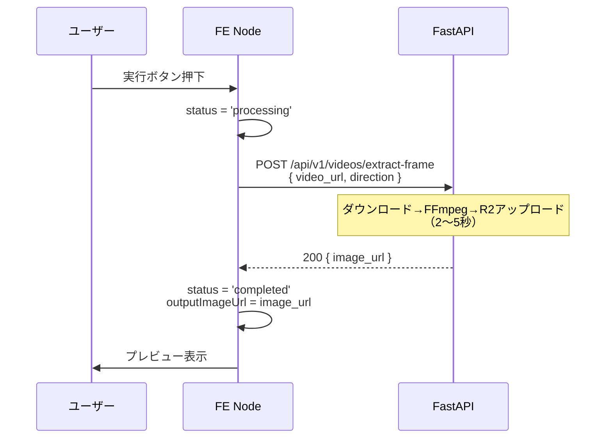
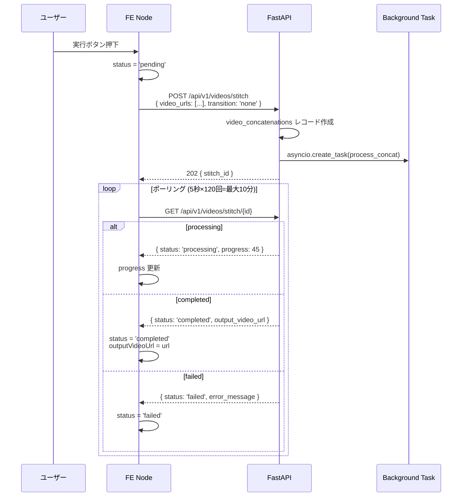

# Design Doc: Utility Nodes MVP (4ノード統合)

**日付**: 2026-05-14
**作成者**: technical-designer-frontend
**ステータス**: Draft

---

## 目次

1. [目的 / ゴール](#1-目的--ゴール)
2. [アーキテクチャ概要](#2-アーキテクチャ概要)
3. [Krea 流ハンドル色規約導入](#3-krea-流ハンドル色規約導入)
4. [共通基盤変更](#4-共通基盤変更)
5. [Node A: Get Video Frame](#5-node-a-get-video-frame)
6. [Node B: Trim Video](#6-node-b-trim-video)
7. [Node C: Stitch Videos](#7-node-c-stitch-videos)
8. [Node D: Sticky Note](#8-node-d-sticky-note)
9. [エラーハンドリング](#9-エラーハンドリング)
10. [テスト計画](#10-テスト計画)
11. [DB マイグレーション](#11-db-マイグレーション)
12. [段階リリース計画](#12-段階リリース計画)
13. [チーム構成と並列化戦略](#13-チーム構成と並列化戦略)
14. [スコープ外 / Follow-ups](#14-スコープ外--follow-ups)
15. [リスク](#15-リスク)
16. [変更影響マップ](#16-変更影響マップ)
17. [合意チェックリスト](#17-合意チェックリスト)
18. [参考文献](#18-参考文献)

---

## 1. 目的 / ゴール

### 出荷完了の定義

以下 4 ノードが本番環境のノードエディタで動作し、ユーザーが動画パイプラインを構築できる状態。

| ノード | 出荷条件 |
|--------|---------|
| Get Video Frame | 動画 URL → 最初 / 最後フレームを画像 URL として出力できる |
| Trim Video | 動画 URL + start/end 秒数 → トリム済み動画 URL を出力できる |
| Stitch Videos | 2〜5 本の動画 URL → 連結動画 URL を出力できる |
| Sticky Note | 色付き付箋ノードを配置し、ワークフロー保存に含まれる |

### ROI 根拠

バックエンドは既存 `ffmpeg_service.py` に以下の関数が揃っている。

- `extract_first_frame(video_path, output_path)` — L2041
- `extract_last_frame(video_path, output_path)` — L1772
- `trim_video(input_path, output_path, start_time, end_time)` — L1046
- `concat_videos(video_paths, output_path, transition)` — L1166
- `concatenate_with_transitions(video_paths, transitions, output_path)` — L1627

既存の非同期処理パターンは `app/tasks/video_concat_processor.py` に実装済み。

BE 新規実装は **API ルート 3 本 + 必要最小限のサービス薄膜** のみ。FFmpeg 実装は流用。  
FE は `DialogueNode` / `HailuoEndFrameNode` / `BGMNode` の既存パターンを踏襲するため、4 ノード独立で実装可能。

**実装規模見積もり**: XS (2〜3 スプリント)

---

## 2. アーキテクチャ概要

### 4 ノード配置図



### シーケンス図: 同期系 (Get Video Frame / Trim Video)



### シーケンス図: 非同期系 (Stitch Videos)



---

## 3. Krea 流ハンドル色規約導入

### 3.1 色マッピング

`flow.md` §1.2 に準拠し、以下の Tailwind クラスを使用する。

| 型 | 色 | TS フラグ | Input Handle Class | Output Handle Class |
|----|----|---------|--------------------|---------------------|
| Image | 青 | `'image'` | `!bg-blue-500` | `!bg-blue-400` |
| Video | 緑 | `'video'` | `!bg-green-500` | `!bg-green-400` |
| Text | 紫 | `'text'` | `!bg-purple-500` | `!bg-purple-400` |
| Audio | 橙 | `'audio'` | `!bg-orange-500` | `!bg-orange-400` |

### 3.2 `getHandleClass()` ヘルパー設計

`movie-maker/components/node-editor/nodes/BaseNode.tsx` に追加する。

```typescript
// BaseNode.tsx への追加 (シグネチャのみ)

export type HandleDataType = 'image' | 'video' | 'text' | 'audio' | 'default'

// 入力ハンドル用クラスを返す
export function getInputHandleClass(dataType: HandleDataType): string {
  // TODO: dataType に応じた Tailwind クラス文字列を返す
  // 既存 inputHandleClassName のサイズ/border 部分は共通、bgのみ変える
}

// 出力ハンドル用クラスを返す
export function getOutputHandleClass(dataType: HandleDataType): string {
  // TODO: dataType に応じた Tailwind クラス文字列を返す
  // 既存 outputHandleClassName のサイズ/border/hover は共通、bgのみ変える
}
```

**既存ハンドル定数との整合性**:

- 既存の `inputHandleClassName` / `outputHandleClassName` は新規ノードでは**使用しない**
- 既存ノードへの遡及適用は**今回はやらない**（後述の Follow-up 参照）
- 後方互換: 既存ノードはそのまま動作し続ける

### 3.3 既存ノードへの遡及適用ポリシー

既存 20+ ノードへの色規約適用は **今回スコープ外**。理由:

1. 既存ノードは動作していており破壊リスクがある
2. 全ノードの視覚的テストが必要で工数が大きい
3. 新規 4 ノードで規約を検証してから一括適用が安全

Follow-up タスクとして別 Design Doc を起票すること。

---

## 4. 共通基盤変更

### 4.1 `movie-maker/lib/types/node-editor.ts` への追加

#### NodeType Union 拡張

```typescript
// 既存 NodeType union に追加
export type NodeType =
  // ... 既存 ...
  | 'dialogue'
  // Utility Nodes (Phase 5)
  | 'getVideoFrame'
  | 'trimVideo'
  | 'stitchVideos'
  | 'stickyNote';
```

#### 各ノードデータ型

```typescript
// ========== Utility Nodes (Phase 5) ==========

export interface GetVideoFrameNodeData extends BaseNodeData {
  type: 'getVideoFrame'
  // 入力 (接続から受け取る)
  inputVideoUrl: string | null
  // パラメータ
  direction: 'first' | 'last'
  // 実行状態
  status: 'idle' | 'processing' | 'completed' | 'failed'
  // 出力
  outputImageUrl: string | null
  // errorMessage は BaseNodeData から継承
}

export interface TrimVideoNodeData extends BaseNodeData {
  type: 'trimVideo'
  // 入力 (接続から受け取る)
  inputVideoUrl: string | null
  // パラメータ
  startSeconds: number        // デフォルト 0
  endSeconds: number | null   // null = 最後まで
  // 実行状態
  status: 'idle' | 'processing' | 'completed' | 'failed'
  // 出力
  outputVideoUrl: string | null
}

export interface StitchVideosNodeData extends BaseNodeData {
  type: 'stitchVideos'
  // パラメータ
  transition: 'none' | 'crossfade'  // Phase 1 は 'none' のみ
  // 実行状態
  status: 'idle' | 'pending' | 'processing' | 'completed' | 'failed'
  progress: number         // 0-100
  stitchId: string | null  // バックエンドの結合ジョブID
  // 出力
  outputVideoUrl: string | null
}

export interface StickyNoteNodeData extends BaseNodeData {
  type: 'stickyNote'
  text: string
  color: 'yellow' | 'pink' | 'blue'
  // isValid は常に true (バリデーション不要)
}
```

#### WorkflowNodeData Union 拡張

```typescript
export type WorkflowNodeData =
  // ... 既存 ...
  | DialogueNodeData
  // Utility Nodes
  | GetVideoFrameNodeData
  | TrimVideoNodeData
  | StitchVideosNodeData
  | StickyNoteNodeData;
```

#### HasVideoOutput 拡張

`StitchVideosNodeData` も動画出力を持つため `HasVideoOutput` インターフェースで解決できる。
新フィールドの `outputVideoUrl` は既存の `HasVideoOutput` の `outputVideoUrl?: string | null` と一致するため**追加変更不要**。

#### HasImageOutput 新設 (B3 解決)

Get Video Frame は **画像 URL** を出力するため、`HasVideoOutput` ではカバーされない。下流ノード (ImageInputNode 互換ノード, KlingElementsNode, KlingEndFrameNode 等) から画像出力を統一的に解決できるよう、`HasImageOutput` インターフェースを新設する:

```typescript
// lib/types/node-editor.ts に追加

export interface HasImageOutput {
  imageUrl?: string | null;
  outputImageUrl?: string | null;
}

/**
 * ノードデータから画像 URL を取得するヘルパー関数。
 * ImageInputNodeData.imageUrl と GetVideoFrameNodeData.outputImageUrl の両方を解決する。
 */
export function getNodeImageOutput(data: unknown): string | null {
  const d = data as HasImageOutput;
  return d?.outputImageUrl ?? d?.imageUrl ?? null;
}
```

`GetVideoFrameNodeData` は `outputImageUrl: string | null` フィールドを持ち、`ImageInputNodeData.imageUrl` (既存) と同じ意味になる。

**スコープ判断**: Phase 1 では `HasImageOutput` インターフェースのみ追加し、既存 `ImageInputNodeData` 等への遡及適用 (interface implements 宣言) は**やらない** (型は構造的互換性で問題なし)。下流ノード側の `handleStart*` で `getNodeImageOutput()` ヘルパー利用に切り替える作業も今回スコープ外 (DialogueNode の `getNodeVideoOutput` 利用と同じ独立的拡張パターン)。

#### NodePaletteItem.category union 拡張 (B2 解決)

既存 `NodePaletteItem.category` は `'input' | 'config' | 'provider-specific' | 'post-processing' | 'output'` (node-editor.ts:257) のみ。
Utility カテゴリを追加するため**型拡張**が必須:

```typescript
// lib/types/node-editor.ts:257 を修正

export interface NodePaletteItem {
  type: NodeType;
  label: string;
  description: string;
  icon: string;
  category: 'input' | 'config' | 'provider-specific' | 'post-processing' | 'output' | 'utility'; // ← 'utility' 追加
  availableFor?: VideoProvider[];
}
```

これを忘れると TS strict ビルドが落ちる。**§4 共通基盤変更ファイル一覧に明記**:
- `movie-maker/lib/types/node-editor.ts:257` の `NodePaletteItem.category` union に `'utility'` を追加 (1 行追記)

#### HANDLE_IDS 拡張

```typescript
export const HANDLE_IDS = {
  // ... 既存 ...
  // Utility Nodes
  GET_VIDEO_FRAME_VIDEO_INPUT: 'get_video_frame_video_input',
  GET_VIDEO_FRAME_IMAGE_OUTPUT: 'get_video_frame_image_output',
  TRIM_VIDEO_INPUT: 'trim_video_input',
  TRIM_VIDEO_OUTPUT: 'trim_video_output',
  STITCH_VIDEO_1: 'video_1',
  STITCH_VIDEO_2: 'video_2',
  STITCH_VIDEO_3: 'video_3',
  STITCH_VIDEO_4: 'video_4',
  STITCH_VIDEO_5: 'video_5',
  STITCH_VIDEO_OUTPUT: 'stitch_video_output',
} as const;
```

#### `createDefaultNodeData` ケース追加

```typescript
case 'getVideoFrame':
  return {
    type: 'getVideoFrame',
    isValid: true,
    inputVideoUrl: null,
    direction: 'first',
    status: 'idle',
    outputImageUrl: null,
  };

case 'trimVideo':
  return {
    type: 'trimVideo',
    isValid: false,
    inputVideoUrl: null,
    startSeconds: 0,
    endSeconds: null,
    status: 'idle',
    outputVideoUrl: null,
  };

case 'stitchVideos':
  return {
    type: 'stitchVideos',
    isValid: false,
    transition: 'none',
    status: 'idle',
    progress: 0,
    stitchId: null,
    outputVideoUrl: null,
  };

case 'stickyNote':
  return {
    type: 'stickyNote',
    isValid: true,
    text: '',
    color: 'yellow',
  };
```

### 4.2 `NodePalette.tsx` への追加

新カテゴリ `utility` を追加する（`post-processing` に混ぜない）。

```typescript
// NODE_ITEMS に追加
{ type: 'getVideoFrame', label: 'フレーム抽出', description: '動画→最初/最後フレーム画像', icon: 'camera', category: 'utility' },
{ type: 'trimVideo',     label: 'トリム',       description: '動画の開始/終了位置を指定',  icon: 'scissors', category: 'utility' },
{ type: 'stitchVideos',  label: 'スティッチ',   description: '複数動画を連結',             icon: 'link', category: 'utility' },
{ type: 'stickyNote',    label: '付箋',         description: 'ワークフローへの注釈',        icon: 'sticky-note', category: 'utility' },

// CATEGORIES に追加
{ id: 'utility', label: 'ユーティリティ', description: '動画編集・注釈' },
```

`getIcon()` に以下のケースを追加する。

```typescript
case 'scissors': return <Scissors className={iconClass} />
case 'link':     return <Link className={iconClass} />
case 'sticky-note': return <StickyNote className={iconClass} />
// lucide-react に StickyNote がない場合は MessageSquare で代用
```

### 4.3 `node-types.ts` への追加

```typescript
// Phase 5: Utility ノード
import { GetVideoFrameNode } from '../nodes/GetVideoFrameNode';
import { TrimVideoNode }     from '../nodes/TrimVideoNode';
import { StitchVideosNode }  from '../nodes/StitchVideosNode';
import { StickyNoteNode }    from '../nodes/StickyNoteNode';

export const nodeTypes: NodeTypes = {
  // ... 既存 ...
  // Phase 5
  getVideoFrame:  GetVideoFrameNode,
  trimVideo:      TrimVideoNode,
  stitchVideos:   StitchVideosNode,
  stickyNote:     StickyNoteNode,
};
```

### 4.4 `lib/api/client.ts` への追加

```typescript
// Utility Nodes API

export type ExtractFrameRequest = {
  video_url: string
  direction: 'first' | 'last'
}

export type ExtractFrameResponse = {
  image_url: string
}

export type TrimVideoRequest = {
  video_url: string
  start_seconds: number
  end_seconds: number | null
}

export type TrimVideoResponse = {
  output_video_url: string
}

export type StitchVideosRequest = {
  video_urls: string[]
  transition: 'none' | 'crossfade'
}

export type StitchVideosResponse = {
  id: string
  status: 'pending'
}

export type StitchStatusResponse = {
  id: string
  status: 'pending' | 'processing' | 'completed' | 'failed'
  progress: number
  output_video_url: string | null
  error_message: string | null
}

export const utilityApi = {
  extractFrame: (req: ExtractFrameRequest): Promise<ExtractFrameResponse> =>
    // TODO: POST /api/v1/videos/extract-frame
    apiClient.post('/api/v1/videos/extract-frame', req),

  trimVideo: (req: TrimVideoRequest): Promise<TrimVideoResponse> =>
    // TODO: POST /api/v1/videos/trim
    apiClient.post('/api/v1/videos/trim', req),

  stitchVideos: (req: StitchVideosRequest): Promise<StitchVideosResponse> =>
    // TODO: POST /api/v1/videos/stitch
    apiClient.post('/api/v1/videos/stitch', req),

  getStitchStatus: (id: string): Promise<StitchStatusResponse> =>
    // TODO: GET /api/v1/videos/stitch/{id}
    apiClient.get(`/api/v1/videos/stitch/${id}`),
}
```

---

## 5. Node A: Get Video Frame

### 5.1 詳細仕様

| 項目 | 内容 |
|------|------|
| 入力ハンドル | Video URL (`get_video_frame_video_input`, 緑) |
| パラメータ | `direction: 'first' \| 'last'` (デフォルト `'first'`) |
| 出力ハンドル | Image URL (`get_video_frame_image_output`, 青) |
| 処理方式 | **同期** (2〜5 秒) |
| バックエンド依存 | `ffmpeg_service.extract_first_frame()` L2041 / `extract_last_frame()` L1772 |

### 5.2 BE API: `POST /api/v1/videos/extract-frame`

**リクエスト**:
```json
{
  "video_url": "https://r2.example.com/videos/xxx.mp4",
  "direction": "first"
}
```

**レスポンス (200)**:
```json
{
  "image_url": "https://r2.example.com/frames/xxx.jpg"
}
```

**処理フロー** (同期):
1. `video_url` から動画を tmpfile にダウンロード
2. `direction == 'first'` → `ffmpeg.extract_first_frame(tmp_path, output_path)` 呼び出し
3. `direction == 'last'` → `ffmpeg.extract_last_frame(tmp_path, output_path)` 呼び出し
4. 生成画像を R2 にアップロード
5. `image_url` を返す

**スキーマ (Pydantic)**:
```python
class ExtractFrameRequest(BaseModel):
    video_url: str
    direction: Literal["first", "last"] = "first"

class ExtractFrameResponse(BaseModel):
    image_url: str
```

**ルーター追加箇所**: `movie-maker-api/app/videos/router.py`

```python
@router.post("/extract-frame", response_model=ExtractFrameResponse)
async def extract_frame(
    request: ExtractFrameRequest,
    current_user = Depends(get_current_user),
) -> ExtractFrameResponse:
    # TODO: ダウンロード → FFmpeg → R2アップロード → ExtractFrameResponse 返却
    ...
```

### 5.3 FE コンポーネント骨格

**ファイル**: `movie-maker/components/node-editor/nodes/GetVideoFrameNode.tsx`

**参考** (N1 修正): `HailuoEndFrameNode.tsx` は実際にはファイルアップロード型 (`useDropzone` + `videosApi.uploadImage`) で**動画→画像変換ではない**。正しい参考は:
- BE 側: `app/tasks/storyboard_processor.py:176-215` `_extract_and_upload_last_frame()` (動画 URL → ダウンロード → ffmpeg 抽出 → R2 アップロード パターン)
- FE 側: `DialogueNode.tsx` (input/output handle 両方を持つ Pipeline 型) + `BGMNode.tsx` (source 型のシンプル UI)

```typescript
'use client'

import { useCallback } from 'react'
import { Handle, Position, type NodeProps } from '@xyflow/react'
import { Camera, Loader2, CheckCircle, AlertCircle } from 'lucide-react'
import {
  BaseNode,
  getInputHandleClass,
  getOutputHandleClass,
  nodeSelectClassName,
  nodeLabelClassName,
} from './BaseNode'
import type { GetVideoFrameNodeData } from '@/lib/types/node-editor'
import { HANDLE_IDS } from '@/lib/types/node-editor'
import { utilityApi } from '@/lib/api/client'

type GetVideoFrameNodeProps = NodeProps & {
  data: GetVideoFrameNodeData
  selected: boolean
}

export function GetVideoFrameNode({ data, selected, id }: GetVideoFrameNodeProps) {
  const updateNodeData = useCallback(
    (updates: Partial<GetVideoFrameNodeData>) => {
      // TODO: DialogueNode と同じ CustomEvent 'nodeDataUpdate' パターン
    },
    [id]
  )

  const handleExecute = useCallback(() => {
    // TODO: NodeEditor.tsx の useEffect 内に 'startGetVideoFrame' listener を追加する
    //       (B4 パターン: edges が stale にならないよう NodeEditor.tsx 側で処理)
    window.dispatchEvent(new CustomEvent('startGetVideoFrame', { detail: { nodeId: id } }))
  }, [id])

  const isProcessing = data.status === 'processing'
  const canExecute = !isProcessing && !!data.inputVideoUrl

  return (
    <BaseNode
      title="フレーム抽出"
      icon={<Camera className="w-4 h-4" />}
      isSelected={selected}
      isValid={data.isValid}
      errorMessage={data.errorMessage}
      className="min-w-[220px]"
    >
      {/* 入力ハンドル (Video=緑) */}
      <Handle
        type="target"
        position={Position.Left}
        id={HANDLE_IDS.GET_VIDEO_FRAME_VIDEO_INPUT}
        className={getInputHandleClass('video')}
      />

      {/* direction セレクト */}
      <div>
        <label className={nodeLabelClassName}>抽出位置</label>
        <select
          value={data.direction}
          onChange={(e) =>
            updateNodeData({ direction: e.target.value as 'first' | 'last' })
          }
          className={nodeSelectClassName}
        >
          <option value="first">最初のフレーム</option>
          <option value="last">最後のフレーム</option>
        </select>
      </div>

      {/* 出力プレビュー */}
      {/* TODO: data.outputImageUrl があれば img タグでプレビュー表示 */}

      {/* ステータス表示 */}
      {/* TODO: isProcessing → Loader2, completed → CheckCircle, failed → AlertCircle */}

      {/* 実行ボタン */}
      {/* TODO: DialogueNode の実行ボタンパターンを踏襲 */}

      {/* 出力ハンドル (Image=青) */}
      <Handle
        type="source"
        position={Position.Right}
        id={HANDLE_IDS.GET_VIDEO_FRAME_IMAGE_OUTPUT}
        className={getOutputHandleClass('image')}
      />
    </BaseNode>
  )
}
```

### 5.4 NodeEditor.tsx への handler 追加

`movie-maker/components/node-editor/NodeEditor.tsx` の `useEffect` 内に `handleStartDialogue` (L427) と同じパターンで追加する。

```typescript
// NodeEditor.tsx の useEffect 内 (handleStartDialogue の直後) に追加

const handleStartGetVideoFrame = async (e: Event) => {
  const { nodeId } = (e as CustomEvent<{ nodeId: string }>).detail

  const dispatchUpdate = (updates: Partial<GetVideoFrameNodeData>) =>
    window.dispatchEvent(new CustomEvent('nodeDataUpdate', { detail: { nodeId, updates } }))

  // 1. upstream edge で video URL を取得
  const upstreamEdge = edges.find(
    (edge) => edge.target === nodeId && edge.targetHandle === HANDLE_IDS.GET_VIDEO_FRAME_VIDEO_INPUT
  )
  // TODO: upstreamEdge がない場合のエラー処理
  // TODO: getNodeVideoOutput で video URL を取得
  // TODO: utilityApi.extractFrame() を呼び出し
  // TODO: dispatchUpdate で completed/failed を設定
}

window.addEventListener('startGetVideoFrame', handleStartGetVideoFrame)
// cleanup: return () => { window.removeEventListener(...) }
```

**B4 パターン**: `handleStartGetVideoFrame` は `useEffect` 内に定義し、`edges` / `nodes` が stale にならないよう注意。

---

## 6. Node B: Trim Video

### 6.1 詳細仕様

| 項目 | 内容 |
|------|------|
| 入力ハンドル | Video URL (`trim_video_input`, 緑) |
| パラメータ | `startSeconds: number` (デフォルト 0), `endSeconds: number \| null` (null = 最後まで) |
| 出力ハンドル | Video URL (`trim_video_output`, 緑) |
| 処理方式 | **同期** (3〜10 秒) |
| バックエンド依存 | `ffmpeg_service.trim_video()` L1046 |

### 6.2 BE API: `POST /api/v1/videos/trim`

**リクエスト**:
```json
{
  "video_url": "https://r2.example.com/videos/xxx.mp4",
  "start_seconds": 1.5,
  "end_seconds": 8.0
}
```

**レスポンス (200)**:
```json
{
  "output_video_url": "https://r2.example.com/videos/trimmed/xxx.mp4"
}
```

**バリデーション** (BE 側):
- `start_seconds >= 0`
- `end_seconds > start_seconds` (end_seconds が null の場合はスキップ)
- `end_seconds - start_seconds >= 0.5` (ffmpeg_service L1081 に準拠)
- `end_seconds` が動画長を超える場合は動画長に丸める (ffmpeg_service L1083 の実装に準拠)

**スキーマ**:
```python
class TrimVideoRequest(BaseModel):
    video_url: str
    start_seconds: float = Field(ge=0.0, description="開始位置（秒）")
    end_seconds: float | None = Field(None, ge=0.0, description="終了位置（秒）、Noneで最後まで")

    @model_validator(mode='after')
    def validate_range(self) -> Self:
        # TODO: start < end バリデーション
        return self

class TrimVideoResponse(BaseModel):
    output_video_url: str
```

**ルーター追加**:
```python
@router.post("/trim", response_model=TrimVideoResponse)
async def trim_video(
    request: TrimVideoRequest,
    current_user = Depends(get_current_user),
) -> TrimVideoResponse:
    # TODO: ダウンロード → ffmpeg.trim_video() → R2 → TrimVideoResponse
    ...
```

### 6.3 FE コンポーネント骨格

**ファイル**: `movie-maker/components/node-editor/nodes/TrimVideoNode.tsx`

**参考**: `OverlayNode.tsx` (数値入力 + 設定パラメータ)、`DialogueNode.tsx` (input/output handle + 実行ボタン)

```typescript
'use client'

import { useCallback } from 'react'
import { Handle, Position, type NodeProps } from '@xyflow/react'
import { Scissors, Loader2, CheckCircle, AlertCircle } from 'lucide-react'
import {
  BaseNode,
  getInputHandleClass,
  getOutputHandleClass,
  nodeInputClassName,
  nodeLabelClassName,
} from './BaseNode'
import type { TrimVideoNodeData } from '@/lib/types/node-editor'
import { HANDLE_IDS } from '@/lib/types/node-editor'

type TrimVideoNodeProps = NodeProps & {
  data: TrimVideoNodeData
  selected: boolean
}

export function TrimVideoNode({ data, selected, id }: TrimVideoNodeProps) {
  const updateNodeData = useCallback(
    (updates: Partial<TrimVideoNodeData>) => {
      // TODO: CustomEvent 'nodeDataUpdate' パターン
    },
    [id]
  )

  const handleExecute = useCallback(() => {
    // TODO: 'startTrimVideo' カスタムイベント dispatch
    window.dispatchEvent(new CustomEvent('startTrimVideo', { detail: { nodeId: id } }))
  }, [id])

  // クライアント側バリデーション (Phase 1)
  const isStartValid = data.startSeconds >= 0
  const isEndValid = data.endSeconds === null || data.endSeconds > data.startSeconds
  const isRangeValid = isStartValid && isEndValid

  const isProcessing = data.status === 'processing'
  const canExecute = !isProcessing && !!data.inputVideoUrl && isRangeValid

  return (
    <BaseNode
      title="トリム"
      icon={<Scissors className="w-4 h-4" />}
      isSelected={selected}
      isValid={data.isValid && isRangeValid}
      errorMessage={!isRangeValid ? '終了時刻は開始時刻より大きい値を入力してください' : data.errorMessage}
      className="min-w-[220px]"
    >
      {/* 入力ハンドル (Video=緑) */}
      <Handle
        type="target"
        position={Position.Left}
        id={HANDLE_IDS.TRIM_VIDEO_INPUT}
        className={getInputHandleClass('video')}
      />

      {/* 開始時刻入力 */}
      <div>
        <label className={nodeLabelClassName}>開始 (秒)</label>
        <input
          type="number"
          min={0}
          step={0.1}
          value={data.startSeconds}
          onChange={(e) => updateNodeData({ startSeconds: parseFloat(e.target.value) || 0 })}
          className={nodeInputClassName}
          placeholder="0"
        />
      </div>

      {/* 終了時刻入力 */}
      <div>
        <label className={nodeLabelClassName}>終了 (秒) — 空欄で最後まで</label>
        <input
          type="number"
          min={0}
          step={0.1}
          value={data.endSeconds ?? ''}
          onChange={(e) => {
            const val = e.target.value === '' ? null : parseFloat(e.target.value)
            updateNodeData({ endSeconds: val })
          }}
          className={nodeInputClassName}
          placeholder="最後まで"
        />
      </div>

      {/* ステータス / 実行ボタン */}
      {/* TODO: DialogueNode の renderStatusArea パターンを踏襲 */}

      {/* 出力ハンドル (Video=緑) */}
      <Handle
        type="source"
        position={Position.Right}
        id={HANDLE_IDS.TRIM_VIDEO_OUTPUT}
        className={getOutputHandleClass('video')}
      />
    </BaseNode>
  )
}
```

### 6.4 バリデーション設計

**クライアント側 (Phase 1)**:
- `endSeconds !== null && endSeconds <= startSeconds` → インライン赤文字エラー
- `endSeconds !== null && endSeconds - startSeconds < 0.5` → 警告表示
- 実行ボタンを disabled にする

**動画長取得**: Phase 1 ではクライアント側での動画長チェックを**省略**する。動画長超過は BE 側で丸め処理されるため問題なし (`ffmpeg_service.py` L1083 の実装)。Phase 2 で動画メタデータ取得 API を追加して UI 改善する。

---

## 7. Node C: Stitch Videos

### 7.1 詳細仕様

| 項目 | 内容 |
|------|------|
| 入力ハンドル | Video URL × 1〜5 (`video_1`〜`video_5`, 緑) |
| パラメータ | `transition: 'none'` (Phase 1 のみ) |
| 出力ハンドル | Video URL (`stitch_video_output`, 緑) |
| 処理方式 | **非同期** (Polling, 5秒×120回=最大10分) |
| バックエンド依存 | 既存 `video_concat_processor.py` を流用 |

### 7.2 動的 Handle 設計

Stitch ノードは「接続された数だけ Handle を表示」する Krea スタイルの動的 Handle を採用する。

**実装方針**: `StitchVideosNode` コンポーネントが `edges` から自分の `target` として接続された handle 数を数え、次の空き handle を追加表示する。

```typescript
// NodeEditor.tsx または StitchVideosNode.tsx 内のヘルパー

function getConnectedStitchHandles(nodeId: string, edges: Edge[]): number[] {
  // TODO: edges から target === nodeId の targetHandle を収集
  // handle ID が 'video_1'〜'video_5' のものを数値に変換してソート
  // 例: [1, 2] → ノードは handle 1, 2, 3(次の空き) を表示
  return []
}
```

**制約**:
- 最大 5 本 (HANDLE_IDS.STITCH_VIDEO_1〜5)
- 接続なし → handle 1 のみ表示
- handle 1 接続済み → handle 1, 2 表示
- handle 1〜5 接続済み → handle 1〜5 のみ (新規 handle なし)

**xyflow の制約について**: React Flow では handle の動的追加はレンダリング時点の DOM に依存する。`edges` を props 経由で `StitchVideosNode` に渡すか、`useReactFlow()` フックを使う必要がある。NodeEditor.tsx が `nodeTypes` オブジェクトをメモ化して渡しているため、直接 edges を props 経由では渡せない。

**解決策 (B1 解決)**: `useEdges()` だけでは不十分。React Flow は **ノードに含まれる Handle の DOM 構造が変わったときに内部キャッシュを再計算する必要があり、`useUpdateNodeInternals` フックの呼び出しが必須** (公式ドキュメント: https://reactflow.dev/learn/customization/handles および https://reactflow.dev/api-reference/hooks/use-update-node-internals)。これを忘れると新規に追加された Handle にエッジを接続できず、サイレントに失敗する。

```typescript
// StitchVideosNode.tsx の正しい実装
import { useEdges, useUpdateNodeInternals } from '@xyflow/react'
import { useEffect } from 'react'

export function StitchVideosNode({ data, selected, id }: StitchVideosNodeProps) {
  const edges = useEdges()
  const updateNodeInternals = useUpdateNodeInternals()

  // 接続済み handle のインデックスを抽出 (例: targetHandle "stitch_video_1" → 1)
  const connectedIndices = getConnectedStitchHandles(id, edges)
  const nextHandleIndex = Math.min(connectedIndices.length + 1, 5)
  const visibleHandleCount = nextHandleIndex

  // ★ B1 解決: Handle 数が変化したら React Flow に明示通知する
  useEffect(() => {
    updateNodeInternals(id)
  }, [id, visibleHandleCount, updateNodeInternals])

  // visibleHandleCount 個の Handle を描画
  return (
    <BaseNode ...>
      {/* visibleHandleCount 個の <Handle type="target" id={`stitch_video_${i+1}`} ... /> をループ生成 */}
      ...
    </BaseNode>
  )
}
```

**必須テスト** (§10.1 にも追記):
- 接続 0 本: handle 1 のみ表示
- 接続 1 本: handle 1, 2 表示 (新規追加された handle 2 にエッジが**接続可能**であること)
- 接続 5 本: handle 6 は表示されない
- `useUpdateNodeInternals` 呼び出しがされていないと最後のテストが失敗する

### 7.3 BE API 設計

#### `POST /api/v1/videos/stitch`

**既存との関係**:
- 既存 `POST /api/v1/concat` は `source_video_ids` (DB ID) を受け取る旧 API
- 新 `POST /api/v1/videos/stitch` は `video_urls` (直接 URL) を受け取る新 API
- 既存 `process_concat_generation()` の `direct_video_urls` パラメータをそのまま流用できる (`video_concat_processor.py` L106)

**スキーマ**:
```python
class StitchVideosRequest(BaseModel):
    video_urls: list[str] = Field(min_length=2, max_length=5, description="結合する動画URL（2〜5本）")
    transition: Literal["none"] = "none"  # Phase 1 は none のみ

class StitchVideosResponse(BaseModel):
    id: str
    status: Literal["pending"] = "pending"

class StitchStatusResponse(BaseModel):
    id: str
    status: Literal["pending", "processing", "completed", "failed"]
    progress: int  # 0-100
    output_video_url: str | None = None
    error_message: str | None = None
```

**ルーター**:
```python
@router.post("/stitch", response_model=StitchVideosResponse, status_code=202)
async def stitch_videos(
    request: StitchVideosRequest,
    current_user = Depends(get_current_user),
) -> StitchVideosResponse:
    # TODO: video_concatenations テーブルにレコード挿入
    # TODO: start_concat_processing(concat_id, direct_video_urls=request.video_urls) 呼び出し
    # TODO: StitchVideosResponse(id=concat_id) 返却
    ...

@router.get("/stitch/{stitch_id}", response_model=StitchStatusResponse)
async def get_stitch_status(
    stitch_id: str,
    current_user = Depends(get_current_user),
) -> StitchStatusResponse:
    # TODO: video_concatenations テーブルから取得して StitchStatusResponse マッピング
    ...
```

### 7.4 FE コンポーネント骨格

**ファイル**: `movie-maker/components/node-editor/nodes/StitchVideosNode.tsx`

**参考**: `DialogueNode.tsx` (ポーリングパターン)

```typescript
'use client'

import { useCallback } from 'react'
import { Handle, Position, type NodeProps } from '@xyflow/react'
import { useEdges } from '@xyflow/react'
import { Link, Loader2, CheckCircle, AlertCircle } from 'lucide-react'
import {
  BaseNode,
  getInputHandleClass,
  getOutputHandleClass,
  nodeLabelClassName,
} from './BaseNode'
import type { StitchVideosNodeData } from '@/lib/types/node-editor'
import { HANDLE_IDS } from '@/lib/types/node-editor'

type StitchVideosNodeProps = NodeProps & {
  data: StitchVideosNodeData
  selected: boolean
}

const STITCH_HANDLE_IDS = [
  HANDLE_IDS.STITCH_VIDEO_1,
  HANDLE_IDS.STITCH_VIDEO_2,
  HANDLE_IDS.STITCH_VIDEO_3,
  HANDLE_IDS.STITCH_VIDEO_4,
  HANDLE_IDS.STITCH_VIDEO_5,
] as const

export function StitchVideosNode({ data, selected, id }: StitchVideosNodeProps) {
  const edges = useEdges()
  const updateNodeData = useCallback(
    (updates: Partial<StitchVideosNodeData>) => {
      // TODO: CustomEvent 'nodeDataUpdate' パターン
    },
    [id]
  )

  // 接続済み handle を算出
  const connectedHandleIds = edges
    .filter((e) => e.target === id)
    .map((e) => e.targetHandle)
    .filter(Boolean)
  const connectedCount = connectedHandleIds.length
  // 次の空き handle まで表示 (最大5)
  const visibleHandleCount = Math.min(connectedCount + 1, 5)

  const handleExecute = useCallback(() => {
    window.dispatchEvent(new CustomEvent('startStitchVideos', { detail: { nodeId: id } }))
  }, [id])

  const isProcessing = data.status === 'pending' || data.status === 'processing'
  const canExecute = !isProcessing && connectedCount >= 2

  return (
    <BaseNode
      title="スティッチ"
      icon={<Link className="w-4 h-4" />}
      isSelected={selected}
      isValid={data.isValid}
      errorMessage={
        connectedCount < 2
          ? '2本以上の動画を接続してください'
          : data.errorMessage
      }
      className="min-w-[220px]"
    >
      {/* 動的入力ハンドル (Video=緑) */}
      {STITCH_HANDLE_IDS.slice(0, visibleHandleCount).map((handleId, index) => (
        <div key={handleId} className="flex items-center gap-2 relative">
          <Handle
            type="target"
            position={Position.Left}
            id={handleId}
            className={getInputHandleClass('video')}
            style={{ top: `${20 + index * 28}px` }}
          />
          <span className="text-xs text-gray-500 ml-4">動画 {index + 1}</span>
        </div>
      ))}

      {/* トランジション (Phase 1 は固定 none) */}
      <div>
        <label className={nodeLabelClassName}>トランジション</label>
        <p className="text-xs text-gray-500">カット (Phase 1 のみ)</p>
      </div>

      {/* ステータス表示 / 実行ボタン */}
      {/* TODO: DialogueNode の renderStatusArea パターンを踏襲 */}

      {/* 出力ハンドル (Video=緑) */}
      <Handle
        type="source"
        position={Position.Right}
        id={HANDLE_IDS.STITCH_VIDEO_OUTPUT}
        className={getOutputHandleClass('video')}
      />
    </BaseNode>
  )
}
```

### 7.5 NodeEditor.tsx への handler 追加

```typescript
const handleStartStitchVideos = async (e: Event) => {
  const { nodeId } = (e as CustomEvent<{ nodeId: string }>).detail

  const dispatchUpdate = (updates: Partial<StitchVideosNodeData>) =>
    window.dispatchEvent(new CustomEvent('nodeDataUpdate', { detail: { nodeId, updates } }))

  // 1. このノードへの incoming edges から video URL を収集
  const incomingEdges = edges.filter(
    (edge) => edge.target === nodeId && HANDLE_IDS_STITCH_INPUT_LIST.includes(edge.targetHandle ?? '')
  )
  // TODO: 2本未満ならエラー

  // 2. 各 upstream ノードから videoUrl を取得
  // TODO: getNodeVideoOutput を使用

  // 3. utilityApi.stitchVideos() 呼び出し
  // TODO: ポーリングループ (DialogueNode L489-534 のパターンを踏襲)
  // 定数: STITCH_MAX_POLLING_ATTEMPTS = 120, STITCH_POLLING_INTERVAL_MS = 5000

  // 4. completed → dispatchUpdate({ status: 'completed', outputVideoUrl })
  // 5. failed → dispatchUpdate({ status: 'failed', errorMessage })
}

window.addEventListener('startStitchVideos', handleStartStitchVideos)
```

**ポーリング定数** (NodeEditor.tsx の DIALOGUE 定数 L48-54 と同じ場所に追加):
```typescript
const STITCH_MAX_POLLING_ATTEMPTS = 120    // 5 秒 × 120 回 = 最大 10 分
const STITCH_POLLING_INTERVAL_MS = 5000
```

---

## 8. Node D: Sticky Note

### 8.1 詳細仕様

| 項目 | 内容 |
|------|------|
| 入力ハンドル | **なし** |
| 出力ハンドル | **なし** |
| パラメータ | `text: string`, `color: 'yellow' \| 'pink' \| 'blue'` |
| 処理方式 | **FE のみ** (バックエンド不要) |
| ワークフロー保存 | `WorkflowNode` の `data` に含まれ、既存の保存機構でそのまま保存 |

### 8.2 FE コンポーネント骨格

**ファイル**: `movie-maker/components/node-editor/nodes/StickyNoteNode.tsx`

**参考**: `BGMNode.tsx` (Source-only パターン、ハンドル最小構成)

```typescript
'use client'

import { useCallback } from 'react'
import { type NodeProps } from '@xyflow/react'
import { StickyNote } from 'lucide-react'
import { cn } from '@/lib/utils'
import type { StickyNoteNodeData } from '@/lib/types/node-editor'

type StickyNoteNodeProps = NodeProps & {
  data: StickyNoteNodeData
  selected: boolean
}

const COLOR_CLASSES: Record<StickyNoteNodeData['color'], { bg: string; border: string; text: string }> = {
  yellow: { bg: 'bg-yellow-900/30', border: 'border-yellow-600/50', text: 'text-yellow-200' },
  pink:   { bg: 'bg-pink-900/30',   border: 'border-pink-600/50',   text: 'text-pink-200' },
  blue:   { bg: 'bg-blue-900/30',   border: 'border-blue-600/50',   text: 'text-blue-200' },
}

export function StickyNoteNode({ data, selected, id }: StickyNoteNodeProps) {
  const colors = COLOR_CLASSES[data.color]

  const updateNodeData = useCallback(
    (updates: Partial<StickyNoteNodeData>) => {
      // TODO: CustomEvent 'nodeDataUpdate' パターン
    },
    [id]
  )

  return (
    // BaseNode は使わず独自スタイル (付箋らしい見た目)
    <div
      className={cn(
        'relative rounded-xl p-4 min-w-[200px] max-w-[300px] transition-all border',
        colors.bg,
        colors.border,
        selected && 'ring-2 ring-[#fce300]'
      )}
    >
      {/* ヘッダー: 色選択ボタン */}
      <div className="flex items-center gap-2 mb-2">
        <StickyNote className={cn('w-4 h-4', colors.text)} />
        <div className="flex gap-1 ml-auto">
          {(['yellow', 'pink', 'blue'] as const).map((c) => (
            <button
              key={c}
              onClick={() => updateNodeData({ color: c })}
              className={cn(
                'w-3 h-3 rounded-full border',
                c === 'yellow' && 'bg-yellow-400',
                c === 'pink' && 'bg-pink-400',
                c === 'blue' && 'bg-blue-400',
                data.color === c && 'ring-2 ring-white ring-offset-1 ring-offset-black'
              )}
            />
          ))}
        </div>
      </div>

      {/* テキスト入力 */}
      <textarea
        value={data.text}
        onChange={(e) => updateNodeData({ text: e.target.value })}
        placeholder="メモを入力..."
        rows={4}
        className={cn(
          'w-full bg-transparent resize-none text-sm leading-relaxed',
          'focus:outline-none placeholder-gray-600',
          colors.text
        )}
      />
    </div>
  )
}
```

### 8.3 ワークフロー保存サイズ考慮

`StickyNoteNodeData` の `text` は最大文字数を制限する。

- **推奨上限**: 500 文字 (textarea の `maxLength={500}`)
- 理由: ワークフロー JSON をブラウザの localStorage に保存する際、大量の付箋が肥大化する可能性があるため
- 1 付箋 500 文字 × 10 付箋 = 5,000 文字 ≒ 5KB 程度 → 許容範囲内

---

## 9. エラーハンドリング

### 9.1 各ノードの失敗シナリオ

| ノード | シナリオ | エラーメッセージ (日本語) | 対処 |
|--------|---------|--------------------------|------|
| Get Video Frame | 動画 URL が未接続 | 「動画ノードを接続してください」 | ボタン disabled |
| Get Video Frame | 動画ダウンロード失敗 | 「動画の取得に失敗しました」 | status = 'failed' |
| Get Video Frame | FFmpeg フレーム抽出失敗 | 「フレームの抽出に失敗しました」 | status = 'failed' |
| Trim Video | 動画 URL が未接続 | 「動画ノードを接続してください」 | ボタン disabled |
| Trim Video | start >= end | 「終了時刻は開始時刻より大きい値を入力してください」 | インラインバリデーション |
| Trim Video | トリム範囲 < 0.5 秒 | 「トリム範囲は0.5秒以上必要です」 | インラインバリデーション |
| Trim Video | FFmpeg トリム失敗 | 「動画のトリムに失敗しました」 | status = 'failed' |
| Stitch Videos | 接続数が 1 本以下 | 「2本以上の動画を接続してください」 | ボタン disabled |
| Stitch Videos | いずれかの動画 URL が未生成 | 「動画{N}の生成が完了していません」 | ボタン disabled |
| Stitch Videos | ダウンロード失敗 | 「動画{N}の取得に失敗しました」 | status = 'failed' |
| Stitch Videos | ポーリングタイムアウト | 「タイムアウトしました (10分)。再試行してください」 | status = 'failed' |
| Stitch Videos | BE 処理失敗 | `error_message` をそのまま表示 | status = 'failed' |
| Sticky Note | なし (バックエンド不要) | — | — |

### 9.2 Error Boundary

既存 NodeEditor のエラーバウンダリが各ノードをラップしている場合はそれを利用する。  
ノード個別のクラッシュが全体に波及しないよう、各ノードコンポーネント外側を `React.Suspense` + Error Boundary でラップすることを推奨する（既存パターンに準拠）。

---

## 10. テスト計画

### 10.1 単体テスト方針

全テストは React Testing Library を使用し、MSW で API モックを行う。

#### Get Video Frame テスト

| テストケース | 確認内容 |
|-------------|---------|
| direction='first' でボタン押下 | `utilityApi.extractFrame({ direction: 'first' })` が呼ばれる |
| direction='last' に変更 | セレクトで 'last' を選択したとき state が更新される |
| 処理中 | Loader2 アイコンが表示される |
| 完了後 | 出力画像プレビューが表示される |
| 失敗時 | エラーメッセージが表示される |
| 動画未接続 | 実行ボタンが disabled |

#### Trim Video テスト

| テストケース | 確認内容 |
|-------------|---------|
| start=2, end=5 で正常実行 | `utilityApi.trimVideo({ start_seconds: 2, end_seconds: 5 })` が呼ばれる |
| end=null で実行 | `end_seconds: null` で API が呼ばれる |
| start >= end のバリデーション | ボタン disabled + インラインエラー表示 |
| 負の値入力 | バリデーションエラー |

#### Stitch Videos テスト

| テストケース | 確認内容 |
|-------------|---------|
| 動画 2 本接続済みで実行 | `utilityApi.stitchVideos({ video_urls: [url1, url2] })` が呼ばれる |
| ポーリング: completed | `output_video_url` が設定され CheckCircle が表示される |
| ポーリング: failed | `error_message` が表示される |
| 接続 1 本以下 | ボタン disabled |
| 動的 handle 表示 | 2 本接続 → handle 3 が追加表示される |

#### Sticky Note テスト

| テストケース | 確認内容 |
|-------------|---------|
| テキスト入力 | textarea に入力された文字が data.text に反映される |
| 色変更 (pink) | pink ボタン押下で color='pink' が設定される |
| ハンドルなし | Handle コンポーネントが DOM に存在しない |
| maxLength | 501 文字目が入力できない |

### 10.2 共通ハンドル色テスト

```typescript
// getHandleClass.test.ts
it('video ハンドルは緑クラスを返す', () => {
  expect(getInputHandleClass('video')).toContain('bg-green')
  expect(getOutputHandleClass('video')).toContain('bg-green')
})
it('image ハンドルは青クラスを返す', () => {
  expect(getInputHandleClass('image')).toContain('bg-blue')
})
```

### 10.3 BE 単体テスト

- `test_extract_frame.py`: `ffmpeg_service.extract_first_frame()` / `extract_last_frame()` のモックを用いたルーターテスト
- `test_trim_video.py`: バリデーション境界値テスト (start=0, end=null / start=end / end < start)
- `test_stitch_videos.py`: `start_concat_processing` が呼ばれることの確認、ステータス遷移

---

## 11. DB マイグレーション

### 11.1 Stitch Videos (Node C)

**結論**: **既存 `video_concatenations` テーブルをそのまま流用可能**。

根拠:
- `video_concat_processor.py` L66: `direct_video_urls` パラメータで URL リストを直接渡せる
- `video_concat_processor.py` L41: `video_concatenations` テーブルに `final_video_url`, `progress`, `status` カラムが存在する
- 新 API は既存テーブルに新規レコードを挿入して同テーブルをポーリングするだけ

**必要なカラム確認**:

| カラム | 用途 | 既存 |
|-------|------|-----|
| `id` | ジョブ ID | あり |
| `user_id` | オーナー | あり |
| `source_video_ids` | (旧パターン、今回は不使用) | あり |
| `status` | pending/processing/completed/failed | あり |
| `progress` | 0-100 | あり |
| `final_video_url` | 出力 URL | あり |
| `error_message` | エラー文字列 | あり |
| `transition` | 'none' | あり |
| `transition_duration` | float | あり |

**マイグレーション不要**。ただし以下を確認すること:
- `user_id` が nullable でないこと (認証ユーザー必須)
- RLS ポリシーが `/stitch` エンドポイントから INSERT 可能であること

### 11.2 Get Video Frame / Trim Video (Node A, B)

同期エンドポイントのため DB レコードを作成しない。**マイグレーション不要**。

### 11.3 Sticky Note (Node D)

ワークフローの JSON (`WorkflowNode[]`) に含まれる。既存のワークフロー保存機構 (localStorage / Supabase) でそのまま保存される。**マイグレーション不要**。

---

## 12. 段階リリース計画

### 最終決定 (N4 解決): **全 4 ノードを 1 スプリント並列実装**

```
Step 1: 共通基盤 (型・パレット・色規約・HasImageOutput) を先行投入
        └ 1 タスク (BE 不要、FE のみ)
        └ 完了後に Step 2 をブロック解除

Step 2: 4 ノードを並列実装
        ├ Node A (Get Video Frame): BE thin wrapper + FE
        ├ Node B (Trim Video):       BE thin wrapper + FE
        ├ Node C (Stitch Videos):    BE wrapper (既存 concat_processor 流用) + FE (動的 Handle / useUpdateNodeInternals)
        └ Node D (Sticky Note):      FE のみ
        └ 期間: 1 スプリント (1 週間)
```

**判断理由**:
1. Step 1 で共通基盤を先行投入することで Stitch の動的 Handle リスクは Step 2 の C のみに局在化 (A/B/D に波及しない)
2. C が遅延しても A/B/D は独立して出荷可能 (フィーチャーフラグ不要、ノードが UI に出現しないだけ)
3. チーム構成 (§13) で BE 1 + FE 4 並列を前提にしているため、2 フェーズに分割するメリットがない (人員ボトルネックなし)
4. 共通基盤と新規ノードを別 Phase に分けると **型 / 色規約 / パレットの再修正コスト**が膨らむ

---

## 13. チーム構成と並列化戦略

### 担当割り当て

```
BE 実装 (1 task-executor):
  └ API 2 本 (extract-frame, trim): 同期 thin wrapper
  └ API 2 本 (stitch POST, stitch GET status): 既存 concat_processor 流用
  └ スキーマ・バリデーション
  └ テスト: test_extract_frame.py, test_trim_video.py, test_stitch.py

FE 実装 (4 task-executor-frontend 並列):
  └ FE-A: GetVideoFrameNode.tsx + NodeEditor.tsx の handler 追加 + api/client.ts
  └ FE-B: TrimVideoNode.tsx + NodeEditor.tsx の handler 追加
  └ FE-C: StitchVideosNode.tsx + NodeEditor.tsx の handler 追加 (動的 Handle 含む)
  └ FE-D: StickyNoteNode.tsx (完全独立)

共通基盤 (FE-A が兼任または別 task):
  └ node-editor.ts 型追加
  └ BaseNode.tsx getHandleClass() 追加
  └ NodePalette.tsx 追加
  └ node-types.ts 追加

品質:
  └ quality-fixer-frontend: TypeScript strict チェック、テスト補完
  └ code-reviewer: 4 ノードの実装レビュー
  └ verifier: 手動ブラウザ動作確認
```

### 並列化の前提条件

FE-A/B/C/D が同時作業できるために共通基盤 (型定義・BaseNode 拡張) を**先に完成**させること。

```
Step 1 (BE + FE 共通基盤): 並列で同時開始
  BE: API スキーマ・ルーター骨格
  FE: node-editor.ts 型追加 + BaseNode getHandleClass + NodePalette + node-types

Step 2 (FE 4実装者 並列):
  FE-A, FE-B, FE-C, FE-D が同時進行
  ← Step 1 の型定義が完成後にスタート

Step 3 (統合テスト):
  BE 完成後に FE-A/B/C と結合テスト
  FE-D は BE 不要なので独立テスト可
```

---

## 14. スコープ外 / Follow-ups

### Phase 5 スコープ外 (明示 OUT)

| 機能 | 理由 |
|------|------|
| Trim Audio | DialogueNode 主体で需要少 |
| Image Mask Editor | inpaint 未対応で消費先なし |
| Stitch のクロスフェード / トランジション | Phase 2 で BE 実装済み機能を UI から呼べるようにする |
| Get Video Frame の中間時刻指定 | 現状 first/last のみ。需要確認後に追加 |
| Trim の動画長プレビュー / 波形 UI | Phase 2 で動画メタデータ API 追加後 |
| 既存ノードへのハンドル色規約遡及適用 | 別 Design Doc で計画 |
| Krea の残りノード (Blur, Compositor, Hue/Sat, etc.) | 別 Design Doc で優先度付け |
| Stitch のクリッププレビュー "Quick preview" | Krea と同様の UI、Phase 2 |

### 既知の技術的後処理タスク

- 既存 20+ ノードへのハンドル色規約適用 → 別タスクとして起票
- `POST /api/v1/concat` (旧 API) の `/stitch` への移行またはエイリアス化 → 後続タスク
- `video_concatenations` テーブルの不要カラム整理 → DBクリーンアップタスク

---

## 15. リスク

| リスク | 影響度 | 発生確率 | 対処策 |
|--------|--------|---------|--------|
| Stitch の動的 Handle 表現 (xyflow の制約) | 高 | 中 | `useEdges()` フックで edges を直接取得する案を採用。実装前に PoC を行う |
| Trim の動画長未取得時の UI | 低 | 高 | Phase 1 は FE バリデーション省略、BE 側で丸め処理済みのため実害なし |
| TS strict 衝突 (getHandleClass 型) | 中 | 低 | `HandleDataType = 'image' \| 'video' \| 'text' \| 'audio' \| 'default'` を明示的に定義 |
| Sticky Note のワークフロー JSON 膨張 | 低 | 低 | maxLength=500 文字制限で制御 |
| 同期 API のタイムアウト (Trim 長尺動画) | 中 | 低 | Trim は FastAPI デフォルトタイムアウト内 (60s) 。長尺動画は非同期化 Phase 2 検討 |
| フレーム抽出 R2 アップロードのコスト | 低 | 高 | 生成ごとに R2 に画像を保存。利用量によってはクリーンアップポリシーが必要 |
| B4 パターン違反 (edges stale) | 高 | 中 | handleStart* 関数は必ず useEffect 内に定義し、cleanup で removeEventListener する |

---

## 16. 変更影響マップ

```yaml
変更対象:
  - Utility Nodes 4本 (GetVideoFrame, TrimVideo, StitchVideos, StickyNote)

直接影響:
  FE:
    - movie-maker/lib/types/node-editor.ts (NodeType Union, Data型, HANDLE_IDS, createDefaultNodeData)
    - movie-maker/components/node-editor/nodes/BaseNode.tsx (getHandleClass 追加)
    - movie-maker/components/node-editor/utils/node-types.ts (4ノード追加)
    - movie-maker/components/node-editor/NodePalette.tsx (utility カテゴリ + 4ノード追加)
    - movie-maker/components/node-editor/NodeEditor.tsx (handler 3本追加: GetVideoFrame, TrimVideo, StitchVideos)
    - movie-maker/lib/api/client.ts (utilityApi 追加)
    新規ファイル:
    - movie-maker/components/node-editor/nodes/GetVideoFrameNode.tsx
    - movie-maker/components/node-editor/nodes/TrimVideoNode.tsx
    - movie-maker/components/node-editor/nodes/StitchVideosNode.tsx
    - movie-maker/components/node-editor/nodes/StickyNoteNode.tsx
  BE:
    - movie-maker-api/app/videos/router.py (エンドポイント 4本追加)
    - movie-maker-api/app/videos/schemas.py (スキーマ 6本追加)

間接影響:
  - movie-maker/components/node-editor/NodeEditor.tsx: 型 import が増加 (GetVideoFrameNodeData, TrimVideoNodeData, StitchVideosNodeData)
  - movie-maker/lib/types/node-editor.ts の WorkflowNodeData Union が 4型増加 → 既存 switch 文の default: throw が機能することを確認
  - video_concatenations テーブル: Stitch からの新規レコード挿入 (構造変更なし)

波及なし:
  - 既存ノード (20+ 種) のコンポーネントファイル (変更なし)
  - 既存 BE API エンドポイント
  - 認証・課金システム
  - Storyboard 機能
```

---

## 17. 合意チェックリスト

### スコープ合意

- [x] **対象ノード**: Get Video Frame, Trim Video, Stitch Videos, Sticky Note の 4 本
- [x] **非対象**: Trim Audio, Image Mask Editor, Stitch クロスフェード, Get Video Frame の中間時刻
- [x] **既存ノードへの色規約遡及適用は今回やらない** (Follow-up 明記済み)

### 技術的合意

- [x] **Get Video Frame / Trim Video は同期エンドポイント** (非同期ジョブ不要)
- [x] **Stitch Videos は既存 `video_concat_processor.py` を流用**
- [x] **DB マイグレーション不要** (Stitch は `video_concatenations` テーブル流用)
- [x] **Sticky Note は FE のみ** (バックエンド不要)
- [x] **ハンドル色規約を新規 4 ノードに導入** (既存ノードは変更しない)

### 制約の設計反映確認

- [x] 実装コードは書かない (シグネチャ + TODO のみ)
- [x] DialogueNode / HailuoEndFrameNode / BGMNode のパターンを踏襲
- [x] B4 パターン (handleStart* を useEffect 内に定義) を全ノードで踏襲
- [x] HasVideoOutput インターフェースを StitchVideosNode の出力解決に活用
- [x] TypeScript strict 準拠 (any 禁止、Props 型定義)

---

## 18. 参考文献

- [flow.md §1.2 ハンドルの色分け](../flow.md) — Krea AI Node Editor のハンドル色規約の元仕様
- [React Flow / xyflow 公式ドキュメント](https://reactflow.dev/docs/concepts/) — Handle, useEdges, NodeProps の仕様
- [xyflow useEdges hook](https://reactflow.dev/api-reference/hooks/use-edges) — 動的 Handle 実装で使用
- `movie-maker/components/node-editor/nodes/DialogueNode.tsx` — Pipeline 型ノードの完全リファレンス (B4 パターン含む)
- `movie-maker/components/node-editor/nodes/HailuoEndFrameNode.tsx` — 動画入力→画像出力ノードの参考
- `movie-maker/components/node-editor/nodes/BGMNode.tsx` — Source-only ノード (Sticky Note 参考)
- `movie-maker-api/app/services/ffmpeg_service.py` L1046 / L1166 / L1627 / L1772 / L2041 — 既存 FFmpeg 実装
- `movie-maker-api/app/tasks/video_concat_processor.py` — 既存の非同期 concat 処理パターン
- `movie-maker/lib/types/node-editor.ts` — 型定義 + HANDLE_IDS + createDefaultNodeData の既存実装

---

*End of Design Doc*
