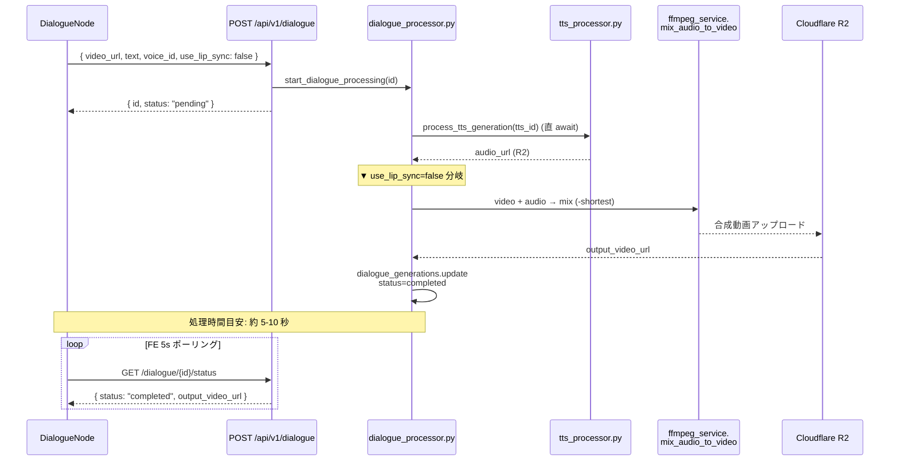
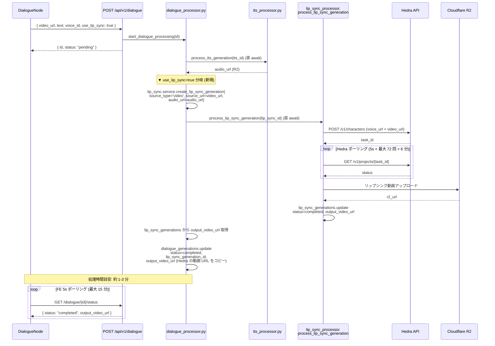
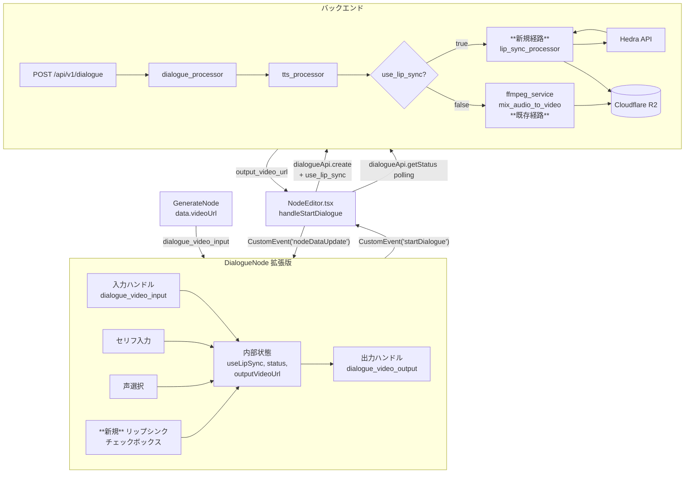

# Design Doc: DialogueNode リップシンク拡張

- **作成日**: 2026-05-15
- **ステータス**: Draft
- **対象バージョン**: movie-maker (Next.js 16 / React 19), movie-maker-api (FastAPI, Python 3.11+)
- **関連 Design Doc**: [`2026-05-14_dialogue-node.md`](./2026-05-14_dialogue-node.md) (DialogueNode 元 Design Doc。§14 Follow-ups で Hedra 拡張ポイント明示済)
- **複雑度評価**: `complexity_level: low` (既存資産再利用率が極めて高く、新規実装は分岐ロジック + UI トグルのみ)

---

## 1. 目的 / ゴール

DialogueNode の元 Design Doc §14 で Follow-up として明示されていた「Hedra リップシンク統合」を実装する。既存 DialogueNode を**新規ノードを増やさず**に拡張し、「☑ 口を動かす (リップシンク)」トグルを追加する。トグル ON 時には TTS で生成した音声を Hedra に渡し、キャラクターが実際に口を動かしてセリフを話す動画を合成する。

### 出荷完了の定義

ノードエディタの DialogueNode で `useLipSync` チェックボックスを ON にし、GenerateNode の動画 URL を接続して実行ボタンを押すと、Hedra 経由でリップシンクされた動画 URL が DialogueNode の出力 Handle から下流に流れる。OFF の場合は従来通り ffmpeg ミックスのみが動く。

### ROI 根拠

- バックエンドは `lip_sync_processor.process_lip_sync_generation` / `HedraProvider` / `lip_sync_generations` テーブル / R2 アップロードが**完全実装済**。`POST /api/v1/lip-sync` も既に稼働中。
- 新規実装は (a) `dialogue_processor.py` に `if use_lip_sync:` 分岐 1 つ、(b) DialogueNode UI にチェックボックス 1 つ、(c) DB カラム追加 2 つ — 約 2-3 時間の作業。
- 元 Design Doc §14 で既に拡張ポイントが設計済 (`useLipSync` フィールド、`lip_sync_generation_id` FK、`_run_tts_and_get_audio_url` 差し替え)。

### スコープ (IN)

- 既存 `DialogueNode` に `useLipSync: boolean` (default `false`) を追加し、ON 時に Hedra リップシンクで合成
- `source_type='video'` 固定 (動画 + 音声 → リップシンク動画)
- 日本語のみ (TTS と揃える)
- Hedra のみサポート (`LIP_SYNC_PROVIDER="hedra"` 固定)

### スコープ (OUT) — Follow-up

- Wav2Lip / SadTalker 等の他リップシンクプロバイダー
- `source_type='image'` (画像 → リップシンク動画)
- リップシンク品質設定 (Hedra の解像度・モデル切替)
- 多言語対応 (英語、中国語等)
- 既存 LipSync 専用エンドポイント (`POST /api/v1/lip-sync`) の UI 統合 (今回は DialogueNode 内部呼び出しのみ)

---

## 2. 合意チェックリスト

| 項目 | 合意内容 | 設計への反映箇所 |
|------|---------|----------------|
| ノード拡張方針 | 既存 `DialogueNode` を拡張 (新規 `LipSyncNode` 作成しない) | §6 フロントエンド変更 |
| デフォルト挙動 | `useLipSync` は `false` で既存 UX を壊さない | §6-1 型定義 + §9 マイグレーション (DEFAULT false) |
| リップシンクプロバイダー | Hedra のみ (`LIP_SYNC_PROVIDER` 固定) | §5 バックエンド分岐、§6 環境変数 |
| source_type | `"video"` 固定 (画像は今回扱わない) | §5-3 `dialogue_processor.py` 分岐 |
| 言語 | 日本語のみ (既存 DialogueNode に揃える) | §5-2 schemas (language=ja 固定) |
| 既存 ffmpeg ミックスの維持 | `useLipSync=false` 時は従来通り `mix_audio_to_video` を呼ぶ | §3 フロー図 / §5-3 分岐 |
| Hedra 呼び出し方法 | `process_lip_sync_generation(lip_sync_id)` を**直 await** (B3 解決パターン踏襲) | §5-3 `_run_lip_sync_and_get_video_url` |
| 中間データ参照 | `lip_sync_generation_id` を `dialogue_generations` に FK 保存 | §9 DB マイグレーション |
| フロントポーリング | 既存 `MAX_POLLING_ATTEMPTS=180 × 5s=15分` を維持 (リップシンク ON 時も収まる) | §6-2 ポーリング設定 |
| エラー UX | Hedra 失敗時に日本語の理由 (顔検出失敗等) を `errorMessage` に出す | §7 エラーハンドリング Table |

---

## 3. アーキテクチャ概要

### 3-1. シーケンス図 — `useLipSync=false` (現状フロー)



### 3-2. シーケンス図 — `useLipSync=true` (新規フロー)



### 3-3. ON/OFF 分岐ポイント

分岐は `_process_core` 内の TTS 完了直後の **1 箇所のみ**。視覚化:

```
_process_core():
  audio_url = await _run_tts_and_get_audio_url(...)
  ─────────────────────────────────────────────
  if record["use_lip_sync"]:
      # 新規分岐 (Hedra)
      output_video_url = await _run_lip_sync_and_get_video_url(
          video_url=video_url,
          audio_url=audio_url,
          user_id=user_id,
          generation_id=generation_id,
      )
  else:
      # 既存ロジック (ffmpeg ミックス)
      output_video_url = await _run_ffmpeg_mix(
          video_url=video_url,
          audio_url=audio_url,
          tmp_dir=tmp_dir,
          generation_id=generation_id,
      )
  ─────────────────────────────────────────────
  await update_dialogue_status(
      generation_id, "completed",
      output_video_url=output_video_url,
  )
```

---

## 4. 既存資産マップ

| 資産 | パス | 状態 | 今回の扱い |
|------|------|------|---------|
| LipSync ルーター | `movie-maker-api/app/lip_sync/router.py:30-86` | 完全実装済 | **未使用** (今回は内部関数呼び出しのみ) |
| LipSync スキーマ | `movie-maker-api/app/lip_sync/schemas.py:9-39` | `LipSyncRequest`, `LipSyncStatusResponse` 完成 | 再利用 OK |
| LipSync サービス | `movie-maker-api/app/lip_sync/service.py:15-50` | `create_lip_sync_generation` 完成 | **再利用** (dialogue_processor から直接 import) |
| LipSync プロセッサ | `movie-maker-api/app/tasks/lip_sync_processor.py:25-119` | `process_lip_sync_generation` 完成 | **再利用** (dialogue_processor から直 await) |
| Hedra プロバイダー | `movie-maker-api/app/external/hedra_provider.py:19-160` | `HedraProvider` 完成 | 再利用 OK |
| LipSync 抽象 IF | `movie-maker-api/app/external/lip_sync_provider.py` | `LipSyncProviderInterface` 完成 | 再利用 OK |
| `HEDRA_API_KEY` | `movie-maker-api/app/core/config.py:93` | 既存 env | **新規 env 不要** |
| `LIP_SYNC_PROVIDER` | `movie-maker-api/app/core/config.py:97` | デフォルト `"hedra"` | 再利用 OK |
| `lip_sync_generations` テーブル | Supabase 既存 | RLS / インデックス整備済 | 再利用 OK |
| Dialogue ルーター | `movie-maker-api/app/dialogue/router.py:26-74` | 既存 | **拡張**: `use_lip_sync` を request → service に渡す |
| Dialogue スキーマ | `movie-maker-api/app/dialogue/schemas.py:12-37` | 既存 | **拡張**: `use_lip_sync: bool = False` 追加 |
| Dialogue サービス | `movie-maker-api/app/dialogue/service.py:16-118` | 既存 | **拡張**: `create_dialogue_generation` に `use_lip_sync` 引数、`update_dialogue_status` に `lip_sync_generation_id` 引数を追加 |
| Dialogue プロセッサ | `movie-maker-api/app/tasks/dialogue_processor.py:122-180` | 既存 (ffmpeg ミックスのみ) | **最重要拡張**: TTS 完了後の分岐ロジック追加 |
| `dialogue_generations` テーブル | Supabase 既存 | RLS / インデックス整備済 | **拡張**: `use_lip_sync` + `lip_sync_generation_id` カラム追加 |
| DialogueNode 型 | `movie-maker/lib/types/node-editor.ts:177-191` | 既存 `DialogueNodeData` | **拡張**: `useLipSync: boolean` 追加 |
| DialogueNode コンポーネント | `movie-maker/components/node-editor/nodes/DialogueNode.tsx:1-214` | 既存 | **拡張**: チェックボックス UI、条件付き注意書き |
| dialogueApi クライアント | `movie-maker/lib/api/client.ts:2024-2041` | 既存 | **拡張**: `DialogueCreatePayload` に `use_lip_sync?: boolean` 追加 |
| NodeEditor.tsx の `handleStartDialogue` | `movie-maker/components/node-editor/NodeEditor.tsx` 既存 | 既存 (`'startDialogue'` リスナー) | **拡張**: `dialogueApi.create` に `use_lip_sync` を渡す |

### 4-1. 「再利用 OK / 拡張 / 新規追加」3 分類サマリー

- **再利用 OK (変更なし)**: LipSync ルーター・スキーマ・プロバイダー・抽象 IF、`HEDRA_API_KEY`、`lip_sync_generations` テーブル
- **拡張**: Dialogue ルーター / スキーマ / サービス / プロセッサ、DialogueNode 型 / コンポーネント、dialogueApi、`dialogue_generations` テーブル
- **新規追加**:
  - DB マイグレーション `docs/migrations/20260515_dialogue_use_lip_sync.sql`
  - dialogue_processor.py 内に `_run_lip_sync_and_get_video_url` 関数
  - dialogue_processor.py 内に `_run_ffmpeg_mix` 関数 (既存ロジックを関数化)

---

## 5. バックエンド変更

### 5-1. Pydantic スキーマ拡張 (`app/dialogue/schemas.py`)

**現状** (`schemas.py:12-20`):
```python
class DialogueCreateRequest(BaseModel):
    video_url: str = Field(..., description="入力動画の公開 URL (R2 等)")
    text: str = Field(..., min_length=1, max_length=5000, description="セリフテキスト")
    voice_id: str = Field(..., description="TTS 音声 ID")
    language: str = Field(default="ja", description="言語コード (固定: ja)")
    speed: float = Field(default=1.0, ge=0.25, le=4.0, description="読み上げ速度")
```

**変更後**:
```python
class DialogueCreateRequest(BaseModel):
    video_url: str = Field(..., description="入力動画の公開 URL (R2 等)")
    text: str = Field(..., min_length=1, max_length=5000, description="セリフテキスト")
    voice_id: str = Field(..., description="TTS 音声 ID")
    language: str = Field(default="ja", description="言語コード (固定: ja)")
    speed: float = Field(default=1.0, ge=0.25, le=4.0, description="読み上げ速度")
    # 追加: リップシンク有無
    use_lip_sync: bool = Field(
        default=False,
        description="True の場合 Hedra でリップシンクを行う。False は ffmpeg 単純ミックス",
    )
```

> 後方互換性: `use_lip_sync` は default false のため、既存クライアントは変更不要で動く。

### 5-2. ルーター変更 (`app/dialogue/router.py`)

**現状** (`router.py:38-45`):
```python
record = await create_dialogue_generation(
    user_id=user_id,
    video_url=request.video_url,
    text=request.text,
    voice_id=request.voice_id,
    language=request.language,
    speed=request.speed,
)
```

**変更後**:
```python
# TODO: request.use_lip_sync を service に渡す
record = await create_dialogue_generation(
    user_id=user_id,
    video_url=request.video_url,
    text=request.text,
    voice_id=request.voice_id,
    language=request.language,
    speed=request.speed,
    use_lip_sync=request.use_lip_sync,  # 追加
)
```

### 5-3. サービス変更 (`app/dialogue/service.py`)

**`create_dialogue_generation` シグネチャ拡張** (`service.py:16-23`):
```python
async def create_dialogue_generation(
    user_id: str,
    video_url: str,
    text: str,
    voice_id: str,
    language: str = "ja",
    speed: float = 1.0,
    use_lip_sync: bool = False,  # 追加
) -> dict:
    """
    dialogue_generations テーブルにレコードを作成して返す

    use_lip_sync=True の場合、TTS 完了後に Hedra でリップシンクを行う。
    """
    # TODO: record_data に "use_lip_sync": use_lip_sync を追加
    # TODO: それ以外は現状通り insert + 返却
    ...
```

**`update_dialogue_status` シグネチャ拡張** (`service.py:91-97`):
```python
async def update_dialogue_status(
    generation_id: str,
    status: str,
    output_video_url: Optional[str] = None,
    error_message: Optional[str] = None,
    tts_generation_id: Optional[str] = None,
    lip_sync_generation_id: Optional[str] = None,  # 追加
) -> None:
    """
    ステータスを更新する (バックグラウンドタスクから呼ぶ)

    Args:
        lip_sync_generation_id: LipSync 生成 ID (use_lip_sync=True 時のデバッグ/リトライ用)
    """
    # TODO: lip_sync_generation_id が None でなければ update_data に追加
    ...
```

`get_dialogue_status` の SELECT 列に `use_lip_sync` と `lip_sync_generation_id` を追加しておくと、フロントエンドでのデバッグ用に役立つ (今回はレスポンススキーマには出さない)。

### 5-4. プロセッサ変更 (`app/tasks/dialogue_processor.py`) — 最重要

#### 5-4-1. 既存処理フロー (現状)

`_process_core` (`dialogue_processor.py:122-180`) は次の固定フロー:
1. TTS → `audio_url`
2. 動画ダウンロード → `local_video_path`
3. 音声ダウンロード → `local_audio_path`
4. `ffmpeg_service.mix_audio_to_video()`
5. R2 アップロード
6. `update_dialogue_status(completed)`

#### 5-4-2. 変更後フロー

```python
async def _process_core(
    generation_id: str,
    user_id: str,
    video_url: str,
    text: str,
    voice_id: str,
    language: str,
    speed: float,
    use_lip_sync: bool,  # 追加引数
) -> None:
    """コア処理 (asyncio.wait_for でラップされる)"""
    # 1. TTS 生成 (use_lip_sync 関係なく必須)
    audio_url = await _run_tts_and_get_audio_url(
        text=text,
        voice_id=voice_id,
        language=language,
        speed=speed,
        user_id=user_id,
        generation_id=generation_id,
    )

    # ▼ 分岐 (最重要)
    if use_lip_sync:
        # TODO: Hedra リップシンク経由
        output_video_url = await _run_lip_sync_and_get_video_url(
            video_url=video_url,
            audio_url=audio_url,
            user_id=user_id,
            generation_id=generation_id,
        )
    else:
        # TODO: 既存 ffmpeg ミックス (現状ロジックを関数化)
        output_video_url = await _run_ffmpeg_mix(
            video_url=video_url,
            audio_url=audio_url,
            generation_id=generation_id,
        )

    # 共通: completed に更新
    await update_dialogue_status(
        generation_id,
        "completed",
        output_video_url=output_video_url,
    )
```

#### 5-4-3. 新規関数 `_run_lip_sync_and_get_video_url` — シグネチャ

```python
async def _run_lip_sync_and_get_video_url(
    video_url: str,
    audio_url: str,
    user_id: str,
    generation_id: str,
) -> str:
    """
    Hedra リップシンクを実行して動画 URL を返す。

    B3 解決パターン踏襲: process_lip_sync_generation を直列 await する。
    `start_lip_sync_processing` (asyncio.create_task) は使わない (混乱回避)。

    フロー:
      1. lip_sync.service.create_lip_sync_generation(
             user_id=user_id,
             source_type='video',  # 固定
             source_url=video_url,
             audio_url=audio_url,
         ) → lip_sync_record
      2. dialogue_generations.lip_sync_generation_id を更新 (デバッグ用)
      3. await process_lip_sync_generation(lip_sync_record["id"])
         (Hedra ポーリングはこの関数内で完結。最大 6 分)
      4. lip_sync.service.get_lip_sync_status(user_id, lip_sync_id) で取得
      5. status == "completed" → output_video_url を返す
      6. status == "failed" → ValueError(日本語メッセージ) を投げる
         (呼び出し元の except ValueError でキャッチされて failed 更新される)

    Args:
        video_url: 元動画 URL (Hedra の source_url に渡す)
        audio_url: TTS 出力音声 URL (Hedra の audio_url に渡す)
        user_id: ユーザー ID
        generation_id: Dialogue 生成 ID (lip_sync_generation_id FK 記録用)

    Returns:
        str: リップシンク済み動画 URL (R2)

    Raises:
        ValueError: Hedra リップシンクが failed になった場合
    """
    # TODO: 1. lip_sync.service.create_lip_sync_generation(...) で record 作成
    # TODO: 2. await update_dialogue_status(generation_id, "processing",
    #            lip_sync_generation_id=lip_sync_record["id"])
    # TODO: 3. await process_lip_sync_generation(lip_sync_record["id"])
    # TODO: 4. lip_sync_status = await get_lip_sync_status(user_id, lip_sync_id)
    # TODO: 5. lip_sync_status が None → ValueError("リップシンク生成が見つかりません")
    # TODO: 6. lip_sync_status["status"] == "completed" なら output_video_url 返却
    # TODO: 7. failed なら ValueError(lip_sync_status.get("error_message", "リップシンク生成に失敗しました"))
    ...
```

> **追加 import が必要**:
> ```python
> from app.lip_sync.service import create_lip_sync_generation, get_lip_sync_status
> from app.tasks.lip_sync_processor import process_lip_sync_generation
> ```

#### 5-4-4. 既存ロジックの関数化 `_run_ffmpeg_mix` — シグネチャ

現状 `_process_core` 内にインラインで書かれているステップ 4-7 を関数として切り出す。**ロジックの変更はゼロ**、リファクタのみ。

```python
async def _run_ffmpeg_mix(
    video_url: str,
    audio_url: str,
    generation_id: str,
) -> str:
    """
    既存の ffmpeg ミックス処理 (リップシンクなし)。

    元動画 + 音声 → ffmpeg amix → R2 アップロード → output_video_url 返却。

    変更前 _process_core L132-173 のロジックをそのまま関数化したもの。
    """
    # TODO: with tempfile.TemporaryDirectory() as tmp_dir:
    # TODO:   local_video_path = _download_file(video_url, ...)
    # TODO:   local_audio_path = _download_file(audio_url, ...)
    # TODO:   output_path = ...
    # TODO:   await ffmpeg_service.mix_audio_to_video(...)
    # TODO:   output_video_url = await upload_video(output_path, ...)
    # TODO: return output_video_url
    ...
```

> **重要**: `tempfile.TemporaryDirectory` を関数内に閉じ込めることで、リップシンク経路では一時ディレクトリを作らない (Hedra の動画は LipSync プロセッサ側で既に R2 にアップロード済のため)。

#### 5-4-5. レコード取得時の `use_lip_sync` 取り出し

`process_dialogue_generation` (`dialogue_processor.py:36-119`) の DB レコード取得部分:

```python
record = response.data
user_id = record["user_id"]
video_url = record["video_url"]
text = record["text"]
voice_id = record["voice_id"]
language = record.get("language", "ja")
speed = record.get("speed", 1.0)
use_lip_sync = record.get("use_lip_sync", False)  # 追加 (default False で後方互換)
```

`_process_core` 呼び出しに `use_lip_sync=use_lip_sync` を渡す。

### 5-5. エラーハンドリング追加 (§7 と連動)

`process_dialogue_generation` の except ブロックに Hedra 固有の判定を追加:

```python
except ValueError as e:
    msg = str(e) if str(e) else "音声生成に失敗しました"
    # TODO: Hedra 由来のエラーは "リップシンク生成に失敗しました" でラップ
    # TODO: 例: msg に "Hedra" "face" "顔" を含むなら専用メッセージ
    await update_dialogue_status(generation_id, "failed", error_message=msg)
    logger.exception("Dialogue TTS/LipSync failed", exc_info=e)
```

詳細メッセージは §7 のテーブル参照。

---

## 6. フロントエンド変更

### 6-1. 型定義 (`movie-maker/lib/types/node-editor.ts`)

**現状** (`node-editor.ts:177-191`):
```typescript
export interface DialogueNodeData extends BaseNodeData {
  type: 'dialogue';
  text: string;
  voiceId: string | null;
  language: 'ja';
  speed: number;
  status: 'idle' | 'pending' | 'processing' | 'completed' | 'failed';
  progress: number;
  generationId: string | null;
  outputVideoUrl: string | null;
  // errorMessage は BaseNodeData から継承 (string | undefined)
}
```

**変更後**:
```typescript
export interface DialogueNodeData extends BaseNodeData {
  type: 'dialogue';
  text: string;
  voiceId: string | null;
  language: 'ja';
  speed: number;
  // 追加: リップシンク (1 フィールドのみ)
  useLipSync: boolean;          // default false
  // 実行状態 (既存)
  status: 'idle' | 'pending' | 'processing' | 'completed' | 'failed';
  progress: number;
  generationId: string | null;
  outputVideoUrl: string | null;
  // errorMessage は BaseNodeData から継承 — 重複宣言しないこと。
}
```

> **B1 修正**: `errorMessage` は `BaseNodeData` から継承される `string | undefined`。
> `DialogueNodeData` で再宣言しない。`createDefaultNodeData` でも `errorMessage: null` を
> セットしない (継承の `undefined` 状態を保つ)。
>
> **N1 修正 (YAGNI)**: `lipSyncGenerationId` フィールドは frontend では使わないため削除。
> バックエンドの `dialogue_generations.lip_sync_generation_id` はデバッグ用 FK として保持するが、
> フロントには露出しない (将来必要になった時に追加)。

**`createDefaultNodeData` の `dialogue` ケース** に追加 (該当行は `node-editor.ts` 既存 switch):
```typescript
case 'dialogue':
  return {
    type: 'dialogue',
    isValid: true,
    text: '',
    voiceId: null,
    language: 'ja',
    speed: 1.0,
    useLipSync: false,             // 追加 (default OFF)
    status: 'idle',
    progress: 0,
    generationId: null,
    outputVideoUrl: null,
  };
```

### 6-2. DialogueNode.tsx の変更

**現状** (`DialogueNode.tsx:180-185`): 注意書きが常時表示:
```tsx
{/* 注意書き */}
<div className="p-2 rounded bg-[#2a2a2a] border border-yellow-600/30">
  <p className="text-[10px] text-yellow-500">
    ※ 口の動きは合成しません (TTS のみ)
  </p>
</div>
```

**変更後の UI 仕様**:

1. **リップシンクチェックボックス** を「速度スライダー」と「注意書き」の間に追加
2. **既存の注意書き** ("口の動きは合成しません") を **`!data.useLipSync` の条件付き表示** に変更
3. **リップシンク ON 時の専用ヒント** を新規追加 (処理時間と課金の警告)
4. **実行ボタンのラベル** を `useLipSync` で切り替え (「合成する」 / 「リップシンク合成する」)

UI スケッチ:

```tsx
{/* リップシンクトグル (新規追加) */}
<div className="flex items-start gap-2 p-2 rounded bg-[#1a1a1a]">
  <input
    type="checkbox"
    id={`use-lip-sync-${id}`}
    checked={data.useLipSync}
    onChange={(e) => updateNodeData({ useLipSync: e.target.checked })}
    disabled={isProcessing}
    className="mt-0.5 accent-[#fce300]"
  />
  <label htmlFor={`use-lip-sync-${id}`} className="cursor-pointer">
    <div className="text-xs text-gray-200">口を動かす (リップシンク)</div>
    <div className="text-[10px] text-gray-500 mt-0.5">
      Hedra で口パク合成 ($0.10/分)、処理に 1-3 分かかります
    </div>
  </label>
</div>

{/* 注意書き (条件付き) */}
{!data.useLipSync && (
  <div className="p-2 rounded bg-[#2a2a2a] border border-yellow-600/30">
    <p className="text-[10px] text-yellow-500">
      ※ 口の動きは合成しません (TTS のみ)
    </p>
  </div>
)}

{data.useLipSync && (
  <div className="p-2 rounded bg-[#2a2a2a] border border-blue-600/30">
    <p className="text-[10px] text-blue-400 leading-relaxed">
      キャラの顔がはっきり映る動画を入力してください。<br />
      Hedra が顔を検出できない場合は失敗します。
    </p>
  </div>
)}
```

実行ボタン (現状 `DialogueNode.tsx:191-203`) の調整:

```tsx
<button
  onClick={handleExecute}
  disabled={!canExecute}
  className={cn(/* 既存クラス */)}
>
  <Mic className="w-4 h-4" />
  {data.useLipSync ? 'リップシンク合成する' : '合成する'}
</button>
```

進捗表示 (現状 `DialogueNode.tsx:71-97`):
リップシンク ON 時は処理が長いため、`renderStatusArea` の processing 表示に時間目安を追加:

```tsx
if (data.status === 'processing' || data.status === 'pending') {
  return (
    <div className="flex items-center gap-2 p-2 bg-[#1a1a1a] rounded-lg">
      <Loader2 className="w-4 h-4 text-[#fce300] animate-spin" />
      <span className="text-xs text-gray-300">
        処理中... {data.progress}%
        {data.useLipSync && (
          <span className="text-gray-500 ml-1">(1-3 分かかります)</span>
        )}
      </span>
    </div>
  );
}
```

### 6-3. API クライアント変更 (`movie-maker/lib/api/client.ts`)

**現状** (`client.ts:2004-2009`):
```typescript
type DialogueCreatePayload = {
  video_url: string;
  text: string;
  voice_id: string;
  speed?: number;
};
```

**変更後**:
```typescript
type DialogueCreatePayload = {
  video_url: string;
  text: string;
  voice_id: string;
  speed?: number;
  use_lip_sync?: boolean;  // 追加 (default false, BE 側で扱う)
};
```

`dialogueApi.create` の body は既に `JSON.stringify({ ...payload, language: 'ja' })` でスプレッドしているため、`use_lip_sync` を payload に含めれば自動的に送られる。**他の変更不要**。

### 6-4. NodeEditor.tsx 側の `handleStartDialogue` の変更

`'startDialogue'` イベントリスナー内で `dialogueApi.create` を呼んでいる箇所に `use_lip_sync` を追加する:

```typescript
// NodeEditor.tsx の handleStartDialogue (既存)
const dialogueNode = nodes.find((n) => n.id === nodeId);
const dialogueData = dialogueNode?.data as DialogueNodeData;

const result = await dialogueApi.create({
  video_url: videoUrl,
  text: dialogueData.text,
  voice_id: dialogueData.voiceId!,
  speed: dialogueData.speed,
  use_lip_sync: dialogueData.useLipSync,  // 追加
});
```

**ポーリング設定の確認** (B4 解決パターン):
既存 `DIALOGUE_MAX_POLLING_ATTEMPTS=180`、`POLLING_INTERVAL_MS=5000` → 最大 15 分。
Hedra ポーリング (BE 側) は最大 6 分。TTS + LipSync 合算でも 10 分以内に収まる → **フロント側変更不要**。

### 6-5. 既存 DialogueNode テスト追加

`DialogueNode.test.tsx` (存在すれば) に 4 ケース追加:

| ケース | 検証内容 |
|--------|---------|
| useLipSync=false の注意書き表示 | "口の動きは合成しません" が表示される、青い Hedra 注意書きは非表示 |
| useLipSync チェック → ON | チェックすると updateNodeData が `{ useLipSync: true }` を dispatch する |
| useLipSync=true の注意書き表示 | "口を動かす (リップシンク)" の説明と Hedra 注意書きが表示、TTS 注意書きは非表示 |
| useLipSync=true 時の実行ボタンラベル | "リップシンク合成する" が表示される |

---

## 7. エラーハンドリング

### 7-1. Hedra 固有エラー Table

| ケース | 原因 | 検出位置 | ユーザー向けメッセージ (日本語) |
|--------|------|---------|-------------------------------|
| Hedra 顔検出失敗 | 動画にキャラの顔が映っていない / 横向きすぎる / 解像度不足 | `HedraProvider.check_status` → `status="failed"`, `error="face_detection_failed"` 等 | 「動画から顔を検出できませんでした。キャラの顔がはっきり映る動画を使ってください」 |
| Hedra 動画長超過 | Hedra 上限 (通常 1 分) を超える動画 | `HedraProvider.generate_lip_sync` → HTTP 400 | 「動画が長すぎます。1 分以内の動画を使ってください」 |
| Hedra API キー不正 | `HEDRA_API_KEY` 未設定 / 期限切れ | `HedraProvider.generate_lip_sync` → HTTP 401/403 | 「リップシンク サービスに接続できません。管理者にお問い合わせください」 |
| Hedra クォータ超過 | アカウントのクレジット枯渇 | `HedraProvider.generate_lip_sync` → HTTP 429 | 「リップシンク サービスの利用上限に達しました。しばらくしてから再試行してください」 |
| Hedra ポーリングタイムアウト | 5 秒 × 72 回 = 6 分超過 | `lip_sync_processor.process_lip_sync_generation` (`MAX_POLLING_ATTEMPTS=72`) | 「リップシンク生成がタイムアウトしました (6 分)。再試行してください」 |
| Hedra 出力品質警告 | (将来の Follow-up) | — | 今回は警告なし |
| Hedra → R2 アップロード失敗 | ネットワーク障害 | `lip_sync_processor.upload_to_r2` で例外 | 「動画の保存に失敗しました。再試行してください」 |
| バックエンド全体タイムアウト | TTS + Hedra 合算 10 分超 | `asyncio.wait_for(timeout=600)` (既存) | 「処理がタイムアウトしました (10 分)。再試行してください」(既存メッセージ) |

### 7-2. エラー伝播フロー (lip_sync → dialogue)

```
HedraProvider.check_status → LipSyncStatus(status="failed", error_message="face_detection_failed")
  ↓
lip_sync_processor.process_lip_sync_generation:
  raise Exception(f"LipSync provider failed: {error_msg}")
  → except でキャッチされ lip_sync_generations.status="failed", error_message=str(e) で更新
  → 関数は正常 return (例外は呼び出し元には伝播しない)
  ↓
dialogue_processor._run_lip_sync_and_get_video_url:
  await process_lip_sync_generation(lip_sync_id) ← 完了
  status = await get_lip_sync_status(user_id, lip_sync_id)
  if status["status"] == "failed":
      raise ValueError(_translate_hedra_error(status["error_message"]))
  ↓
process_dialogue_generation の except ValueError:
  await update_dialogue_status(generation_id, "failed", error_message=msg)
```

**重要**: `process_lip_sync_generation` は内部で例外を握り潰す (lip_sync_generations を failed に書くだけで raise しない) ため、dialogue 側からは **DB から status を再 fetch して判定** する必要がある。これがリスク §13 の「status 同期」項目。

### 7-3. メッセージ翻訳ヘルパー (新規)

```python
def _translate_hedra_error(error_message: Optional[str]) -> str:
    """
    Hedra の英文エラーを日本語ユーザーメッセージに変換する

    既知のキーワードベース判定。マッチしない場合は汎用メッセージ。
    """
    # TODO: error_message = (error_message or "").lower()
    # TODO: if "face" in error_message or "detect" in error_message:
    # TODO:     return "動画から顔を検出できませんでした。キャラの顔がはっきり映る動画を使ってください"
    # TODO: if "duration" in error_message or "length" in error_message:
    # TODO:     return "動画が長すぎます。1 分以内の動画を使ってください"
    # TODO: if "quota" in error_message or "credit" in error_message:
    # TODO:     return "リップシンク サービスの利用上限に達しました。しばらくしてから再試行してください"
    # TODO: if "timeout" in error_message:
    # TODO:     return "リップシンク生成がタイムアウトしました (6 分)。再試行してください"
    # TODO: return "リップシンク生成に失敗しました。動画とセリフを確認して再試行してください"
    ...
```

---

## 8. テスト計画

### 8-1. バックエンドテスト

**新規テストファイル**: `movie-maker-api/tests/dialogue/test_lip_sync_branch.py`

| テストケース | モック対象 | 検証内容 |
|------------|---------|---------|
| `use_lip_sync=False` で従来通り ffmpeg 経由 | TTS → 成功, `_run_ffmpeg_mix` (mock) | `_run_lip_sync_and_get_video_url` が**呼ばれない**こと、`mix_audio_to_video` が呼ばれること |
| `use_lip_sync=True` で Hedra 経路 | TTS → 成功, `process_lip_sync_generation` (mock), `get_lip_sync_status` → completed | `_run_lip_sync_and_get_video_url` が呼ばれ、`lip_sync_generation_id` が DB に書かれる |
| `use_lip_sync=True` で Hedra 失敗 | `get_lip_sync_status` → `{status: "failed", error_message: "face_detection_failed"}` | `dialogue_generations.status="failed"`, `error_message` が日本語化される ("動画から顔を検出できませんでした...") |
| `use_lip_sync=True` で `create_lip_sync_generation` が例外 | mock が `Exception("Supabase error")` | `dialogue_generations.status="failed"` で例外メッセージが記録される |
| `use_lip_sync` カラム未設定の既存レコード | DB record に `use_lip_sync` が欠如 | `record.get("use_lip_sync", False)` のフォールバックで OFF として扱う |

**既存テスト維持**: 現状の dialogue_processor テストは `use_lip_sync=False` 経路の正常系として継続。

### 8-2. フロントエンドテスト

**ファイル**: `movie-maker/components/node-editor/nodes/DialogueNode.test.tsx` (拡張)

| テストケース | 検証内容 |
|------------|---------|
| 初期状態の useLipSync=false | チェックボックス未チェック、TTS 注意書き表示、Hedra 注意書き非表示、ボタンラベル「合成する」 |
| useLipSync チェック → ON | `nodeDataUpdate` イベントが `{ useLipSync: true }` で dispatch される |
| useLipSync=true で再描画 | TTS 注意書き非表示、Hedra 注意書き ("Hedra で口パク合成 ($0.10/分)...") 表示、ボタンラベル「リップシンク合成する」 |
| useLipSync=true & processing 状態 | "処理中..." に "(1-3 分かかります)" が併記される |

### 8-3. E2E 確認 (実 API 課金あり)

Phase 3 (§10) で承認後に実行:
- GenerateNode → DialogueNode (`useLipSync=true`) で人物動画 + セリフ → リップシンク済 mp4 を目視確認
- Hedra で意図的に顔のない動画を入力 → 日本語エラー表示確認

---

## 9. DB マイグレーション

**ファイル**: `docs/migrations/20260515_dialogue_use_lip_sync.sql`

```sql
-- Dialogue 生成テーブルにリップシンク関連カラムを追加
-- 実行日: 2026-05-15
-- 目的: DialogueNode の useLipSync トグル + Hedra リップシンク統合
-- 関連 Design Doc: docs/plans/2026-05-15_dialogue-lip-sync.md

-- 1. リップシンク有無フラグ (default false で既存レコードは OFF として扱う)
ALTER TABLE dialogue_generations
    ADD COLUMN IF NOT EXISTS use_lip_sync BOOLEAN NOT NULL DEFAULT false;

-- 2. リップシンク生成 ID への FK (デバッグ・リトライ用、ON DELETE SET NULL で安全)
ALTER TABLE dialogue_generations
    ADD COLUMN IF NOT EXISTS lip_sync_generation_id UUID
    REFERENCES lip_sync_generations(id) ON DELETE SET NULL;

-- 3. インデックス (lip_sync_generation_id で逆引きする可能性が低いため、必要なら後追い)
-- CREATE INDEX IF NOT EXISTS idx_dialogue_generations_lip_sync_id
--     ON dialogue_generations(lip_sync_generation_id);

-- 既存 RLS ポリシーは変更不要 (新カラムは既存ポリシーで自動的にカバーされる)

COMMENT ON COLUMN dialogue_generations.use_lip_sync IS
    'true の場合 Hedra でリップシンクを行う。false は ffmpeg 単純ミックス (default)';
COMMENT ON COLUMN dialogue_generations.lip_sync_generation_id IS
    'use_lip_sync=true 時の lip_sync_generations への参照 (デバッグ/リトライ用)';
```

> **適用方法**: ルート CLAUDE.md の「Supabaseマイグレーション運用」に従い、`mcp__supabase__apply_migration` で本番適用する。

**ロールバック手順** (緊急時のみ):
```sql
ALTER TABLE dialogue_generations DROP COLUMN IF EXISTS lip_sync_generation_id;
ALTER TABLE dialogue_generations DROP COLUMN IF EXISTS use_lip_sync;
```

---

## 10. 段階リリース計画

実装は約 2-3 時間 (Phase 分割不要)。BE → FE → E2E の順で順次検証する。

### 10-1. ステップ 1: バックエンド変更 + 単体テスト

**完了条件 (L1/L2/L3)**:
- L3: `pytest tests/dialogue/ -v` 全件 pass (新規 `test_lip_sync_branch.py` 含む)
- L2: マイグレーション適用後、`POST /api/v1/dialogue` で `use_lip_sync: true` が受理される (HTTP 200)
- L1: `use_lip_sync=true` で実 Hedra 呼び出しが成功 (Phase 2 で確認)

**対象ファイル**:
- `docs/migrations/20260515_dialogue_use_lip_sync.sql` (新規 + Supabase 適用)
- `movie-maker-api/app/dialogue/schemas.py` (拡張)
- `movie-maker-api/app/dialogue/router.py` (拡張)
- `movie-maker-api/app/dialogue/service.py` (拡張)
- `movie-maker-api/app/tasks/dialogue_processor.py` (最重要拡張)
- `movie-maker-api/tests/dialogue/test_lip_sync_branch.py` (新規)

### 10-2. ステップ 2: フロントエンド変更

**完了条件 (L1/L2/L3)**:
- L3: `npm run build` 成功
- L2: DialogueNode.test.tsx 新規 4 ケース pass
- L1: ノードエディタで useLipSync チェックボックスを ON にし、`dialogueApi.create` の payload に `use_lip_sync: true` が含まれる (Network タブで確認)

**対象ファイル**:
- `movie-maker/lib/types/node-editor.ts` (拡張: `useLipSync` 追加)
- `movie-maker/components/node-editor/nodes/DialogueNode.tsx` (拡張)
- `movie-maker/lib/api/client.ts` (拡張: payload 型)
- `movie-maker/components/node-editor/NodeEditor.tsx` (`handleStartDialogue` 拡張)

### 10-3. ステップ 3: E2E 確認 (実 Hedra API 課金あり)

> **注意**: Hedra 課金 ($0.10/分) が発生するため、実行前にユーザー承認を得ること。

**完了条件 (L1)**:
- 人物の顔が映る 5-10 秒動画 + 日本語セリフで `useLipSync=true` 実行
- 1-3 分後にリップシンク済 mp4 が R2 に保存されることを確認
- 動画再生時、キャラが口を動かしていることを目視確認
- 故意に顔のない動画 (風景動画等) で実行 → 日本語エラー「動画から顔を検出できませんでした...」が表示されることを確認

### 10-4. 統合ポイント定義 (各ステップで何が動くか)

```
ステップ 1 完了時:
  - cURL で POST /api/v1/dialogue (use_lip_sync=true) → 200
  - DB に lip_sync_generation_id が記録される
  - 既存 use_lip_sync=false 経路に regression なし

ステップ 2 完了時:
  - ブラウザでチェックボックス操作可能
  - Network タブで payload に use_lip_sync 含む
  - エラーメッセージが日本語で表示される (UI レベルの確認)

ステップ 3 完了時:
  - 出荷完了の定義 (§1) を満たす E2E が成立
```

### 10-5. 実装アプローチ選択

**Vertical Slice** を採用。理由:
- BE → FE → E2E の縦切りで、各ステップ完了時に独立検証可能
- 既存 lip_sync 関連の Horizontal レイヤー (Provider / Processor) は全て既製品で完成済なので、新規水平構築は不要
- 「リップシンク機能」というユーザー価値を最小コストで end-to-end 検証できる

---

## 11. スコープ外 / Follow-ups

### 11-1. 今回実装しないもの

- **他リップシンクプロバイダー** (Wav2Lip、SadTalker 等) — 抽象 IF `LipSyncProviderInterface` は既存。将来 `LIP_SYNC_PROVIDER` 環境変数の切替で対応可能
- **画像 → リップシンク動画** (`source_type='image'`) — Hedra Character-3 は image 入力もサポート。将来 DialogueNode の入力 Handle を `image_or_video` に変更すれば実装可能
- **リップシンク品質設定** — Hedra Studio の Character-3 vs Omnia 選択、解像度設定等
- **多言語対応** — TTS 側で `language` パラメータが既に存在するため、Phase 4 で英語追加可能
- **既存 LipSync 専用エンドポイント (`POST /api/v1/lip-sync`) との UI 統合** — 今回は DialogueNode 内部呼び出しのみ。将来「LipSyncNode (独立)」も並行運用可能
- **進捗バー細分化** — 現状 `progress` は 0-100% (Hedra のポーリング進捗)。「TTS 30% / Hedra 70%」のような段階別表示は Follow-up
- **動画長制限の事前バリデーション** — 現状はバックエンドが Hedra から 400 を受けて初めて検出。FE で動画長を取得して事前チェックする UX は Follow-up

### 11-2. Follow-up 候補

| 項目 | 優先度 | 想定実装コスト |
|------|--------|--------------|
| 画像 → リップシンク動画 (`source_type='image'`) | Medium | 半日 (DialogueNode 入力 Handle 型変更) |
| Hedra 課金確認ダイアログ | Low | 1 時間 |
| 進捗バー段階別表示 (TTS / Hedra) | Low | 1 時間 |
| Wav2Lip プロバイダー追加 | Low | 2 日 (Provider 実装 + 比較検証) |
| 動画長の FE 事前バリデーション | Medium | 半日 |

---

## 12. 統合ポイントマップ

```yaml
インテグレーションポイント 1:
  既存コンポーネント: dialogue_processor.process_dialogue_generation
  統合方法: TTS 完了後の if 分岐 (use_lip_sync)
  影響レベル: High (データフロー分岐の新規追加)
  必要テストカバレッジ:
    - use_lip_sync=false 経路の regression テスト
    - use_lip_sync=true 経路の新規テスト
    - 既存 record で use_lip_sync カラム欠如時の fallback

インテグレーションポイント 2:
  既存コンポーネント: lip_sync.service.create_lip_sync_generation
  統合方法: dialogue_processor から直接 import + 呼び出し
  影響レベル: Low (既存関数は変更なし、参照のみ)
  必要テストカバレッジ: モックで呼び出し確認

インテグレーションポイント 3:
  既存コンポーネント: lip_sync_processor.process_lip_sync_generation
  統合方法: dialogue_processor から直 await (B3 解決パターン)
  影響レベル: Medium (await 中の例外伝播ルートが新規)
  必要テストカバレッジ:
    - 正常完了時に lip_sync_generations.status=completed → dialogue 側に伝わる
    - 失敗時に lip_sync_generations.status=failed → dialogue 側で再 fetch して検出

インテグレーションポイント 4:
  既存コンポーネント: DialogueNode UI (既存)
  統合方法: チェックボックス追加 + 注意書き条件付き表示
  影響レベル: Low (既存 UI を読み取り専用で参照、新規要素のみ追加)
  必要テストカバレッジ: 4 ケース (§8-2)

インテグレーションポイント 5:
  既存コンポーネント: dialogue_generations テーブル
  統合方法: 2 カラム ADD COLUMN
  影響レベル: Low (default false で既存レコードは OFF 扱い、RLS 影響なし)
  必要テストカバレッジ: マイグレーション適用後の SELECT で値が取れること
```

---

## 13. リスク

| リスク | 深刻度 | 確認状況 | 対応 |
|--------|--------|---------|------|
| Hedra 顔検出失敗時の UX | **High** | Hedra は内部で `error_message` を返す | §7-3 `_translate_hedra_error` で日本語化、UI で目立つ赤枠表示 |
| 処理時間 1-3 分のユーザー待機 UX | Medium | フロントは既に 15 分タイムアウトで余裕あり | §6-2 で processing 表示に時間目安を併記。Follow-up で進捗バー段階表示 |
| 課金倍増 ($0.01-0.05/セリフ → $0.10-0.20/セリフ) | Medium | useLipSync=false がデフォルトなので意図的 ON が必要 | チェックボックス横に料金表示で意図しない使用を防止 |
| 動画にキャラの顔がはっきり映らない場合の品質低下 | Medium | Hedra 側で検出失敗時はそもそも `failed` を返す | UI に「キャラの顔がはっきり映る動画を入力してください」の注意書き表示 (§6-2) |
| `process_lip_sync_generation` 直 await 中の status 同期 | **High** | `lip_sync_processor` は例外を握り潰して DB に failed を書く設計 | dialogue 側で `await` 直後に `get_lip_sync_status` を呼んで再 fetch (§7-2 フロー) |
| バックエンドタイムアウト超過 (TTS 5分 + Hedra 6分 > 10分) | Medium | 既存 `PROCESSING_TIMEOUT_SECONDS=600` | 実 E2E で計測し、必要なら 900 秒に延長 |
| 既存 record の `use_lip_sync` カラム欠如時の挙動 | Low | DEFAULT false でマイグレーション既定値あり | `record.get("use_lip_sync", False)` で二重防御 |
| LipSync プロセッサが status を書き込む前に dialogue 側が fetch する race condition | Low | `process_lip_sync_generation` は完全に `await` で待つため、return 後は DB 確定済 | テストで `await` 完了→ `get_lip_sync_status` の順序を確認 |
| Hedra 動画長上限 (公称 1 分) | Medium | Hedra から HTTP 400 で検出 | §7-1 のメッセージ表示。Follow-up で FE 事前バリデーション |

---

## 14. コンポーネント階層とデータフロー図



---

## 15. 参考ファイル (File:Line)

### 既存資産

| ファイル | 行 | 内容 |
|---------|-----|------|
| `movie-maker-api/app/lip_sync/router.py` | L30-86 | `POST /api/v1/lip-sync`, `GET /lip-sync/{id}/status` |
| `movie-maker-api/app/lip_sync/schemas.py` | L9-39 | `LipSyncRequest`, `LipSyncStatusResponse` |
| `movie-maker-api/app/lip_sync/service.py` | L15-50 | `create_lip_sync_generation` (再利用対象) |
| `movie-maker-api/app/lip_sync/service.py` | L53-85 | `get_lip_sync_status` (再利用対象) |
| `movie-maker-api/app/tasks/lip_sync_processor.py` | L25-119 | `process_lip_sync_generation` (直 await 対象) |
| `movie-maker-api/app/tasks/lip_sync_processor.py` | L21-22 | `POLLING_INTERVAL_SECONDS=5, MAX_POLLING_ATTEMPTS=72` (= 6 分) |
| `movie-maker-api/app/external/hedra_provider.py` | L19-160 | `HedraProvider` (`generate_lip_sync`, `check_status`) |
| `movie-maker-api/app/core/config.py` | L92-97 | `HEDRA_API_KEY`, `LIP_SYNC_PROVIDER` |

### 拡張対象

| ファイル | 行 | 拡張内容 |
|---------|-----|---------|
| `movie-maker-api/app/dialogue/schemas.py` | L12-20 | `DialogueCreateRequest` に `use_lip_sync: bool = False` 追加 |
| `movie-maker-api/app/dialogue/router.py` | L38-45 | `create_dialogue_generation` に `use_lip_sync` 渡し |
| `movie-maker-api/app/dialogue/service.py` | L16-53 | `create_dialogue_generation` シグネチャ拡張 |
| `movie-maker-api/app/dialogue/service.py` | L91-118 | `update_dialogue_status` に `lip_sync_generation_id` 引数追加 |
| `movie-maker-api/app/tasks/dialogue_processor.py` | L36-119 | `process_dialogue_generation` に `use_lip_sync` 取得追加 |
| `movie-maker-api/app/tasks/dialogue_processor.py` | L122-180 | `_process_core` に `if use_lip_sync:` 分岐追加 + 既存ロジックを `_run_ffmpeg_mix` に関数化 |
| `movie-maker-api/app/tasks/dialogue_processor.py` | 新規 | `_run_lip_sync_and_get_video_url`, `_translate_hedra_error` |
| `movie-maker/lib/types/node-editor.ts` | L177-191 | `DialogueNodeData` に `useLipSync: boolean` のみ追加 (errorMessage は BaseNodeData から継承、再宣言禁止) |
| `movie-maker/components/node-editor/nodes/DialogueNode.tsx` | L180-185 | 注意書きを条件付き表示に変更 + リップシンクチェックボックス追加 |
| `movie-maker/components/node-editor/nodes/DialogueNode.tsx` | L71-97 | `renderStatusArea` に処理時間目安追加 |
| `movie-maker/components/node-editor/nodes/DialogueNode.tsx` | L191-203 | ボタンラベル切替 |
| `movie-maker/lib/api/client.ts` | L2004-2009 | `DialogueCreatePayload` に `use_lip_sync?: boolean` 追加 |
| `movie-maker/components/node-editor/NodeEditor.tsx` | `handleStartDialogue` 内 | `dialogueApi.create` に `use_lip_sync` 渡し |

### 参考 (元 Design Doc)

| ファイル | 行 | 内容 |
|---------|-----|------|
| `docs/plans/2026-05-14_dialogue-node.md` | §14 | Hedra リップシンク拡張ポイント明示 (`useLipSync`, `lip_sync_generation_id` FK, `_run_tts_and_get_audio_url` 差し替え) |
| `docs/plans/2026-05-14_dialogue-node.md` | §3 | DialogueNode シーケンス図 (現状フロー) |
| `docs/plans/2026-05-14_dialogue-node.md` | §8 | Handle 設計 (再利用) |
| `docs/plans/2026-05-14_dialogue-node.md` | §10 | エラーハンドリング Table (今回 §7 で Hedra 固有を追記) |

### 解決済パターン参照

- **B1 (HasVideoOutput)**: `node-editor.ts:266-` の `HasVideoOutput` 型 + `getNodeVideoOutput` を `handleStartDialogue` が既に使用 (変更不要)
- **B2 (上流動画 URL 取得)**: NodeEditor.tsx の既存 `handleStartDialogue` ロジックがそのまま機能
- **B3 (直 await TTS)**: 今回 lip_sync にも同パターンを適用 (`process_lip_sync_generation` を直 await)
- **B4 (useEffect 同一スコープ)**: `handleStartDialogue` は既存リスナーであり、`use_lip_sync` を payload に追加するだけで済むため別 useEffect 不要

---

## 16. References (外部資料)

- [Hedra Character-3 Lip Sync API Guide](https://www.hedra.com/blog/ai-lip-sync-video-guide) - Character-3 の image/video lip-sync 仕様、入力動画要件
- [Hedra AI 2026 Guide (magichour.ai)](https://magichour.ai/blog/guide-to-hedra-ai) - 2026 年時点のモデル一覧 (Character-3 / Omnia)、API・課金体系
- [Hedra Studio Character-3 Launch (learnprompting.org)](https://learnprompting.org/blog/hedra-studio-character-3) - omnimodal 設計、内部処理の概要
- [Best Lip-Sync API for AI Video (veed.io 2026)](https://www.veed.io/learn/best-lipsync-api) - Hedra / Wav2Lip / SadTalker 比較、品質・価格基準
- 元 Design Doc: [`docs/plans/2026-05-14_dialogue-node.md`](./2026-05-14_dialogue-node.md) §14 Follow-ups
