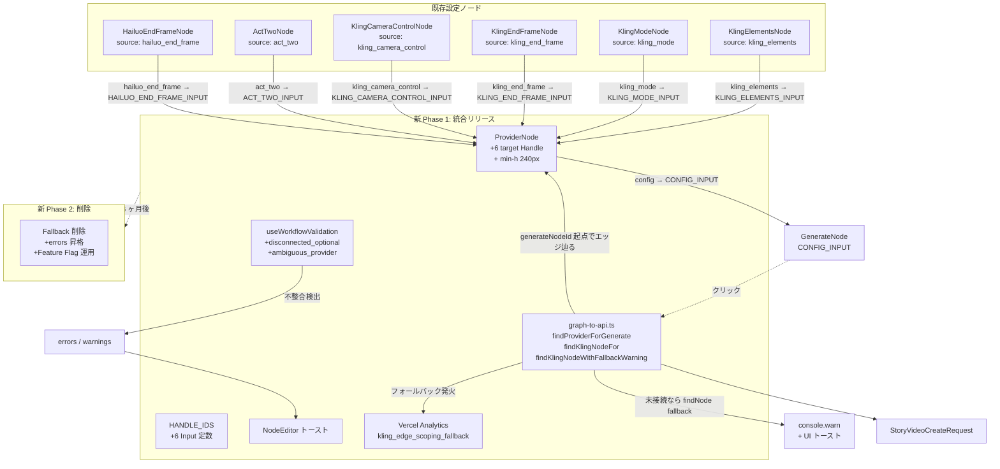
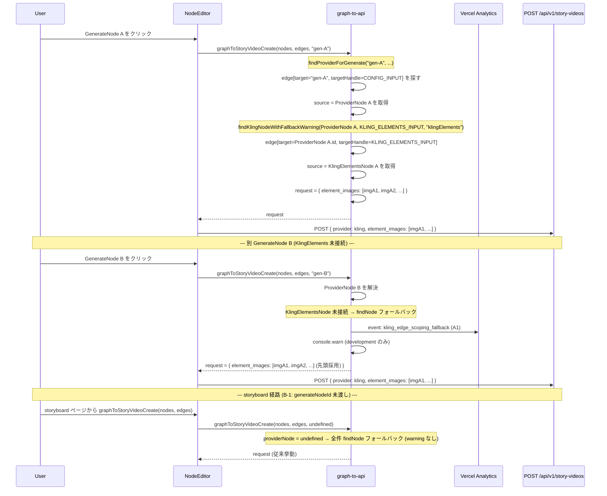

# Design Doc: Kling / プロバイダー専用設定ノードのエッジ接続スコープ化

- **作成日**: 2026-05-15
- **最終更新**: 2026-05-15 (レビュー指摘事項反映)
- **ステータス**: Draft (レビュー指摘反映済)
- **対象バージョン**: movie-maker (Next.js 16 / React 19, @xyflow/react)
- **関連 Design Doc**:
  - [`2026-05-15_kling-elements-3.0-omni.md`](./2026-05-15_kling-elements-3.0-omni.md) — KlingElementsNode の 4 枚対応とプロバイダー警告の `useNodes` 全走査ロジック (B2 解決)
  - [`2026-05-14_dialogue-node.md`](./2026-05-14_dialogue-node.md) — Pipeline 型ノード設計
- **複雑度評価**: `complexity_level: medium`
  - **complexity_rationale**:
    1. 要件/AC: 「グラフ全体に 1 個前提」を「エッジ接続でスコープ化」に変える設計変更。Handle 設計、HANDLE_IDS 拡張、`graph-to-api.ts` のエッジトレース化、バリデーション、UI/UX の整合性まで横断する。
    2. 制約/リスク: 既存ユーザーの「エッジ未接続のグラフ」をどう扱うかで UX が大きく変わる (リグレッションリスク)。複数 ProviderNode 許容など xyflow / GenerateNode 周りの仮定変更が連鎖する。Phase 1+2 を **1 リリースで統合する**方針に変更したため、検証範囲が広い。

---

## 1. 背景・課題

### 1-1. 現状

`movie-maker` の Node Editor は `@xyflow/react` ベースで構築されており、グラフ → API リクエスト変換は `components/node-editor/utils/graph-to-api.ts` で行われている。

現状、Kling/Hailuo/Runway 専用の設定ノードは**「グラフ全体に 1 個置けば自動反映」**される設計になっており、以下のように実装されている (`graph-to-api.ts:40-65`):

```ts
// ヘルパー関数: 特定タイプのノードを検索 (graph-to-api.ts:40-45)
const findNode = <T extends WorkflowNodeData>(
  type: T['type']
): T | undefined => {
  const node = nodes.find((n) => (n.data as WorkflowNodeData).type === type);
  return node?.data as T | undefined;
};

// Kling 専用ノード (L55-58)
const klingMode = findNode<KlingModeNodeData>('klingMode');
const klingElements = findNode<KlingElementsNodeData>('klingElements');
const klingEndFrame = findNode<KlingEndFrameNodeData>('klingEndFrame');
const klingCameraControl = findNode<KlingCameraControlNodeData>('klingCameraControl');

// Act-Two (L61)
const actTwo = findNode<ActTwoNodeData>('actTwo');

// Hailuo 専用 (L64)
const hailuoEndFrame = findNode<HailuoEndFrameNodeData>('hailuoEndFrame');
```

### 1-2. 問題シナリオ

ユーザーが**1 つのワークフロー (グラフ) に複数の動画生成**を組みたい場合 (例: Kling Provider 3 個 + 異なる要素画像 3 セットで 3 動画を別々に生成):

1. `nodes.find()` は配列の先頭に見つかった 1 個だけを返すので、3 つの ProviderNode を置いても**最初の 1 個だけ採用**される。
2. KlingElementsNode を 3 個置いても**最初の 1 個だけ採用、残り 2 個は静かに無視**される。
3. バリデーションも警告なし → ユーザーは「3 動画を別画像セットで生成したい」と意図していても、**結果は 3 動画とも同じ画像セット**が使われる。

### 1-3. 現在の Handle 構造

実装ファイルを直接確認した結果 (本 doc 作成時):

| ノード | source Handle | target Handle | 備考 |
|-------|---------------|---------------|------|
| `ProviderNode` (`ProviderNode.tsx:156-161`) | `config` (1 個) | **なし** | Kling 設定ノードのぶら下げ先がない |
| `KlingModeNode` (`KlingModeNode.tsx:67-72`) | `kling_mode` (1 個) | なし | 孤児ソース |
| `KlingElementsNode` (`KlingElementsNode.tsx:173-178`) | `kling_elements` (1 個) | なし | 孤児ソース |
| `KlingEndFrameNode` (`KlingEndFrameNode.tsx:128-133`) | `kling_end_frame` (1 個) | なし | 孤児ソース |
| `KlingCameraControlNode` (`KlingCameraControlNode.tsx:146-152`) | `kling_camera_control` (1 個) | `HANDLE_IDS.PROVIDER_INPUT` として登録済 (現状はどのエッジからも繋がれていない) | target は汎用名 (未配線) [N-1] |
| `ActTwoNode` (`ActTwoNode.tsx:178-183`) | `act_two` (1 個) | `subject_type` (L86-92) | target は PromptNode 経由 (実際にイベント駆動、エッジは未配線) |
| `HailuoEndFrameNode` (`HailuoEndFrameNode.tsx:128-133`) | `hailuo_end_frame` (1 個) | なし | 孤児ソース |
| `GenerateNode` (`GenerateNode.tsx:84-117`) | `video_url` (出力) | 5 個: `IMAGE_INPUT`, `SOURCE_VIDEO_INPUT`, `STORY_TEXT_INPUT`, `CONFIG_INPUT`, `CAMERA_WORK_INPUT` | ProviderNode → CONFIG_INPUT に繋ぐ前提 |

つまり、Kling 系設定ノードの出力 Handle (`kling_elements` 等) は**現状どこにも繋がっていない孤児ハンドル**であり、視覚的にユーザーが線を引いても `findNode` は無視する仕様。

### 1-4. なぜ「エッジでスコープ化」が必要か

- **複数生成ワークフローを 1 グラフで構築可能**にする。現状 1 個前提のため、ユーザーは別ワークフローを保存して切り替える運用を強いられる。
- **暗黙的なグローバル状態の解消**: 「グラフのどこに置いても効く」は xyflow のノードベース UI と矛盾し、ユーザーの mental model を裏切る。エッジでスコープ化することで「線で繋いだものだけが効く」という直感に合わせる。
- **将来の Pipeline 拡張への布石**: GenerateNode A の出力を別の経路に流す場合 (B1 解決パターン参照)、ProviderNode と設定ノードが対応していないと連鎖変換が破綻する。

---

## 2. 目標 (Goals / Non-Goals)

### 2-1. Goals

1. ProviderNode に **6 種の入力 Handle** を追加し、Kling/Runway/Hailuo の各設定ノード (`KlingModeNode`, `KlingElementsNode`, `KlingEndFrameNode`, `KlingCameraControlNode`, `ActTwoNode`, `HailuoEndFrameNode`) をエッジで結びつけ可能にする。
2. `graph-to-api.ts` を**エッジトレース方式**に変更し、GenerateNode 起点で接続された ProviderNode、その ProviderNode に接続された設定ノードを正しく特定する。
3. **後方互換性**: 既存ユーザーが置いた「エッジ未接続のグラフ」を可能な限り壊さない (採用案で詳述)。
4. 複数 ProviderNode + 複数設定ノードのグラフを許容し、GenerateNode ごとに独立した設定を反映できるようにする。
5. プロバイダー切替時に **互換性のない設定 Handle を視覚的にフィードバック**する (グレーアウト / 警告)。
6. **Handle 追加と graph-to-api のエッジトレース化を 1 リリースで同時に出す** (旧 Phase 1+2 統合 = 新 Phase 1)。「線が引けるけど効かない」状態を作らない。

### 2-2. Non-Goals (今回スコープ外)

- バックエンドの API スキーマ変更 (送信内容は現行と同じ、graph → request body の解決ロジックのみ変更)
- 設定ノード自体の UI 改修 (出力 Handle の位置調整は最小限のみ)
- DialogueNode / Utility Nodes など他系列のエッジ仕様変更
- multi-Generate 同時実行 (順次/並列実行の制御は別 Design Doc。本 doc はあくまで「1 つの GenerateNode をクリックした時、その GenerateNode に紐づく設定を正しく解決する」)
- ワークフロー保存形式 (Workflow JSON) の互換性壊し (Edge は xyflow 標準 schema のため互換)
- **【B-1: 確定済】 `generateNodeId` が `undefined` の場合 (storyboard / library 起動経路) は本 Phase で対象外**。`findNode()` フォールバック挙動を維持する。storyboard / library 側からの呼び出し改修は別 Design Doc で対応する。
  - 現状の storyboard ページ (`app/generate/storyboard/page.tsx`) や library ページからの `graphToStoryVideoCreate()` 呼び出しは `generateNodeId` 引数を渡していない。本 Phase で改修せず、従来挙動を維持する。

---

## 3. 既存コードベース分析 (実装パス確認)

実装時に参照すべき既存ファイルを実際に Read して確認した結果 (推測なし、全件本 doc 作成時に検証済):

| カテゴリ | パス | 行 | 役割 |
|--|--|--|--|
| 中核ロジック | `movie-maker/components/node-editor/utils/graph-to-api.ts` | L40-45 / L48-64 / L227-271 | `findNode<T>()` ヘルパー、Kling 系の findNode 呼び出し、3.0 Omni / ActTwo / Hailuo の設定組み立て |
| プロバイダー Node | `movie-maker/components/node-editor/nodes/ProviderNode.tsx` | L156-161 | source `config` のみ。target Handle なし |
| Kling 系 Node | `movie-maker/components/node-editor/nodes/KlingModeNode.tsx` | L67-72 | source `kling_mode` のみ |
| | `movie-maker/components/node-editor/nodes/KlingElementsNode.tsx` | L173-178 | source `kling_elements` のみ。`useNodes` 経由のプロバイダー判定 (B2 解決済) |
| | `movie-maker/components/node-editor/nodes/KlingEndFrameNode.tsx` | L128-133 | source `kling_end_frame` のみ |
| | `movie-maker/components/node-editor/nodes/KlingCameraControlNode.tsx` | L73-78 / L146-152 | source `kling_camera_control` + target (登録済だが未配線) |
| Runway 系 Node | `movie-maker/components/node-editor/nodes/ActTwoNode.tsx` | L86-92 / L178-183 | source `act_two` + target `subject_type` (CustomEvent 経由) |
| Hailuo 系 Node | `movie-maker/components/node-editor/nodes/HailuoEndFrameNode.tsx` | L128-133 | source `hailuo_end_frame` のみ |
| Generate Node | `movie-maker/components/node-editor/nodes/GenerateNode.tsx` | L84-117 | 5 つの target Handle、ID 定数を使用済 |
| 型定義 | `movie-maker/lib/types/node-editor.ts` | L528-576 | `HANDLE_IDS` 定数 (既存 ID 列挙) |
| バリデーション | `movie-maker/components/node-editor/hooks/useWorkflowValidation.ts` | L122-158 | プロバイダー固有ノードの provider 整合性チェック |
| 既存エッジヘルパー | `movie-maker/components/node-editor/utils/graph-to-api.ts` | L437-450 | `getConnectedNodeData<T>()` 既存実装 (再利用可) |
| storyboard / library 経路 (今回対象外) | `movie-maker/app/generate/storyboard/page.tsx`, `movie-maker/app/library/**` | - | `graphToStoryVideoCreate()` 呼び出し時に `generateNodeId` 未渡し |

### 3-1. 類似機能 (Pattern 5 防止: frontend-ai-guide skill)

検索キーワード: `findConnectedNode`, `getConnectedNodeData`, `edges.find`, `targetHandle === HANDLE_IDS.`

- **発見済の類似実装**: `getConnectedNodeData<T>(targetNodeId, targetHandleId, nodes, edges)` が `graph-to-api.ts:437-450` に既に存在
  - 1 hop でエッジを辿るシンプルな実装
  - **判断**: そのまま再利用する (新規実装しない)
- **発見済の V2V エッジトレース**: `graph-to-api.ts:75-105` で GenerateNode → SOURCE_VIDEO_INPUT 経由で接続元 (GenerateNode or VideoInputNode) を解決
  - **判断**: 本 doc で導入するヘルパーの参考実装として活用

技術的負債なし。新規ヘルパー (`findProviderForGenerate`, `findKlingNodeFor`, `findKlingNodeWithFallbackWarning`) を `graph-to-api.ts` に追加する。

---

## 4. 採用案 (後方互換性方針含む)

### 4-1. A 案 / B 案 / C 案のトレードオフ比較

| 観点 | A 案: フォールバック維持 | B 案: 即時エラー | **C 案: 警告 + フォールバック (移行期間)** |
|------|----------------------|---------------|--------------------------------|
| エッジ無し時の動作 | 従来 `findNode()` で先頭 1 個採用 | バリデーションエラーで実行不可 | 警告表示 + `findNode()` フォールバック |
| 既存ユーザーへの影響 | **無影響** (グラフ放置で動く) | **大: 全ユーザーが手動配線必須** | 小: 警告で気付くが動く |
| UX 後退リスク | なし | 大 (全グラフが「壊れた」表示) | なし (警告は dismissible 想定) |
| エッジ接続のインセンティブ | 低 (動くなら繋がない) | 強制 | 中 (警告で促す) |
| 複数生成の意図表現 | 後発で混乱可 (どれが効くか不明瞭) | 明瞭 | 明瞭 (警告で誘導) |
| 実装複雑度 | 中 (両経路保持) | 低 (新経路のみ) | 高 (両経路 + 警告 UI) |
| 削除期限の必要性 | あり (将来 B へ移行) | なし | あり (新 Phase 2 でフォールバック削除) |
| リスク評価 | リグレッション低、混乱中 | リグレッション高、UX 後退 | リグレッション低、UX 良好 |

### 4-2. 採用案: **C 案 (警告 + フォールバック / 段階移行)**

**理由 (Pros / Cons 整理)**:

- **Pros**:
  1. 既存ユーザーのグラフが壊れない (Fail-Fast よりも実利を優先)。
  2. 警告でエッジ接続の意図を促すため、ユーザーは「線を引くと意味が変わる」ことを学習可能。
  3. 新 Phase 2 でフォールバックを削除すれば、最終的に B 案と同じ「明示的接続のみ」状態に到達できる。
- **Cons**:
  1. 一時的に両経路 (findNode フォールバック + エッジトレース) を保持するため、コードが複雑化する。→ 新 Phase 2 で削除予定。
  2. 「警告を無視するユーザー」が残る可能性。→ 新 Phase 1 で warnings UI + telemetry、新 Phase 2 で破壊的変更告知。

**段階リリースとの組み合わせ (B-3 反映: Phase 1+2 統合)**:
- **新 Phase 1 (統合リリース)**: Handle 追加 + graph-to-api エッジトレース化 + フォールバック + warnings UI + telemetry (1-2 日)
- **新 Phase 2 (破壊的変更)**: フォールバック削除 + バリデーション強化 + Feature Flag 運用 (3-6 ヶ月後 / 2-3 日)

**重要な後方互換の保証**:
- ワークフローを保存している既存ユーザー (Supabase `workflows` テーブルに JSON 保存) は 新 Phase 1 期間中、何もしなくても動き続ける。
- 新 Phase 2 で破壊的変更を行う際は、別途リリースノート + 自動マイグレーションスクリプト (Edge を自動配線) を検討 (Follow-up)。

---

## 5. 設計詳細

### 5-1. ProviderNode の target Handle 設計

ProviderNode の左側に **6 種の target Handle** を追加する。配置は `style={{ top: '%' }}` で縦に均等配置。

```
┌──────────────────────────┐
│  Provider (Kling)        │
│                          │
│ ◀ kling_mode_input  10%  │
│ ◀ kling_elements_input 25%
│ ◀ kling_end_frame_input 40%
│ ◀ kling_camera_input 55% │
│ ◀ act_two_input  70%     │
│ ◀ hailuo_end_frame_input 85% │
│                          │
│  config (右) ▶           │
└──────────────────────────┘
```

**Handle ID 一覧**:

| Handle ID | 受け入れる source 型 | プロバイダー制約 | 縦位置 |
|--|--|--|--|
| `KLING_MODE_INPUT` | KlingModeNode (`kling_mode`) | `piapi_kling` 専用 | 10% |
| `KLING_ELEMENTS_INPUT` | KlingElementsNode (`kling_elements`) | `piapi_kling` 専用 | 25% |
| `KLING_END_FRAME_INPUT` | KlingEndFrameNode (`kling_end_frame`) | `piapi_kling` 専用 | 40% |
| `KLING_CAMERA_CONTROL_INPUT` | KlingCameraControlNode (`kling_camera_control`) | `piapi_kling` 専用 | 55% |
| `ACT_TWO_INPUT` | ActTwoNode (`act_two`) | `runway` 専用 | 70% |
| `HAILUO_END_FRAME_INPUT` | HailuoEndFrameNode (`hailuo_end_frame`) | `hailuo` 専用 | 85% |

**UI 視覚化方針 (UX 検討事項への回答)**:

- **常時 6 Handle 表示**: プロバイダー切替時に Handle が消えると、配線済みエッジが孤立して xyflow が「Handle がない」エラーを投げる懸念。新 Phase 1 では 6 Handle を常に表示する (動的化は §11-3 で別途検討)。
- **互換性のない Handle は視覚的にグレーアウト** (`opacity-30`) + tooltip で「このプロバイダーでは使用されません」と表示。
- 接続先がない場合は edge を visually `stroke-dasharray: 4` で破線描画 (xyflow の `markerEnd` カスタムは Follow-up で対応、新 Phase 1 では `pathOptions` のみ)。

**[N-2 反映] ノードレイアウト要件**:
- **ProviderNode 最小高さ 240px を確保**。Handle 6 個を 10% / 25% / 40% / 55% / 70% / 85% に配置 (約 36px 間隔)。
- ノード本体の選択 UI (ドロップダウン、テキスト入力等) と Handle が干渉しないか、実装時に Storybook / Vitest スナップショット で目視確認する。
- 実装時に開発者ツール画面で Handle のクリック判定領域 (default `12x12px`) が他要素と重なっていないことを確認する。

**ヒント表示 (Phase 番号への言及を排除)**:
- ProviderNode に小さな凡例セクションを追加し、「**左ハンドルに繋いだ設定のみが反映されます。未接続の設定ノードは互換性のためグラフ全体から自動採用されますが、将来このフォールバックは削除予定です**」と書く (リリース時の混乱緩和)。

### 5-2. `HANDLE_IDS` 拡張

`lib/types/node-editor.ts:528-576` の `HANDLE_IDS` 定数に下記 6 行を追加 (`as const` の中):

```typescript
export const HANDLE_IDS = {
  // ... 既存 ...
  // ProviderNode (出力)
  CONFIG_OUTPUT: 'config',
  // ProviderNode 入力 (NEW: Kling/Runway/Hailuo 設定エッジスコープ)
  KLING_MODE_INPUT: 'kling_mode_input',
  KLING_ELEMENTS_INPUT: 'kling_elements_input',
  KLING_END_FRAME_INPUT: 'kling_end_frame_input',
  KLING_CAMERA_CONTROL_INPUT: 'kling_camera_control_input',
  ACT_TWO_INPUT: 'act_two_input',
  HAILUO_END_FRAME_INPUT: 'hailuo_end_frame_input',
  // 既存 KLING_MODE_OUTPUT 等 (出力側) はそのまま維持
} as const;
```

**命名規約**:
- 出力側: `<NODE>_OUTPUT` (既存)
- 入力側: `<NODE>_INPUT` (本 doc で新規追加)
- 値は xyflow Handle の `id` 属性に渡る (`Handle id={HANDLE_IDS.KLING_ELEMENTS_INPUT}`)
- `kling_elements_input` のようにスネークケースで、対応する設定ノードの output id (`kling_elements`) と末尾に `_input` を付ける一貫性を持つ。

**型安全性**: `as const` により `typeof HANDLE_IDS[keyof typeof HANDLE_IDS]` で literal union 型として使用可能。`xyflow` の Handle id (`string`) と整合する。

### 5-3. `graph-to-api.ts` のエッジトレースロジック

#### 5-3-1. 新規ヘルパー関数 (B-2 反映: 完全シグネチャ)

`graph-to-api.ts` の冒頭、`graphToStoryVideoCreate` の上または既存 `getConnectedNodeData` の近くに追加。

**ヘルパー 1: GenerateNode → ProviderNode 解決**

```ts
/**
 * GenerateNode の CONFIG_INPUT に接続されている ProviderNode を解決する。
 * - generateNodeId.targetHandle === CONFIG_INPUT の edge を探し、source の ProviderNode を返す。
 * - 接続がなければ undefined。
 */
function findProviderForGenerate(
  generateNodeId: string,
  nodes: WorkflowNode[],
  edges: Edge[]
): WorkflowNode | undefined {
  const edge = edges.find(
    (e) => e.target === generateNodeId && e.targetHandle === HANDLE_IDS.CONFIG_INPUT
  );
  if (!edge) return undefined;
  const sourceNode = nodes.find((n) => n.id === edge.source);
  return sourceNode?.data.type === 'provider' ? sourceNode : undefined;
}
```

**ヘルパー 2: ProviderNode → 設定ノードデータ解決 (内部基本ヘルパー、純粋関数)**

```ts
/**
 * 指定された ProviderNode の特定 target Handle に接続された設定ノードのデータを返す。
 * - 既存 getConnectedNodeData の薄いラッパー。Provider 不存在時は undefined。
 * - 警告ログは出さない (純粋関数として保つ)。
 */
function findKlingNodeFor<T extends WorkflowNodeData>(
  providerNode: WorkflowNode | undefined,
  targetHandle: string,
  expectedType: T['type'],
  nodes: WorkflowNode[],
  edges: Edge[]
): T | undefined {
  if (!providerNode) return undefined;
  const data = getConnectedNodeData<WorkflowNodeData>(
    providerNode.id,
    targetHandle,
    nodes,
    edges
  );
  if (!data) return undefined;
  return data.type === expectedType ? (data as T) : undefined;
}
```

#### 5-3-2. 警告ログ用包括的ラッパー (B-2 反映: 1 個に統合)

**6 つの Kling 系設定ノード (klingMode / klingElements / klingEndFrame / klingCameraControl / actTwo / hailuoEndFrame) の解決をすべてこのラッパー 1 個に集約する**。

```ts
/**
 * エッジトレース解決 + 失敗時 findNode フォールバック + 開発時警告ログを統合したラッパー。
 * Phase 1 (統合リリース) では Kling 系 6 ノードすべてこのラッパー経由で解決する。
 *
 * @typeParam T - WorkflowNodeData を継承する具体的なノードデータ型
 * @param providerNode - エッジトレースで解決された ProviderNode (未解決なら undefined)
 * @param targetHandle - ProviderNode 側の target Handle ID (例: HANDLE_IDS.KLING_ELEMENTS_INPUT)
 * @param expectedType - 期待するノード型のリテラル (例: 'klingElements')
 * @param nodes - グラフ全体のノード配列 (フォールバックの findNode で全走査)
 * @param edges - グラフ全体のエッジ配列 (エッジトレースで使用)
 * @returns 該当ノードのデータ、または見つからない場合 undefined
 *
 * 解決優先順位:
 *   1. providerNode が定義済 + 指定 targetHandle に接続された設定ノード (型一致)
 *   2. ↑で見つからなければ findNode<T>(expectedType) でグラフ全体から先頭 1 個 (フォールバック)
 *      - フォールバック発火時、development 環境かつ providerNode が存在する場合のみ console.warn を出す
 *      - Telemetry (Vercel Analytics) に event を送信 (A1 反映)
 */
function findKlingNodeWithFallbackWarning<T extends WorkflowNodeData>(
  providerNode: WorkflowNode | undefined,
  targetHandle: string,
  expectedType: T['type'],
  nodes: WorkflowNode[],
  edges: Edge[]
): T | undefined {
  // 優先: エッジトレース解決
  const edgeResult = findKlingNodeFor<T>(
    providerNode,
    targetHandle,
    expectedType,
    nodes,
    edges
  );
  if (edgeResult) return edgeResult;

  // フォールバック: グラフ全体から最初の 1 個 (Phase 2 で削除予定)
  const fallbackResult = findNode<T>(expectedType);

  // フォールバック発火時の開発時警告 + Telemetry (A1 反映)
  if (fallbackResult) {
    if (process.env.NODE_ENV === 'development' && providerNode) {
      // eslint-disable-next-line no-console
      console.warn(
        `[graph-to-api] '${expectedType}' を ProviderNode に未接続。` +
        `グラフ全体から最初の 1 個を採用 (将来廃止予定)。` +
        `targetHandle=${targetHandle}, providerNodeId=${providerNode.id}`
      );
    }
    // Telemetry: フォールバック発火を Vercel Analytics に送信 (Phase 2 削除タイミング判断材料)
    // event 名: `kling_edge_scoping_fallback`
    if (typeof window !== 'undefined' && window.va) {
      window.va('event', {
        name: 'kling_edge_scoping_fallback',
        data: { expectedType, targetHandle }
      });
    }
  }

  return fallbackResult;
}
```

**契約 (Data Contract)**:
- 入力: `providerNode`, `targetHandle`, `expectedType`, `nodes`, `edges`
- 出力: 指定型の `WorkflowNodeData` または `undefined`
- 副作用: フォールバック発火時のみ `console.warn` + Vercel Analytics event (純粋関数ではない、両方とも no-op で失敗しない)
- 不変条件: source ノードの `data.type !== expectedType` なら `undefined` (型不整合時の安全ガード)

#### 5-3-3. 既存 `findNode` 呼び出しの差し替え (C 案: フォールバック付き)

`graph-to-api.ts:54-64` の Kling/ActTwo/Hailuo 設定ノード解決部分を、上記 `findKlingNodeWithFallbackWarning` ラッパー経由で 6 個すべて差し替える:

```ts
// ========== 統合リリース (新 Phase 1): エッジトレース解決 + フォールバック + 警告 ==========

// generateNodeId が undefined の場合 (storyboard / library 経路) は従来通り findNode フォールバックのみ
// [B-1 反映] storyboard / library 経路は本 Phase 対象外
const providerNode = generateNodeId
  ? findProviderForGenerate(generateNodeId, nodes, edges)
  : undefined;

// Kling 系 4 つ + ActTwo + HailuoEndFrame の計 6 つ、すべて同じラッパー経由
const klingMode = findKlingNodeWithFallbackWarning<KlingModeNodeData>(
  providerNode, HANDLE_IDS.KLING_MODE_INPUT, 'klingMode', nodes, edges
);

const klingElements = findKlingNodeWithFallbackWarning<KlingElementsNodeData>(
  providerNode, HANDLE_IDS.KLING_ELEMENTS_INPUT, 'klingElements', nodes, edges
);

const klingEndFrame = findKlingNodeWithFallbackWarning<KlingEndFrameNodeData>(
  providerNode, HANDLE_IDS.KLING_END_FRAME_INPUT, 'klingEndFrame', nodes, edges
);

const klingCameraControl = findKlingNodeWithFallbackWarning<KlingCameraControlNodeData>(
  providerNode, HANDLE_IDS.KLING_CAMERA_CONTROL_INPUT, 'klingCameraControl', nodes, edges
);

const actTwo = findKlingNodeWithFallbackWarning<ActTwoNodeData>(
  providerNode, HANDLE_IDS.ACT_TWO_INPUT, 'actTwo', nodes, edges
);

const hailuoEndFrame = findKlingNodeWithFallbackWarning<HailuoEndFrameNodeData>(
  providerNode, HANDLE_IDS.HAILUO_END_FRAME_INPUT, 'hailuoEndFrame', nodes, edges
);
```

**[N-4 反映] フォールバックコメント要件**:
> graph-to-api.ts の 6 箇所のフォールバック呼び出し (`findKlingNodeWithFallbackWarning` の `?? findNode<T>(...)` 部分相当) に、以下の TODO コメントを各 1 行ずつ挿入する:
> ```ts
> // TODO(Phase 2): フォールバック削除予定 (3-6 ヶ月後、telemetry データで判断)
> ```

**Provider ノード自体の解決**: `provider = providerNode?.data ?? findNode<ProviderNodeData>('provider')` のようにエッジトレース優先 + フォールバックする。これにより複数 ProviderNode のグラフでも各 GenerateNode が独立した Provider 設定を持てる。

**[B-1 反映] storyboard / library 経路の扱い (Non-Goals)**:
- `graphToStoryVideoCreate(generateNodeId)` で `generateNodeId` が `undefined` の場合、`providerNode` は `undefined` のまま → 各 `findKlingNodeWithFallbackWarning` は `findNode<T>(...)` フォールバックを返す。
- storyboard / library 経路では従来通り「グラフ全体に 1 個前提」で動作。本 Phase で改修しない。
- storyboard / library 側を改修する場合は別 Design Doc を作成する。

### 5-4. 各 Kling 系ノードの source Handle 整備状況

実装ファイルを Read した結果、**全 6 ノードに source Handle は既に存在**することを確認:

| ノード | source Handle ID | 状態 | 今回の作業 |
|--|--|--|--|
| KlingModeNode | `kling_mode` | 存在 | 変更不要 (HANDLE_IDS 定数化のみ確認、既に `KLING_MODE_OUTPUT` あり) |
| KlingElementsNode | `kling_elements` | 存在 | 変更不要 |
| KlingEndFrameNode | `kling_end_frame` | 存在 | 変更不要 |
| KlingCameraControlNode | `kling_camera_control` | 存在 | 変更不要 (既存 target `HANDLE_IDS.PROVIDER_INPUT` の扱いは 6-2 で別途検討) |
| ActTwoNode | `act_two` | 存在 | 変更不要 (既存 target `subject_type` の扱いは 6-2 で別途検討) |
| HailuoEndFrameNode | `hailuo_end_frame` | 存在 | 変更不要 |

**結論**: 設定ノード側の出力 Handle は整備済のため、本 Design Doc で必要な変更は **ProviderNode 側の target Handle 追加のみ**。

### 5-5. バリデーション (`useWorkflowValidation.ts`)

現状 (`useWorkflowValidation.ts:122-158`):
- `klingElements` と provider が `piapi_kling` の整合性チェック (グラフ全体スキャン)
- `actTwo` の `useActTwo` と provider が `runway` の整合性チェック

**新 Phase 1 で追加するチェック**:

1. **接続先プロバイダーと設定ノードの不整合検出**:
   ```
   ActTwoNode が piapi_kling の ProviderNode に接続 → error
   KlingElementsNode が runway の ProviderNode に接続 → error
   ```
2. **複数 ProviderNode の許容**: 現状 `findNode('provider')` で先頭 1 個前提 → エッジトレース化により**複数許容**を明示。バリデーションは「各 GenerateNode に接続された ProviderNode の存在」をチェックする方向に変更。
3. **未接続の Kling 設定ノードを warning として返す**:
   ```ts
   warnings.push({
     type: 'disconnected_optional',
     nodeId: klingElementsNode.id,
     message: 'KlingElementsNode が ProviderNode に未接続。グラフ全体から自動採用されています (将来この自動採用は削除予定)',
   });
   ```
   - `errors` には入れず `warnings: ValidationError[]` を新規追加
   - `ValidationError.type` に `'disconnected_optional'` を追加
4. **[B-4 反映] `ambiguous_provider` warning の追加**:
   ```
   複数 ProviderNode が存在し、かつ CONFIG_INPUT 未接続の GenerateNode が存在する場合
   → warnings に ambiguous_provider を追加する
   ```
   ```ts
   warnings.push({
     type: 'ambiguous_provider',
     nodeId: generateNode.id,
     message: 'グラフに複数の ProviderNode が存在し、この GenerateNode は ProviderNode に未接続です。findNode フォールバックで先頭の ProviderNode が採用されますが、意図と異なる可能性があります。',
   });
   ```
   - 新 Phase 1 で warning として通知、新 Phase 2 で error 化を検討。

**バリデーションマトリクス**:

| 検出条件 | エラータイプ | レベル (新 Phase 1) | レベル (新 Phase 2) |
|--|--|--|--|
| ActTwoNode が piapi_kling Provider に接続 | `provider_mismatch` | error | error |
| KlingElementsNode が runway Provider に接続 | `provider_mismatch` | error | error |
| 設定ノードがどの Provider にも未接続 | `disconnected_optional` | warning | error (削除予定) |
| 複数 Provider + CONFIG_INPUT 未接続の GenerateNode | `ambiguous_provider` (B-4) | warning | error 化検討 |
| CONFIG_INPUT に複数 Provider 接続 | `multiple_provider_connection` | error | error |

**新 Phase 2 で行う破壊的変更**:
- 上記 `disconnected_optional` warning を `errors` に昇格、未接続時は実行不可。
- `ambiguous_provider` も同様に error 化を検討。
- フォールバックロジック削除。

### 5-6. xyflow Connection Validation (互換性ガード)

xyflow の `isValidConnection` prop を `NodeEditor` の `<ReactFlow>` に追加し、**互換性のない接続を edge ドラッグ時点でブロック**する:

```ts
// 擬似コード in NodeEditor.tsx
const isValidConnection = useCallback((connection: Connection): boolean => {
  // ProviderNode の各 target Handle と source ノードの type を検証
  const HANDLE_TO_NODE_TYPE: Record<string, NodeType> = {
    [HANDLE_IDS.KLING_MODE_INPUT]: 'klingMode',
    [HANDLE_IDS.KLING_ELEMENTS_INPUT]: 'klingElements',
    [HANDLE_IDS.KLING_END_FRAME_INPUT]: 'klingEndFrame',
    [HANDLE_IDS.KLING_CAMERA_CONTROL_INPUT]: 'klingCameraControl',
    [HANDLE_IDS.ACT_TWO_INPUT]: 'actTwo',
    [HANDLE_IDS.HAILUO_END_FRAME_INPUT]: 'hailuoEndFrame',
  };

  const expectedType = HANDLE_TO_NODE_TYPE[connection.targetHandle ?? ''];
  if (!expectedType) return true; // 既存 Handle (CONFIG_INPUT 等) はガード対象外

  const sourceNode = nodes.find((n) => n.id === connection.source);
  if (!sourceNode) return false;
  return sourceNode.data.type === expectedType;
}, [nodes]);
```

これにより、ユーザーが ActTwoNode の source を `KLING_ELEMENTS_INPUT` に繋ぐような誤接続を**ドラッグ時点で防げる** (新 Phase 1 で導入)。

---

## 6. 既知のリスク・エッジケース

### 6-1. xyflow の Handle id 衝突

- ProviderNode に **target `config` を追加してはいけない** (既存 source `config` と id 衝突)。
- Handle id はノードスコープでユニーク。target/source の type だけ違って同名にすると xyflow が edge を内部 dedup する報告がある。
- → 新規 ID はすべて `_input` サフィックス付きとし、既存出力側 `kling_mode` 等とは完全別名にする。

### 6-2. KlingCameraControlNode の既存 target ハンドルの扱い

KlingCameraControlNode.tsx:73-78 に既に `HANDLE_IDS.PROVIDER_INPUT` の target Handle が登録済 (現状はどのエッジからも繋がれていない)。

**判断**:
- 本 Design Doc では**この既存 target を残す** (削除すると保存済グラフのエッジが孤立)。
- 新規ロジック (ProviderNode → KlingCameraControlNode への向きではなく、その逆: KlingCameraControlNode → ProviderNode の `KLING_CAMERA_CONTROL_INPUT`) は別エッジとして扱う。
- 結果として KlingCameraControlNode は 1 つの target (未配線) と 1 つの source (`kling_camera_control`) を持つ「両側 Handle」ノードになるが、UX 上はソース側だけ繋げばよい。
- 新 Phase 2 でフォールバック削除時に、未使用 target も同時に削除する候補とする (別 Design Doc)。

### 6-3. ActTwoNode の `subject_type` target の扱い

ActTwoNode.tsx:86-92 に target `subject_type` がある (PromptNode の subjectType を受信)。実装は CustomEvent 経由 (`window.dispatchEvent`) で動いており、エッジ配線していなくても機能する。

**判断**:
- これも既存ロジックを尊重し**残す**。
- 新規 `ACT_TWO_INPUT` は ProviderNode 側の target なので衝突しない。

### 6-4. ProviderNode が複数あるグラフでの GenerateNode の Provider 解決

「GenerateNode A から CONFIG_INPUT エッジで Provider X、Provider Y が両方繋がっている」状況は xyflow 仕様上、target Handle あたり 1 edge までというルールがないため**理論上は可能**。

**対応**:
- xyflow の `<Handle isConnectable>` に `(connections) => connections.length === 0` を渡し、**1 つの target Handle に 1 edge までに制限**する (xyflow `useNodeConnections` API)。
- バリデーションでも「CONFIG_INPUT に複数の Provider 接続」を error として検出。

**[B-4 反映] 複数 ProviderNode + 未接続 GenerateNode の取り扱い**:
- グラフに 2 個以上の ProviderNode が存在し、かつ CONFIG_INPUT 未接続の GenerateNode が存在する場合、`findNode('provider')` フォールバックは「先頭の 1 個」を返すため、意図と異なる Provider が採用される可能性が高い。
- このシナリオでは §5-5 のバリデーションマトリクスに従い `ambiguous_provider` warning を出す。新 Phase 2 で error 化を検討。

### 6-5. ワークフロー保存形式の互換性

xyflow の Edge 形式 (`{id, source, target, sourceHandle, targetHandle}`) は変更なし。本 Design Doc で増えるのは ProviderNode の Handle 数のみ。

**既存 Workflow JSON** が `localStorage` / Supabase `workflows` テーブルに保存されている場合:
- ノード type は変わらない → デシリアライズ問題なし
- Edge も既存のものは変わらない → そのまま読み込まれる
- 新規 Handle ID は「未接続 = エッジが無い」状態でデシリアライズされ、フォールバック (新 Phase 1 リリース後) が発動 → 動作継続

**新 Phase 2 でフォールバック削除時**: 既存ワークフローを自動配線するマイグレーションスクリプトを別 Follow-up とする (5-2 採用案の Cons 参照)。

### 6-6. テスト時の `nodes` ID 衝突 ([N-5 反映])

`KlingElementsNode.test.tsx` 等で複数 KlingElementsNode をテストする場合、xyflow の `useNodes()` は ReactFlowProvider のスコープ内で動くため、テストハーネスで複数ノードを並べる際の ID 一意性に注意。

**具体的対策**:
- **複数 KlingElementsNode をテストする場合、`crypto.randomUUID()` または `nanoid` でノード ID を生成する。`node-1`, `node-2` のハードコード ID は避ける**。
- 例: ```ts
  const nodes = Array.from({ length: 3 }, () => createKlingElementsNode({
    id: crypto.randomUUID(),
    // ...
  }));
  ```
- これにより、同一 ID による xyflow の内部状態破壊や、テスト並列実行時の state pollution を防ぐ。

### 6-7. Performance リスク

`graph-to-api.ts` は GenerateNode クリック時 (生成開始時) にのみ実行されるため、エッジトレースが O(N*M) でも実用上問題ない (N=ノード数 ≤ ~50, M=エッジ数 ≤ ~100)。

`useWorkflowValidation` は `useMemo` で nodes/edges 変更時のみ再計算。追加チェック分の負荷も無視できる範囲。

### 6-8. 部分的に繋いだ場合の挙動 (E.g. ProviderNode は接続済、KlingElements は未接続)

C 案では、ProviderNode が接続されていても KlingElementsNode が未接続なら `findNode('klingElements')` フォールバックが発動する。

**期待動作**:
- 例外なく fallback が走り、グラフ全体の先頭 KlingElementsNode を使用。
- 警告ログ (`console.warn`) と UI 警告で「未接続のため自動採用」を通知。
- 新 Phase 2 で破壊的変更時、未接続なら error。

### 6-9. KlingElementsNode の `useNodes` 既存実装との整合性

`KlingElementsNode.tsx:96-106` の B2 解決済ロジック (`useNodes` でグラフ全体から ProviderNode を探す) はそのまま維持。本 Design Doc のエッジトレース化は `graph-to-api.ts` のみが対象で、ノード内部の警告表示ロジックは別軸 (どの ProviderNode に繋がっているか、ではなく、グラフに piapi_kling が 1 つでもあるか)。

将来的にはこの警告も「自分の親 ProviderNode が piapi_kling か」に変えるのが理想 (Follow-up で検討)。

---

## 7. テスト戦略

### 7-1. Unit Tests

#### `graph-to-api.test.ts` (既存 38+ ケース + 新規)

| カテゴリ | ケース | 期待 |
|--|--|--|
| **エッジ接続あり** | ProviderNode → CONFIG_INPUT に接続、KlingElementsNode → KLING_ELEMENTS_INPUT に接続 | request.element_images が KlingElementsNode のデータで構築 |
| | 複数 ProviderNode (Kling/Runway/Hailuo)、各 GenerateNode が異なる Provider | generateNodeId ごとに正しい Provider 設定で組み立て |
| | KlingElementsNode A が Provider A に、KlingElementsNode B が Provider B に接続 | 各 generateNodeId で対応する element_images が分離 |
| | KlingCameraControlNode が Kling Provider に接続 | request.kling_camera_control が設定される |
| | ActTwoNode が Runway Provider に接続 | request.use_act_two = true |
| | HailuoEndFrameNode が Hailuo Provider に接続 | request.end_frame_image_url が設定される |
| **エッジ接続なし (フォールバック)** | KlingElementsNode を置くがエッジ未接続 | findNode フォールバック発動、warning ログ + Telemetry event |
| | ProviderNode 未接続、KlingElementsNode 単独 | provider = `findNode('provider')` フォールバック |
| | `generateNodeId === undefined` (storyboard / library 経路) | 全件 `findNode` フォールバック、warning は出さない (B-1) |
| **不整合接続** | ActTwoNode を Kling Provider の ACT_TWO_INPUT に接続 (xyflow ガード抜け) | findKlingNodeFor が undefined → request に use_act_two が入らない |
| **既存テスト維持** | 単一 Generate + 単一 Provider + 単一 KlingElements (エッジ未接続) | 従来通り動作 |

**[N-5 反映] テスト ID 衝突対策**:
- 複数 KlingElementsNode を含むテストケースでは `crypto.randomUUID()` または `nanoid` でノード ID を生成する。`node-1`, `node-2` のハードコード ID は避ける。

#### `useWorkflowValidation.test.ts`

| ケース | 期待 |
|--|--|
| ActTwoNode が piapi_kling Provider に接続 | errors に provider_mismatch |
| KlingElementsNode が runway Provider に接続 | errors に provider_mismatch |
| 設定ノードがどの Provider にも未接続 | warnings に disconnected_optional |
| 複数 Provider + CONFIG_INPUT 未接続の GenerateNode (B-4) | warnings に ambiguous_provider |
| 複数 Generate + 複数 Provider + 全エッジ正常 | errors 空、warnings 空 |
| CONFIG_INPUT に複数 Provider 接続 | errors に multiple_provider_connection |

#### `ProviderNode.test.tsx`

| ケース | 期待 |
|--|--|
| 6 個の target Handle が全てレンダリングされる | `screen.getAllByRole('button')` で xyflow ハンドル要素を検証 |
| プロバイダー切替時に互換性のない Handle が `opacity-30` クラスを持つ | provider='runway' で `KLING_*` Handle が opacity-30 |
| `isValidConnection` で互換接続のみ許可 | NodeEditor 統合テストで検証 |
| ノード最小高さ 240px、Handle 配置位置 (10/25/40/55/70/85%) (N-2) | スナップショット or computed style 検証 |

### 7-2. Integration Test (NodeEditor 統合)

`NodeEditor.test.tsx` で以下を検証:
- ProviderNode の `KLING_ELEMENTS_INPUT` に KlingElementsNode のソースをドラッグ → 成功
- ActTwoNode のソースを `KLING_ELEMENTS_INPUT` にドラッグ → `isValidConnection` で拒否

### 7-3. E2E Test (Playwright) ([N-3 反映])

`tests/e2e/node-editor-kling-edge-scope.spec.ts` (新規):

| シナリオ | 検証 |
|--|--|
| Kling Provider × 2 + KlingElements × 2 + Generate × 2 (MSW モック) | 2 動画それぞれ異なる要素画像セットでリクエストが組み立てられる |
| 警告 UI 表示 | 未接続の KlingElementsNode に「⚠ ProviderNode に未接続」表示 |

**[N-3 反映] MSW モック方針整合**:
- **E2E は MSW モック優先**。実 PiAPI 呼び出しは §11-6 のユーザー確認後、ステージング環境で 1-2 回のみ実施する (リグレッション確認目的)。
- CI 環境 (Playwright auto-start dev:test) では MSW で動画生成エンドポイント (`POST /api/v1/story-videos`) をモック化し、課金を発生させない。
- 詳細は §11-6 を参照。

### 7-4. テストカバレッジ目標

- `graph-to-api.ts`: 95% line coverage
- `useWorkflowValidation.ts`: 90% line coverage
- ProviderNode: 80% line coverage (UI 系は targetable な要素に絞る)

---

## 8. 段階的実装 (Phase 分割) [B-3 反映: Phase 1+2 統合]

### 新 Phase 1: 統合リリース (Handle 追加 + エッジトレース化 + フォールバック + Warnings + Telemetry) [約 1-2 日]

**目標**: 「線を引けば効く」状態を 1 リリースで実現。Handle 追加・graph-to-api エッジトレース化・フォールバック・警告 UI・Telemetry を同時に出す。「線を引けるが効かない」中間状態は作らない。

**完了条件 (L1/L2/L3)**:
- **L3**: `npm run build` 成功、`npm run lint` pass、type-check pass
- **L2**: `ProviderNode.test.tsx` Handle 数検証 / `graph-to-api.test.ts` 新規ケース全件 pass / 既存 38+ ケース regression なし / `useWorkflowValidation.test.ts` 新規ケース pass
- **L1**: NodeEditor で線を引ける + 2 個の Generate + 2 個の Provider + 2 個の KlingElements を配置し、両方を順次生成して別動画リクエストが組み立てられることを目視 (MSW モック 1 回 + 必要なら PiAPI ステージング 1 回)

**対象ファイル**:
- `movie-maker/components/node-editor/nodes/ProviderNode.tsx` (Handle 追加、grayout 対応、最小高さ 240px)
- `movie-maker/lib/types/node-editor.ts` (HANDLE_IDS に 6 行追加)
- `movie-maker/components/node-editor/NodeEditor.tsx` (`isValidConnection` 追加、warnings トースト表示)
- `movie-maker/components/node-editor/utils/graph-to-api.ts` (helper 3 種追加、findNode → findKlingNodeWithFallbackWarning 差し替え、6 箇所に `TODO(Phase 2)` コメント [N-4])
- `movie-maker/components/node-editor/hooks/useWorkflowValidation.ts` (warnings + ambiguous_provider [B-4] + disconnected_optional + provider_mismatch 拡張)
- `movie-maker/components/node-editor/nodes/ProviderNode.test.tsx` (新規)
- `movie-maker/components/node-editor/utils/graph-to-api.test.ts` (新規ケース追加)
- `movie-maker/components/node-editor/hooks/useWorkflowValidation.test.ts` (新規ケース追加)

**新 Phase 1 のタスク詳細** (見積もり内訳):

| タスク | 工数 |
|--|--|
| Handle 追加 (ProviderNode + HANDLE_IDS + isValidConnection) | 0.5 d |
| graph-to-api.ts 改修 (helper 3 種 + 6 箇所差し替え + TODO コメント挿入) | 0.5 d |
| バリデーション拡張 (warnings + ambiguous_provider + disconnected_optional) | 0.3 d |
| **Telemetry 実装** (Vercel Analytics に `kling_edge_scoping_fallback` event 送信) [A1] | 0.1 d |
| テスト (ProviderNode.test.tsx + graph-to-api.test.ts + useWorkflowValidation.test.ts + MSW モック E2E) | 0.5 d |
| **合計** | **1.4-2.0 d** |

**Telemetry 追加項目 [A1 反映]**:
> フォールバック発火回数を Vercel Analytics に送信し、新 Phase 2 のタイミング判断データとする。
> - event 名: `kling_edge_scoping_fallback`
> - data: `{ expectedType, targetHandle }`
> - 実装場所: §5-3-2 の `findKlingNodeWithFallbackWarning` 内
> - 目的: 新 Phase 2 (フォールバック削除) の実施タイミングを「フォールバック発火頻度の減少」で判断するため。

**リリース判定**: 既存ユーザーには警告が出るが動作は継続する (UX 後退なし)。リリース時にチェンジログで「エッジ配線推奨 + フォールバックは将来削除予定」を案内。

### 新 Phase 2: フォールバック削除 + バリデーション強化 + Feature Flag 運用 (3-6 ヶ月後 / 約 2-3 日)

**目標**: 後方互換性を切り、エッジ未接続を error にする。事前に Feature Flag で 2 週間運用して問題なければ削除。

**完了条件**:
- **L2**: フォールバック削除後の `graph-to-api.test.ts` 全件 pass (フォールバック前提のテストは error 検証に書き換え)
- **L1**: 既存ワークフローを自動配線するマイグレーションスクリプト提供 (別 Follow-up)
- **L1**: Feature Flag 2 週間運用で「問題なし」レビュー完了

**対象ファイル**:
- `graph-to-api.ts` の `findKlingNodeWithFallbackWarning` 内の findNode フォールバック削除 (純粋な `findKlingNodeFor` のみに統合)
- `useWorkflowValidation.ts` の `disconnected_optional` を `errors` に昇格
- `ambiguous_provider` の error 化検討 (B-4)
- 自動配線マイグレーション (別 Design Doc で検討)

**新 Phase 2 のタスク詳細** (見積もり内訳):

| タスク | 工数 |
|--|--|
| フォールバック削除 (findKlingNodeWithFallbackWarning の簡素化) | 0.3 d |
| マイグレーション (自動配線スクリプト + 既存 Workflow JSON 対応) | 1-1.5 d |
| リグレッションテスト (既存テスト全件 + 新規 error ケース追加) | 1 d |
| **合計** | **2.3-2.8 d** |

**[A4 反映] Feature Flag 運用**:
> 新 Phase 2 削除前に Feature Flag (`process.env.NEXT_PUBLIC_DISABLE_KLING_FALLBACK`) を 2 週間運用し、問題なければ削除する。
> - `true` の場合、フォールバックを無効化 (新 Phase 2 と同等動作)
> - `false` (デフォルト) の場合、フォールバック有効 (新 Phase 1 と同等動作)
> - リリース手順:
>   1. Vercel 環境変数で staging 環境のみ `NEXT_PUBLIC_DISABLE_KLING_FALLBACK=true` を 2 週間設定
>   2. Telemetry (`kling_edge_scoping_fallback`) の発火回数 + ユーザーからの問題報告ゼロを確認
>   3. production も `true` に切替 (動作確認 1 週間)
>   4. 問題なければコードから Feature Flag 分岐を削除 + フォールバックコード削除

**リリース判定**: 破壊的変更。リリースノート + 自動マイグレーション必須 + Feature Flag 運用必須。

---

## 9. Acceptance Criteria (AC) [Phase 対応明示]

「実装完了」の検証可能な条件 (browser 環境で目視 + 自動テスト)。各 AC がどの Phase で達成されるかを明示。

### AC-1: ProviderNode に 6 個の target Handle が表示される [新 Phase 1]

- **検証**: NodeEditor で ProviderNode をドラッグ配置、左側に `KLING_MODE_INPUT`, `KLING_ELEMENTS_INPUT`, `KLING_END_FRAME_INPUT`, `KLING_CAMERA_CONTROL_INPUT`, `ACT_TWO_INPUT`, `HAILUO_END_FRAME_INPUT` の 6 個の入力 Handle が縦に均等配置で見える。
- **自動化**: `ProviderNode.test.tsx` でハンドル要素の `data-handleid` 属性を assertion。

### AC-2: 互換性のない接続が `isValidConnection` でブロックされる [新 Phase 1]

- **検証**: ActTwoNode のソース (`act_two`) を ProviderNode の `KLING_ELEMENTS_INPUT` にドラッグしようとすると、線が接続されず吸い込まれない。
- **自動化**: Playwright e2e で drag 後 `edges.length` が変わらないことを検証。

### AC-3: 単一 Generate + 単一 Provider + エッジ接続済みで、設定が正しく適用される [新 Phase 1]

- **検証**: piapi_kling の Provider + KlingElementsNode (3 枚の画像) をエッジで接続 → Generate 実行 → バックエンドログ (またはMSW モック検証) で `element_images: [...]` が 3 要素で送信される。
- **自動化**: `graph-to-api.test.ts` で `element_images` の中身を検証。

### AC-4: 複数 Generate + 複数 Provider + 複数 KlingElements で、各 GenerateNode が独立した設定で生成 [新 Phase 1]

- **検証**: グラフに以下を配置:
  - Generate A ← Provider A (kling) ← KlingElements A (画像セット {img1a, img2a})
  - Generate B ← Provider B (kling) ← KlingElements B (画像セット {img1b, img2b})
- **期待**: Generate A 実行時は {img1a, img2a}、Generate B 実行時は {img1b, img2b} が送信される。
- **自動化**: `graph-to-api.test.ts` で 2 つの `generateNodeId` を渡し、それぞれ別の element_images が返ることを assert。

### AC-5: エッジ未接続時にフォールバックが発動 + 警告ログ + Telemetry event [新 Phase 1]

- **検証**: KlingElementsNode を Provider に接続せず Generate 実行 → 生成は成功、`console.warn` に 1 行ログ、Vercel Analytics に `kling_edge_scoping_fallback` event が送信される。
- **自動化**: vitest spy で `console.warn` と `window.va` を mock し、呼び出し回数を assert。

### AC-6: バリデーション warnings (disconnected_optional + ambiguous_provider) が UI に表示される [新 Phase 1]

- **検証**:
  1. KlingElementsNode を未接続にすると、NodeEditor のトーストに「⚠ ProviderNode に未接続。将来この自動採用は削除予定」と表示。
  2. 複数 ProviderNode + 未接続 GenerateNode のグラフで「⚠ 複数 Provider 存在、意図確認推奨」と表示 (B-4)。
- **自動化**: `useWorkflowValidation.test.ts` で `warnings` 配列の中身を検証。

### AC-7: 互換性のないプロバイダー × 設定ノード接続でエラー [新 Phase 1]

- **検証**: ActTwoNode を Kling Provider の `ACT_TWO_INPUT` に**直接配置で繋ぐ場合** (例: AdminUI から JSON 直接編集) → バリデーション errors に `provider_mismatch`、Generate ボタンが disabled。
- **自動化**: `useWorkflowValidation.test.ts` で errors を assertion。

### AC-8: 既存ワークフロー (エッジ未接続) が読み込めて動く [新 Phase 1]

- **検証**: localStorage / Supabase に保存された既存ワークフロー JSON を読み込み、Generate 実行で従来通り動作。storyboard / library 経路 (`generateNodeId` 未渡し) も従来通り動作 (B-1)。
- **自動化**: E2E で seed データのワークフローを開いて Generate ボタンが押せることを検証。

### AC-9: build / lint / type-check 全 pass [新 Phase 1]

- **検証**: `npm run build`、`npm run lint`、`npm run test` 全 pass。

### AC-10 (新 Phase 2): フォールバック削除後、未接続時に error で実行不可

- **検証**: 新 Phase 2 リリース後、KlingElementsNode を Provider に未接続のまま Generate を試みると、バリデーション errors に `disconnected_optional` → `disconnected_required` 昇格、Generate ボタン disabled。
- **自動化**: 新 Phase 2 専用の `graph-to-api.test.ts` でフォールバック呼び出しが存在しないこと、`useWorkflowValidation.test.ts` で error 昇格を assert。

### AC-11 (新 Phase 2): Feature Flag 運用で 2 週間問題なし

- **検証**: `process.env.NEXT_PUBLIC_DISABLE_KLING_FALLBACK=true` を staging 環境で 2 週間運用し、問題報告ゼロ・Telemetry event 発火減少を確認。
- **自動化**: 監視ダッシュボードで Telemetry event 数の推移を確認 (手動 QA)。

**Phase ごとの AC マッピング**:

| Phase | 達成される AC |
|--|--|
| 新 Phase 1 | AC-1, AC-2, AC-3, AC-4, AC-5, AC-6, AC-7, AC-8, AC-9 |
| 新 Phase 2 | AC-10, AC-11 + AC-3〜AC-9 のリグレッション維持 |

---

## 10. 想定工数 (Phase 別) [B-3 / N-6 反映]

| Phase | 内容 | 工数見積もり | 主な工数項目 |
|--|--|--|--|
| **新 Phase 1 (統合)** | Handle 追加 + graph-to-api エッジトレース化 + フォールバック + Warnings + Telemetry | **1-2 日** | Handle 追加 0.5d + graph-to-api 改修 0.5d + バリデーション 0.3d + Telemetry 0.1d + テスト 0.5d |
| **新 Phase 2 (Follow-up)** | フォールバック削除 + マイグレーション + Feature Flag 運用 | **2-3 日** | フォールバック削除 0.3d + マイグレーション 1-1.5d + リグレッションテスト 1d |
| **合計 (新 Phase 1 + 新 Phase 2)** | 全期間 | **約 3-5 日** | 上記合算 (新 Phase 2 は 3-6 ヶ月後) |

**前提**: 単独開発者 + AI Pair (`task-executor-frontend`) で進める想定。

---

## 11. 未解決項目 / 要ユーザー確認事項

実装着手前にユーザー (オーナー) に確認が必要な事項。**確定済の項目は §17 合意チェックリストに反映**。

### 11-1. C 案 (フォールバック + 警告) 採用の最終確認 [確定済]

- **質問**: C 案で進めて良いか? 新 Phase 2 の破壊的変更タイミング (3-6 ヶ月後想定) は適切か?
- **回答**: C 案採用確定。新 Phase 2 タイミングは Telemetry データ (A1) と Feature Flag 運用 (A4) で判断。

### 11-2. 新 Phase 2 タイミング & マイグレーション戦略

- フォールバック削除のタイミングはユーザー数とワークフロー保存件数 + Telemetry event 発火頻度に依存。
- **質問**: フォールバック削除時の自動配線マイグレーション (既存 Workflow JSON に edge を補完するスクリプト) を実装するか、それともリリースノートで手動配線を依頼するか?

### 11-3. ProviderNode の Handle 表示 UX (静的 / 動的) [N-7 反映]

- 6 個の Handle を**常時表示**するか、**プロバイダー別に動的表示** (Kling 時は 4 個、Runway 時は 1 個、Hailuo 時は 1 個) するか。
- 本 Design Doc は前者 (常時表示 + 互換性ないものは grayout) を採用。

**[N-7 反映] 動的表示を選ぶ場合のリスク**:
> 動的表示を選ぶ場合、保存済 Workflow の Edge orphan ハンドリング戦略 (再描画時に対応 Handle がないエッジを自動削除 or 警告) も別途設計が必要。複雑度が大きく上がるため、**新 Phase 1 では静的表示 (常に 6 個表示) を採用、動的化は Follow-up 検討**とする。

- **質問**: 常時表示で OK か? ノードの縦長が問題なら動的表示を Follow-up で別 Design Doc 化する?

### 11-4. 複数 ProviderNode 許容のスコープ

- 本 Design Doc では「複数 ProviderNode + 各 GenerateNode が独立した Provider 設定」を許容。
- ただし「同一グラフ内に Kling Provider と Runway Provider を混在させる」UX は混乱を招く可能性。
- **質問**: 複数 ProviderNode を許容してよいか? 「1 グラフに 1 Provider のみ」と制約する場合、複数 Generate には同じ Provider 設定が使われる (= 元の問題シナリオは画像セット切替のみ解決される)。

### 11-5. KlingCameraControlNode の target 既存ハンドル

- 5-2 で「残す」と判断したが、UX 上「ProviderNode → KlingCameraControlNode」と「KlingCameraControlNode → ProviderNode (新規)」の双方向接続が混乱を招く可能性。
- **質問**: 既存 target を新 Phase 1 で削除 (xyflow 上で破棄) するか、新 Phase 2 まで残すか?

### 11-6. E2E テストの PiAPI 課金許容範囲 [N-3 反映]

- AC-4 の検証には実 API 呼び出しが必要な場合がある (PiAPI 課金 $0.50-1.00 想定)。
- **[N-3 反映] 方針**: 「**実 PiAPI 課金テストはユーザー最終判断後、必要なら実施**」。基本は MSW モックで完結。
- **質問**: ステージング環境で実 API テストを 1-2 回実行する予算を確保できるか? それとも MSW モックのみで完結させるか?

### 11-7. Follow-up 候補 (今回スコープ外)

以下は本 Design Doc では対象外とし、Follow-up 候補として記録:

- **A2 (推奨だが今回対象外)**: storyboard / library 経路の `generateNodeId` 対応 (B-1 で対象外確定)
- **A3 (推奨だが今回対象外)**: 動的 Handle 表示への移行 (N-7 リスク参照)
- 動的 Handle 表示 (プロバイダー別 Handle 数変更) → 別 Design Doc
- 自動配線マイグレーションスクリプト → 新 Phase 2 と同時 or 別 Design Doc
- KlingElementsNode の `useNodes` 警告を「親 ProviderNode 経由」に変える (6-9 参照) → 新 Phase 2 以降検討

---

## 12. インテグレーションポイントマップ

```yaml
インテグレーションポイント 1:
  既存コンポーネント: graph-to-api.ts findNode 呼び出し (L48-64)
  統合方法: エッジトレース helper (findProviderForGenerate / findKlingNodeFor / findKlingNodeWithFallbackWarning) で置換、フォールバック付与
  影響レベル: High (生成パイプライン中核ロジック変更)
  必要テストカバレッジ:
    - エッジあり経路 (新規 6 ケース)
    - エッジなし経路 (フォールバック、既存テスト維持)
    - 不整合接続 (バリデーション側)
    - 複数 generateNodeId での独立解決 (新規 1-2 ケース)
    - storyboard / library 経路 (generateNodeId === undefined) の従来挙動維持 (B-1)

インテグレーションポイント 2:
  既存コンポーネント: ProviderNode.tsx
  統合方法: 左側 target Handle 6 個追加、isValidConnection で source ノード型ガード、最小高さ 240px 確保
  影響レベル: Medium (UI 構造変更、既存配線は無影響)
  必要テストカバレッジ: Handle 表示 4 ケース、isValidConnection 6 ケース、ノード高さスナップショット (N-2)

インテグレーションポイント 3:
  既存コンポーネント: HANDLE_IDS (lib/types/node-editor.ts:528-576)
  統合方法: 6 個の Input 定数を追加 (KLING_MODE_INPUT 等)
  影響レベル: Low (定数追加のみ、既存値は不変)
  必要テストカバレッジ: 型チェック (literal union のテストは不要、tsc で保証)

インテグレーションポイント 4:
  既存コンポーネント: useWorkflowValidation.ts
  統合方法: warnings 配列追加、provider_mismatch + disconnected_optional + ambiguous_provider (B-4) チェック拡張
  影響レベル: Medium (バリデーション結果の構造変更、UI 側 NodeEditor の利用箇所も更新)
  必要テストカバレッジ: 7-1 の useWorkflowValidation.test.ts 全 5 ケース

インテグレーションポイント 5:
  既存コンポーネント: NodeEditor.tsx (xyflow <ReactFlow>)
  統合方法: isValidConnection prop 追加、warnings トースト表示
  影響レベル: Medium (xyflow 統合層、既存接続は影響なし)
  必要テストカバレッジ: 既存 NodeEditor.test.tsx に統合シナリオ追加

インテグレーションポイント 6:
  既存コンポーネント: 各設定ノード (KlingMode/Elements/EndFrame/CameraControl, ActTwo, HailuoEndFrame)
  統合方法: 変更なし (source Handle は既に存在)
  影響レベル: None (zero-touch)
  必要テストカバレッジ: 既存テスト維持

インテグレーションポイント 7 (新 Phase 1 追加):
  既存コンポーネント: Vercel Analytics
  統合方法: findKlingNodeWithFallbackWarning 内で `kling_edge_scoping_fallback` event を送信 (A1)
  影響レベル: Low (telemetry のみ、機能挙動影響なし)
  必要テストカバレッジ: vitest spy で window.va 呼び出しを assert

インテグレーションポイント 8 (新 Phase 2 追加):
  既存コンポーネント: Vercel 環境変数 (NEXT_PUBLIC_DISABLE_KLING_FALLBACK)
  統合方法: Feature Flag で 2 週間運用後、フォールバック削除 (A4)
  影響レベル: Medium (新 Phase 2 のリリース前検証手段)
  必要テストカバレッジ: 手動 QA + 監視ダッシュボード
```

---

## 13. インテグレーション境界契約 (Integration Boundary Contracts)

```yaml
Boundary 1: ProviderNode → GenerateNode (CONFIG_INPUT)
  Input (Props): ProviderNodeData の provider/aspectRatio/duration
  Output (Edge): GenerateNode の CONFIG_INPUT に到達
  On Error: ProviderNode 未接続時、graph-to-api は findNode フォールバック (新 Phase 1)、または errors (新 Phase 2)

Boundary 2: KlingElementsNode → ProviderNode (KLING_ELEMENTS_INPUT)
  Input (Props): KlingElementsNodeData の elementImages: string[]
  Output (Edge): ProviderNode の KLING_ELEMENTS_INPUT
  On Error: 接続あるが Provider が piapi_kling 以外 → useWorkflowValidation で provider_mismatch error
            未接続 → fallback + warning + Telemetry event (新 Phase 1)、error (新 Phase 2)

Boundary 3: graph-to-api.ts エッジトレース helper
  Input: (generateNodeId, nodes, edges)
  Output: 各 Kling/ActTwo/Hailuo 設定の Data | undefined
  Contract:
    - undefined を返したら fallback findNode が呼ばれる (新 Phase 1)
    - data.type !== expectedType なら安全に undefined 返す (型不整合ガード)
    - generateNodeId === undefined の場合、providerNode = undefined → 全件フォールバック (B-1)
  On Error: throw しない (graph-to-api 全体で例外ハンドリング側に責任)

Boundary 4: useWorkflowValidation → NodeEditor (UI)
  Input: nodes, edges
  Output: { errors: ValidationError[], warnings: ValidationError[], canGenerate: boolean }
  Contract:
    - errors.length > 0 → canGenerate false
    - warnings.length > 0 → Generate ボタン押下可、ただしトースト表示
    - warning タイプ: disconnected_optional / ambiguous_provider (B-4)
  On Error: useMemo 内で純粋計算、副作用なし

Boundary 5: xyflow isValidConnection (NodeEditor → ReactFlow)
  Input: Connection ({source, target, sourceHandle, targetHandle})
  Output: boolean
  Contract:
    - 既知の Provider target Handle (KLING_* / ACT_TWO_* / HAILUO_*) のみ型ガード
    - 未知の targetHandle (CONFIG_INPUT 等の既存) は true (=許可) を返す
  On Error: 単純な型不一致のみブロック、その他は xyflow の標準挙動

Boundary 6: findKlingNodeWithFallbackWarning → Vercel Analytics (A1)
  Input: (providerNode, targetHandle, expectedType, nodes, edges)
  Output: T | undefined + 副作用 (window.va 呼び出し)
  Contract:
    - フォールバック発火時のみ event 送信
    - event 名: kling_edge_scoping_fallback, data: { expectedType, targetHandle }
    - window.va が未定義の場合は no-op (本番環境想定)
  On Error: telemetry 送信失敗は機能挙動に影響しない (try-catch なしで OK、no-op)
```

---

## 14. 変更影響マップ

```yaml
変更対象: ProviderNode の target Handle 拡張 + graph-to-api のエッジトレース化

直接影響:
  - movie-maker/components/node-editor/nodes/ProviderNode.tsx
      - 左側に 6 個の target Handle 追加 (新 Phase 1)
      - プロバイダー切替時の grayout ロジック (新 Phase 1)
      - 最小高さ 240px (新 Phase 1 / N-2)
  - movie-maker/lib/types/node-editor.ts
      - HANDLE_IDS に 6 行追加: KLING_MODE_INPUT, KLING_ELEMENTS_INPUT,
        KLING_END_FRAME_INPUT, KLING_CAMERA_CONTROL_INPUT, ACT_TWO_INPUT,
        HAILUO_END_FRAME_INPUT (新 Phase 1)
  - movie-maker/components/node-editor/utils/graph-to-api.ts
      - findProviderForGenerate / findKlingNodeFor / findKlingNodeWithFallbackWarning helper 追加 (新 Phase 1 / B-2)
      - L48-64 の findNode 呼び出しを 6 箇所すべて findKlingNodeWithFallbackWarning に差し替え (新 Phase 1)
      - 6 箇所に `TODO(Phase 2): フォールバック削除予定` コメント挿入 (新 Phase 1 / N-4)
      - フォールバック削除 (新 Phase 2)
  - movie-maker/components/node-editor/hooks/useWorkflowValidation.ts
      - warnings 追加 (disconnected_optional / ambiguous_provider 型) (新 Phase 1 / B-4)
      - provider_mismatch チェック拡張 (新 Phase 1)
      - warnings → errors 昇格 (新 Phase 2)
  - movie-maker/components/node-editor/NodeEditor.tsx
      - isValidConnection prop (新 Phase 1)
      - warnings トースト表示 (新 Phase 1)
  - 新規テスト:
      - ProviderNode.test.tsx (新 Phase 1)
      - graph-to-api.test.ts に新規ケース追加 (新 Phase 1)
      - useWorkflowValidation.test.ts に新規ケース追加 (新 Phase 1)

間接影響:
  - 既存 Workflow JSON (localStorage / Supabase workflows テーブル)
      - 構造変更なし (Edge は既存スキーマ、Handle 数増加は影響なし)
  - VideoInputNode, ImageInputNode, PromptNode 等の他ノード
      - 変更なし (新 Phase 1 期間中)
  - Vercel Analytics (新 Phase 1 / A1)
      - 新規 event `kling_edge_scoping_fallback` 送信
  - Vercel 環境変数 (新 Phase 2 / A4)
      - 新規 `NEXT_PUBLIC_DISABLE_KLING_FALLBACK` (2 週間運用後削除)

対象外 (今回 Phase で改修しない):
  - storyboard / library 経路 (B-1): app/generate/storyboard/page.tsx, app/library/** からの呼び出し
      - generateNodeId 未渡しの場合は従来 findNode フォールバック維持
      - 別 Design Doc で対応

波及なし:
  - バックエンド (movie-maker-api): 送信 request body は不変
  - DB スキーマ
  - 他 video provider (Veo, DomoAI, Seedance) — 設定ノードを持たないため影響なし
  - storyboard_processor / story_processor
  - Cloudflare R2
```

---

## 15. Props Type 契約 (Interface Change Matrix)

| 既存 Props/Type | 新 Props/Type | 変換要否 | Wrapper 要否 | 互換性メソッド |
|--|--|--|--|--|
| `ProviderNodeData` | 同じ (拡張なし) | No | No | - |
| `HANDLE_IDS.KLING_MODE_OUTPUT` (既存) | 同じ + `KLING_MODE_INPUT` (新規) | No | No | 出力 ID は変更しない |
| `WorkflowNode` Handle 数 | 1 (output) → 1 + 6 (target) for ProviderNode | No (xyflow が解釈) | No | Workflow JSON の `nodes[].type === 'provider'` ノードに新 Handle ID が自動追加されない (= 古い JSON は新 Phase 1 で fallback) |
| `ValidationError.type` | 既存 + `'disconnected_optional'` + `'ambiguous_provider'` (B-4) | No | No | union 拡張のみ |
| `findNode<T>` (`graph-to-api.ts:40-45`) | そのまま維持 (fallback で使用) | No | No | 新 Phase 2 で削除予定 |
| 新規 helper `findProviderForGenerate` / `findKlingNodeFor` / `findKlingNodeWithFallbackWarning` (B-2) | 新規追加 | - | - | - |
| `graphToStoryVideoCreate(generateNodeId?: string)` | 既存と同じシグネチャ。`undefined` 渡し時は従来挙動 (storyboard / library 経路 / B-1) | No | No | - |

---

## 16. コンポーネント階層 + データフロー図



### 16-1. シーケンス図 — 複数生成のフロー (新 Phase 1 完了時)



---

## 17. 合意チェックリスト

| 項目 | 合意内容 | 設計への反映箇所 | ステータス |
|--|--|--|--|
| 後方互換性方針 | C 案 (フォールバック + 警告 + 新 Phase 2 で削除) | §4-2 / §5-3-2 / §8 | 確定済 (§11-1) |
| **B-1: storyboard / library 経路** | **対象外。`generateNodeId === undefined` 時は従来 findNode フォールバック維持。別 Design Doc で対応** | **§2-2 / §5-3-3 / §14** | **A 案採用確定** |
| **B-3: Phase 構成** | **新 Phase 1 (Handle 追加 + graph-to-api 統合) + 新 Phase 2 (削除) の 2 段階。「線を引けるが効かない」中間状態は作らない** | **§4-2 / §8 / §9 / §10** | **A 案採用確定** |
| **B-2: 警告ログラッパー** | **`findKlingNodeWithFallbackWarning` 1 個に統合、6 ノード全てこのラッパー経由。完全シグネチャ + ジェネリック制約明示** | **§5-3-2** | **反映済** |
| **B-4: ambiguous_provider warning** | **複数 ProviderNode + CONFIG_INPUT 未接続 GenerateNode の場合、warning に追加。新 Phase 2 で error 化検討** | **§5-5 / §6-4** | **反映済** |
| Handle 数 | ProviderNode に 6 個の target Handle | §5-1 | 確定 |
| HANDLE_IDS 命名 | `<NODE>_INPUT` サフィックスで一貫 | §5-2 | 確定 |
| Handle 常時表示 | プロバイダー切替時も 6 個表示 + grayout | §5-1 (要ユーザー確認 §11-3 / N-7) | 静的表示確定、動的化は Follow-up |
| **ノード最小高さ** | **240px、Handle 配置 10/25/40/55/70/85%、Storybook 確認 (N-2)** | **§5-1 / §7-1** | **反映済** |
| 複数 ProviderNode | 許容 (各 GenerateNode が独立した Provider 設定) | §3 / §5-3-3 (要ユーザー確認 §11-4) | 要確認 |
| 既存 KlingCameraControl target | 残置 (新 Phase 2 で再検討) | §6-2 / N-1 (要ユーザー確認 §11-5) | 反映済 |
| 既存 ActTwo `subject_type` target | 残置 | §6-3 | 確定 |
| バリデーション | warnings 配列追加 (disconnected_optional + ambiguous_provider 型 / B-4) | §5-5 | 確定 |
| isValidConnection | xyflow 経由で互換性ガード | §5-6 | 確定 |
| Phase 分割 | 2 段階 (統合リリース / フォールバック削除) | §8 | B-3 確定 |
| バックエンド変更 | なし (送信内容は不変) | §2-2 / §14 | 確定 |
| DB マイグレーション | 不要 | §14 | 確定 |
| 新 Phase 2 タイミング | 3-6 ヶ月後想定 (Telemetry + Feature Flag 運用で判断 / A1 / A4) | §8 / §11-2 | 反映済 |
| E2E PiAPI 課金 | $0.50-1.00 想定、MSW モック優先 + 必要ならステージング 1-2 回 (N-3) | §7-3 / §11-6 | 反映済 |
| **Telemetry (A1)** | **`kling_edge_scoping_fallback` event を Vercel Analytics に送信** | **§5-3-2 / §8 新 Phase 1** | **反映済** |
| **Feature Flag (A4)** | **新 Phase 2 削除前に `NEXT_PUBLIC_DISABLE_KLING_FALLBACK` を 2 週間運用** | **§8 新 Phase 2** | **反映済** |
| **テスト ID 衝突対策 (N-5)** | **`crypto.randomUUID()` / `nanoid` 使用、ハードコード ID 禁止** | **§6-6 / §7-1** | **反映済** |
| **フォールバック TODO コメント (N-4)** | **6 箇所に `TODO(Phase 2)` コメント挿入** | **§5-3-3 / §8 新 Phase 1** | **反映済** |
| **ヒント文 Phase 番号排除** | **「設定が反映される条件」を明確に説明する形に変更** | **§5-1** | **反映済** |
| 言語 | 日本語ドキュメント | 本 doc 全文 | 確定 |

---

## 18. 関連ドキュメント / References

- 関連 Design Doc:
  - [`docs/plans/2026-05-15_kling-elements-3.0-omni.md`](./2026-05-15_kling-elements-3.0-omni.md) — KlingElementsNode の 4 枚対応、`useNodes` 全走査による Provider 警告ロジック (B2 解決パターン)
  - [`docs/plans/2026-05-14_dialogue-node.md`](./2026-05-14_dialogue-node.md) — B1-B4 解決パターン (Pipeline 型ノード設計、HasVideoOutput 共通 IF)
- 既存コード参照ポイント:
  - `movie-maker/components/node-editor/utils/graph-to-api.ts` (L40-45 / L48-64 / L227-271 / L437-450)
  - `movie-maker/components/node-editor/nodes/ProviderNode.tsx` (L156-161)
  - `movie-maker/components/node-editor/nodes/KlingElementsNode.tsx` (L173-178)
  - `movie-maker/components/node-editor/nodes/KlingModeNode.tsx` (L67-72)
  - `movie-maker/components/node-editor/nodes/KlingEndFrameNode.tsx` (L128-133)
  - `movie-maker/components/node-editor/nodes/KlingCameraControlNode.tsx` (L73-78 / L146-152)
  - `movie-maker/components/node-editor/nodes/ActTwoNode.tsx` (L86-92 / L178-183)
  - `movie-maker/components/node-editor/nodes/HailuoEndFrameNode.tsx` (L128-133)
  - `movie-maker/components/node-editor/nodes/GenerateNode.tsx` (L84-117)
  - `movie-maker/lib/types/node-editor.ts` (L528-576)
  - `movie-maker/components/node-editor/hooks/useWorkflowValidation.ts` (L122-158)
  - `movie-maker/app/generate/storyboard/page.tsx` (storyboard 経路 / B-1)
- 外部資料:
  - [@xyflow/react Handle API](https://reactflow.dev/api-reference/components/handle) — Handle の id, type, position, isConnectable
  - [@xyflow/react Connection Validation (isValidConnection)](https://reactflow.dev/api-reference/types/connection) — 接続妥当性検証 API
  - [@xyflow/react useNodes / useEdges hooks](https://reactflow.dev/api-reference/hooks/use-nodes) — ノード/エッジへの reactive アクセス
  - [@xyflow/react Custom Nodes Guide](https://reactflow.dev/learn/customization/custom-nodes) — Custom Node 内での複数 Handle 配置
  - [Vercel Analytics Custom Events](https://vercel.com/docs/analytics/custom-events) — Telemetry 送信 API (A1)

---

## 19. 変更履歴

| 日付 | 内容 | 関連事項 |
|--|--|--|
| 2026-05-15 | 初版 | A 案 / B 案 / C 案 比較、Phase 1-3 構成 (Handle 追加 / graph-to-api 改修 / フォールバック削除) |
| 2026-05-15 | レビュー指摘事項反映 | B-1 (storyboard / library 経路を Non-Goals 化) / B-2 (`findKlingNodeWithFallbackWarning` 1 個に統合 + 完全シグネチャ) / B-3 (旧 Phase 1+2 を新 Phase 1 に統合、旧 Phase 3 を新 Phase 2 に再番) / B-4 (`ambiguous_provider` warning 追加) / N-1〜N-7 (軽微事項全反映) / A1 (Telemetry 追加) / A4 (Feature Flag 運用追加) |
