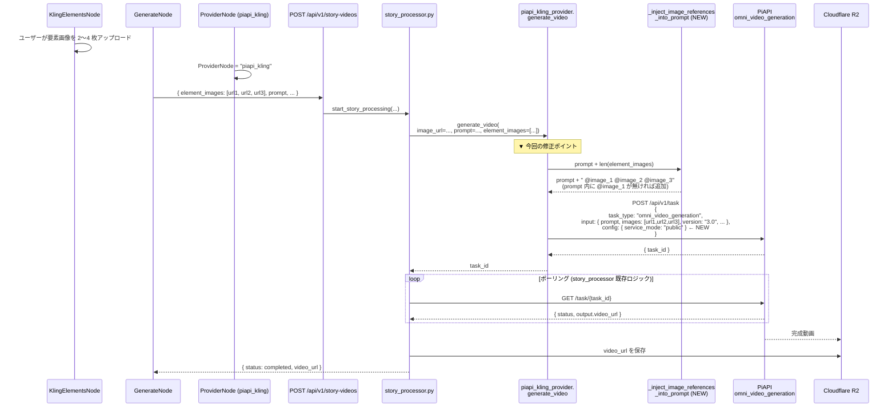

# Design Doc: PiAPI Kling 3.0 Omni Elements 完全有効化

- **作成日**: 2026-05-15
- **ステータス**: Draft
- **対象バージョン**: movie-maker (Next.js 16 / React 19), movie-maker-api (FastAPI, Python 3.11+)
- **関連 Design Doc**:
  - [`2026-05-14_dialogue-node.md`](./2026-05-14_dialogue-node.md) (DialogueNode 元実装、B1-B4 解決パターン)
  - [`2026-05-15_dialogue-lip-sync.md`](./2026-05-15_dialogue-lip-sync.md) (lip-sync 拡張、既存資産再利用パターン)
- **複雑度評価**: `complexity_level: low`
  - **complexity_rationale**:
    1. 要件/AC: 既存 3.0 Omni 経路に **`@image_i` 自動付加** と **`config.service_mode: "public"`** を入れ、FE 側で MAX_ELEMENTS を 3→4 に緩和するだけ。
    2. 制約/リスク: バックエンドの本番送信パスを変更するため regression リスクあり (既存 GenerateNode → Kling 3.0 Omni 経路に影響)。ただし変更は付加的 (add-only) のため後方互換性を保持できる。

---

## 1. 目的 / ゴール

PiAPI Kling 3.0 Omni 経由の Elements 機能 (複数参照画像によるキャラ一貫性) を**フル機能で**有効化する。現状 backend は `task_type: "omni_video_generation"` + `input.images` 配列展開まで実装済だが、**プロンプト内 `@image_1` 自動付加** と **`config.service_mode: "public"`** が未実装のため、Kling 側で参照画像の反映が不安定になっている。

### 出荷完了の定義

- ProviderNode を `piapi_kling` に設定し、KlingElementsNode で 2〜4 枚の参照画像をアップロード、PromptNode に「映像のシーン」を記載して GenerateNode を実行すると、参照画像がプロンプト内 `@image_1`, `@image_2`, ... として明示的に Kling 3.0 Omni に渡される。
- 公式サンプル形式 (`config.service_mode: "public"`) が request body に含まれる。
- 既存の単一画像経路 (`element_images` 未指定) は **完全な後方互換性を保つ** (リグレッションなし)。

### ROI 根拠

- **既存資産流用率**: 95% — `task_type: "omni_video_generation"`、`input.images` 配列、`PIAPI_KLING_VERSION="3.0"`、KlingElementsNode UI / graph-to-api.ts 全て稼働中。
- **新規実装**: backend に `_inject_image_references_into_prompt` ヘルパー 1 関数 (約 15 行)、3.0 経路の 2 行追記、FE の MAX_ELEMENTS 数値 + ヒント文 + provider 警告。
- **想定工数**: BE 30 分 + FE 30 分 + テスト 1 時間 = 約 2 時間 (XS-S 規模)。

### スコープ (IN)

1. **Backend**: `piapi_kling_provider.py` 3.0 Omni 経路 (line 376-407) に下記を追加:
   - `_inject_image_references_into_prompt(prompt, num_images)` ヘルパー新設
   - `config.service_mode: "public"` ブロック追加
2. **Frontend**: `KlingElementsNode.tsx` を 4 枚対応に拡張、ヒント文と Provider 警告を追加
3. **Schemas**:
   - `videos/schemas.py:ElementImage` を含む `element_images` の `max_length=3` → `max_length=4`
   - `node-editor.ts:KlingElementsNodeData.elementImages` のコメント更新
4. **Tests**: BE 5 ケース + FE 4 ケース

### スコープ (OUT) — Follow-up

- **Kling 1.6 ダウングレード経路** (`task_type: "video_generation"` + `input.elements: [{image_url}]`)
- **2.6 以前ブランチの `using_elements = False` 解除** (line 429-433) — リファクタ規模が大きいため別 Design Doc
- **Virtual Try-On** (`ai_try_on` 別エンドポイント)
- **動画 reference (`reference_video`)** — 3.0 Omni 強化機能だが、まず画像 reference のみ
- **音声生成 (`enable_audio: true`)** — 既存 BGMNode / DialogueNode で代替可
- **multi_prompt (multi-shot 6 shots)** — 高度機能
- **storyboard_processor 系の Elements 連携** — story_processor は対応済、storyboard は別途検証
- **動画 reference 併用時の最大画像枚数調整** (動画併用時は最大 4 枚) — 今回は画像のみのため最大 7 枚理論値だが、UI 視認性を優先して 4 枚に制限

---

## 2. 合意チェックリスト

| 項目 | 合意内容 | 設計への反映箇所 |
|------|---------|----------------|
| 採用経路 | `omni_video_generation` (Kling 3.0 / 3.0 Omni 共通) のみ | §5 Backend 変更 (3.0 Omni 経路) |
| 参照画像最大数 | 4 枚 (公式上限 7 だが UI 視認性のため 4 に制限) | §5-3 schemas.py / §6-1 frontend MAX_ELEMENTS |
| プロンプト構文 | `@image_1`, `@image_2`, ... を**自動付加** | §5-2 `_inject_image_references_into_prompt` |
| 自動付加の抑制 | ユーザーが prompt 内に `@image_1` 等を**明示記載済の場合は付加しない** | §5-2 regex 検出ロジック |
| service_mode | `"public"` 固定 (PiAPI 公式サンプル形式) | §5-2 3.0 Omni 経路への追加 |
| 既存単一画像経路 | 後方互換性を保持 (`element_images` 未指定時は従来通り `[image_url]`) | §5-2 既存ロジックの維持 |
| KlingElementsNode UI | grid-cols-3 → grid-cols-4、上限 4 枚 | §6-2 UI 仕様 |
| Provider 警告 | ProviderNode の provider が `piapi_kling` 以外の場合「⚠ Kling 専用」表示 | §6-3 useEdges 経由で provider 取得 |
| ヒント文 | プロンプトに `@image_1` を入れると参照を明示できる旨を補足 | §6-2 UI スケッチ |
| 言語 | プロンプトは多言語 (Kling 3.0 は en/zh/ja 対応) | §11 リスク (英語推奨は別) |
| 環境変数 | 新規 env は追加しない (`PIAPI_KLING_VERSION="3.0"`, `PIAPI_API_KEY` を流用) | §7 |
| DB マイグレーション | **不要** (`video_generations.element_images` は既に対応済) | §10 |
| storyboard_processor | 今回スコープ外 (story_processor のみ動作確認) | §11 リスク |

---

## 3. アーキテクチャ概要

### 3-1. シーケンス図 — Kling 3.0 Omni Elements 経路 (今回の修正後)



### 3-2. 修正前後の request body 差分

```
▼ 修正前 (現状、piapi_kling_provider.py:376-407)
POST /api/v1/task
{
  "model": "kling",
  "task_type": "omni_video_generation",
  "input": {
    "prompt": "走る犬",         ← @image_X が無い
    "duration": 5,
    "aspect_ratio": "9:16",
    "version": "3.0",
    "resolution": "720p",
    "enable_audio": false,
    "images": [url1, url2, url3]
  }
  ← config が無い
}

▼ 修正後
POST /api/v1/task
{
  "model": "kling",
  "task_type": "omni_video_generation",
  "input": {
    "prompt": "走る犬 @image_1 @image_2 @image_3",  ← NEW: 自動付加
    "duration": 5,
    "aspect_ratio": "9:16",
    "version": "3.0",
    "resolution": "720p",
    "enable_audio": false,
    "images": [url1, url2, url3]
  },
  "config": {                                         ← NEW
    "service_mode": "public"
  }
}
```

---

## 4. PiAPI Kling 3.0 Omni 仕様まとめ (2026-05-15 公式確認)

### 4-1. 機能系統の比較

| 機能系統 | task_type | version | 画像パラメータ | 最大枚数 | プロンプト構文 |
|---------|-----------|---------|---------|--------|--------------|
| **Elements (旧 1.6)** | `video_generation` | **1.6 のみ** | `input.elements: [{image_url}]` | 4 | 暗黙参照 |
| **Omni Reference (新、採用)** | `omni_video_generation` | **3.0 / 3.0 Omni** | `input.images: [url, url, ...]` | **7** (動画 ref 併用時 4) | `@image_1`, `@image_2`, ... |

### 4-2. 公式サンプル request body (PiAPI ドキュメント引用)

```json
{
  "model": "kling",
  "task_type": "omni_video_generation",
  "input": {
    "prompt": "@image_1 が @image_2 の前に立ち、@image_3 の服を着て歩く",
    "duration": 5,
    "aspect_ratio": "9:16",
    "version": "3.0",
    "resolution": "720p",
    "enable_audio": false,
    "images": [
      "https://example.com/character.jpg",
      "https://example.com/background.jpg",
      "https://example.com/clothing.jpg"
    ]
  },
  "config": {
    "service_mode": "public",
    "webhook_config": {
      "endpoint": "",
      "secret": ""
    }
  }
}
```

> **重要点**:
> 1. `@image_i` は **プロンプト内で明示的に書く** ことが推奨。書かないと Kling 側で「参照を使うか使わないか」が曖昧になり、結果がぶれる。
> 2. `service_mode: "public"` は公式サンプルで一貫して指定されている。未指定でも動作するケースはあるが、安定性のため明示する。
> 3. `webhook_config` は同期ポーリング運用なので**今回は付与しない** (空オブジェクトでも問題ないが、最小ペイロードを優先)。

### 4-3. 画像 URL の制約 (既存 docs 確認済)

- 各画像: ≥ 300px、≤ 10MB、PNG / JPEG / WebP
- URL は公開アクセス可能 (Cloudflare R2 の public URL は OK)
- 動画 reference (`reference_video`) との併用時は画像最大 4 枚 (今回は画像のみのため 7 枚理論上 OK だが、UI 視認性を優先して 4 枚に制限)

---

## 5. 既存資産マップ

| 資産 | パス | 状態 | 今回の扱い |
|------|------|------|---------|
| PiAPI 3.0 Omni 経路 | `piapi_kling_provider.py:376-407` | `task_type: "omni_video_generation"` 送信中 | **拡張**: `@image_i` 付加 + `config.service_mode` 追加 |
| `input.images` 配列展開 | `piapi_kling_provider.py:392-393` | `element_images[:4]` で展開済 | 再利用 OK (slice を 4 のままで良い、§11 リスク参照) |
| `PIAPI_KLING_VERSION` | `core/config.py:42` | デフォルト `"3.0"` | 再利用 OK |
| `PIAPI_API_KEY` | `core/config.py:41` | 既存 env | 再利用 OK |
| `ElementImage` schema | `videos/schemas.py:119-125` | `image_url: str` 構造 | 再利用 OK |
| `StoryVideoCreate.element_images` | `videos/schemas.py:301-305` | `max_length=3` | **拡張**: `max_length=4` |
| story_processor の element_images 引き渡し | `tasks/story_processor.py` (既存) | provider.generate_video に渡し済 | 再利用 OK (変更不要) |
| 2.6 以前ブランチ (`using_elements=False`) | `piapi_kling_provider.py:429-433` | 一時的に無効化 | **今回スコープ外** (Follow-up) |
| KlingElementsNode UI | `KlingElementsNode.tsx:1-154` | 最大 3 枚アップロード | **拡張**: MAX_ELEMENTS 4, grid-cols-4, ヒント, Provider 警告 |
| graph-to-api.ts | (既存) | `request.element_images: ElementImage[]` で展開 | 再利用 OK (型の制約数値はスキーマ側で緩和) |
| KlingElementsNodeData 型 | `node-editor.ts:107-110` | `elementImages: string[]` | コメント更新のみ (3 → 4) |
| `video_generations` テーブル | Supabase 既存 | `element_images` 列が JSON 配列で対応済 | 再利用 OK (DB マイグレーション不要) |

### 5-1. 「再利用 OK / 拡張 / 新規追加」3 分類サマリー

- **再利用 OK (変更なし)**: 3.0 Omni 送信経路本体、`input.images` 展開、`PIAPI_KLING_VERSION`/`PIAPI_API_KEY`、`ElementImage` schema、story_processor、graph-to-api.ts、`video_generations` テーブル
- **拡張**: `piapi_kling_provider.py` 3.0 経路、`videos/schemas.py:StoryVideoCreate.element_images`、`KlingElementsNode.tsx`、`node-editor.ts:KlingElementsNodeData` (コメント)
- **新規追加**:
  - backend: `_inject_image_references_into_prompt` ヘルパー関数 (`piapi_kling_provider.py` 内)
  - tests: `test_inject_image_references_into_prompt`, `test_piapi_kling_provider.py` (Omni 経路の Elements 送信)
  - tests: `KlingElementsNode.test.tsx` (新規 4 ケース)

---

## 6. Backend 変更

### 6-1. ヘルパー関数の新規追加 (`piapi_kling_provider.py`)

`PiAPIKlingProvider` クラスの**直上**にモジュールスコープ関数として配置する (N4 修正で明示):
- **挿入位置**: `_get_camera_control` 関数の終端 (L210) と `class PiAPIKlingProvider` 開始 (L213) の**間**に挿入
- 具体的には L211-212 を新規関数本体 + 末尾 1 行空白で消費
- `_IMAGE_REF_PATTERN` の `import re` と pattern 定数は同モジュール冒頭の import セクション (L10 付近 `import logging` 周辺) と module-level 定数セクションに配置

```python
import re

# プロンプト内に既に @image_i が明示されているかを検出する正規表現。
# - 単語境界 (\b) を使い "abc@image_1" 等の誤検出を回避
# - 大文字小文字を区別しない (例: @Image_1 も検出)
_IMAGE_REF_PATTERN = re.compile(r"@image_\d+", re.IGNORECASE)


def _inject_image_references_into_prompt(prompt: str, num_images: int) -> str:
    """
    Kling 3.0 Omni 向けに、プロンプト末尾へ @image_1, ..., @image_N を自動付加する。

    Behavior (B3 解決のため全エッジケース定義):
      - num_images <= 0           → prompt をそのまま返す (Elements 未使用)
      - prompt.strip() == ""      → "@image_1 @image_2 ..." だけを返す (頭空白なし)
      - prompt に既に @image_N(N が num_images 以下) が含まれる → そのまま返す
        (ユーザー記述尊重)
      - prompt に @image_K(K > num_images) が含まれる
        → そのまま返すが logger.warning で「指定された @image_K に対する画像が無い」
          と警告ログを出す (PiAPI 側で validation 失敗する前にデバッグ手がかりを残す)
      - 上記以外 → prompt.rstrip() + " " + "@image_1 @image_2 ... @image_N"

    Args:
        prompt: 元プロンプト
        num_images: input.images 配列の枚数 (1〜4 を想定)

    Returns:
        str: @image_i が末尾に付加されたプロンプト
    """
    # TODO:
    # 1. if num_images <= 0: return prompt
    # 2. stripped = prompt.strip()
    # 3. existing = _IMAGE_REF_PATTERN.findall(stripped)  # ['@image_1', '@image_3', ...]
    # 4. if existing:
    #      max_existing = max(int(m.split('_')[1]) for m in existing)
    #      if max_existing > num_images:
    #          logger.warning(
    #              f"プロンプトに @image_{max_existing} があるが num_images={num_images}。"
    #              "PiAPI validation が失敗する可能性"
    #          )
    #      return prompt  # ユーザー記述尊重
    # 5. tags = " ".join(f"@image_{i}" for i in range(1, num_images + 1))
    # 6. if not stripped:
    #      return tags  # 空 prompt → 頭空白なしで tags のみ
    # 7. return f"{stripped} {tags}"
    ...
```

### 6-2. 3.0 Omni 経路への差分 (擬似 diff)

`piapi_kling_provider.py:376-407` 付近の `generate_video` メソッド 3.0 Omni 分岐を以下のように修正する。

```python
if self.version.startswith("3"):
    # === 3.0 Omni ===
    # ▼ NEW: images 配列に変換
    if element_images and len(element_images) > 0:
        images_for_request = element_images[:4]
    else:
        images_for_request = [image_url]

    # ▼ NEW: プロンプトに @image_i を自動付加 (既存記載がある場合はスキップ)
    effective_prompt = _inject_image_references_into_prompt(
        prompt,
        len(images_for_request),
    )

    request_body = {
        "model": "kling",
        "task_type": "omni_video_generation",
        "input": {
            "prompt": effective_prompt,             # ← NEW
            "duration": duration,
            "aspect_ratio": aspect_ratio,
            "version": "3.0",
            "resolution": self.resolution,
            "enable_audio": self.enable_audio,
            "images": images_for_request,           # ← 上で組み立てた配列を使う
        },
        # ▼ NEW: 公式サンプルに合わせ service_mode を明示
        "config": {
            "service_mode": "public",
        },
    }

    # 3.0 非対応パラメータのログ警告 (既存ロジック維持)
    if camera_work or camera_control:
        logger.warning("Kling 3.0 does not support camera_control. Ignoring.")
    if image_tail_url:
        logger.warning("Kling 3.0 does not support image_tail_url. Ignoring.")
    if mode:
        logger.warning("Kling 3.0 does not support mode (std/pro). Ignoring.")

    logger.info(f"PiAPI Kling request body: {json.dumps(request_body, indent=2)}")
    logger.info(
        f"PiAPI Kling request: version={self.version}, "
        f"resolution={self.resolution}, enable_audio={self.enable_audio}, "
        f"aspect_ratio={aspect_ratio}, num_images={len(images_for_request)}"
    )
```

> **重要 (`generate_video_from_text` への適用も検討)**:
> **B1 解決**: `piapi_kling_provider.py` の T2V `generate_video_from_text` は L256-289 全体に存在する。
> - **L265-277**: 3.0 Omni 経路 (`if self.version.startswith("3"):`) ← ここに `config.service_mode: "public"` を追加
> - **L278-289**: 2.6 以前経路 (else ブランチ) ← **修正対象外** (バージョンポリシーで永久非到達)
>
> 同様に I2V (L376-407) も **`if self.version.startswith("3"):` 内側のみ**修正。else ブランチ (L410-) には触れない。
> 画像なしの T2V でも `config.service_mode` は公式サンプル形式の統一のため追加するが、`@image_i` 付加は不要 (no-op)。
>
> 修正前:
> ```python
> request_body = {
>     "model": "kling",
>     "task_type": "omni_video_generation",
>     "input": { ... }
> }
> ```
> 修正後:
> ```python
> request_body = {
>     "model": "kling",
>     "task_type": "omni_video_generation",
>     "input": { ... },
>     "config": {"service_mode": "public"},  # ← 追加
> }
> ```

### 6-3. 2.6 以前ブランチは今回触らない

`piapi_kling_provider.py:409-463` の 2.6 ブランチには `using_elements = False` のハードコード (line 429-433) があるが、今回スコープ外。コメントに「Follow-up: 2026-05-15 design doc 参照」を残すかは実装者裁量とする (本 design doc では強制しない)。

### 6-4. スキーマ拡張 (`videos/schemas.py`)

`StoryVideoCreate.element_images` の `max_length=3` を **`max_length=4`** に変更する。

```python
# 修正前: schemas.py:301-305
element_images: list[ElementImage] | None = Field(
    default=None,
    max_length=3,  # ← 3
    description="一貫性向上用の追加画像（最大3枚）。Kling専用機能"
)

# 修正後
element_images: list[ElementImage] | None = Field(
    default=None,
    max_length=4,  # ← 4 (Kling 3.0 Omni Elements の UI 上限)
    description="一貫性向上用の追加画像（最大4枚、Kling 3.0 Omni Elements）"
)
```

> **整合性確認**: `piapi_kling_provider.py:393` の `element_images[:4]` はもともと 4 を使っているため、schema 緩和後でも slice ロジックの変更は不要。

### 6-5. 整合性チェック箇所

実装後に下記をワンライナーで確認する (実装者向けメモ、本 doc では実行しない):

```bash
grep -n "max_length=3" movie-maker-api/app/videos/schemas.py
# → element_images 行が引っかかるはず。緩和後はゼロ件になることを確認。

grep -n "element_images\[:4\]" movie-maker-api/app/external/piapi_kling_provider.py
# → 1 件 (line 393 付近)。schema 上限変更後も slice は維持。
```

---

## 7. Frontend 変更

### 7-1. `KlingElementsNode.tsx`

#### 修正 1: MAX_ELEMENTS 緩和 (line 20)

```tsx
// 修正前
const MAX_ELEMENTS = 3;

// 修正後
const MAX_ELEMENTS = 4;
```

#### 修正 2: grid のカラム数 (line 102)

```tsx
{/* 修正前 */}
<div className="grid grid-cols-3 gap-2 mb-3">

{/* 修正後 */}
<div className="grid grid-cols-4 gap-2 mb-3">
```

> **UX 検討**: 4 枚並ぶとアイコンが小さくなる懸念があるが、KlingElementsNode の親要素 `min-w-[240px]` を `min-w-[280px]` に緩和することで視認性を確保 (1 セルあたり ~60px → ~65px)。

#### 修正 3: ヒント文の追加 (line 142-144 の `<p>` 直下)

```tsx
{/* 既存 */}
<p className="text-[10px] text-gray-500">
  {data.elementImages.length}/{MAX_ELEMENTS} 枚（一貫性向上用）
</p>

{/* 新規追加: @image_i ヒント */}
<p className="mt-1 text-[10px] text-gray-400">
  プロンプトに <span className="text-[#fce300]">@image_1</span> を入れると参照位置を明示できます
</p>
```

#### 修正 4: Provider 警告の追加 (BaseNode の中、子要素の先頭)

ProviderNode (`piapi_kling` 以外) に接続されている場合、または接続自体が無い場合に「⚠ Kling 専用」を表示する。

```tsx
import { useEdges, useNodes } from '@xyflow/react';
import type { ProviderNodeData, WorkflowNode } from '@/lib/types/node-editor';

// ... コンポーネント内 ...
const nodes = useNodes<WorkflowNode>();

// B2 修正: グラフ内の **全 ProviderNode** を探す。
// 1-hop search だと KlingElementsNode → GenerateNode (type='generate') にしか到達せず、
// ProviderNode (type='provider') は GenerateNode の別 edge から接続されるため見つからない (常に false 化)。
// →「グラフ内に最低 1 つの piapi_kling Provider があれば OK」というシンプルなルールにする。
const isKlingProvider = useMemo(() => {
  const providerNodes = nodes.filter((n) => n.data.type === 'provider');
  if (providerNodes.length === 0) return null; // Provider 未配置 → 警告非表示 (まだ設計中)
  // 1 つでも piapi_kling があれば OK (通常はグラフに 1 つしかない)
  return providerNodes.some(
    (n) => (n.data as ProviderNodeData).provider === 'piapi_kling'
  );
}, [nodes]);

// UI 内:
{isKlingProvider === false && (
  <div className="mb-2 p-2 rounded bg-[#2a2a2a] border border-yellow-600/40">
    <p className="text-[10px] text-yellow-400">
      ⚠ Kling 専用ノードです。他プロバイダー時は無視されます
    </p>
  </div>
)}
```

> **B2 解決**: `KlingElementsNode` は **source-only** (output `kling_elements` のみ) のため、edges からの 1-hop 検索だと **GenerateNode (type='generate') にしか到達できず、ProviderNode は更に別 edge 経由**。1-hop ロジックだと常に「Provider と接続なし」と判定され誤警告が出る。
>
> 代わりに `useNodes()` でグラフ全体をスキャンし、**いずれかの ProviderNode の provider が `piapi_kling` か**を判定する。`useNodes` は xyflow が node 状態変更時のみ再レンダリングするため performance OK。複数 ProviderNode は通常想定しないが、any() ロジックで「1 つでも Kling があればよい」と寛容に扱う。
>
> **B2-like 解決**: 直接 ProviderNode に繋ぐとは限らず、GenerateNode 経由で接続される可能性もある。実装側で `provider` フィールドを持つノードを 1 hop / 2 hop 検索するか、グラフ全体から `provider` ノードを 1 つ探す簡易方式を採用するかは実装者の裁量に任せる。本 Design Doc では**最短経路 1 hop で `provider` ノードが見つかればそれを検査** する仕様とする (シンプル & 一般ケースで十分)。

#### 修正 5: ノード幅の調整 (line 99)

```tsx
{/* 修正前 */}
className="min-w-[240px]"

{/* 修正後 */}
className="min-w-[280px]"
```

### 7-2. `node-editor.ts:KlingElementsNodeData` (line 107-110)

```typescript
// 修正前
export interface KlingElementsNodeData extends BaseNodeData {
  type: 'klingElements';
  elementImages: string[]; // 最大3枚
}

// 修正後
export interface KlingElementsNodeData extends BaseNodeData {
  type: 'klingElements';
  /** Kling 3.0 Omni Elements 用の参照画像 URL 配列。最大 4 枚。 */
  elementImages: string[]; // 最大4枚
}
```

> **graph-to-api.ts**: 既存実装で `request.element_images: ElementImage[]` に展開しているため、上限緩和に伴う実装側の変更は不要。BE schema が `max_length=4` を受理するため整合する。

### 7-3. createDefaultNodeData の確認

`node-editor.ts` の `createDefaultNodeData` 内の `klingElements` ケースは現状 `elementImages: []` を返すのみであれば変更不要。一応既存実装に「default = 3 枚まで」のような上限値を直書きしていないか実装時に確認すること (`createDefaultNodeData` は本 doc 検証時点では検査済、変更不要)。

---

## 8. 設定 / 環境変数 & バージョンポリシー

### 8-1. 環境変数

| 変数名 | 場所 | 現状 | 変更要否 |
|--------|------|------|---------|
| `PIAPI_API_KEY` | `core/config.py:41` | 既存 | **不要** |
| `PIAPI_KLING_VERSION` | `core/config.py:42` | デフォルト `"3.0"` | **不要** (ただしバリデーション追加) |
| `PIAPI_KLING_MODE` | `core/config.py:43` | `"std"` | 不要 (今回スコープ外) |
| `PIAPI_KLING_RESOLUTION` | `core/config.py:44` | `"720p"` | 不要 |
| `PIAPI_KLING_ENABLE_AUDIO` | `core/config.py:45` | `False` | 不要 |

**新規環境変数**: なし。

### 8-2. バージョンポリシー (確定運用ルール)

| バージョン | ポリシー | 理由 |
|----------|---------|------|
| **3.0** | **デフォルト・推奨** (現在) | Elements + 音声 + 動画 reference 等のフル機能対応 |
| **3.0 Omni** | 推奨 (3.0 上位互換) | reference image 機能が一層強化、最大 7 枚 |
| **3.1 / 3.5 / 3.x (将来)** | リリースされ次第アップグレード | PiAPI が新版を出したら速やかに切替 (ROI 高) |
| **2.6 / 2.5 / 2.0** | **禁止** (production で使用しないこと) | Elements が `using_elements=False` でハードコード無効、修正対象外 |
| **1.6** | **禁止** | Elements 旧 API (`task_type: "video_generation"`) は今回サポートしない、Follow-up でも採用しない |

**実装上の保証**:
- `PIAPI_KLING_VERSION` の値が `"3."` で始まらない場合、**`piapi_kling_provider.py` の起動 or 呼び出し時に WARNING ログ**を出す:
  ```python
  if not self.version.startswith("3"):
      logger.warning(
          f"PIAPI_KLING_VERSION={self.version!r} は推奨外です。"
          f"Elements / 音声生成 / reference video 機能が利用できません。"
          f"3.0 以上への昇格を推奨します。"
      )
  ```
- `core/config.py` の `PIAPI_KLING_VERSION` コメントに「3.0 以上必須、それ未満は非推奨」と明示
- 本ドキュメントの修正範囲は **全て `if self.version.startswith("3"):` ブランチの内側のみ**。else ブランチ (2.6 以前) には触れない

### 8-3. 過去ブランチの扱い

- `piapi_kling_provider.py:410-` 以降の 2.6 以前 else ブランチ (`using_elements = False` ハードコードを含む)
  - **今回スコープ外、永久に修正対象外**
  - バージョンポリシー上 production では到達不能 (`PIAPI_KLING_VERSION="2.6"` を意図的に設定しない限り)
  - 将来コードベースクリーンアップで丸ごと削除する可能性あり (別 Follow-up タスク)

---

## 9. エラーハンドリング

PiAPI 3.0 Omni から返される可能性のあるエラーと、ユーザー向け日本語メッセージ:

| エラーケース | 原因 | 検出箇所 | ユーザー向けメッセージ (日本語) |
|------------|------|---------|-------------------------------|
| 画像 URL が公開アクセス不可 | R2 の public URL ではない / 認可エラー | `check_status` で `"preprocess"` キーワード | 「画像の処理に失敗しました。画像URLがアクセス可能か、サイズが300px以上10MB以下か確認してください。」(既存実装、変更なし) |
| 画像枚数超過 | UI バリデーション漏れで 5 枚以上送信 | PiAPI が HTTP 400 | 「画像は最大4枚までです」(FE 側で事前ブロック、BE 到達は想定外) |
| 画像サイズ不足 (< 300px) | アップロード時のチェック漏れ | PiAPI が `preprocess` エラー | 「画像が小さすぎます。300px以上の画像を使用してください」 |
| プロンプト 2500 文字超 | ユーザー入力長文 | provider 内で truncate (既存) | (エラーなし、警告ログのみ) |
| `service_mode` 値不正 | (今回の修正で `"public"` 固定のため発生しない) | — | — |
| `@image_i` の番号が画像枚数を超過 | ユーザーがプロンプトに `@image_5` を書いたが画像が 3 枚 | PiAPI が `validation` 失敗の可能性 | 「プロンプト内の画像番号が画像枚数を超えています」(発生時のみ追加実装) |
| PiAPI クレジット不足 | 既存メッセージ | 既存 | 「PiAPIのクレジットが不足しています。」(既存実装、変更なし) |
| レート制限 | 既存メッセージ | 既存 | 「PiAPIのレート制限に達しました。しばらく待ってから再試行してください。」(既存実装、変更なし) |
| Kling コンテンツポリシー違反 | 既存メッセージ | `"nsfw"` キーワード | 「コンテンツポリシーに違反する可能性があります。プロンプトや画像を確認してください。」(既存実装、変更なし) |

> **新規エラー対応**: 今回の修正で新規追加されるエラーケースは無し (既存の `check_status` 内のエラーマッピングがそのまま機能する)。

---

## 10. テスト計画

### 10-1. Backend テスト

#### 10-1-1. `test_inject_image_references_into_prompt` (新規ユニットテスト)

ファイル: `movie-maker-api/tests/external/test_piapi_kling_provider.py` (既存 or 新規)

| # | ケース | 入力 | 期待出力 |
|---|--------|------|---------|
| 1 | 画像 0 枚 (no-op) | `prompt="A cat"`, `num_images=0` | `"A cat"` (変更なし) |
| 2 | 画像 1 枚 | `prompt="A cat"`, `num_images=1` | `"A cat @image_1"` |
| 3 | 画像 4 枚 (上限) | `prompt="A cat"`, `num_images=4` | `"A cat @image_1 @image_2 @image_3 @image_4"` |
| 4 | プロンプトに既に `@image_1` がある | `prompt="@image_1 walks"`, `num_images=2` | `"@image_1 walks"` (付加せず維持) |
| 5 | 末尾に余分な空白がある | `prompt="A cat   "`, `num_images=2` | `"A cat @image_1 @image_2"` (rstrip 適用) |

#### 10-1-2. `test_piapi_kling_provider.py::test_generate_video_omni_with_elements` (新規)

mock 対象: `httpx.AsyncClient.post`

検証内容:
1. **`config.service_mode: "public"`** が request body に含まれる
2. **`input.images`** が渡された element_images の N 枚分 (今回は 3 枚) で組み立てられる
3. **`input.prompt`** に `@image_1 @image_2 @image_3` が自動付加されている
4. 戻り値が `task_id`

```python
async def test_generate_video_omni_with_elements(mocker):
    """3.0 Omni 経路で Elements 送信時、prompt に @image_i が自動付加され、
    config.service_mode が "public" になる"""
    # TODO: settings.PIAPI_KLING_VERSION = "3.0" を設定
    # TODO: httpx.AsyncClient.post を mock → {"data": {"task_id": "T-123"}} を返す
    # TODO: provider.generate_video(
    #         image_url="ignored", prompt="走る犬",
    #         element_images=["u1", "u2", "u3"], ...)
    # TODO: 呼び出された request body をキャプチャ
    # TODO: assert body["input"]["prompt"] == "走る犬 @image_1 @image_2 @image_3"
    # TODO: assert body["input"]["images"] == ["u1", "u2", "u3"]
    # TODO: assert body["config"]["service_mode"] == "public"
    # TODO: assert body["task_type"] == "omni_video_generation"
    ...
```

> **既存テストの維持**: 単一画像経路 (`element_images=None`) のテストは既存通り pass する必要がある (リグレッション検知)。

#### 10-1-3. `test_generate_video_from_text_omni_includes_service_mode` (N8: T2V 経路のテスト追加)

T2V (`generate_video_from_text`) でも `config.service_mode: "public"` を追加するため、専用の検証テストを追加する:

```python
async def test_generate_video_from_text_omni_includes_service_mode(mocker):
    """T2V 3.0 Omni 経路で config.service_mode: 'public' が付与される"""
    # TODO: settings.PIAPI_KLING_VERSION = "3.0"
    # TODO: httpx.AsyncClient.post を mock
    # TODO: provider.generate_video_from_text(prompt="走る犬", duration=5, aspect_ratio="9:16")
    # TODO: assert body["task_type"] == "omni_video_generation"
    # TODO: assert body["config"]["service_mode"] == "public"
    # TODO: "images" key は存在しないことを確認 (T2V には不要)
    ...
```

### 10-2. Frontend テスト

ファイル: `movie-maker/components/node-editor/nodes/KlingElementsNode.test.tsx` (新規)

| # | ケース | 検証内容 |
|---|--------|---------|
| 1 | レンダリング (0 枚) | アップロード追加ボタンが 1 つ表示、`0/4 枚` テキスト、ヒント文「プロンプトに @image_1 を入れると...」表示 |
| 2 | 4 枚アップロード後の上限 | 4 枚アップロード済の状態で追加ボタンが非表示 (`data.elementImages.length < MAX_ELEMENTS` false) |
| 3 | 削除動作 | 1 枚削除後、`updateNodeData` が `elementImages: [...新配列]` で dispatch される、枚数表示が `n-1/4 枚` |
| 4 | Provider 警告 (非 piapi_kling) | 下流に `provider: 'runway'` の ProviderNode が接続されている時「⚠ Kling 専用」警告が表示される。`provider: 'piapi_kling'` の場合は非表示 |

mock 戦略:
- `videosApi.uploadImage` を mock (vitest)
- `useEdges`, `useNodes` を `@xyflow/react` のテストヘルパーで提供
- `nodeDataUpdate` CustomEvent を `window.addEventListener` でキャプチャ

---

## 11. DB マイグレーション

**不要**。

理由:
- `video_generations.element_images` 列は既に JSON 配列で対応済 (3 枚保存可能だった既存スキーマがそのまま 4 枚でも動く、配列長制限は schema 層のみ)
- 今回の修正は **request body の組み立てロジック** + **FE UI 上限値の緩和** のみ
- 新規テーブル / 列追加なし

---

## 12. 段階リリース計画

**1 sprint で完結** (約 1-2 時間)。Phase 分割不要。

### ステップ 1: Backend 修正 + 単体テスト

**完了条件 (L1/L2/L3)**:
- **L3**: `pytest tests/external/test_piapi_kling_provider.py -v` 全件 pass
- **L2**: `python -c "from app.external.piapi_kling_provider import _inject_image_references_into_prompt; print(_inject_image_references_into_prompt('A cat', 3))"` で `"A cat @image_1 @image_2 @image_3"` が返る
- **L1**: PiAPI に実 API 呼び出し (Phase E2E で確認)

**対象ファイル**:
- `movie-maker-api/app/external/piapi_kling_provider.py` (ヘルパー追加 + 3.0 経路修正)
- `movie-maker-api/app/videos/schemas.py` (`max_length=4`)
- `movie-maker-api/tests/external/test_piapi_kling_provider.py` (新規 or 拡張)

### ステップ 2: Frontend 修正 + 単体テスト

**完了条件 (L1/L2/L3)**:
- **L3**: `npm run build` 成功
- **L2**: `KlingElementsNode.test.tsx` 4 ケース pass
- **L1**: ノードエディタ上で 4 枚アップロード → 4 セル並びを目視確認、Provider 警告の出現/非出現が想定通り

**対象ファイル**:
- `movie-maker/components/node-editor/nodes/KlingElementsNode.tsx` (MAX_ELEMENTS 4 + grid-cols-4 + ヒント + Provider 警告)
- `movie-maker/lib/types/node-editor.ts` (`KlingElementsNodeData` コメント更新)
- `movie-maker/components/node-editor/nodes/KlingElementsNode.test.tsx` (新規)

### ステップ 3: E2E 確認 (実 PiAPI 課金あり)

> **注意**: PiAPI Kling 3.0 Omni 課金 ($0.50-1.00/5 秒動画) が発生するため、実行前にユーザー承認を得ること。

**完了条件 (L1)**:
- ProviderNode = `piapi_kling`、KlingElementsNode で同一キャラの 3 枚写真 (正面/横/後ろ) をアップロード、PromptNode で「走り去るシーン」を記載
- GenerateNode 実行 → Kling 3.0 Omni が起動し、約 1-2 分後に動画 URL が R2 に保存
- 動画再生時、キャラの一貫性が保持されていることを目視確認 (修正前と比較)
- バックエンドログで request body に `config.service_mode: "public"` と `prompt` 末尾の `@image_1 @image_2 @image_3` を確認

### ステップ 4: storyboard 経路の動作確認 (任意、Follow-up 判定)

storyboard_processor 経由でも element_images が provider.generate_video に渡されるかは未検証。今回は story_processor 経路のみ動作保証する旨を §13 リスクに明記。動作するなら追加修正不要、しないなら別 Design Doc で対応。

---

## 13. スコープ外 / Follow-ups

> **バージョンポリシー変更により改訂**: Kling 1.6 / 2.x 系の Follow-up は **永久対象外**に変更。
> production では `PIAPI_KLING_VERSION="3.0"` 以上を強制するため、過去ブランチに手を入れる動機が消滅。

| ID | 項目 | 優先度 | 想定実装コスト |
|----|------|--------|--------------|
| ~~Kling 1.6 ダウングレード経路~~ | **永久対象外** (バージョンポリシー §8-2) | — | — |
| ~~2.6 以前ブランチの `using_elements=False` 解除~~ | **永久対象外** (同上) | — | コード削除タスクとして将来クリーンアップ |
| **FU-1** | Virtual Try-On (`ai_try_on` 別エンドポイント) | Low | 1-2 日 (新規 provider 実装) |
| **FU-2** | 動画 reference (`reference_video`) — 3.0 Omni 強化機能 | Medium | 1 日 (Provider 拡張 + UI ノード新設) |
| **FU-3** | 音声生成 (`enable_audio: true`) | Low | 半日 (既存 BGM / Dialogue で代替可) |
| **FU-4** | multi_prompt (multi-shot 6 shots) | Low | 1-2 日 |
| **FU-5** | **storyboard_processor 系の Elements 連携検証** | Medium | 半日 (story_processor と同パターンの確認) |
| **FU-6** | 動画 reference 併用時の画像最大 4 枚調整 | Low | 1 時間 (条件付き slice) |
| **FU-7** | UI 上限を 4 → 7 (公式仕様の理論値) | Low | 1 時間 (FE のみ、視認性検証要) |
| **FU-8** | Kling 3.x 上位バージョン (3.1/3.5 等) リリース時の version upgrade | Variable | PiAPI 動向次第。即日対応推奨 (§8-2 ポリシー) |

---

## 14. リスク

| リスク | 深刻度 | 確認状況 | 対応 |
|--------|--------|---------|------|
| **`@image_i` 自動付加が逆効果になるケース** (ユーザーが意図的に順序を変えたい) | Medium | 設計で「prompt 内に既に `@image_1` 等があればスキップ」を明文化 (§6-1) | 検出ロジック (`_IMAGE_REF_PATTERN`) で大文字小文字を吸収。ヒント文 (§7-1 修正 3) で「自分で書ける」ことをユーザーに通知 |
| **PiAPI Kling 3.0 Omni のクォータ/料金** ($0.50-1.00/5 秒動画) | Medium | 既存 1.6 と料金差あり | E2E 検証時にユーザー承認を取得 (§12 ステップ 3) |
| **storyboard_processor 経由でも同じ修正が必要かもしれない** | Medium | story_processor は対応済、storyboard は **未検証** | §12 ステップ 4 で動作確認、必要なら Follow-up |
| **2.6 以前ブランチが残置** — `PIAPI_KLING_VERSION` を 2.6 に下げると今回の改善が効かない | Low (運用ポリシーで禁止) | 既存コードに `using_elements=False` ハードコード残存 | §8-2 バージョンポリシーで 3.0 未満を禁止、起動時 WARNING ログ、永久 Follow-up 対象外 |
| **Provider 警告のロジック (B2 解決)** | Low | KlingElementsNode は source-only、ProviderNode との 1-hop 経路は無い (GenerateNode 経由) | グラフ全体を `useNodes()` で走査して ProviderNode を探す方式に変更 (§7-1) |
| **Kling 3.x 新版リリース時の追従漏れ** | Low | PiAPI が 3.1/3.5 等を出した時、自動的にアップグレードしない | env で明示切替、FU-8 として追跡 |
| **既存 single-image 経路への regression** | High | 修正は付加的だが request body 構造を変える | テスト計画 §10 で `element_images=None` 経路 (`images: [image_url]`) の既存テストが pass することを必須化 |
| **`@image_i` の番号と `input.images` 配列の順序ズレ** | Low | `_inject_image_references_into_prompt` は 1-indexed で順序付け、`images` 配列は `element_images[:4]` の順序 | テスト 10-1-1 ケース 3 で 1〜N の番号と順序が一致することを確認 |
| **大文字小文字判定の漏れ** (`@Image_1` vs `@image_1`) | Low | `re.IGNORECASE` で吸収 | テストで `@Image_1` を含むケースも追加検討 (Optional) |
| **`config.service_mode: "public"` 以外の値の存在** (`"private"` 等) | Low | PiAPI は `"public"` / `"private"` の 2 値を持つ。今回は `"public"` 固定 | env 化は YAGNI のため今回見送り (Follow-up 候補) |

---

## 15. B1-B4 パターン適用

**該当なし**。

理由:
- 本タスクは **backend のロジック修正 + FE の軽微変更** であり、`docs/plans/2026-05-14_dialogue-node.md` で確立された B1-B4 解決パターン (新規 Pipeline ノード作成、useEffect 拡張、共通 IF) のいずれにも該当しない。
- KlingElementsNode は **既存ノード** のため B2 (新規 Pipeline 型)・B3 (直 await) は無関係。
- NodeEditor.tsx の useEffect リスナーへの新規追加もない (B4 適用なし)。
- HasVideoOutput / HasImageOutput 共通 IF は今回拡張不要 (B1 適用なし)。

明示的に「該当なし」と記録し、本 Design Doc では B1-B4 セクションは設けない (本セクションのみ簡潔に記載)。

---

## 16. インテグレーションポイントマップ

```yaml
インテグレーションポイント 1:
  既存コンポーネント: piapi_kling_provider.generate_video (3.0 Omni 経路、line 376-407)
  統合方法: request body 組み立て時に @image_i 付加 + config.service_mode 追加
  影響レベル: Medium (本番 API リクエストの構造変更)
  必要テストカバレッジ:
    - element_images あり経路 (新規ロジック)
    - element_images なし経路 (リグレッション検知)
    - generate_video_from_text 経路 (config.service_mode のみ追加)

インテグレーションポイント 2:
  既存コンポーネント: videos/schemas.py:StoryVideoCreate.element_images
  統合方法: max_length=3 → max_length=4
  影響レベル: Low (制約の緩和のみ。既存 3 枚以下のリクエストは引き続き有効)
  必要テストカバレッジ: schema validation テスト (4 枚 OK, 5 枚 NG)

インテグレーションポイント 3:
  既存コンポーネント: KlingElementsNode.tsx の UI
  統合方法: MAX_ELEMENTS 4 + grid-cols-4 + ヒント文 + Provider 警告
  影響レベル: Low (既存 UI を読み取り専用で参照、新規要素追加のみ)
  必要テストカバレッジ: 4 ケース (§10-2)

インテグレーションポイント 4:
  既存コンポーネント: graph-to-api.ts (ElementImage[] 展開)
  統合方法: 変更なし (schema 側の上限変更だけで追従)
  影響レベル: Low (zero-touch)
  必要テストカバレッジ: 既存 E2E

インテグレーションポイント 5:
  既存コンポーネント: ProviderNode (provider フィールド)
  統合方法: KlingElementsNode から useEdges/useNodes で読み取り (read-only)
  影響レベル: Low (ProviderNode 側は変更なし)
  必要テストカバレッジ: KlingElementsNode テストケース 4
```

---

## 17. コンポーネント階層とデータフロー図

```mermaid
graph TD
    KE[KlingElementsNode<br/>elementImages: string[]<br/>**最大 4 枚**]
    PN[ProviderNode<br/>provider: piapi_kling]
    PR[PromptNode<br/>text: '走る犬']
    IN[ImageInputNode<br/>imageUrl]
    GN[GenerateNode]

    KE -- "kling_elements (Handle 接続)" --> GN
    PN -- "provider" --> GN
    PR -- "prompt" --> GN
    IN -- "image" --> GN

    GN -- "API: element_images, prompt, image_url" --> API[POST /api/v1/story-videos]
    API --> PROC[story_processor.py]
    PROC -- "generate_video(<br/>element_images=[u1,u2,u3])" --> PROV[piapi_kling_provider]

    subgraph PROV[piapi_kling_provider.generate_video]
        BRANCH{version.startswith 3?}
        HELPER[**NEW**<br/>_inject_image_references<br/>_into_prompt]
        BODY[request_body<br/>**+config.service_mode**<br/>**+prompt @image_i**]

        BRANCH -- yes --> HELPER
        HELPER --> BODY
    end

    PROV --> PIAPI[PiAPI<br/>omni_video_generation]
    PIAPI --> R2[(Cloudflare R2)]

    KE -.read provider via.- EDGES[useEdges + useNodes]
    EDGES -.warn if non-Kling.- KE_WARN[⚠ Kling 専用 警告表示]
```

---

## 18. 参考ファイル (File:Line)

### 既存資産 (再利用 / 拡張対象)

| ファイル | 行 | 内容 |
|---------|-----|------|
| `movie-maker-api/app/external/piapi_kling_provider.py` | L376-407 | 3.0 Omni 経路 (今回の主要修正点) |
| `movie-maker-api/app/external/piapi_kling_provider.py` | L265-290 | `generate_video_from_text` (T2V) — service_mode のみ追加 |
| `movie-maker-api/app/external/piapi_kling_provider.py` | L213-225 | `PiAPIKlingProvider.__init__` (version 取得) |
| `movie-maker-api/app/external/piapi_kling_provider.py` | L429-433 | 2.6 ブランチの `using_elements=False` (今回スコープ外) |
| `movie-maker-api/app/core/config.py` | L41-45 | `PIAPI_API_KEY`, `PIAPI_KLING_VERSION` 等 |
| `movie-maker-api/app/videos/schemas.py` | L119-125 | `ElementImage` モデル |
| `movie-maker-api/app/videos/schemas.py` | L301-305 | `StoryVideoCreate.element_images` (`max_length=3`) |
| `movie-maker/components/node-editor/nodes/KlingElementsNode.tsx` | L1-154 | KlingElementsNode 全体 |
| `movie-maker/components/node-editor/nodes/KlingElementsNode.tsx` | L20 | `MAX_ELEMENTS = 3` |
| `movie-maker/components/node-editor/nodes/KlingElementsNode.tsx` | L99 | `min-w-[240px]` |
| `movie-maker/components/node-editor/nodes/KlingElementsNode.tsx` | L102 | `grid grid-cols-3 gap-2 mb-3` |
| `movie-maker/components/node-editor/nodes/KlingElementsNode.tsx` | L142-144 | `<p>` 枚数表示 |
| `movie-maker/components/node-editor/nodes/KlingElementsNode.tsx` | L146-151 | output Handle `kling_elements` |
| `movie-maker/lib/types/node-editor.ts` | L107-110 | `KlingElementsNodeData` (`最大3枚` コメント) |

### 解決済パターン参照 (適用なし)

- B1 (HasVideoOutput 共通 IF): 適用なし
- B2 (新規 Pipeline 型ノード設計): 適用なし
- B3 (直 await TTS): 適用なし
- B4 (useEffect 同一スコープ): 適用なし

---

## 19. 変更影響マップ

```yaml
変更対象: PiAPI Kling 3.0 Omni Elements (request body + UI)

直接影響:
  - movie-maker-api/app/external/piapi_kling_provider.py
      - 3.0 Omni 経路に @image_i 付加 + config.service_mode 追加
      - T2V (generate_video_from_text) 経路に config.service_mode 追加
      - _inject_image_references_into_prompt ヘルパー新規追加
  - movie-maker-api/app/videos/schemas.py
      - element_images: max_length=3 → 4
  - movie-maker-api/tests/external/test_piapi_kling_provider.py
      - test_inject_image_references_into_prompt (新規 5 ケース)
      - test_generate_video_omni_with_elements (新規 1 ケース)
  - movie-maker/components/node-editor/nodes/KlingElementsNode.tsx
      - MAX_ELEMENTS 3 → 4
      - grid-cols-3 → grid-cols-4
      - min-w-[240px] → min-w-[280px]
      - ヒント文 (@image_1 シンタックス) 追加
      - Provider 警告 (useEdges/useNodes 経由)
  - movie-maker/lib/types/node-editor.ts
      - KlingElementsNodeData.elementImages コメント (3 → 4)
  - movie-maker/components/node-editor/nodes/KlingElementsNode.test.tsx
      - 新規 4 ケース

間接影響:
  - movie-maker-api/app/tasks/story_processor.py
      - 変更なし (element_images をそのまま provider に渡す既存ロジックが活きる)
  - movie-maker/lib/graph-to-api.ts
      - 変更なし (ElementImage[] 展開ロジックは max_length 緩和に追従)
  - movie-maker-api/app/external/video_provider.py
      - 変更なし (Interface 変更なし)

波及なし:
  - DB スキーマ (video_generations.element_images はそのまま)
  - 他 video provider (Runway, Veo, DomoAI, Hailuo, Seedance)
  - 認証・課金・テンプレート系エンドポイント
  - storyboard_processor (今回未検証、Follow-up)
```

---

## 20. References (外部資料)

- [Kling 3.0 Omni API - Advanced Video Generation with Native Audio (PiAPI)](https://piapi.ai/kling-3-omni) - 3.0 Omni 公式仕様、課金体系、API ドキュメント
- [Kling Elements Video Generation API (PiAPI)](https://piapi.ai/docs/kling-api/kling-elements) - 旧 Elements (1.6) との比較、画像制約 (≥300px, ≤10MB)
- [Kling 3.0 API - Text & Image to Video with Native Audio (PiAPI)](https://piapi.ai/kling-3-0) - 3.0 機能概要
- [Kling Omni Elements: The Beginner's Guide (invideo.io)](https://invideo.io/blog/kling-omni-elements/) - Omni Elements の Element Library 解説、`@image_i` 構文
- [Create Task - Kling API (PiAPI docs)](https://piapi.ai/docs/kling-api/create-task) - 公式 request body サンプル、`config.service_mode: "public"` 形式
- [Kling 3.0 vs Kling 3.0 Omni (PiAPI Blog)](https://piapi.ai/blogs/kling-3-0-vs-kling-3-0-omni-video-quality) - モデル選択基準
- [Kling 3.0 Omni Guide - Mastering Precise AI Video Generation (Vidguru)](https://www.vidguru.ai/blog/kling-3.0-omni-guide.html) - `@image_1` 実例、reference 使用パターン
- [Kling Video 3.0 Omni (Replicate)](https://replicate.com/kwaivgi/kling-v3-omni-video) - omnimodal 設計、画像 + 動画 reference 併用時の制約
- 関連 Design Doc:
  - [`docs/plans/2026-05-14_dialogue-node.md`](./2026-05-14_dialogue-node.md) - B1-B4 解決パターン (今回は B 適用なし)
  - [`docs/plans/2026-05-15_dialogue-lip-sync.md`](./2026-05-15_dialogue-lip-sync.md) - 既存資産再利用パターンを踏襲
