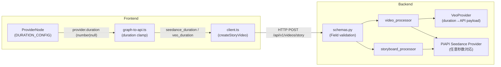
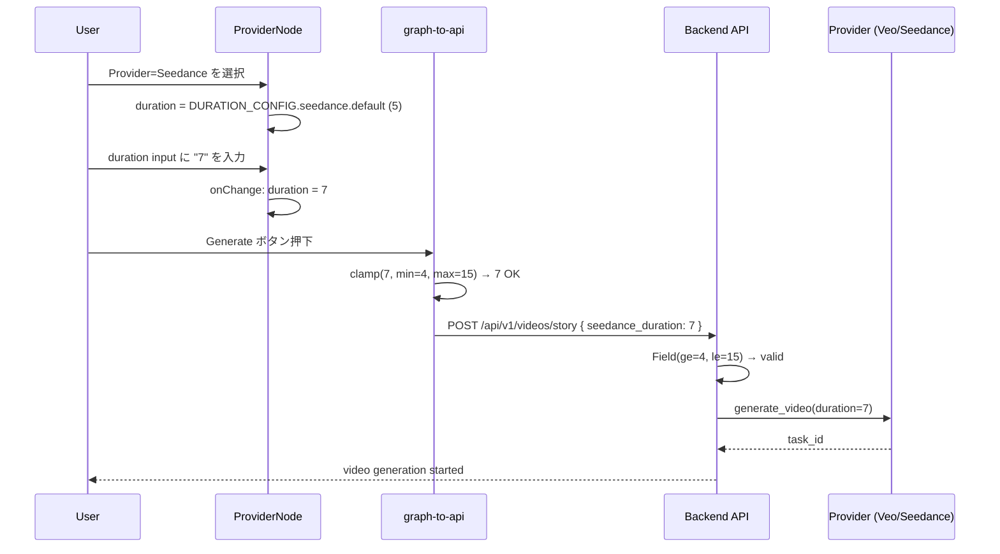

# Design Doc: 動画生成秒数 1 秒刻み指定対応 (Seedance + Veo)

**作成日**: 2026-05-18
**ステータス**: Draft
**作成者**: technical-designer

---

## 1. 合意チェックリスト

| 項目 | 内容 | 設計上の反映箇所 |
|------|------|----------------|
| スコープ | Seedance (4-15 秒) と Veo (4/6/8 秒離散) のみ変更 | §5 DURATION_CONFIG, §6 Frontend UI |
| 非スコープ | Runway/Kling/Hailuo/DomoAI の UI 変更なし | §5 DURATION_CONFIG (type:'fixed'/'preset') |
| 後方互換 | 既存 `kling_duration`/`seedance_duration` スキーマフィールド維持 | §7 Backend Schema, §11 後方互換性 |
| 制約 | 既存テスト 764+ 件が全 pass | §9 テスト戦略 |
| 検証 | HTML5 native validation + backend 422 | AC-8, §6.3 |
| Storyboard 経路 | Storyboard 経由の Veo は duration 送信せず (現状 8 秒固定維持) | §7.3, §10 エッジケース 6 |

---

## 2. 背景・課題

ProviderNode の duration 設定は現状すべて離散選択肢（dropdown）または非表示（固定値）である。

```ts
// 現状 (ProviderNode.tsx:47-54)
const DURATION_OPTIONS: Record<VideoProvider, number[]> = {
  runway: [],          // 5秒固定 (UI なし)
  veo: [],             // 自動 (UI なし)
  domoai: [],          // 固定 (UI なし)
  hailuo: [],          // 6秒固定 (UI なし)
  piapi_kling: [5, 10],
  seedance: [5, 10, 15],
};
```

API 仕様調査の結果、**Seedance 2.0 は 4-15 秒任意、Veo 3 は 4/6/8 秒の離散値指定**が可能であることが判明した。一方で `veo_provider.py` の `generate_video()` のコメントには「Veo 3 は 8 秒固定のため無視」と記載されており、duration 引数は受け取るが API ペイロードに含めていない。

ユーザーより「1 秒単位で設定したい」という要望が寄せられており、対応可能な Seedance (range) と Veo (preset) のみ変更する。

### 各 Provider API 仕様

| Provider | API duration 仕様 | 設計方針 |
|----------|-------------------|---------|
| Runway Gen-3 | 5 or 10 秒のみ | fixed (5 秒表示) |
| **Veo 3** | **4 / 6 / 8 秒 (離散)** | preset dropdown (4/6/8) |
| Kling 3.0 Omni | 5 or 10 秒のみ | preset dropdown |
| Hailuo | 6 秒固定 | fixed (6 秒表示) |
| DomoAI | 4-6 秒 固定範囲 | fixed (5 秒表示) |
| **Seedance 2.0** | **4-15 秒任意** | range (4-15 秒 input) |

---

## 3. 目標

### A. Seedance: number input (4-15 秒、1 秒刻み)
### B. Veo: preset dropdown (4 / 6 / 8 秒)
### C. 他 provider: 現状 dropdown / 固定表示 維持

---

## 4. 既存コードベース調査

### 4.1 実装ファイルマッピング

| 対象 | パス | 役割 |
|------|------|------|
| ProviderNode UI | `movie-maker/components/node-editor/nodes/ProviderNode.tsx` | `DURATION_OPTIONS` + dropdown 表示 |
| グラフ→API変換 | `movie-maker/components/node-editor/utils/graph-to-api.ts:335-342` | duration を `kling_duration`/`seedance_duration` にマップ |
| Frontend型 | `movie-maker/lib/types/node-editor.ts:77-84` | `ProviderNodeData.duration: number \| null` |
| API クライアント型 | `movie-maker/lib/api/client.ts:256-257` | `seedance_duration?: 5 \| 10 \| 15`, `kling_duration?: 5 \| 10` |
| Backend スキーマ | `movie-maker-api/app/videos/schemas.py:310-317` | `kling_duration: Literal[5,10]`, `seedance_duration: Literal[5,10,15]` |
| Veo provider | `movie-maker-api/app/external/veo_provider.py:158-170` | duration 引数あるが API ペイロードに不使用 |
| PiAPI Kling provider | `movie-maker-api/app/external/piapi_kling_provider.py:399-410` | duration 引数を payload に含める (Kling は 5/10 のみ) |
| Storyboard processor | `movie-maker-api/app/tasks/storyboard_processor.py:155-158` | `kling_duration or 5` をデフォルト使用 |

### 4.2 現状の duration フロー

```
ProviderNode (duration: number|null)
  └─ graph-to-api.ts:335-342
       ├─ provider=piapi_kling + (5|10)  → request.kling_duration
       ├─ provider=seedance + (5|10|15) → request.seedance_duration
       └─ 他 → 無視 (固定値/provider デフォルト)
              ↓
         /api/v1/videos/story (POST)
              ↓
         video_processor / storyboard_processor
              ↓
         provider.generate_video(duration=...)
```

### 4.3 既存 graph-to-api.ts の duration マップ (L335-342)

```ts
if (provider?.duration != null) {
  if (provider.provider === 'piapi_kling' && (provider.duration === 5 || provider.duration === 10)) {
    request.kling_duration = provider.duration;
  } else if (provider.provider === 'seedance' && (provider.duration === 5 || provider.duration === 10 || provider.duration === 15)) {
    request.seedance_duration = provider.duration;
  }
}
```

`seedance` の型ガードが `5 | 10 | 15` に限定されているため、任意値 (例: 7) は無視される。この箇所が主要な変更対象。

### 4.4 Veo provider の現状

`veo_provider.py:158-170` の `generate_video()` は `duration: int = 5` を引数に取るが、`GenerateVideosConfig` に `duration_seconds` を渡していない。Google GenAI SDK の `GenerateVideosConfig` は `duration_seconds` パラメータをサポートしているため、追加が必要。

### 4.5 類似機能検索結果

- `kling_duration` パターン: schemas.py L310、graph-to-api.ts L336、client.ts L256 の 3 箇所に一貫した実装済み
- 新規の `veo_duration` は同パターンで追加可能 (新実装)
- Seedance duration 拡張は既存実装の修正で対応

---

## 5. DURATION_CONFIG 設計

### 5.1 型定義

```ts
// movie-maker/components/node-editor/nodes/ProviderNode.tsx に追加

type DurationConfig =
  | { type: 'fixed'; value: number }
  | { type: 'preset'; presets: number[]; default: number }
  | { type: 'range'; min: number; max: number; step: number; default: number };

const DURATION_CONFIG: Record<VideoProvider, DurationConfig> = {
  runway:      { type: 'fixed',  value: 5 },
  veo:         { type: 'preset', presets: [4, 6, 8], default: 8 },  // Veo API デフォルトに準拠、最大尺で品質確認しやすい
  domoai:      { type: 'fixed',  value: 5 },
  hailuo:      { type: 'fixed',  value: 6 },
  piapi_kling: { type: 'preset', presets: [5, 10], default: 5 },
  seedance:    { type: 'range',  min: 4, max: 15, step: 1, default: 5 },  // 既存挙動互換、最低コスト
};
```

### 5.2 UI 切替ロジック

| `type` | レンダリング |
|--------|-----------|
| `'fixed'` | 「動画長: {value} 秒 (固定)」ラベル表示のみ。入力不可 |
| `'preset'` | `<select>` dropdown (Kling・Veo 共通) |
| `'range'` | `<input type="number" min max step>` + 「{min}-{max} 秒」ヒント表示 |

### 5.3 Provider 切替時の duration リセット

```ts
const handleProviderChange = (provider: VideoProvider) => {
  const config = DURATION_CONFIG[provider];
  const newDuration =
    config.type === 'fixed' ? null :
    config.type === 'preset' ? config.default :
    /* range */ config.default;
  updateNodeData({ provider, duration: newDuration });
};
```

`fixed` の場合は `null`（バックエンドで固定値を使う）、`preset`/`range` の場合は default をセット。

---

## 6. 設計詳細

### 6.1 アーキテクチャ図



### 6.2 データフロー図



### 6.3 Frontend UI 実装詳細

**ProviderNode.tsx の変更箇所:**

1. `DURATION_OPTIONS` (Record<VideoProvider, number[]>) を削除
2. `DurationConfig` 型と `DURATION_CONFIG` を追加 (§5.1 参照)
3. `handleProviderChange` の duration リセットロジックを §5.3 に変更
4. duration レンダリング部分を `type` に応じてスイッチ:

```ts
// 既存 (L151-166) の DURATION_OPTIONS[data.provider].length > 0 ガードを置換

const config = DURATION_CONFIG[data.provider];

{config.type === 'fixed' && (
  <div>
    <label className={nodeLabelClassName}>動画時間</label>
    <p className="text-xs text-gray-400">{config.value} 秒 (固定)</p>
  </div>
)}

{config.type === 'preset' && (
  <div>
    <label className={nodeLabelClassName}>動画時間</label>
    <select
      value={data.duration ?? config.default}
      onChange={(e) => updateNodeData({ duration: Number(e.target.value) })}
      className={nodeSelectClassName}
    >
      {config.presets.map((sec) => (
        <option key={sec} value={sec}>{sec} 秒</option>
      ))}
    </select>
  </div>
)}

{config.type === 'range' && (
  <div>
    <label className={nodeLabelClassName}>動画時間</label>
    <input
      type="number"
      min={config.min}
      max={config.max}
      step={config.step}
      value={data.duration ?? config.default}
      onChange={(e) => {
        const v = e.target.value === '' ? config.default : Number(e.target.value);
        updateNodeData({ duration: v });
      }}
      className={nodeSelectClassName}
    />
    <p className="text-[10px] text-gray-500 mt-1">{config.min}-{config.max} 秒</p>
  </div>
)}
```

**controlled/uncontrolled input 防止**: `value={data.duration ?? config.default}` により常に controlled。空文字入力時は `config.default` にフォールバック。

### 6.4 graph-to-api.ts の変更箇所 (L334-342)

```ts
// Before (Seedance が 5/10/15 のみ許可):
} else if (provider.provider === 'seedance' && (provider.duration === 5 || provider.duration === 10 || provider.duration === 15)) {
  request.seedance_duration = provider.duration;
}

// After (任意の整数 + frontend clamp):
} else if (provider.provider === 'seedance' && provider.duration != null) {
  const clamped = Math.min(15, Math.max(4, Math.round(provider.duration)));
  request.seedance_duration = clamped;
} else if (provider.provider === 'veo' && provider.duration != null) {
  // Veo は 4/6/8 の離散値のみ valid。preset dropdown のため通常はそのまま通過
  const veoPresets = [4, 6, 8];
  const validVeoDuration = veoPresets.includes(provider.duration) ? provider.duration : 8;
  // preset dropdown のため通常 else 分岐は到達しないが、defensive fallback として 8 秒採用
  request.veo_duration = validVeoDuration;
}
```

**注**: `request.veo_duration` を新フィールドとして `StoryVideoCreateRequest` 型定義に追加する必要がある。

### 6.5 client.ts の型変更

```ts
// 既存: seedance_duration?: 5 | 10 | 15;
// 変更後:
seedance_duration?: number;  // 4-15 の整数 (backend が ge=4, le=15 で検証)

// 新規追加:
veo_duration?: number;       // 4 | 6 | 8 の整数 (backend が ge=4, le=8 で検証)
```

---

## 7. Backend スキーマ変更

### 7.1 schemas.py の変更 (StoryVideoCreate クラス)

```python
# Before:
seedance_duration: Literal[5, 10, 15] | None = Field(
    default=None,
    description="Seedance 2.0 動画のduration（秒）。5、10、15のいずれか"
)

# After:
seedance_duration: int | None = Field(
    default=None,
    ge=4,
    le=15,
    description="Seedance 2.0 動画のduration（秒）。4-15 の整数"
)

# 新規追加:
veo_duration: int | None = Field(
    default=None,
    ge=4,
    le=8,
    description="Veo 3 動画のduration（秒）。4 / 6 / 8 のいずれか"
)

# seedance_duration の description は以下に更新:
seedance_duration: Optional[int] = Field(
    default=None,
    ge=4,
    le=15,
    description="Seedance 2.0 動画のduration（秒）。4-15 の整数 (VIP tier のみ 10 秒超利用可)"
)
# 注: VIP tier 制約は別 PR で再評価
```

provider 間クロスフィールドバリデーター (`validate_kling_only_features` 同様のパターン) を追加:

> **注記 (責務分散の方針)**: 既存 `validate_kling_only_features` は `kling_duration` の provider 整合性を内包しているが、本 PR では責務分散を許容し新規 `validate_provider_specific_durations` を追加する。将来的に統合する場合は別 PR で扱う。

```python
@model_validator(mode='after')
def validate_provider_specific_durations(self):
    if self.seedance_duration is not None and self.video_provider not in (None, VideoProvider.SEEDANCE):
        raise ValueError("seedance_duration is only valid for video_provider=seedance")
    if self.veo_duration is not None and self.video_provider not in (None, VideoProvider.VEO):
        raise ValueError("veo_duration is only valid for video_provider=veo")
    return self
```

### 7.2 Veo provider (veo_provider.py) の変更

`generate_video()` と `generate_video_from_text()` の `GenerateVideosConfig` に `duration_seconds` を追加:

```python
# Before (L217):
config=types.GenerateVideosConfig(
    aspect_ratio=aspect_ratio,
    number_of_videos=1,
),

# After:
config=types.GenerateVideosConfig(
    aspect_ratio=aspect_ratio,
    number_of_videos=1,
    duration_seconds=duration,  # 4 / 6 / 8 の整数
),
```

同様に `generate_video_from_text()` (L119-123) も更新。

**注意**: `veo_provider.py` のコメント「Veo 3 は 8 秒固定のため無視」も削除する。

**SDK 互換性対策**: `GenerateVideosConfig` に `duration_seconds` 引数が存在するか `hasattr` で確認し、存在しない場合は warn ログ + duration 引数無視で続行 (fail safely):

```python
kwargs = {
    "aspect_ratio": aspect_ratio,
    "number_of_videos": 1,
}
if hasattr(types.GenerateVideosConfig, "duration_seconds"):
    kwargs["duration_seconds"] = duration
else:
    logger.warning("GenerateVideosConfig does not support duration_seconds; ignoring duration")

config = types.GenerateVideosConfig(**kwargs)
```

`requirements.txt` の `google-genai` バージョンを Phase 1 着手前に確認すること (§13 参照)。

### 7.3 storyboard_processor.py の変更

**方針 (b): Storyboard 経路で Veo は duration 送信せず (現状 8 秒固定維持)**

`storyboard_processor.py:154-158` の `generate_kwargs` 構築部分で、`provider == 'veo'` 時に `duration=None` を渡す:

```python
# 変更前:
generate_kwargs["duration"] = kling_duration or 5

# 変更後:
# Veo は duration を未指定 (8 秒固定維持)、それ以外は kling_duration or 5
if hasattr(provider, 'provider_name') and provider.provider_name == 'veo':
    generate_kwargs["duration"] = None  # Veo は default (8 秒) に任せる
else:
    generate_kwargs["duration"] = kling_duration or 5
```

これにより:
- storyboard 経由の Veo 生成は従来どおり 8 秒固定
- storyboard リグレッションリスクを最小化
- Node Editor 経由の Veo 生成のみ duration 指定が有効

---

## 8. 変更影響マップ

```yaml
Change Target: DURATION_OPTIONS → DURATION_CONFIG (ProviderNode.tsx)
Direct Impact:
  - movie-maker/components/node-editor/nodes/ProviderNode.tsx (UI 変更)
  - movie-maker/components/node-editor/utils/graph-to-api.ts (duration マッピング)
  - movie-maker/lib/api/client.ts (型定義: seedance_duration, veo_duration 追加)
  - movie-maker-api/app/videos/schemas.py (Field 制約変更 + veo_duration 追加 + validator 追加)
  - movie-maker-api/app/external/veo_provider.py (duration API ペイロード追加)
  - movie-maker-api/app/tasks/storyboard_processor.py (Veo 時 duration=None)
Indirect Impact:
  - movie-maker-api/app/tasks/video_processor.py (veo_duration を generate_video に渡す)
No Ripple Effect:
  - movie-maker-api/app/external/piapi_kling_provider.py (Kling は変更なし)
  - movie-maker-api/app/external/runway_provider.py (固定 5 秒、変更なし)
  - movie-maker-api/app/external/hailuo_provider.py (固定 6 秒、変更なし)
  - Supabase スキーマ (DB カラム変更不要、duration は API パラメータのみ)
  - 既存の生成済み動画レコード (影響なし)
```

### インターフェース変更マトリクス

| 既存操作 | 新操作 | 変換必要 | アダプター | 互換方法 |
|---------|--------|---------|-----------|---------|
| `seedance_duration: Literal[5,10,15]` | `seedance_duration: int (ge=4, le=15)` | 必要 | 不要 | Literal → int; 既存値 (5/10/15) は引き続き valid |
| `veo_duration` なし | `veo_duration: int (ge=4, le=8)` | 新規 | 不要 | Optional フィールド、省略可 |
| Kling: `type='preset'` UI | 変更なし | なし | 不要 | - |
| Veo: 非表示 (固定) | `type='preset'` dropdown (4/6/8) | UI 変更 | 不要 | 新規表示のみ |
| Seedance: dropdown | `type='range'` number input | UI 変更 | 不要 | 後方互換 (既存値は range 内に収まる) |

---

## 9. 統合ポイントマップ

```yaml
統合ポイント 1:
  既存コンポーネント: ProviderNode.tsx / handleProviderChange
  統合方法: DURATION_CONFIG に基づく duration リセット値変更
  影響レベル: Medium (データ変更)
  必要なテスト: Provider 切替時 duration がデフォルト値に reset されること

統合ポイント 2:
  既存コンポーネント: graph-to-api.ts / graphToStoryVideoCreate (L334-342)
  統合方法: seedance の型ガード削除 + veo_duration マッピング追加
  影響レベル: High (リクエスト内容の変化)
  必要なテスト: Seedance 任意値・Veo 離散値が正しく request に含まれること

統合ポイント 3:
  既存コンポーネント: schemas.py / StoryVideoCreate
  統合方法: Field 制約の変更 + veo_duration 追加 + provider cross-validator 追加
  影響レベル: Medium (validation ルール変更)
  必要なテスト: ge=4,le=15 の境界値テスト; ge=4,le=8 の境界値テスト; cross-validator テスト

統合ポイント 4:
  既存コンポーネント: veo_provider.py / generate_video
  統合方法: GenerateVideosConfig に duration_seconds 追加 (hasattr guard 付き)
  影響レベル: High (外部 API ペイロード変化)
  必要なテスト: Veo API 呼び出し時 duration_seconds が正しい値で渡されること

統合ポイント 5:
  既存コンポーネント: storyboard_processor.py / generate_video_with_v2v_fallback
  統合方法: provider == 'veo' 時 duration=None 渡しに変更
  影響レベル: Medium (Veo storyboard の挙動変更)
  必要なテスト: Veo storyboard が duration=None で呼ばれること
```

### 統合境界コントラクト

```yaml
Boundary: frontend → backend (POST /api/v1/videos/story)
  Input: StoryVideoCreate { ..., seedance_duration?: number (4-15), veo_duration?: number (4|6|8) }
  Output: StoryVideoResponse (同期)、video_id を返す
  On Error: 422 Unprocessable Entity (Pydantic validation failure)

Boundary: backend → VeoProvider.generate_video()
  Input: duration: int | None (4/6/8 または None)
  Output: task_id: str (非同期、ポーリング用)
  On Error: VideoProviderError → 500 Internal Server Error

Boundary: ProviderNode → graph-to-api (内部)
  Input: provider.duration: number | null
  Output: request.seedance_duration または request.veo_duration
  On Error: clamp/preset-check により不正値は自動補正 (フロントエンド防御)
```

---

## 10. エッジケース

1. **Provider 切替時の duration 値が新 provider の範囲外**
   - 対処: `handleProviderChange` で `config.default` に強制リセット
   - 例: Kling (duration=10) → Seedance (range 4-15) → default=5 にリセット

2. **number input で空文字入力**
   - 対処: `onChange` で空文字検出時は `config.default` にフォールバック
   - controlled input 維持 (uncontrolled warning 防止)

3. **backend で範囲外値受領 (例: seedance_duration=3)**
   - 対処: Pydantic `ge=4, le=15` により 422 を返す
   - frontend clamp が先行するため通常は到達しない

4. **controlled/uncontrolled input warning 防止**
   - `value={data.duration ?? config.default}` により初期値を保証
   - `null` が来た場合でも `config.default` で安全に補完

5. **既存生成済動画 (DB 保存済) への影響なし**
   - duration はリクエスト時のパラメータであり DB には保存しない
   - 既存レコードには影響なし

6. **Storyboard 経由の Seedance/Veo 生成**
   - storyboard_processor.py は `kling_duration` のみを引数に持つ
   - Seedance での storyboard は引き続き `duration=5` デフォルト
   - Veo での storyboard: `provider == 'veo'` 時 `duration=None` を渡し、API デフォルト (8 秒) を維持 (§7.3 参照)

7. **保存済グラフ再読込時の duration が新範囲外の場合**
   - 旧 Seedance 保存値が 3 (旧 min) の場合、新 min=4 を下回る
   - ProviderNode の `useEffect` で `data.duration` が `config.min`/`config.max` 外なら clamp + `updateNodeData` を発火
   - 例: persisted duration=3 でロード → input value=4 に正規化される (テスト: §12 参照)

8. **TTS dialogue 長さと video duration の整合性**
   - ユーザー責任とし、auto-truncate しない
   - dialogue 長 < duration なら video 末尾が無音/フリーズフレームになる旨を仕様として記録

---

## 11. 後方互換性

- **既存 `kling_duration` フィールド**: 変更なし。`Literal[5, 10]` 維持
- **既存 `seedance_duration` 値 (5/10/15)**: `ge=4, le=15` の範囲内なので引き続き valid
- **frontend dropdown → input 変更**: UI の改善であり破壊変更ではない
- **`veo_duration` フィールド**: Optional 追加のため既存リクエストへの影響なし
- **Veo provider の duration**: 従来は無視されていたが今後は API に渡される。既存の Veo 生成では `duration=null` または未指定の場合はデフォルト (8) が使われる

---

## 12. テスト戦略

### 12.1 Frontend テスト (Vitest)

**対象ファイル**: `movie-maker/components/node-editor/nodes/ProviderNode.test.tsx` (新規)

| テストケース | 検証内容 |
|------------|---------|
| Seedance 選択時 | `<input type="number" min="4" max="15">` が表示される |
| Veo 選択時 | `<select>` が表示され、4/6/8 の option がある |
| Kling 選択時 | `<select>` が表示され、5/10 の option がある |
| Runway 選択時 | 「5 秒 (固定)」テキストが表示される |
| Provider 切替 (Kling→Seedance) | duration が 5 (default) にリセットされる |
| Seedance number input 変更 | `updateNodeData({ duration: 7 })` が呼ばれる |
| 空文字入力 | duration が `config.default` (5) になる |
| Veo 選択時 | dropdown の default value が 8 である |
| persisted duration=3 でロード | input value=4 に正規化される (useEffect clamp) |
| Seedance に '1' → '11' と段階入力 | state は最終的に 11 になる (transient 値は保持) |

**対象ファイル**: `graph-to-api.test.ts` (既存/更新)

| テストケース | 検証内容 |
|------------|---------|
| Seedance + duration=7 | `request.seedance_duration === 7` |
| Seedance + duration=4 (min) | `request.seedance_duration === 4` |
| Seedance + duration=15 (max) | `request.seedance_duration === 15` |
| Veo + duration=6 | `request.veo_duration === 6` |
| Veo + duration=4 (min) | `request.veo_duration === 4` |
| Veo + duration=8 (max) | `request.veo_duration === 8` |
| Kling + duration=10 | `request.kling_duration === 10` (変更なし確認) |
| persisted duration=20 でロード | input value=15 に正規化される |

### 12.2 Backend テスト (pytest)

**対象ファイル**: `movie-maker-api/tests/external/test_veo_provider.py` (新規)

| テストケース | 検証内容 |
|------------|---------|
| duration=4 で generate_video 呼び出し | `GenerateVideosConfig(duration_seconds=4)` が渡される |
| duration=6 で generate_video 呼び出し | `GenerateVideosConfig(duration_seconds=6)` が渡される |
| duration=8 で generate_video 呼び出し | `GenerateVideosConfig(duration_seconds=8)` が渡される |

**対象ファイル**: `movie-maker-api/tests/external/test_piapi_seedance_provider.py` (新規)

| テストケース | 検証内容 |
|------------|---------|
| duration=7 で generate_video 呼び出し | API ペイロードの `duration === 7` を確認 |
| duration=4 (min) | ペイロード確認 |
| duration=15 (max) | ペイロード確認 |

**スキーマバリデーションテスト**

| テストケース | 検証内容 |
|------------|---------|
| `seedance_duration=7` | valid (ge=4, le=15) |
| `seedance_duration=3` | 422 (lt ge=4) |
| `seedance_duration=16` | 422 (gt le=15) |
| `veo_duration=6` | valid |
| `veo_duration=3` | 422 |
| `veo_duration=9` | 422 |
| `seedance_duration=5, video_provider=runway` | 422 (cross-validator) |
| `veo_duration=6, video_provider=piapi_kling` | 422 (cross-validator) |

**storyboard_processor テスト**

| テストケース | 検証内容 |
|------------|---------|
| provider=veo で storyboard 生成 | generate_video が `duration=None` で呼ばれる |
| provider=seedance で storyboard 生成 | generate_video が `duration=5` で呼ばれる (変更なし) |

### 12.3 回帰確認

- 既存テスト 764+ 件の全件 pass を確認
- 既存失敗 3 件 (`test_text_to_image.py` × 2、`test_service.py` × 1) は本変更と無関係のため除外

---

## 13. 実装フェーズ (垂直スライス方式、TDD 順序)

```mermaid
gantt
  title 実装順序
  dateFormat X
  axisFormat %s

  section Phase 1: Backend スキーマ
  google-genai バージョン確認: 0, 5m
  Pydantic schema test 作成 (RED): 5m, 15m
  schemas.py 更新 (GREEN): 20m, 15m
  Veo provider test 作成 (RED): 35m, 10m
  veo_provider.py 更新 (GREEN): 45m, 15m
  storyboard_processor test (RED): 60m, 10m
  storyboard_processor.py 更新 (GREEN): 70m, 15m

  section Phase 2: Frontend 型・変換
  graph-to-api test 作成 (RED): 0, 15m
  client.ts 型更新: 0, 10m
  graph-to-api.ts 変換更新 (GREEN): 15m, 20m

  section Phase 3: ProviderNode UI
  ProviderNode test 作成 (RED): 0, 20m
  DURATION_CONFIG 定義: 0, 15m
  UI スイッチング実装 (GREEN): 15m, 30m

  section Phase 4: QA
  全テスト pass 確認: 0, 15m
```

**実装方針**: 垂直スライス。各フェーズで RED → GREEN の TDD サイクルを守り、AC を早期検証する。

---

## 14. Acceptance Criteria

### AC-1: Seedance 選択時 number input 表示

- **Given**: Node Editor で Provider=Seedance が選択されている
- **When**: ProviderNode の動画時間エリアを確認する
- **Then**: `<input type="number" min="4" max="15" step="1">` が表示される

### AC-2: Veo 選択時 dropdown 表示

- **Given**: Node Editor で Provider=Veo が選択されている
- **When**: ProviderNode の動画時間エリアを確認する
- **Then**: `<select>` が表示され、選択肢として "4 秒"・"6 秒"・"8 秒" がある (Kling と同パターン)

### AC-3: Kling 選択時 dropdown 表示 (現状維持)

- **Given**: Node Editor で Provider=Kling が選択されている
- **When**: ProviderNode の動画時間エリアを確認する
- **Then**: `<select>` が表示され、選択肢として "5 秒" と "10 秒" がある

### AC-4: Runway 選択時 固定表示

- **Given**: Node Editor で Provider=Runway が選択されている
- **When**: ProviderNode の動画時間エリアを確認する
- **Then**: 「5 秒 (固定)」というテキスト表示のみ (input/select なし)

### AC-5: Seedance で任意秒数指定

- **Given**: Provider=Seedance、duration input に "7" を入力する
- **When**: Generate ボタンを押して動画生成を実行する
- **Then**: Backend が `seedance_duration=7` を含むリクエストを受信し、7 秒の動画が生成される

### AC-6: Veo で duration=6 指定

- **Given**: Provider=Veo、dropdown で "6 秒" を選択する
- **When**: Generate ボタンを押して動画生成を実行する
- **Then**: Backend が `veo_duration=6` を受信し、Veo API 呼び出し時に `duration_seconds=6` が渡される

### AC-7: Provider 切替時 duration リセット

- **Given**: Provider=Kling、duration=10 が設定されている
- **When**: Provider を Seedance に変更する
- **Then**: duration が Seedance の default 値 (5) にリセットされる

### AC-8: 範囲外値の rejection

- **Given**: Provider=Seedance
- **When**: number input に "16" (max=15 超過) を入力する
- **Then**: HTML5 native validation (`max="15"`) によってブラウザがインプットを拒否する。または backend に送られた場合は 422 エラーが返る

### AC-9: 既存テスト全件 pass (回帰なし)

- **Given**: 変更前に存在する全テスト 764+ 件
- **When**: 本変更適用後にテストスイートを実行する
- **Then**: 既存 3 件の既知失敗を除き、全件 pass

---

## 15. 想定工数

| 作業 | 推定時間 |
|------|---------|
| Backend スキーマ変更 (schemas.py + validator) | 15 分 |
| Veo provider duration 対応 (hasattr guard 含む) | 30 分 |
| storyboard_processor.py 変更 | 10 分 |
| Frontend 型定義・client.ts 更新 | 10 分 |
| graph-to-api.ts 変更 | 15 分 |
| ProviderNode.tsx DURATION_CONFIG + UI | 20 分 |
| テスト作成 (Frontend + Backend + validator + normalize) | 45 分 |
| 動作確認・デバッグ | 20 分 |
| **合計** | **~2.75 時間 (約 3 時間)** |

---

## 16. 未解決項目

| # | 項目 | 優先度 | 備考 |
|---|------|--------|------|
| 1 | Veo 3 API `duration_seconds` の対応バージョン確認 | High | Google GenAI SDK のバージョンによっては未サポートの可能性あり。Phase 1 着手前に `requirements.txt` の `google-genai` バージョン確認 (§7.2 hasattr guard で fail safely 対応済) |
| 2 | Seedance 2.0 の API での duration パラメータ名 | Medium | PiAPI Seedance のペイロード仕様を要確認 (現在の piapi_kling_provider.py のパターンから類推) |
| 3 | 範囲外入力時の挙動: clamp vs エラー | Low | 現設計は frontend clamp + backend 422。UX として clamp が望ましい場合は frontend のみで処理可 |
| 4 | Storyboard 自動生成時の Seedance デフォルト duration | Low | 現状 5 秒デフォルトを維持。将来的に storyboard UI に duration 設定が必要な場合は別タスク |
| 5 | Veo の 4/6/8 以外の値が veo_duration に来た場合の挙動 | Low | graph-to-api.ts で preset-check により 8 にフォールバック。backend Field ge=4, le=8 でも 422 される |

---

## 17. 前提 ADR

- 本変更は既存 VideoProviderInterface パターンに従った拡張であり、新たな ADR は不要
- Veo の `duration_seconds` ペイロード追加は既存 `GenerateVideosConfig` 引数の活用 (新規外部 API 統合ではない)。新 provider 追加でないため ADR 不要と判断。documentation-criteria 条件 #4 に該当しない

---

## 18. 変更履歴

| 日付 | 内容 |
|------|------|
| 2026-05-18 | 初版作成 |
| 2026-05-18 | レビュー指摘事項反映 (I001-I006 重大、I007-I012 軽微): Veo を preset (4/6/8) に変更、Seedance を 4-15 に修正、cross-validator 追加、storyboard Veo duration=None 方針確定、工数・テスト更新 |
| 2026-05-18 | 再レビュー指摘事項反映 (N001-N005): §7.3 storyboard 擬似コード統一 (generate_kwargs + provider_name 参照)、§7.1 validator 責務分散注記追加、seedance_duration description に VIP tier 注記追加、Veo 工数 20→30 分・合計 2.5→2.75 時間、graph-to-api.ts 変数名 nearest→validVeoDuration |

---

## References

- Seedance 2.0 via PiAPI: https://piapi.ai/docs (duration パラメータ仕様)
- Google GenAI SDK GenerateVideosConfig: https://ai.google.dev/api/generate-content#v1beta.VideoGenerationConfig
- HTML5 input[type=number] min/max/step: https://developer.mozilla.org/en-US/docs/Web/HTML/Element/input/number
