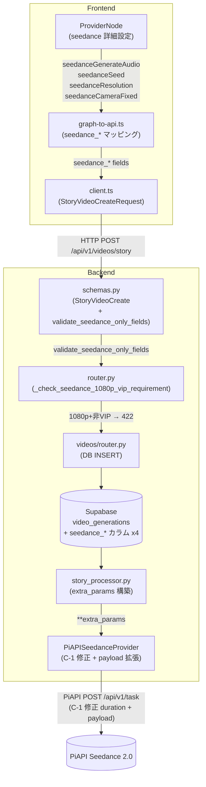
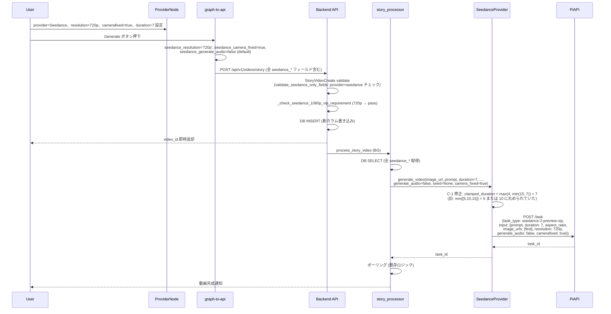

# Design Doc: Seedance 2.0 詳細パラメータ拡張 (BGM/seed/resolution/camerafixed)

**作成日**: 2026-05-18
**ステータス**: Draft
**作成者**: technical-designer
**関連 Doc**: `docs/plans/2026-05-18_duration-1s-step.md` (Seedance duration 範囲拡張、本 Doc の前提)

---

## 1. 合意チェックリスト

| 項目 | 内容 | 設計上の反映箇所 |
|------|------|----------------|
| スコープ | Seedance 2.0 の詳細パラメータ 4 種 (generate_audio / seed / resolution / camerafixed) UI 制御 + C-1 VALID_DURATIONS バグ修正 | §3 目標, §6 設計詳細 |
| **非スコープ** | **last_frame_url / SeedanceEndFrameNode / end_frame 機能 — 別 PR** | §3 非スコープ |
| **非スコープ** | **Storyboard 経由での新パラメータ伝搬 — 別 PR** (`storyboard_processor.py` への追加は別 PR で対応) | §3 非スコープ |
| 非スコープ | watermark / video_references / audio_references / omni_reference の追加対応 | §3 非スコープ |
| 非スコープ | 既存 Seedance 既定値 (env: `PIAPI_SEEDANCE_RESOLUTION=720p`) の動作変更 — env はフォールバック値として残置 | §6.4 Provider 実装 |
| 後方互換 | 既存 `seedance_duration`/`seedance_mode` 維持。新パラメータは全て Optional | §11 後方互換性 |
| 制約 | 1080p 指定時は VIP suffix (`-vip`) 必須。非 VIP では UI **目立つ警告バナー** + backend **HTTPException 422** で reject | §6.2, §6.7, §11 エッジケース 1 |
| バグ修正 | C-1: `VALID_DURATIONS` による誤丸め (duration を 5/10/15 に丸める残骸) を除去し 4-15 範囲クランプに変更 | §6.7 |
| 検証 | 新規ユニット/統合テスト 15+ 件 + 既存全件 pass | §13 テスト戦略 |
| 既存ドラフトの NULL カラム互換 | 既存 `video_generations` 行は新カラム NULL のまま (破壊なし) | §11, §6.5 Migration |

---

## 2. 背景・課題

Seedance 2.0 API には多くのパラメータが存在するが、現状 UI から制御できるのは prompt / duration / aspect_ratio / mode (Pro/Fast) のみである。以下が未制御:

| パラメータ | 現状 | 期待 |
|----------|------|-----|
| `generate_audio` (BGM 自動生成) | API デフォルト依存 (ON?) | **UI で ON/OFF**、default OFF (BGMNode との競合回避) |
| `seed` (再現性) | 未対応 | **UI で指定**、default 空 (=ランダム) |
| `resolution` (解像度) | env 固定 (`PIAPI_SEEDANCE_RESOLUTION=720p`) | **UI で 480p/720p/1080p 切替** |
| `camerafixed` (カメラ固定) | 未対応 | **UI で ON/OFF**、default OFF |

加えて、既存 `piapi_seedance_provider.py` に以下のバグが存在する:

| バグ | 現状 | 修正内容 |
|-----|------|---------|
| **C-1: VALID_DURATIONS 誤丸め** | `VALID_DURATIONS = [5, 10, 15]` で duration を 5/10/15 に丸めていた (前提 Doc で duration 1 秒刻みに変更したにもかかわらず残骸) | `DURATION_MIN=4, DURATION_MAX=15` でクランプし、指定値を透過送信 |

### 既存実装の制約箇所 (`piapi_seedance_provider.py`)

```python
# L52-58: コンストラクタで env からのみ resolution 取得
self.resolution: str = settings.PIAPI_SEEDANCE_RESOLUTION

# L128-141: payload 構築 - generate_audio / seed / camerafixed 未送信
input_payload: dict = {
    "prompt": prompt[:4000],
    "duration": clamped_duration,  # ← VALID_DURATIONS バグ箇所
    "aspect_ratio": aspect_ratio,
    "image_urls": [image_url],
}
if task_type.endswith("-vip"):
    input_payload["resolution"] = self.resolution
# audio フィールドは Phase 1 では送信しない (← 本 Doc で解禁)
```

---

## 3. 目標

### A. generate_audio (BGM 自動生成 ON/OFF)
- ProviderNode (seedance 選択時) に「BGM 自動生成」チェックボックス追加
- default: OFF (BGMNode との競合回避、ユーザー期待値に沿う)
- request payload `input.generate_audio: bool` を常に送信 (None ではなく `False` がデフォルト値)

### B. seed (再現性)
- ProviderNode に「シード値 (任意)」number input 追加
- default: 空 (=ランダム)
- 同じ seed + 同じ prompt + 同じ duration で同じ動画再生成 (Seedance 仕様)

### C. resolution (UI 切替)
- ProviderNode に「解像度」dropdown (480p / 720p / 1080p)
- default: env 値 (`PIAPI_SEEDANCE_RESOLUTION`、通常 720p)
- **1080p は VIP suffix (`-vip`) 必須**。UI に目立つ警告バナー表示 + backend 非 VIP env の場合 **HTTPException 422 で reject**

### D. camerafixed (カメラ固定)
- ProviderNode に「カメラ固定」チェックボックス
- default: OFF
- 商品撮影や静物動画で有用

### C-1 バグ修正: VALID_DURATIONS 除去
- `generate_video` / `generate_video_from_text` 双方の `clamped_duration` 計算を修正
- 旧: `min(VALID_DURATIONS, key=lambda d: abs(d - duration))` で 5/10/15 丸め
- 新: `max(DURATION_MIN, min(DURATION_MAX, int(duration)))` で 4-15 範囲クランプ、指定値を透過送信

### 非スコープ

- `last_frame_url` / `SeedanceEndFrameNode` / `first_last_frames` モード — **別 PR**
- Storyboard 経由 (`storyboard_processor.py`) の新パラメータ伝搬 — **別 PR**
- `watermark` パラメータ — 本 Doc 範囲外
- `video_references` / `audio_references` / `omni_reference` — 本 Doc 範囲外
- 既存 `seedance_mode` / `seedance_duration` フィールドの仕様変更 — 別 Doc

---

## 4. 既存コードベース調査

### 4.1 実装ファイルマッピング

| 対象 | パス | 役割 |
|------|------|------|
| Seedance Provider | `movie-maker-api/app/external/piapi_seedance_provider.py` | payload 構築 (L128-141, L190-205)、`_resolve_task_type` (L63-83)、**C-1 バグ箇所** |
| Seedance Provider env | `movie-maker-api/app/core/config.py:51-52` | `PIAPI_SEEDANCE_TASK_TYPE` / `PIAPI_SEEDANCE_RESOLUTION` |
| Story Processor | `movie-maker-api/app/tasks/story_processor.py:115-205` | DB → extra_params → `provider.generate_video()` |
| Backend Schema | `movie-maker-api/app/videos/schemas.py:314-353` | `StoryVideoCreate` の seedance フィールド + cross-validator |
| Backend Router | `movie-maker-api/app/videos/router.py` | DB INSERT に新カラム追加が必要 |
| Frontend 型定義 | `movie-maker/lib/types/node-editor.ts:77-86` | `ProviderNodeData` 拡張 |
| ProviderNode UI | `movie-maker/components/node-editor/nodes/ProviderNode.tsx` | seedance 詳細設定セクション追加 |
| Graph→API 変換 | `movie-maker/components/node-editor/utils/graph-to-api.ts:334-351` | 新フィールドマッピング |
| API クライアント型 | `movie-maker/lib/api/client.ts:240-260` | `StoryVideoCreateRequest` 拡張 |

### 4.2 既存 Seedance Provider の現状フロー

```
graph-to-api.ts
  └── request.seedance_duration / seedance_mode 設定
       ↓
POST /api/v1/videos/story
  ↓
StoryVideoCreate スキーマ検証 (schemas.py)
  ↓
DB INSERT into video_generations (router.py)
  ↓
process_story_video (story_processor.py)
  ├── DB SELECT
  ├── extra_params = {"mode": seedance_mode}
  └── provider.generate_video(
        image_url, prompt,
        duration=seedance_duration,  ← VALID_DURATIONS で 5/10/15 丸めバグ
        aspect_ratio,
        camera_work,  # Seedance は無視
        **extra_params,
      )
        ↓
PiAPISeedanceProvider.generate_video
  └── input_payload = {prompt, duration, aspect_ratio, image_urls}
       └── if VIP: input_payload["resolution"] = env
```

### 4.3 類似機能検索結果

- **検索**: "generate_audio", "seed", "camerafixed" を `movie-maker-api/app/` 配下で grep
- **結果**: いずれも既存実装なし → 新規実装
- **C-1 調査**: `VALID_DURATIONS = [5, 10, 15]` 定数が `piapi_seedance_provider.py` に存在。前提 Doc での duration 拡張時に除去されなかった技術的債務。
- **結論**: 新規実装。C-1 バグ修正と合わせて実施。

### 4.4 既存 Frontend 折りたたみセクションパターン

ProviderNode.tsx には `data.provider === 'seedance'` 時に「速度モード」を表示する条件分岐 (L220-232) が既にある。同じパターンで「Seedance 詳細設定」セクション (折りたたみ) を追加する。

---

## 5. 採用案 (代替案比較)

### 5.1 案 A: 単一 ProviderNode に折りたたみセクション追加 (推奨)

**概要**: Seedance 選択時のみ ProviderNode に「詳細設定」折りたたみセクションを追加し、generate_audio / seed / resolution / camerafixed の 4 つを集約。

**メリット**:
- 既存 ProviderNode の `data.provider === 'seedance'` 分岐パターンを踏襲
- 折りたたみで普段の UI を圧迫しない
- 4 つの設定がノード接続不要 (UI シンプル)

**デメリット**:
- ProviderNode が肥大化 (現状約 280 行 → +60 行程度)

### 5.2 案 B: 全パラメータを独立ノード化

**概要**: SeedanceAudioNode / SeedanceSeedNode / SeedanceResolutionNode / SeedanceCameraFixedNode の 4 ノードに分割。

**メリット**:
- 単一責任原則 (各ノード 1 設定)
- グラフでパラメータ流入が可視化

**デメリット**:
- 4 ノード分の HANDLE_IDS / 接続/バリデーション コードが必要
- ユーザー認知負荷が高い (ノード数増加でキャンバスが煩雑)
- 既存 `seedanceMode` (ProviderNode 内蔵) との一貫性なし

### 5.3 案 C: Settings サイドパネル開設

**概要**: ProviderNode をクリックすると右サイドパネルが開き、詳細設定を表示。

**メリット**:
- ノード本体は小型維持
- 多数のパラメータが扱いやすい

**デメリット**:
- 大規模 UI 変更 (新規サイドパネルコンポーネント必要)
- 工数が見積もり 3 倍 (5-8h 増)
- 既存パターンと整合性なし

### 5.4 比較マトリクス

| 評価軸 | 案 A (折りたたみ) | 案 B (独立ノード) | 案 C (サイドパネル) |
|--------|-----------------|-----------------|------------------|
| 実装工数 | 2-2.5h | 4-5h | 5-7h |
| 既存パターン整合性 | High (seedanceMode と同じ) | Low | Low (新パターン) |
| ユーザー認知負荷 | Low | High (4 ノード) | Medium |
| UI スペース効率 | High (折りたたみ) | Low | High |
| 拡張性 (watermark 追加時) | Medium | High | High |
| 保守性 | High | Medium | Low |

**採用**: **案 A**。既存 ProviderNode の seedance 分岐パターンに沿う実装が最も整合性が高く、工数も最小。

将来 watermark など追加パラメータが増えた場合に案 C へ移行する余地は残す。

---

## 6. 設計詳細

### 6.1 Frontend 型定義拡張 (`lib/types/node-editor.ts`)

```ts
// ProviderNodeData 拡張 (L77-86 に追加)
export interface ProviderNodeData extends BaseNodeData {
  type: 'provider';
  provider: VideoProvider;
  aspectRatio: '9:16' | '16:9';
  duration: number | null;
  seedanceMode?: 'pro' | 'fast';
  // === Seedance 詳細パラメータ (本 Doc) ===
  seedanceGenerateAudio?: boolean;  // default: false
  seedanceSeed?: number | null;     // default: null (=ランダム)
  seedanceResolution?: '480p' | '720p' | '1080p';  // default: '720p'
  seedanceCameraFixed?: boolean;    // default: false
}
```

### 6.2 ProviderNode UI 実装 (折りたたみセクション)

```tsx
// ProviderNode.tsx に追加 (既存 seedanceMode 直後、L232 以降)

const [isSeedanceAdvancedOpen, setIsSeedanceAdvancedOpen] = useState(false);

// 1080p 警告: UI では固定文言で表示
// Backend でも非 VIP env + 1080p 指定時に 422 を返す (§6.7 参照)
const showVipWarning = data.seedanceResolution === '1080p';

{data.provider === 'seedance' && (
  <div className="mt-3 border-t border-[#2a2a2a] pt-3">
    <button
      onClick={() => setIsSeedanceAdvancedOpen(!isSeedanceAdvancedOpen)}
      className="flex items-center gap-1 text-[10px] text-gray-400 hover:text-white"
    >
      {isSeedanceAdvancedOpen ? <ChevronDown /> : <ChevronRight />}
      Seedance 詳細設定
    </button>

    {isSeedanceAdvancedOpen && (
      <div className="mt-2 space-y-3">
        {/* A. BGM 自動生成 */}
        <label className="flex items-center gap-2 text-xs">
          <input
            type="checkbox"
            checked={data.seedanceGenerateAudio ?? false}
            onChange={(e) => updateNodeData({ seedanceGenerateAudio: e.target.checked })}
          />
          BGM 自動生成 (Seedance による音声生成)
        </label>

        {/* B. シード値 */}
        <div>
          <label className={nodeLabelClassName}>シード値 (任意、再現性)</label>
          <input
            type="number"
            min={0}
            max={2147483647}
            value={data.seedanceSeed ?? ''}
            placeholder="未指定=ランダム"
            onChange={(e) => {
              const v = e.target.value === '' ? null : Number(e.target.value);
              updateNodeData({ seedanceSeed: v });
            }}
            className={nodeSelectClassName}
          />
        </div>

        {/* C. 解像度 */}
        <div>
          <label className={nodeLabelClassName}>解像度</label>
          <select
            value={data.seedanceResolution ?? '720p'}
            onChange={(e) => updateNodeData({
              seedanceResolution: e.target.value as '480p' | '720p' | '1080p'
            })}
            className={nodeSelectClassName}
          >
            <option value="480p">480p</option>
            <option value="720p">720p (推奨)</option>
            <option value="1080p">1080p (VIP プラン必須)</option>
          </select>
          {showVipWarning && (
            <div className="mt-1 rounded px-2 py-1 text-xs font-medium bg-yellow-500/20 text-yellow-300 border border-yellow-500/30">
              1080p は Seedance VIP プラン契約が必要です。非 VIP 環境ではリクエストが拒否されます。
            </div>
          )}
        </div>

        {/* D. カメラ固定 */}
        <label className="flex items-center gap-2 text-xs">
          <input
            type="checkbox"
            checked={data.seedanceCameraFixed ?? false}
            onChange={(e) => updateNodeData({ seedanceCameraFixed: e.target.checked })}
          />
          カメラ固定 (商品撮影/静物向け)
        </label>
      </div>
    )}
  </div>
)}
```

### 6.3 graph-to-api.ts の変更

```ts
// L334-351 周辺に追加

// Seedance 詳細パラメータマッピング
if (provider?.provider === 'seedance') {
  // generate_audio: 常に送信 (default false)
  request.seedance_generate_audio = provider.seedanceGenerateAudio ?? false;
  // seed: 値がある場合のみ送信
  if (provider.seedanceSeed != null) {
    request.seedance_seed = provider.seedanceSeed;
  }
  // resolution
  if (provider.seedanceResolution) {
    request.seedance_resolution = provider.seedanceResolution;
  }
  // camerafixed
  if (provider.seedanceCameraFixed !== undefined) {
    request.seedance_camera_fixed = provider.seedanceCameraFixed;
  }
}
```

**注**: 既存 `seedanceMode` マッピング (L348-351) はそのまま維持。

### 6.4 API クライアント型拡張 (`lib/api/client.ts`)

```ts
// L240-260 周辺 StoryVideoCreateRequest 拡張
{
  // ... 既存 ...
  seedance_duration?: number;
  seedance_mode?: 'pro' | 'fast';
  // === 本 Doc 新規 ===
  seedance_generate_audio?: boolean;
  seedance_seed?: number;
  seedance_resolution?: '480p' | '720p' | '1080p';
  seedance_camera_fixed?: boolean;
}
```

### 6.5 Backend Schema 変更 (`app/videos/schemas.py`)

```python
# StoryVideoCreate クラス内 (L314-353 付近) に追加

seedance_generate_audio: bool = Field(
    default=False,
    description="Seedance: BGM 自動生成の有効化 (default: False)"
)
seedance_seed: Optional[int] = Field(
    default=None,
    ge=0,
    le=2147483647,  # 32-bit signed int 上限 (公式仕様未確認のため安全側を採用)
    description="Seedance: 再現性のためのシード値 (None=ランダム)。seed は 32-bit signed int (公式仕様未確認のため安全側)"
)
seedance_resolution: Optional[Literal['480p', '720p', '1080p']] = Field(
    default=None,
    description="Seedance: 出力解像度。1080p は VIP プラン必須"
)
seedance_camera_fixed: Optional[bool] = Field(
    default=None,
    description="Seedance: カメラ固定モード (default: False)"
)

# 既存 validate_provider_specific_durations を validate_seedance_only_fields にリネーム + 拡張
@model_validator(mode='after')
def validate_seedance_only_fields(self) -> Self:
    """Seedance 専用フィールドの統合クロスバリデーター。
    
    既存の validate_provider_specific_durations を拡張し、
    新 4 フィールドも含めて seedance 以外のプロバイダーでの
    誤指定を検出する。
    """
    seedance_only = {
        'seedance_generate_audio': self.seedance_generate_audio,
        'seedance_seed': self.seedance_seed,
        'seedance_resolution': self.seedance_resolution,
        'seedance_camera_fixed': self.seedance_camera_fixed,
        # 既存: seedance_duration, seedance_mode も統合
        'seedance_duration': self.seedance_duration,
        'seedance_mode': self.seedance_mode,
    }
    # seedance_generate_audio は bool default=False なので "is not None" ではなく
    # provider mismatch 時のみ validate (bool 自体は有効値)
    non_default_fields = {
        k: v for k, v in seedance_only.items()
        if v is not None and not (k == 'seedance_generate_audio' and v is False)
    }
    for field_name in non_default_fields:
        if self.video_provider not in (None, VideoProvider.SEEDANCE):
            raise ValueError(f"{field_name} は video_provider=seedance 専用フィールドです")
    return self
```

### 6.6 Seedance Provider 実装 (`app/external/piapi_seedance_provider.py`)

**C-1 バグ修正** (generate_video / generate_video_from_text 両方):

```python
# 旧 (バグ: 任意秒数を 5/10/15 に丸める残骸)
VALID_DURATIONS = [5, 10, 15]
clamped_duration = min(VALID_DURATIONS, key=lambda d: abs(d - duration))
input_payload["duration"] = clamped_duration

# 新 (前提 Doc: duration 1 秒刻み、4-15 範囲で透過送信)
DURATION_MIN = 4
DURATION_MAX = 15
clamped_duration = max(DURATION_MIN, min(DURATION_MAX, int(duration)))
input_payload["duration"] = clamped_duration
```

**新規パラメータ追加** (`generate_video` 拡張):

```python
# generate_video 拡張 (L96-167)
async def generate_video(
    self,
    image_url: str,
    prompt: str,
    duration: int = 5,
    aspect_ratio: str = "9:16",
    camera_work: Optional[str] = None,
    mode: Optional[str] = None,
    # === 本 Doc 新規引数 ===
    generate_audio: bool = False,
    seed: Optional[int] = None,
    resolution: Optional[str] = None,
    camera_fixed: Optional[bool] = None,
) -> str:
    if camera_work:
        logger.warning(f"Seedance: camera_work '{camera_work}' ignored (prompt-only)")

    task_type = self._resolve_task_type(mode)

    # C-1 修正: VALID_DURATIONS 廃止、4-15 範囲クランプ
    DURATION_MIN = 4
    DURATION_MAX = 15
    clamped_duration = max(DURATION_MIN, min(DURATION_MAX, int(duration)))

    # resolution: UI 指定 > env (フォールバック)
    effective_resolution = resolution or self.resolution

    input_payload: dict = {
        "prompt": prompt[:4000],
        "duration": clamped_duration,
        "aspect_ratio": aspect_ratio,
        "image_urls": [image_url],
    }

    # VIP suffix のみ resolution を送信 (既存挙動踏襲)
    # 非 VIP env + resolution=1080p の場合は直前の backend バリデーションで 422 返却済
    if task_type.endswith("-vip"):
        input_payload["resolution"] = effective_resolution
    elif effective_resolution == '1080p':
        # 非 VIP env で 1080p が来た場合は例外 (正常系では backend で弾かれるが safety net)
        raise ValueError("resolution=1080p requires VIP plan (task_type must end with -vip)")

    # === 本 Doc 新規パラメータ: 常に generate_audio を送信 ===
    input_payload["generate_audio"] = generate_audio
    if seed is not None:
        input_payload["seed"] = seed
    if camera_fixed is not None:
        input_payload["camerafixed"] = camera_fixed

    payload = {
        "model": "seedance",
        "task_type": task_type,
        "input": input_payload,
        "config": {"service_mode": "public"},
    }

    # ... 既存の httpx 呼び出し処理 (L145-166) は変更なし ...
```

**generate_video_from_text** (T2V): 同様に C-1 修正 + `generate_audio`, `seed`, `resolution`, `camera_fixed` を payload に追加。

**1080p 非 VIP 422 処理** (backend validation として): schemas.py の `validate_seedance_only_fields` に加え、provider 側でも safety net を実装する。また、router / story_processor で VIP 確認ロジックを追加する設計とする (詳細は §6.7)。

### 6.7 1080p VIP 422 処理 (backend explicit reject)

非 VIP env で `seedance_resolution=1080p` を指定した場合の処理:

```python
# story_processor.py または router.py に追加
# settings.PIAPI_SEEDANCE_TASK_TYPE に "-vip" が含まれない環境で
# seedance_resolution=1080p の場合は 422 を返す

from fastapi import HTTPException

def _check_seedance_1080p_vip_requirement(
    resolution: Optional[str],
    task_type_env: str,
) -> None:
    """非 VIP env で 1080p 指定時に明示的 422 を返す"""
    if resolution == '1080p' and not task_type_env.endswith('-vip'):
        raise HTTPException(
            status_code=422,
            detail="seedance_resolution=1080p は VIP プランが必要です。"
                   "環境の PIAPI_SEEDANCE_TASK_TYPE に -vip suffix がありません。"
        )
```

この関数を router.py の POST `/api/v1/videos/story` ハンドラ内で呼び出す。サイレント downgrade ではなく明示エラーとする。

### 6.8 Story Processor 拡張 (`app/tasks/story_processor.py`)

```python
# L115-118 付近の Seedance 用パラメータ取得を拡張
# Seedance 用パラメータ
seedance_duration = video_data.get("seedance_duration")
seedance_mode = video_data.get("seedance_mode")
# === 本 Doc 新規 ===
seedance_generate_audio = video_data.get("seedance_generate_audio")  # DB: bool or None
seedance_seed = video_data.get("seedance_seed")
seedance_resolution = video_data.get("seedance_resolution")
seedance_camera_fixed = video_data.get("seedance_camera_fixed")

# L186-189 付近の seedance extra_params 構築を拡張
elif provider_name == "seedance":
    if seedance_mode:
        extra_params["mode"] = seedance_mode
    # generate_audio: DB の NULL は frontend 送信時 default=false のため
    # NULL (既存ドラフト) → False として扱う (後方互換)
    extra_params["generate_audio"] = seedance_generate_audio if seedance_generate_audio is not None else False
    if seedance_seed is not None:
        extra_params["seed"] = seedance_seed
    if seedance_resolution:
        extra_params["resolution"] = seedance_resolution
    if seedance_camera_fixed is not None:
        extra_params["camera_fixed"] = seedance_camera_fixed
    logger.info(
        f"Seedance config: mode={seedance_mode}, audio={extra_params['generate_audio']}, "
        f"seed={seedance_seed}, resolution={seedance_resolution}, "
        f"camera_fixed={seedance_camera_fixed}"
    )
```

**後方互換**: 既存ドラフト行は `seedance_generate_audio=NULL` のため、`None → False` にフォールバックして常に `generate_audio=false` を送信。

### 6.9 Videos Router DB INSERT 拡張 (`app/videos/router.py`)

POST `/api/v1/videos/story` ハンドラ内の DB INSERT (詳細位置は要 grep) に新カラム 4 個追加 + 1080p VIP チェック:

```python
# 1080p VIP チェック (INSERT 前)
_check_seedance_1080p_vip_requirement(
    req.seedance_resolution,
    settings.PIAPI_SEEDANCE_TASK_TYPE,
)

db_row = {
    # ... 既存カラム ...
    "seedance_duration": req.seedance_duration,
    "seedance_mode": req.seedance_mode,
    # === 本 Doc 新規 ===
    "seedance_generate_audio": req.seedance_generate_audio,  # bool (default False)
    "seedance_seed": req.seedance_seed,
    "seedance_resolution": req.seedance_resolution,
    "seedance_camera_fixed": req.seedance_camera_fixed,
}
```

### 6.10 Migration (`docs/migrations/20260518_add_seedance_detailed_params.sql`)

```sql
-- Seedance 2.0 詳細パラメータ 4 種を video_generations に追加
-- (end_frame_url は別 PR のため本 migration に含まない)
-- 既存行は全カラム NULL (破壊なし、backward compatible)
ALTER TABLE video_generations
  ADD COLUMN IF NOT EXISTS seedance_generate_audio BOOLEAN DEFAULT NULL,
  ADD COLUMN IF NOT EXISTS seedance_seed BIGINT DEFAULT NULL CHECK (
    seedance_seed IS NULL OR seedance_seed BETWEEN 0 AND 2147483647
  ),
  ADD COLUMN IF NOT EXISTS seedance_resolution TEXT DEFAULT NULL CHECK (
    seedance_resolution IS NULL OR seedance_resolution IN ('480p', '720p', '1080p')
  ),
  ADD COLUMN IF NOT EXISTS seedance_camera_fixed BOOLEAN DEFAULT NULL;

-- コメント (Supabase ダッシュボードで参照しやすく)
COMMENT ON COLUMN video_generations.seedance_generate_audio IS 'Seedance 2.0: BGM 自動生成 ON/OFF (default: False)';
COMMENT ON COLUMN video_generations.seedance_seed IS 'Seedance 2.0: 再現性シード値 (0-2147483647, 32-bit signed int)';
COMMENT ON COLUMN video_generations.seedance_resolution IS 'Seedance 2.0: 出力解像度 480p/720p/1080p (1080p は VIP プラン必須)';
COMMENT ON COLUMN video_generations.seedance_camera_fixed IS 'Seedance 2.0: カメラ固定モード';
```

---

## 7. アーキテクチャ図



## 8. データフロー図



---

## 9. 変更影響マップ

```yaml
Change Target: PiAPI Seedance Provider 詳細パラメータ拡張 (4 種) + C-1 バグ修正
Direct Impact:
  - movie-maker-api/app/external/piapi_seedance_provider.py (C-1 修正 + 引数追加 + payload 構築)
  - movie-maker-api/app/videos/schemas.py (Field 4 個追加 + validate_seedance_only_fields 統合)
  - movie-maker-api/app/tasks/story_processor.py (DB → extra_params)
  - movie-maker-api/app/videos/router.py (DB INSERT + 1080p VIP チェック)
  - movie-maker/lib/types/node-editor.ts (ProviderNodeData 型拡張)
  - movie-maker/components/node-editor/nodes/ProviderNode.tsx (UI 追加)
  - movie-maker/components/node-editor/utils/graph-to-api.ts (マッピング追加)
  - movie-maker/lib/api/client.ts (型拡張)
  - docs/migrations/20260518_add_seedance_detailed_params.sql (新規、カラム 4 個)
Indirect Impact:
  - 既存 video_generations テーブル (新カラム NULL、既存行への影響なし)
  - 既存 generate_video 呼び出し結果: C-1 修正により duration 7 の動画が 5/10 に丸められなくなる (期待動作への修正)
No Ripple Effect:
  - movie-maker-api/app/tasks/storyboard_processor.py — 別 PR スコープ。既存挙動 (新パラメータ無視) 維持
  - 他プロバイダー (Runway / Veo / Kling / Hailuo / DomoAI) — 完全に独立
  - 既存 seedance_duration / seedance_mode — 維持
  - KlingEndFrameNode / SeedanceEndFrameNode — 別 PR スコープ
  - 既存 BGMNode (BGMNode と generate_audio の関係はユーザー責任)
```

### インターフェース変更マトリクス

| 既存操作 | 新操作 | 変換必要 | アダプター | 互換方法 |
|---------|--------|---------|-----------|---------|
| `generate_video(image_url, prompt, duration, aspect_ratio, camera_work, mode)` | `generate_video(..., generate_audio=False, seed?, resolution?, camera_fixed?)` | 不要 (追加引数は default 値あり) | 不要 | 既存呼び出し互換 |
| `StoryVideoCreate` (seedance_duration, seedance_mode) | + seedance_generate_audio (bool default=False), seedance_seed, seedance_resolution, seedance_camera_fixed | 不要 (追加 Optional + default) | 不要 | 既存リクエスト互換 |
| `validate_provider_specific_durations` (既存 validator) | `validate_seedance_only_fields` (リネーム + 拡張) | 必要 (リネーム) | 不要 | 既存 duration/mode バリデーション統合 |
| `VALID_DURATIONS` による duration 丸め | `max(4, min(15, duration))` による透過クランプ | 必要 (C-1 バグ修正) | 不要 | 4-15 範囲の任意秒数が正しく送信される |
| ProviderNode UI | + 折りたたみ「Seedance 詳細設定」 | 不要 | 不要 | 既存セレクタは変更なし |

---

## 10. 統合ポイントマップ

```yaml
統合ポイント 1:
  既存コンポーネント: ProviderNode.tsx (data.provider === 'seedance' 分岐)
  統合方法: 折りたたみセクションを既存 seedanceMode 直後に追加
  影響レベル: Medium (UI 拡張、既存挙動変更なし)
  必要なテスト: 4 つの input が表示・更新されること、provider != seedance 時非表示、1080p 選択時警告バナー表示

統合ポイント 2:
  既存コンポーネント: graph-to-api.ts / graphToStoryVideoCreate (L334-351 周辺)
  統合方法: seedance 分岐内に新 4 パラメータマッピングを追加
  影響レベル: High (リクエスト内容の変化、新フィールド追加)
  必要なテスト: 各フィールドが request に正しく含まれること、generate_audio は常に送信されること

統合ポイント 3:
  既存コンポーネント: schemas.py / StoryVideoCreate
  統合方法: 新 Field 4 個 + validate_seedance_only_fields 統合クロスバリデーター
  影響レベル: Medium (validation 拡張、既存ロジック変更なし)
  必要なテスト: 各フィールドの境界値、provider != seedance 時 422、seed の上限/下限

統合ポイント 4:
  既存コンポーネント: piapi_seedance_provider.py / generate_video
  統合方法: C-1 修正 + 引数 4 個追加 + payload 拡張
  影響レベル: High (外部 API ペイロード変化、duration 値の変化)
  必要なテスト: C-1: duration=7 が payload に 7 として送信、payload 内 generate_audio/seed/camerafixed が正しい

統合ポイント 5:
  既存コンポーネント: story_processor.py (Seedance 分岐 L186-189)
  統合方法: extra_params に新 4 引数を追加
  影響レベル: Medium (Provider 呼び出し引数拡張)
  必要なテスト: DB 値が正しく provider.generate_video に渡されること、NULL → False フォールバック

統合ポイント 6:
  既存コンポーネント: video_generations テーブル (Supabase)
  統合方法: ALTER TABLE で 4 カラム追加 (全 NULL default)
  影響レベル: Low (read-only、既存行は NULL のまま)
  必要なテスト: マイグレーション後既存 video_generations が SELECT で正常取得できること

統合ポイント 7:
  既存コンポーネント: router.py / POST /api/v1/videos/story
  統合方法: DB INSERT 前に _check_seedance_1080p_vip_requirement 呼び出し
  影響レベル: High (新しい 422 ケース追加)
  必要なテスト: 非 VIP env + 1080p → 422 返却、VIP env + 1080p → pass
```

### 統合境界コントラクト

```yaml
Boundary: ProviderNode → graph-to-api (frontend 内)
  Input: ProviderNodeData (seedanceGenerateAudio, seedanceSeed, seedanceResolution, seedanceCameraFixed)
  Output: StoryVideoCreateRequest payload fields (seedance_generate_audio 等)
  On Error: undefined を許容。null/undefined フィールドは送信しない (generate_audio は false として送信)

Boundary: frontend → backend (POST /api/v1/videos/story)
  Input: StoryVideoCreate { ..., seedance_generate_audio: bool (default=False), seedance_seed?, seedance_resolution?, seedance_camera_fixed? }
  Output: StoryVideoResponse (sync, video_id)
  On Error: 422 Unprocessable Entity (Pydantic validation: provider mismatch, seed range, resolution enum; 1080p VIP check)

Boundary: backend → SeedanceProvider.generate_video()
  Input: 既存 6 引数 + 追加 4 引数 (generate_audio=False, seed=None, resolution=None, camera_fixed=None)
  Output: task_id (str, async polling target)
  On Error: VideoProviderError → 500、PiAPI レスポンスの error_message を _map_error_message で日本語化

Boundary: SeedanceProvider → PiAPI POST /api/v1/task
  Input: payload { model: "seedance", task_type, input: {prompt, duration (C-1 修正値), aspect_ratio, image_urls, generate_audio, [optional: seed, camerafixed]}, config }
  Output: { data: { task_id } }
  On Error: HTTPStatusError → VideoProviderError (status code + error text logged)
```

---

## 11. エッジケース

1. **resolution=1080p + 非 VIP env (`-vip` suffix なし)**
   - **シナリオ**: ユーザーが 1080p 選択するが backend の `task_type` が `seedance-2-preview` (VIP なし)
   - **本 Doc 対応**: UI に黄色背景の目立つ警告バナー表示 (`text-xs` 以上、yellow 背景)。backend では router で `_check_seedance_1080p_vip_requirement` を呼び出し **HTTPException 422** で明示 reject。サイレント downgrade は行わない。
   - **理由**: UX 観点でユーザーに意図しない品質低下を黙認させない。422 で明示エラーにすることで問題を可視化する。

2. **seed=空 + Pro/Fast 切替**
   - **シナリオ**: seed=null のまま mode を切り替え
   - **挙動**: seed=null なら毎回ランダム生成 (Seedance 側仕様)。Pro/Fast 切替で品質変化はあるが、再現性は無し
   - **対応**: 仕様通り、特殊ハンドリング不要。UI には「未指定=ランダム」placeholder 表示済

3. **camerafixed=true + camera_work プロンプト**
   - **シナリオ**: ユーザーが camerafixed=true + CameraWorkNode 接続
   - **挙動**: 現状 Seedance は `camera_work` 引数を無視 (L122-123 で warning ログのみ)。`camerafixed` の方が API レベルで効くため、camerafixed=true が優先される
   - **対応**: 矛盾しないので警告不要

4. **generate_audio=true + BGMNode 同時使用**
   - **シナリオ**: Seedance 自動生成音声 + BGMNode 経由の BGM が両方付く
   - **挙動**: Seedance 生成動画は元から音声トラックを持ち、ffmpeg_service の BGM ミックスが上に重なる (二重音声)
   - **対応**: ユーザー責任とし、auto-disable しない。UI placeholder に「BGMNode と併用すると二重音声になります」注意喚起を別タスクで対応

5. **seed の数値範囲**
   - **シナリオ**: seed=2^31 (=2147483648) 入力
   - **対応**: backend Pydantic Field `ge=0, le=2147483647` で 422 検証。frontend HTML5 input `max=2147483647` でブラウザ側 first-line defense
   - **根拠**: 32-bit signed int を安全側として採用。PiAPI 仕様未確認のため未解決項目 #3 で実機テスト確認

6. **既存ドラフトの NULL カラム (generate_audio の後方互換)**
   - **シナリオ**: マイグレーション後、既存 `video_generations` 行は `seedance_generate_audio=NULL`
   - **挙動**: `video_data.get("seedance_generate_audio") → None` → story_processor が `None → False` にフォールバック → `generate_audio=false` を provider に渡す → PiAPI に `generate_audio: false` として送信
   - **対応**: 後方互換性確保。既存生成挙動は「BGM なし」相当 (API デフォルトが ON だとしても false 明示で BGM 抑制)

7. **frontend `useEffect` で新フィールドの未保存値が初期化される**
   - **シナリオ**: 保存済グラフ再ロード時に新フィールド (seedanceResolution 等) が undefined
   - **挙動**: undefined のまま動作 (defaults 適用)
   - **対応**: ProviderNode の各 input で `value={data.field ?? defaultValue}` パターンで safe fallback

8. **C-1 修正による既存動画の再現性**
   - **シナリオ**: 既存ユーザーが duration=7 で生成していた場合、今まで 5 か 10 に丸められていたものが 7 で生成されるようになる
   - **挙動**: ユーザーが「同じパラメータで再生成」しようとすると異なる duration になる
   - **対応**: バグ修正として受け入れる。既存ドラフトに保存された seedance_duration の値はそのまま使われるため、ユーザーが明示的に 7 を指定していれば 7 で生成される (期待動作)

---

## 12. 後方互換性

| 項目 | 互換性方法 |
|------|----------|
| 既存 `seedance_duration` / `seedance_mode` | 完全維持。新 4 フィールドは Optional 追加 |
| 既存リクエスト (新パラメータ未指定) | seedance_generate_audio=False (default)、他 None → extra_params 最小限 → 既存 provider 呼び出しに近い |
| 既存 DB 行 (新カラム NULL) | SELECT で NULL 取得 → generate_audio: None → False にフォールバック |
| 既存 PiAPI task_type | 変更なし (end_frame 機能は別 PR のため本 PR では task_type 切替なし) |
| 既存 env `PIAPI_SEEDANCE_RESOLUTION` | フォールバック値として残置。UI で resolution 指定時のみ override |
| 既存 BGMNode + ffmpeg BGM ミックス | 完全に独立。generate_audio との競合はユーザー責任 |
| C-1 バグ修正による duration 挙動変化 | バグ修正のため互換性より正確性を優先。duration=7 は 7 として PiAPI に送信される |
| 既存テスト 764+ 件 | 全件 pass (新規パラメータは Optional + default のため既存テストに影響最小。C-1 修正で既存の duration テストは修正が必要な場合あり) |

---

## 13. テスト戦略

### 13.1 Frontend テスト (Vitest)

**新規ファイル**: `movie-maker/components/node-editor/nodes/ProviderNode.test.tsx` (既存テストファイルに追加 or 新規)

| # | テストケース | 検証内容 |
|---|------------|---------|
| F-1 | Seedance 選択時、「Seedance 詳細設定」ボタンが表示 | data-testid または text マッチ |
| F-2 | provider != seedance 時、詳細設定セクション非表示 | querySelector('[data-testid=seedance-advanced]') === null |
| F-3 | 詳細設定 click で 4 つの input/checkbox が展開 | toggle 動作確認 |
| F-4 | BGM チェックボックス変更 → `updateNodeData({seedanceGenerateAudio: true})` | spy が呼ばれる |
| F-5 | seed input に "12345" 入力 → `updateNodeData({seedanceSeed: 12345})` | spy 検証 |
| F-6 | seed input 空文字 → `seedanceSeed: null` (Number(0) ではなく null) | spy 検証 |
| F-7 | resolution dropdown を 1080p → VIP 警告バナー表示 (yellow 背景テキスト) | text マッチ + class 確認 |
| F-8 | camerafixed チェック → `seedanceCameraFixed: true` | spy 検証 |

**graph-to-api.test.ts** に追加 (既存ファイル):

| # | テストケース | 検証内容 |
|---|------------|---------|
| F-9 | seedance + seedanceGenerateAudio=true → request.seedance_generate_audio === true | 変換結果検証 |
| F-10 | seedance + seedanceGenerateAudio 未指定 → request.seedance_generate_audio === false (常に送信) | default 挙動検証 |
| F-11 | seedance + seedanceSeed=42 → request.seedance_seed === 42 | 変換結果検証 |
| F-12 | seedance + seedanceResolution='1080p' → request.seedance_resolution === '1080p' | 変換結果検証 |
| F-13 | seedance + seedanceCameraFixed=true → request.seedance_camera_fixed === true | 変換結果検証 |
| F-14 | provider != seedance + seedance fields あり → seedance_* fields 含まれない | 分岐検証 |

### 13.2 Backend テスト (pytest)

**新規ファイル**: `movie-maker-api/tests/external/test_piapi_seedance_provider_detailed.py`

| # | テストケース | 検証内容 |
|---|------------|---------|
| B-1 | generate_video(generate_audio=True) → payload.input.generate_audio === True | httpx mock |
| B-2 | generate_video(generate_audio=False) → payload.input.generate_audio === False (常に送信) | httpx mock |
| B-3 | generate_video(seed=42) → payload.input.seed === 42 | httpx mock |
| B-4 | generate_video(resolution='1080p') + VIP task_type → payload.input.resolution === '1080p' | httpx mock |
| B-5 | generate_video(resolution='1080p') + 非 VIP task_type → ValueError (safety net) | 例外検証 |
| B-6 | generate_video(camera_fixed=True) → payload.input.camerafixed === True | httpx mock |
| B-7 | generate_video (全引数省略) → 既存挙動と完全同一 payload (generate_audio=False は含まれる) | スナップショット |
| **B-8** | **test_seedance_duration_7_passes_through: duration=7 → payload.input.duration === 7 (5 or 10 に丸められない)** | **C-1 バグ修正検証** |
| **B-9** | **test_seedance_duration_outside_range_clamped: duration=3 → 4、duration=20 → 15** | **C-1 クランプ検証** |

**新規ファイル**: `movie-maker-api/tests/videos/test_seedance_detailed_schema.py`

| # | テストケース | 検証内容 |
|---|------------|---------|
| B-10 | `validate_seedance_only_fields`: StoryVideoCreate(seedance_seed=42, video_provider=seedance) → valid | 統合 validator |
| B-11 | StoryVideoCreate(seedance_seed=-1) → 422 (ge=0) | Pydantic 境界値 |
| B-12 | StoryVideoCreate(seedance_seed=2**31) → 422 (le=2147483647) | Pydantic 境界値 |
| B-13 | StoryVideoCreate(seedance_resolution='2160p') → 422 (Literal mismatch) | Pydantic enum |
| B-14 | StoryVideoCreate(seedance_seed=42, video_provider=runway) → 422 (cross-validator) | 統合 validator |
| B-15 | StoryVideoCreate (全新フィールド省略) → valid + seedance_generate_audio=False | default 確認 |
| B-16 | 非 VIP env + seedance_resolution='1080p' → HTTPException 422 | 1080p VIP チェック |
| B-17 | VIP env + seedance_resolution='1080p' → 200 pass | 1080p VIP チェック |

**既存ファイル拡張**: `tests/tasks/test_story_processor.py` (なければ新規)

| # | テストケース | 検証内容 |
|---|------------|---------|
| B-18 | DB 行に seedance_seed=42 → provider.generate_video が seed=42 で呼ばれる | mock 検証 |
| B-19 | DB 行に全 seedance_* NULL → provider.generate_video の generate_audio=False (NULL→False フォールバック) | mock 検証 |

### 13.3 既存テスト回帰

- 既存テスト 764+ 件全件 pass を確認
- 既知失敗 3 件 (`test_text_to_image.py` × 2、`test_service.py` × 1) は本 Doc と無関係のため除外
- **C-1 修正影響**: 既存 duration テストで `VALID_DURATIONS` / 5/10/15 への丸めを前提にしているケースがあれば修正必要

### 13.4 マイグレーションテスト

- `docs/migrations/20260518_add_seedance_detailed_params.sql` をローカル/staging Supabase に適用
- 既存 `video_generations` 行を SELECT して新 4 カラムが NULL であること、SELECT が崩れないことを確認
- Supabase MCP `mcp__supabase__apply_migration` で適用後、`mcp__supabase__list_tables` で構造確認

### 13.5 E2E 手動検証手順

| Phase | 検証手順 |
|-------|---------|
| Phase 1 完了時 | Backend 単体: `pytest tests/external/test_piapi_seedance_provider_detailed.py -v` 全 pass (C-1 テスト含む) |
| Phase 2 完了時 | Backend 統合: curl で `/api/v1/videos/story` に新フィールド込みリクエストを送信 → 422 / 200 確認 |
| Phase 3 完了時 | Frontend 単体: `npm run test ProviderNode.test.tsx` 全 pass |
| Phase 4 完了時 (E2E) | Node Editor で Seedance 選択 → 詳細設定で各フィールド入力 (duration=7 を設定) → Generate ボタン → ネットワークタブで request payload 確認 (duration=7, generate_audio=false, 各パラメータ) → PiAPI レスポンス確認 → 動画完成確認 |

---

## 14. Acceptance Criteria (Given/When/Then)

### AC-1: Seedance 詳細設定セクションの表示

- **Given**: Node Editor で Provider=Seedance が選択されている
- **When**: ProviderNode を確認する
- **Then**: 「Seedance 詳細設定」折りたたみセクションが ProviderNode に表示される (provider != seedance では非表示)

### AC-2: BGM 自動生成 ON/OFF

- **Given**: Provider=Seedance、詳細設定が展開済
- **When**: 「BGM 自動生成」チェックボックスを ON にして Generate ボタンを押下
- **Then**: POST `/api/v1/videos/story` の request payload に `seedance_generate_audio: true` が含まれ、PiAPI への送信 payload `input.generate_audio === true` となる

### AC-3: generate_audio のデフォルト送信

- **Given**: Provider=Seedance、BGM 自動生成チェックなし (default=OFF)
- **When**: Generate ボタンを押下
- **Then**: request payload に `seedance_generate_audio: false` が含まれ (None や省略ではなく false が明示送信される)

### AC-4: seed 値指定

- **Given**: Provider=Seedance、詳細設定が展開済
- **When**: seed input に `12345` を入力して Generate
- **Then**: request payload に `seedance_seed: 12345` が含まれ、PiAPI payload `input.seed === 12345`

### AC-5: resolution 1080p 選択時の警告バナー

- **Given**: Provider=Seedance、詳細設定展開済
- **When**: resolution dropdown を `1080p` に変更
- **Then**: 黄色背景の目立つ警告バナー (yellow 背景、`text-xs` 以上のフォント) が表示され、「VIP プラン必須」の文言が DOM に存在する

### AC-6: resolution 1080p + 非 VIP で 422

- **Given**: 非 VIP env (PIAPI_SEEDANCE_TASK_TYPE に `-vip` suffix なし) + seedance_resolution='1080p'
- **When**: POST `/api/v1/videos/story`
- **Then**: HTTP 422 Unprocessable Entity が返却され、`detail` に「VIP プラン」関連のメッセージが含まれる (サイレント downgrade ではなく明示エラー)

### AC-7: camerafixed ON

- **Given**: Provider=Seedance、詳細設定展開済
- **When**: 「カメラ固定」チェックボックス ON で Generate
- **Then**: request payload `seedance_camera_fixed: true`、PiAPI payload `input.camerafixed === true`

### AC-8: Provider mismatch で 422

- **Given**: video_provider=runway を指定しつつ seedance_seed=42 を含むリクエスト
- **When**: POST `/api/v1/videos/story`
- **Then**: HTTP 422 Unprocessable Entity が返却され、`detail` に「seedance_seed」が含まれる

### AC-9: 既存生成の後方互換

- **Given**: 新パラメータを一切指定しない既存形式リクエスト (seedance_duration + seedance_mode のみ)
- **When**: POST `/api/v1/videos/story`
- **Then**: 200 OK、provider.generate_video は generate_audio=False、seed/resolution/camera_fixed は None で呼ばれ、PiAPI payload の generate_audio=false が含まれる

### AC-10: C-1 バグ修正 — duration 透過送信

- **Given**: Provider=Seedance、duration=7 で Generate
- **When**: PiAPI リクエストの payload を確認
- **Then**: `input.duration === 7` (旧実装では 5 または 10 に丸められていたが、7 が透過送信される)

### AC-11: Migration backward compatibility

- **Given**: マイグレーション適用前に存在した video_generations 行
- **When**: マイグレーション SQL を実行後、当該行を SELECT
- **Then**: 新 4 カラム全て NULL、既存カラム全て変更なし、SELECT が成功する

---

## 15. 想定工数

| 作業 | 推定時間 |
|------|---------|
| Migration SQL 作成 + Supabase 適用 (4 カラム) | 10 分 |
| Backend C-1 バグ修正 (VALID_DURATIONS 除去) + テスト B-8/B-9 作成 | 20 分 |
| Backend Schema 拡張 (Field 4 個 + validate_seedance_only_fields 統合) | 20 分 |
| Backend 1080p VIP チェック実装 (_check_seedance_1080p_vip_requirement) | 10 分 |
| Backend Provider 拡張 (引数 + payload) | 20 分 |
| Backend Story Processor 拡張 (extra_params + NULL→False フォールバック) | 10 分 |
| Backend Router DB INSERT 拡張 + VIP チェック組み込み | 10 分 |
| Backend テスト作成 (B-10 ~ B-19、10 件) | 25 分 |
| Frontend 型定義拡張 (ProviderNodeData) | 10 分 |
| Frontend ProviderNode UI (折りたたみセクション + 4 input + 警告バナー) | 25 分 |
| Frontend graph-to-api 拡張 + client.ts 型拡張 | 10 分 |
| Frontend テスト作成 (F-1 ~ F-14、14 件) | 25 分 |
| 動作確認・デバッグ | 20 分 |
| **合計** | **~2.5 時間 (約 2 - 2.5 時間)** |

実装途中で PiAPI 仕様 (seed 範囲、resolution 1080p 制約) が想定と異なる場合は +20 分の調査時間を想定。

---

## 16. 未解決項目

| # | 項目 | 優先度 | 備考 |
|---|------|--------|------|
| 2 | resolution=1080p + 非 VIP env の挙動 | 解決済 | 本 Doc: backend 422 で明示 reject を採用。サイレント downgrade 不採用 |
| 3 | seed の数値範囲 (32-bit signed int vs 64-bit) | Medium | 暫定 `ge=0, le=2147483647` (32-bit signed)。**実機テストで上限確認**後に拡張可能。PiAPI 公式ドキュメントで seed 上限を確認すること |
| 5 | first_last_frames モードで aspect_ratio がレファレンス画像追従となる場合の UI 警告 | Low | end_frame 機能は別 PR のため本 Doc では N/A。別 PR で検討 |
| 6 | generate_audio=true + BGMNode 併用時の自動 disable | Low | 現設計: ユーザー責任。将来 UI で warning 表示を検討 |
| 7 | Storyboard 経由 (`storyboard_processor.py`) での新パラメータ伝搬 | 決定: 別 PR | 本 PR は Node Editor 経路のみ対応。Storyboard UI に詳細設定追加は別 PR で対応 |
| 8 | seed・generate_audio が DomoAI/Veo にも将来必要となるか | Low | 現状 Seedance 専用設計。汎用化が必要なら別 ADR で再設計 |

---

## 17. 前提 ADR

- 本変更は既存 `VideoProviderInterface` パターンに従った拡張であり、新たな ADR は不要 (documentation-criteria 条件 #4 「外部 API 統合」には該当しない — Seedance Provider は既存)
- 関連既存 Doc:
  - `docs/plans/2026-05-18_duration-1s-step.md` (Seedance duration 4-15 秒対応、本 Doc の前提)
  - 共通 ADR は現状なし、各 Provider 個別に generate_video シグネチャ拡張するパターンが確立済

---

## 18. 実装アプローチ

**選択**: 垂直スライス (vertical slice) + TDD 順序

**選択理由** (implementation-approach skill Phase 1-6 適用):

- **Phase 1 (現状分析)**: ProviderNode、graph-to-api、schemas、provider、processor の 5 層を貫く変更だが、各層の責任は明確分離されている
- **Phase 2 (戦略探索)**: Vertical slice (機能単位) と Horizontal slice (層単位) の 2 案を比較
- **Phase 3 (リスク評価)**: Backend → Frontend の順で実装し、各 Phase で TDD (RED → GREEN) を回すことでリグレッションリスクを最小化。C-1 修正は Phase 1 で先行実施することでリスクを早期解消
- **Phase 4 (制約)**: 全体工数約 2.5h、単一開発者で並行不可、依存順は migration → backend schema/C-1 → backend provider → frontend
- **Phase 5 (決定)**: **垂直スライス** を採用。各 Phase 完了時に E2E 動作確認可能、早期にユーザー価値検証可

### 実装フェーズ (Phase 順)

```mermaid
gantt
  title 実装順序
  dateFormat X
  axisFormat %s

  section Phase 1: Backend 基礎 + C-1 修正
  Migration SQL + Supabase 適用: 0, 10m
  C-1 バグ修正 (VALID_DURATIONS 除去) + テスト: 10m, 20m
  Schema test 作成 (RED): 30m, 15m
  schemas.py 実装 + validate_seedance_only_fields (GREEN): 45m, 20m
  Router DB INSERT + 1080p VIP チェック: 65m, 20m

  section Phase 2: Backend Provider + Processor
  Provider test 作成 (RED): 0, 20m
  piapi_seedance_provider.py 実装 (GREEN): 20m, 20m
  story_processor.py 実装: 40m, 10m
  Story processor test: 50m, 15m

  section Phase 3: Frontend 型 + 変換
  types/node-editor.ts 拡張: 0, 10m
  graph-to-api test 作成 (RED): 10m, 15m
  graph-to-api.ts 実装 (GREEN): 25m, 10m
  client.ts 型拡張: 35m, 10m

  section Phase 4: Frontend UI
  ProviderNode UI 実装 + 警告バナー: 0, 25m
  Frontend test 作成 + 確認: 25m, 25m

  section Phase 5: QA
  全テスト pass 確認 + E2E 手動検証: 0, 20m
```

### 検証レベル (各 Phase 完了基準)

| Phase | 検証レベル | 確認方法 |
|-------|----------|---------|
| Phase 1 | L3 (build success) | `pytest tests/videos/test_seedance_detailed_schema.py` pass + C-1 テスト pass + Supabase テーブル構造確認 |
| Phase 2 | L2 (test pass) | `pytest tests/external/test_piapi_seedance_provider_detailed.py` pass (B-8/B-9 含む) |
| Phase 3 | L2 (test pass) | `npm run test graph-to-api.test.ts` pass |
| Phase 4 | L2 (test pass) | `npm run test ProviderNode.test.tsx` pass |
| Phase 5 | L1 (functional) | Node Editor で duration=7 指定 + 各詳細パラメータ設定で end-to-end 動画生成成功、PiAPI payload に duration=7 が確認できること |

---

## 19. References

- [PiAPI Seedance 2 公式ドキュメント](https://piapi.ai/docs/seedance-api/seedance-2) - task_type、payload 構造、パラメータ仕様
- [PiAPI Seedance 2.0 製品紹介](https://piapi.ai/seedance-2-0) - text_to_video / first_last_frames / omni_reference 3 モード概要
- [PiAPI Seedance 2.0 API ガイド (Blog)](https://piapi.ai/blogs/seedance-2-0-api-guide) - パラメータ例 (`--seed 42`, `--camerafixed false`)
- [Seedance 2.0 API ガイド NxCode 2026](https://www.nxcode.io/resources/news/seedance-2-0-api-guide-pricing-setup-2026) - 2026 年版仕様 (generate_audio)
- [LaoZhang Seedance 2.0 API](https://blog.laozhang.ai/en/posts/seedance-2-api) - submit/poll/retry パターン
- 既存 Doc: `docs/plans/2026-05-18_duration-1s-step.md` - Seedance duration 4-15 秒拡張 (本 Doc の前提)
- 既存実装: `movie-maker-api/app/external/piapi_kling_provider.py` (image_tail_url パターン参考)

---

## 20. 変更履歴

| 日付 | 内容 |
|------|------|
| 2026-05-18 | 初版作成。Seedance 2.0 詳細パラメータ 5 種 (generate_audio / seed / resolution / camerafixed / last_frame_url) UI 制御の Design Doc |
| 2026-05-18 | レビュー指摘事項反映。Critical: C-2/C-3 (end_frame 機能) を本 PR から分離して別 PR 化、C-1 (VALID_DURATIONS バグ) は本 PR で修正。Important: I-1 (1080p 警告を目立つ警告バナー + backend 422 に強化)、I-2 (generate_audio を bool default=False に変更し常に送信)、I-3 (seed 上限を le=2147483647 に変更)、I-4 (Storyboard スコープ外を非スコープに明示)、I-5 (validate_seedance_only_fields に統合)。Minor: M-1 (工数 2-2.5 時間に修正)、M-2 (1080p 警告バナーに格上げ)、M-3 (seed 空文字→null 変換を null 明示)。|
