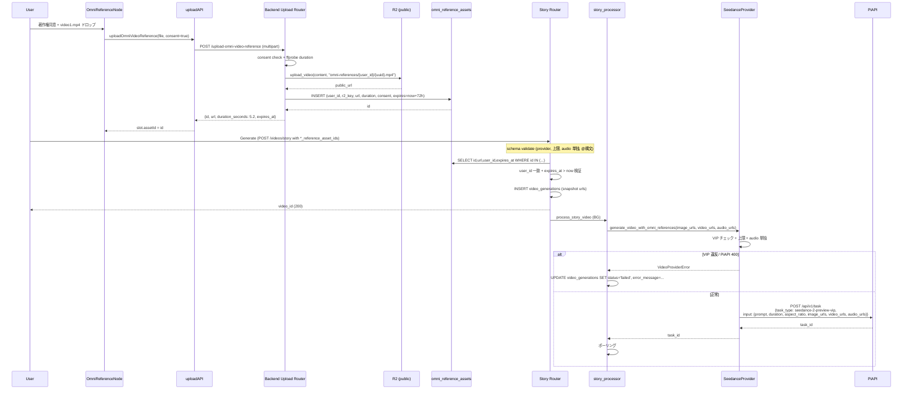
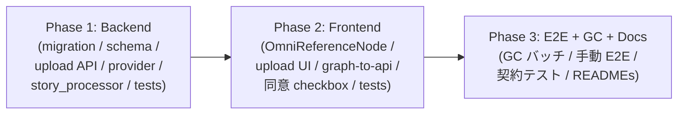
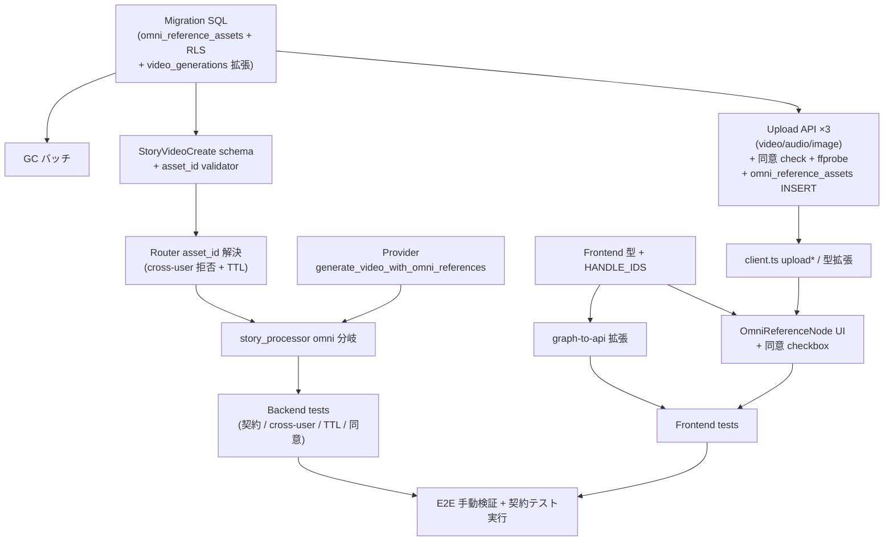

# Design Doc v2: Seedance 2.0 omni_reference 対応 (PiAPI 公式契約反映版)

**作成日**: 2026-05-18
**版数**: v2 (v1: `docs/plans/2026-05-18_seedance-omni-reference.md`)
**ステータス**: Draft (ダブルレビュー指摘反映済)
**作成者**: technical-designer
**関連 Doc**:
- `docs/plans/2026-05-18_seedance-omni-reference.md` (v1、致命的指摘 5 件あり、本 v2 で全反映)
- `docs/plans/2026-05-13_gpt-image-2-and-seedance-2.0.md` (Phase 1 で参照素材未対応と明記)
- `docs/plans/2026-05-18_seedance-detailed-params.md` (omni_reference は将来スコープ、本 Doc がその将来スコープ)
- `docs/plans/2026-05-18_duration-1s-step.md` (duration 1s step 拡張、本 Doc は整数 4-15 互換)

---

## 0. 改訂履歴と v1 からの主要変更点

| 区分 | ID | v1 の問題 | v2 の修正 |
|------|----|----------|----------|
| P0 | C-1 | PiAPI 契約名誤り (`video_references` / `audio_references`) | **`video_urls` / `audio_urls` / `image_urls`** に統一 (PiAPI 公式)。omni 専用 `task_type` マップ廃止 (preview 系統は既存 `seedance-2-preview-vip` / `seedance-2-fast-preview-vip` をそのまま使用)。`input.mode` フィールド不要 |
| P0 | C-2 | R2 アーキ「prefix 公開」の誤前提 / 新規 R2 helper 提案 | 既存 `r2.py:get_public_url()` (L37-41) は **全アップロードで `R2_PUBLIC_URL` を返す → バケット全体既に公開**。既存 `upload_video` (L164) / `upload_audio` (L180) を再利用、新規プレフィックス `omni-references/{user_id}/{uuid}.{ext}` のみ追加。本番では `R2_PUBLIC_URL` (Custom Domain) 必須化を明記 |
| P0 | C-3 | URL を schema で直接受け付ける = 任意外部 URL 注入の温床 | **`omni_reference_assets` テーブル新設**、アップロード API は `asset_id` を返す。`StoryVideoCreate` は `*_reference_asset_ids: list[uuid]` のみ受領、外部 URL 受付不可。RLS で cross-user 拒否、72h TTL GC、著作権同意 checkbox を schema 強制 |
| P0 | C-4 | `StoryVideoCreate` で `image_urls`/`prompt` 参照していたが両方とも存在しない | 実フィールド `image_url: str` (単数、`schemas.py:283`) / `story_text: str` (`schemas.py:284`) を参照する validator に修正。`@imageN` N 上限は `image_url 有無 (1 or 0) + image_reference_asset_ids 長さ` で算出 |
| P0 | C-5 | 「複数 image 参照」と「画像 URL 単数」の矛盾 | 画像追加参照用に `image_reference_asset_ids: list[uuid]` を新設 (or `omni_reference_assets.media_type` に `image` を含めて統合)。本 v2 は **後者** (`media_type IN ('video', 'audio', 'image')`) を採用し、`*_reference_asset_ids` を 3 種で対称化 |
| P1 | H-1 | 「BG 内 VIP 違反 → 422」と書いたが `/videos/story` は INSERT 後 BG なので 422 不可能 | 事前 validate (provider/上限/audio 単独) は **schema validator** で完結 → 422 で OK。Provider 側エラー (PiAPI 400 等) は **BG 内で `video_generations.status='failed' + error_message`** に転送する旨を AC 文言に明記 |
| P1 | H-2 | usage 加算 / refund 整合性が未定義 | 本 Doc スコープ外として §17 未解決項目に明記 (別 PR で対応) |
| P1 | H-3 | VALID_DURATIONS=[5,10,15] の離散値前提 | 撤去。整数 4-15 (`schemas.py:316-318` の既存 `seedance_duration` Field と整合) |
| P1 | H-4 | 新規 r2.py 関数追加前提 | 不要。既存 `upload_video` (`r2.py:164`) / `upload_audio` (`r2.py:180`) を再利用 + プレフィックスのみ追加 |
| P1 | H-5 | 契約テスト/cross-user テスト/TTL GC テスト/同意 false テストが欠落 | §15 に **B-29〜B-36** を追加 |

---

## 1. 合意チェックリスト

| 項目 | 内容 | 設計上の反映箇所 |
|------|------|----------------|
| スコープ | Seedance 2.0 omni_reference 用の `video_urls` / `audio_urls` (+追加 `image_urls` 参照) 対応 + プロンプト `@image{N}` / `@video{N}` / `@audio{N}` 構文サポート | §3 §6 |
| スコープ | アップロード API: `POST /api/v1/videos/upload-omni-reference` (single endpoint で `media_type` 切替、または media 別 2 endpoints のいずれか — §5 で決定: **2 endpoints**) | §6.3 |
| スコープ | 新規テーブル `omni_reference_assets` 設計 + RLS + 72h TTL GC バッチ | §6.6 |
| スコープ | 著作権同意 checkbox (UI 必須、`consent_accepted=true` を schema 検証) | §6.3 §6.8 |
| 非スコープ | omni_reference 以外の Seedance パラメータ (generate_audio / seed / resolution / camerafixed / last_frame_url) | §3 |
| 非スコープ | usage カウント refund ロジック (INSERT 時加算スキームと衝突する可能性、別 PR) | §17 #2 |
| 非スコープ | Storyboard 経由 (`storyboard_processor.py`) での omni_reference 伝搬 — Node Editor 経路のみ | §17 #7 |
| 非スコープ | watermark, parent_task_id | §3 |
| 制約 | **preview 系統では VIP 必須** (`seedance-2-preview-vip` / `seedance-2-fast-preview-vip`)。preview 系統は `input.mode` 不要 (GA 系統のみ `mode="omni_reference"` 必要、本 Doc は preview 系統で確定) | §3 §11 |
| 制約 | image_urls ≤ 9 / video_urls ≤ 3 / audio_urls ≤ 3 / **合計 1-12** | §6 §11 |
| 制約 | duration: 整数 4-15 (`schemas.py:316-318` 既存と整合、離散値 [5,10,15] は採用しない) | §6 §11 |
| 制約 | audio 単独不可 (`image_urls` か `video_urls` のうち少なくとも 1 つ必須) | §11 |
| 制約 | 参照 URL は **公開アクセス可能必須**。本 Doc は既存 R2 バケットが既に `R2_PUBLIC_URL` 経由で公開済である前提で進める (本番 Custom Domain 経由必須) | §6.3 §11 |
| 制約 | プロンプト内 `@image{N}` / `@video{N}` / `@audio{N}` の N が対応 asset 数を超える場合は 422 | §6.4 §11 |
| 制約 | 外部 URL の `StoryVideoCreate` 直接受付禁止。**asset_id 経由のみ** | §6.4 (security) |
| 後方互換 | 既存 Seedance リクエスト (image_urls なし) は変更なし、新フィールド全て Optional | §12 |
| 検証 | 新規 backend/ frontend テスト 35+ 件 + 既存全件 pass | §15 |

---

## 2. 背景・課題

PiAPI Seedance 2.0 の公式仕様には参照素材として **動画/音声/画像 URL** を受け付ける機能 (一般に omni_reference と呼ばれる) が存在し、動画と音声と画像の参照素材を mix して与えてモーション・スタイル・BGM/環境音を参照させることができる。

| モード | 入力素材 | 用途 |
|--------|---------|------|
| `text_to_video` | prompt のみ | 純テキストからの生成 |
| `first_last_frames` | start (+ end) フレーム画像 | 始終フレーム指定 (`2026-05-18_seedance-detailed-params.md` で対応済) |
| **omni_reference** (本 Doc) | **`image_urls` / `video_urls` / `audio_urls` mix** | スタイル/モーション/音声を mix して参照 |

現状実装は **image_urls のみ (単数)** に対応しており、`piapi_seedance_provider.py` で `video_urls / audio_urls` 未対応。

### 2.1 PiAPI 公式仕様 (本 Doc が依拠する事実、WebFetch 確認済)

公式 payload 例:
```json
{
  "model": "seedance",
  "task_type": "seedance-2-preview-vip",
  "input": {
    "prompt": "The character in @image1 dances to @audio1",
    "image_urls": ["https://example.com/character.jpg"],
    "audio_urls": ["https://example.com/music.mp3"],
    "duration": 10,
    "aspect_ratio": "16:9"
  },
  "config": { "service_mode": "public" }
}
```

確定事項:
- **task_type は既存の preview 系統をそのまま使用** (omni 専用 task_type は preview 系統には存在しない)
- **`input.mode` フィールドは不要** (GA 系統のみ要、preview 系統は不要)
- **フィールド名**: `video_urls` / `audio_urls` / `image_urls` (v1 の `_references` は誤り)
- **VIP モデル必須** (`-vip` suffix)
- 参照素材合計 1-12 (image ≤ 9, video ≤ 3, audio ≤ 3)
- audio 単独不可 (image か video が必須)
- duration: 整数 4-15
- プロンプト内 `@image1` / `@video1` / `@audio1` 構文 (1-indexed)
- URL は公開アクセス可能必須 (署名 URL は失敗しやすい)

---

## 3. 目標

### A. Backend: Provider 拡張 (`video_urls` / `audio_urls` / 追加 `image_urls` payload 送信)
- `PiAPISeedanceProvider.generate_video_with_omni_references()` 新規メソッド
- **既存 task_type をそのまま使用** (omni 専用 task_type は導入しない)
- **`input.mode` フィールドは送信しない** (preview 系統不要)
- payload に `input.image_urls` / `input.video_urls` / `input.audio_urls` を追加
- 参照素材合計の validate (1-12)、audio 単独不可の validate、VIP 必須チェック (env から判定)

### B. Backend: 新規テーブル `omni_reference_assets` + アップロード API
- アップロード API (2 endpoints):
  - `POST /api/v1/videos/upload-omni-video-reference` (MP4/MOV, ≤15.4s, ≤50MB)
  - `POST /api/v1/videos/upload-omni-audio-reference` (MP3/WAV, ≤15s, ≤10MB)
  - (画像参照追加は既存 `POST /upload-image` 利用 → `media_type=image` で `omni_reference_assets` 行を作る薄いラッパー or 専用 endpoint `POST /upload-omni-image-reference` を追加。本 v2 は **専用 endpoint** を追加して対称化)
- レスポンスは `{ id: uuid, url, media_type, duration_seconds, content_type, file_size_bytes, expires_at }`
- 既存 `r2.py:upload_video()` (L164) / `r2.py:upload_audio()` (L180) を再利用、引数 `filename` に `omni-references/{user_id}/{uuid}.{ext}` を渡す
- 著作権同意 (`consent_accepted: bool`) を multipart form フィールドで受領、`false` なら 422

### C. Backend: スキーマ拡張 + プロンプト @構文 validate
- `StoryVideoCreate` に **`image_reference_asset_ids: list[UUID] | None` / `video_reference_asset_ids: list[UUID] | None` / `audio_reference_asset_ids: list[UUID] | None`** を追加 (URL ではなく asset_id)
- Pydantic validator:
  - VIP モデル必須 (env が VIP suffix を含むかどうか実行時判定 — schema レベルでは provider=seedance のみチェックし、VIP 違反は BG で `failed` 化)
  - 各 list の長さ上限 (image ≤ 9, video ≤ 3, audio ≤ 3)
  - 参照素材合計 1-12 個 (既存 `image_url: str` の有無 + 各 asset_ids の長さ合算)
  - audio 単独不可 (`image_url` 未設定 + `image_reference_asset_ids` 空 + `video_reference_asset_ids` 空 + `audio_reference_asset_ids` あり → 422)
  - プロンプト (`story_text`) 内 `@image{N}` / `@video{N}` / `@audio{N}` の N が対応 count を超えていない
  - **外部 URL の直接受付禁止** (Pydantic 型レベルで保証: UUID 型のみ受領)
- Router 内で `user_id` 一致と `expires_at > now()` を確認し URL 取得

### D. Backend: DB スキーマ追加
- 新規テーブル `omni_reference_assets` (RLS 込)
- 既存 `video_generations` には `image_reference_urls jsonb` / `video_reference_urls jsonb` / `audio_reference_urls jsonb` を追加 (BG 実行時に snapshot として保存、asset 削除後も生成履歴が壊れない)
- 既存行への影響なし (全 NULL 既定)

### E. Frontend: 新規 OmniReferenceNode
- video × 3 + audio × 3 + image (追加) × 9 slots (UI は折り畳み可能)
- スロットには **`asset_id`** を保持 (URL ではない)
- ImageInputNode の Dropzone パターン踏襲
- 著作権同意 checkbox (必須、未チェックなら Generate 不可)

### F. Frontend: アップロード後 duration 表示と合計時間 UI 警告
- video 合計 > 15.4s で警告 (赤)
- audio 各 > 15s は upload API で 422 のため UI で事前 File チェック

### G. Frontend: graph-to-api 変換
- 新フィールドは `*_reference_asset_ids: string[]` (UUID 文字列) として送信

### 非スコープ

- `generate_audio` / `seed` / `resolution` / `camerafixed` — `2026-05-18_seedance-detailed-params.md` 既対応
- `watermark` / `parent_task_id`
- Storyboard 経由 (`storyboard_processor.py`)
- usage refund ロジック (§17 #2)
- GA 系統 (`input.mode="omni_reference"`) 対応 — preview 系統のみ対応

---

## 4. 既存コードベース調査

### 4.1 実装ファイルマッピング (v1 から訂正)

| 対象 | パス | 役割・状態 |
|------|------|----------|
| Seedance Provider | `movie-maker-api/app/external/piapi_seedance_provider.py` | payload 構築、task_type 切替 |
| Seedance env | `movie-maker-api/app/core/config.py:51-52` | `PIAPI_SEEDANCE_TASK_TYPE=seedance-2-preview-vip` (preview 系統前提) |
| Story Processor | `movie-maker-api/app/tasks/story_processor.py:115-205` | DB → extra_params → provider 呼出 |
| **R2 クライアント (再利用)** | `movie-maker-api/app/external/r2.py` | `get_public_url()` (L37-41) は全アップで `R2_PUBLIC_URL` 返却 = **バケット全体公開**。`upload_video(file_content, filename)` (L164) / `upload_audio(file_content, filename)` (L180) を再利用 |
| Backend Schema | `movie-maker-api/app/videos/schemas.py:276-353` | `StoryVideoCreate` (実フィールド: `image_url: str` (L283), `story_text: str` (L284)、`image_urls`/`prompt` は **存在しない**) |
| Backend Router | `movie-maker-api/app/videos/router.py` | DB INSERT + `POST /upload-image` パターン |
| Frontend 雛形 | `movie-maker/components/node-editor/nodes/ImageInputNode.tsx` | 画像アップロード雛形 |
| ProviderNode UI | `movie-maker/components/node-editor/nodes/ProviderNode.tsx` | Seedance Pro/Fast 選択 |
| NodePalette | `movie-maker/components/node-editor/NodePalette.tsx` | `omniReference` 追加 |
| Nodes availability | `movie-maker/components/node-editor/hooks/useNodesAvailability.ts` | `seedance` 配列に `omniReference` 追加 |
| Graph→API 変換 | `movie-maker/components/node-editor/utils/graph-to-api.ts` | `*_reference_asset_ids` マッピング |
| API クライアント | `movie-maker/lib/api/client.ts` | `StoryVideoCreateRequest` 拡張 + アップロード関数 |
| HANDLE_IDS | `movie-maker/lib/types/node-editor.ts` | `OMNI_REFERENCE_*` 追加 |

### 4.2 既存 R2 公開状態 (v1 誤前提の訂正)

```python
# r2.py L37-41 (実コード)
def get_public_url(key: str) -> str:
    """R2オブジェクトの公開URLを取得"""
    if settings.R2_PUBLIC_URL:
        return f"{settings.R2_PUBLIC_URL.rstrip('/')}/{key}"
    return f"https://{settings.R2_BUCKET_NAME}.r2.dev/{key}"
```

→ 既存全アップロード (`images/`, `videos/`, `bgm/`) は **全て `R2_PUBLIC_URL` を返却 = バケット全体公開**。
v1 の「prefix-based 公開設定」「images/ は非公開」は誤り。
本 v2 では既存挙動踏襲のため `omni-references/` プレフィックスも同様に公開で進める。
**本番**: `R2_PUBLIC_URL` を Custom Domain (例: `https://assets.movie-maker.com`) に設定すること必須 (`r2.dev` 直 URL は本番運用不可)。

### 4.3 既存類似機能検索結果

- `video_urls`, `audio_urls`, `omni_reference` を `movie-maker-api/app/` 配下で grep → 既存実装なし → 新規実装
- 動画アップロード API → 既存 `POST /upload-image` (画像のみ)、video/audio 専用は未実装
- 結論: 新規実装。R2 部分は既存 `upload_video` / `upload_audio` を流用、新規ヘルパー追加不要

---

## 5. 採用案 (代替案比較)

### 5.1 Provider 拡張方針

| 案 | 内容 | 評価 |
|----|------|------|
| A (採用) | 新規メソッド `generate_video_with_omni_references()` を追加 | 既存 `generate_video()` / `generate_video_from_text()` 完全互換、TDD 容易、3 メソッドで `_post_task()` ヘルパー抽出可能 |
| B | 既存 `generate_video()` を拡張 | 引数膨張、後方互換テスト組合せ爆発 |
| C | Strategy パターン導入 | 大規模リファクタ、本 Doc スコープ外 |

**採用**: 案 A。

### 5.2 アップロード API 形態

| 案 | 内容 | 評価 |
|----|------|------|
| A | 単一 endpoint `POST /upload-omni-reference` + `media_type` form field | 実装 1 個、テスト分岐多 |
| B (採用) | media 別 3 endpoints (`upload-omni-video-reference` / `-audio-reference` / `-image-reference`) | 既存 `POST /upload-image` パターン整合、Content-Type 制約 / file size 上限 / duration 上限が media 別に明確、テストが単純 |

**採用**: 案 B。

### 5.3 asset_id 経由 vs URL 直接受付 (セキュリティ)

| 案 | 内容 | 評価 |
|----|------|------|
| A | `StoryVideoCreate` が `*_urls: list[str]` を直接受領 | **外部 URL 注入リスク**、他人の R2 オブジェクトを参照可能、悪意ある SSRF 可能 |
| B (採用) | アップロード API が `asset_id (UUID)` を返却、`StoryVideoCreate` は `*_reference_asset_ids: list[UUID]` のみ受領、Router 側で user_id 一致 + expires_at 検証 + URL 取得 | 外部 URL 完全遮断、cross-user 拒否、TTL GC 可能 |

**採用**: 案 B。

### 5.4 omni 用 task_type の扱い

| 案 | 内容 | 評価 |
|----|------|------|
| A | 別 task_type (例 `seedance-2-omni-preview-vip`) | preview 系統には存在しないため 400 unknown task_type |
| B (採用) | **既存 `seedance-2-preview-vip` / `seedance-2-fast-preview-vip` をそのまま使う** | PiAPI 公式仕様準拠、`input.mode` も不要 |

**採用**: 案 B。

---

## 6. 設計詳細

### 6.1 Backend 型定義 (`piapi_seedance_provider.py`)

```python
MAX_IMAGE_URLS = 9
MAX_VIDEO_URLS = 3
MAX_AUDIO_URLS = 3
MAX_TOTAL_REFERENCES = 12
MIN_TOTAL_REFERENCES = 1
MAX_VIDEO_TOTAL_SECONDS = 15.4
MAX_AUDIO_SECONDS_EACH = 15.0
# VALID_DURATIONS は削除。duration は schemas.py:316-318 の ge=4, le=15 と同じ整数範囲
```

### 6.2 Provider 実装 (新規メソッド)

```python
async def generate_video_with_omni_references(
    self,
    prompt: str,
    duration: int = 5,
    aspect_ratio: str = "9:16",
    mode: Optional[str] = None,
    image_urls: Optional[list[str]] = None,
    video_urls: Optional[list[str]] = None,
    audio_urls: Optional[list[str]] = None,
) -> str:
    """
    Seedance 2.0 omni_reference 用 generate (preview 系統)

    Args:
        prompt: プロンプト (最大4000文字、@image1/@video1/@audio1 構文サポート)
        duration: 4-15 整数
        aspect_ratio: アスペクト比
        mode: 'pro' | 'fast' | None
        image_urls: 画像参照 URL リスト (0-9)
        video_urls: 動画参照 URL リスト (0-3, 合計 ≤15.4s)
        audio_urls: 音声参照 URL リスト (0-3, 各 ≤15s)

    Returns:
        str: task_id

    Raises:
        VideoProviderError: VIP 違反 / 上限違反 / audio 単独
    """
    task_type = self._resolve_task_type(mode)  # 既存 task_type をそのまま使う
    if not task_type.endswith("-vip"):
        raise VideoProviderError(
            "omni_reference 用途は VIP モデル必須です "
            "(PIAPI_SEEDANCE_TASK_TYPE に -vip suffix 必須)"
        )

    image_urls = image_urls or []
    video_urls = video_urls or []
    audio_urls = audio_urls or []

    if len(image_urls) > MAX_IMAGE_URLS:
        raise VideoProviderError(f"image_urls は最大 {MAX_IMAGE_URLS} 個")
    if len(video_urls) > MAX_VIDEO_URLS:
        raise VideoProviderError(f"video_urls は最大 {MAX_VIDEO_URLS} 個")
    if len(audio_urls) > MAX_AUDIO_URLS:
        raise VideoProviderError(f"audio_urls は最大 {MAX_AUDIO_URLS} 個")

    total = len(image_urls) + len(video_urls) + len(audio_urls)
    if total < MIN_TOTAL_REFERENCES or total > MAX_TOTAL_REFERENCES:
        raise VideoProviderError(
            f"参照素材は合計 {MIN_TOTAL_REFERENCES}〜{MAX_TOTAL_REFERENCES} 個必要 (現在: {total})"
        )
    if not image_urls and not video_urls:
        raise VideoProviderError("audio_urls 単独不可。image_urls か video_urls が必要")

    input_payload: dict = {
        "prompt": prompt[:4000],
        "duration": int(duration),  # 4-15 整数、離散化なし
        "aspect_ratio": aspect_ratio,
        "resolution": self.resolution,
    }
    if image_urls:
        input_payload["image_urls"] = image_urls
    if video_urls:
        input_payload["video_urls"] = video_urls
    if audio_urls:
        input_payload["audio_urls"] = audio_urls
    # ※ input.mode は送信しない (preview 系統不要)

    payload = {
        "model": "seedance",
        "task_type": task_type,  # 既存 task_type そのまま (omni 専用 task_type 不使用)
        "input": input_payload,
        "config": {"service_mode": "public"},
    }
    return await self._post_task(payload)
```

**共通化** (Rule of Three): `generate_video()` / `generate_video_from_text()` / `generate_video_with_omni_references()` の 3 メソッドで `httpx POST → task_id 抽出 → エラーマッピング` を `_post_task()` ヘルパーに抽出する。

### 6.3 Backend Upload API + asset テーブル登録

#### 6.3.1 `POST /api/v1/videos/upload-omni-video-reference`

- multipart/form-data
  - `file: UploadFile` (`video/mp4` or `video/quicktime`)
  - `consent_accepted: bool` (form field、false なら 422)
- file size ≤ 50MB (413)
- ffprobe で duration 計測、>15.4s なら 422
- `r2.upload_video(file_content, filename=f"omni-references/{user_id}/{uuid}.{ext}")` 呼出 (既存関数再利用)
- `omni_reference_assets` テーブルに INSERT (consent_accepted=true, expires_at=now()+72h)
- レスポンス: `{ id, url, media_type:'video', duration_seconds, content_type, file_size_bytes, expires_at }`

#### 6.3.2 `POST /api/v1/videos/upload-omni-audio-reference`

- multipart/form-data
  - `file: UploadFile` (`audio/mpeg` or `audio/wav`)
  - `consent_accepted: bool`
- file size ≤ 10MB
- ffprobe で duration、>15s なら 422
- `r2.upload_audio(file_content, filename=f"omni-references/{user_id}/{uuid}.{ext}")` 再利用
- `omni_reference_assets` INSERT (media_type='audio')

#### 6.3.3 `POST /api/v1/videos/upload-omni-image-reference`

- multipart/form-data
  - `file: UploadFile` (`image/jpeg` or `image/png` or `image/webp`)
  - `consent_accepted: bool`
- file size ≤ 10MB
- duration は null
- `r2.upload_image(file_content, filename=f"omni-references/{user_id}/{uuid}.{ext}")` 再利用
- `omni_reference_assets` INSERT (media_type='image', duration_seconds=NULL)

#### 6.3.4 R2 配置

- 既存 `upload_video` / `upload_audio` / `upload_image` は内部で `key = f"{prefix}/{filename}"` を組み立て → 引数 `filename` に `omni-references/{user_id}/{uuid}.{ext}` を渡せばその key で R2 配置される (※実装時に既存関数の prefix 結合ロジックを再確認、もし固定 prefix を強制している場合は **`r2.upload_user_video(key=..., content_type=...)` 既存関数 (L267) を使う** こと)
- 既存挙動踏襲: バケット全体公開 (`R2_PUBLIC_URL` 経由)、本番 Custom Domain 必須

### 6.4 Schema 変更 (`schemas.py`)

```python
# StoryVideoCreate に追加 (v2)
image_reference_asset_ids: Optional[list[UUID]] = Field(
    default=None,
    max_length=9,
    description="omni_reference 用追加画像参照の asset_id (omni_reference_assets.id)。最大 9 個。"
                "外部 URL 直接受付不可 (アップロード API 経由必須)"
)
video_reference_asset_ids: Optional[list[UUID]] = Field(
    default=None,
    max_length=3,
    description="omni_reference 用動画参照の asset_id。最大 3 個、合計 ≤15.4s"
)
audio_reference_asset_ids: Optional[list[UUID]] = Field(
    default=None,
    max_length=3,
    description="omni_reference 用音声参照の asset_id。最大 3 個、各 ≤15s"
)

@model_validator(mode='after')
def validate_omni_references(self) -> Self:
    """
    omni_reference の事前 validate (422 で reject 可能な部分のみ):
      1. provider が seedance (or 未指定 = env 既定 seedance)
      2. 上限: image_url 有無含めて合計 ≤12, ≥1
      3. audio 単独不可
      4. @構文 N が対応 count 以下
    VIP 制約や PiAPI 側エラーは BG 内で failed 化 (422 不可)
    """
    has_video_refs = bool(self.video_reference_asset_ids)
    has_audio_refs = bool(self.audio_reference_asset_ids)
    has_image_refs = bool(self.image_reference_asset_ids)
    if not (has_video_refs or has_audio_refs or has_image_refs):
        return self  # omni 未使用、skip

    if self.video_provider not in (None, VideoProvider.SEEDANCE):
        raise ValueError(
            "*_reference_asset_ids は video_provider=seedance でのみ利用可能"
        )

    # ベース画像 (既存 image_url: str L283) も image 参照としてカウント
    base_image_count = 1 if self.image_url else 0
    image_count = base_image_count + len(self.image_reference_asset_ids or [])
    video_count = len(self.video_reference_asset_ids or [])
    audio_count = len(self.audio_reference_asset_ids or [])
    total = image_count + video_count + audio_count

    if total > 12:
        raise ValueError(f"参照素材合計は 12 個まで (現在: {total})")
    if total < 1:
        raise ValueError("参照素材を 1 つ以上指定してください")
    if image_count == 0 and video_count == 0 and audio_count > 0:
        raise ValueError("audio 単独不可。image または video を 1 つ以上指定してください")

    # @構文 validate (実フィールド名: story_text L284)
    import re
    text = self.story_text or ''
    for tag, count in [('image', image_count), ('video', video_count), ('audio', audio_count)]:
        for match in re.finditer(rf'@{tag}(\d+)', text):
            n = int(match.group(1))
            if n < 1 or n > count:
                raise ValueError(
                    f"プロンプト内の @{tag}{n} は範囲外 (指定された {tag} 参照は {count} 個)"
                )
    return self
```

**Router 側** (`videos/router.py`):
```python
# asset_id → URL 解決 (cross-user 拒否 + TTL チェック)
async def resolve_asset_ids(asset_ids: list[UUID], user_id: UUID, media_type: str) -> list[str]:
    if not asset_ids:
        return []
    rows = await supabase.table('omni_reference_assets').select('id,public_url,user_id,expires_at,media_type').in_('id', [str(i) for i in asset_ids]).execute()
    urls = []
    for aid in asset_ids:  # 順序保持
        row = next((r for r in rows.data if r['id'] == str(aid)), None)
        if row is None:
            raise HTTPException(422, f"asset_id {aid} not found")
        if row['user_id'] != str(user_id):
            raise HTTPException(422, f"asset_id {aid} は他ユーザーのリソース")
        if row['media_type'] != media_type:
            raise HTTPException(422, f"asset_id {aid} は media_type 不一致")
        if parse(row['expires_at']) < datetime.utcnow():
            raise HTTPException(422, f"asset_id {aid} は期限切れ")
        urls.append(row['public_url'])
    return urls
```

### 6.5 Story Processor 拡張 (`story_processor.py`)

```python
# DB から URL snapshot 取得 (asset 経由ではなく、INSERT 時に解決済 URL を保存)
image_reference_urls = video_data.get("image_reference_urls") or []
video_reference_urls = video_data.get("video_reference_urls") or []
audio_reference_urls = video_data.get("audio_reference_urls") or []

elif provider_name == "seedance":
    if image_reference_urls or video_reference_urls or audio_reference_urls:
        # 既存 image_url を image_urls の先頭に追加
        all_image_urls = ([image_url] if image_url else []) + image_reference_urls
        task_id = await provider.generate_video_with_omni_references(
            prompt=prompt,
            duration=duration,
            aspect_ratio=aspect_ratio,
            mode=seedance_mode,
            image_urls=all_image_urls,
            video_urls=video_reference_urls,
            audio_urls=audio_reference_urls,
        )
    else:
        task_id = await provider.generate_video(...)  # 既存
```

### 6.6 Migration (`docs/migrations/20260518_add_omni_reference_assets.sql`)

```sql
-- 1. 新規テーブル omni_reference_assets
CREATE TABLE IF NOT EXISTS omni_reference_assets (
  id uuid PRIMARY KEY DEFAULT gen_random_uuid(),
  user_id uuid NOT NULL REFERENCES auth.users(id) ON DELETE CASCADE,
  r2_key text NOT NULL,
  public_url text NOT NULL,
  media_type text NOT NULL CHECK (media_type IN ('video', 'audio', 'image')),
  content_type text NOT NULL,
  duration_seconds numeric,  -- image は NULL 許容
  file_size_bytes bigint NOT NULL,
  consent_accepted boolean NOT NULL DEFAULT false,
  created_at timestamptz NOT NULL DEFAULT now(),
  expires_at timestamptz NOT NULL DEFAULT (now() + interval '72 hours')
);
CREATE INDEX IF NOT EXISTS idx_omni_ref_user ON omni_reference_assets(user_id);
CREATE INDEX IF NOT EXISTS idx_omni_ref_expires ON omni_reference_assets(expires_at);

-- 2. RLS
ALTER TABLE omni_reference_assets ENABLE ROW LEVEL SECURITY;
CREATE POLICY "select_own" ON omni_reference_assets
  FOR SELECT USING (auth.uid() = user_id);
CREATE POLICY "insert_own" ON omni_reference_assets
  FOR INSERT WITH CHECK (auth.uid() = user_id);
CREATE POLICY "delete_own" ON omni_reference_assets
  FOR DELETE USING (auth.uid() = user_id);

-- 3. video_generations に URL snapshot カラム追加
ALTER TABLE video_generations
  ADD COLUMN IF NOT EXISTS image_reference_urls JSONB DEFAULT NULL,
  ADD COLUMN IF NOT EXISTS video_reference_urls JSONB DEFAULT NULL,
  ADD COLUMN IF NOT EXISTS audio_reference_urls JSONB DEFAULT NULL;

ALTER TABLE video_generations
  ADD CONSTRAINT image_reference_urls_max_9 CHECK (
    image_reference_urls IS NULL OR jsonb_array_length(image_reference_urls) <= 9
  ),
  ADD CONSTRAINT video_reference_urls_max_3 CHECK (
    video_reference_urls IS NULL OR jsonb_array_length(video_reference_urls) <= 3
  ),
  ADD CONSTRAINT audio_reference_urls_max_3 CHECK (
    audio_reference_urls IS NULL OR jsonb_array_length(audio_reference_urls) <= 3
  );
```

**GC バッチ** (Celery beat or cron):
```python
# 日次実行: expires_at < now() の asset を R2 削除 + DB 削除
async def gc_expired_omni_assets():
    rows = supabase.table('omni_reference_assets').select('id,r2_key').lt('expires_at', datetime.utcnow().isoformat()).execute()
    for row in rows.data:
        await r2.delete_file(row['r2_key'])
        supabase.table('omni_reference_assets').delete().eq('id', row['id']).execute()
```

### 6.7 Frontend 型定義 (`lib/types/node-editor.ts`)

```ts
export type NodeType = '...' | 'omniReference';

export interface OmniReferenceSlot {
  assetId: string | null;   // UUID (URL ではない)
  url?: string;             // プレビュー表示用
  filename?: string;
  durationSeconds?: number;
  mediaType: 'image' | 'video' | 'audio';
}

export interface OmniReferenceNodeData extends BaseNodeData {
  type: 'omniReference';
  imageSlots: OmniReferenceSlot[];  // 最大 9
  videoSlots: [OmniReferenceSlot, OmniReferenceSlot, OmniReferenceSlot];
  audioSlots: [OmniReferenceSlot, OmniReferenceSlot, OmniReferenceSlot];
  consentAccepted: boolean;  // 著作権同意
}

export const HANDLE_IDS = {
  // ...
  OMNI_REFERENCE_OUTPUT: 'omni_reference',
  OMNI_REFERENCE_INPUT: 'omni_reference_input',
} as const;
```

### 6.8 OmniReferenceNode UI

`components/node-editor/nodes/OmniReferenceNode.tsx`:
- video slot × 3 (合計プログレスバー / 15.4s)
- audio slot × 3 (各 duration 表示)
- image slot × 9 (折り畳み)
- **著作権同意 checkbox** (必須):
  ```
  「アップロードする音声/動画/画像の権利を私が保有しているか、利用許諾を得ている」
  ```
- 未チェック時 Generate ボタン disable

### 6.9 graph-to-api.ts

```ts
if (provider?.provider === 'seedance') {
  const omniNode = nodes.find(
    n => n.data.type === 'omniReference' &&
         isConnectedToProvider(n.id, providerNode.id, edges)
  );
  if (omniNode) {
    const d = omniNode.data as OmniReferenceNodeData;
    if (!d.consentAccepted) {
      throw new Error('著作権同意が必要です');  // クライアント側 guard
    }
    const imgIds = d.imageSlots.filter(s => s.assetId).map(s => s.assetId!);
    const vidIds = d.videoSlots.filter(s => s.assetId).map(s => s.assetId!);
    const audIds = d.audioSlots.filter(s => s.assetId).map(s => s.assetId!);
    if (imgIds.length) request.image_reference_asset_ids = imgIds;
    if (vidIds.length) request.video_reference_asset_ids = vidIds;
    if (audIds.length) request.audio_reference_asset_ids = audIds;
  }
}
```

### 6.10 API クライアント (`lib/api/client.ts`)

```ts
// StoryVideoCreateRequest 拡張
{
  // ... 既存
  image_reference_asset_ids?: string[];
  video_reference_asset_ids?: string[];
  audio_reference_asset_ids?: string[];
}

export async function uploadOmniVideoReference(
  file: File, consentAccepted: boolean
): Promise<{
  id: string;
  url: string;
  media_type: 'video';
  duration_seconds: number;
  content_type: string;
  file_size_bytes: number;
  expires_at: string;
}>;

export async function uploadOmniAudioReference(file: File, consentAccepted: boolean): Promise<...>;
export async function uploadOmniImageReference(file: File, consentAccepted: boolean): Promise<...>;
```

---

## 7. アーキテクチャ図

```mermaid
graph TB
  subgraph Frontend
    OR["OmniReferenceNode<br/>(image×9 + video×3 + audio×3 slots<br/>+ 著作権同意 checkbox)"]
    PN["ProviderNode<br/>(Seedance, OMNI_REFERENCE_INPUT handle)"]
    G2A["graph-to-api.ts<br/>(*_reference_asset_ids マッピング)"]
    UPL["uploadOmni{Video,Audio,Image}Reference"]
    API["client.ts<br/>(StoryVideoCreateRequest)"]
  end

  subgraph Backend
    UPR["videos/router.py<br/>POST /upload-omni-{video,audio,image}-reference<br/>(著作権同意 + ffprobe + r2.upload_* 再利用)"]
    R2[("R2 (バケット全体公開)<br/>omni-references/{user_id}/{uuid}.{ext}")]
    OAT[("omni_reference_assets<br/>(RLS + 72h TTL)")]
    GC["GC バッチ<br/>(日次, expires_at < now)"]
    SCH["schemas.py<br/>StoryVideoCreate<br/>+ validate_omni_references"]
    ROUTER["videos/router.py<br/>POST /videos/story<br/>(asset_id → URL 解決, cross-user 拒否)"]
    DB[("Supabase<br/>video_generations<br/>+ {image,video,audio}_reference_urls JSONB snapshot)"]
    SP["story_processor.py<br/>(omni 分岐)"]
    SDP["PiAPISeedanceProvider<br/>generate_video_with_omni_references()"]
  end

  OR -->|file + consent| UPL
  UPL -->|POST /upload-omni-*| UPR
  UPR -->|r2.upload_video/audio/image| R2
  UPR -->|INSERT| OAT
  OAT -->|asset row| UPR
  UPR -->|{id, url, duration, ...}| UPL
  UPL -->|slot.assetId 更新| OR
  OR -->|connected| PN
  PN -->|asset_ids| G2A
  G2A --> API
  API -->|POST /videos/story<br/>asset_ids only| SCH
  SCH --> ROUTER
  ROUTER -->|SELECT omni_reference_assets<br/>user_id + expires_at check| OAT
  ROUTER -->|INSERT snapshot urls| DB
  DB --> SP
  SP -->|generate_video_with_omni_references| SDP
  SDP -->|"PiAPI POST /api/v1/task<br/>task_type: seedance-2-preview-vip (既存)<br/>input.{image_urls, video_urls, audio_urls}<br/>※ input.mode 不要"| EXT[("PiAPI Seedance 2.0")]
  GC -.->|delete expired| OAT
  GC -.->|delete_file| R2
```

## 8. データフロー図



## 9. Phase 構造図



## 10. タスク依存図



---

## 11. 変更影響マップ

```yaml
Change Target: Seedance 2.0 omni_reference 対応 (preview 系統、asset_id 経由)
Direct Impact:
  - movie-maker-api/app/external/piapi_seedance_provider.py (新規メソッド + _post_task ヘルパー)
  - movie-maker-api/app/videos/schemas.py (Field 3 + cross-validator + upload API スキーマ + resolve_asset_ids)
  - movie-maker-api/app/videos/router.py (POST /upload-omni-{video,audio,image}-reference + DB INSERT 拡張 + asset_id 解決)
  - movie-maker-api/app/tasks/story_processor.py (omni 分岐)
  - movie-maker-api/app/tasks/omni_reference_gc.py (新規 GC バッチ、Celery beat 登録)
  - movie-maker/lib/types/node-editor.ts
  - movie-maker/components/node-editor/nodes/OmniReferenceNode.tsx (新規)
  - movie-maker/components/node-editor/nodes/ProviderNode.tsx (OMNI_REFERENCE_INPUT handle)
  - movie-maker/components/node-editor/NodePalette.tsx
  - movie-maker/components/node-editor/hooks/useNodesAvailability.ts
  - movie-maker/components/node-editor/utils/graph-to-api.ts
  - movie-maker/lib/api/client.ts
  - docs/migrations/20260518_add_omni_reference_assets.sql (新規)
Indirect Impact:
  - movie-maker-api/app/external/r2.py (関数追加なし、既存 upload_video/upload_audio/upload_image 再利用のみ)
  - movie-maker-api/app/tasks/storyboard_processor.py (本 Doc 範囲外、新カラム NULL)
  - 既存 video_generations テーブル (新カラム NULL、既存行影響なし)
No Ripple Effect:
  - 他プロバイダー (Runway / Veo / Kling / Hailuo / DomoAI) — 完全独立
  - 既存 generate_video / generate_video_from_text — シグネチャ不変
  - 既存 seedance_duration / seedance_mode 等 — 維持
  - 既存 POST /upload-image — 独立
  - r2.py の既存関数 — 関数追加なし、シグネチャ不変
```

### インターフェース変更マトリクス

| 既存操作 | 新操作 | 変換 | 互換方法 |
|---------|--------|------|--------|
| `generate_video(...)` (i2v) | 変更なし | 不要 | 完全互換 |
| `generate_video_from_text(...)` | 変更なし | 不要 | 完全互換 |
| (新規) | `generate_video_with_omni_references(image_urls, video_urls, audio_urls, ...)` | — | omni 専用 |
| `StoryVideoCreate` | + image/video/audio_reference_asset_ids (3 Optional) | 不要 | 既存リクエスト互換 |
| (新規) | POST /upload-omni-{video,audio,image}-reference (3 endpoints) | — | 新規 |
| (新規) | omni_reference_assets テーブル + RLS + 72h TTL | — | 新規 |
| video_generations | + {image,video,audio}_reference_urls JSONB (snapshot) | 不要 (default NULL) | 既存行 NULL |
| r2.py 既存関数 | 変更なし | 不要 | 関数追加なし |

---

## 12. 統合ポイントマップ

```yaml
統合ポイント 1:
  既存コンポーネント: ImageInputNode (UI パターン参考)
  統合方法: OmniReferenceNode を Dropzone ベースに新規作成 (image/video/audio 3 種スロット)
  影響レベル: Low
  必要なテスト: Dropzone 動作 / asset_id 保持 / 同意 checkbox

統合ポイント 2:
  既存コンポーネント: r2.py upload_video (L164) / upload_audio (L180) / upload_image (L91)
  統合方法: 既存関数を filename 引数で omni-references/{user_id}/{uuid}.{ext} を渡して再利用 (関数追加なし)
  影響レベル: Low
  必要なテスト: filename 引数経由で意図 key で配置されること

統合ポイント 3:
  既存コンポーネント: POST /api/v1/videos/upload-image (パターン参考)
  統合方法: 3 endpoints 追加 (video/audio/image)、ffprobe + 著作権同意 + omni_reference_assets INSERT
  影響レベル: Medium
  必要なテスト: Content-Type / size / duration / 同意 false / R2 配置 / DB row 作成

統合ポイント 4:
  既存コンポーネント: graph-to-api.ts
  統合方法: seedance 分岐内に *_reference_asset_ids マッピング + 同意 guard
  影響レベル: Medium
  必要なテスト: 接続時 / 未接続時 / 同意未チェック時 / 空 slot 除外

統合ポイント 5:
  既存コンポーネント: schemas.py / StoryVideoCreate (image_url: str L283, story_text: str L284)
  統合方法: Field 3 個 + validate_omni_references (image_url 有無 + asset_ids 長さで count 算出)
  影響レベル: Medium
  必要なテスト: 各境界 / @構文 / cross-validator

統合ポイント 6:
  既存コンポーネント: videos/router.py
  統合方法: asset_id → URL 解決ヘルパー追加、cross-user 拒否、TTL 検証、video_generations に snapshot 保存
  影響レベル: High (セキュリティ critical)
  必要なテスト: 他人 asset_id / 期限切れ / media_type 不一致 / 正常解決

統合ポイント 7:
  既存コンポーネント: piapi_seedance_provider.py
  統合方法: 新規メソッド + _post_task ヘルパー (3 メソッド共通化)
  影響レベル: Medium
  必要なテスト: payload key 名 (image_urls/video_urls/audio_urls 契約テスト) / task_type 不変 / mode 非送信

統合ポイント 8:
  既存コンポーネント: story_processor.py
  統合方法: omni 分岐 (image_url + image_reference_urls を image_urls に統合)
  影響レベル: Medium
  必要なテスト: omni 指定 / 未指定 / image_url + 追加 image refs 統合

統合ポイント 9:
  既存コンポーネント: video_generations テーブル
  統合方法: ALTER TABLE で 3 JSONB カラム + CHECK 制約
  影響レベル: Low
  必要なテスト: 既存行 SELECT / 配列 INSERT / CHECK 境界

統合ポイント 10:
  既存コンポーネント: Supabase auth.users (RLS)
  統合方法: omni_reference_assets に RLS (select/insert/delete own)
  影響レベル: High (セキュリティ)
  必要なテスト: 他ユーザーから SELECT 0 件 / INSERT 拒否

統合ポイント 11:
  既存コンポーネント: Celery beat (or 既存 cron 機構)
  統合方法: 日次 GC バッチ追加 (expires_at < now の asset を R2 + DB から削除)
  影響レベル: Medium
  必要なテスト: TTL 切れ判定 / R2 delete 呼出 / DB delete
```

### 統合境界コントラクト

```yaml
Boundary: OmniReferenceNode → uploadOmni*Reference
  Input: File + consentAccepted: boolean
  Output: { id (UUID), url, media_type, duration_seconds, content_type, file_size_bytes, expires_at }
  On Error: toast + slot reset

Boundary: uploadAPI → POST /upload-omni-*-reference
  Input: multipart (file, consent_accepted)
  Output: 200 + JSON / 422 (形式/duration/同意 false) / 413 (size)
  On Error: 詳細 error_message

Boundary: frontend → backend (POST /videos/story)
  Input: StoryVideoCreate { ..., *_reference_asset_ids?: UUID[] }
  Output: StoryVideoResponse (video_id) / 422 (provider, 上限, audio 単独, @構文, asset_id 不在/他人/期限切れ)
  Note: 外部 URL 直接受付なし (Pydantic 型レベル UUID で保証)

Boundary: backend → SeedanceProvider.generate_video_with_omni_references()
  Input: image_urls?, video_urls?, audio_urls?, prompt, duration, ...
  Output: task_id / VideoProviderError (VIP / 上限 / audio 単独)
  On Error: BG 内で video_generations.status='failed' + error_message

Boundary: SeedanceProvider → PiAPI POST /api/v1/task
  Input (契約): {
    model: "seedance",
    task_type: "seedance-2-preview-vip" or "seedance-2-fast-preview-vip" (既存使い回し),
    input: {prompt, duration, aspect_ratio, image_urls?, video_urls?, audio_urls?, resolution},
    config: {service_mode: "public"}
  }
  ※ input.mode は送信しない (preview 系統不要)
  Output: { data: { task_id } }
```

---

## 13. エッジケース

1. **VIP 未契約 env (`PIAPI_SEEDANCE_TASK_TYPE=seedance-2-preview` / -vip なし)**
   - 事前検出は schema では困難 (env は user request に含まれない)
   - BG 内 Provider で VIP チェック → VideoProviderError → `video_generations.status='failed'` + error_message
   - UI で OmniReferenceNode 配置時に「Seedance VIP プラン必須」固定文言警告

2. **video_urls 合計 > 15.4s**
   - upload API: 単体 ≤15.4s を強制 (>15.4s は 422)
   - schema: 合計時間は DB に保存された duration_seconds から計算可能だが、ここでは frontend warning + PiAPI 側 enforced とする (§17 #4)

3. **audio 各 > 15s** → upload API で 422 (ffprobe duration)

4. **audio 単独** → schema cross-validator で 422

5. **参照 URL が署名 URL**
   - 本 v2 は asset_id 経由のため、Router で `omni_reference_assets.public_url` を引く = 必ず `R2_PUBLIC_URL` 経由の公開 URL → 構造上発生しない

6. **`@video2` だが video_urls 1 個** → schema validator で 422

7. **参照素材 0 個 (全 slot 空)** → graph-to-api で送信せず → omni 分岐に進まない → 既存 i2v

8. **合計 13 個以上** → schema validator で 422 / Provider で再度防御

9. **他人の asset_id 指定 (cross-user 攻撃)**
   - Router の `resolve_asset_ids` で `user_id` 不一致 → 422 (詳細はリーク防止のため「asset_id not found」相当に統一推奨)

10. **expires_at 超過の asset_id 指定** → Router で 422

11. **外部 URL を直接 `*_reference_asset_ids` に渡す試み**
    - Pydantic 型が `UUID` のため `not a valid UUID` で 422 → 構造上不可能

12. **著作権同意なし (`consent_accepted=false`) で upload**
    - upload API で 422 (`consent_accepted must be true`)

13. **R2 アップロード中断** → frontend retry / slot 失敗状態

14. **大容量 (>50MB video, >10MB audio/image)** → upload API 413

15. **既存ドラフトの NULL カラム** → `.get() or []` で空リスト fallback、既存挙動完全維持

16. **Content-Type 偽装 (.mp4 拡張子だが実体不正)** → ffprobe 失敗で 422

17. **TTL GC 実行中に当該 asset_id を story 生成で参照**
    - Race condition: Router INSERT 時に video_generations に URL snapshot を保存しているため、その後 asset が GC されても生成 BG は影響なし (URL は R2 で生存)
    - 注: R2 オブジェクト本体も GC で削除されるが、生成 BG はその時点で既に PiAPI に URL 引き渡し済 (PiAPI 側でダウンロード済) → 問題なし
    - **要確認**: PiAPI が URL を遅延ダウンロードする場合は問題発生 (§17 #5)

---

## 14. 後方互換性

| 項目 | 互換性方法 |
|------|----------|
| 既存 `generate_video()` / `generate_video_from_text()` | シグネチャ完全維持 |
| 既存 `seedance_*` フィールド | 維持。新 `*_reference_asset_ids` は Optional |
| 既存リクエスト (omni 未指定) | 全 None → omni 分岐に進まず既存経路 |
| 既存 DB 行 (新カラム NULL) | `.get() or []` で空リスト fallback |
| 既存 PiAPI task_type | 不変 (omni 専用 task_type 導入なし) |
| 既存 R2 アップロード (POST /upload-image) | 完全独立 |
| 既存 r2.py 関数 | 関数追加なし、シグネチャ不変 |
| 既存テスト 764+ 件 | 全件 pass (既知失敗 3 件除く) |

---

## 15. テスト戦略

### 15.1 Backend テスト

**`tests/external/test_piapi_seedance_omni_reference.py`** (新規)

| # | テストケース | 検証内容 |
|---|------------|---------|
| B-1 | image_urls=[i] + video_urls=[v] → payload.input.image_urls=[i], video_urls=[v] | httpx mock |
| B-2 | audio_urls=[a] + image_urls=[i] → payload.input.audio_urls=[a] | httpx mock |
| B-3 | image/video/audio 各 1 個 mix → 3 フィールド全て送信 | httpx mock |
| B-4 | mode=None → task_type=`seedance-2-preview-vip` (既存) | httpx mock |
| B-5 | mode='fast' → task_type=`seedance-2-fast-preview-vip` (既存) | httpx mock |
| B-6 | env 非 VIP → VideoProviderError | unit |
| B-7 | 参照合計 0 個 → VideoProviderError | unit |
| B-8 | 参照合計 13 個 → VideoProviderError | unit |
| B-9 | audio のみ → VideoProviderError | unit |
| B-10 | image=[] + video=[v] → OK | httpx mock |
| B-11 | prompt 4001 文字 → 4000 切詰 | httpx mock |
| B-12 | duration=15 → input.duration=15 (整数, 離散化なし) | httpx mock |
| **B-29 (新)** | **契約テスト: payload.input が `image_urls` / `video_urls` / `audio_urls` キーで送信 (v1 の `_references` が混入していないこと)** | httpx mock + key assertion |
| **B-30 (新)** | **契約テスト: payload.input に `mode` キーが含まれない (preview 系統不要)** | httpx mock |
| **B-31 (新)** | **契約テスト: payload.task_type が omni 専用文字列でなく既存 task_type そのまま** | httpx mock |

**`tests/videos/test_omni_reference_schema.py`** (新規)

| # | テストケース | 検証内容 |
|---|------------|---------|
| B-13 | StoryVideoCreate(video_reference_asset_ids=[uuid,uuid,uuid], image_url='x', story_text='y', video_provider=seedance) → valid | Pydantic |
| B-14 | video_reference_asset_ids 長さ 4 → 422 (max_length=3) | Pydantic |
| B-15 | video_reference_asset_ids 指定 + video_provider=runway → 422 | Pydantic |
| B-16 | image_url=None + image_reference_asset_ids=[] + video=[] + audio=[uuid] → 422 (audio 単独) | Pydantic |
| B-17 | image_url='x' + image_reference_asset_ids 8 個 + video 3 + audio 3 = 15 → 422 (>12) | Pydantic |
| B-18 | story_text='@video2 で踊る' + video_reference_asset_ids=[uuid] → 422 (範囲外) | Pydantic |
| B-19 | story_text='@video1 で踊る' + video_reference_asset_ids=[uuid] → valid | Pydantic |
| B-20 | 新フィールド全省略 → valid (既存リクエスト互換) | Pydantic |
| **B-32 (新)** | **外部 URL 文字列 (例 "https://evil.com/x.mp4") を `video_reference_asset_ids` に渡す → 422 (Pydantic UUID 型エラー)** | Pydantic 型レベル保証 |

**`tests/videos/test_upload_omni_reference_api.py`** (新規)

| # | テストケース | 検証内容 |
|---|------------|---------|
| B-21 | POST /upload-omni-video-reference (MP4, 5s, consent=true) → 200 + id + url + duration_seconds=5.0 + omni_reference_assets 行作成 | TestClient + R2 mock + Supabase mock |
| B-22 | POST /upload-omni-video-reference (PNG) → 422 (Content-Type) | TestClient |
| B-23 | POST /upload-omni-video-reference (MP4, 20s) → 422 (duration) | TestClient |
| B-24 | POST /upload-omni-audio-reference (MP3, 10s) → 200 | TestClient |
| B-25 | POST /upload-omni-audio-reference (MP3, 20s) → 422 | TestClient |
| B-26 | POST /upload-omni-video-reference (60MB) → 413 | TestClient |
| **B-33 (新)** | **POST /upload-omni-video-reference (consent_accepted=false) → 422 ("consent required")** | TestClient |
| **B-34 (新)** | **R2 公開動作確認: アップロード後 `response.url` を `httpx.get()` (auth ヘッダなし) で 200 取得** | 統合 (R2 real or local minio) |

**`tests/videos/test_asset_id_resolution.py`** (新規)

| # | テストケース | 検証内容 |
|---|------------|---------|
| **B-35 (新)** | **他ユーザーの asset_id を `video_reference_asset_ids` に指定 → 422 (cross-user 拒否)** | TestClient + 2 ユーザー |
| **B-36 (新)** | **expires_at < now の asset_id → 422 (期限切れ)** | TestClient + 時刻 mock |
| B-36b | media_type 不一致 (audio asset_id を video_reference_asset_ids に渡す) → 422 | TestClient |

**`tests/tasks/test_story_processor.py`** (拡張)

| # | テストケース |
|---|------------|
| B-27 | DB に video_reference_urls=[v] → generate_video_with_omni_references 呼出 |
| B-28 | DB に全 reference NULL → 既存 generate_video 呼出 |
| B-28b | image_url + image_reference_urls=[i2,i3] → omni 呼出時 image_urls=[image_url, i2, i3] (順序保持) |

**`tests/tasks/test_omni_reference_gc.py`** (新規)

| # | テストケース |
|---|------------|
| **B-37 (新)** | **expires_at < now の asset → R2.delete_file + DB DELETE 呼出** | mock |
| **B-38 (新)** | **expires_at > now の asset → 削除されない** | mock |

### 15.2 Frontend テスト (Vitest)

**`OmniReferenceNode.test.tsx`** (新規)

| # | テストケース |
|---|------------|
| F-1 | image×9 / video×3 / audio×3 slots 初期表示 |
| F-2 | video1 slot にドロップ → uploadOmniVideoReference 呼出 (consent 引数 true 渡し) |
| F-3 | upload 成功 → slot.assetId 保存、filename + duration 表示 |
| F-4 | video 合計 > 15.4s → 警告表示 |
| F-5 | audio 20s ファイル → upload 422 → エラー表示 |
| F-6 | クリアボタン → assetId reset |
| **F-14 (新)** | **同意 checkbox 未チェック → Dropzone disable / Generate disable** |
| **F-15 (新)** | **同意 checkbox オン → upload 実行可能** |

**`graph-to-api.test.ts`** 拡張

| # | テストケース |
|---|------------|
| F-7 | OmniReferenceNode 接続 + video slot 2 個埋まる → request.video_reference_asset_ids=[uuid,uuid] |
| F-8 | 全 slot 空 → request に *_reference_asset_ids 含まれない |
| F-9 | 未接続 → request に含まれない |
| F-10 | provider != seedance → request に含まれない |
| F-11 | audio のみ埋まる → request.audio_reference_asset_ids 含まれる (backend 422 fallback) |
| **F-16 (新)** | **consentAccepted=false で接続済 → graph-to-api が throw (UI guard)** |

**`ProviderNode.test.tsx`** 拡張

| # | テストケース |
|---|------------|
| F-12 | provider=seedance → OMNI_REFERENCE_INPUT handle 表示 |
| F-13 | provider != seedance → handle 非表示 |

### 15.3 既存テスト回帰

- 既存 764+ 件全件 pass (既知失敗 3 件除外)

### 15.4 マイグレーションテスト

- `docs/migrations/20260518_add_omni_reference_assets.sql` を staging Supabase 適用
- `omni_reference_assets` テーブル作成確認 + RLS 動作確認 (他ユーザーから SELECT 0 件)
- `video_generations` の新 3 カラム NULL 確認
- CHECK 制約境界 (3 個 OK, 4 個 reject / 9 個 OK, 10 個 reject)

### 15.5 E2E 手動検証手順

| Phase | 検証手順 |
|-------|---------|
| Phase 1 完了時 | `pytest tests/external/test_piapi_seedance_omni_reference.py tests/videos/test_omni_reference_schema.py tests/videos/test_upload_omni_reference_api.py tests/videos/test_asset_id_resolution.py tests/tasks/test_omni_reference_gc.py -v` 全 pass |
| Phase 1 完了時 | curl で `POST /upload-omni-video-reference` (consent=true, 5s MP4) → 200 + asset id + 公開 URL → ブラウザでアクセス可能 |
| Phase 1 完了時 | curl で他人 asset_id を `POST /videos/story` に渡す → 422 |
| Phase 2 完了時 | `npm run test OmniReferenceNode.test.tsx graph-to-api.test.ts ProviderNode.test.tsx` 全 pass |
| Phase 3 完了時 (E2E) | Node Editor で Seedance + ImageInputNode (image_url) + OmniReferenceNode (同意 ON + video 1 + audio 1) → "@video1 の動きで @image1 のキャラが @audio1 に合わせて踊る" → Generate → PiAPI payload に `image_urls` / `video_urls` / `audio_urls` キーが含まれ、`mode` キーが含まれないこと確認 → 動画完成 |
| Phase 3 完了時 (GC) | 過去日付の asset_id を手動挿入 → GC バッチ実行 → R2 + DB から削除確認 |

### 15.6 R2 / セキュリティ検証

| # | 検証項目 | 方法 |
|---|---------|------|
| R-1 | omni-references/* の公開 URL を anonymous GET で 200 (バケット全体公開前提) | curl `-I` |
| R-2 | 本番では `R2_PUBLIC_URL` が Custom Domain (例 `assets.movie-maker.com`) | 環境変数確認 |
| R-3 | omni_reference_assets RLS: 他ユーザー JWT で SELECT 0 件 | Supabase SQL |
| R-4 | omni_reference_assets RLS: 他ユーザー JWT で他人行 DELETE 拒否 | Supabase SQL |

---

## 16. Acceptance Criteria

### AC-1: OmniReferenceNode 表示
- **Given**: Provider=Seedance 選択中
- **When**: NodePalette から OmniReference をドロップ
- **Then**: image×9 + video×3 + audio×3 slots + 著作権同意 checkbox 表示

### AC-2: 動画参照アップロード
- **Given**: OmniReferenceNode 配置、同意 ON
- **When**: 5s MP4 ドロップ
- **Then**: `POST /upload-omni-video-reference` 呼出、200 で `id, url, duration_seconds: 5.0` 受領、slot に asset_id 保持、合計表示 "5.0 / 15.4s"

### AC-3: 音声参照アップロード
- **Given**: 同上
- **When**: 10s MP3 ドロップ
- **Then**: 200 で受領、slot に duration "10.0s" 表示

### AC-4: 合計時間警告
- **Given**: video slot 1, 2 に 8s, 8s
- **Then**: 合計 "16.0 / 15.4s" 赤色警告表示

### AC-5: omni_reference リクエスト送信 (契約準拠)
- **Given**: Provider=Seedance + ImageInputNode (image 1) + OmniReferenceNode (同意 ON, video 1, audio 1)
- **When**: Generate
- **Then**: POST `/videos/story` に以下を含む:
  ```json
  {
    "video_reference_asset_ids": ["<uuid>"],
    "audio_reference_asset_ids": ["<uuid>"]
  }
  ```
  Router が asset_id を URL 解決し、PiAPI への payload は:
  ```json
  {
    "task_type": "seedance-2-preview-vip",
    "input": {
      "prompt": "...",
      "image_urls": ["https://.../base.jpg"],
      "video_urls": ["https://.../uuid.mp4"],
      "audio_urls": ["https://.../uuid.mp3"],
      "duration": 5,
      "aspect_ratio": "9:16"
    }
  }
  ```
  ※ `mode` キーは含まれないこと、`*_references` (v1 旧名) は一切含まれないこと

### AC-6: audio 単独で 422
- **Given**: image_url=None + image/video_reference_asset_ids 空 + audio_reference_asset_ids=[uuid]
- **Then**: 422 "audio 単独不可"

### AC-7: 参照合計 13 個で 422
- **Given**: image_url + image_reference_asset_ids=8 + video=3 + audio=3 = 合計 15
- **Then**: 422 "参照素材合計は 12 個まで"

### AC-8: VIP 非対応 env で omni → BG failed
- **Given**: env `PIAPI_SEEDANCE_TASK_TYPE=seedance-2-preview` (非 VIP) + omni 指定
- **When**: Generate (POST /videos/story は 200 で受領、BG で実行)
- **Then**: `video_generations.status='failed'`、`error_message` に "omni_reference 用途は VIP モデル必須"
- **注 (v1 から修正)**: v1 は "422 hard fail" としていたが、`/videos/story` は INSERT 後 BG 起動のため 422 不可能。BG 内 failed 化に訂正

### AC-9: @構文範囲外 → 422
- **Given**: story_text="@video2 のスタイル" + video_reference_asset_ids=[uuid]
- **Then**: 422 "プロンプト内の @video2 は範囲外"

### AC-10: 既存 i2v 後方互換
- **Given**: omni 関連フィールド一切なし
- **Then**: 200 + 既存 generate_video 呼出 + PiAPI payload に omni フィールド含まれない

### AC-11: Migration backward compatibility
- **Given**: マイグレ前の video_generations 行
- **Then**: 新 3 カラム NULL、既存カラム不変

### AC-12: R2 公開 URL 有効性
- **Given**: upload 成功 URL
- **When**: anonymous GET
- **Then**: 200 + 正しい Content-Type

### AC-13 (新): 外部 URL 直接受付の禁止 (構造保証)
- **Given**: `video_reference_asset_ids: ["https://evil.com/x.mp4"]` (UUID でなく URL)
- **When**: POST /videos/story
- **Then**: 422 (Pydantic UUID 型エラー、構造的に外部 URL 注入不可能)

### AC-14 (新): cross-user 拒否
- **Given**: User A の asset_id を User B のリクエストで指定
- **Then**: 422

### AC-15 (新): 期限切れ asset_id
- **Given**: expires_at < now の asset_id
- **Then**: 422

### AC-16 (新): 著作権同意 false → 422
- **Given**: upload API に `consent_accepted=false`
- **Then**: 422

### AC-17 (新): TTL GC
- **Given**: expires_at < now の asset
- **When**: GC バッチ実行
- **Then**: R2 オブジェクト削除 + DB 行削除

### AC-18: 既存テスト全件 pass + 新規 35+ 件 pass
- 既存 764+ 件 (既知失敗 3 件除く) + 新規 35+ 件 pass

---

## 17. 未解決項目

| # | 項目 | 優先度 | 備考 |
|---|------|--------|------|
| 1 | preview 系統で `image_urls`/`video_urls`/`audio_urls` 全 mix が実際に PiAPI で動作するか (公式 doc の例は image+audio のみ) | **High** | Phase 1 中に小規模 curl 検証必須。失敗時は §3 のスコープを狭める |
| 2 | usage カウント加算/refund (omni_reference モードのコスト) | **High** | 既存実装が INSERT 時加算なら本 Doc スコープ外。BG 失敗時の refund ロジックは別 PR で対応。要確認: 現状 usage 加算タイミング |
| 3 | アップロード資産の 72h TTL が十分か | Medium | UX 検証後、必要なら期間調整 (24h/7d) |
| 4 | video_urls 合計時間を backend schema 側で validate するか | Medium | omni_reference_assets.duration_seconds から SQL 集計可能だが、schema validate でやるか別 endpoint で warning にするか設計判断 |
| 5 | PiAPI が URL を遅延ダウンロードする可能性 (TTL GC との race) | Medium | PiAPI 仕様要確認。最悪 TTL を延長 (例 72h → 7d) で対応 |
| 6 | upload API のファイルサイズ上限 (video 50MB / audio 10MB / image 10MB 暫定) | Medium | R2 egress / Cloudflare 制限考慮 |
| 7 | Storyboard 経由 (`storyboard_processor.py`) の omni_reference 伝搬 | Low | 別 Doc |
| 8 | プロンプト @構文のリッチ UX (slot ハイライト等) | Low | 別 PR |
| 9 | omni_reference + generate_audio / seed / camerafixed 併用可否 | Medium | PiAPI 仕様確認 |
| 10 | GA 系統 (`input.mode="omni_reference"`) 対応 | Low | preview 系統で運用継続なら不要、GA 切替時に追加 |
| 11 | duration 計測ライブラリ (ffprobe 暫定) | Low | 既存 ffmpeg 依存と整合 |
| 12 | OmniReferenceNode の image slot 9 個は UX 過多か | Low | 折り畳み UI で吸収、ユーザーフィードバック後調整 |

---

## 18. 前提 ADR

- 既存 `VideoProviderInterface` 拡張のため新規 ADR 不要
- 新規 `omni_reference_assets` テーブルは新たなドメイン (一時 asset 管理) を導入するため、**ADR 検討対象**: 「ユーザー所有の一時 asset を asset_id 経由で参照する設計」を新規 ADR で記録するか検討 (documentation-criteria 条件 #1 contract システム変更 or #5 複雑実装ロジックに該当する可能性)
  - 判断: §17 #2 の usage 整合性とセットで別 ADR 起票候補
- R2 公開バケット運用は既存挙動 (`R2_PUBLIC_URL` 全アップ公開) 踏襲のため新規 ADR 不要、本番 Custom Domain 要件のみ README に追記
- 関連既存 Doc:
  - v1: `docs/plans/2026-05-18_seedance-omni-reference.md`
  - `docs/plans/2026-05-13_gpt-image-2-and-seedance-2.0.md`
  - `docs/plans/2026-05-18_seedance-detailed-params.md`
  - `docs/plans/2026-05-18_duration-1s-step.md`

---

## 19. 実装アプローチ

**選択**: 垂直スライス (vertical slice) + TDD、3 Phase 構成

**Phase 1 分析**: Provider / Schema / Router / asset_id 解決 / Story Processor / Upload API × 3 / Migration / RLS / GC バッチ / OmniReferenceNode / graph-to-api / 同意 checkbox の多層構造。各層責任は分離されているため vertical slice で進行可能。

**Phase 1-6 判断**:
- 現状分析: 既存 r2.py 関数 (upload_video L164 / upload_audio L180) 流用可能、新規ヘルパー追加不要
- 戦略探索: asset_id 経由 (security critical) を最優先、Pattern 採用は新規メソッド + 専用 endpoints 3 個
- リスク評価: cross-user 攻撃 / 外部 URL 注入 / TTL race を Phase 1 で全て塞ぐ。Phase 3 で R2 検証
- 制約: 全体工数 14-18h、単一開発者、依存順 = migration → upload API + asset 解決 → schema → provider → story_processor → frontend → GC + E2E
- 決定: 垂直スライス 3 Phase
- 文書化: 本 Doc

### 実装フェーズ

```mermaid
gantt
  title 実装順序 v2
  dateFormat X
  axisFormat %s

  section Phase 1: Backend
  Migration (omni_reference_assets + RLS): 0, 25m
  Upload API 3個 schema + tests (RED): 25m, 45m
  Upload API 実装 + ffprobe + 同意 + asset INSERT (GREEN): 70m, 90m
  asset_id 解決ヘルパー + cross-user tests: 160m, 45m
  StoryVideoCreate schema (UUID 型) + tests: 205m, 40m
  Provider 新規メソッド + 契約テスト + _post_task: 245m, 75m
  story_processor omni 分岐 + tests: 320m, 30m
  GC バッチ + tests: 350m, 30m
  Phase 1 全 pass 確認 + curl E2E: 380m, 20m

  section Phase 2: Frontend
  types/node-editor.ts + HANDLE_IDS: 0, 15m
  client.ts uploadOmni* + 型拡張: 15m, 30m
  OmniReferenceNode (同意 checkbox 含): 45m, 105m
  ProviderNode handle: 150m, 15m
  graph-to-api 拡張 + tests: 165m, 30m
  NodePalette + useNodesAvailability: 195m, 15m
  Phase 2 全 pass: 210m, 15m

  section Phase 3: E2E + Docs
  GC バッチ Celery beat 登録: 0, 20m
  R2 動作検証 (R-1〜R-4): 20m, 30m
  E2E 手動検証 (契約 / cross-user / TTL): 50m, 60m
  PiAPI 公式 doc 再確認 (§17 #1, #5, #9): 110m, 30m
  README 追記 (R2 本番要件 / 著作権同意): 140m, 20m
```

### 検証レベル

| Phase | 検証レベル | 確認方法 |
|-------|----------|---------|
| Phase 1 | L2 | `pytest tests/external/test_piapi_seedance_omni_reference.py tests/videos/test_omni_reference_schema.py tests/videos/test_upload_omni_reference_api.py tests/videos/test_asset_id_resolution.py tests/tasks/test_omni_reference_gc.py -v` 全 pass + curl 検証 |
| Phase 2 | L2 | `npm run test OmniReferenceNode.test.tsx graph-to-api.test.ts ProviderNode.test.tsx` 全 pass |
| Phase 3 | L1 | Node Editor で E2E omni_reference 動画生成成功 + 契約テスト (payload キー名) pass |

### Phase 分解

#### Phase 1: Backend (約 7h)
- T1-1: Migration SQL 作成 + Supabase 適用 (omni_reference_assets + RLS + video_generations 拡張) (25m)
- T1-2: Upload API schema + RED テスト (45m)
- T1-3: Upload API 3 個実装 (ffprobe + 同意 check + asset INSERT) GREEN (90m)
- T1-4: asset_id 解決ヘルパー (cross-user 拒否 + TTL) + tests (45m)
- T1-5: StoryVideoCreate schema (UUID 型 + cross-validator + @構文) + tests (40m)
- T1-6: Provider 新規メソッド + 契約テスト (key 名検証) + _post_task 抽出 (75m)
- T1-7: story_processor omni 分岐 + image_url 統合 + tests (30m)
- T1-8: GC バッチ + tests (30m)
- T1-9: Phase 1 全 pass + curl E2E (20m)

#### Phase 2: Frontend (約 3.5h)
- T2-1: types/node-editor.ts + HANDLE_IDS (15m)
- T2-2: client.ts uploadOmni* + 型拡張 (30m)
- T2-3: OmniReferenceNode (同意 checkbox + 3 種 slot + Dropzone + tests) (105m)
- T2-4: ProviderNode handle (15m)
- T2-5: graph-to-api 拡張 (consent guard 含) + tests (30m)
- T2-6: NodePalette + useNodesAvailability (15m)
- T2-7: Phase 2 全 pass (15m)

#### Phase 3: E2E + GC + Docs (約 2.5h)
- T3-1: GC バッチを Celery beat に登録 + 動作確認 (20m)
- T3-2: R2 検証 (R-1〜R-4) (30m)
- T3-3: ローカル E2E (契約 / cross-user / TTL) (60m)
- T3-4: PiAPI 公式 doc 再確認 (§17 #1, #5, #9) (30m)
- T3-5: README 追記 (R2 本番要件、著作権同意要件、TTL/GC 運用) (20m)

---

## 20. 想定工数

| Phase | 推定時間 |
|-------|---------|
| Phase 1: Backend | 7h |
| Phase 2: Frontend | 3.5h |
| Phase 3: E2E + GC + Docs | 2.5h |
| PiAPI 仕様確認バッファ (§17 #1, #5, #9) | 1h |
| **合計** | **~14-18h** |

(v1: ~10-12h → v2: +4-6h、主因はセキュリティ強化 (asset_id 経由 + RLS + GC バッチ + 著作権同意))

---

## 21. References

- [PiAPI Seedance 2 公式 doc](https://piapi.ai/docs/seedance-api/seedance-2) - task_type, payload 仕様
- [PiAPI Seedance 2.0 製品紹介](https://piapi.ai/seedance-2-0)
- [Cloudflare R2 Public Buckets](https://developers.cloudflare.com/r2/buckets/public-buckets/) - Custom Domain 設定方法
- 既存実装: `movie-maker-api/app/external/r2.py:37-41` (get_public_url), `:91` (upload_image), `:164` (upload_video), `:180` (upload_audio)
- 既存実装: `movie-maker-api/app/videos/schemas.py:276-353` (StoryVideoCreate)
- 既存実装: `movie-maker-api/app/external/piapi_seedance_provider.py`
- v1 Doc: `docs/plans/2026-05-18_seedance-omni-reference.md`
- 既存 Doc: `docs/plans/2026-05-13_gpt-image-2-and-seedance-2.0.md`
- 既存 Doc: `docs/plans/2026-05-18_seedance-detailed-params.md`
- 既存 Doc: `docs/plans/2026-05-18_duration-1s-step.md`

---

## 22. 変更履歴

| 日付 | 版 | 内容 |
|------|----|------|
| 2026-05-18 | v1 | 初版 (`docs/plans/2026-05-18_seedance-omni-reference.md`) |
| 2026-05-18 | **v2** | **GPT-5.5 + Opus 4.8 ダブルレビュー指摘 5 件 (C-1〜C-5) + H-1〜H-5 を全反映。主変更: (1) PiAPI 契約名 `*_urls` 訂正 + omni 専用 task_type 廃止 + mode 不要、(2) R2 既存挙動踏襲 + 既存関数再利用、(3) `omni_reference_assets` テーブル + asset_id 経由で外部 URL 注入根絶 + RLS + 72h TTL GC + 著作権同意、(4) schema 実フィールド `image_url`/`story_text` 参照に訂正、(5) `image_reference_asset_ids` 新設で対称化、(6) AC-8 を BG failed 化に訂正、(7) duration 整数 4-15 統一、(8) 新規テスト B-29〜B-38, F-14〜F-16, AC-13〜AC-17 追加** |
