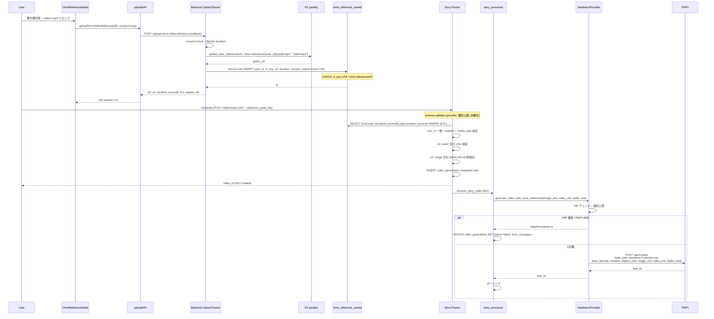
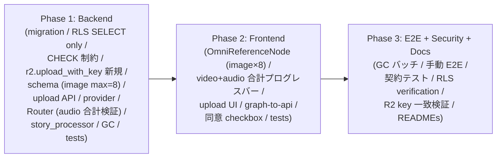
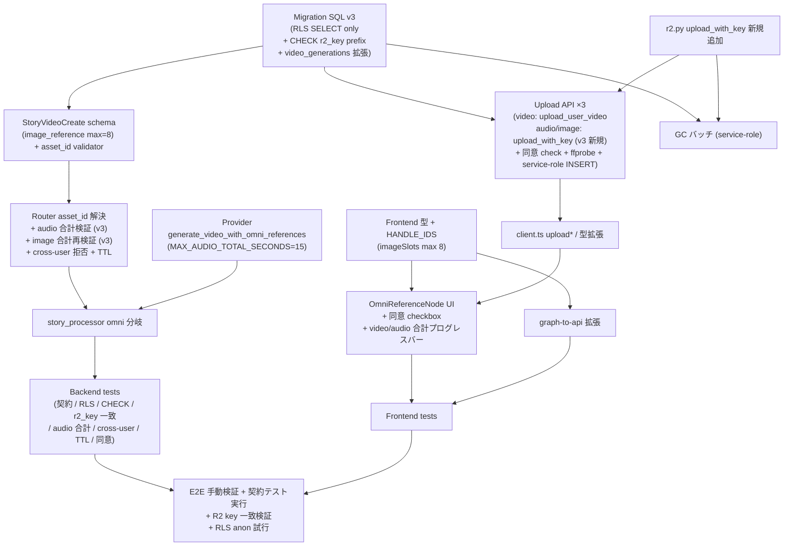

# Design Doc v3: Seedance 2.0 omni_reference 対応 (PiAPI 公式契約 + セキュリティ強化版)

**作成日**: 2026-05-18
**版数**: v3 (v1: `docs/plans/2026-05-18_seedance-omni-reference.md`, v2: `docs/plans/2026-05-18_seedance-omni-reference-v2.md`)
**ステータス**: Implemented (実装完了、運用ドキュメント反映済)
**作成者**: technical-designer
**関連 Doc**:
- v1 (致命的指摘 5 件あり、v2 で全反映): `docs/plans/2026-05-18_seedance-omni-reference.md`
- v2 (新規致命的指摘 3 件 + High 2 件あり、本 v3 で全反映): `docs/plans/2026-05-18_seedance-omni-reference-v2.md`
- `docs/plans/2026-05-13_gpt-image-2-and-seedance-2.0.md`
- `docs/plans/2026-05-18_seedance-detailed-params.md`
- `docs/plans/2026-05-18_duration-1s-step.md`

---

## 0. 改訂履歴 (v2 → v3)

v2 で発覚した致命的指摘 3 件 + Opus 4.8 補足 1 件 + 仕様訂正 1 件 + High 2 件、計 7 件を全反映。

| 区分 | ID | v2 の問題 | v3 の修正 |
|------|----|----------|----------|
| **P0 (Security blocker)** | **NEW-C-1** | RLS が `insert_own (auth.uid()=user_id)` を許可 → クライアント (anon/authenticated key) から `omni_reference_assets` に **任意の `public_url` (外部 URL)** を直接 INSERT 可能 → C-3 で塞いだ「外部 URL 注入禁止」が **無効化** される | **INSERT/UPDATE/DELETE policy を作成しない (= 既定で全 client 拒否)**、SELECT のみ `auth.uid() = user_id`。INSERT は backend service-role 経由のみ (`get_supabase()` は service-role キーで RLS bypass)。**CHECK 制約 `r2_key LIKE 'omni-references/%'`** を追加して `public_url` の R2 由来を構造保証。§15 に anon key 直接 INSERT 試行テスト + 外部 URL 直挿入試行テストを追加 (B-39, B-40) |
| **P0 (運用 blocker)** | **NEW-C-2** | 既存 `r2.upload_video(content, filename)` は内部で `key = f"videos/{filename}"` (L167) と prefix を hardcode 結合 → v2 §6.3 のように `filename="omni-references/{user_id}/{uuid}.mp4"` を渡すと実 R2 key は **`videos/omni-references/{user_id}/{uuid}.mp4`** という二重 prefix。DB `r2_key` 記録と GC 削除対象が不一致 → GC が R2 オブジェクトを削除できない | **既存 `upload_user_video(file_content, key, content_type)` (`r2.py:267`、prefix 結合なし)** を動画用に使用。audio/image 用に同等関数が無いため **新規 `upload_with_key(file_content, key, content_type)` を `r2.py` に追加** (汎用 key 直接指定 + Cache-Control)。v2 で示した `upload_video`/`upload_audio`/`upload_image` 再利用は撤回。§15 に「upload API の `response.url` が R2 実 key と一致」「GC で同 key 削除呼出」テスト追加 (B-41, B-42) |
| **P0 (仕様 blocker)** | **NEW-C-3** | v2 は各 audio ≤15s として扱っていた (`MAX_AUDIO_SECONDS_EACH=15.0`) が、PiAPI 公式 spec は **audio_urls 全体の合計 ≤15s 累計** (WebFetch 再確認済) | **`MAX_AUDIO_TOTAL_SECONDS = 15.0` に統一**、`MAX_AUDIO_SECONDS_EACH` 撤去。upload API 単体では合計不可知 → frontend に audio 合計プログレスバー追加 + Router 内 validator で asset 解決後に合計検証 (>15s なら 422)。§6.8 UI に audio 合計表示追加。§15 に「audio 3 本合計 16s → 422」テスト追加 (B-43) |
| **P0 (補足)** | **NEW-C-4** (Opus 4.8) | v2 §6.4 で base `image_url` (既存 1 個) + `image_reference_asset_ids` 最大 9 個 = **合計 10 件**になり得るが、PiAPI 上限は **image_urls ≤ 9** → 422 発生せず PiAPI 400 になる | **`image_reference_asset_ids` の max を 8 に削減** (base 1 個 + 追加 8 個 = 合計 9 件、PiAPI 上限内)。validator に `1 + len(image_reference_asset_ids) <= 9` 明示チェック追加 (base image_url が無い場合は単に追加 9 個まで)。Pydantic Field の `max_length` は **provider 非依存に厳しく 8** とし、router 内で base image_url の有無を加味して再検証 |
| **仕様訂正** | **NEW-S-1** | v2 は「合計 1-12」の制約を validator/AC/エッジケースに記載していたが、**OpenAPI spec に存在しない** (WebFetch 再確認済)。実在は各上限 (`image_urls≤9, video_urls≤3, audio_urls≤3`) のみ | **「合計 1-12」制約を全て撤去**。validator から合計上限/下限チェック削除 (ただし「参照素材を 1 つ以上指定」の最小チェックは保持: omni 分岐に入る前提)。エッジケース #8 (合計 13 → 422) 削除、AC-7 削除、テスト B-8 / B-17 を仕様修正 (各個別上限の境界に置換) |
| **High** | **H-A** | v2 AC-6 は `image_url=None` ベースだが、実フィールド `image_url: str` は **必須**。`None` を渡せない → AC-6 は実装不可能なテスト | **AC-6 を「audio_reference_asset_ids のみ指定 + 他全 reference 空 + image_url はダミー必須値を入れた状態で `audio 単独` 概念をどう扱うか」を明示**。設計判断: PiAPI 仕様の「audio 単独不可」は「image_urls か video_urls が必須」= base `image_url` が常に存在する限り **本仕様上 audio 単独は構造的に発生しない**。よって AC-6 は **削除**、対応する validator チェック (`image_count == 0 and video_count == 0 and audio_count > 0`) は防御的に残すが「実質到達不能、防御コード」とコメント明記。B-16 も削除 (代わりに「base image_url + audio refs のみ → 正常」B-16b に置換) |
| **High** | **H-B** | v2 AC で「POST /videos/story が 200 OK」と表記。実コード確認すると `/videos/story` は **`status_code=201` (Created)** | **AC-8, AC-10 内の「200 OK」表記を「201 Created」に統一**。E2E 手順とテストの期待ステータスも 201 に修正 |

### v3 で追加されるテスト/AC

| ID | 種別 | 内容 |
|----|------|------|
| B-39 | Backend | anon key で `omni_reference_assets` INSERT 試行 → RLS 拒否 (42501) |
| B-40 | Backend | service-role で `r2_key='external/x.mp4'` を INSERT → CHECK 制約違反で拒否 |
| B-41 | Backend | upload API レスポンス URL の path 部 = DB `r2_key` 完全一致 |
| B-42 | Backend | GC バッチで `r2.delete_file(r2_key)` 呼出引数が DB 記録と一致 |
| B-43 | Backend | audio_reference_asset_ids 3 本、合計 duration 16s → router で 422 |
| B-16b | Backend | base `image_url='https://.../x.jpg'` + audio_reference_asset_ids=[uuid] のみ → valid (audio 単独は構造的不可能を確認) |
| AC-19 (新) | AC | クライアント (anon key) からの `omni_reference_assets` 直接 INSERT は RLS により拒否される |
| AC-20 (新) | AC | audio 参照合計 > 15s → 422 (PiAPI 公式 spec 準拠) |

### v3 で削除されるテスト/AC

| ID | 削除理由 |
|----|---------|
| AC-6 | `image_url` は必須フィールドのため "audio 単独" は構造的不可能 (H-A) |
| AC-7 | 「合計 1-12」制約は OpenAPI spec に存在しない (NEW-S-1) |
| B-8 | 同上 (合計 13 個チェック撤去) |
| B-17 | 同上 (合計超過チェック削除) → 各個別上限境界 B-17a (image 9), B-17b (image 10 → 422) に置換 |
| B-16 | H-A 対応 (代わりに B-16b) |

---

## 1. 合意チェックリスト

| 項目 | 内容 | 設計上の反映箇所 |
|------|------|----------------|
| スコープ | Seedance 2.0 omni_reference 用の `video_urls` / `audio_urls` (+追加 `image_urls` 参照) 対応 + プロンプト `@image{N}` / `@video{N}` / `@audio{N}` 構文サポート | §3 §6 |
| スコープ | アップロード API: media 別 3 endpoints (video/audio/image) | §6.3 |
| スコープ | 新規テーブル `omni_reference_assets` 設計 + RLS (SELECT only, INSERT/UPDATE/DELETE は service-role のみ) + CHECK 制約 (r2_key prefix) + 72h TTL GC バッチ | §6.6 |
| スコープ | 著作権同意 checkbox (UI 必須、`consent_accepted=true` を schema 検証) | §6.3 §6.8 |
| スコープ | r2.py に汎用 `upload_with_key(file_content, key, content_type)` 新規追加 (prefix 結合なし) | §6.3.4 |
| 非スコープ | omni_reference 以外の Seedance パラメータ (generate_audio / seed / resolution / camerafixed / last_frame_url) | §3 |
| 非スコープ | usage カウント refund ロジック | §17 #2 |
| 非スコープ | Storyboard 経由 (`storyboard_processor.py`) での omni_reference 伝搬 | §17 #7 |
| 非スコープ | watermark, parent_task_id | §3 |
| 制約 | **preview 系統では VIP 必須** (`seedance-2-preview-vip` / `seedance-2-fast-preview-vip`)。preview 系統は `input.mode` 不要 | §3 §11 |
| 制約 | **image_urls ≤ 9 / video_urls ≤ 3 / audio_urls ≤ 3** (各個別上限のみ。「合計 1-12」は OpenAPI 非存在のため不適用) | §6 §11 |
| 制約 | **base `image_url` (既存 必須 str) + `image_reference_asset_ids` 合算 ≤ 9** (Pydantic Field max=8 + Router で base 有無加味) | §6.4 |
| 制約 | **audio_urls 合計 duration ≤ 15s** (各個別ではなく **合計**、PiAPI 公式 spec) | §6.4 §6.8 |
| 制約 | duration: 整数 4-15 (`schemas.py:316-318` 既存と整合) | §6 §11 |
| 制約 | audio 単独不可は構造的に発生しない (`image_url` 必須のため)、防御コードのみ残置 | §6.4 §11 |
| 制約 | 参照 URL は **公開アクセス可能必須** (本 Doc は既存 R2 バケットが既に `R2_PUBLIC_URL` 経由で公開済前提) | §6.3 §11 |
| 制約 | プロンプト内 `@image{N}` / `@video{N}` / `@audio{N}` の N が対応 asset 数を超える場合は 422 | §6.4 §11 |
| 制約 | 外部 URL の `StoryVideoCreate` 直接受付禁止。**asset_id 経由のみ + RLS で直接 INSERT も拒否 + CHECK 制約で r2_key prefix 強制** (3 重防御) | §6.4 §6.6 (security) |
| 後方互換 | 既存 Seedance リクエスト (omni 未指定) は変更なし、新フィールド全て Optional | §12 |
| 検証 | 新規 backend/ frontend テスト 38+ 件 (v2 35 + v3 追加 B-39〜B-43, B-16b, AC-19, AC-20) + 既存全件 pass | §15 |

---

## 2. 背景・課題

PiAPI Seedance 2.0 の公式仕様には参照素材として **動画/音声/画像 URL** を受け付ける機能 (一般に omni_reference と呼ばれる) が存在し、動画と音声と画像の参照素材を mix して与えてモーション・スタイル・BGM/環境音を参照させることができる。

| モード | 入力素材 | 用途 |
|--------|---------|------|
| `text_to_video` | prompt のみ | 純テキストからの生成 |
| `first_last_frames` | start (+ end) フレーム画像 | 始終フレーム指定 (対応済) |
| **omni_reference** (本 Doc) | **`image_urls` / `video_urls` / `audio_urls` mix** | スタイル/モーション/音声を mix して参照 |

現状実装は **image_urls のみ (単数)** に対応しており、`piapi_seedance_provider.py` で `video_urls / audio_urls` 未対応。

### 2.1 PiAPI 公式仕様 (本 Doc が依拠する事実、WebFetch 再確認済)

公式 payload 例:
```json
{
  "model": "seedance",
  "task_type": "seedance-2-preview-vip",
  "input": {
    "prompt": "The character in @image1 dances to @audio1",
    "image_urls": ["https://example.com/character.jpg"],
    "audio_urls": ["https://example.com/music.mp3"],
    "duration": 10,
    "aspect_ratio": "16:9"
  },
  "config": { "service_mode": "public" }
}
```

確定事項 (v3 で再確認):
- **task_type は既存の preview 系統をそのまま使用** (omni 専用 task_type 不要)
- **`input.mode` フィールドは不要** (preview 系統)
- **フィールド名**: `video_urls` / `audio_urls` / `image_urls`
- **VIP モデル必須** (`-vip` suffix)
- 各上限: **image ≤ 9, video ≤ 3, audio ≤ 3** (「合計 1-12」は **OpenAPI 非存在**、v3 で撤去)
- audio 単独不可 (image か video が必須) — `image_url` 必須なので構造的に到達しない
- **audio_urls 合計 duration ≤ 15s** (v3 訂正)
- duration: 整数 4-15
- プロンプト内 `@image1` / `@video1` / `@audio1` 構文 (1-indexed)
- URL は公開アクセス可能必須

---

## 3. 目標

### A. Backend: Provider 拡張 (`video_urls` / `audio_urls` / 追加 `image_urls` payload 送信)
- `PiAPISeedanceProvider.generate_video_with_omni_references()` 新規メソッド
- **既存 task_type をそのまま使用**
- **`input.mode` フィールドは送信しない** (preview 系統不要)
- payload に `input.image_urls` / `input.video_urls` / `input.audio_urls` を追加
- 各個別上限の validate (image≤9, video≤3, audio≤3)、VIP 必須チェック (env から判定)
- **audio 合計 duration ≤15s は asset 解決後 Router で検証** (Provider 層では URL のみ受領、duration 不知)

### B. Backend: 新規テーブル `omni_reference_assets` + アップロード API
- アップロード API (3 endpoints):
  - `POST /api/v1/videos/upload-omni-video-reference` (MP4/MOV, ≤15.4s, ≤50MB)
  - `POST /api/v1/videos/upload-omni-audio-reference` (MP3/WAV, **単体は ≤15s** だが合計検証は Router 側)
  - `POST /api/v1/videos/upload-omni-image-reference` (JPEG/PNG/WEBP, ≤10MB)
- レスポンスは `{ id: uuid, url, media_type, duration_seconds, content_type, file_size_bytes, expires_at }`
- **R2 アップロードは `upload_with_key(file_content, key, content_type)` (新規) を使用** — prefix 結合なし、key を直接指定
- key 形式: `omni-references/{user_id}/{uuid}.{ext}`
- 著作権同意 (`consent_accepted: bool`) を multipart form フィールドで受領、`false` なら 422

### C. Backend: スキーマ拡張 + プロンプト @構文 validate
- `StoryVideoCreate` に **`image_reference_asset_ids: list[UUID] | None` (max=8) / `video_reference_asset_ids: list[UUID] | None` (max=3) / `audio_reference_asset_ids: list[UUID] | None` (max=3)** を追加 (URL ではなく asset_id)
- Pydantic validator:
  - VIP モデル必須 (env が VIP suffix を含むかどうか実行時判定 — schema レベルでは provider=seedance のみチェックし、VIP 違反は BG で `failed` 化)
  - 各 list の長さ上限 (image ≤ 8 ※追加分、video ≤ 3, audio ≤ 3)
  - **base `image_url` + `image_reference_asset_ids` 合算 ≤ 9** (Router で再検証も含む)
  - 「合計 1-12」チェックは撤去 (v3)
  - 「audio 単独不可」は構造的に発生しないため防御コードのみ
  - プロンプト (`story_text`) 内 `@image{N}` / `@video{N}` / `@audio{N}` の N が対応 count を超えていない
  - **外部 URL の直接受付禁止** (Pydantic 型レベルで保証: UUID 型のみ受領)
- Router 内で `user_id` 一致、`expires_at > now()`、media_type 一致を確認し URL 取得、**audio 合計 duration ≤15s 検証**

### D. Backend: DB スキーマ追加
- 新規テーブル `omni_reference_assets` (RLS SELECT only + CHECK r2_key prefix)
- 既存 `video_generations` には `image_reference_urls jsonb` / `video_reference_urls jsonb` / `audio_reference_urls jsonb` を追加
- 既存行への影響なし (全 NULL 既定)

### E. Frontend: 新規 OmniReferenceNode
- video × 3 + audio × 3 + image (追加) × 8 slots
- スロットには **`asset_id`** を保持 (URL ではない)
- ImageInputNode の Dropzone パターン踏襲
- 著作権同意 checkbox (必須、未チェックなら Generate 不可)

### F. Frontend: アップロード後 duration 表示と合計時間 UI 警告
- video 合計 > 15.4s で警告 (赤)
- **audio 合計 > 15s で警告 (赤) — v3 で新規追加**

### G. Frontend: graph-to-api 変換
- 新フィールドは `*_reference_asset_ids: string[]` (UUID 文字列) として送信

### 非スコープ

- `generate_audio` / `seed` / `resolution` / `camerafixed` / `last_frame_url`
- `watermark` / `parent_task_id`
- Storyboard 経由 (`storyboard_processor.py`)
- usage refund ロジック (§17 #2)
- GA 系統 (`input.mode="omni_reference"`) 対応 — preview 系統のみ対応

---

## 4. 既存コードベース調査

### 4.1 実装ファイルマッピング

| 対象 | パス | 役割・状態 |
|------|------|----------|
| Seedance Provider | `movie-maker-api/app/external/piapi_seedance_provider.py` | payload 構築、task_type 切替 |
| Seedance env | `movie-maker-api/app/core/config.py:51-52` | `PIAPI_SEEDANCE_TASK_TYPE=seedance-2-preview-vip` |
| Story Processor | `movie-maker-api/app/tasks/story_processor.py:115-205` | DB → extra_params → provider 呼出 |
| **R2 クライアント (拡張)** | `movie-maker-api/app/external/r2.py` | `get_public_url()` (L37-41) は `R2_PUBLIC_URL` 返却 = バケット全体公開。**`upload_user_video(file_content, key, content_type)` (L267, prefix なし)** を動画用に使用、**汎用 `upload_with_key()` を v3 で新規追加** (audio/image 用)。`upload_video(L164)/upload_audio(L180)/upload_image(L91)` の filename 引数は内部で `videos/`/`bgm/`/`images/` を prefix 結合するため omni-references 用途では **使用不可** |
| Backend Schema | `movie-maker-api/app/videos/schemas.py:276-353` | `StoryVideoCreate` (実フィールド: `image_url: str` (L283, 必須), `story_text: str` (L284)) |
| Backend Router | `movie-maker-api/app/videos/router.py` | DB INSERT + `POST /upload-image` パターン、`/videos/story` は **`status_code=201`** |
| Frontend 雛形 | `movie-maker/components/node-editor/nodes/ImageInputNode.tsx` | 画像アップロード雛形 |
| ProviderNode UI | `movie-maker/components/node-editor/nodes/ProviderNode.tsx` | Seedance Pro/Fast 選択 |
| NodePalette | `movie-maker/components/node-editor/NodePalette.tsx` | `omniReference` 追加 |
| Nodes availability | `movie-maker/components/node-editor/hooks/useNodesAvailability.ts` | `seedance` 配列に `omniReference` 追加 |
| Graph→API 変換 | `movie-maker/components/node-editor/utils/graph-to-api.ts` | `*_reference_asset_ids` マッピング |
| API クライアント | `movie-maker/lib/api/client.ts` | `StoryVideoCreateRequest` 拡張 + アップロード関数 |
| HANDLE_IDS | `movie-maker/lib/types/node-editor.ts` | `OMNI_REFERENCE_*` 追加 |

### 4.2 既存 R2 公開状態と関数選定 (v3 訂正)

```python
# r2.py L37-41 (実コード)
def get_public_url(key: str) -> str:
    if settings.R2_PUBLIC_URL:
        return f"{settings.R2_PUBLIC_URL.rstrip('/')}/{key}"
    return f"https://{settings.R2_BUCKET_NAME}.r2.dev/{key}"

# r2.py L164 (実コード抜粋)
async def upload_video(file_content: bytes, filename: str) -> str:
    key = f"videos/{filename}"  # ← prefix hardcode
    ...

# r2.py L267 (実コード抜粋)
async def upload_user_video(file_content: bytes, key: str, content_type: str) -> str:
    # key 直接指定、prefix 結合なし
    ...
```

**結論**:
- 動画 omni-references → `upload_user_video(content, "omni-references/{u}/{id}.mp4", "video/mp4")` を使用
- 音声/画像 omni-references → `upload_with_key()` を v3 で新規追加して使用 (audio/image 用の prefix なし関数が無い)
- `upload_video/upload_audio/upload_image` の `filename` 引数経由は **採用しない** (二重 prefix で R2 key 不一致を起こす)

### 4.3 既存類似機能検索結果

- `video_urls`, `audio_urls`, `omni_reference` を `movie-maker-api/app/` 配下で grep → 既存実装なし → 新規実装
- 動画アップロード API → 既存 `POST /upload-image` (画像のみ)、video/audio 専用は未実装
- 結論: 新規実装。R2 部分は `upload_user_video` (既存、動画) + `upload_with_key` (新規、汎用) を使用

---

## 5. 採用案 (代替案比較)

### 5.1 Provider 拡張方針

| 案 | 内容 | 評価 |
|----|------|------|
| A (採用) | 新規メソッド `generate_video_with_omni_references()` を追加 | 既存完全互換、TDD 容易、3 メソッドで `_post_task()` ヘルパー抽出可能 |
| B | 既存 `generate_video()` を拡張 | 引数膨張、後方互換テスト組合せ爆発 |

**採用**: 案 A。

### 5.2 アップロード API 形態

| 案 | 内容 | 評価 |
|----|------|------|
| B (採用) | media 別 3 endpoints | 既存パターン整合、Content-Type / size / duration 上限が media 別に明確 |

### 5.3 asset_id 経由 vs URL 直接受付 (セキュリティ)

| 案 | 内容 | 評価 |
|----|------|------|
| B (採用) | アップロード API が `asset_id (UUID)` を返却、`StoryVideoCreate` は `*_reference_asset_ids: list[UUID]` のみ受領 | 外部 URL 完全遮断、cross-user 拒否、TTL GC 可能 |

### 5.4 RLS 設計 (v3 訂正)

| 案 | 内容 | 評価 |
|----|------|------|
| A | v2 案: SELECT/INSERT/DELETE 全て `auth.uid()=user_id` | INSERT 経路がクライアントに開いているため任意 `public_url` 注入可能 |
| **B (採用)** | **SELECT のみ `auth.uid()=user_id`、INSERT/UPDATE/DELETE policy 不作成 (= 既定で全 client 拒否)。INSERT は backend service-role 経由のみ (RLS bypass)。GC バッチも service-role で DELETE** | **3 重防御**: (1) Pydantic UUID 型で外部 URL 文字列遮断、(2) RLS で直接 INSERT 拒否、(3) CHECK 制約 `r2_key LIKE 'omni-references/%'` で R2 由来強制 |

### 5.5 R2 アップロード関数選定 (v3 新規)

| 案 | 内容 | 評価 |
|----|------|------|
| A | v2 案: `upload_video/upload_audio/upload_image` の `filename` 引数で omni-references prefix を渡す | **R2 key 二重 prefix で DB 記録と不一致**。GC が削除できない致命的バグ |
| **B (採用)** | **動画は既存 `upload_user_video(key=...)` (L267) を使用、audio/image は `upload_with_key(file_content, key, content_type)` を v3 で新規追加** | prefix なしで key を直接指定、DB `r2_key` と R2 実 key が完全一致、GC 削除可能 |

### 5.6 audio 上限解釈 (v3 訂正)

| 案 | 内容 | 評価 |
|----|------|------|
| A | v2 案: 各 audio ≤15s (個別) | **PiAPI 公式 spec 不一致**。各 5s × 3 本 = 15s OK のはずだが、各 8s × 3 本 = 24s は実際 400 になる |
| **B (採用)** | **`MAX_AUDIO_TOTAL_SECONDS = 15.0`** (合計)。upload API では単体 ≤15s のみ強制 (合計は upload 時点で不可知)、Router 内で asset 解決後に合計検証 | PiAPI 公式 spec 準拠 |

### 5.7 image 上限の base 加味 (v3 補足)

| 案 | 内容 | 評価 |
|----|------|------|
| A | v2 案: `image_reference_asset_ids` max=9 | base `image_url` (常に存在) を加味すると合計 10 → PiAPI 400 |
| **B (採用)** | **`image_reference_asset_ids` max=8** (Pydantic Field) + Router で `1 + len(...) <= 9` 再検証 | PiAPI 上限 image_urls≤9 厳守 |

---

## 6. 設計詳細

### 6.1 Backend 型定義 (`piapi_seedance_provider.py`)

```python
MAX_IMAGE_URLS = 9          # base image_url + reference 合算上限
MAX_VIDEO_URLS = 3
MAX_AUDIO_URLS = 3
MAX_VIDEO_TOTAL_SECONDS = 15.4
MAX_AUDIO_TOTAL_SECONDS = 15.0   # v3: 各個別ではなく合計 (PiAPI 公式)
# v2 の MAX_TOTAL_REFERENCES / MIN_TOTAL_REFERENCES / MAX_AUDIO_SECONDS_EACH は撤去
```

### 6.2 Provider 実装 (新規メソッド)

```python
async def generate_video_with_omni_references(
    self,
    prompt: str,
    duration: int = 5,
    aspect_ratio: str = "9:16",
    mode: Optional[str] = None,
    image_urls: Optional[list[str]] = None,
    video_urls: Optional[list[str]] = None,
    audio_urls: Optional[list[str]] = None,
) -> str:
    """
    Seedance 2.0 omni_reference 用 generate (preview 系統)

    Args:
        prompt: プロンプト (最大4000文字、@image1/@video1/@audio1 構文サポート)
        duration: 4-15 整数
        aspect_ratio: アスペクト比
        mode: 'pro' | 'fast' | None
        image_urls: 画像参照 URL リスト (0-9)
        video_urls: 動画参照 URL リスト (0-3, 合計 ≤15.4s)
        audio_urls: 音声参照 URL リスト (0-3, 合計 ≤15.0s ※Router で事前検証済)

    Returns:
        str: task_id

    Raises:
        VideoProviderError: VIP 違反 / 個別上限違反
    """
    task_type = self._resolve_task_type(mode)
    if not task_type.endswith("-vip"):
        raise VideoProviderError(
            "omni_reference 用途は VIP モデル必須です "
            "(PIAPI_SEEDANCE_TASK_TYPE に -vip suffix 必須)"
        )

    image_urls = image_urls or []
    video_urls = video_urls or []
    audio_urls = audio_urls or []

    # v3: 各個別上限のみ検証 (「合計 1-12」は撤去)
    if len(image_urls) > MAX_IMAGE_URLS:
        raise VideoProviderError(f"image_urls は最大 {MAX_IMAGE_URLS} 個")
    if len(video_urls) > MAX_VIDEO_URLS:
        raise VideoProviderError(f"video_urls は最大 {MAX_VIDEO_URLS} 個")
    if len(audio_urls) > MAX_AUDIO_URLS:
        raise VideoProviderError(f"audio_urls は最大 {MAX_AUDIO_URLS} 個")

    # 防御コード (Router で事前検証済、構造的には到達不能)
    if not image_urls and not video_urls and audio_urls:
        raise VideoProviderError(
            "audio_urls 単独不可。image_urls か video_urls が必要 (防御)"
        )

    input_payload: dict = {
        "prompt": prompt[:4000],
        "duration": int(duration),
        "aspect_ratio": aspect_ratio,
        "resolution": self.resolution,
    }
    if image_urls:
        input_payload["image_urls"] = image_urls
    if video_urls:
        input_payload["video_urls"] = video_urls
    if audio_urls:
        input_payload["audio_urls"] = audio_urls
    # input.mode は送信しない (preview 系統不要)

    payload = {
        "model": "seedance",
        "task_type": task_type,
        "input": input_payload,
        "config": {"service_mode": "public"},
    }
    return await self._post_task(payload)
```

### 6.3 Backend Upload API + asset テーブル登録

#### 6.3.1 `POST /api/v1/videos/upload-omni-video-reference`

- multipart/form-data
  - `file: UploadFile` (`video/mp4` or `video/quicktime`)
  - `consent_accepted: bool` (form field、false なら 422)
- file size ≤ 50MB (413)
- ffprobe で duration 計測、>15.4s なら 422
- **`r2.upload_user_video(file_content, key=f"omni-references/{user_id}/{uuid}.{ext}", content_type="video/mp4")` 呼出** (既存関数、prefix なし、L267)
- `omni_reference_assets` テーブルに service-role キーで INSERT (consent_accepted=true, expires_at=now()+72h, r2_key=同じ key)
- レスポンス: `{ id, url, media_type:'video', duration_seconds, content_type, file_size_bytes, expires_at }`

#### 6.3.2 `POST /api/v1/videos/upload-omni-audio-reference`

- multipart/form-data
  - `file: UploadFile` (`audio/mpeg` or `audio/wav`)
  - `consent_accepted: bool`
- file size ≤ 10MB
- ffprobe で duration、**単体 >15s は 422** (合計検証は Router 側)
- **`r2.upload_with_key(file_content, key=f"omni-references/{user_id}/{uuid}.{ext}", content_type="audio/mpeg")` 呼出** (v3 新規追加)
- `omni_reference_assets` INSERT (media_type='audio')

#### 6.3.3 `POST /api/v1/videos/upload-omni-image-reference`

- multipart/form-data
  - `file: UploadFile` (`image/jpeg` or `image/png` or `image/webp`)
  - `consent_accepted: bool`
- file size ≤ 10MB
- duration は null
- **`r2.upload_with_key(file_content, key=f"omni-references/{user_id}/{uuid}.{ext}", content_type=detected)` 呼出**
- `omni_reference_assets` INSERT (media_type='image', duration_seconds=NULL)

#### 6.3.4 r2.py 拡張 (v3 新規)

```python
# movie-maker-api/app/external/r2.py に新規追加
async def upload_with_key(
    file_content: bytes,
    key: str,
    content_type: str,
) -> str:
    """
    汎用 R2 アップロード: key を直接指定 (prefix 結合なし)

    既存 upload_video/upload_audio/upload_image は filename を内部で
    videos/bgm/images prefix と結合するため、omni-references/ など
    任意 prefix を使いたいケースでは本関数を使用する。

    Args:
        file_content: ファイル本体
        key: R2 オブジェクトキー (例: "omni-references/{user_id}/{uuid}.mp4")
        content_type: MIME (例: "video/mp4", "audio/mpeg", "image/jpeg")

    Returns:
        str: 公開 URL (R2_PUBLIC_URL/{key} または .r2.dev/{key})
    """
    client = get_r2_client()
    client.put_object(
        Bucket=settings.R2_BUCKET_NAME,
        Key=key,
        Body=file_content,
        ContentType=content_type,
        CacheControl="public, max-age=31536000, immutable",
    )
    return get_public_url(key)
```

- 既存 `upload_user_video` (L267) は動画用にそのまま流用
- 新規 `upload_with_key` で audio/image を勘案

### 6.4 Schema 変更 (`schemas.py`)

```python
# StoryVideoCreate に追加 (v3)
image_reference_asset_ids: Optional[list[UUID]] = Field(
    default=None,
    max_length=8,  # v3: base image_url(1個必須) と合算で 9 以下にするため
    description="omni_reference 用追加画像参照の asset_id (omni_reference_assets.id)。"
                "最大 8 個 (base image_url と合算で PiAPI 上限 9 に収まる)。"
                "外部 URL 直接受付不可 (アップロード API 経由必須)"
)
video_reference_asset_ids: Optional[list[UUID]] = Field(
    default=None,
    max_length=3,
    description="omni_reference 用動画参照の asset_id。最大 3 個、合計 ≤15.4s"
)
audio_reference_asset_ids: Optional[list[UUID]] = Field(
    default=None,
    max_length=3,
    description="omni_reference 用音声参照の asset_id。最大 3 個、**合計** ≤15s (PiAPI 公式)"
)

@model_validator(mode='after')
def validate_omni_references(self) -> Self:
    """
    omni_reference の事前 validate (422 で reject 可能な部分のみ):
      1. provider が seedance (or 未指定 = env 既定 seedance)
      2. 個別上限: image_url 有無含めて image ≤9, video ≤3, audio ≤3
      3. @構文 N が対応 count 以下
    VIP 制約 / audio 合計時間 / PiAPI 側エラーは別所で検証:
      - audio 合計 → Router (asset 解決後)
      - VIP → BG 内 Provider で failed 化
    """
    has_video_refs = bool(self.video_reference_asset_ids)
    has_audio_refs = bool(self.audio_reference_asset_ids)
    has_image_refs = bool(self.image_reference_asset_ids)
    if not (has_video_refs or has_audio_refs or has_image_refs):
        return self  # omni 未使用、skip

    if self.video_provider not in (None, VideoProvider.SEEDANCE):
        raise ValueError(
            "*_reference_asset_ids は video_provider=seedance でのみ利用可能"
        )

    # base image_url (実フィールド schemas.py:283、必須 str) は常に 1 個
    base_image_count = 1 if self.image_url else 0
    image_count = base_image_count + len(self.image_reference_asset_ids or [])
    video_count = len(self.video_reference_asset_ids or [])
    audio_count = len(self.audio_reference_asset_ids or [])

    # v3: 各個別上限のみ (「合計 1-12」は撤去)
    if image_count > 9:
        raise ValueError(
            f"image_urls 合計は 9 個まで "
            f"(base image_url {base_image_count} + 追加 {len(self.image_reference_asset_ids or [])})"
        )
    # video/audio は Pydantic Field max_length で既に検証済

    # 防御コード: audio 単独 (image_url 必須なので構造的に到達不能だが念のため)
    if image_count == 0 and video_count == 0 and audio_count > 0:
        raise ValueError("audio 単独不可。image または video を 1 つ以上指定 (防御)")

    # @構文 validate (実フィールド名: story_text L284)
    import re
    text = self.story_text or ''
    for tag, count in [('image', image_count), ('video', video_count), ('audio', audio_count)]:
        for match in re.finditer(rf'@{tag}(\d+)', text):
            n = int(match.group(1))
            if n < 1 or n > count:
                raise ValueError(
                    f"プロンプト内の @{tag}{n} は範囲外 (指定された {tag} 参照は {count} 個)"
                )
    return self
```

**Router 側** (`videos/router.py`):
```python
# asset_id → URL 解決 (cross-user 拒否 + TTL チェック) + audio 合計検証
MAX_AUDIO_TOTAL_SECONDS = 15.0

async def resolve_asset_ids(
    asset_ids: list[UUID],
    user_id: UUID,
    media_type: str,
) -> list[tuple[str, Optional[float]]]:
    """
    Returns: [(public_url, duration_seconds), ...] 順序保持
    """
    if not asset_ids:
        return []
    rows = (
        supabase.table('omni_reference_assets')
        .select('id,public_url,user_id,expires_at,media_type,duration_seconds')
        .in_('id', [str(i) for i in asset_ids])
        .execute()
    )
    result = []
    for aid in asset_ids:
        row = next((r for r in rows.data if r['id'] == str(aid)), None)
        if row is None:
            raise HTTPException(422, f"asset_id {aid} not found")
        if row['user_id'] != str(user_id):
            raise HTTPException(422, f"asset_id {aid} not found")  # 詳細リーク防止
        if row['media_type'] != media_type:
            raise HTTPException(422, f"asset_id {aid} は media_type 不一致")
        if parse(row['expires_at']) < datetime.utcnow():
            raise HTTPException(422, f"asset_id {aid} は期限切れ")
        result.append((row['public_url'], row.get('duration_seconds')))
    return result

# Router 内 (POST /videos/story)
audio_resolved = await resolve_asset_ids(
    payload.audio_reference_asset_ids or [], user_id, 'audio',
)
audio_total = sum((d or 0.0) for _, d in audio_resolved)
if audio_total > MAX_AUDIO_TOTAL_SECONDS:
    raise HTTPException(
        422,
        f"audio 参照の合計時間 {audio_total:.1f}s が上限 "
        f"{MAX_AUDIO_TOTAL_SECONDS}s を超過 (PiAPI 公式仕様)"
    )

# v3: image 合計の再検証 (Pydantic max=8 + base 加味)
image_resolved = await resolve_asset_ids(
    payload.image_reference_asset_ids or [], user_id, 'image',
)
base_image = 1 if payload.image_url else 0
if base_image + len(image_resolved) > 9:
    raise HTTPException(422, "image_urls 合計は 9 個まで")
```

### 6.5 Story Processor 拡張 (`story_processor.py`)

```python
# DB から URL snapshot 取得 (INSERT 時に解決済 URL を保存)
image_reference_urls = video_data.get("image_reference_urls") or []
video_reference_urls = video_data.get("video_reference_urls") or []
audio_reference_urls = video_data.get("audio_reference_urls") or []

elif provider_name == "seedance":
    if image_reference_urls or video_reference_urls or audio_reference_urls:
        # base image_url を image_urls の先頭に追加
        all_image_urls = ([image_url] if image_url else []) + image_reference_urls
        task_id = await provider.generate_video_with_omni_references(
            prompt=prompt,
            duration=duration,
            aspect_ratio=aspect_ratio,
            mode=seedance_mode,
            image_urls=all_image_urls,
            video_urls=video_reference_urls,
            audio_urls=audio_reference_urls,
        )
    else:
        task_id = await provider.generate_video(...)  # 既存
```

### 6.6 Migration (`docs/migrations/20260518_add_omni_reference_assets.sql`)

```sql
-- 1. 新規テーブル omni_reference_assets
CREATE TABLE IF NOT EXISTS omni_reference_assets (
  id uuid PRIMARY KEY DEFAULT gen_random_uuid(),
  user_id uuid NOT NULL REFERENCES auth.users(id) ON DELETE CASCADE,
  r2_key text NOT NULL,
  public_url text NOT NULL,
  media_type text NOT NULL CHECK (media_type IN ('video', 'audio', 'image')),
  content_type text NOT NULL,
  duration_seconds numeric,
  file_size_bytes bigint NOT NULL,
  consent_accepted boolean NOT NULL DEFAULT false,
  created_at timestamptz NOT NULL DEFAULT now(),
  expires_at timestamptz NOT NULL DEFAULT (now() + interval '72 hours'),
  -- v3: r2_key prefix を CHECK 制約で強制 → 外部 URL 注入の構造防止
  CONSTRAINT r2_key_prefix CHECK (r2_key LIKE 'omni-references/%'),
  -- v3: public_url も r2_key 同等の prefix で R2 由来であることを補強検証
  CONSTRAINT public_url_https CHECK (public_url LIKE 'https://%')
);
CREATE INDEX IF NOT EXISTS idx_omni_ref_user ON omni_reference_assets(user_id);
CREATE INDEX IF NOT EXISTS idx_omni_ref_expires ON omni_reference_assets(expires_at);

-- 2. RLS (v3: SELECT only、INSERT/UPDATE/DELETE policy 不作成 = 全 client 拒否)
ALTER TABLE omni_reference_assets ENABLE ROW LEVEL SECURITY;

CREATE POLICY "select_own" ON omni_reference_assets
  FOR SELECT USING (auth.uid() = user_id);

-- INSERT/UPDATE/DELETE policy は意図的に作成しない
--   → anon/authenticated key からの直接操作は RLS により全拒否
--   → backend service-role キーは RLS bypass のため動作問題なし
--   → これにより client から任意 public_url を持つ row を作成する経路を完全遮断

-- 3. video_generations に URL snapshot カラム追加
ALTER TABLE video_generations
  ADD COLUMN IF NOT EXISTS image_reference_urls JSONB DEFAULT NULL,
  ADD COLUMN IF NOT EXISTS video_reference_urls JSONB DEFAULT NULL,
  ADD COLUMN IF NOT EXISTS audio_reference_urls JSONB DEFAULT NULL;

ALTER TABLE video_generations
  ADD CONSTRAINT image_reference_urls_max_9 CHECK (
    image_reference_urls IS NULL OR jsonb_array_length(image_reference_urls) <= 9
  ),
  ADD CONSTRAINT video_reference_urls_max_3 CHECK (
    video_reference_urls IS NULL OR jsonb_array_length(video_reference_urls) <= 3
  ),
  ADD CONSTRAINT audio_reference_urls_max_3 CHECK (
    audio_reference_urls IS NULL OR jsonb_array_length(audio_reference_urls) <= 3
  );
```

**GC バッチ** (Celery beat or cron、service-role キー使用):
```python
async def gc_expired_omni_assets():
    # service-role キーで実行 (RLS bypass)
    rows = (
        supabase.table('omni_reference_assets')
        .select('id,r2_key')
        .lt('expires_at', datetime.utcnow().isoformat())
        .execute()
    )
    for row in rows.data:
        await r2.delete_file(row['r2_key'])  # v3: r2_key と DB が一致するので削除可能
        supabase.table('omni_reference_assets').delete().eq('id', row['id']).execute()
```

### 6.7 Frontend 型定義 (`lib/types/node-editor.ts`)

```ts
export type NodeType = '...' | 'omniReference';

export interface OmniReferenceSlot {
  assetId: string | null;
  url?: string;
  filename?: string;
  durationSeconds?: number;
  mediaType: 'image' | 'video' | 'audio';
}

export interface OmniReferenceNodeData extends BaseNodeData {
  type: 'omniReference';
  imageSlots: OmniReferenceSlot[];  // 最大 8 (base image_url と合算で 9)
  videoSlots: [OmniReferenceSlot, OmniReferenceSlot, OmniReferenceSlot];
  audioSlots: [OmniReferenceSlot, OmniReferenceSlot, OmniReferenceSlot];
  consentAccepted: boolean;
}

export const HANDLE_IDS = {
  // ...
  OMNI_REFERENCE_OUTPUT: 'omni_reference',
  OMNI_REFERENCE_INPUT: 'omni_reference_input',
} as const;
```

### 6.8 OmniReferenceNode UI

`components/node-editor/nodes/OmniReferenceNode.tsx`:
- video slot × 3 (合計プログレスバー / 15.4s)
- audio slot × 3 (**合計プログレスバー / 15.0s** — v3 新規追加、各個別 + 合計両方表示)
- image slot × 8 (折り畳み)
- **著作権同意 checkbox** (必須):
  ```
  「アップロードする音声/動画/画像の権利を私が保有しているか、利用許諾を得ている」
  ```
- 未チェック時 Dropzone disable + Generate disable

### 6.9 graph-to-api.ts

```ts
if (provider?.provider === 'seedance') {
  const omniNode = nodes.find(
    n => n.data.type === 'omniReference' &&
         isConnectedToProvider(n.id, providerNode.id, edges)
  );
  if (omniNode) {
    const d = omniNode.data as OmniReferenceNodeData;
    if (!d.consentAccepted) {
      throw new Error('著作権同意が必要です');
    }
    const imgIds = d.imageSlots.filter(s => s.assetId).map(s => s.assetId!);
    const vidIds = d.videoSlots.filter(s => s.assetId).map(s => s.assetId!);
    const audIds = d.audioSlots.filter(s => s.assetId).map(s => s.assetId!);
    if (imgIds.length) request.image_reference_asset_ids = imgIds;
    if (vidIds.length) request.video_reference_asset_ids = vidIds;
    if (audIds.length) request.audio_reference_asset_ids = audIds;
  }
}
```

### 6.10 API クライアント (`lib/api/client.ts`)

```ts
// StoryVideoCreateRequest 拡張
{
  // ... 既存
  image_reference_asset_ids?: string[];
  video_reference_asset_ids?: string[];
  audio_reference_asset_ids?: string[];
}

export async function uploadOmniVideoReference(
  file: File, consentAccepted: boolean
): Promise<{
  id: string;
  url: string;
  media_type: 'video';
  duration_seconds: number;
  content_type: string;
  file_size_bytes: number;
  expires_at: string;
}>;

export async function uploadOmniAudioReference(file: File, consentAccepted: boolean): Promise<...>;
export async function uploadOmniImageReference(file: File, consentAccepted: boolean): Promise<...>;
```

---

## 7. アーキテクチャ図

```mermaid
graph TB
  subgraph Frontend
    OR["OmniReferenceNode<br/>(image×8 + video×3 + audio×3 slots<br/>+ video/audio 合計プログレスバー<br/>+ 著作権同意 checkbox)"]
    PN["ProviderNode<br/>(Seedance, OMNI_REFERENCE_INPUT handle)"]
    G2A["graph-to-api.ts<br/>(*_reference_asset_ids マッピング)"]
    UPL["uploadOmni{Video,Audio,Image}Reference"]
    API["client.ts<br/>(StoryVideoCreateRequest)"]
  end

  subgraph Backend
    UPR["videos/router.py<br/>POST /upload-omni-{video,audio,image}-reference<br/>(著作権同意 + ffprobe<br/>+ r2.upload_user_video / upload_with_key (v3 新規)<br/>+ service-role INSERT)"]
    R2[("R2 (バケット全体公開)<br/>omni-references/{user_id}/{uuid}.{ext}<br/>※prefix 二重結合なし (v3 修正)")]
    OAT[("omni_reference_assets<br/>RLS: SELECT only<br/>INSERT/UPDATE/DELETE は service-role のみ<br/>CHECK: r2_key LIKE 'omni-references/%'<br/>72h TTL")]
    GC["GC バッチ<br/>(日次、service-role)"]
    SCH["schemas.py<br/>StoryVideoCreate<br/>+ validate_omni_references<br/>(image≤9 base 加味, video≤3, audio≤3)"]
    ROUTER["videos/router.py<br/>POST /videos/story (201)<br/>asset_id → URL 解決<br/>cross-user 拒否 + TTL<br/>+ audio 合計 ≤15s 検証 (v3)<br/>+ image 合計 ≤9 再検証 (v3)"]
    DB[("Supabase<br/>video_generations<br/>+ {image,video,audio}_reference_urls JSONB snapshot")]
    SP["story_processor.py<br/>(omni 分岐)"]
    SDP["PiAPISeedanceProvider<br/>generate_video_with_omni_references()"]
  end

  OR -->|file + consent| UPL
  UPL -->|POST /upload-omni-*| UPR
  UPR -->|upload_user_video / upload_with_key| R2
  UPR -->|service-role INSERT| OAT
  OAT -->|asset row| UPR
  UPR -->|{id, url, duration, ...}| UPL
  UPL -->|slot.assetId 更新| OR
  OR -->|connected| PN
  PN -->|asset_ids| G2A
  G2A --> API
  API -->|POST /videos/story<br/>asset_ids only| SCH
  SCH --> ROUTER
  ROUTER -->|SELECT omni_reference_assets<br/>user_id + expires + media + audio合計| OAT
  ROUTER -->|INSERT snapshot urls| DB
  DB --> SP
  SP -->|generate_video_with_omni_references| SDP
  SDP -->|"PiAPI POST /api/v1/task<br/>task_type: seedance-2-preview-vip<br/>input.{image_urls, video_urls, audio_urls}<br/>※ input.mode 不要"| EXT[("PiAPI Seedance 2.0")]
  GC -.->|service-role delete expired| OAT
  GC -.->|delete_file(r2_key)| R2
```

## 8. データフロー図



## 9. Phase 構造図



## 10. タスク依存図



---

## 11. 変更影響マップ

```yaml
Change Target: Seedance 2.0 omni_reference 対応 (preview 系統、asset_id 経由 + 3 重防御)
Direct Impact:
  - movie-maker-api/app/external/piapi_seedance_provider.py (新規メソッド + _post_task ヘルパー)
  - movie-maker-api/app/external/r2.py (v3: upload_with_key 新規追加、既存関数は不変)
  - movie-maker-api/app/videos/schemas.py (Field 3 + cross-validator + image_reference max=8)
  - movie-maker-api/app/videos/router.py (POST /upload-omni-{video,audio,image}-reference + asset_id 解決 + audio 合計検証 + image 合計再検証)
  - movie-maker-api/app/tasks/story_processor.py (omni 分岐)
  - movie-maker-api/app/tasks/omni_reference_gc.py (新規 GC バッチ、service-role)
  - movie-maker/lib/types/node-editor.ts (imageSlots max 8)
  - movie-maker/components/node-editor/nodes/OmniReferenceNode.tsx (新規、audio 合計プログレスバー含)
  - movie-maker/components/node-editor/nodes/ProviderNode.tsx (OMNI_REFERENCE_INPUT handle)
  - movie-maker/components/node-editor/NodePalette.tsx
  - movie-maker/components/node-editor/hooks/useNodesAvailability.ts
  - movie-maker/components/node-editor/utils/graph-to-api.ts
  - movie-maker/lib/api/client.ts
  - docs/migrations/20260518_add_omni_reference_assets.sql (v3: RLS SELECT only + CHECK 制約)
Indirect Impact:
  - movie-maker-api/app/tasks/storyboard_processor.py (本 Doc 範囲外、新カラム NULL)
  - 既存 video_generations テーブル (新カラム NULL、既存行影響なし)
No Ripple Effect:
  - 他プロバイダー (Runway / Veo / Kling / Hailuo / DomoAI) — 完全独立
  - 既存 generate_video / generate_video_from_text — シグネチャ不変
  - 既存 seedance_duration / seedance_mode 等 — 維持
  - 既存 POST /upload-image — 独立
  - r2.py の既存 upload_video/upload_audio/upload_image — 不変 (関数追加のみ)
```

### インターフェース変更マトリクス

| 既存操作 | 新操作 | 変換 | 互換方法 |
|---------|--------|------|--------|
| `generate_video(...)` (i2v) | 変更なし | 不要 | 完全互換 |
| `generate_video_from_text(...)` | 変更なし | 不要 | 完全互換 |
| (新規) | `generate_video_with_omni_references(image_urls, video_urls, audio_urls, ...)` | — | omni 専用 |
| `StoryVideoCreate` | + image/video/audio_reference_asset_ids (Optional, image max=8) | 不要 | 既存リクエスト互換 |
| (新規) | POST /upload-omni-{video,audio,image}-reference (3 endpoints) | — | 新規 |
| (新規) | omni_reference_assets テーブル + RLS SELECT only + CHECK r2_key prefix + 72h TTL | — | 新規 |
| video_generations | + {image,video,audio}_reference_urls JSONB (snapshot) | 不要 (default NULL) | 既存行 NULL |
| r2.py | + `upload_with_key(file_content, key, content_type)` 新規追加 | — | 既存関数不変 |

### 11.1 エッジケース (v3 更新)

1. **VIP 未契約 env**: BG 内 Provider で VIP チェック → `failed`
2. **video_urls 合計 > 15.4s**: upload API: 単体 ≤15.4s を強制。合計は frontend warning + PiAPI 側 enforced
3. **audio 単体 > 15s**: upload API で 422
4. **audio 合計 > 15s (v3 新規)**: Router で asset 解決後に 422
5. **(削除)** ~~参照 URL が署名 URL~~ — 構造上発生しない
6. **`@video2` だが video_urls 1 個**: schema validator で 422
7. **参照素材 0 個 (全 slot 空)**: graph-to-api で送信せず → 既存 i2v
8. **(削除 v3)** ~~合計 13 個以上~~ — 「合計 1-12」制約は OpenAPI spec に存在しないため撤去
9. **他人の asset_id 指定**: Router で 422 (詳細リーク防止のため "not found" 統一)
10. **expires_at 超過の asset_id 指定**: Router で 422
11. **外部 URL を直接 `*_reference_asset_ids` に渡す試み**: Pydantic 型 (UUID) で 422
12. **(v3 新規)**: **anon key で `omni_reference_assets` に直接 INSERT 試行** → RLS により拒否 (42501)
13. **(v3 新規)**: **service-role で `r2_key='external/x.mp4'` を INSERT 試行** → CHECK 制約違反 (23514)
14. **著作権同意なし**: upload API で 422
15. **R2 アップロード中断**: frontend retry / slot 失敗状態
16. **大容量**: upload API 413
17. **既存ドラフトの NULL カラム**: `.get() or []` で空リスト fallback
18. **Content-Type 偽装**: ffprobe 失敗で 422
19. **TTL GC 実行中に当該 asset_id 参照**: URL snapshot 保存済 + PiAPI ダウンロード済のため問題なし (PiAPI 遅延 DL 仕様要確認 §17 #5)
20. **(v3 新規) image_reference_asset_ids 9 個指定 (base image_url 込で合計 10)**: Pydantic Field max=8 で 422、または Router 再検証で 422
21. **(v3 新規) image_reference_asset_ids 8 個 + base image_url で合計 9**: 上限通過

---

## 12. 統合ポイントマップ

```yaml
統合ポイント 1:
  既存コンポーネント: ImageInputNode (UI パターン参考)
  統合方法: OmniReferenceNode を Dropzone ベースに新規作成 (image×8/video×3/audio×3 + audio 合計プログレスバー)
  影響レベル: Low
  必要なテスト: Dropzone 動作 / asset_id 保持 / 同意 checkbox / audio 合計表示

統合ポイント 2:
  既存コンポーネント: r2.py
  統合方法: 既存 upload_user_video (L267) を動画用に使用、v3 で upload_with_key を新規追加 (audio/image 用、prefix 結合なし)
  影響レベル: Low (関数追加のみ、既存関数不変)
  必要なテスト: upload_with_key で意図 key で配置されること、レスポンス URL と R2 key の一致

統合ポイント 3:
  既存コンポーネント: POST /api/v1/videos/upload-image (パターン参考)
  統合方法: 3 endpoints 追加 (video/audio/image)、ffprobe + 著作権同意 + service-role INSERT
  影響レベル: Medium
  必要なテスト: Content-Type / size / duration / 同意 false / R2 配置 / DB row 作成 / R2 key 一致 (v3)

統合ポイント 4:
  既存コンポーネント: graph-to-api.ts
  統合方法: seedance 分岐内に *_reference_asset_ids マッピング + 同意 guard
  影響レベル: Medium
  必要なテスト: 接続時 / 未接続時 / 同意未チェック時 / 空 slot 除外

統合ポイント 5:
  既存コンポーネント: schemas.py / StoryVideoCreate (image_url: str 必須 L283, story_text: str L284)
  統合方法: Field 3 個 (image_reference max=8) + validate_omni_references (各個別上限のみ、base image_url 加味)
  影響レベル: Medium
  必要なテスト: 各境界 / @構文 / 外部 URL → UUID 型エラー

統合ポイント 6:
  既存コンポーネント: videos/router.py
  統合方法: asset_id → URL 解決ヘルパー (cross-user 拒否 + TTL + media_type) + audio 合計検証 + image 合計再検証 + video_generations snapshot 保存
  影響レベル: High (セキュリティ critical)
  必要なテスト: 他人 / 期限切れ / media_type 不一致 / 正常解決 / audio 合計超過 / image 合計超過

統合ポイント 7:
  既存コンポーネント: piapi_seedance_provider.py
  統合方法: 新規メソッド + _post_task ヘルパー
  影響レベル: Medium
  必要なテスト: payload key 名 (image_urls/video_urls/audio_urls) / task_type 不変 / mode 非送信

統合ポイント 8:
  既存コンポーネント: story_processor.py
  統合方法: omni 分岐 (image_url + image_reference_urls を image_urls に統合)
  影響レベル: Medium
  必要なテスト: omni 指定 / 未指定 / image_url + 追加 image refs 統合

統合ポイント 9:
  既存コンポーネント: video_generations テーブル
  統合方法: ALTER TABLE で 3 JSONB カラム + CHECK 制約
  影響レベル: Low
  必要なテスト: 既存行 SELECT / 配列 INSERT / CHECK 境界

統合ポイント 10:
  既存コンポーネント: Supabase auth.users + RLS
  統合方法: omni_reference_assets に RLS (SELECT only)、INSERT/UPDATE/DELETE policy 不作成 = 全 client 拒否
  影響レベル: High (セキュリティ)
  必要なテスト: anon key INSERT 試行拒否 / authenticated key INSERT 試行拒否 / 他ユーザー SELECT 0 件 / CHECK r2_key prefix 違反

統合ポイント 11:
  既存コンポーネント: Celery beat (or 既存 cron 機構)
  統合方法: 日次 GC バッチ追加 (service-role、expires_at < now を R2 + DB から削除)
  影響レベル: Medium
  必要なテスト: TTL 切れ判定 / R2 delete 呼出引数 = DB r2_key (v3) / DB delete
```

### 統合境界コントラクト

```yaml
Boundary: OmniReferenceNode → uploadOmni*Reference
  Input: File + consentAccepted: boolean
  Output: { id (UUID), url, media_type, duration_seconds, content_type, file_size_bytes, expires_at }
  On Error: toast + slot reset

Boundary: uploadAPI → POST /upload-omni-*-reference
  Input: multipart (file, consent_accepted)
  Output: 200 + JSON / 422 (形式/duration/同意 false) / 413 (size)

Boundary: frontend → backend (POST /videos/story)
  Input: StoryVideoCreate { ..., *_reference_asset_ids?: UUID[] }
  Output: **201 Created** + StoryVideoResponse (video_id) / 422 (provider, 個別上限, @構文, asset_id 不在/他人/期限切れ/audio 合計超過/image 合計超過)

Boundary: backend → SeedanceProvider.generate_video_with_omni_references()
  Input: image_urls?, video_urls?, audio_urls?, prompt, duration, ...
  Output: task_id / VideoProviderError (VIP / 個別上限)
  On Error: BG 内で video_generations.status='failed' + error_message

Boundary: SeedanceProvider → PiAPI POST /api/v1/task
  Input (契約): {
    model: "seedance",
    task_type: "seedance-2-preview-vip" or "seedance-2-fast-preview-vip",
    input: {prompt, duration, aspect_ratio, image_urls?, video_urls?, audio_urls?, resolution},
    config: {service_mode: "public"}
  }
  ※ input.mode は送信しない
  Output: { data: { task_id } }
```

---

## 13. エッジケース

§11.1 に統合済 (v3)

---

## 14. 後方互換性

| 項目 | 互換性方法 |
|------|----------|
| 既存 `generate_video()` / `generate_video_from_text()` | シグネチャ完全維持 |
| 既存 `seedance_*` フィールド | 維持。新 `*_reference_asset_ids` は Optional |
| 既存リクエスト (omni 未指定) | 全 None → omni 分岐に進まず既存経路 |
| 既存 DB 行 (新カラム NULL) | `.get() or []` で空リスト fallback |
| 既存 PiAPI task_type | 不変 |
| 既存 R2 アップロード (POST /upload-image) | 完全独立 |
| 既存 r2.py 関数 (upload_video/upload_audio/upload_image/upload_user_video) | シグネチャ不変 (v3 で upload_with_key 追加のみ) |
| 既存テスト 764+ 件 | 全件 pass (既知失敗 3 件除く) |

---

## 15. テスト戦略

### 15.1 Backend テスト

**`tests/external/test_piapi_seedance_omni_reference.py`** (新規)

| # | テストケース | 検証内容 |
|---|------------|---------|
| B-1 | image_urls=[i] + video_urls=[v] → payload.input.image_urls=[i], video_urls=[v] | httpx mock |
| B-2 | audio_urls=[a] + image_urls=[i] → payload.input.audio_urls=[a] | httpx mock |
| B-3 | image/video/audio 各 1 個 mix → 3 フィールド全て送信 | httpx mock |
| B-4 | mode=None → task_type=`seedance-2-preview-vip` | httpx mock |
| B-5 | mode='fast' → task_type=`seedance-2-fast-preview-vip` | httpx mock |
| B-6 | env 非 VIP → VideoProviderError | unit |
| B-7 | 参照合計 0 個 (image/video/audio 全空) → VideoProviderError (防御) | unit |
| ~~B-8~~ | ~~参照合計 13 個 → VideoProviderError~~ | **削除 (v3: 合計上限なし)** |
| B-9 | audio のみ (image/video 空) → VideoProviderError (防御コード) | unit |
| B-10 | image=[] + video=[v] → OK | httpx mock |
| B-11 | prompt 4001 文字 → 4000 切詰 | httpx mock |
| B-12 | duration=15 → input.duration=15 | httpx mock |
| B-29 | 契約テスト: payload.input が `image_urls` / `video_urls` / `audio_urls` キーで送信 | httpx mock |
| B-30 | 契約テスト: payload.input に `mode` キーが含まれない | httpx mock |
| B-31 | 契約テスト: payload.task_type が既存 task_type そのまま | httpx mock |

**`tests/videos/test_omni_reference_schema.py`** (新規)

| # | テストケース | 検証内容 |
|---|------------|---------|
| B-13 | StoryVideoCreate(video_reference_asset_ids=[uuid,uuid,uuid], image_url='x', story_text='y', video_provider=seedance) → valid | Pydantic |
| B-14 | video_reference_asset_ids 長さ 4 → 422 (max_length=3) | Pydantic |
| B-15 | video_reference_asset_ids 指定 + video_provider=runway → 422 | Pydantic |
| ~~B-16~~ | ~~image_url=None + ... + audio=[uuid] → 422 (audio 単独)~~ | **削除 (v3 H-A: image_url 必須のため到達不能)** |
| **B-16b (v3 新)** | **base image_url='https://.../x.jpg' + audio_reference_asset_ids=[uuid] のみ → valid (audio 単独は構造的不可能)** | Pydantic |
| ~~B-17~~ | ~~合計 15 個 → 422~~ | **削除 (v3: 合計上限なし)** |
| **B-17a (v3 新)** | **image_url + image_reference_asset_ids=8 → valid (合計 9、PiAPI 上限内)** | Pydantic |
| **B-17b (v3 新)** | **image_reference_asset_ids=9 (Pydantic max=8) → 422 (Field 制約)** | Pydantic |
| **B-17c (v3 新)** | **image_url + image_reference_asset_ids=8 (=合計 9) は Schema OK だが、+ Pydantic max=8 のため 9 個指定で別エラー** | Pydantic |
| B-18 | story_text='@video2 で踊る' + video_reference_asset_ids=[uuid] → 422 (範囲外) | Pydantic |
| B-19 | story_text='@video1 で踊る' + video_reference_asset_ids=[uuid] → valid | Pydantic |
| B-20 | 新フィールド全省略 → valid (既存リクエスト互換) | Pydantic |
| B-32 | 外部 URL 文字列 ("https://evil.com/x.mp4") を `video_reference_asset_ids` に渡す → 422 (Pydantic UUID 型エラー) | Pydantic 型レベル保証 |

**`tests/videos/test_upload_omni_reference_api.py`** (新規)

| # | テストケース | 検証内容 |
|---|------------|---------|
| B-21 | POST /upload-omni-video-reference (MP4, 5s, consent=true) → 200 + id + url + duration_seconds=5.0 + omni_reference_assets 行作成 | TestClient + R2 mock + Supabase mock |
| B-22 | POST /upload-omni-video-reference (PNG) → 422 (Content-Type) | TestClient |
| B-23 | POST /upload-omni-video-reference (MP4, 20s) → 422 (duration) | TestClient |
| B-24 | POST /upload-omni-audio-reference (MP3, 10s) → 200 | TestClient |
| B-25 | POST /upload-omni-audio-reference (MP3, 20s 単体) → 422 | TestClient |
| B-26 | POST /upload-omni-video-reference (60MB) → 413 | TestClient |
| B-33 | POST /upload-omni-video-reference (consent_accepted=false) → 422 | TestClient |
| B-34 | R2 公開動作確認: アップロード後 `response.url` を anonymous GET で 200 | 統合 |
| **B-41 (v3 新)** | **upload API レスポンス `response.url` の path 部 = DB `r2_key` 完全一致** (`url.endswith(r2_key)` or path 抽出比較)、二重 prefix が無いこと確認 | TestClient + DB SELECT |

**`tests/videos/test_asset_id_resolution.py`** (新規)

| # | テストケース | 検証内容 |
|---|------------|---------|
| B-35 | 他ユーザーの asset_id を指定 → 422 (cross-user 拒否) | TestClient + 2 ユーザー |
| B-36 | expires_at < now の asset_id → 422 | TestClient + 時刻 mock |
| B-36b | media_type 不一致 → 422 | TestClient |
| **B-43 (v3 新)** | **audio_reference_asset_ids 3 本 (各 6s, 5s, 5s = 合計 16s) → 422 "audio 参照の合計時間 16.0s が上限 15.0s を超過"** | TestClient + Supabase mock |
| **B-43b (v3 新)** | **audio_reference_asset_ids 2 本 (合計 14s) → 201 (Router 通過、BG 起動)** | TestClient |
| **B-43c (v3 新, image 合計再検証)** | **image_url + image_reference_asset_ids=8 (Pydantic を通過後 Router 再検証で 9 OK)** | TestClient |

**`tests/tasks/test_story_processor.py`** (拡張)

| # | テストケース |
|---|------------|
| B-27 | DB に video_reference_urls=[v] → generate_video_with_omni_references 呼出 |
| B-28 | DB に全 reference NULL → 既存 generate_video 呼出 |
| B-28b | image_url + image_reference_urls=[i2,i3] → omni 呼出時 image_urls=[image_url, i2, i3] (順序保持) |

**`tests/tasks/test_omni_reference_gc.py`** (新規)

| # | テストケース |
|---|------------|
| B-37 | expires_at < now の asset → R2.delete_file + DB DELETE 呼出 | mock |
| B-38 | expires_at > now の asset → 削除されない | mock |
| **B-42 (v3 新)** | **GC 実行時、`r2.delete_file` の引数 (r2_key) が DB `omni_reference_assets.r2_key` と完全一致** (`omni-references/{user_id}/{uuid}.{ext}` 形式、二重 prefix `videos/omni-references/...` でないこと) | mock + 引数 assertion |

**`tests/database/test_omni_reference_assets_rls.py`** (v3 新規)

| # | テストケース | 検証内容 |
|---|------------|---------|
| **B-39 (v3 新)** | **anon key で INSERT 試行 → RLS により拒否 (PostgresError 42501)** | Supabase 統合 (anon key client) |
| **B-39b (v3 新)** | **authenticated key (自分の user_id でも) で INSERT 試行 → RLS により拒否** | Supabase 統合 |
| **B-39c (v3 新)** | **service-role キーで INSERT → 成功** | Supabase 統合 |
| **B-40 (v3 新)** | **service-role で `r2_key='external/x.mp4'` (CHECK 違反) を INSERT → CHECK 制約違反 (23514)** | Supabase 統合 |
| **B-40b (v3 新)** | **service-role で `r2_key='omni-references/u/x.mp4'` を INSERT → 成功** | Supabase 統合 |
| **B-40c (v3 新)** | **service-role で `public_url='ftp://evil.com/x'` を INSERT → CHECK 違反 (public_url_https)** | Supabase 統合 |

### 15.2 Frontend テスト (Vitest)

**`OmniReferenceNode.test.tsx`** (新規)

| # | テストケース |
|---|------------|
| F-1 | image×8 / video×3 / audio×3 slots 初期表示 (v3: image 9 → 8) |
| F-2 | video1 slot にドロップ → uploadOmniVideoReference 呼出 (consent=true) |
| F-3 | upload 成功 → slot.assetId 保存、filename + duration 表示 |
| F-4 | video 合計 > 15.4s → 警告表示 |
| F-5 | audio 20s ファイル → upload 422 → エラー表示 |
| F-6 | クリアボタン → assetId reset |
| F-14 | 同意 checkbox 未チェック → Dropzone disable / Generate disable |
| F-15 | 同意 checkbox オン → upload 実行可能 |
| **F-17 (v3 新)** | **audio 合計プログレスバー: 3 slot に 6s/5s/5s=16s → 警告 (赤) 表示 "16.0 / 15.0s"** |
| **F-17b (v3 新)** | **audio 合計 14s → 通常表示** |

**`graph-to-api.test.ts`** 拡張

| # | テストケース |
|---|------------|
| F-7 | OmniReferenceNode 接続 + video slot 2 個埋まる → request.video_reference_asset_ids=[uuid,uuid] |
| F-8 | 全 slot 空 → request に *_reference_asset_ids 含まれない |
| F-9 | 未接続 → request に含まれない |
| F-10 | provider != seedance → request に含まれない |
| F-11 | audio のみ埋まる + base image (ImageInputNode 接続) → request 正常 |
| F-16 | consentAccepted=false で接続済 → graph-to-api が throw (UI guard) |

**`ProviderNode.test.tsx`** 拡張

| # | テストケース |
|---|------------|
| F-12 | provider=seedance → OMNI_REFERENCE_INPUT handle 表示 |
| F-13 | provider != seedance → handle 非表示 |

### 15.3 既存テスト回帰

- 既存 764+ 件全件 pass (既知失敗 3 件除外)

### 15.4 マイグレーションテスト

- `docs/migrations/20260518_add_omni_reference_assets.sql` を staging Supabase 適用
- `omni_reference_assets` テーブル作成確認
- **RLS 動作確認 (v3)**:
  - anon key SELECT (他ユーザー行) → 0 件
  - anon key INSERT → 拒否
  - authenticated key INSERT → 拒否
  - service-role INSERT → 成功
- **CHECK 制約境界 (v3)**:
  - `r2_key='omni-references/u/x.mp4'` INSERT → OK
  - `r2_key='external/x.mp4'` INSERT → 拒否
  - `public_url='https://...'` → OK
  - `public_url='ftp://...'` → 拒否
- `video_generations` の新 3 カラム NULL 確認
- 配列 CHECK 境界 (3 個 OK, 4 個 reject / 9 個 OK, 10 個 reject)

### 15.5 E2E 手動検証手順

| Phase | 検証手順 |
|-------|---------|
| Phase 1 完了時 | `pytest tests/external/test_piapi_seedance_omni_reference.py tests/videos/test_omni_reference_schema.py tests/videos/test_upload_omni_reference_api.py tests/videos/test_asset_id_resolution.py tests/tasks/test_omni_reference_gc.py tests/database/test_omni_reference_assets_rls.py -v` 全 pass |
| Phase 1 完了時 | curl で `POST /upload-omni-video-reference` (consent=true, 5s MP4) → 200 + asset id + 公開 URL → ブラウザでアクセス可能 + **DB `r2_key` と URL path 部が一致** |
| Phase 1 完了時 | curl で他人 asset_id を `POST /videos/story` (期待 **201**) に渡す → 422 |
| Phase 1 完了時 | curl で audio 3 本合計 16s を `POST /videos/story` に渡す → 422 |
| Phase 1 完了時 | psql で anon key 接続し `INSERT INTO omni_reference_assets` 試行 → 拒否 |
| Phase 2 完了時 | `npm run test OmniReferenceNode.test.tsx graph-to-api.test.ts ProviderNode.test.tsx` 全 pass |
| Phase 2 完了時 | UI で audio slot 3 個に各 6s ファイル → 合計 18s → 警告赤色表示 |
| Phase 3 完了時 (E2E) | Node Editor で Seedance + ImageInputNode + OmniReferenceNode (同意 ON + video 1 + audio 1) → Generate → **POST /videos/story が 201** で video_id 受領、PiAPI payload に `image_urls` / `video_urls` / `audio_urls` キーが含まれ、`mode` キーが含まれないこと確認 → 動画完成 |
| Phase 3 完了時 (GC) | 過去日付の asset を service-role で手動挿入 → GC バッチ実行 → R2 + DB から削除確認 |
| Phase 3 完了時 (R2 key) | curl で video/audio/image 各種を upload → R2 list で実 key 確認 → DB `r2_key` と一致 (二重 prefix なし) |

### 15.6 R2 / セキュリティ検証

| # | 検証項目 | 方法 |
|---|---------|------|
| R-1 | omni-references/* の公開 URL を anonymous GET で 200 | curl `-I` |
| R-2 | 本番では `R2_PUBLIC_URL` が Custom Domain | 環境変数確認 |
| R-3 | omni_reference_assets RLS: 他ユーザー JWT で SELECT 0 件 | Supabase SQL |
| R-4 | omni_reference_assets RLS: anon/authenticated key で INSERT/UPDATE/DELETE 全拒否 (v3) | Supabase SQL |
| **R-5 (v3 新)** | **R2 key 二重 prefix 不在検証: upload 後 R2 list で `videos/omni-references/...` のような重複が無く `omni-references/{user_id}/{uuid}.{ext}` で配置されている** | wrangler r2 |
| **R-6 (v3 新)** | **CHECK 制約: r2_key='external/...' で service-role INSERT → 拒否** | Supabase SQL |

---

## 16. Acceptance Criteria

### AC-1: OmniReferenceNode 表示
- **Given**: Provider=Seedance 選択中
- **When**: NodePalette から OmniReference をドロップ
- **Then**: image×8 + video×3 + audio×3 slots + video/audio 合計プログレスバー + 著作権同意 checkbox 表示

### AC-2: 動画参照アップロード
- **Given**: OmniReferenceNode 配置、同意 ON
- **When**: 5s MP4 ドロップ
- **Then**: `POST /upload-omni-video-reference` 呼出、200 で `id, url, duration_seconds: 5.0` 受領、slot に asset_id 保持、video 合計表示 "5.0 / 15.4s"。**URL path 部が `omni-references/{user_id}/{uuid}.mp4` で `videos/omni-references/...` のような二重 prefix を含まない (v3)**

### AC-3: 音声参照アップロード
- **Given**: 同上
- **When**: 10s MP3 ドロップ
- **Then**: 200 で受領、slot に duration "10.0s" 表示、audio 合計表示 "10.0 / 15.0s"

### AC-4: 合計時間警告
- **Given**: video slot 1, 2 に 8s, 8s
- **Then**: 合計 "16.0 / 15.4s" 赤色警告表示

### **AC-4b (v3 新): audio 合計時間警告**
- **Given**: audio slot 1, 2, 3 に 6s, 5s, 5s
- **Then**: audio 合計 "16.0 / 15.0s" 赤色警告表示

### AC-5: omni_reference リクエスト送信 (契約準拠)
- **Given**: Provider=Seedance + ImageInputNode (image 1) + OmniReferenceNode (同意 ON, video 1, audio 1)
- **When**: Generate
- **Then**: POST `/videos/story` が **201 Created** で受領、PiAPI payload は:
  ```json
  {
    "task_type": "seedance-2-preview-vip",
    "input": {
      "prompt": "...",
      "image_urls": ["https://.../base.jpg"],
      "video_urls": ["https://.../uuid.mp4"],
      "audio_urls": ["https://.../uuid.mp3"],
      "duration": 5,
      "aspect_ratio": "9:16"
    }
  }
  ```
  ※ `mode` キーは含まれないこと、`*_references` (v1 旧名) は一切含まれないこと

### ~~AC-6: audio 単独で 422~~
**削除 (v3 H-A)**: `image_url: str` が必須フィールドのため、構造的に "audio 単独" 状態は到達不能。防御コードのみ残置

### ~~AC-7: 参照合計 13 個で 422~~
**削除 (v3 NEW-S-1)**: 「合計 1-12」制約は PiAPI OpenAPI spec に存在しない

### AC-8: VIP 非対応 env で omni → BG failed
- **Given**: env `PIAPI_SEEDANCE_TASK_TYPE=seedance-2-preview` (非 VIP) + omni 指定
- **When**: Generate (POST /videos/story は **201 Created** で受領、BG で実行)
- **Then**: `video_generations.status='failed'`、`error_message` に "omni_reference 用途は VIP モデル必須"

### AC-9: @構文範囲外 → 422
- **Given**: story_text="@video2 のスタイル" + video_reference_asset_ids=[uuid]
- **Then**: 422 "プロンプト内の @video2 は範囲外"

### AC-10: 既存 i2v 後方互換
- **Given**: omni 関連フィールド一切なし
- **Then**: **201 Created** + 既存 generate_video 呼出 + PiAPI payload に omni フィールド含まれない

### AC-11: Migration backward compatibility
- **Given**: マイグレ前の video_generations 行
- **Then**: 新 3 カラム NULL、既存カラム不変

### AC-12: R2 公開 URL 有効性
- **Given**: upload 成功 URL
- **When**: anonymous GET
- **Then**: 200 + 正しい Content-Type

### AC-13: 外部 URL 直接受付の禁止 (構造保証)
- **Given**: `video_reference_asset_ids: ["https://evil.com/x.mp4"]` (UUID でなく URL)
- **When**: POST /videos/story
- **Then**: 422 (Pydantic UUID 型エラー、構造的に外部 URL 注入不可能)

### AC-14: cross-user 拒否
- **Given**: User A の asset_id を User B のリクエストで指定
- **Then**: 422

### AC-15: 期限切れ asset_id
- **Given**: expires_at < now の asset_id
- **Then**: 422

### AC-16: 著作権同意 false → 422
- **Given**: upload API に `consent_accepted=false`
- **Then**: 422

### AC-17: TTL GC
- **Given**: expires_at < now の asset
- **When**: GC バッチ実行
- **Then**: R2 オブジェクト削除 (引数 r2_key は DB と一致) + DB 行削除

### AC-18: 既存テスト全件 pass + 新規 38+ 件 pass
- 既存 764+ 件 (既知失敗 3 件除く) + 新規 38+ 件 pass

### **AC-19 (v3 新): クライアント直接 INSERT 拒否 (RLS)**
- **Given**: anon key または authenticated key で `omni_reference_assets` テーブルに INSERT 試行
- **Then**: RLS により拒否 (PostgresError 42501)、外部 URL を持つ row 作成不可能

### **AC-20 (v3 新): audio 合計 > 15s で 422 (PiAPI 公式 spec 準拠)**
- **Given**: audio_reference_asset_ids 3 本 (各 6s, 5s, 5s = 合計 16s) を POST /videos/story
- **Then**: 422 "audio 参照の合計時間 16.0s が上限 15.0s を超過 (PiAPI 公式仕様)"

### **AC-21 (v3 新): R2 key 一致 (二重 prefix 不在)**
- **Given**: POST /upload-omni-{video,audio,image}-reference 成功
- **Then**: DB `omni_reference_assets.r2_key` が `omni-references/{user_id}/{uuid}.{ext}` 形式 (二重 prefix `videos/omni-references/...` や `bgm/omni-references/...` を含まない)、R2 実 key と完全一致、GC バッチで削除可能

### **AC-22 (v3 新): r2_key CHECK 制約**
- **Given**: service-role で `r2_key='external/x.mp4'` を INSERT 試行
- **Then**: CHECK 制約 `r2_key_prefix` 違反で拒否 (23514)

### **AC-23 (v3 新): image 合計上限 (base + reference)**
- **Given**: base `image_url='https://.../x.jpg'` + `image_reference_asset_ids` 8 個 (合計 9)
- **Then**: 201 (上限内) 通過。Pydantic Field max=8 + Router で `1 + len(...) <= 9` 再検証

---

## 17. 未解決項目

| # | 項目 | 優先度 | 備考 |
|---|------|--------|------|
| 1 | preview 系統で `image_urls`/`video_urls`/`audio_urls` 全 mix が実際に PiAPI で動作するか | **High** | Phase 1 中に小規模 curl 検証必須 |
| 2 | usage カウント加算/refund | **High** | 別 PR |
| 3 | アップロード資産の 72h TTL が十分か | Medium | UX 検証後調整 |
| 4 | video_urls 合計時間を backend schema 側で validate するか | Medium | 設計判断 (audio 合計は v3 で Router 実装済、video も同様パターンに揃える検討) |
| 5 | PiAPI が URL を遅延ダウンロードする可能性 (TTL GC との race) | Medium | PiAPI 仕様要確認 |
| 6 | upload API のファイルサイズ上限 (video 50MB / audio 10MB / image 10MB 暫定) | Medium | R2 egress 考慮 |
| 7 | Storyboard 経由 (`storyboard_processor.py`) の omni_reference 伝搬 | Low | 別 Doc |
| 8 | プロンプト @構文のリッチ UX | Low | 別 PR |
| 9 | omni_reference + generate_audio / seed / camerafixed 併用可否 | Medium | PiAPI 仕様確認 |
| 10 | GA 系統 (`input.mode="omni_reference"`) 対応 | Low | preview 運用継続なら不要 |
| 11 | duration 計測ライブラリ (ffprobe 暫定) | Low | 既存 ffmpeg 整合 |
| 12 | OmniReferenceNode の image slot 8 個は UX 過多か | Low | 折り畳み UI で吸収 |
| **13 (v3 新)** | **video_urls 合計時間も audio と同様に Router で検証するか** | Medium | 現状 frontend warning + PiAPI enforced。audio が公式 spec で合計のため厳格化したが、video も合計 15.4s 厳格化が PiAPI 公式かどうか要再確認 |

---

## 18. 前提 ADR

- 既存 `VideoProviderInterface` 拡張のため新規 ADR 不要
- 新規 `omni_reference_assets` テーブル + **RLS SELECT only パターン** (v3) は新規ドメイン (一時 asset 管理) + セキュリティ設計のため **ADR 検討対象**
  - 判断: §17 #2 の usage 整合性とセットで別 ADR 起票候補
- R2 公開バケット運用は既存挙動踏襲のため新規 ADR 不要、本番 Custom Domain 要件のみ README に追記
- **r2.py 汎用 `upload_with_key()` 追加 (v3)** はヘルパー追加のみで設計判断ではないため ADR 不要
- 関連既存 Doc:
  - v1: `docs/plans/2026-05-18_seedance-omni-reference.md`
  - v2: `docs/plans/2026-05-18_seedance-omni-reference-v2.md`
  - `docs/plans/2026-05-13_gpt-image-2-and-seedance-2.0.md`
  - `docs/plans/2026-05-18_seedance-detailed-params.md`
  - `docs/plans/2026-05-18_duration-1s-step.md`

---

## 19. 実装アプローチ

**選択**: 垂直スライス (vertical slice) + TDD、3 Phase 構成

**Phase 1-6 判断 (v3 増分)**:
- 現状分析: 既存 r2.py `upload_user_video` (L267) が動画用に流用可能、audio/image 用は **`upload_with_key` を v3 で新規追加** (二重 prefix bug 回避)
- 戦略探索: RLS を SELECT only に絞り INSERT を完全に backend に集約 (3 重防御: Pydantic UUID + RLS + CHECK)
- リスク評価: cross-user 攻撃 / 外部 URL 注入 / TTL race / **R2 key 不一致 / audio 合計超過** を Phase 1 で塞ぐ
- 制約: 全体工数 14.5-18.5h (v2 14-18h から +0.5h)、修正は局所的
- 決定: 垂直スライス 3 Phase
- 文書化: 本 Doc

### 実装フェーズ

```mermaid
gantt
  title 実装順序 v3
  dateFormat X
  axisFormat %s

  section Phase 1: Backend
  Migration v3 (RLS SELECT only + CHECK 制約): 0, 30m
  r2.py upload_with_key 新規追加 + tests: 30m, 20m
  Upload API 3個 schema + tests (RED): 50m, 45m
  Upload API 実装 (upload_user_video/upload_with_key 使い分け) + 同意 + service-role INSERT (GREEN): 95m, 90m
  asset_id 解決ヘルパー + cross-user + audio 合計検証 + image 合計再検証 + tests: 185m, 60m
  StoryVideoCreate schema (image_reference max=8) + tests: 245m, 40m
  Provider 新規メソッド (MAX_AUDIO_TOTAL_SECONDS) + 契約テスト + _post_task: 285m, 75m
  story_processor omni 分岐 + tests: 360m, 30m
  GC バッチ (service-role) + tests (r2_key 一致検証): 390m, 30m
  RLS 統合テスト (anon/authenticated INSERT 拒否): 420m, 30m
  Phase 1 全 pass + curl E2E + R2 key 確認: 450m, 30m

  section Phase 2: Frontend
  types/node-editor.ts (imageSlots max=8) + HANDLE_IDS: 0, 15m
  client.ts uploadOmni* + 型拡張: 15m, 30m
  OmniReferenceNode (同意 + audio 合計プログレスバー 含): 45m, 120m
  ProviderNode handle: 165m, 15m
  graph-to-api 拡張 + tests: 180m, 30m
  NodePalette + useNodesAvailability: 210m, 15m
  Phase 2 全 pass: 225m, 15m

  section Phase 3: E2E + GC + Docs
  GC バッチ Celery beat 登録: 0, 20m
  R2 動作検証 (R-1〜R-6 含 v3 新規): 20m, 40m
  RLS 検証 (anon INSERT 拒否) + CHECK 検証: 60m, 30m
  E2E 手動検証 (契約 / cross-user / TTL / R2 key 一致 / audio 合計): 90m, 70m
  PiAPI 公式 doc 再確認 (§17 #1, #5, #9): 160m, 30m
  README 追記 (R2 本番要件 / 著作権同意 / r2_key 規約): 190m, 20m
```

### 検証レベル

| Phase | 検証レベル | 確認方法 |
|-------|----------|---------|
| Phase 1 | L2 | `pytest ...` 全 pass + curl 検証 + R2 key 一致確認 + RLS anon 拒否確認 |
| Phase 2 | L2 | `npm run test ...` 全 pass + audio 合計プログレスバー UI 確認 |
| Phase 3 | L1 | Node Editor で E2E omni_reference 動画生成成功 + 契約テスト pass + R2 key/RLS 検証 |

### Phase 分解

#### Phase 1: Backend (約 7.5h)
- T1-1: Migration SQL v3 作成 + Supabase 適用 (RLS SELECT only + CHECK r2_key prefix + video_generations 拡張) (30m)
- **T1-1b (v3 新)**: r2.py `upload_with_key()` 新規追加 + tests (20m)
- T1-2: Upload API schema + RED テスト (45m)
- T1-3: Upload API 3 個実装 (ffprobe + 同意 check + upload_user_video/upload_with_key 使い分け + service-role INSERT) GREEN (90m)
- T1-4: asset_id 解決ヘルパー (cross-user + TTL + media_type) + **audio 合計検証 (v3)** + **image 合計再検証 (v3)** + tests (60m)
- T1-5: StoryVideoCreate schema (UUID 型 + **image_reference max=8 (v3)** + cross-validator + @構文) + tests (40m)
- T1-6: Provider 新規メソッド + 契約テスト + _post_task 抽出 (75m)
- T1-7: story_processor omni 分岐 + image_url 統合 + tests (30m)
- T1-8: GC バッチ (service-role) + **r2_key 一致 tests (v3)** (30m)
- **T1-9 (v3 新)**: RLS 統合テスト (anon/authenticated INSERT 拒否) + CHECK 制約境界テスト (30m)
- T1-10: Phase 1 全 pass + curl E2E + R2 key 確認 (30m)

#### Phase 2: Frontend (約 4h)
- T2-1: types/node-editor.ts (imageSlots max=8) + HANDLE_IDS (15m)
- T2-2: client.ts uploadOmni* + 型拡張 (30m)
- T2-3: OmniReferenceNode (同意 checkbox + 3 種 slot + Dropzone + **audio 合計プログレスバー (v3)** + tests) (120m)
- T2-4: ProviderNode handle (15m)
- T2-5: graph-to-api 拡張 (consent guard 含) + tests (30m)
- T2-6: NodePalette + useNodesAvailability (15m)
- T2-7: Phase 2 全 pass (15m)

#### Phase 3: E2E + GC + Docs (約 3.5h)
- T3-1: GC バッチを Celery beat に登録 + 動作確認 (20m)
- T3-2: R2 検証 (R-1〜R-6 v3 含) (40m)
- **T3-2b (v3 新)**: RLS 検証 (anon INSERT 拒否) + CHECK 検証 (30m)
- T3-3: ローカル E2E (契約 / cross-user / TTL / **R2 key 一致 / audio 合計** v3) (70m)
- T3-4: PiAPI 公式 doc 再確認 (§17 #1, #5, #9) (30m)
- T3-5: README 追記 (R2 本番要件、著作権同意要件、TTL/GC 運用、**r2_key 規約 / RLS パターン** v3) (20m)

---

## 20. 想定工数

| Phase | 推定時間 | v2 差分 |
|-------|---------|--------|
| Phase 1: Backend | 7.5h | +0.5h (T1-1b r2.py 拡張 + T1-9 RLS 統合テスト + audio 合計検証 + image 再検証 + R2 key 検証) |
| Phase 2: Frontend | 4h | +0.5h (audio 合計プログレスバー + imageSlots 9→8 調整) |
| Phase 3: E2E + GC + Docs | 3.5h | +1h (T3-2b RLS 検証 + R-5/R-6 R2 key 検証 + audio 合計 E2E) |
| PiAPI 仕様確認バッファ (§17 #1, #5, #9, #13) | 1h | 同 |
| **合計** | **~15-19h** | **v2 14-18h から +1〜+1h** |

(v1: ~10-12h → v2: ~14-18h → v3: ~15-19h、v3 増分主因はセキュリティ強化 (RLS SELECT only + CHECK 制約 + 3 重防御) + R2 key 二重 prefix 回避 + audio 合計 spec 反映)

---

## 21. References

- [PiAPI Seedance 2 公式 doc](https://piapi.ai/docs/seedance-api/seedance-2) - task_type, payload 仕様, audio 合計 ≤15s
- [PiAPI Seedance 2.0 製品紹介](https://piapi.ai/seedance-2-0)
- [Cloudflare R2 Public Buckets](https://developers.cloudflare.com/r2/buckets/public-buckets/) - Custom Domain 設定
- [Supabase RLS: service_role bypass](https://supabase.com/docs/guides/auth/row-level-security) - service-role キーは RLS bypass
- 既存実装: `movie-maker-api/app/external/r2.py:37-41` (get_public_url), `:91` (upload_image), `:164` (upload_video), `:180` (upload_audio), **`:267` (upload_user_video, prefix なし、v3 で使用)**
- 既存実装: `movie-maker-api/app/videos/schemas.py:276-353` (StoryVideoCreate, image_url L283 必須, story_text L284)
- 既存実装: `movie-maker-api/app/videos/router.py` (`/videos/story` は **status_code=201**)
- 既存実装: `movie-maker-api/app/external/piapi_seedance_provider.py`
- v1 Doc: `docs/plans/2026-05-18_seedance-omni-reference.md`
- v2 Doc: `docs/plans/2026-05-18_seedance-omni-reference-v2.md`
- 既存 Doc: `docs/plans/2026-05-13_gpt-image-2-and-seedance-2.0.md`
- 既存 Doc: `docs/plans/2026-05-18_seedance-detailed-params.md`
- 既存 Doc: `docs/plans/2026-05-18_duration-1s-step.md`

---

## 22. 変更履歴

| 日付 | 版 | 内容 |
|------|----|------|
| 2026-05-18 | v1 | 初版 (`docs/plans/2026-05-18_seedance-omni-reference.md`) |
| 2026-05-18 | v2 | GPT-5.5 + Opus 4.8 ダブルレビュー指摘 C-1〜C-5 + H-1〜H-5 を全反映 |
| 2026-05-18 | **v3** | **v2 ダブルレビュー指摘 NEW-C-1〜NEW-C-4 + NEW-S-1 + H-A/H-B、計 7 件を全反映。主変更: (1) RLS を SELECT only に変更し INSERT/UPDATE/DELETE は service-role 経由のみ (3 重防御の 2 段目)、(2) CHECK 制約 `r2_key LIKE 'omni-references/%'` 追加 (3 段目)、(3) r2.py に `upload_with_key()` を新規追加し既存関数の二重 prefix bug を回避、動画は既存 `upload_user_video` (L267) を使用、(4) `MAX_AUDIO_TOTAL_SECONDS=15.0` で audio 合計時間を統一し Router で asset 解決後に検証、frontend に audio 合計プログレスバー追加、(5) `image_reference_asset_ids` max を 9→8 に削減し base image_url と合算で 9 厳守、(6) 「合計 1-12」制約は OpenAPI 非存在のため撤去、(7) AC-6/AC-7 削除、AC-8/AC-10 の "200 OK" を "201 Created" に統一、(8) 新規テスト B-39/B-40/B-41/B-42/B-43/B-16b/B-17a-c, F-17/F-17b, AC-19〜AC-23 追加** |
