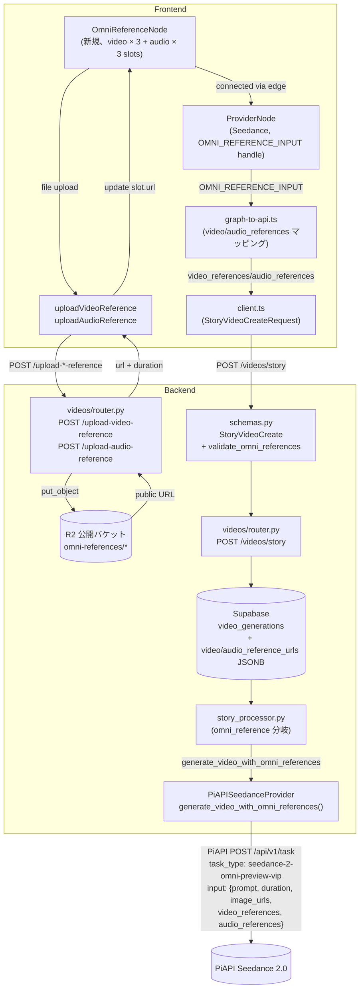
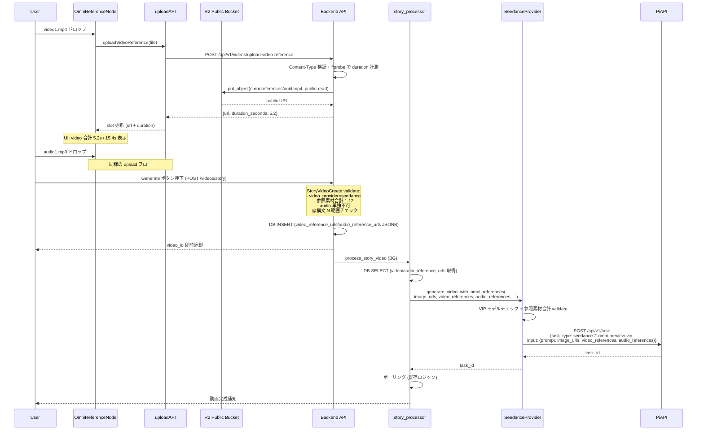
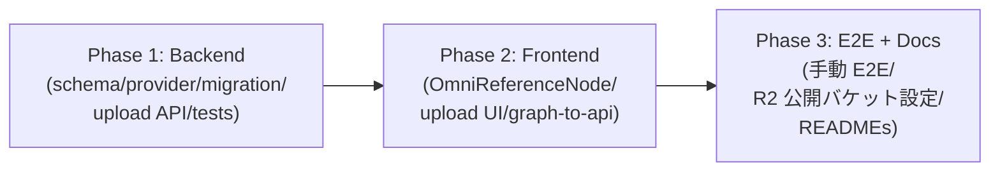
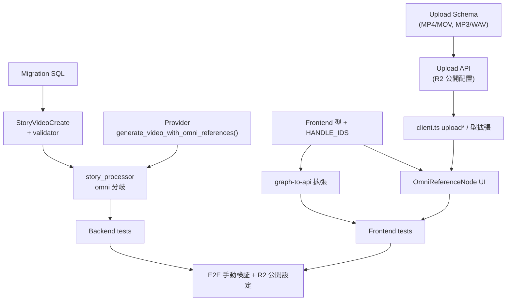

# Design Doc: Seedance 2.0 omni_reference モード対応 (video_references / audio_references)

**作成日**: 2026-05-18
**ステータス**: Draft
**作成者**: technical-designer
**関連 Doc**:
- `docs/plans/2026-05-13_gpt-image-2-and-seedance-2.0.md` (Phase 1 で「参照素材未対応」と明記、本 Doc がその後継スコープ)
- `docs/plans/2026-05-18_seedance-detailed-params.md` (omni_reference は将来スコープ と明記、本 Doc がその将来スコープ)
- `docs/plans/2026-05-18_duration-1s-step.md` (Seedance duration 拡張、本 Doc は duration 引数互換)

---

## 1. 合意チェックリスト

| 項目 | 内容 | 設計上の反映箇所 |
|------|------|----------------|
| スコープ | Seedance 2.0 omni_reference モード (video_references / audio_references) 対応 + プロンプト内 `@image1` / `@video1` / `@audio1` 構文サポート | §3 目標, §6 設計詳細 |
| スコープ | 動画/音声のアップロード経路 (`POST /api/v1/videos/upload-video-reference`、`POST /api/v1/videos/upload-audio-reference`) | §6.3 |
| 非スコープ | omni_reference 以外の Seedance パラメータ (generate_audio / seed / resolution / camerafixed / last_frame_url) — 別 Doc (`2026-05-18_seedance-detailed-params.md`) で対応済 | §3 非スコープ |
| 非スコープ | watermark, parent_task_id | §3 非スコープ |
| 非スコープ | Storyboard 経由 (`storyboard_processor.py`) での omni_reference 伝搬 — Node Editor 経路のみ対応 | §16 未解決項目 #7 |
| 制約 | VIP モデル必須 (`seedance-2-preview-vip` / `seedance-2-fast-preview-vip`) | §6.5 §11 エッジケース 1 |
| 制約 | video_references 最大 3 本・合計 ≤15.4 秒、audio_references 最大 3 本・各 ≤15 秒、参照素材合計 (image+video+audio) 1〜12 個 | §6.5 §11 エッジケース 2,3 |
| 制約 | audio_references 単独不可 (image_urls か video_references のうち少なくとも 1 つ必須) | §11 エッジケース 4 |
| 制約 | 参照 URL は **公開アクセス可能必須** (署名付き URL は失敗しやすい) → R2 公開バケット要件 | §6.3.3 §11 エッジケース 5 |
| 制約 | プロンプト内 `@image{N}` / `@video{N}` / `@audio{N}` の N がアップロード済素材数を超える場合は 422 | §6.7 §11 エッジケース 6 |
| 後方互換 | 既存 Seedance リクエスト (image_urls のみ) は変更なし、新フィールド全て Optional | §12 後方互換性 |
| 検証 | 新規ユニット/統合テスト 25+ 件 + 既存全件 pass | §13 テスト戦略 |
| 既存ドラフトの NULL カラム互換 | 既存 `video_generations` 行は新カラム NULL のまま (破壊なし) | §12 §6.6 Migration |

---

## 2. 背景・課題

PiAPI Seedance 2.0 の公式仕様には **omni_reference モード** が存在し、動画と音声の参照素材を最大 3 本ずつ与えてモーション・トランジション・ビジュアルスタイル・BGM/環境音を参照させることができる。

| モード | 入力素材 | 用途 |
|--------|---------|------|
| `text_to_video` | prompt のみ | 純テキストからの生成 |
| `first_last_frames` | start (+ end) フレーム画像 | 始終フレーム指定 (`2026-05-18_seedance-detailed-params.md` で対応済) |
| **`omni_reference`** (本 Doc) | **`image_urls` / `video_references` / `audio_references` mix** | スタイル/モーション/音声を mix して参照 |

現状実装は **image_urls のみ** に対応しており、`piapi_seedance_provider.py` L8-11 で `video_references / audio_references / parent_task_id は未対応` と明記されている。

### 2.1 既存実装の制約箇所 (`piapi_seedance_provider.py`)

```python
# L8-11: docstring に未対応明記
"""
Phase 1 制限:
  - audio は常に OFF（APIに送信しない）
  - video_references / audio_references / parent_task_id は未対応
  - VIP以外 (standard) は480p のみ
"""

# L128-141: input_payload 構築 - image_urls のみ
input_payload: dict = {
    "prompt": prompt[:4000],
    "duration": clamped_duration,
    "aspect_ratio": aspect_ratio,
    "image_urls": [image_url],
}
```

### 2.2 PiAPI 公式仕様 (本 Doc が依拠する事実)

- **`video_references`**: MP4/MOV、最大 3 本、合計 15.4 秒以内 → モーション/トランジション/ビジュアルスタイル参照
- **`audio_references`**: MP3/WAV、最大 3 本、各 15 秒以内 → BGM/環境音
- **omni_reference モード専用**: task_type 切替が必要 (正式名は §17 未解決項目 #1 で確認)
- **VIP モデル必須**: `seedance-2-preview-vip` / `seedance-2-fast-preview-vip`
- 参照素材合計 (images + videos + audios) は **1〜12 個**
- **audio 単独は不可**: 必ず image か video の参照を 1 つ以上含める
- プロンプト内で `@image1`, `@video1`, `@audio1` 構文で参照可能 (1-indexed)
- URL は **公開アクセス可能必須** (署名付き URL は失敗しやすい → R2 公開バケット要件)

---

## 3. 目標

### A. Backend: `video_references` / `audio_references` の payload 送信
- `PiAPISeedanceProvider.generate_video_with_omni_references()` 新規メソッド (理由: §5 採用案参照)
- omni_reference モード時に `task_type` を omni 用へ切替 (暫定値、§17 未解決項目 #1)
- payload に `input.video_references: list[str]` / `input.audio_references: list[str]` を追加
- 参照素材合計数の validate (1〜12 個)、audio 単独不可の validate

### B. Backend: R2 への動画/音声アップロード API
- `POST /api/v1/videos/upload-video-reference` (MP4/MOV、各≤15.4s 推奨、最大ファイルサイズ要設定)
- `POST /api/v1/videos/upload-audio-reference` (MP3/WAV、各≤15s)
- 既存 `POST /api/v1/videos/upload-image` パターン踏襲、R2 公開バケットへ配置 (署名 URL でなく公開 URL を返却)
- ffprobe (or moviepy) で duration を抽出、レスポンスに含める (frontend での合計時間計算用)

### C. Backend: スキーマ拡張 + プロンプト @構文 validate
- `StoryVideoCreate` に `video_references: list[str] | None` / `audio_references: list[str] | None` 追加
- Pydantic validator:
  - VIP モデル必須 (env が VIP suffix を含むかどうか実行時判定)
  - video_references 最大 3、audio_references 最大 3
  - audio_references 単独不可 (image_urls or video_references が空でない)
  - 参照素材合計 1〜12 個
  - プロンプト内 `@image{N}` / `@video{N}` / `@audio{N}` の N が対応素材数を超えていない

### D. Backend: DB スキーマ追加
- `video_generations` に `video_reference_urls jsonb` / `audio_reference_urls jsonb` 追加マイグレーション
- 全 NULL 既定値 (既存行への影響なし)

### E. Frontend: 新規 OmniReferenceNode
- 動画/音声参照素材を upload するノード (1 ノードで複数素材を扱う)
- 既存 `ImageInputNode` の reference-image UI パターン踏襲
- 内部に video slots × 3、audio slots × 3 を持つ
- アップロード成功時に duration を表示 (合計 15.4s 制限の可視化)
- ProviderNode (Seedance) に接続 (HANDLE: `omni_references`)

### F. Frontend: 合計再生時間バリデーション (クライアント側)
- video_references 合計 > 15.4 秒で UI 警告
- audio_references 各 > 15 秒で UI 警告
- 不正状態では Generate ボタン disable (or 警告下に submit 可能、submit 後 backend 422 を表示)

### G. Frontend: プロンプト @構文サポート UX
- PromptNode のプレースホルダに `@image1`, `@video1` 等の説明文表示
- 入力中の `@video{N}` を検出して該当 video slot をハイライト (lite 実装、将来拡張)

### 非スコープ

- `generate_audio` / `seed` / `resolution` / `camerafixed` / `last_frame_url` — `2026-05-18_seedance-detailed-params.md` で対応済
- `watermark` / `parent_task_id` — 本 Doc 範囲外
- Storyboard 経由 (`storyboard_processor.py`) での omni_reference 伝搬 — Node Editor 経路のみ対応
- omni_reference モードのコスト (PiAPI クレジット消費) — 料金表に依存、§17 未解決項目 #5

---

## 4. 既存コードベース調査

### 4.1 実装ファイルマッピング

| 対象 | パス | 役割 |
|------|------|------|
| Seedance Provider | `movie-maker-api/app/external/piapi_seedance_provider.py` | payload 構築 (L128-141)、task_type 切替 (L63-83) |
| Seedance Provider env | `movie-maker-api/app/core/config.py:51-52` | `PIAPI_SEEDANCE_TASK_TYPE` / `PIAPI_SEEDANCE_RESOLUTION` |
| Story Processor | `movie-maker-api/app/tasks/story_processor.py:115-205` | DB → extra_params → `provider.generate_video()` |
| T2V Processor | `movie-maker-api/app/tasks/t2v_processor.py` | T2V 経路 (本 Doc 対応要否 §6.7 で確認) |
| Backend Schema | `movie-maker-api/app/videos/schemas.py:314-353, 1625` | `StoryVideoCreate` seedance フィールド + 既存 `reference_images: list[ReferenceImage]` パターン |
| Backend Router | `movie-maker-api/app/videos/router.py` | DB INSERT + 既存 `POST /api/v1/videos/upload-image` パターン |
| R2 クライアント | `movie-maker-api/app/external/r2.py` | アップロード/公開 URL 生成 |
| 既存類似 UI (参考) | `movie-maker/components/node-editor/nodes/ImageInputNode.tsx` | 画像アップロード雛形 |
| 既存類似 Backend (参考) | `movie-maker-api/app/videos/router.py` (POST `/upload-image`) | アップロード API 雛形 |
| ProviderNode UI | `movie-maker/components/node-editor/nodes/ProviderNode.tsx` | Seedance Pro/Fast 選択 UI |
| NodePalette | `movie-maker/components/node-editor/NodePalette.tsx` | `omniReference` ノード追加 (`availableFor: ['seedance']`) |
| Nodes availability | `movie-maker/components/node-editor/hooks/useNodesAvailability.ts:18-25` | `seedance: ['seedanceEndFrame', 'omniReference']` 追加 |
| Graph→API 変換 | `movie-maker/components/node-editor/utils/graph-to-api.ts` | 新フィールド + OmniReferenceNode マッピング |
| API クライアント型 | `movie-maker/lib/api/client.ts` | `StoryVideoCreateRequest` 拡張 |
| HANDLE_IDS | `movie-maker/lib/types/node-editor.ts:546-600` | 新規 `OMNI_REFERENCE_*` 追加 |

### 4.2 既存 Seedance Provider の現状フロー

```
graph-to-api.ts
  └── request.seedance_duration / seedance_mode 設定 (image_urls は ImageInputNode から)
       ↓
POST /api/v1/videos/story
  ↓
StoryVideoCreate スキーマ検証 (schemas.py)
  ↓
DB INSERT into video_generations (router.py)
  ↓
process_story_video (story_processor.py)
  └── provider.generate_video(image_url, prompt, ..., mode)
        ↓
PiAPISeedanceProvider.generate_video
  └── input_payload = {prompt, duration, aspect_ratio, image_urls: [image_url]}
```

### 4.3 既存類似機能検索結果

- **検索**: "video_references", "audio_references", "omni_reference" を `movie-maker-api/app/` 配下で grep
- **結果**: 既存実装なし → 新規実装
- **検索**: 動画アップロード API → 既存 `POST /api/v1/videos/upload-image` (画像のみ)、動画/音声向けは未実装
- **結論**: 新規実装。R2 アップロード処理は既存画像アップロード API のパターンを流用。OmniReferenceNode は ImageInputNode の構造を拡張 (複数素材スロット対応)。

### 4.4 R2 公開バケット要件の影響範囲

- 既存 ImageInputNode が利用する R2 バケットが既に**公開バケット**かどうか確認が必要 (§17 未解決項目 #2)
- 既に公開なら追加設定不要
- 非公開 (署名 URL 配信) の場合、以下の選択肢:
  - **選択肢 A**: 同一バケット内に `public/` プレフィックスを作成し、omni_reference 素材のみ公開配信
  - **選択肢 B**: 別バケット (`movie-maker-public`) を新設
  - **推奨**: 選択肢 A (運用シンプル、Cloudflare R2 のバケットポリシーで `public/*` のみ公開設定)
  - **未解決項目 #2** で確認後に決定

### 4.5 既存 reference-image パターン (`schemas.py:1625`)

```python
reference_images: list[ReferenceImage]  # 既存パターン
```

`ReferenceImage` 型は URL + メタデータを持つ Pydantic モデル。omni_reference の `video_references` / `audio_references` も類似パターンを採用するが、PiAPI の payload 仕様が `list[str]` (URL の配列) のため、内部表現として URL list を採用する。

---

## 5. 採用案 (代替案比較)

### 5.1 案 A: 新規メソッド `generate_video_with_omni_references()` を追加 (推奨)

**概要**: 既存 `generate_video()` / `generate_video_from_text()` には手を加えず、omni_reference モード専用の 3 つ目のメソッドを追加。

**メリット**:
- 既存メソッドの後方互換が完全保証 (引数追加なし)
- task_type 切替・参照素材 validate が新メソッド内に閉じる
- omni_reference モード固有の bugfix が他経路に影響しない
- TDD で RED → GREEN を新メソッドのみで回せる

**デメリット**:
- 3 メソッド間で payload 構築コードが類似 (Rule of Three の 3 回目に達するため共通化を併せて検討、§6.5)

### 5.2 案 B: 既存 `generate_video()` を拡張

**概要**: 既存 `generate_video()` に `video_references: list[str] | None`, `audio_references: list[str] | None` 引数を追加し、内部で omni_reference モードへ自動切替。

**メリット**:
- メソッド数増えず、呼び出し側 (story_processor) のロジック簡素

**デメリット**:
- 既存メソッドの責務が肥大化 (i2v + first_last_frames + omni_reference の 3 モード分岐)
- 引数増加 (`2026-05-18_seedance-detailed-params.md` で既に 5 個追加済、さらに 2 個追加で 13 引数) → 引数オブジェクト化が必要
- 後方互換テストの組合せ爆発

### 5.3 案 C: Strategy パターンで Provider 内部にモード別 Strategy クラスを導入

**概要**: `SeedanceTextToVideoStrategy` / `SeedanceFirstLastFramesStrategy` / `SeedanceOmniReferenceStrategy` を導入し、Provider はディスパッチに徹する。

**メリット**:
- 単一責任原則 (各 Strategy 1 モード)
- 将来モード追加時に拡張容易

**デメリット**:
- 大規模リファクタ (既存 generate_video / generate_video_from_text の解体が必要)
- 工数が 2-3 倍 (5-7h 増)
- 本 Doc スコープ外

### 5.4 比較マトリクス

| 評価軸 | 案 A (新規メソッド) | 案 B (既存拡張) | 案 C (Strategy) |
|--------|-----------------|--------------|-------------|
| 実装工数 | 5-6h | 4-5h | 10-13h |
| 既存テスト影響 | None | Medium (引数追加) | High (リファクタ) |
| 後方互換性 | 完全 | Medium (Optional でも分岐多) | High (Adapter で吸収) |
| 単一責任原則 | High | Low (3 モード混在) | Highest |
| 保守性 | High | Medium | High |
| 既存パターン整合性 | Medium (本 Doc で新パターン導入) | High | Low |

**採用**: **案 A**。既存メソッドへの干渉ゼロで実装可能、TDD で安全に開発可能。3 メソッド共通の payload 構築ヘルパー (例: `_build_input_payload()`) を Rule of Three で抽出することで保守性も担保する。

---

## 6. 設計詳細

### 6.1 Backend 型定義 (`app/external/piapi_seedance_provider.py`)

```python
# モジュール定数 (本 Doc 新規)
OMNI_REFERENCE_TASK_TYPE_MAP = {
    "seedance-2-preview-vip": "seedance-2-omni-preview-vip",          # 暫定、§17 #1
    "seedance-2-fast-preview-vip": "seedance-2-omni-fast-preview-vip",  # 暫定
}

MAX_VIDEO_REFERENCES = 3
MAX_AUDIO_REFERENCES = 3
MAX_TOTAL_REFERENCES = 12
MIN_TOTAL_REFERENCES = 1
MAX_VIDEO_REFERENCES_TOTAL_SECONDS = 15.4
MAX_AUDIO_REFERENCE_SECONDS = 15.0
```

### 6.2 Backend Provider 実装 (新規メソッド)

```python
async def generate_video_with_omni_references(
    self,
    prompt: str,
    duration: int = 5,
    aspect_ratio: str = "9:16",
    mode: Optional[str] = None,
    image_urls: Optional[list[str]] = None,
    video_references: Optional[list[str]] = None,
    audio_references: Optional[list[str]] = None,
) -> str:
    """
    Seedance 2.0 omni_reference モードで動画生成

    Args:
        prompt: 動画生成プロンプト (最大4000文字、@image1/@video1/@audio1 構文サポート)
        duration: 動画長さ (4-15 秒)
        aspect_ratio: アスペクト比
        mode: 'pro' | 'fast' | None
        image_urls: 画像参照 URL リスト (0-3)
        video_references: 動画参照 URL リスト (0-3, 合計 ≤15.4s)
        audio_references: 音声参照 URL リスト (0-3, 各 ≤15s)

    Returns:
        str: task_id

    Raises:
        VideoProviderError:
            - VIP モデル必須違反
            - 参照素材合計が 1-12 範囲外
            - audio 単独 (image/video 0 個)
    """
    base_task_type = self._resolve_task_type(mode)
    if not base_task_type.endswith("-vip"):
        raise VideoProviderError(
            "omni_reference モードは VIP モデルでのみ利用可能です "
            "(PIAPI_SEEDANCE_TASK_TYPE に -vip suffix が必要)"
        )

    image_urls = image_urls or []
    video_references = video_references or []
    audio_references = audio_references or []

    total = len(image_urls) + len(video_references) + len(audio_references)
    if total < MIN_TOTAL_REFERENCES or total > MAX_TOTAL_REFERENCES:
        raise VideoProviderError(
            f"参照素材は合計 {MIN_TOTAL_REFERENCES}〜{MAX_TOTAL_REFERENCES} 個必要です (現在: {total})"
        )
    if len(image_urls) == 0 and len(video_references) == 0:
        raise VideoProviderError(
            "audio_references のみの指定は不可です。image_urls または video_references を 1 つ以上指定してください"
        )

    omni_task_type = OMNI_REFERENCE_TASK_TYPE_MAP.get(base_task_type, base_task_type)
    clamped_duration = min(VALID_DURATIONS, key=lambda d: abs(d - duration))

    input_payload: dict = {
        "prompt": prompt[:4000],
        "duration": clamped_duration,
        "aspect_ratio": aspect_ratio,
        "resolution": self.resolution,
    }
    if image_urls:
        input_payload["image_urls"] = image_urls
    if video_references:
        input_payload["video_references"] = video_references
    if audio_references:
        input_payload["audio_references"] = audio_references

    payload = {
        "model": "seedance",
        "task_type": omni_task_type,
        "input": input_payload,
        "config": {"service_mode": "public"},
    }

    # ... httpx 呼び出しは既存 generate_video と同様 (共通ヘルパー _post_task() 抽出を検討) ...
```

**共通化** (Rule of Three): 既存 `generate_video()` / `generate_video_from_text()` + 新 `generate_video_with_omni_references()` の 3 メソッドで `httpx POST → task_id 抽出 → エラーマッピング` の処理が 3 回出現するため、`async def _post_task(self, payload: dict) -> str` ヘルパー抽出を本 Doc Phase 1 で同時実施。

### 6.3 Backend Upload API (R2)

#### 6.3.1 `POST /api/v1/videos/upload-video-reference`

**Request**: multipart/form-data, `file: UploadFile`
**Validation**:
- Content-Type が `video/mp4` または `video/quicktime` (MOV)
- File size ≤ 50MB (要設定値、§17 未解決項目 #6)
- ffprobe で duration を計測、>15.4s なら 422 (単体ファイルでの上限制約。合計制約は frontend と schema 検証)

**Response**:
```json
{
  "url": "https://pub-xxx.r2.dev/omni-references/uuid.mp4",
  "duration_seconds": 5.2,
  "filename": "uuid.mp4",
  "content_type": "video/mp4"
}
```

#### 6.3.2 `POST /api/v1/videos/upload-audio-reference`

**Request**: multipart/form-data, `file: UploadFile`
**Validation**:
- Content-Type が `audio/mpeg` (MP3) または `audio/wav`
- File size ≤ 10MB
- ffprobe で duration、>15s なら 422

**Response**: 同上 (duration_seconds 付き)

#### 6.3.3 R2 公開バケット運用

- 配置先: `omni-references/{uuid}.{ext}` プレフィックス
- バケットポリシー: `omni-references/*` のみ公開設定 (Cloudflare R2 Public Bucket Settings 経由)
- 既存 `images/` プレフィックス (既存画像アップロード) との分離を保証
- 詳細は §17 未解決項目 #2 で確定

### 6.4 Backend Schema 変更 (`app/videos/schemas.py`)

```python
# StoryVideoCreate クラス内に追加

video_references: Optional[list[str]] = Field(
    default=None,
    max_length=3,
    description="Seedance omni_reference: 動画参照 URL リスト (最大 3、合計 ≤15.4s、MP4/MOV 推奨)"
)
audio_references: Optional[list[str]] = Field(
    default=None,
    max_length=3,
    description="Seedance omni_reference: 音声参照 URL リスト (最大 3、各 ≤15s、MP3/WAV 推奨)"
)

# クロスバリデーター (本 Doc 新規)
@model_validator(mode='after')
def validate_omni_references(self) -> Self:
    """
    omni_reference モードの制約 validate:
      1. video_provider が seedance であること
      2. 参照素材合計 1〜12 個
      3. audio_references 単独不可
      4. プロンプト内 @image{N} / @video{N} / @audio{N} の N がアップロード済素材数を超えない
    """
    if self.video_references is None and self.audio_references is None:
        return self  # omni 未使用、validate skip

    if self.video_provider not in (None, VideoProvider.SEEDANCE):
        raise ValueError("video_references / audio_references は video_provider=seedance でのみ利用可能です")

    image_count = len(self.image_urls or [])  # 既存 image_urls フィールド
    video_count = len(self.video_references or [])
    audio_count = len(self.audio_references or [])
    total = image_count + video_count + audio_count

    if total > 12:
        raise ValueError(f"参照素材合計は 12 個までです (現在: {total})")
    if total < 1:
        raise ValueError("参照素材を 1 つ以上指定してください")
    if image_count == 0 and video_count == 0 and audio_count > 0:
        raise ValueError("audio_references のみの指定は不可。image_urls または video_references が必要です")

    # @構文 validate
    import re
    for tag, count in [('image', image_count), ('video', video_count), ('audio', audio_count)]:
        for match in re.finditer(rf'@{tag}(\d+)', self.prompt or ''):
            n = int(match.group(1))
            if n < 1 or n > count:
                raise ValueError(
                    f"プロンプト内の @{tag}{n} は範囲外です (指定された {tag}_references は {count} 個)"
                )
    return self
```

### 6.5 Backend Story Processor 拡張 (`app/tasks/story_processor.py`)

```python
# Seedance 用パラメータ取得を拡張
video_references = video_data.get("video_reference_urls") or []  # jsonb → list[str]
audio_references = video_data.get("audio_reference_urls") or []

# Seedance 分岐内に omni_reference 経路追加
elif provider_name == "seedance":
    # 既存 mode/seedance_* 引数組立 (`2026-05-18_seedance-detailed-params.md` 参照)
    ...
    # === 本 Doc 新規 ===
    if video_references or audio_references:
        # omni_reference モード経路
        task_id = await provider.generate_video_with_omni_references(
            prompt=prompt,
            duration=duration,
            aspect_ratio=aspect_ratio,
            mode=seedance_mode,
            image_urls=image_urls,  # 既存 ImageInputNode 由来
            video_references=video_references,
            audio_references=audio_references,
        )
    else:
        # 既存経路 (image_urls のみ or first_last_frames)
        task_id = await provider.generate_video(...)
```

### 6.6 Migration (`docs/migrations/20260518_add_seedance_omni_reference.sql`)

```sql
-- Seedance omni_reference モード対応 (video_references / audio_references)
-- 既存行は全カラム NULL (破壊なし、backward compatible)
ALTER TABLE video_generations
  ADD COLUMN IF NOT EXISTS video_reference_urls JSONB DEFAULT NULL,
  ADD COLUMN IF NOT EXISTS audio_reference_urls JSONB DEFAULT NULL;

-- 配列要素数 CHECK (最大 3 ずつ)
ALTER TABLE video_generations
  ADD CONSTRAINT video_reference_urls_max_3 CHECK (
    video_reference_urls IS NULL OR jsonb_array_length(video_reference_urls) <= 3
  ),
  ADD CONSTRAINT audio_reference_urls_max_3 CHECK (
    audio_reference_urls IS NULL OR jsonb_array_length(audio_reference_urls) <= 3
  );

COMMENT ON COLUMN video_generations.video_reference_urls IS 'Seedance 2.0 omni_reference: 動画参照 URL リスト (jsonb array, 最大 3、合計 ≤15.4s)';
COMMENT ON COLUMN video_generations.audio_reference_urls IS 'Seedance 2.0 omni_reference: 音声参照 URL リスト (jsonb array, 最大 3、各 ≤15s)';
```

### 6.7 Frontend 型定義拡張 (`lib/types/node-editor.ts`)

```ts
// NodeType union に 'omniReference' 追加
export type NodeType = '...' | 'omniReference';

// 新規 OmniReferenceNodeData
export interface OmniReferenceSlot {
  url: string | null;
  durationSeconds?: number;  // backend upload API レスポンスから
  filename?: string;
}

export interface OmniReferenceNodeData extends BaseNodeData {
  type: 'omniReference';
  videoSlots: [OmniReferenceSlot, OmniReferenceSlot, OmniReferenceSlot];  // 固定 3 スロット
  audioSlots: [OmniReferenceSlot, OmniReferenceSlot, OmniReferenceSlot];
}

// WorkflowNodeData union に追加
// HANDLE_IDS に追加
export const HANDLE_IDS = {
  // ... 既存 ...
  OMNI_REFERENCE_OUTPUT: 'omni_reference',
  OMNI_REFERENCE_INPUT: 'omni_reference_input',  // ProviderNode 側
} as const;
```

### 6.8 OmniReferenceNode UI 実装

`components/node-editor/nodes/OmniReferenceNode.tsx`:

```tsx
// 主要構造:
// - 「動画参照 (最大 3)」セクション: 3 つの Dropzone + プレビュー (filename + duration 表示)
// - 動画合計時間プログレスバー (合計 / 15.4 秒)、超過時赤色
// - 「音声参照 (最大 3)」セクション: 3 つの Dropzone
// - 各 audio slot に duration 表示、>15s 時赤色
// - クリアボタン (slot ごと)
// - 既存 ImageInputNode の Dropzone コンポーネントを流用
```

**バリデーション**:
- ファイル拡張子チェック (Dropzone の `accept` プロパティ)
- アップロード成功時に `durationSeconds` を slot に保存
- 合計時間/各時間制約は UI 上で警告表示 + Generate ボタンは引き続き押下可能 (backend 422 が最終 fallback)

### 6.9 ProviderNode の omni_references 接続受付

ProviderNode に handle id `OMNI_REFERENCE_INPUT` を追加し、OmniReferenceNode の出力を受け付ける。
ノード接続時のみ omni_reference モードが有効化される (=配置だけでは送信されない、明示的接続が必要)。

### 6.10 graph-to-api.ts の変更

```ts
// Seedance 分岐内に追加
if (provider?.provider === 'seedance') {
  // 既存 seedance_* マッピング ...

  // OmniReferenceNode 検索 (ProviderNode に接続されているもののみ)
  const omniNode = nodes.find(
    (n) =>
      n.data.type === 'omniReference' &&
      isConnectedToProvider(n.id, providerNode.id, edges)
  );
  if (omniNode) {
    const omniData = omniNode.data as OmniReferenceNodeData;
    const videoUrls = omniData.videoSlots.filter(s => s.url).map(s => s.url!);
    const audioUrls = omniData.audioSlots.filter(s => s.url).map(s => s.url!);
    if (videoUrls.length > 0) request.video_references = videoUrls;
    if (audioUrls.length > 0) request.audio_references = audioUrls;
  }
}
```

### 6.11 API クライアント型拡張 (`lib/api/client.ts`)

```ts
// StoryVideoCreateRequest 拡張
{
  // ... 既存 ...
  video_references?: string[];   // 本 Doc 新規 (最大 3)
  audio_references?: string[];   // 本 Doc 新規 (最大 3)
}

// 新規 upload API クライアント
export async function uploadVideoReference(file: File): Promise<{
  url: string;
  duration_seconds: number;
  filename: string;
  content_type: string;
}>;

export async function uploadAudioReference(file: File): Promise<{
  url: string;
  duration_seconds: number;
  filename: string;
  content_type: string;
}>;
```

### 6.12 NodePalette / useNodesAvailability 拡張

```tsx
// NodePalette.tsx
{
  type: 'omniReference',
  label: 'Seedance Omni Reference',
  description: '動画/音声を参照素材として使用 (omni_reference モード)',
  icon: 'layers',
  category: 'provider-specific',
  availableFor: ['seedance'],
}

// useNodesAvailability.ts
seedance: ['seedanceEndFrame', 'omniReference'],
```

---

## 7. アーキテクチャ図



## 8. データフロー図



## 9. Phase 構造図



## 10. タスク依存図



---

## 11. 変更影響マップ

```yaml
Change Target: Seedance 2.0 omni_reference モード対応
Direct Impact:
  - movie-maker-api/app/external/piapi_seedance_provider.py (新規メソッド + 共通ヘルパー)
  - movie-maker-api/app/videos/schemas.py (Field 2 + cross-validator + upload API スキーマ)
  - movie-maker-api/app/videos/router.py (POST /upload-video-reference, /upload-audio-reference + DB INSERT 拡張)
  - movie-maker-api/app/tasks/story_processor.py (omni 分岐追加)
  - movie-maker-api/app/external/r2.py (公開バケット書き込みヘルパー、必要に応じて)
  - movie-maker/lib/types/node-editor.ts (OmniReferenceNodeData + HANDLE_IDS)
  - movie-maker/components/node-editor/nodes/OmniReferenceNode.tsx (新規ファイル)
  - movie-maker/components/node-editor/nodes/ProviderNode.tsx (OMNI_REFERENCE_INPUT handle 追加)
  - movie-maker/components/node-editor/NodePalette.tsx (項目追加)
  - movie-maker/components/node-editor/hooks/useNodesAvailability.ts (マッピング追加)
  - movie-maker/components/node-editor/utils/graph-to-api.ts (マッピング追加)
  - movie-maker/lib/api/client.ts (型拡張 + uploadVideoReference / uploadAudioReference)
  - docs/migrations/20260518_add_seedance_omni_reference.sql (新規)
Indirect Impact:
  - movie-maker-api/app/tasks/storyboard_processor.py (Storyboard 経由は本 Doc 範囲外、新カラム NULL のまま)
  - 既存 video_generations テーブル (新カラム NULL、既存行への影響なし)
  - R2 バケットポリシー (omni-references/* プレフィックス公開設定、§17 #2)
No Ripple Effect:
  - 他プロバイダー (Runway / Veo / Kling / Hailuo / DomoAI) — 完全に独立
  - 既存 generate_video / generate_video_from_text — シグネチャ変更なし
  - 既存 seedance_duration / seedance_mode / seedance_resolution 等 — 維持
  - 既存 image upload API (POST /upload-image) — 独立
```

### インターフェース変更マトリクス

| 既存操作 | 新操作 | 変換必要 | アダプター | 互換方法 |
|---------|--------|---------|-----------|---------|
| `generate_video(...)` (i2v) | 変更なし | 不要 | 不要 | 既存呼び出し互換 |
| `generate_video_from_text(...)` (t2v) | 変更なし | 不要 | 不要 | 既存呼び出し互換 |
| (新規) | `generate_video_with_omni_references(...)` | — | — | omni 専用、既存と独立 |
| `StoryVideoCreate` | + video_references? / audio_references? | 不要 (Optional) | 不要 | 既存リクエスト互換 |
| (新規) | POST /api/v1/videos/upload-video-reference | — | — | 新規エンドポイント |
| (新規) | POST /api/v1/videos/upload-audio-reference | — | — | 新規エンドポイント |
| video_generations テーブル | + video_reference_urls JSONB / + audio_reference_urls JSONB | 不要 (default NULL) | 不要 | 既存行 NULL |
| ProviderNode UI | + OMNI_REFERENCE_INPUT handle | 不要 | 不要 | 既存接続変更なし |
| NodePalette UI | + omniReference カード (`availableFor: ['seedance']`) | 不要 | 不要 | 既存ノード一覧変更なし |

---

## 12. 統合ポイントマップ

```yaml
統合ポイント 1:
  既存コンポーネント: ImageInputNode (UI パターン参考)
  統合方法: OmniReferenceNode を ImageInputNode の Dropzone ベースに新規作成
  影響レベル: Low (新規ファイル、既存変更なし)
  必要なテスト: Dropzone 動作、upload mock、slot 更新

統合ポイント 2:
  既存コンポーネント: POST /api/v1/videos/upload-image (パターン参考)
  統合方法: 同パターンで upload-video-reference / upload-audio-reference を追加
  影響レベル: Medium (新エンドポイント 2 個、R2 公開バケット設定要)
  必要なテスト: Content-Type validate、duration 計測、R2 配置、エラー応答 (422/413)

統合ポイント 3:
  既存コンポーネント: graph-to-api.ts / graphToStoryVideoCreate
  統合方法: seedance 分岐内に OmniReferenceNode 検索 + video/audio_references マッピング追加
  影響レベル: Medium (リクエスト内容拡張)
  必要なテスト: 接続時のみ送信、未接続時送信せず、空 slot は除外

統合ポイント 4:
  既存コンポーネント: schemas.py / StoryVideoCreate
  統合方法: 新 Field 2 個 + validate_omni_references クロスバリデーター追加
  影響レベル: Medium (validation 拡張)
  必要なテスト: 各境界 (個数/合計/audio 単独/プロンプト @構文)

統合ポイント 5:
  既存コンポーネント: piapi_seedance_provider.py
  統合方法: 新規メソッド generate_video_with_omni_references + 共通ヘルパー _post_task 抽出
  影響レベル: Medium (既存メソッドのリファクタは内部ヘルパー抽出のみ、シグネチャ不変)
  必要なテスト: payload 構築、VIP 必須、参照素材合計 validate、task_type 切替

統合ポイント 6:
  既存コンポーネント: story_processor.py
  統合方法: Seedance 分岐内に video/audio_references 取得 + omni 経路分岐
  影響レベル: Medium (条件分岐追加)
  必要なテスト: omni 指定時 omni 経路呼出、未指定時既存経路、両経路 image_urls 取り回し

統合ポイント 7:
  既存コンポーネント: video_generations テーブル (Supabase)
  統合方法: ALTER TABLE で 2 カラム追加 (JSONB, default NULL, CHECK array_length≤3)
  影響レベル: Low (read-only、既存行 NULL)
  必要なテスト: マイグレーション後既存行 SELECT 正常、INSERT で配列保存可能

統合ポイント 8:
  既存コンポーネント: R2 バケット
  統合方法: omni-references/* プレフィックスのみ公開アクセス可能に設定
  影響レベル: High (R2 設定変更、§17 #2 で運用方針確定要)
  必要なテスト: 公開 URL から HTTP GET で取得可能、images/* は非公開維持
```

### 統合境界コントラクト

```yaml
Boundary: OmniReferenceNode → uploadAPI client
  Input: File (MP4/MOV or MP3/WAV)
  Output: { url, duration_seconds, filename, content_type }
  On Error: フロントエンド trace + slot をエラー状態で表示、Generate は引き続き可能 (空 slot は送信されない)

Boundary: uploadAPI client → POST /api/v1/videos/upload-*-reference
  Input: multipart/form-data file
  Output: 200 + JSON、422 (形式/サイズ不正)、413 (サイズ上限超過)
  On Error: フロントエンド toast + slot 状態 reset

Boundary: frontend → backend (POST /api/v1/videos/story)
  Input: StoryVideoCreate { ..., video_references?, audio_references? }
  Output: StoryVideoResponse (video_id)
  On Error: 422 Unprocessable Entity (provider mismatch, 合計範囲, audio 単独, @構文)

Boundary: backend → SeedanceProvider.generate_video_with_omni_references()
  Input: image_urls?, video_references?, audio_references?, prompt, duration, ...
  Output: task_id (str)
  On Error: VideoProviderError (VIP 必須違反 / 合計範囲 / audio 単独) → 500、PiAPI レスポンスエラーは _map_error_message で日本語化

Boundary: SeedanceProvider → PiAPI POST /api/v1/task
  Input: { model: "seedance", task_type: "seedance-2-omni-preview-vip", input: {prompt, duration, aspect_ratio, image_urls?, video_references?, audio_references?, resolution}, config }
  Output: { data: { task_id } }
  On Error: HTTPStatusError → VideoProviderError (status code + error text)
```

---

## 13. エッジケース

1. **VIP モデル未契約 (env が `-vip` suffix なし)**
   - **シナリオ**: `PIAPI_SEEDANCE_TASK_TYPE=seedance-2-preview` の状態で omni_reference 指定
   - **挙動**: Provider 内 VIP チェックで `VideoProviderError` raise → 500
   - **対応**: UI で omniReference ノード配置時に「Seedance VIP プラン必須」警告表示 (env 状態を `/api/v1/config/video-provider` で返す or 固定文言)
   - **採用**: 固定文言 + backend 422 hard fail (UX 厳格)

2. **video_references 合計 > 15.4 秒**
   - **シナリオ**: 6s + 6s + 6s = 18s
   - **対応**: フロントエンド UI で合計プログレスバー (黄→赤) + Generate ボタン非 disable (PiAPI 側エラー fallback)
   - **backend**: 単体ファイル ≤15.4s は upload API で reject、合計は schema で validate しない (PiAPI 側 enforced とする) — 厳格化したい場合は schema validator に追加 (§17 未解決項目 #4)

3. **audio_references 各 > 15 秒**
   - **シナリオ**: 20 秒の MP3 ファイル
   - **対応**: upload API で 422 reject (ffprobe duration チェック)

4. **audio_references のみ指定 (image/video 0)**
   - **シナリオ**: ユーザーが image/video スロットを空のまま audio のみ設定
   - **対応**: Pydantic cross-validator で 422、UI でも警告

5. **参照 URL が署名付き URL (= 公開アクセス不可)**
   - **シナリオ**: R2 バケットが非公開で署名 URL が返される
   - **対応**: Phase 3 で R2 公開バケット設定確定 (§17 #2)、暫定 frontend で公開 URL でない場合警告
   - **検出方法**: URL に `Signature=` 等のクエリパラメータが含まれていれば署名 URL と判定

6. **プロンプト内 `@video2` だが video_references が 1 個のみ**
   - **シナリオ**: `"@video2 のスタイルで踊る"` + video_references = [url1] のみ
   - **対応**: schema validator で 422 (`"プロンプト内の @video2 は範囲外です (指定された video_references は 1 個)"`)

7. **参照素材合計 0 個 (全 slot 空)**
   - **シナリオ**: OmniReferenceNode 配置のみ、ファイル 0 個
   - **対応**: graph-to-api で video_references / audio_references を送信せず → omni_reference モード非適用 (既存 i2v / t2v 経路)

8. **参照素材合計 13 個以上**
   - **シナリオ**: image 4 + video 5 + audio 4 = 13 (image_urls の max は別途決まるが組合せで超過)
   - **対応**: schema validator で 422

9. **R2 アップロード中断 / 失敗**
   - **シナリオ**: upload API 呼出中にネットワーク切断
   - **対応**: frontend で retry UI 表示、slot は失敗状態のまま (URL 未設定 = 送信されない)

10. **大容量ファイル (>50MB)**
    - **シナリオ**: 4K 動画 100MB
    - **対応**: upload API で 413 Payload Too Large、frontend で事前 File.size チェック警告

11. **既存ドラフトの NULL カラム**
    - **シナリオ**: マイグレーション後の既存 `video_generations` 行は新 2 カラム NULL
    - **対応**: `video_data.get("video_reference_urls") or []` で空リスト fallback → omni 分岐に進まない → 既存挙動完全維持

12. **MP4 アップロードだが Content-Type 偽装**
    - **シナリオ**: 拡張子 .mp4 だが実体 .exe
    - **対応**: upload API で ffprobe 実行が失敗 → 422 (動画として認識不可)

---

## 14. 後方互換性

| 項目 | 互換性方法 |
|------|----------|
| 既存 `generate_video()` / `generate_video_from_text()` | シグネチャ完全維持。omni は新規メソッドで対応 |
| 既存 `seedance_*` フィールド (duration/mode/resolution/etc) | 維持。video_references / audio_references は Optional 追加 |
| 既存リクエスト (omni 未指定) | video/audio_references = None → omni 分岐に進まない → 既存 generate_video 経由 |
| 既存 DB 行 (新カラム NULL) | SELECT で NULL 取得 → `.get() or []` で空リスト fallback → 既存経路維持 |
| 既存 PiAPI task_type | omni 未指定なら維持。指定時のみ `OMNI_REFERENCE_TASK_TYPE_MAP` で切替 |
| 既存 R2 アップロード (POST /upload-image) | 完全に独立。新規 2 エンドポイントは別パス・別プレフィックス |
| 既存 R2 バケット (`images/` プレフィックス) | 非公開維持。omni-references/* のみ公開設定 |
| 既存テスト 764+ 件 | 全件 pass (新規 API/メソッドは Optional/独立のため既存に影響なし) |

---

## 15. テスト戦略

### 15.1 Backend テスト (pytest)

**新規ファイル**: `movie-maker-api/tests/external/test_piapi_seedance_omni_reference.py`

| # | テストケース | 検証内容 |
|---|------------|---------|
| B-1 | generate_video_with_omni_references(video_references=[url1]) + image_urls=[img1] → payload.input.video_references = [url1] | httpx mock |
| B-2 | generate_video_with_omni_references(audio_references=[url1]) + image_urls=[img1] → payload.input.audio_references = [url1] | httpx mock |
| B-3 | image+video+audio mix (各 1 個) → 3 フィールド全て payload に含まれる | httpx mock |
| B-4 | task_type = `seedance-2-omni-preview-vip` (mode=None 既定) | httpx mock |
| B-5 | mode='fast' → task_type = `seedance-2-omni-fast-preview-vip` | httpx mock |
| B-6 | env が 非 VIP (`seedance-2-preview`) で omni 呼出 → VideoProviderError | unit |
| B-7 | 参照素材合計 0 個 → VideoProviderError ("1〜12 個必要") | unit |
| B-8 | 参照素材合計 13 個 → VideoProviderError | unit |
| B-9 | audio のみ (image/video 0) → VideoProviderError ("audio 単独不可") | unit |
| B-10 | image_urls=[] + video_references=[url1] → OK (video 1 個で audio 単独回避) | httpx mock |
| B-11 | prompt 4001 文字 → 4000 文字に切詰 | httpx mock |
| B-12 | duration=15 + omni → input.duration=15 | httpx mock |

**新規ファイル**: `movie-maker-api/tests/videos/test_omni_reference_schema.py`

| # | テストケース | 検証内容 |
|---|------------|---------|
| B-13 | StoryVideoCreate(video_references=[url1,url2,url3], video_provider=seedance) → valid | Pydantic |
| B-14 | StoryVideoCreate(video_references=[u1,u2,u3,u4]) → 422 (max_length=3) | Pydantic |
| B-15 | StoryVideoCreate(video_references=[u1], video_provider=runway) → 422 (cross-validator) | Pydantic |
| B-16 | StoryVideoCreate(image_urls=[], video_references=[], audio_references=[u1]) → 422 (audio 単独) | Pydantic |
| B-17 | StoryVideoCreate(image_urls=[i1,i2,i3,i4,i5], video_references=[v1,v2,v3], audio_references=[a1,a2,a3,a4]) → 422 (合計 12 超) | Pydantic |
| B-18 | StoryVideoCreate(prompt="@video2 で踊る", video_references=[v1]) → 422 (@video2 範囲外) | Pydantic |
| B-19 | StoryVideoCreate(prompt="@video1 で踊る", video_references=[v1]) → valid | Pydantic |
| B-20 | StoryVideoCreate (新フィールド全省略) → valid (既存リクエスト互換) | Pydantic |

**新規ファイル**: `movie-maker-api/tests/videos/test_upload_reference_api.py`

| # | テストケース | 検証内容 |
|---|------------|---------|
| B-21 | POST /upload-video-reference (MP4, 5s) → 200 + url + duration_seconds | FastAPI TestClient + R2 mock |
| B-22 | POST /upload-video-reference (PNG) → 422 (Content-Type 不正) | TestClient |
| B-23 | POST /upload-video-reference (MP4, 20s) → 422 (duration > 15.4s) | TestClient + ffprobe mock |
| B-24 | POST /upload-audio-reference (MP3, 10s) → 200 | TestClient |
| B-25 | POST /upload-audio-reference (MP3, 20s) → 422 | TestClient |
| B-26 | POST /upload-video-reference (60MB) → 413 | TestClient |

**既存ファイル拡張**: `tests/tasks/test_story_processor.py`

| # | テストケース | 検証内容 |
|---|------------|---------|
| B-27 | DB 行に video_reference_urls=[v1] → provider.generate_video_with_omni_references が呼ばれる | mock 検証 |
| B-28 | DB 行に video/audio_reference_urls 共に NULL → 既存 provider.generate_video が呼ばれる | mock 検証 |

### 15.2 Frontend テスト (Vitest)

**新規ファイル**: `movie-maker/components/node-editor/nodes/OmniReferenceNode.test.tsx`

| # | テストケース | 検証内容 |
|---|------------|---------|
| F-1 | 3 video slots + 3 audio slots が初期表示 | DOM 確認 |
| F-2 | video1 slot にファイルドロップ → uploadVideoReference が呼ばれる | mock |
| F-3 | upload 成功 → slot に filename + duration 表示 | DOM 確認 |
| F-4 | video 合計 > 15.4s → 警告メッセージ表示 (赤色) | DOM 確認 |
| F-5 | audio slot に 20s ファイル → upload API が 422 → エラー表示 | mock |
| F-6 | クリアボタン → slot リセット | spy 検証 |

**graph-to-api.test.ts** 拡張:

| # | テストケース | 検証内容 |
|---|------------|---------|
| F-7 | OmniReferenceNode 配置 + ProviderNode 接続 + video slot 2 個埋まる → request.video_references = [u1,u2] | 変換結果 |
| F-8 | OmniReferenceNode 配置 + 全 slot 空 → request に video/audio_references 含まれない | 変換結果 |
| F-9 | OmniReferenceNode 未接続 → request に含まれない | 変換結果 |
| F-10 | provider != seedance + omniReferenceNode あり → request に含まれない | 分岐検証 |
| F-11 | audio slot のみ埋まる (image/video 空) → request.audio_references 含まれる (backend で 422 fallback 想定) | 変換結果 |

**ProviderNode.test.tsx** 拡張:

| # | テストケース | 検証内容 |
|---|------------|---------|
| F-12 | provider=seedance → OMNI_REFERENCE_INPUT handle が表示 | DOM |
| F-13 | provider != seedance → OMNI_REFERENCE_INPUT handle 非表示 | DOM |

### 15.3 既存テスト回帰

- 既存テスト 764+ 件全件 pass を確認
- 既知失敗 3 件 (`test_text_to_image.py` × 2、`test_service.py` × 1) は本 Doc と無関係のため除外

### 15.4 マイグレーションテスト

- `docs/migrations/20260518_add_seedance_omni_reference.sql` をローカル/staging Supabase に適用
- 既存 `video_generations` 行を SELECT して新 2 カラムが NULL であること、JSONB 配列 INSERT/SELECT が正常動作することを確認
- Supabase MCP `mcp__supabase__apply_migration` で適用、`mcp__supabase__list_tables` で構造確認
- CHECK 制約 (`jsonb_array_length ≤ 3`) のバウンダリ確認: 配列要素 3 個 OK、4 個 reject

### 15.5 E2E 手動検証手順

| Phase | 検証手順 |
|-------|---------|
| Phase 1 完了時 | Backend 単体: `pytest tests/external/test_piapi_seedance_omni_reference.py tests/videos/test_omni_reference_schema.py tests/videos/test_upload_reference_api.py -v` 全 pass |
| Phase 1 完了時 | curl で `POST /upload-video-reference` に 5s MP4 → 200 + 公開 URL 取得 → ブラウザでアクセス可能 |
| Phase 2 完了時 | Frontend 単体: `npm run test OmniReferenceNode.test.tsx graph-to-api.test.ts` 全 pass |
| Phase 3 完了時 (E2E) | Node Editor で Seedance + ImageInputNode + OmniReferenceNode 配置 → 動画 1 本 + 音声 1 本 upload → "@video1 の動きで @image1 のキャラクターが @audio1 に合わせて踊る" 入力 → Generate → ネットワーク request に video/audio_references 含まれること確認 → PiAPI に正しい payload 送信 → 動画完成確認 |

### 15.6 R2 公開バケット検証

| # | 検証項目 | 方法 |
|---|---------|------|
| R-1 | omni-references/* に upload した URL が anonymous GET で 200 | curl `-I` |
| R-2 | images/* (既存画像) は anonymous GET で 403 (非公開維持) | curl `-I` |
| R-3 | バケットポリシーが意図通り (prefix-based) | Cloudflare R2 ダッシュボード確認 |

---

## 16. Acceptance Criteria (Given/When/Then)

### AC-1: OmniReferenceNode の表示
- **Given**: Node Editor で Provider=Seedance が選択されている
- **When**: NodePalette で「Seedance Omni Reference」をキャンバスにドロップ
- **Then**: OmniReferenceNode が配置され、3 つの video slot + 3 つの audio slot が表示される (provider != seedance では Palette から非表示)

### AC-2: 動画参照アップロード
- **Given**: OmniReferenceNode 配置済、video slot 1 が空
- **When**: 5 秒の MP4 ファイルをドロップ
- **Then**: `POST /api/v1/videos/upload-video-reference` が呼ばれ、200 応答後に slot に filename + "5.0s" が表示される、合計表示が "5.0 / 15.4s" に更新される

### AC-3: 音声参照アップロード
- **Given**: OmniReferenceNode 配置済
- **When**: 10 秒の MP3 ファイルを audio slot 1 にドロップ
- **Then**: 200 応答後に slot に filename + "10.0s" 表示

### AC-4: 合計時間警告
- **Given**: video slot 1, 2 にそれぞれ 8s, 8s の MP4 がアップロード済
- **When**: OmniReferenceNode を表示
- **Then**: 合計表示が "16.0 / 15.4s" となり、赤色警告メッセージ「動画参照の合計時間が 15.4 秒を超えています」が表示される

### AC-5: omni_reference リクエスト送信
- **Given**: Provider=Seedance + OmniReferenceNode 接続 + ImageInputNode に画像 1 枚 + video slot 1 に 5s MP4 + audio slot 1 に 10s MP3
- **When**: Generate ボタン押下
- **Then**: POST `/api/v1/videos/story` の request payload に以下が含まれる:
  ```json
  {
    "video_references": ["https://pub-xxx.r2.dev/omni-references/uuid1.mp4"],
    "audio_references": ["https://pub-xxx.r2.dev/omni-references/uuid2.mp3"]
  }
  ```
  PiAPI への送信 payload で `task_type=seedance-2-omni-preview-vip`、`input.video_references` / `input.audio_references` 含まれる

### AC-6: audio 単独で 422
- **Given**: image_urls 空 + video_references 空 + audio_references = [url]
- **When**: POST /api/v1/videos/story
- **Then**: HTTP 422、detail に「audio_references のみの指定は不可」

### AC-7: 参照素材合計 13 個で 422
- **Given**: image 5 + video 3 + audio 5 = 13
- **When**: POST /api/v1/videos/story
- **Then**: HTTP 422、detail に「参照素材合計は 12 個まで」

### AC-8: VIP 非対応 env で omni 指定 → 422
- **Given**: env `PIAPI_SEEDANCE_TASK_TYPE=seedance-2-preview` (非 VIP)、omni_reference 指定
- **When**: process_story_video 実行 (BG)
- **Then**: `video_generations.status = 'failed'`、`error_message` に「omni_reference モードは VIP モデルでのみ利用可能」

### AC-9: プロンプト @構文範囲外 → 422
- **Given**: prompt="@video2 のスタイル"、video_references = [url1]
- **When**: POST /api/v1/videos/story
- **Then**: HTTP 422、detail に「プロンプト内の @video2 は範囲外」

### AC-10: 既存 i2v リクエストの後方互換
- **Given**: 既存形式リクエスト (video_references / audio_references 一切指定なし)
- **When**: POST /api/v1/videos/story
- **Then**: 200 OK、provider.generate_video (既存メソッド) が呼ばれる、PiAPI payload に omni 関連フィールド一切含まれない

### AC-11: Migration backward compatibility
- **Given**: マイグレーション適用前に存在した video_generations 行
- **When**: マイグレーション SQL 実行後、当該行を SELECT
- **Then**: 新 2 カラム NULL、既存カラム全て変更なし、SELECT 成功

### AC-12: R2 公開バケット URL の有効性
- **Given**: POST /upload-video-reference で 5s MP4 を upload、レスポンスの `url`
- **When**: anonymous HTTP GET (Authorization ヘッダなし)
- **Then**: 200 OK、Content-Type が `video/mp4`

### AC-13: 既存テスト全件 pass + 新規 25+ 件 pass
- **Given**: 本 Doc 実装完了後のコードベース
- **When**: `pytest` (backend) + `npm test` (frontend)
- **Then**:
  - 既存 764+ 件のうち既知失敗 3 件を除く全件 pass
  - 新規追加テスト 25+ 件全件 pass
  - Total: 789+ 件 pass

---

## 17. 未解決項目

| # | 項目 | 優先度 | 備考 |
|---|------|--------|------|
| 1 | PiAPI Seedance 2.0 `omni_reference` モードの正式 `task_type` 名 | **High** | 実装前に必ず PiAPI 公式ドキュメント (`https://piapi.ai/docs/seedance-api/seedance-2`) を確認。暫定 `seedance-2-omni-preview-vip` / `seedance-2-omni-fast-preview-vip` を実装し、HTTPStatusError 400 (unknown task_type) を catch して error_message に転送。確認後に `OMNI_REFERENCE_TASK_TYPE_MAP` を正しい名前に修正 |
| 2 | R2 バケットの公開設定運用方針 (既存バケットに prefix-based 公開 vs 別バケット新設) | **High** | 既存 `images/` プレフィックスが公開かどうか確認 → 非公開なら本 Doc 内で運用方針確定 (推奨: 同バケット `omni-references/` のみ公開)。Cloudflare R2 設定変更を Phase 3 で実施 |
| 3 | 参照 URL が署名 URL の場合の自動検出 | Medium | 暫定: frontend で `?Signature=` 等の検出。完全防止には R2 配信側で署名 URL を強制無効化する設定が必要 |
| 4 | video_references 合計時間制約を backend schema 側で検証するか (現状 frontend + PiAPI fallback のみ) | Medium | 合計 duration は upload API レスポンスから計算可能だが、schema validate 時点では URL のみ受信 → duration を schema に持たせるか別エンドポイントで再計測するか設計判断 |
| 5 | omni_reference モードのコスト (PiAPI クレジット消費量) | Medium | PiAPI 料金表 (`https://piapi.ai/pricing`) で omni_reference モードの単価を確認、UI 上で見積り表示 (将来) |
| 6 | upload API のファイルサイズ上限 (video / audio それぞれ) | Medium | 暫定: video 50MB / audio 10MB。Cloudflare R2 Free Tier の egress 制限を考慮し最終確定要 |
| 7 | Storyboard 経由 (`storyboard_processor.py`) での omni_reference 伝搬 | Low | 本 Doc は Node Editor 経路のみ対応。Storyboard で omni_reference を扱う UX 要件が出たら別 Doc 起こす |
| 8 | プロンプト @構文のリッチ UX (該当 slot ハイライト等) | Low | 本 Doc では @構文 validate のみ実装。ハイライト等の UX 強化は別 PR |
| 9 | omni_reference でも `generate_audio` / `seed` / `camerafixed` 等 (`2026-05-18_seedance-detailed-params.md` で対応) を併用可能か | Medium | PiAPI 仕様確認要。同時送信 OK なら新メソッドにも引数追加 (本 Doc Phase 1 で確認後追加検討) |
| 10 | 参照素材合計が 1 の場合の挙動 (image 1 + video 0 + audio 0 = omni_reference モードを使う意味があるか) | Low | 仕様上は許容 (omni_reference モードでも参照 1 個 OK)。実質的に i2v と等価になる可能性、§17 #1 と同時確認 |
| 11 | duration 計測ライブラリ選定 (ffprobe vs moviepy vs mutagen) | Low | 暫定: ffprobe (既存 ffmpeg 依存と整合)。バイナリ依存軽量化したい場合は mutagen (音声のみ) を検討 |

---

## 18. 前提 ADR

- 本変更は既存 `VideoProviderInterface` パターンに従った拡張であり、新たな ADR は不要 (documentation-criteria 条件 #4 「外部 API 統合」には該当しない — Seedance Provider は既存)
- 新ノード `OmniReferenceNode` は既存 `ImageInputNode` パターンの拡張 (複数 slot 化) であり、新ノードカテゴリの新設には該当しない
- 新 R2 アップロード API 2 個は既存 `POST /upload-image` パターンに従った追加であり、新たなアーキテクチャ層追加には該当しない
- ただし **R2 公開バケット設定変更** は運用に関わる決定のため、本 Doc 内 §17 未解決項目 #2 で確定後、運用手順を README に追記する (新規 ADR まで起こすかは規模次第)
- 関連既存 Doc:
  - `docs/plans/2026-05-13_gpt-image-2-and-seedance-2.0.md` (Phase 1 で参照素材未対応と明記、本 Doc がその後継スコープ)
  - `docs/plans/2026-05-18_seedance-detailed-params.md` (omni_reference は将来スコープと明記、本 Doc がその将来スコープ)
  - `docs/plans/2026-05-18_duration-1s-step.md` (duration 拡張、本 Doc も duration 引数互換)

---

## 19. 実装アプローチ

**選択**: 垂直スライス (vertical slice) + TDD 順序、3 Phase 構成

**選択理由** (implementation-approach skill Phase 1-6 適用):

- **Phase 1 (現状分析)**: Provider / Schema / Router / Story Processor / OmniReferenceNode / graph-to-api / upload API / R2 設定の 8 層を貫く変更だが、各層の責任は明確分離されている
- **Phase 2 (戦略探索)**: Vertical slice (機能単位、Backend → Frontend → E2E) と Horizontal slice (層単位) の 2 案を比較
- **Phase 3 (リスク評価)**: Backend 完結状態で curl 動作確認できるため、Frontend 着手前にバックエンド一貫性を担保可能。R2 公開バケット設定が Phase 3 で残るリスクあり (§17 #2)
- **Phase 4 (制約)**: 全体工数 8-12h 想定、単一開発者で並行不可、依存順は migration → backend schema → backend provider/upload API → frontend → R2 設定 → E2E
- **Phase 5 (決定)**: **垂直スライス 3 Phase** を採用 (Backend → Frontend → E2E + R2 設定)。各 Phase 完了時に明確なゴール (Backend テスト pass / Frontend テスト pass / E2E 通過)

### 実装フェーズ

```mermaid
gantt
  title 実装順序
  dateFormat X
  axisFormat %s

  section Phase 1: Backend
  Migration SQL + Supabase 適用: 0, 15m
  Upload API schema + tests (RED): 15m, 30m
  Upload API 実装 (GREEN, ffprobe 込): 45m, 60m
  StoryVideoCreate schema test (RED): 105m, 20m
  schemas.py validator 実装 (GREEN): 125m, 30m
  Provider test (RED): 155m, 30m
  generate_video_with_omni_references 実装 (GREEN): 185m, 45m
  story_processor 拡張 + test: 230m, 25m
  Router DB INSERT 拡張: 255m, 15m

  section Phase 2: Frontend
  types/node-editor.ts 拡張: 0, 15m
  client.ts uploadVideoReference 等 + 型拡張: 15m, 20m
  OmniReferenceNode test (RED): 35m, 30m
  OmniReferenceNode 実装 (GREEN): 65m, 60m
  ProviderNode handle 追加: 125m, 15m
  graph-to-api test (RED): 140m, 20m
  graph-to-api 実装 (GREEN): 160m, 20m
  NodePalette + useNodesAvailability: 180m, 15m

  section Phase 3: E2E + R2 + Docs
  R2 公開バケット設定 (omni-references/*): 0, 30m
  R2 検証 (R-1~R-3): 30m, 15m
  E2E 手動検証: 45m, 45m
  README / 運用手順追記: 90m, 20m
```

### 検証レベル (各 Phase 完了基準)

| Phase | 検証レベル | 確認方法 |
|-------|----------|---------|
| Phase 1 | L2 (test pass) | `pytest tests/external/test_piapi_seedance_omni_reference.py tests/videos/test_omni_reference_schema.py tests/videos/test_upload_reference_api.py -v` 全 pass + curl で upload API 200 |
| Phase 2 | L2 (test pass) | `npm run test OmniReferenceNode.test.tsx graph-to-api.test.ts ProviderNode.test.tsx` 全 pass |
| Phase 3 | L1 (functional) | Node Editor で end-to-end omni_reference 動画生成成功 + R2 公開バケット URL の anonymous GET 成功 |

### Phase 分解 (タスク粒度の目安)

#### Phase 1: Backend (約 4.5h)
- T1-1: Migration SQL 作成 + Supabase 適用 (15m)
- T1-2: Upload API schema + テスト作成 RED (30m)
- T1-3: Upload API 実装 (POST /upload-video-reference, /upload-audio-reference) + ffprobe duration 計測 GREEN (60m)
- T1-4: StoryVideoCreate schema (Field + validator) + テスト作成 (50m)
- T1-5: Provider 新規メソッド `generate_video_with_omni_references` + 共通ヘルパー `_post_task` 抽出 + テスト (75m)
- T1-6: story_processor omni 分岐 + テスト (25m)
- T1-7: Router DB INSERT 拡張 (15m)
- T1-8: Phase 1 全テスト pass 確認 + curl E2E (15m)

#### Phase 2: Frontend (約 3.5h)
- T2-1: types/node-editor.ts + HANDLE_IDS 拡張 (15m)
- T2-2: client.ts uploadVideoReference / uploadAudioReference + StoryVideoCreateRequest 型拡張 (20m)
- T2-3: OmniReferenceNode 新規ファイル + テスト (90m)
- T2-4: ProviderNode に OMNI_REFERENCE_INPUT handle 追加 (15m)
- T2-5: graph-to-api 拡張 + テスト (40m)
- T2-6: NodePalette + useNodesAvailability 追加 (15m)
- T2-7: Phase 2 全テスト pass 確認 (15m)

#### Phase 3: E2E + R2 + Docs (約 2h)
- T3-1: R2 omni-references/* プレフィックス公開バケット設定 + 検証 (R-1~R-3) (45m)
- T3-2: ローカル E2E 手動検証 (video 1 + audio 1 + image 1 で動画生成成功確認) (45m)
- T3-3: PiAPI 仕様確認 (§17 #1, #4, #9) + 必要なら task_type / payload 修正 (15m)
- T3-4: README / docs/ 追記 (運用手順、R2 設定方法) (15m)

---

## 20. 想定工数

| Phase | 推定時間 |
|-------|---------|
| Phase 1: Backend (schema/provider/migration/upload API/tests) | 4.5h |
| Phase 2: Frontend (UI/node editor/upload/tests) | 3.5h |
| Phase 3: E2E + R2 公開バケット設定 + ドキュメント | 2h |
| PiAPI 仕様未確認項目調査 (§17 #1, #4, #9) | 1h (バッファ) |
| **合計** | **~10-12 時間** |

---

## 21. References

- [PiAPI Seedance 2 公式ドキュメント](https://piapi.ai/docs/seedance-api/seedance-2) - task_type, omni_reference モード仕様
- [PiAPI Seedance 2.0 製品紹介](https://piapi.ai/seedance-2-0) - 3 モード (text_to_video / first_last_frames / omni_reference) 概要
- [Cloudflare R2 Public Bucket Settings](https://developers.cloudflare.com/r2/buckets/public-buckets/) - 公開バケット設定方法 (prefix-based)
- 既存 Doc: `docs/plans/2026-05-13_gpt-image-2-and-seedance-2.0.md` (Phase 1)
- 既存 Doc: `docs/plans/2026-05-18_seedance-detailed-params.md` (本 Doc が後継スコープ)
- 既存 Doc: `docs/plans/2026-05-18_duration-1s-step.md` (duration 拡張)
- 既存実装: `movie-maker-api/app/external/piapi_seedance_provider.py` (本 Doc が拡張)
- 既存実装: `movie-maker-api/app/videos/router.py` (POST /upload-image パターン参照)
- 既存実装: `movie-maker/components/node-editor/nodes/ImageInputNode.tsx` (UI 雛形)

---

## 22. 変更履歴

| 日付 | 内容 |
|------|------|
| 2026-05-18 | 初版作成。Seedance 2.0 omni_reference モード (video_references / audio_references) 対応の Design Doc + 実装計画書。3 Phase 分解 (Backend → Frontend → E2E + R2)、新規メソッド方式採用、R2 公開バケット運用方針は §17 未解決項目 #2 で確定 |
