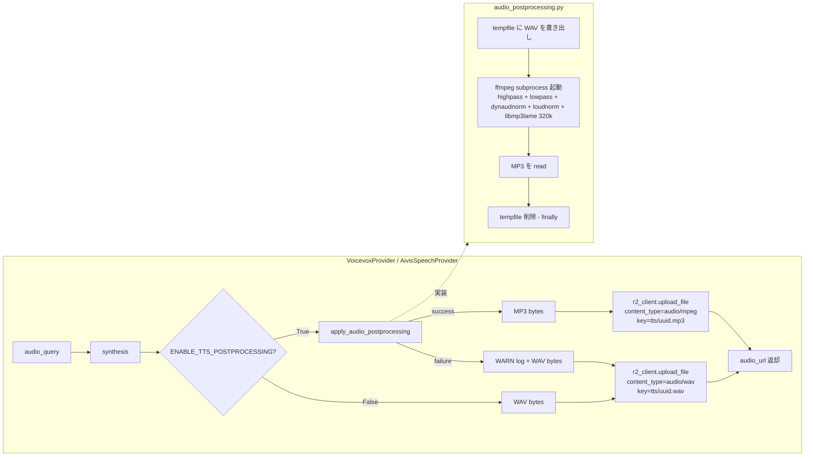

# TTS 音質強化 (ffmpeg 後処理 + MP3 変換) Design Document

## Overview

Voicevox / Aivis Speech (Style-Bert-VITS2) によるローカル TTS 生成 WAV (48kHz ステレオ) に対し、
ffmpeg を用いた音響後処理 (highpass / lowpass / dynaudnorm / loudnorm) を適用してから
MP3 (320kbps) に変換し R2 へアップロードする。これにより籠もり感の除去・音量均一化・
ファイルサイズ削減 (約 1/10) を一括で実現する。

## Design Summary (Meta)

```yaml
design_type: "extension"
risk_level: "low"
complexity_level: "low"
complexity_rationale: "新規共通ユーティリティ 1 ファイル + 既存プロバイダー 2 ファイルへの局所変更のみ。fail-fast でなくフォールバックを設けるが、観測ログ付きで透明性を確保するため。"
main_constraints:
  - "既存 WAV 音声 URL (DB 保存済) はそのまま再生可能であること (後方互換)"
  - "OpenAI TTS / ElevenLabs (既に MP3 出力) には影響を与えないこと"
  - "ENABLE_TTS_POSTPROCESSING=False で従来の WAV 出力に即時切替できること"
biggest_risks:
  - "ffmpeg バイナリ未インストール環境 (Docker 別イメージ等) で synthesis 全体が失敗する可能性 → フォールバックで回避"
  - "subprocess の I/O コストでローカル TTS 同期レスポンスがやや遅延する (数百ms オーダー想定)"
unknowns:
  - "loudnorm target -16 LUFS の妥当性 (TV 放送は -23 LUFS、podcast は -18 LUFS、Web video は -14 LUFS が一般的)"
  - "MP3 320kbps が過剰でないか (200kbps 程度でも体感差なしの可能性)"
```

## Background and Context

### Prerequisite ADRs

- 該当する共通 ADR は現時点で存在しない。`docs/adr/` 直下に音響処理 / TTS / FFmpeg 共通 ADR が未配置のため、本 Design Doc を運用後に音響後処理 ADR-COMMON 化が必要か判断する (未解決項目参照)。
- 関連既存パターン: `app/services/ffmpeg_service.py` の `asyncio.create_subprocess_exec` + `_check_ffmpeg()` パターンを踏襲する。

### Agreement Checklist

#### Scope
- [x] Voicevox プロバイダー (`app/external/voicevox_provider.py`) の synthesis 結果に対し ffmpeg 後処理を適用し MP3 でアップロード
- [x] Aivis Speech プロバイダー (`app/external/aivis_speech_provider.py`) に同様の処理を適用
- [x] 共通ユーティリティ `app/services/audio_postprocessing.py` を新規作成
- [x] 環境変数 `ENABLE_TTS_POSTPROCESSING` (デフォルト True) を `app/core/config.py` に追加
- [x] 新規ユニットテスト `tests/services/test_audio_postprocessing.py` を 5+ ケース追加

#### Non-Scope (Explicitly not changing)
- [x] OpenAI TTS / ElevenLabs プロバイダーは変更しない (既に MP3 出力)
- [x] 既存 R2 保存済 WAV ファイルのバッチ再処理は行わない (新規生成のみ MP3 化)
- [x] フロントエンドの `<audio>` / `<video>` 要素は MP3 / WAV 両対応のため変更不要
- [x] 後処理パラメータ (highpass=80Hz / lowpass=18kHz / loudnorm I=-16) は本リリースでは固定値、ユーザー設定 UI は出さない

#### Constraints
- [x] Parallel operation: 不要 (provider 単位で切替、既存 URL は無変更)
- [x] Backward compatibility: 必須 (DB に保存された WAV URL は引き続き再生可能)
- [x] Performance measurement: 不要 (定性確認のみ。CI でのレイテンシ測定は対象外)

### Problem to Solve

ユーザーから「TTS 音声のクオリティーをもっと上げたい」という要望があり、現状のローカル TTS 出力には次の課題がある:

1. **籠もり感**: 低周波ノイズや超高域ノイズが残り、明瞭度が低い
2. **音量バラつき**: スタイル / セリフによってラウドネスが大きく振れ、静かなセリフが聞き取りにくい
3. **ファイルサイズ過大**: WAV 48kHz ステレオで 5 秒 ≒ 2MB、R2 ストレージコストと frontend 読み込みに不利

### Current Challenges

- `VoicevoxProvider.generate_speech` / `AivisSpeechProvider.generate_speech` は synthesis 直後のバイナリをそのまま R2 にアップロード (key: `tts/{uuid}.wav`, content_type: `audio/wav`)
- 音響後処理を行う共通サービスが存在しない (`app/services/ffmpeg_service.py` は動画向けのみ)
- OpenAI TTS / ElevenLabs は元から MP3 (audio/mpeg) 出力のため後処理対象外

### Requirements

#### Functional Requirements

- Voicevox / Aivis Speech の生成パイプライン末尾に音響後処理 + MP3 変換ステージを挿入する
- ffmpeg フィルタチェーン `highpass=f=80,lowpass=f=18000,dynaudnorm,loudnorm=I=-16:LRA=11:TP=-1.5` を libmp3lame 320kbps で適用する
- 環境変数で後処理を完全に OFF にできる (障害切り戻し用)
- ffmpeg 失敗時は WARN ログを残し WAV をそのままアップロードしてユーザーに音声を返す (graceful degradation)

#### Non-Functional Requirements

- **Performance**: 5 秒音声の後処理に 1 秒以内 (subprocess 起動 + フィルタ計算)。同期 TTS のため synthesis 全体のレイテンシ目標は 30 秒以内 (既存維持)
- **Reliability**: ffmpeg 失敗時のフォールバック率を WARN ログから観測可能とする
- **Maintainability**: 共通ユーティリティに切り出し、3 つ目以降の TTS プロバイダーが追加された場合でも 1 行で適用可能
- **Storage**: MP3 化により R2 オブジェクトサイズが WAV 比 1/10 程度 (5 秒で 100-300KB)

## Acceptance Criteria (AC) - EARS Format

### AC-1: Voicevox MP3 出力 (デフォルト動作)

- [ ] **When** `ENABLE_TTS_POSTPROCESSING=True` (default) で `VoicevoxProvider.generate_speech(text, voice_id)` を成功するテキストで呼び出した時、the system shall R2 オブジェクトキー末尾が `.mp3`、content_type が `audio/mpeg` で返される audio_url を生成する
  - **Given**: Voicevox Engine が正常稼働、ffmpeg バイナリ存在
  - **When**: `generate_speech("こんにちは", "3")` を呼ぶ
  - **Then**: 返値 `audio_url` の拡張子が `.mp3`、R2 アップロード時の content_type が `audio/mpeg`

### AC-2: Aivis Speech MP3 出力 (デフォルト動作)

- [ ] **When** `ENABLE_TTS_POSTPROCESSING=True` (default) で `AivisSpeechProvider.generate_speech(text, voice_id)` を成功するテキストで呼び出した時、the system shall R2 オブジェクトキー末尾が `.mp3`、content_type が `audio/mpeg` で返される audio_url を生成する
  - **Given**: Aivis Speech Engine が正常稼働、ffmpeg バイナリ存在
  - **When**: `generate_speech("こんにちは", "888753760")` を呼ぶ
  - **Then**: 返値 `audio_url` の拡張子が `.mp3`、content_type が `audio/mpeg`

### AC-3: ファイルサイズ削減

- [ ] **When** 5 秒程度の発話テキストを Voicevox / Aivis Speech で生成した時、the system shall MP3 出力サイズが 50KB 以上 500KB 以下 (WAV 比約 1/10 のレンジ) に収まる
  - **Given**: 5 秒相当のテキスト (例: 「これはテスト音声のサンプルです。短いセンテンスを 2 つ。」)
  - **When**: `generate_speech()` で MP3 を生成
  - **Then**: バイト長が `50_000 <= len(mp3_bytes) <= 500_000`

### AC-4: 後処理 OFF 時の WAV 出力 (後方互換)

- [ ] **If** `ENABLE_TTS_POSTPROCESSING=False` に設定されている、**then** the system shall 従来通り `.wav` 拡張子と `audio/wav` content_type で R2 にアップロードする
  - **Given**: `settings.ENABLE_TTS_POSTPROCESSING = False`
  - **When**: Voicevox / Aivis Speech プロバイダーで `generate_speech()` を呼ぶ
  - **Then**: `audio_url` 末尾 `.wav`、content_type `audio/wav`、ffmpeg は呼ばれない

### AC-5: ffmpeg 失敗時の WAV フォールバック (graceful degradation)

- [ ] **If** `apply_audio_postprocessing(wav_bytes)` が例外を送出した、**then** the system shall WARN ログを出力した上で WAV のまま R2 にアップロードし、ユーザーに音声 URL を返す
  - **Given**: ffmpeg の subprocess が returncode != 0 で終了 (例: 不正な入力バイト)
  - **When**: provider 内で `try / except` で捕捉
  - **Then**: ログレベル WARNING で「ffmpeg postprocessing failed, falling back to WAV」が記録、`audio_url` 末尾 `.wav`、HTTP 200 で API が完走

### AC-6: 他プロバイダーへの非影響

- [ ] OpenAI TTS (`OpenAITTSProvider.generate_speech`) は本変更後も MP3 (`audio/mpeg`, 拡張子 `.mp3`) を返し続け、`apply_audio_postprocessing` を呼ばない
- [ ] ElevenLabs (`ElevenLabsProvider.generate_speech`) も同様、変更前と完全に同じ動作を保持する

### AC-7: フロントエンド再生 (既存テスト維持)

- [ ] **When** Voicevox / Aivis Speech 生成済の MP3 URL を `<audio>` 要素または lip-sync 後の `<video>` 要素に渡した時、the system shall ブラウザネイティブ再生で音声が出力される
  - **Given**: Chromium / Safari / Firefox のいずれかの最新版
  - **When**: 生成された MP3 を取得 (例: `fetch(audio_url)`) して `audio.src = url`
  - **Then**: HTTP 200 + audio/mpeg ヘッダで取得可能、再生可能

### AC-8: 起動時 ffmpeg 存在チェック

- [ ] **When** FastAPI アプリケーション起動時、the system shall `ffmpeg -version` をプロセス起動して存在を確認する
- [ ] **If** ffmpeg が見つからない (FileNotFoundError) かつ `ENABLE_TTS_POSTPROCESSING=True`、**then** the system shall WARN ログを出力し、その後の TTS リクエストでは postprocessing を自動 OFF (実質 WAV 出力) で動作させる
  - **Given**: PATH 上に ffmpeg が無い環境
  - **When**: アプリ起動 + Voicevox 生成リクエスト
  - **Then**: 起動ログに「ffmpeg not found, TTS postprocessing disabled」、API は WAV を返却

### AC-9: 新規テスト追加

- [ ] `tests/services/test_audio_postprocessing.py` に以下 5+ ケースを追加し全て pass する:
  1. ffmpeg の subprocess が正常終了し MP3 バイトが返ること (ffmpeg 実体をモックではなく実バイナリで実行する小さな WAV を fixture とする)
  2. 出力先頭 3 バイトが `ID3` または `\xff\xfb` (MP3 frame header) であること
  3. ffmpeg returncode != 0 のとき `RuntimeError` を送出すること (mock で `create_subprocess_exec` を差し替え)
  4. 入力 wav_bytes が空 (b"") のとき `RuntimeError` を送出すること
  5. tempfile が処理後に確実に削除されること (`Path.exists()` が False)

## Existing Codebase Analysis

### Implementation Path Mapping

| Type | Path | Description |
|------|------|-------------|
| Existing | `movie-maker-api/app/external/voicevox_provider.py` | Voicevox 同期プロバイダー。`synth_response.content` (WAV) を `r2_client.upload_file(content_type="audio/wav")` で送信 |
| Existing | `movie-maker-api/app/external/aivis_speech_provider.py` | Aivis Speech 同期プロバイダー。Voicevox 互換 API、ほぼ同じ実装パターン |
| Existing | `movie-maker-api/app/external/openai_tts_provider.py` | OpenAI TTS。元から `.mp3` / `audio/mpeg` で R2 アップロード (line 126-131) → 変更不要 |
| Existing | `movie-maker-api/app/external/elevenlabs_provider.py` | ElevenLabs。MP3 出力 → 変更不要 |
| Existing | `movie-maker-api/app/external/r2.py` | `R2Client.upload_file(file_data, key, content_type)` シグネチャ確認済 (line 246-264)。`content_type="audio/mpeg"` を渡せばそのまま動作 |
| Existing | `movie-maker-api/app/services/ffmpeg_service.py` | `FFmpegService._check_ffmpeg()` (line 56-66) / `asyncio.create_subprocess_exec` + `process.communicate()` パターン (line 171-182) を持つ。音声単体処理関数は未実装 |
| Existing | `movie-maker-api/app/core/config.py` | Pydantic `BaseSettings`。TTS 関連設定 (line 88-99) の直下に新規フラグを追加 |
| Existing | `movie-maker-api/app/main.py` | FastAPI app。`@app.on_event("startup")` フックは未定義 → 起動時 ffmpeg チェックは新規追加 |
| New | `movie-maker-api/app/services/audio_postprocessing.py` | `apply_audio_postprocessing(wav_bytes: bytes) -> bytes` 共通関数。tempfile 経由で ffmpeg subprocess 呼び出し |
| New | `movie-maker-api/tests/services/test_audio_postprocessing.py` | 5+ ユニットテスト |

### Integration Points (Include even for new implementations)

- **Integration Target 1**: `VoicevoxProvider.generate_speech()` line 113 付近 (`audio_bytes = synth_response.content` の直後)
  - **Invocation Method**: `if settings.ENABLE_TTS_POSTPROCESSING: try: audio_bytes = await apply_audio_postprocessing(audio_bytes)` で囲む
- **Integration Target 2**: `AivisSpeechProvider.generate_speech()` line 115 付近 (同上)
  - **Invocation Method**: 同じパターン
- **Integration Target 3**: `app/main.py` の `app = FastAPI(...)` 以降に startup イベントハンドラを追加し、ffmpeg 存在を 1 回だけチェック

### Similar Functionality Search Results

- **検索キーワード**: `apply_audio`, `postprocessing`, `mp3 convert`, `libmp3lame`, `loudnorm`, `dynaudnorm`
- **検索範囲**: `movie-maker-api/app/**`
- **結果**: 該当機能は存在しない (`ffmpeg_service.py` は動画専用、`bgm_processor.py` は BGM 結合用で正規化処理なし)
- **判断**: 新規実装を行う。`ffmpeg_service.py` のパターン (subprocess 呼び出し + check_ffmpeg) を参考に同等構造で記述する

## Design

### Change Impact Map

```yaml
Change Target: TTS パイプライン (Voicevox / Aivis Speech) の synthesis 後 + R2 アップロード前の段階
Direct Impact:
  - movie-maker-api/app/services/audio_postprocessing.py (新規ファイル)
  - movie-maker-api/app/external/voicevox_provider.py (generate_speech 内 5-10 行の追加)
  - movie-maker-api/app/external/aivis_speech_provider.py (generate_speech 内 5-10 行の追加)
  - movie-maker-api/app/core/config.py (ENABLE_TTS_POSTPROCESSING フラグ 1 行追加)
  - movie-maker-api/app/main.py (startup ffmpeg ヘルスチェック ハンドラ追加)
  - movie-maker-api/tests/services/test_audio_postprocessing.py (新規ファイル)
Indirect Impact:
  - DB の audio_url カラム値が今後 .mp3 拡張子になる (スキーマ変更なし、文字列値が変わるだけ)
  - R2 オブジェクトの content_type が audio/wav → audio/mpeg に切替 (新規分のみ)
  - frontend の <audio>, <video> 要素は MIME 自動判定で動作 (HTML5 ネイティブ)
No Ripple Effect:
  - OpenAI TTS / ElevenLabs プロバイダー (元から MP3)
  - 既存 DB に保存された .wav URL (R2 オブジェクトはそのまま残る)
  - lip_sync_processor / hedra 等のダウンストリーム (URL を受け取って fetch するだけ、MIME 透過)
  - tts_processor / tts/router.py (provider インタフェース不変)
  - フロントエンド UI コンポーネント (audio_url 文字列を <audio src> に渡すだけ)
```

### Interface Change Matrix

| 既存 Operation | 新 Operation | 変換要否 | アダプタ要否 | 互換維持方法 |
|----------------|--------------|----------|--------------|--------------|
| `VoicevoxProvider.generate_speech(text, voice_id, ...)` returns audio_url (.wav) | 同 (.mp3) | No (戻り値型は str URL のまま) | 不要 | `ENABLE_TTS_POSTPROCESSING=False` で旧挙動に復元 |
| `AivisSpeechProvider.generate_speech(...)` returns audio_url (.wav) | 同 (.mp3) | No | 不要 | 同上 |
| `r2_client.upload_file(file_data, key, content_type)` | 変更なし | - | - | content_type 引数値を `audio/mpeg` に変えるだけ |
| (新規) `apply_audio_postprocessing(wav_bytes: bytes) -> bytes` | - | - | - | - |

### Architecture Overview



### Data Flow

```
[TTS Engine (Voicevox/Aivis Speech)]
       ↓ WAV bytes (48kHz stereo, 16bit PCM)
[apply_audio_postprocessing] ← settings.ENABLE_TTS_POSTPROCESSING
       ↓
   ┌───┴───────────────────────────────────┐
   ↓ 成功                                    ↓ 失敗 (subprocess returncode != 0)
[MP3 320kbps bytes]                       [WAV bytes そのまま]
   ↓                                       ↓
[r2_client.upload_file]                  [r2_client.upload_file]
content_type=audio/mpeg                   content_type=audio/wav
   ↓                                       ↓
[R2 public URL .mp3]                     [R2 public URL .wav]
   ↓                                       ↓
[caller (tts_processor / router) へ str を返却]
```

### Integration Points List

| Integration Point | Location | Old Implementation | New Implementation | Switching Method |
|-------------------|----------|--------------------|--------------------|------------------|
| IP-1 | `VoicevoxProvider.generate_speech` の synthesis 後 (line 113 付近) | `audio_bytes = synth_response.content` → そのまま R2 へ | `if settings.ENABLE_TTS_POSTPROCESSING: audio_bytes = await apply_audio_postprocessing(audio_bytes)` (try/except でフォールバック) | env flag による分岐 |
| IP-2 | `AivisSpeechProvider.generate_speech` の synthesis 後 (line 115 付近) | 同上 | 同上 | 同上 |
| IP-3 | provider 末尾 R2 アップロード `audio_key = f"tts/{uuid4().hex}.wav"` | 拡張子 `.wav` 固定 + content_type `audio/wav` 固定 | `ext / mime_type` を後処理結果に応じて分岐 | 動的変数 `ext`, `mime_type` |
| IP-4 | `app/main.py` 起動時 | 起動時 ffmpeg チェックなし | `@app.on_event("startup")` で `subprocess.run(["ffmpeg", "-version"])` を実行し、失敗時は process-global flag (例: `settings._FFMPEG_AVAILABLE = False`) を立てる | 起動 1 回のみ |

### Main Components

#### Component 1: `audio_postprocessing.py` (新規)

- **Responsibility**: WAV バイトを受け取り ffmpeg subprocess で処理した MP3 バイトを返す。tempfile の確実な後片付けを保証する
- **Interface**:
  - `async def apply_audio_postprocessing(wav_bytes: bytes) -> bytes`
- **Dependencies**: `asyncio`, `tempfile`, `pathlib.Path`, `logging`。外部プロセスとして `ffmpeg` バイナリ

#### Component 2: 既存 provider 拡張

- **Responsibility**: Voicevox / Aivis Speech の generate_speech が呼ばれた際、ENABLE フラグに従って後処理 → R2 アップロード時の content_type / 拡張子を切替
- **Interface**: 変更なし (`generate_speech(...) -> str`)
- **Dependencies**: `app.services.audio_postprocessing`, `app.core.config.settings`

#### Component 3: startup ffmpeg ヘルスチェック (`main.py`)

- **Responsibility**: アプリ起動時に 1 度だけ ffmpeg の存在を確認し、未インストールであれば WARN ログ + `settings._FFMPEG_AVAILABLE = False` を立て、その後の postprocessing 呼び出しを実質スキップさせる
- **Interface**: `@app.on_event("startup") async def _check_ffmpeg_on_startup()`
- **Dependencies**: `subprocess.run`, `logging`, `app.core.config.settings`

### Contract Definitions

```python
# app/services/audio_postprocessing.py (擬似コード — 実装は task-executor が記述)

async def apply_audio_postprocessing(wav_bytes: bytes) -> bytes:
    """
    Pre: wav_bytes は WAV ヘッダを含むバイナリ (PCM 想定、48kHz/24kHz/任意)
    Post: 戻り値は MP3 frame で始まるバイナリ (320kbps libmp3lame)
    Invariant: 一時ファイルは関数終了時に必ず削除される (finally で unlink)
    Raises: RuntimeError (ffmpeg 非ゼロ終了 / バイナリ不在 / 入力空)
    """
```

### Data Contract

#### `apply_audio_postprocessing`

```yaml
Input:
  Type: bytes (WAV binary)
  Preconditions:
    - 1 バイト以上、ffmpeg がデコード可能な WAV
    - サンプリングレートは任意 (Voicevox/Aivis Speech は 48kHz を想定)
  Validation: 関数内では行わず、ffmpeg の終了コードに委譲

Output:
  Type: bytes (MP3 binary, 320kbps, libmp3lame, EBU R128 正規化済)
  Guarantees:
    - 必ず MP3 frame header で始まる
    - 入力が概ね 5 秒であれば概ね 100-300KB に収まる
  On Error: RuntimeError (caller 側で WAV にフォールバック)

Invariants:
  - 入出力 tempfile は finally で削除
  - ffmpeg subprocess は確実に await communicate() される (孤立プロセスを残さない)
```

#### `VoicevoxProvider.generate_speech` / `AivisSpeechProvider.generate_speech`

```yaml
Input:
  Type: (text: str, voice_id: str, language: str, speed: float, instructions: str|None, is_kana: bool)
  Preconditions: 既存と同じ
  Validation: 既存と同じ

Output:
  Type: str (R2 public URL)
  Guarantees:
    - ENABLE_TTS_POSTPROCESSING=True かつ ffmpeg 成功時: 拡張子 .mp3, content_type audio/mpeg
    - ENABLE_TTS_POSTPROCESSING=True かつ ffmpeg 失敗時: 拡張子 .wav, content_type audio/wav (WARN ログ)
    - ENABLE_TTS_POSTPROCESSING=False: 拡張子 .wav, content_type audio/wav (従来動作)
  On Error: 既存と同じ (HTTPStatusError / ConnectError / ValueError)

Invariants:
  - 戻り値の URL は HTTP GET で 200 を返し、ブラウザネイティブ再生可能
```

### State Transitions and Invariants

ステートフルなコンポーネントではないため該当なし (subprocess は呼び出し毎に独立)。

### Error Handling

| エラー種別 | 発生箇所 | 対処 |
|------------|----------|------|
| `RuntimeError` (ffmpeg non-zero exit) | `apply_audio_postprocessing` | provider 側で WARN ログ + WAV フォールバック (AC-5) |
| `FileNotFoundError` (ffmpeg 未インストール) | startup hook | WARN ログ + `_FFMPEG_AVAILABLE = False` で以降 postprocessing 自動 OFF (AC-8) |
| `OSError` (tempfile 書き込み失敗) | `apply_audio_postprocessing` | RuntimeError として再 raise、provider で WAV フォールバック |
| `httpx.HTTPStatusError` / `ConnectError` | provider 内 synthesis ステップ | 既存挙動を維持 (本変更で影響なし) |
| 既存 `ValueError` (text 空, voice_id 不正) | provider 入口 | 既存挙動を維持 |

### Logging and Monitoring

- `apply_audio_postprocessing` 内で ffmpeg コマンド + 入出力サイズを `logger.info` (debug でも可)
- フォールバック発生時に `logger.warning("ffmpeg postprocessing failed, falling back to WAV: %s", err)` — Sentry 等へ集約可能なよう構造化
- startup hook で `logger.warning("ffmpeg not found, TTS postprocessing disabled")` — 環境設定誤りの早期検知
- 将来的に Prometheus メトリクスへ `tts_postprocessing_fallback_total` を出すことを検討 (本リリース対象外)

## Integration Boundary Contracts

```yaml
Boundary Name: VoicevoxProvider/AivisSpeechProvider → audio_postprocessing
  Input: wav_bytes (bytes, WAV 48kHz stereo)
  Output: mp3_bytes (bytes, 同期) または RuntimeError
  On Error: provider 側で try/except → WAV にフォールバック

Boundary Name: audio_postprocessing → ffmpeg subprocess
  Input: tempfile (wav)
  Output: tempfile (mp3) + subprocess stdout/stderr
  On Error: returncode != 0 → RuntimeError("ffmpeg failed: <stderr 先頭 200 文字>")

Boundary Name: Provider → r2_client.upload_file
  Input: (file_data: bytes, key: str, content_type: str)
  Output: R2 public URL (str, 同期)
  On Error: 既存 R2Client が ClientError → Exception を re-raise (provider は素通し)

Boundary Name: FastAPI startup → ffmpeg health check
  Input: なし
  Output: settings._FFMPEG_AVAILABLE (bool, グローバル)
  On Error: 例外を捕捉して WARN ログのみ (起動を止めない)
```

## Implementation Plan

### Implementation Approach

**Selected Approach**: **Vertical Slice (Feature-driven)**

**Selection Reason** (implementation-approach skill Phase 1-4 結果):

- Phase 1 (現状分析): 既存 TTS パイプラインは provider 単位で完結している。アーキテクチャ層を跨ぐ大規模変更ではなく、provider × ユーティリティの局所変更
- Phase 2 (戦略探索): Strangler / Adapter は不要 (旧 WAV URL は touch しない)。Feature-driven が最小コストで価値を届けられる
- Phase 3 (リスク評価): ffmpeg 未インストール環境のみが主リスク。フォールバック + startup ヘルスチェックで吸収
- Phase 4 (制約): バックエンドのみで完結し、フロントエンド変更を伴わないため Vertical で 1 コミット完結可能
- 結論: ユーティリティ→Voicevox 適用→Aivis Speech 適用→test 追加→startup チェックの順で 1 縦串実装

### Technical Dependencies and Implementation Order

#### Required Implementation Order

1. **`app/core/config.py` の `ENABLE_TTS_POSTPROCESSING` 追加**
   - Technical Reason: 後続コードがこの設定参照を前提とするため最優先
   - Dependent Elements: 全 provider と startup hook

2. **`app/services/audio_postprocessing.py` の新規作成 + ユニットテスト追加**
   - Technical Reason: provider 組み込みより先に共通ユーティリティを TDD で固める
   - Prerequisites: ステップ 1

3. **`VoicevoxProvider.generate_speech` に postprocessing 組み込み**
   - Technical Reason: より広く使われている方を先に適用してフィードバックを早期に得る
   - Prerequisites: ステップ 2

4. **`AivisSpeechProvider.generate_speech` に postprocessing 組み込み**
   - Technical Reason: Voicevox とほぼ同じパターンで適用
   - Prerequisites: ステップ 2

5. **`app/main.py` に startup ffmpeg ヘルスチェック追加**
   - Technical Reason: 障害環境で API 全体が落ちないよう、最後に防御策を入れる
   - Prerequisites: ステップ 1-4

### Integration Points (Verification)

各統合点で E2E 検証が必要:

**Integration Point IP-1: Voicevox → audio_postprocessing → R2 (MP3)**
- Components: `VoicevoxProvider` → `apply_audio_postprocessing` → `r2_client.upload_file`
- Verification (L1): ローカル Docker (Voicevox + ffmpeg) で `POST /api/v1/tts/generate` を叩き、返却 audio_url の HEAD リクエストで `Content-Type: audio/mpeg` を確認
- Verification (L2): `tests/services/test_audio_postprocessing.py` が pass

**Integration Point IP-2: Aivis Speech → audio_postprocessing → R2 (MP3)**
- Components: `AivisSpeechProvider` → `apply_audio_postprocessing` → `r2_client.upload_file`
- Verification (L1): TTS_PROVIDER=aivis_speech で同様の E2E
- Verification (L2): Voicevox と共通の audio_postprocessing テストで担保

**Integration Point IP-3: ENABLE_TTS_POSTPROCESSING=False 切替**
- Components: `settings` → provider 分岐
- Verification (L2): 既存 Voicevox/Aivis テスト + 新規追加のフラグ OFF ケース (mock で確認)

**Integration Point IP-4: startup ffmpeg ヘルスチェック**
- Components: `main.py` → `subprocess.run` → `settings._FFMPEG_AVAILABLE`
- Verification (L1): PATH から ffmpeg を外して起動し WARN ログを確認、その後 TTS API が 200 で WAV を返すこと
- Verification (L3): `pytest` が import エラーにならないこと

### Migration Strategy

- DB スキーマ変更なし
- 既存 `.wav` URL のバッチ変換は行わない (再生互換あり、ストレージ削減効果も新規分のみで十分)
- フラグ `ENABLE_TTS_POSTPROCESSING=True` がデフォルト。問題発生時は env で `False` にして即時切戻し可能
- ロールバック手順: env 変更のみ (デプロイ不要)、もしくは git revert (約 6 ファイル)

## Test Strategy

### Basic Test Design Policy

各 AC に対応するテストケースを最低 1 件以上作成し、AC 内の measurable な条件 (拡張子、content_type、ファイルサイズ範囲、ログ出現など) をアサーションとして実装する。

### Unit Tests

`tests/services/test_audio_postprocessing.py` (新規):

1. `test_postprocess_returns_mp3_bytes` — 小さな WAV を入力し戻り値の先頭バイトが MP3 frame header (`b"ID3"` or `b"\xff\xfb"` 等) であること (AC-1, AC-2)
2. `test_postprocess_reduces_size` — 1 秒 sine wave WAV を入力し MP3 サイズが WAV サイズ未満であること (AC-3 の下限担保)
3. `test_postprocess_raises_on_ffmpeg_failure` — `asyncio.create_subprocess_exec` を AsyncMock で差し替え returncode=1 → `RuntimeError` 送出 (AC-5 トリガー)
4. `test_postprocess_raises_on_empty_input` — `b""` 入力で `RuntimeError` (AC-5 補助)
5. `test_postprocess_cleans_up_tempfiles` — モンキーパッチで tempfile パスを追跡し、関数終了後に `Path.exists() is False` であること

`tests/external/test_voicevox_provider.py` 拡張 (既存があれば追加、無ければ最小限を新規追加):

6. `test_voicevox_uses_mp3_when_postprocessing_enabled` — `apply_audio_postprocessing` を mock で MP3 風バイトを返すよう差し替え、R2 アップロード呼び出しの `content_type == "audio/mpeg"` を assert (AC-1)
7. `test_voicevox_falls_back_to_wav_on_ffmpeg_failure` — mock で `RuntimeError` を投げ、warning ログ出現 + content_type が `audio/wav` であることを assert (AC-5)
8. `test_voicevox_skips_postprocessing_when_disabled` — `settings.ENABLE_TTS_POSTPROCESSING = False` で apply 関数が呼ばれないことを assert (AC-4)

(Aivis Speech 側は Voicevox とほぼ同じ実装のためテスト 6-8 を流用または並行追加で OK)

### Integration Tests

- 既存 `tests/tts/` ディレクトリがあればそこに `test_tts_integration_audio_format.py` を追加し、TTS_PROVIDER=voicevox / aivis_speech の各設定でレスポンス audio_url の拡張子を確認 (Docker engine 起動済が前提)
- ローカル開発環境では skip 可、CI では condition マーカーでスキップ

### E2E Tests

- 本変更は API シグネチャ変更を伴わないため新規 E2E テストは追加せず、既存 e2e (もしあれば) の維持確認のみ
- 手動 E2E: ローカル `npm run dev` + `make dev` で `/generate/storyboard` から TTS 生成し、ブラウザの DevTools Network パネルで `tts/xxx.mp3` が 200 で取得されることを確認

### Performance Tests

- 非機能要件のため CI 対象外
- 手動検証: ローカルで 5 秒テキスト → `time` 計測。後処理込で 30 秒以内 (目安は +0.5 秒以内)

## Security Considerations

- subprocess に渡すコマンド引数は固定文字列のみで、ユーザー入力は tempfile 経由でファイルとして渡すため shell injection リスクは無い (`asyncio.create_subprocess_exec` は shell=True ではない)
- tempfile は `tempfile.NamedTemporaryFile(delete=False)` を使い `finally` で必ず `unlink(missing_ok=True)`
- 既存 R2 ACL / public URL ポリシーに変更なし

## Future Extensibility

- フィルタチェーンを設定化 (例: `TTS_AUDIO_FILTER_CHAIN` env) すれば、ユーザー / プラン毎に放送品質 / 高音質モード切替が可能
- リバーブ / EQ / コンプ等の追加フィルタは `audio_postprocessing.py` のパラメータ拡張で対応可能
- 同関数を BGM ノーマライズや動画音声トラックにも転用可能 (将来検討)

## Alternative Solutions

### Alternative 1: Audio processing service として完全分離 (microservice)

- **Overview**: 別プロセス / コンテナで Audio postprocessing サービスを稼働させ、API gateway 経由で呼び出す
- **Advantages**: 単一責任、独立スケール
- **Disadvantages**: 過剰、デプロイ複雑、ネットワーク I/O コスト
- **Reason for Rejection**: 現在のスコープ (5 秒短文 TTS、低 QPS) では over-engineering

### Alternative 2: クライアントサイドで Web Audio API 処理

- **Overview**: ブラウザで `AudioContext` を使ってリアルタイム正規化
- **Advantages**: サーバー負荷ゼロ、ストリーミング再生に有利
- **Disadvantages**: 生成完了後にユーザー側で待ち時間が発生、複数フィルタ実装が複雑、保存音声には適用されない (再生時都度)
- **Reason for Rejection**: 「保存ファイルそのものの品質を上げたい」要望に合致しない

### Alternative 3: WAV を維持しフィルタのみ適用 (MP3 化しない)

- **Overview**: 後処理のみ実施し WAV のまま保存
- **Advantages**: 可逆 (再変換しても劣化しない)、編集耐性が最も高い
- **Disadvantages**: ファイルサイズ問題 (5 秒 ≒ 2MB) が解決しない、R2 ストレージコスト高、frontend 読み込み遅
- **Reason for Rejection**: ユーザー要望 (E) の MP3 化メリット (1/10 サイズ) を取りに行く方針

## Risks and Mitigation

| Risk | Impact | Probability | Mitigation |
|------|--------|-------------|------------|
| ffmpeg 未インストール環境で全 TTS が失敗する | High | Low (Docker / Railway 標準で同梱) | startup ヘルスチェック + provider 内 try/except でフォールバック (AC-5, AC-8) |
| MP3 320kbps 変換で subprocess が CPU を消費しレイテンシが悪化 | Medium | Medium | dynaudnorm は loudnorm の 4 倍高速。5 秒音声で実測 0.3-0.5 秒以内を想定。問題化したら 2-pass を 1-pass に維持 (既に 1-pass) |
| loudnorm I=-16 LUFS が用途に合わない (映像合成時のミックス基準と乖離) | Low | Medium | フラグで全 OFF にできる。将来的に I 値を env 化 |
| frontend の特定 UA で `.mp3` を `audio/mpeg` 以外と誤判定 | Low | Very Low | HTML5 標準で MP3 サポート、`Content-Type: audio/mpeg` を R2 が正しく返す |
| 大量の既存 WAV ファイルがそのまま残り混在環境になる | Low | High (確実に発生) | 互換性目的のため許容。バッチ再変換ジョブは将来検討項目 |

## Estimated Effort

- 共通ユーティリティ実装 + テスト: 20-25 分
- Voicevox / Aivis Speech 組み込み (2 ファイル): 10-15 分
- config + startup ヘルスチェック: 5-10 分
- 動作確認 (ローカル Voicevox 経由): 5-10 分
- 合計: **40-60 分**

## Open Questions (未解決項目)

1. **loudnorm target -16 LUFS の妥当性**
   - 候補: TV 放送 -23 LUFS / Podcast -18 LUFS / Web video -14 LUFS / YouTube デフォルト -14 LUFS
   - 本案では「動画への合成を念頭に置きつつナレーション単体としても聴きやすい中間値」として -16 LUFS を採用
   - リリース後にユーザーフィードバックで再検討

2. **MP3 bitrate 320kbps の妥当性**
   - 候補: 192kbps / 256kbps / 320kbps
   - 320kbps は音声 (vs. 音楽) には過剰の可能性
   - 256kbps に下げれば更に -20% のサイズ削減効果。本案ではまず 320kbps で品質優先、運用後に下げ余地を検証

3. **ffmpeg 未インストール環境のサポート方針**
   - 現状: WAV フォールバック (graceful degradation)
   - 代替案: 起動時に `RuntimeError` で fail-fast (デプロイミスを即検知)
   - 本案ではユーザー体験優先で graceful degradation を採用、Sentry 等への WARN 集約で運用カバー

4. **リバーブ / エコー / EQ 等の追加フィルタ**
   - 将来検討。本リリースには含めない

5. **既存 WAV のバッチ MP3 化**
   - 本リリース対象外。R2 storage コストが顕著になった時点で別タスクで検討

6. **共通 ADR (ADR-COMMON-XXXX-audio-postprocessing) の作成要否**
   - 本機能が他ドメイン (BGM, 動画音声) にも波及した時点で共通 ADR 化を検討
   - 現時点では Design Doc のみで十分

## References

- [FFmpeg Audio Normalization: The Complete loudnorm Guide (32blog)](https://32blog.com/en/ffmpeg/ffmpeg-audio-normalization-loudnorm) — loudnorm の I / TP / LRA パラメータ詳細と推奨値
- [How to Normalize Audio with FFmpeg (LUFS Standard for YouTube & Spotify, Tech2Geek)](https://www.tech2geek.net/how-to-normalize-audio-with-ffmpeg-lufs-standard-for-youtube-spotify/) — 用途別 LUFS ターゲット表 (YouTube -14, Podcast -18, Broadcast -23)
- [FFmpeg Loudnorm: Complete Guide to 2-Pass Audio Normalization in 2026 (copyprogramming)](https://copyprogramming.com/howto/ffmpeg-loudnorm-2pass-in-single-line) — 単一行で 2-pass loudnorm を実行する方法
- [Audio normalization with FFmpeg (Forza's ramblings)](https://wiki.tnonline.net/w/Blog/Audio_normalization_with_FFmpeg) — dynaudnorm と loudnorm の使い分け解説
- [How to Adjust Volume Using FFmpeg (Volume, DRC, Normalization included) - OTTVerse](https://ottverse.com/how-to-adjust-volume-using-ffmpeg-drc-normalization/) — dynaudnorm がチャンク (~8 秒) 単位で音量を均一化することの解説
- [Getting clear audio on recordings (StevenTammen.com)](https://www.steventammen.com/pages/getting-clear-audio-on-recordings/) — 音声録音における highpass/lowpass フィルタの周波数選定指針
- [Voicevox Engine API Reference](https://voicevox.github.io/voicevox_engine/api/) — audio_query / synthesis エンドポイントと outputSamplingRate / outputStereo 仕様
- [Aivis Speech Engine (GitHub)](https://github.com/Aivis-Project/AivisSpeech-Engine) — Voicevox 互換 API の概要と Style-Bert-VITS2 仕様

## Update History

| Date | Version | Changes | Author |
|------|---------|---------|--------|
| 2026-05-18 | 1.0 | 初版作成 (Design Doc) | technical-designer |
