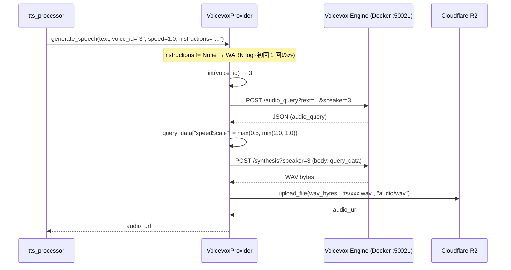
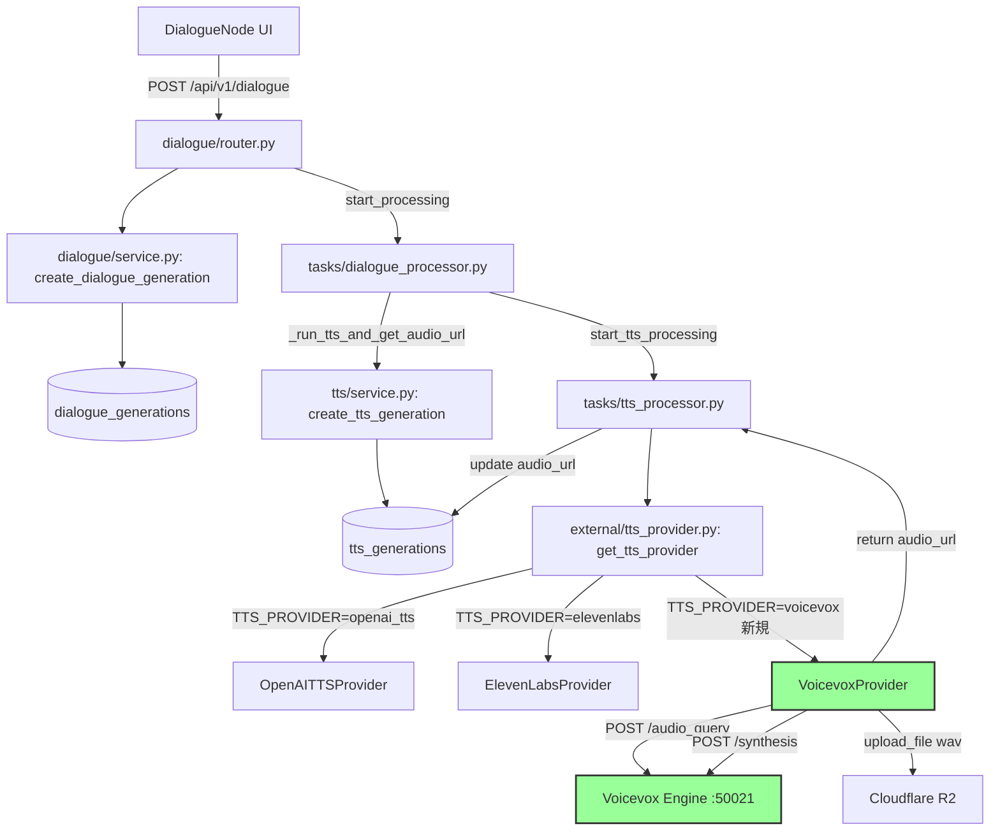

# Design Doc: Voicevox 統合 (日本語特化 TTS プロバイダー追加)

- **作成日**: 2026-05-15
- **最終更新**: 2026-05-18
- **ステータス**: Draft
- **対象バージョン**: movie-maker-api (FastAPI, Python 3.11+)
- **関連 Design Doc**:
  - [`2026-05-18_tts-emotion-instructions.md`](./2026-05-18_tts-emotion-instructions.md) — TTS instructions 機能 (OpenAI gpt-4o-mini-tts の感情指示)。本 doc はその後段で「OpenAI の限界による日本語不自然」を解決する。
- **関連コミット**:
  - `4a05f9e` — `JAPANESE_ACCENT_PREFIX` を OpenAI TTS provider に自動付与 (本 doc の前提)
- **複雑度評価**: `complexity_level: low`
  - **complexity_rationale**:
    1. 要件/AC: バックエンド 3 ファイル + 新規 provider 1 ファイル + 新規テスト 1 ファイル。既存 `TTSProviderInterface` の実装を 1 つ追加するだけの構造変化。フロントエンドは透過 (変更なし)。
    2. 制約/リスク: Voicevox Docker のローカル起動依存、本番デプロイ環境 (Railway) で動作不可の可能性、WAV 形式と既存 MP3 想定の差異。ただしいずれも provider 切替で吸収可能。

---

## 0. Agreement Checklist (合意事項)

ユーザーから受領した要件:

- **A** Voicevox を日本語特化 TTS として統合し `TTS_PROVIDER=voicevox` で透過的に切替可能にする。
  - 反映先: §4-1 (Factory 拡張) / §4-2 (VoicevoxProvider 実装) / §4-4 (Config 追加)
- **B** Voicevox `voice_id` は **style_id (数値文字列)** として扱う (例: `"3"` = ずんだもん ノーマル)。
  - 反映先: §4-2-3 (list_voices フラット化) / §4-2-2 (generate_speech 引数解釈)
- **C** `instructions` パラメータは Voicevox では非対応のため**無視 + WARN ログ**を出力する (初回 1 回のみ)。
  - 反映先: §4-2-2 (generate_speech 内 instructions ハンドリング) / §7-5 / AC-5
- **D** 合成フローは Voicevox 公式の **2 ステップ (`/audio_query` → `/synthesis`)** を踏襲し、speedScale を audio_query に適用する。
  - 反映先: §4-2-2 (合成フロー詳細) / §4-3 (シーケンス図)
- **E** Frontend は変更なし (TTS provider は backend env で切替、UI 透過)。DialogueNode 側の注記追加は将来検討。
  - 反映先: §2-2 (Non-Goals) / §11 U2
- **スコープ**: バックエンドの provider 追加のみ。Railway 等の本番デプロイ戦略、Docker compose 統合は別 doc で取り扱う。
- **非スコープ**: フロントエンド UI 変更、Voicevox provider の本番運用化、Aivis Speech / Azure TTS Nanami 統合、声優キャラ毎の使用許諾管理 UI、複数 provider 同時サポート (UI で provider 選択)。

各合意項目は後段セクションに反映済 (反映先未記入の項目なし)。

---

## 1. 背景・課題

### 1-1. ユーザーからのフィードバック

DialogueNode TTS (現状: `TTS_PROVIDER=openai_tts`, model=`gpt-4o-mini-tts`) でユーザーが日本語合成を試した結果:

> ピッチアクセントが外国人風 (橋/箸 の区別がつかない、不自然な英語訛り)。
> 既存の感情指示 instructions (2026-05-18_tts-emotion-instructions.md) を強化しても改善は限定的。

### 1-2. 直前対応の限界

直前コミット `4a05f9e` で OpenAI TTS provider に以下を追加:

- `JAPANESE_ACCENT_PREFIX` (英語の指示文): `Use natural Japanese pitch accent (Tokyo dialect standard). ...`
- `language="ja"` 時、ユーザー指定 instructions の有無に関わらず prefix を自動付与
- 既存 instructions が prefix で始まる場合は重複付与しない

実コード調査 (`app/external/openai_tts_provider.py` L20-26, L85-102):

| 状態 | 確認結果 |
|---|---|
| `JAPANESE_ACCENT_PREFIX` 定数 | L22-26 で定義済 |
| 自動付与ロジック | L89-102 で language=="ja" + (not instructions) / 既存 instructions の prefix 重複チェック実装済 |
| デフォルト本文 | L90-97 で英語化 (`Speak natural Japanese with rich emotional expression...`) |

→ コードレベルでは「OpenAI に対する最大限の指示」を実装済。それでもユーザー判定は「**まだ不自然**」。

### 1-3. 根本原因

`gpt-4o-mini-tts` は GPT-4o mini を base とする**英語ベースの多言語モデル**。日本語のピッチアクセント (高低アクセント、モーラ拍) は**英語話者が習得しないと再現困難な言語特性**であり、instructions による誘導には限界がある。

OpenAI 公式ドキュメントでも「英語の品質が最も高い」とされ、日本語は「対応はするが精度差あり」と明記されている。

### 1-4. 解決アプローチ: 日本語特化 TTS への切替

日本国産 TTS エンジン **Voicevox** は:

- 日本語のピッチアクセント・モーラ拍を**ネイティブに学習したモデル**を採用
- 30+ キャラクター × 各キャラ複数スタイル (ノーマル/喜び/怒り/悲しみ/ツンツン/ささやき 等)
- ローカル Docker で起動 (`docker run -d -p 50021:50021 voicevox/voicevox_engine:cpu-latest`)
- HTTP API がシンプル (2 ステップ: `/audio_query` → `/synthesis`)
- 無料 + 商用利用可 (キャラ毎の利用規約遵守 + クレジット表記必要)

既存の `TTSProviderInterface` 設計により、Voicevox 用 provider を 1 つ追加するだけで透過的に切替可能。

---

## 2. 目標 (Goals / Non-Goals)

### 2-1. Goals

#### A. Voicevox provider の新規追加
- `TTSProviderInterface` を実装する `VoicevoxProvider` を新規作成。
- `TTS_PROVIDER=voicevox` env で `get_tts_provider()` が透過的に切替。

#### B. 2 ステップ合成フローの実装
- Voicevox 公式の `/audio_query` (JSON 取得) → `speedScale` 適用 → `/synthesis` (WAV バイナリ取得) を `generate_speech` 内部で完結。
- WAV を R2 にアップロードして公開 URL を返す (`is_synchronous=True`)。

#### C. voice 一覧 API の対応
- `/speakers` を fetch → 各キャラの styles をフラット化 (`voice_id="3", name="ずんだもん (ノーマル)"` 形式)。
- 既存 `GET /api/v1/tts/voices` 経由でフロントエンドの voice dropdown に表示可能。

#### D. instructions 非対応の明示
- `instructions` 引数を受け取った場合、**無視 + WARN ログ** を出力 (初回 1 回のみ)。
- ElevenLabs provider の「静かに無視」とは異なり、運用時の気付きを確保するため WARN を出す。

#### E. ローカル開発環境で即試聴可能
- ユーザー作業 (Docker 起動 1 コマンド) と env 切替 (`TTS_PROVIDER=voicevox`) のみで動作。

### 2-2. Non-Goals (今回スコープ外)

- フロントエンド UI 変更 (DialogueNode の注記表示、provider 選択 UI)。
  - 理由: provider 切替は backend env で行うため、UI は透過。注記は将来追加可能。
- Voicevox の **本番運用化** (Railway へのデプロイ、Docker compose 統合、k8s)。
  - 理由: 本 doc はローカル試聴用の provider 追加に絞る。本番運用は別 doc で取り扱う (Azure TTS Nanami への切替等)。
- Aivis Speech / Azure TTS Nanami / Google Cloud TTS 統合。
  - 理由: 採用案セクション §3-3 で比較するが、実装は Voicevox に絞る。
- 複数 TTS provider を同時サポートし UI で選択させる機能。
  - 理由: 既存設計が「env で 1 つ選択」前提のため大規模改修になる。
- キャラ毎の商用利用規約・クレジット表記管理 UI。
  - 理由: 運用ルールとしてユーザーに README で告知し、UI 化は別 task。
- WAV → MP3 変換 (R2 アップロード時)。
  - 理由: HTML5 `<audio>` 要素は WAV をネイティブサポートするため変換不要。WAV のまま R2 にアップロード。
- Voicevox の **キャラごとの利用許諾検証** (API key 等は不要)。

---

## 3. 既存コードベース調査 (Existing Codebase Analysis)

### 3-1. 類似機能検索の結果

- **検索キーワード**: `TTSProviderInterface`, `tts_provider`, `voicevox`, `get_tts_provider`, `list_voices`
- **検索範囲**: `movie-maker-api/app/`
- **結果**:
  - Voicevox 関連の実装は**存在しない** (新規追加)。
  - `TTSProviderInterface` (`app/external/tts_provider.py` L24-111) は既存 2 provider (OpenAI / ElevenLabs) と完全互換な抽象化を提供しており、新 provider の追加コストは最小。
  - Factory 関数 `get_tts_provider` (L114-136) が `provider_name` で分岐する単純 if-else 構造で、新分岐の追加が安全。

### 3-2. 採用判断

| 判断 | 理由 |
|------|------|
| **既存実装の使用 = 一部** | `TTSProviderInterface` (L24-111)、`TTSStatus` (L15-21)、`r2_client.upload_file` (`app/external/r2.py` L246-264) はそのまま再利用。新規 provider は既存パターンに準拠する形で追加。 |
| **改善提案 ADR 不要** | 既存設計 (provider interface + factory) は健全。新 provider を 1 つ追加する典型例。 |
| **新規実装** | `app/external/voicevox_provider.py` (新規ファイル)、`app/core/config.py` への env 追加、factory への分岐 1 行追加。 |

### 3-3. 実装パスマッピング

#### バックエンド

| ファイル | 状態 | 変更内容 |
|---|---|---|
| `app/external/voicevox_provider.py` | **新規** | `VoicevoxProvider` クラス (TTSProviderInterface 実装) |
| `app/external/tts_provider.py` | 既存 | `get_tts_provider` factory に `"voicevox"` 分岐 1 ブロック追加 (L129 前後) |
| `app/core/config.py` | 既存 | `VOICEVOX_API_URL: str = "http://localhost:50021"` を Settings クラスに追加 (L100 前後) |
| `.env.example` (もし存在すれば) | 既存 | `VOICEVOX_API_URL=http://localhost:50021` のサンプルを追加 |
| `tests/external/test_voicevox_provider.py` | **新規** | mock を用いた provider テスト 5+ ケース |

#### フロントエンド

| ファイル | 状態 | 変更内容 |
|---|---|---|
| (なし) | - | 変更なし。`GET /api/v1/tts/voices` 経由で provider の voice 一覧が動的に取得されるため、UI は透過。 |

### 3-4. 統合ポイント (Integration Points)

`TTS_PROVIDER=voicevox` 設定時、既存の TTS 経路 (`DialogueNode → dialogueApi.create → /api/v1/dialogue → dialogue_processor → tts.service.create_tts_generation → tts_processor.process_tts_generation → provider.generate_speech`) のうち、**末端の `provider.generate_speech` 呼び出し先のみが切り替わる**。

`tts_processor.py` (L52, L62-68) は `record.get("instructions")` を読み取って provider に渡しているが、Voicevox では provider 内部で無視するため経路改修不要。

| 統合ポイント | 既存コンポーネント | 統合方法 | 影響レベル |
|---|---|---|---|
| Factory 分岐 | `app/external/tts_provider.py` L114-136 `get_tts_provider` | 既存 if-else に `voicevox` 分岐 1 ブロック追加 | Low (新規ブランチのみ、既存ブランチ無変更) |
| Config | `app/core/config.py` L4-110 `Settings` クラス | 新規フィールド `VOICEVOX_API_URL` 追加 (デフォルト値あり) | Low (Optional、既存ユーザー影響なし) |
| TTS 経路 | `app/tasks/tts_processor.py` L62-68 `provider.generate_speech` 呼び出し | 変更なし。provider が透過的に切替 | None (経路自体無変更) |
| 既存 OpenAI / ElevenLabs | `app/external/openai_tts_provider.py` / `elevenlabs_provider.py` | 変更なし | None |
| R2 アップロード | `app/external/r2.py` L246-264 `r2_client.upload_file` | 既存 `upload_file(file_data, key, content_type="audio/wav")` を呼ぶだけ | None |

---

## 4. 採用案 (設計詳細)

### 4-1. Factory 拡張 (`app/external/tts_provider.py`)

既存 `get_tts_provider` (L114-136) は以下の構造:

```python
if provider_name == "openai_tts":
    from app.external.openai_tts_provider import OpenAITTSProvider
    return OpenAITTSProvider()
else:
    from app.external.elevenlabs_provider import ElevenLabsProvider
    return ElevenLabsProvider()
```

**改修方針**:

```python
if provider_name == "openai_tts":
    from app.external.openai_tts_provider import OpenAITTSProvider
    logger.info("Using OpenAI TTS provider")
    return OpenAITTSProvider()
elif provider_name == "voicevox":
    from app.external.voicevox_provider import VoicevoxProvider
    logger.info("Using Voicevox provider")
    return VoicevoxProvider()
else:
    from app.external.elevenlabs_provider import ElevenLabsProvider
    logger.info("Using ElevenLabs TTS provider")
    if provider_name not in ("elevenlabs", None):
        logger.warning(
            f"Unknown TTS provider '{provider_name}', falling back to ElevenLabs"
        )
    return ElevenLabsProvider()
```

- docstring の `provider_name` 引数説明 (L119) も `"elevenlabs", "openai_tts", "voicevox"` に更新。
- 未知の provider 名は ElevenLabs にフォールバック + `logger.warning` で明示 (M1)。

### 4-2. VoicevoxProvider 実装 (`app/external/voicevox_provider.py`)

#### 4-2-1. クラス構造とインポート

```yaml
新規ファイル: app/external/voicevox_provider.py
モジュール docstring: Voicevox プロバイダー (日本語特化 TTS、ローカル Docker)
インポート:
  - logging
  - typing.Optional
  - uuid.uuid4
  - httpx
  - app.external.tts_provider.TTSProviderInterface, TTSStatus
  - app.external.r2.r2_client
ロガー: logger = logging.getLogger(__name__)
```

#### 4-2-2. `generate_speech` メソッド

合意項目 D に基づく 2 ステップ合成フロー:

```yaml
async def generate_speech(text, voice_id, language="ja", speed=1.0, instructions=None) -> str:
  事前バリデーション:
    - text 空チェック (ValueError)
    - voice_id を int に変換 (style_id): try int(voice_id) / except → ValueError("voice_id must be numeric style id")
    - instructions != None かつ != "" の場合: 初回 1 回のみ logger.warning (self._warned_about_instructions フラグで制御)

  Step 1: audio_query
    URL: f"{VOICEVOX_API_URL}/audio_query"
    Method: POST
    Query params: text={text}, speaker={style_id_int}
    Body: なし
    Timeout: 30s
    raise_for_status

  Step 2: speedScale 適用
    query_data = audio_query_response.json()
    query_data["speedScale"] = max(0.5, min(2.0, speed))  # defensive clamp (M2)

  Step 3: synthesis
    URL: f"{VOICEVOX_API_URL}/synthesis"
    Method: POST
    Query params: speaker={style_id_int}
    Body: query_data (JSON)
    Timeout: 60s
    Response: WAV バイナリ (Content-Type: audio/wav)
    raise_for_status

  Step 4: R2 アップロード
    audio_key = f"tts/{uuid4().hex}.wav"
    audio_url = await r2_client.upload_file(
        file_data=wav_bytes,
        key=audio_key,
        content_type="audio/wav"
    )

  Step 5: 戻り値
    return audio_url
```

実装サンプル (構造のみ、最終実装は task で確定):

```python
class VoicevoxProvider(TTSProviderInterface):
    def __init__(self):
        from app.core.config import settings
        self._api_url = getattr(settings, "VOICEVOX_API_URL", "http://localhost:50021").rstrip("/")
        self._warned_about_instructions = False  # M3: 初回 1 回のみ WARN

    @property
    def provider_name(self) -> str:
        return "voicevox"

    @property
    def is_synchronous(self) -> bool:
        return True

    async def generate_speech(
        self,
        text: str,
        voice_id: str,
        language: str = "ja",
        speed: float = 1.0,
        instructions: Optional[str] = None,
    ) -> str:
        if not text or not text.strip():
            raise ValueError("text must not be empty")

        try:
            style_id = int(voice_id)
        except (TypeError, ValueError) as e:
            raise ValueError(
                f"Voicevox voice_id must be a numeric style id (got: {voice_id!r})"
            ) from e

        # M3: instructions WARN は初回 1 回のみ
        if instructions and not self._warned_about_instructions:
            logger.warning(
                "Voicevox does not support 'instructions' parameter; ignoring. "
                "(value omitted from log to avoid leaking dialogue text)"
            )
            self._warned_about_instructions = True

        async with httpx.AsyncClient(timeout=60.0) as client:
            # Step 1: audio_query
            try:
                query_response = await client.post(
                    f"{self._api_url}/audio_query",
                    params={"text": text, "speaker": style_id},
                    timeout=30.0,
                )
                query_response.raise_for_status()
                query_data = query_response.json()
            except httpx.ConnectError as e:
                raise RuntimeError(
                    f"Voicevox engine not reachable at {self._api_url}. "
                    f"Is the Docker container running? (docker run -d -p 50021:50021 voicevox/voicevox_engine:cpu-latest)"
                ) from e

            # Step 2: apply speed with defensive clamp (M2)
            query_data["speedScale"] = max(0.5, min(2.0, speed))

            # Step 3: synthesis
            synth_response = await client.post(
                f"{self._api_url}/synthesis",
                params={"speaker": style_id},
                json=query_data,
                timeout=60.0,
            )
            synth_response.raise_for_status()
            wav_bytes = synth_response.content

        # Step 4: R2 upload
        audio_key = f"tts/{uuid4().hex}.wav"
        audio_url = await r2_client.upload_file(
            file_data=wav_bytes,
            key=audio_key,
            content_type="audio/wav",
        )
        logger.info(f"Voicevox TTS generated and uploaded: {audio_url}")
        return audio_url
```

**設計上の注意**:

- `httpx.AsyncClient(timeout=60.0)` で外側 timeout、各 request で個別 timeout 指定。
- `audio_query` の timeout を 30s に短くしている理由: テキスト解析のみで合成は行わないため通常 1s 以内。タイムアウトすれば engine 異常と判断。
- `synthesis` は CPU 版 Voicevox で 1 文 1-3 秒、長文 (500 文字超) で 10-20 秒程度。60s timeout で十分。
- `httpx.ConnectError` を `RuntimeError` にラップして明示メッセージを出す (AC-6 対応)。
- `instructions` のログは値を出力しない (ユーザーセリフ漏洩防止)。
- `speedScale` は `max(0.5, min(2.0, speed))` で clamp する (M2)。`DialogueCreateRequest.speed` は 0.25-4.0 範囲を許容するが、Voicevox の仕様上限が 2.0 のため provider 内で明示的に制約。
- `_warned_about_instructions` フラグにより、同一インスタンスで instructions が複数回渡されても WARN は初回 1 回のみ出力する (M3)。

#### 4-2-3. `list_voices` メソッド

```yaml
async def list_voices(language=None) -> list[dict]:
  Step 1: /speakers fetch
    URL: f"{VOICEVOX_API_URL}/speakers"
    Method: GET
    Timeout: 10s
    raise_for_status

  Step 2: flatten
    入力: list[{name, speaker_uuid, styles: [{name, id, type}]}]
    出力: 各 (キャラ × style) の組み合わせを 1 件として展開

  Step 3: language filter (Voicevox は全 voice が ja のため)
    language が "ja" or None なら全件返す
    language != "ja" なら空配列 (Voicevox は ja 専用)

  戻り値形式:
    [{"voice_id": str(style_id), "name": f"{character_name} ({style_name})", "language": "ja", "preview_url": None}, ...]
```

実装サンプル:

```python
async def list_voices(self, language: Optional[str] = None) -> list[dict]:
    if language is not None and language != "ja":
        return []  # Voicevox is Japanese-only

    try:
        async with httpx.AsyncClient(timeout=10.0) as client:
            response = await client.get(f"{self._api_url}/speakers")
            response.raise_for_status()
            speakers = response.json()
    except httpx.ConnectError as e:
        raise RuntimeError(
            f"Voicevox engine not reachable at {self._api_url}. "
            f"Is the Docker container running?"
        ) from e

    result = []
    for speaker in speakers:
        character_name = speaker.get("name", "Unknown")
        for style in speaker.get("styles", []):
            style_id = style.get("id")
            style_name = style.get("name", "Normal")
            if style_id is None:
                continue
            result.append({
                "voice_id": str(style_id),
                "name": f"{character_name} ({style_name})",
                "language": "ja",
                "preview_url": None,
            })
    return result
```

**設計上の注意**:

- `voice_id` は数値 style_id を**文字列化**して返す (既存 `VoiceInfo` schema は `voice_id: str` のため整合性確保)。
- フロントエンドは数値文字列をそのまま voice_id として保存し、generate_speech 呼び出し時に backend で int に変換する。
- `preview_url` は Voicevox の `/speaker_info` で取得可能だが、URL 形式が image (base64) であり HTTP URL ではないため、本 doc では None 固定。将来必要なら別 task で対応。

#### 4-2-4. `check_status` / `get_audio_url` メソッド

OpenAI / ElevenLabs と同様、Voicevox は同期 provider のため task_id は audio_url そのもの:

```python
async def check_status(self, task_id: str) -> TTSStatus:
    return TTSStatus(
        status="completed",
        audio_url=task_id,
        duration_seconds=None,
        error_message=None,
    )

async def get_audio_url(self, task_id: str) -> Optional[str]:
    return task_id
```

### 4-3. 合成フローのシーケンス (mermaid)



### 4-4. Config 拡張 (`app/core/config.py`)

`Settings` クラスの既存 TTS Provider Settings (L91-93) の直後に追加:

```python
# Voicevox (ローカル日本語 TTS)
# Docker: docker run -d -p 50021:50021 voicevox/voicevox_engine:cpu-latest
VOICEVOX_API_URL: str = "http://localhost:50021"
```

- デフォルト値あり (`http://localhost:50021`) → 既存ユーザーの `.env` 改修不要。
- Voicevox を使う場合のみ `.env` で上書き可能 (e.g. `VOICEVOX_API_URL=http://voicevox.internal:50021`)。
- `TTS_PROVIDER=voicevox` に切替えても VOICEVOX_API_URL 未設定でデフォルトで起動。

### 4-5. アーキテクチャ図



緑色のノードが本 doc で新規追加・統合される部分。それ以外は既存実装。

---

## 5. 環境構築手順 (ユーザー作業)

### 5-1. Voicevox Docker 起動

```bash
# CPU 版 (ARM Mac でも動作)
docker run --rm -d \
  -p 50021:50021 \
  --name voicevox_engine \
  voicevox/voicevox_engine:cpu-latest

# GPU 版 (NVIDIA GPU 搭載時)
docker run --rm -d --gpus all \
  -p 127.0.0.1:50021:50021 \
  --name voicevox_engine \
  voicevox/voicevox_engine:nvidia-latest
```

### 5-2. 動作確認

```bash
# 1. version 取得
curl http://localhost:50021/version
# → "0.x.x" が返れば OK

# 2. speakers 一覧
curl http://localhost:50021/speakers | jq '.[0]'
# → {"name": "四国めたん", "speaker_uuid": "...", "styles": [...]}

# 3. 合成テスト (ずんだもん ノーマル, style_id=3)
curl -s -X POST "http://localhost:50021/audio_query?text=こんにちは&speaker=3" > query.json
curl -s -X POST "http://localhost:50021/synthesis?speaker=3" \
  -H "Content-Type: application/json" \
  -d @query.json --output test.wav
# → test.wav が再生可能なら OK
```

### 5-3. backend env 切替

`movie-maker-api/.env` を編集:

```bash
TTS_PROVIDER=voicevox
VOICEVOX_API_URL=http://localhost:50021  # デフォルト値なので省略可
```

**注意**: `uvicorn --reload` では `.env` ファイルの変更を反映しない。プロセスを完全 kill して再起動すること (N6)。

```bash
# 再起動例
pkill -f "uvicorn app.main:app" || true
make dev
```

### 5-4. フロントエンドからの確認

- `npm run dev` で frontend を起動。
- DialogueNode を配置 → voice dropdown を開く → Voicevox の voice 一覧 (ずんだもん、四国めたん 等) が表示される。
- 合成ボタン → WAV 音声が生成され再生可能。

### 5-5. 商用利用時のクレジット表記

Voicevox は無料 + 商用利用可だが、**キャラクター毎の利用規約とクレジット表記**が必要:

- 例: `VOICEVOX:ずんだもん`、`VOICEVOX:四国めたん`
- 動画内のエンドロール、説明欄、アプリ紹介画面等に明記。
- クレジット表記なし商用利用は**キャラ毎に 40 万円 + 消費税で契約**可 (公式)。
- 詳細は §17 References を参照。

**本 doc スコープ外** (実装ではなく運用ルール) だが、§11 U1 で要ユーザー確認事項として記載。

---

## 6. データ契約 (Data Contracts)

### 6-1. Voicevox `/speakers` レスポンス契約

```yaml
GET /speakers
  入力: なし
  出力 (200): array of {
    name: str            # 例: "ずんだもん"
    speaker_uuid: str    # 例: "388f246b-..."
    styles: array of {
      name: str          # 例: "ノーマル"
      id: int            # 例: 3 (style_id)
      type: str          # 例: "talk" (本 doc では未使用)
    }
    version: str         # 例: "0.x.x"
    supported_features: object   # 本 doc では未使用
  }
  エラー時:
    - 503 (engine 起動直後で voice モデル未ロード)
```

### 6-2. Voicevox `/audio_query` レスポンス契約

```yaml
POST /audio_query?text={text}&speaker={style_id}
  入力 (query params):
    text: str (1+ 文字、URL エンコード必要)
    speaker: int (style_id)
  入力 (body): なし
  出力 (200): AudioQuery JSON {
    accent_phrases: array        # アクセント句リスト
    speedScale: float            # 話速 (デフォルト 1.0、本 doc で上書き)
    pitchScale: float            # ピッチ (デフォルト 0.0)
    intonationScale: float       # 抑揚 (デフォルト 1.0)
    volumeScale: float           # 音量 (デフォルト 1.0)
    prePhonemeLength: float
    postPhonemeLength: float
    outputSamplingRate: int      # デフォルト 24000
    outputStereo: bool           # デフォルト false
    kana: str                    # 解析されたカタカナ
  }
  エラー時:
    - 400 (invalid speaker / text)
    - 422 (validation error)
```

### 6-3. Voicevox `/synthesis` レスポンス契約

```yaml
POST /synthesis?speaker={style_id}
  入力 (query params):
    speaker: int (style_id)
  入力 (body): AudioQuery JSON (上記 /audio_query レスポンス)
  出力 (200): WAV バイナリ (Content-Type: audio/wav)
  エラー時:
    - 400 (invalid speaker / query)
    - 422 (validation error)
```

### 6-4. VoicevoxProvider が返す voice 辞書契約

```yaml
list_voices() の各要素:
  voice_id: str        # 数値の文字列 (例: "3" = ずんだもん ノーマル)
  name: str            # f"{character_name} ({style_name})" (例: "ずんだもん (ノーマル)")
  language: "ja"       # 固定 (Voicevox は日本語専用)
  preview_url: None    # 本 doc では未対応
```

### 6-5. generate_speech 戻り値契約

```yaml
generate_speech(...) -> str:
  戻り値: R2 公開 URL (例: "https://r2.example.com/tts/abc123.wav")
  形式: WAV (audio/wav)
  ファイル名: tts/{uuid4_hex}.wav
```

---

## 7. エッジケース

### 7-1. Voicevox Docker が起動していない

- **発生条件**: ユーザーが Docker 起動前に合成リクエスト送信。
- **挙動**:
  - `httpx.ConnectError` が発生 → provider 内で `RuntimeError` にラップ。
  - エラーメッセージに明示的に Docker 起動コマンドを含める。
- **対応**: `tts_processor.py` の `except Exception` で catch → `tts_generations.status = "failed"`, `error_message` に上記 RuntimeError メッセージを保存。フロントエンドはエラー表示。

### 7-2. 不正な voice_id (style_id) 指定

- **発生条件**: フロントエンドが古い voice_id (Voicevox に存在しない style_id) を送信、または非数値文字列。
- **挙動**:
  - 非数値: `int(voice_id)` で ValueError → 即座に raise (Step 1 到達前)。
  - 存在しない style_id: Voicevox の `/audio_query` が 400/422 を返す → `raise_for_status` で `httpx.HTTPStatusError`。
- **対応**: 上記 7-1 と同様、`tts_generations.status = "failed"` で記録。

### 7-3. 極端に長いテキスト (1000+ 文字)

- **発生条件**: 長文セリフを 1 リクエストで送信。
- **挙動**:
  - `/audio_query`: テキスト解析のみで通常 1-2 秒で完了。
  - `/synthesis`: CPU 版で 1000 文字なら 30-60 秒、GPU 版で 5-10 秒。
  - 本 doc では timeout=60.0 (httpx.AsyncClient) を設定。超過時は `httpx.TimeoutException`。
- **対応**:
  - 短期: 60s timeout で十分なケースが大半。タイムアウト時は明示エラー。
  - 長期改善 (U3 参照): 既存 `DialogueCreateRequest.text` の `max_length=5000` をそのまま継承 (変更不要)。Voicevox の場合は分割合成 + 結合を将来検討。

### 7-4. 速度が極端 (speed < 0.5 or speed > 2.0)

- **発生条件**: フロントエンドの speed slider 範囲外の値が送信される。
- **挙動**:
  - Voicevox の `speedScale` 範囲は公式仕様で 0.5-2.0。
  - 既存 `DialogueCreateRequest.speed` の Field 範囲 (0.25-4.0) と差異あり。
- **対応**:
  - **provider 内で clamp する (M2)**: `query_data["speedScale"] = max(0.5, min(2.0, speed))` により、範囲外の値は安全に制約される。
  - AC-4b: `speed=4.0` (DialogueCreateRequest 範囲外ではないが Voicevox 仕様超過) でも合成成功し、`speedScale=2.0` に clamp される。

### 7-5. `instructions` パラメータ受領

- **発生条件**: 上流 (tts_processor) が `record.get("instructions")` で非 None 値を渡す (OpenAI TTS 向けに保存された値が Voicevox にも流れる)。
- **挙動**:
  - provider 内で WARN ログ出力、ただし**同一インスタンスで初回 1 回のみ** (M3、`_warned_about_instructions` フラグで制御)。
  - text 内容は出力しない (プライバシー保護)。
  - 例外は発生させず、合成は正常完了。
- **対応**:
  - `logger.warning("Voicevox does not support 'instructions' parameter; ignoring.")` を初回のみ出力。
  - 既存 ElevenLabs は「静かに無視」だが、Voicevox は **WARN を出す** ことで運用時の気付き向上 (合意項目 C)。ただし大量の同一警告でログを汚染しないよう初回制限を設ける。

### 7-6. WAV 形式と既存 MP3 想定との差異

- **発生条件**: 既存 R2 アップロードは MP3 想定 (`tts/{uuid}.mp3`, `content_type="audio/mpeg"`)。WAV を流すと拡張子・MIME が変わる。
- **影響範囲調査**:
  - `app/external/r2.py` `r2_client.upload_file` は汎用関数で content_type 引数を受け付ける → WAV でも問題なし。
  - フロントエンドの audio 再生: HTML5 `<audio>` 要素は WAV/MP3 両対応 → 再生可能。
  - PDF 出力 / 動画埋め込み等の下流処理: 確認必要 (`storyboard_pdf` 等は audio_url のみ参照、形式不問)。
- **対応**:
  - 本 doc では WAV のまま R2 にアップロード (変換コスト回避)。
  - 万一下流で MP3 必須の処理が見つかった場合は別 task で `ffmpeg` 変換を追加。
- **検証項目** (Phase 4 で確認): DialogueNode 経由で WAV 生成 → ブラウザで再生確認 → 後段の lip-sync (Hedra) で WAV 入力が受け付けられるか確認。
- **Phase 2 開始時に確認**: Hedra API doc で audio format 受け入れ範囲 (mp3/wav) を確認すること (N2)。

### 7-7. backend デプロイ環境 (Railway) で Voicevox が動かない

- **発生条件**: 開発ローカルで動作する provider が、Railway 等の本番環境では Voicevox Docker を併設できない。
- **挙動**:
  - Railway で `TTS_PROVIDER=voicevox` 設定 + Voicevox 未起動 → §7-1 と同じ ConnectError。
- **対応**:
  - 本 doc スコープ外。本番では `TTS_PROVIDER=openai_tts` or `elevenlabs` を継続使用。
  - 将来検討 (§11 U2): Railway sidecar / 別 service として Voicevox engine を deploy、または Azure TTS Nanami への切替。

### 7-8. Voicevox engine のバージョン差異

- **発生条件**: ユーザーが古い `voicevox/voicevox_engine:cpu-X.Y.Z` を使い、API 仕様 (例: speakers レスポンスの styles 構造) が変わっている。
- **挙動**: `list_voices` の `style.get("id")` が None になる等。本 doc では `if style_id is None: continue` で skip。
- **対応**:
  - `cpu-latest` を推奨 (環境構築手順に明記)。
  - 互換性問題が発生した場合は github issue で対応。

---

## 8. 後方互換性

### 8-1. 既存 TTS provider への影響

- `OpenAITTSProvider` / `ElevenLabsProvider`: **変更なし**。`TTS_PROVIDER` env を切り替えない限り既存挙動を維持。
- `TTSProviderInterface` 抽象クラス: **変更なし** (新規 provider が既存 interface を実装するのみ)。
- `tts_processor.py`: **変更なし** (`provider.generate_speech(..., instructions=...)` 呼び出しはそのまま、Voicevox 内部で無視)。

### 8-2. 既存テストへの影響

- `tests/external/test_openai_tts_provider.py` (もし存在): 変更なし。
- `tests/external/test_elevenlabs_provider.py` (もし存在): 変更なし。
- `tests/tasks/test_tts_processor.py` (もし存在): `get_tts_provider` を mock 化しているテストは変更不要。
- **新規追加**: `tests/external/test_voicevox_provider.py` (§9 参照)。
- **Phase 1 開始時**: `ls movie-maker-api/tests/external/` でテストファイルの実在を確認すること (N4)。存在しなければ新規ディレクトリ + `__init__.py` も作成。

### 8-3. DB スキーマ後方互換

- DB 変更**なし**。既存 `tts_generations` テーブルの `voice_id` カラム (TEXT or VARCHAR) に数値文字列 (例: "3") が保存されるだけ。
- `instructions` カラム (2026-05-18_tts-emotion-instructions.md で追加予定) も影響なし (Voicevox は無視するが値は保存される)。

### 8-4. フロントエンド後方互換

- フロントエンドは `voice_id: string` として扱うため、Voicevox の数値文字列 ("3") も既存 OpenAI/ElevenLabs の UUID 文字列も同じ型で扱える。
- `GET /api/v1/tts/voices` のレスポンス schema (`VoiceInfo`) は変更なし。Voicevox 切替時に表示される voice 一覧の中身が変わるだけ。
- DialogueNode 等の UI は voice dropdown で表示される名前 (`name` フィールド) で識別するため、Voicevox 名 (例: "ずんだもん (ノーマル)") が自然に表示される。

### 8-5. 既存 ElevenLabs / OpenAI ユーザー

- `.env` の `TTS_PROVIDER` が未設定または `elevenlabs` のまま → ElevenLabs 継続使用 (デフォルト挙動、L93)。
- `TTS_PROVIDER=openai_tts` → OpenAI 継続使用。
- **本 doc 変更による既存ユーザーへの影響: なし**。

---

## 9. テスト戦略

### 9-1. Unit テスト (新規ファイル `tests/external/test_voicevox_provider.py`)

| テスト ID | テスト対象 | 検証内容 |
|---|---|---|
| T1 | `VoicevoxProvider.provider_name` | "voicevox" を返す |
| T2 | `VoicevoxProvider.is_synchronous` | True を返す |
| T3 | `generate_speech` 正常系 | text="こんにちは", voice_id="3", speed=1.0 で `audio_query` + `synthesis` が呼ばれる (httpx mock) / R2 にアップロードされる / audio_url が返る |
| T4 | `generate_speech` speed 適用 | speed=1.5 指定時、synthesis に渡される query_data["speedScale"] が 1.5 |
| T5 | `generate_speech` instructions 警告 | instructions="emotion" 指定時、`logger.warning` が呼ばれる + 合成は正常完了 |
| T6 | `generate_speech` text 空 | text="" で ValueError |
| T7 | `generate_speech` voice_id 非数値 | voice_id="abc" で ValueError ("must be numeric style id") |
| T8 | `generate_speech` 接続失敗 | `httpx.ConnectError("connection refused", request=httpx.Request("POST", "http://localhost:50021/audio_query"))` 発生時、RuntimeError ラップ + メッセージに "Voicevox engine not reachable" を含む (N3) |
| T9 | `list_voices()` 正常系 | `/speakers` モックレスポンスから (キャラ x style) の組み合わせがフラット化される / voice_id が style_id の文字列化 / name が "{char} ({style})" 形式 |
| T10 | `list_voices(language="en")` | 空配列を返す (Voicevox は ja 専用) |
| T11 | `check_status` | task_id (audio_url) を渡すと TTSStatus(status="completed", audio_url=task_id) を返す |

**Mock 戦略**:

- `httpx.AsyncClient` の `post` / `get` を `httpx.MockTransport` または `unittest.mock.AsyncMock` でモック。
- `r2_client.upload_file` を `AsyncMock(return_value="https://r2.example.com/tts/xxx.wav")` でモック。
- 既存 `tests/external/test_openai_tts_provider.py` (実在すれば) のパターンを参考にする。
  - 確認コマンド: `ls movie-maker-api/tests/external/ 2>/dev/null` で確認、存在しなければ新規ディレクトリ + `__init__.py` も作成。

**最低 5 テスト** (合意項目 AC-8): T1〜T11 から最低 5 件 (T3, T4, T5, T8, T9 が最重要)。

### 9-2. Factory テスト (既存 `tests/external/test_tts_provider.py` を拡張、なければ新規)

| テスト ID | テスト対象 | 検証内容 |
|---|---|---|
| F1 | `get_tts_provider("voicevox")` | `VoicevoxProvider` インスタンスを返す |
| F2 | `get_tts_provider("openai_tts")` | `OpenAITTSProvider` を返す (既存、退行なし確認) |
| F3 | `get_tts_provider("elevenlabs")` | `ElevenLabsProvider` を返す (既存、退行なし確認) |
| F4 | `get_tts_provider(None)` | settings.TTS_PROVIDER に従う (既存、退行なし確認) |

### 9-3. 統合テスト (手動 E2E)

CI 自動化は外部 Docker 依存のため対象外 (§AC scoping)。以下を手動で実施:

| シナリオ | 検証 |
|---|---|
| Voicevox 起動 + provider 切替 | `docker run` → `.env` 編集 → uvicorn 完全再起動 → DialogueNode 経由で合成成功 |
| voice 一覧 | `GET /api/v1/tts/voices?lang=ja` で 30+ 件の voice が返る (cpu-latest の場合) |
| 速度適用 | speed=1.5 で合成 → 音声が早口になる (定性確認) |
| Docker 未起動 | engine 停止 → 合成エラー → `error_message` に "Voicevox engine not reachable" を含む |
| ElevenLabs 退行確認 | `.env` を `elevenlabs` に戻す → uvicorn 完全再起動 → ElevenLabs voice で合成成功 |

### 9-4. テストカバレッジ目標

- `voicevox_provider.py` 新規実装: 90% 以上 (主要分岐: 正常系 / instructions WARN / 接続エラー / voice_id 非数値 / list_voices 正常 / language=en フィルタ)。

---

## 10. Acceptance Criteria (Given / When / Then)

### AC-1: TTS_PROVIDER=voicevox での provider 切替

**Given**: `.env` で `TTS_PROVIDER=voicevox` が設定されている
**When**: バックエンドで `get_tts_provider()` が呼び出される
**Then**:
- `VoicevoxProvider` インスタンスが返る
- `provider.provider_name == "voicevox"`
- `provider.is_synchronous is True`

### AC-2: list_voices で Voicevox の voice 一覧を返す

**Given**: Voicevox engine が起動しており `/speakers` が 4 キャラ × 各 2 style (合計 8 件) を返す
**When**: `voicevox_provider.list_voices(language="ja")` が呼ばれる
**Then**:
- 戻り値は 8 件の dict
- 各要素は `{"voice_id": str(int), "name": "{character} ({style})", "language": "ja", "preview_url": None}` 形式
- 例: `{"voice_id": "3", "name": "ずんだもん (ノーマル)", "language": "ja", "preview_url": None}`

### AC-3: generate_speech 正常系で R2 URL が返る

**Given**: Voicevox engine が起動しており、`/audio_query` と `/synthesis` が正常応答する
**When**: `generate_speech(text="ちょっと まって", voice_id="3", speed=1.0)` が呼ばれる
**Then**:
- `/audio_query?text=ちょっと まって&speaker=3` (POST) が呼ばれる
- `/synthesis?speaker=3` (POST) に audio_query JSON が body として渡される
- WAV バイナリが R2 にアップロードされる (key 形式: `tts/{uuid_hex}.wav`, content_type: `audio/wav`)
- 戻り値は R2 公開 URL (`https://...`)

### AC-4: speed=1.5 で speedScale が 1.5 に設定される

**Given**: `/audio_query` が `speedScale=1.0` を含む JSON を返す
**When**: `generate_speech(text="...", voice_id="3", speed=1.5)` が呼ばれる
**Then**:
- `/synthesis` POST の body の `speedScale` が **1.5** になっている
- 戻り値は audio URL

### AC-4b: speed=4.0 (Voicevox 仕様超過) でも合成成功し speedScale=2.0 に clamp される

**Given**: `/audio_query` が正常応答する
**When**: `generate_speech(text="...", voice_id="3", speed=4.0)` が呼ばれる
**Then**:
- `/synthesis` POST の body の `speedScale` が **2.0** になっている (clamp 適用)
- 例外は発生せず合成は正常完了し audio URL が返る

### AC-5: instructions 引数受領で WARN ログ + 合成正常完了

**Given**: instructions="Speak excitedly" が渡される
**When**: `generate_speech(text="...", voice_id="3", instructions="Speak excitedly")` が呼ばれる
**Then**:
- `logger.warning` が "Voicevox does not support 'instructions' parameter; ignoring." のメッセージで **1 回**呼ばれる (初回のみ)
- 例外は発生しない
- 合成は正常完了し audio URL が返る
- `/synthesis` body には `instructions` フィールドは含まれない (Voicevox API は受け付けない)
- 同一インスタンスで 2 回目以降に instructions を渡しても `logger.warning` は呼ばれない

### AC-6: Voicevox Docker 未起動時の明示エラー

**Given**: `VOICEVOX_API_URL` が無効 (engine 未起動) → `/audio_query` 呼び出しで `httpx.ConnectError` が発生
**When**: `generate_speech(...)` が呼ばれる
**Then**:
- `RuntimeError` が raise される
- エラーメッセージに `"Voicevox engine not reachable at http://localhost:50021"` と `"docker run -d -p 50021:50021 voicevox/voicevox_engine:cpu-latest"` が含まれる

### AC-7: 既存 OpenAI / ElevenLabs プロバイダーの回帰なし

**Given**: `TTS_PROVIDER=openai_tts` (または `elevenlabs`) で動作している
**When**: 既存テスト群 (`tests/external/test_openai_tts_provider.py` / `test_elevenlabs_provider.py` / `tests/tasks/test_tts_processor.py` 該当あれば) が実行される (Phase 1 開始時に `ls movie-maker-api/tests/external/` で実在確認)
**Then**:
- 全テストが pass
- `OpenAITTSProvider` / `ElevenLabsProvider` の挙動は本 doc 改修前と同一

### AC-8: 新規テストファイルが 5+ 件 pass

**Given**: `tests/external/test_voicevox_provider.py` が新規作成された (Phase 1 開始時に `ls movie-maker-api/tests/external/` で実在確認)
**When**: `pytest tests/external/test_voicevox_provider.py -v` を実行
**Then**:
- 最低 5 件のテストが定義されている (§9-1 の T1〜T11 から選定)
- 全テスト pass (httpx と r2_client は mock 化)

### AC-9: voice_id 非数値時の ValueError

**Given**: voice_id="abc" (非数値文字列) が渡される
**When**: `generate_speech(text="...", voice_id="abc")` が呼ばれる
**Then**:
- `ValueError` が raise され、メッセージに "voice_id must be a numeric style id" を含む
- `/audio_query` は呼ばれない

### AC-10: text 空時の ValueError

**Given**: text="" または text="   " (whitespace のみ)
**When**: `generate_speech(text="", voice_id="3")` が呼ばれる
**Then**:
- `ValueError("text must not be empty")` が raise される
- `/audio_query` は呼ばれない

---

## 11. 想定工数 (Phase 別)

| Phase | 内容 | 想定工数 |
|---|---|---|
| Phase 1: Config + Factory | `app/core/config.py` に `VOICEVOX_API_URL` 追加、`tts_provider.py` factory に分岐追加 | 0.5 時間 |
| Phase 2: VoicevoxProvider 実装 | `voicevox_provider.py` 新規作成 (generate_speech / list_voices / check_status / get_audio_url) | 2.5 時間 |
| Phase 3: テスト作成 | `tests/external/test_voicevox_provider.py` 新規 5+ ケース + 既存 factory テストへ F1 追加 | 2.0 時間 |
| Phase 4: 手動 E2E 検証 | Docker 起動 → env 切替 → DialogueNode 経由で合成 → 退行確認 (OpenAI/ElevenLabs に戻して動作確認) | 1.5-2.0 時間 |
| Phase 5: ドキュメント更新 | `movie-maker-api/CLAUDE.md` に Voicevox 起動方法追記、`.env.example` 更新 | 0.5 時間 |
| **合計** | | **7.0-7.5 時間 (約 1 日)** |

---

## 12. 未解決項目 / 要ユーザー確認事項

### U1. 商用利用時のキャラクター利用許諾

- **論点**: Voicevox 全キャラが商用利用可だが、各キャラの個別規約 (例: 政治・宗教用途禁止、成人向けコンテンツ禁止等) があり、ユーザー製作物の用途に応じて確認必須。
- **暫定方針**: 本 doc では実装スコープ外。`movie-maker-api/CLAUDE.md` か README にユーザー向け注意書きを追記 (Phase 5)。
- **要確認**: クレジット表記方法 (例: 動画エンドロールへの自動挿入機能を将来追加するか)、キャラ毎の使用許諾 toggle UI の必要性。

### U2. 本番デプロイ戦略

- **論点**: Voicevox engine は CPU でも数百 MB の docker image。Railway 等の PaaS で sidecar として動作させるかは未検討。
- **選択肢**:
  - **A**: Voicevox はローカル開発専用とし、本番では OpenAI / ElevenLabs / Azure TTS Nanami を継続。
  - **B**: Railway / Fly.io で Voicevox engine を別 service として deploy、`VOICEVOX_API_URL` で接続。
  - **C**: 自前 VPS (Hetzner 等) で常駐させる。
- **暫定方針**: **A 案** (本 doc スコープ)。本番品質確認後に別 doc で検討。
- **要確認**: 本 doc 検証後の音質判定 → 本番採用したい場合に再議論。

### U3. WAV vs MP3 (R2 storage コスト)

- **論点**: WAV は MP3 比で 5-10 倍のファイルサイズ。R2 storage コストは安価だが、長期蓄積で差が出る。
- **暫定方針**: WAV のまま保存 (変換コスト > storage コスト と想定)。
- **要確認**: 1 ヶ月運用後の R2 使用量を確認 → 必要なら ffmpeg で MP3 変換を追加 (別 task)。

### U4. speed の clamp 処理

- **解決済 (M2)**: provider 内で `max(0.5, min(2.0, speed))` の clamp を実装。`DialogueCreateRequest.speed` 範囲 (0.25-4.0) と Voicevox `speedScale` 範囲 (0.5-2.0) の差異を provider 内で吸収する。

### U5. 長文 (1000+ 文字) の合成戦略

- **論点**: 長文を 1 リクエストで合成すると CPU 版 Voicevox で 30-60 秒かかる。
- **暫定方針**: timeout=60s で対応。タイムアウト時は明示エラー。
- **要確認**: 実機ベンチマーク後、必要なら分割合成 + ffmpeg 結合を別 task で対応。

### U6. preview_url 対応

- **論点**: `list_voices` の preview_url を None 固定にしているが、UI でキャラの試聴ができれば UX 向上。
- **暫定方針**: 本 doc スコープ外 (Voicevox の `/speaker_info` は base64 image を返すため API 別経路が必要)。
- **要確認**: フロントエンドの DialogueNode に「試聴ボタン」を追加する場合は別 task で対応。

---

## 13. 変更影響マップ (Change Impact Map)

```yaml
変更対象: TTS Provider 層に Voicevox 新規追加

直接影響:
  - app/external/voicevox_provider.py (新規ファイル): VoicevoxProvider クラス
  - app/external/tts_provider.py: get_tts_provider factory に voicevox 分岐追加 + unknown provider WARN
  - app/core/config.py: Settings クラスに VOICEVOX_API_URL フィールド追加
  - tests/external/test_voicevox_provider.py (新規ファイル): 5+ unit テスト
  - tests/external/test_tts_provider.py (もし存在): F1 追加 (voicevox 切替テスト)
  - movie-maker-api/CLAUDE.md: Voicevox 起動方法 + クレジット表記注意の追記
  - movie-maker-api/.env.example (もし存在): VOICEVOX_API_URL サンプル追加

間接影響:
  - tts_generations テーブル: 変更なし。voice_id カラムに数値文字列 ("3" 等) が保存されるのみ
  - GET /api/v1/tts/voices: TTS_PROVIDER=voicevox 時の戻り値が Voicevox の voice 一覧になる (schema 変更なし)
  - DialogueNode voice dropdown: voice 一覧の中身が Voicevox 名 (ずんだもん 等) になる (UI コード変更なし)
  - 既存 audio_url の content_type: 既存 MP3 → Voicevox 切替時に WAV (HTML5 audio 互換のため再生問題なし)

波及なし (明示):
  - app/external/openai_tts_provider.py: 変更なし
  - app/external/elevenlabs_provider.py: 変更なし
  - app/external/tts_provider.py の TTSProviderInterface / TTSStatus: 変更なし (interface は既存のまま)
  - app/tasks/tts_processor.py: 変更なし (provider 切替で透過)
  - app/dialogue/* / app/tts/* (router / service / schemas): 変更なし
  - フロントエンド全般 (lib/api/client.ts, DialogueNode.tsx, NodeEditor.tsx 等): 変更なし
  - DB スキーマ: 変更なし (マイグレーション不要)
  - Hedra リップシンク経路: 変更なし (audio_url 受け取って動作、WAV/MP3 共通)
  - Polar / Webhook / 認証: 変更なし
```

---

## 14. インターフェース変更マトリックス (Interface Change Matrix)

| 既存操作 | 新操作 | 変換要否 | アダプター要否 | 互換性方式 |
|---|---|---|---|---|
| `get_tts_provider(None)` → ElevenLabs/OpenAI | 既存と同一 | なし | 不要 | env で切替 |
| `get_tts_provider("voicevox")` | 新規 VoicevoxProvider 返却 | なし | 不要 | 新規分岐追加 |
| `get_tts_provider("unknown")` → 無言フォールバック | `get_tts_provider("unknown")` → WARN + ElevenLabs | なし | 不要 | warning log 追加 (M1) |
| `TTSProviderInterface.generate_speech(text, voice_id, language, speed, instructions)` | 既存と同一 | なし | 不要 | interface 無変更 |
| `provider.list_voices(language)` | 既存と同一 (Voicevox は ja のみ対応) | なし | 不要 | interface 無変更 |
| `Settings()` | `Settings(VOICEVOX_API_URL=...)` | なし | 不要 | 新フィールドは Optional (デフォルト値あり) |
| `r2_client.upload_file(file_data, key, content_type)` | 既存と同一 (content_type="audio/wav" を渡す) | なし | 不要 | content_type は既存引数 |

すべて Optional 拡張 + 新規分岐のため**アダプター不要**。既存 caller は無変更で動作。

---

## 15. 統合境界契約 (Integration Boundary Contracts)

### B1: tts_processor → VoicevoxProvider.generate_speech

```yaml
境界名: VoicevoxProvider.generate_speech (in-process 関数呼び出し)
  入力:
    text: str (1+ 文字、最大 5000 文字)
    voice_id: str (数値文字列、例 "3")
    language: str (本 doc 内で常に "ja"、それ以外でも受理するが Voicevox は ja 専用)
    speed: float (0.25-4.0、provider 内で 0.5-2.0 に clamp)
    instructions: Optional[str] (受け取って WARN ログ (初回 1 回のみ) + 無視)
  挙動:
    1. text 空 → ValueError
    2. voice_id 非数値 → ValueError
    3. instructions != None かつ初回 → WARN ログ
    4. /audio_query → speedScale clamp 適用 → /synthesis → R2 upload
  出力 (sync): str (R2 audio URL, .wav)
  エラー時:
    - ValueError (text 空 / voice_id 非数値)
    - RuntimeError (Voicevox engine 接続失敗、メッセージに起動方法を含む)
    - httpx.HTTPStatusError (engine が 4xx/5xx を返した)
    - Exception (R2 upload 失敗)
```

### B2: VoicevoxProvider → Voicevox Engine (HTTP)

```yaml
境界名: HTTP API to Voicevox Engine
  入力 (audio_query):
    Method: POST
    URL: {VOICEVOX_API_URL}/audio_query
    Query: text={str}, speaker={int}
    Body: なし
    Timeout: 30s
  出力 (audio_query): JSON (AudioQuery)
  入力 (synthesis):
    Method: POST
    URL: {VOICEVOX_API_URL}/synthesis
    Query: speaker={int}
    Body: JSON (AudioQuery、speedScale を clamp 済で上書き)
    Timeout: 60s
  出力 (synthesis): WAV バイナリ (Content-Type: audio/wav)
  エラー時:
    - 400/422 (invalid speaker / text)
    - 503 (engine 起動直後、voice モデル未ロード)
    - ConnectError (engine 未起動 / ネットワーク不達)
    - TimeoutException (長文 + CPU 版で 60s 超過)
```

### B3: VoicevoxProvider → r2_client.upload_file

```yaml
境界名: r2_client.upload_file (in-process メソッド呼び出し)
  入力:
    file_data: bytes (WAV バイナリ)
    key: str (例: "tts/abc123.wav")
    content_type: str ("audio/wav")
  出力 (sync): str (R2 公開 URL)
  エラー時:
    - Exception (R2 upload 失敗、ClientError ラップ)
```

### B4: VoicevoxProvider.list_voices → Voicevox Engine (HTTP)

```yaml
境界名: HTTP GET to Voicevox Engine
  入力:
    Method: GET
    URL: {VOICEVOX_API_URL}/speakers
    Timeout: 10s
  出力: JSON (list of speaker objects)
  エラー時:
    - ConnectError (engine 未起動)
    - HTTPStatusError (engine 内部エラー)
  list_voices 戻り値:
    - language="ja" or None: 全 voice をフラット化して返す
    - language="en" 等: 空配列 (Voicevox は ja 専用)
```

---

## 16. E2E 検証手順 (Phase 別)

### Phase 1-2 完了後 (Config + Provider 実装)

1. `python -c "from app.core.config import settings; print(settings.VOICEVOX_API_URL)"` で `http://localhost:50021` が表示される
2. `python -c "from app.external.tts_provider import get_tts_provider; import os; os.environ['TTS_PROVIDER']='voicevox'; from importlib import reload; from app.core import config; reload(config); print(get_tts_provider().provider_name)"` で `voicevox` が出力される

### Phase 3 完了後 (テスト作成)

1. `pytest tests/external/test_voicevox_provider.py -v` が全件 pass
2. `pytest tests/external/ -v` で既存テスト (OpenAI / ElevenLabs 関連) も pass (退行なし)

### Phase 4 完了後 (手動 E2E)

1. `docker run --rm -d -p 50021:50021 --name voicevox_engine voicevox/voicevox_engine:cpu-latest`
2. `curl http://localhost:50021/version` で version 文字列が返る
3. `.env` で `TTS_PROVIDER=voicevox` に変更 → uvicorn を完全 kill して再起動 (`pkill -f "uvicorn app.main:app" || true && make dev`)
4. `curl -H "Authorization: Bearer {token}" http://localhost:8000/api/v1/tts/voices?lang=ja | jq '. | length'` で 30+ 件
5. フロントエンド (`npm run dev`) で DialogueNode 配置 → voice dropdown に "ずんだもん (ノーマル)" 等が表示される
6. テキスト入力 + 合成ボタン → 数秒後に音声生成完了 → ブラウザで再生 (WAV)
7. **退行確認**: `.env` を `TTS_PROVIDER=elevenlabs` に戻す → uvicorn 完全再起動 → ElevenLabs voice で合成成功
8. `docker stop voicevox_engine` で停止 → `TTS_PROVIDER=voicevox` 設定で合成リクエスト → `tts_generations.error_message` に "Voicevox engine not reachable" を含むエラーが記録される

### Phase 5 完了後 (Doc 更新)

1. `movie-maker-api/CLAUDE.md` に Voicevox 起動セクションが追記されている
2. `.env.example` に `VOICEVOX_API_URL=http://localhost:50021` のサンプル行がある
3. クレジット表記注意 ("VOICEVOX:ずんだもん 等を動画クレジットに明記") の文言を含む

---

## 17. References

- [voicevox_engine API Document (公式)](https://voicevox.github.io/voicevox_engine/api/) — Voicevox engine の HTTP API 公式ドキュメント
- [GitHub - VOICEVOX/voicevox_engine](https://github.com/VOICEVOX/voicevox_engine) — Voicevox engine のソースコードと README
- [API Reference | VOICEVOX/voicevox_engine | DeepWiki](https://deepwiki.com/VOICEVOX/voicevox_engine/4-api-reference) — Voicevox API リファレンス (audio_query / synthesis 詳細)
- [TTS Pipeline API | VOICEVOX/voicevox_engine | DeepWiki](https://deepwiki.com/VOICEVOX/voicevox_engine/4.1-tts-pipeline-api) — 2 ステップ合成フローの詳細解説
- [Audio Query and Synthesis Models | VOICEVOX/voicevox_engine | DeepWiki](https://deepwiki.com/VOICEVOX/voicevox_engine/5.2-audio-query-and-synthesis-models) — AudioQuery JSON 構造の説明
- [Character and Voice API | VOICEVOX/voicevox_engine | DeepWiki](https://deepwiki.com/VOICEVOX/voicevox_engine/4.2-character-and-voice-api) — /speakers エンドポイントの JSON 形式
- [Observing the VOICEVOX API | Hikari's Notebook](https://www.hikari-dev.com/en/blog/2024/11/12/voicevox-api/) — Voicevox API の英語解説 (style_id の扱い)
- [VOICEVOX(音声合成)をREST-APIで利用する - Qiita](https://qiita.com/A_T_B/items/1531d78944d8b796b9fa) — Voicevox REST API の利用例 (audio_query → synthesis フロー)
- [VOICEVOXをDockerで起動する方法 - Qiita](https://qiita.com/h-ogawa/items/501d9294340b277e4008) — Docker 起動手順 (CPU/GPU 両対応)
- [ソフトウェア利用規約 | VOICEVOX 公式](https://voicevox.hiroshiba.jp/term/) — Voicevox 本体の利用規約
- [あんこもん音源利用規約](https://zunko.jp/con_ongen_kiyaku.html) — ずんだもん等のキャラ音源利用規約
- [【2025年12月】VOICEVOXは商用利用できるのか？利用規約をもとに徹底解説](https://blue-r.co.jp/blog-voicevox-commercial-use/) — 商用利用条件の解説
- [ずんだもんは収益化しても大丈夫？VOICEVOX全キャラの収益化の可否まとめ](https://minbdevice.com/voicevox-license/) — キャラ毎の商用利用可否一覧
- [`2026-05-18_tts-emotion-instructions.md`](./2026-05-18_tts-emotion-instructions.md) — 既存 TTS instructions Design Doc (本 doc の前提背景)
- コミット `4a05f9e` — `JAPANESE_ACCENT_PREFIX` を OpenAI TTS provider に自動付与 (本 doc 着手の直接的契機)

---

## 18. 変更履歴

| 日付 | 内容 |
|------|------|
| 2026-05-15 | 初版作成 |
| 2026-05-18 | レビュー指摘事項反映 (M1/M2/M3/N1-N6) |
