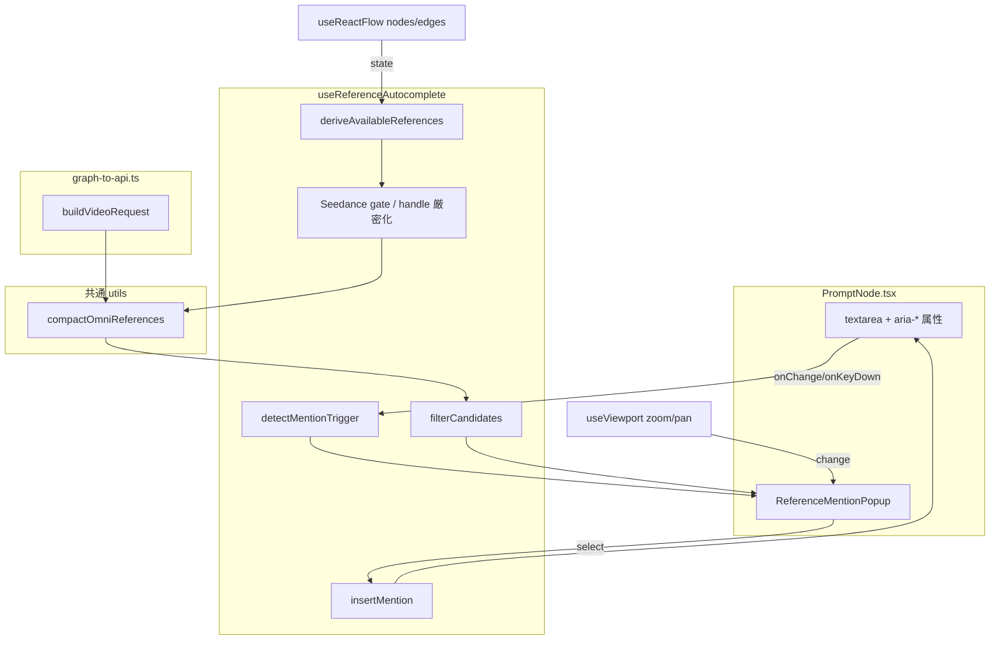
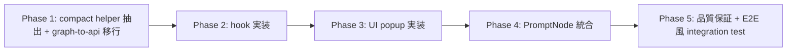

# Reference Mention Autocomplete — Design Doc + 実装計画書 **v2**

**作成日**: 2026-05-19 (v2: 2026-05-19 改訂)
**作成者**: noritaka
**親計画書**: [`docs/plans/2026-05-18_seedance-omni-reference-v3.md`](./2026-05-18_seedance-omni-reference-v3.md)
**v1**: [`docs/plans/2026-05-19_reference-mention-autocomplete.md`](./2026-05-19_reference-mention-autocomplete.md) (残置)
**関連コミット**: `176fd7c` (メイン), `9b71ee6` (テスト), `6824885` (フォローアップ)
**Status**: Proposed (v1 の RED 判定 = Critical 2 + High 6 + Medium 3 を解消した修正版)
**想定総工数**: **4-5 時間** (v1 の 2-3 h からテスト追加・厳密化により増)

---

## 0. 改訂履歴 / v1 → v2 変更マトリクス

| # | 区分 | 指摘ID | v1 の問題 | v2 の対応 | 変更箇所 |
|---|------|--------|-----------|-----------|----------|
| 1 | 🔴 Critical | **C-1** | UI slot index と API ordinal の不一致 (graph-to-api が空 slot を filter → UI slot[1] のみ有 → 候補は `@video2` だが API は `[0]=dance` で `@video1` しか有効にならない) | **`compactOmniReferences()` helper を新規導入**し、graph-to-api と useReferenceAutocomplete の両方で同一 helper を使用。候補番号は compact 後の `index + 1` から導出 | §3.1, §5.0(新), §5.1, §6.1 |
| 2 | 🔴 Critical | **C-2** | `imageOffset = baseImage?.data.imageUrl ? 2 : 1` で base 画像なしでも `@image1` を出していた。StoryVideoCreate.image_url は必須 → 422 になるため `@image1` 案内自体が矛盾 | **base 画像未接続時は画像候補を出さない**。base 画像あり時のみ `@image1 = base`, `@image2..@imageN = compact 後の OmniRef imageSlots`. オフセットは固定 +1 | §5.1, §8(エッジケース #11), §9.1(AT-14 改修) |
| 3 | 🟠 High | **H-1** | `findDownstream(promptNodeId, ..., 'generate')` が handle 名を無視 → 複数 Prompt/Generate ブランチで誤検出 | 探索 helper を厳密化、すべて `HANDLE_IDS` 定数経由でマッチ。曖昧時 (複数候補) は `[]` 返却 + console.warn | §5.1, §5.1a(新) |
| 4 | 🟠 High | **H-2** | ProviderNode の種別チェックなし。Runway/Veo でも `@image1` 候補を出していた | **`providerNode.data.provider === 'seedance'` を必須条件**。Seedance 以外は候補ゼロ | §5.1, §9.1(AT-17/18 追加) |
| 5 | 🟠 High | **H-3** | candidates 0 件時の `↑↓ Enter Tab` 挙動未定義 | 0 件時: `↑↓` no-op / `Enter` `Tab` は preventDefault せず textarea デフォルト動作 (改行・tab) を許可 / `Escape` のみ通常通り close | §5.7, §9.1(AT-20 追加) |
| 6 | 🟠 High (Opus) | **H-Opus-1** | PromptNode 未接続時に候補ゼロで popup が出るだけで理由不明 | 候補ゼロの理由を popup 内に段階的ガイドメッセージで明示 (5 種類のメッセージ) | §5.1c(新), §5.6, §9.1(AT-19) |
| 7 | 🟠 High (Opus) | **H-Opus-2** | graph-to-api の filter ロジックを useReferenceAutocomplete が独自再実装する divergent reimplementation の危険 | **C-1 対応の `compactOmniReferences()` helper を両者で共有** (DRY) | §5.0(新), §6.1 |
| 8 | 🟠 High (Opus) | **H-Opus-3** | `position: absolute` + viewport 座標 → React Flow zoom/pan 中に textarea が動いて popup 位置乖離 | popup 表示中に `useViewport()` で変化検知 → 自動 close (再 `@` 入力で復帰) | §5.8, §9.1(AT-22), §12(R8) |
| 9 | 🟡 Medium | **M-Codex-1** | A11y 属性不足 | textarea に `aria-expanded`/`aria-controls`/`aria-activedescendant`、popup に `role="listbox"` + 各候補 `role="option"`、ガイド表示は `aria-live="polite"` | §5.6, §5.7, §9.1(AT-23) |
| 10 | 🟡 Medium | **M-Codex-2** | テスト不足 (15 件) | **23 件以上**に拡充 (AT-16〜AT-23 追加) | §9.1 |
| 11 | 🟢 Low | **L-Codex-1** | 想定工数 2-3 h は過小 | **4-5 h** に修正 (テスト 8 件追加・helper 新規・厳密化分) | §10.4 |

**v2 で削除しない方針**: v1 で十分な部分 (5.2 トリガ検出 / 5.3 prefix filter / 5.4 挿入ロジック / IME 対応) はそのまま継承。

---

## 1. 概要

PromptNode のテキストエリアで `@` を入力した瞬間、Node Editor 上で利用可能な参照素材 (`@image1` / `@video1` / `@audio1` …) の候補をポップアップ表示し、選択肢からの挿入を可能にする UX 改善機能。

**v2 で強調**: 候補番号は単なる UI slot index ではなく、**実際に PiAPI に送信される配列の ordinal (1-indexed)** と一致する。これを保証する唯一の方法は graph-to-api の compact ロジックと候補抽出ロジックを同一の helper (`compactOmniReferences`) で共有すること。

### 1.1 背景

(v1 と同一。割愛)

### 1.2 デモ用 UX イメージ (v2 改訂)

```
[ PromptNode textarea ]
A girl waving her hand @|
                       └─┐
                         ▼
  ┌──────────────────────────────────────┐
  │ @image1   character.png (base)       │ ← base 画像 (ImageInputNode 由来)
  │ @image2   pose-a.png                 │
  │ @video1   dance.mp4 (5.0s)           │ ← OmniRef videoSlots[1] でも compact 後 index=1
  │ @audio1   bgm.mp3 (3.2s)             │
  └──────────────────────────────────────┘

  ※ Provider=Seedance, base 画像接続済、OmniRef 接続済、video slot 0 が空でも
    compact 後の有効候補 video[1] が @video1 にマップされる
```

### 1.3 候補ゼロ時のガイド表示パターン (v2 新)

```
[Pattern A: PromptNode 未接続]
  ┌────────────────────────────────────────────┐
  │ GenerateNode に接続してください             │
  └────────────────────────────────────────────┘

[Pattern B: Provider が Seedance でない]
  ┌────────────────────────────────────────────┐
  │ Seedance Provider に設定してください        │
  │ (現在: Runway)                              │
  └────────────────────────────────────────────┘

[Pattern C: base 画像なし]
  ┌────────────────────────────────────────────┐
  │ base 画像を ImageInputNode で接続してください │
  └────────────────────────────────────────────┘

[Pattern D: OmniRef 接続なし]
  ┌────────────────────────────────────────────┐
  │ OmniReferenceNode を接続してください          │
  └────────────────────────────────────────────┘

[Pattern E: 全 slot 空]
  ┌────────────────────────────────────────────┐
  │ アップロード済み素材がありません              │
  └────────────────────────────────────────────┘
```

---

## 2. 目標 / 非目標

### 2.1 目標 (v2 改訂)

| ID | 内容 | v2 変更 |
|----|------|---------|
| G1 | `@` 入力時にカーソル位置近傍にポップアップ表示 | - |
| G2 | 候補は Node Editor の **現在の接続状態と slot の埋まり状況** から動的計算 | - |
| G3 | 候補に filename / duration などのメタ情報を併記 | - |
| G4 | prefix match による絞り込み (`@v` で video 系のみ) | - |
| G5 | キーボード操作 (↑↓ Enter Tab Esc) で完結する操作 | - |
| G6 | 候補ゼロ時にも理由をパターン別に教育的に表示 | **拡張: 5 パターンの段階的ガイド** |
| G7 | 既存手書き `@image1` テキストとの完全互換 | - |
| **G8** | **候補番号と API 送信時の ordinal が完全一致** | **新規 (C-1 対応)** |
| **G9** | **Seedance Provider 専用機能として明示** | **新規 (H-2 対応)** |
| **G10** | **WAI-ARIA 準拠で screen reader 対応** | **新規 (M-Codex-1)** |

### 2.2 非目標 (v1 と同一)

(NG1〜NG6 同一。割愛)

---

## 3. 既存コードベース分析

### 3.1 関連ファイル一覧 (v2 改訂)

| パス | 役割 | v2 での扱い |
|------|------|-------------|
| `movie-maker/components/node-editor/nodes/PromptNode.tsx` | 日本語プロンプト textarea を持つノード | **修正**: textarea に autocomplete を統合 + aria 属性追加 |
| `movie-maker/components/node-editor/nodes/OmniReferenceNode.tsx` | image×8 / video×3 / audio×3 の参照 slot ノード | **参照のみ** (候補ソース) |
| `movie-maker/components/node-editor/nodes/ImageInputNode.tsx` | base 画像入力 (= `@image1` の出典) | **参照のみ** |
| `movie-maker/lib/types/node-editor.ts` | `OmniReferenceNodeData` / `OmniReferenceSlot` / `HANDLE_IDS` 定義 | **参照のみ** (HANDLE_IDS を厳密利用) |
| `movie-maker/components/node-editor/utils/graph-to-api.ts` | グラフ → API request 変換 (空 slot を filter) | **v2 で内部 helper を抽出**して `omni-reference-compact.ts` から再利用 |
| `movie-maker/components/node-editor/utils/omni-reference-compact.ts` (新規) | `compactOmniReferences()` helper | **新規追加 (C-1/H-Opus-2 解消)** |

### 3.2 既実装の前提 (v2 改訂)

- **PiAPI Seedance 構文**: `@image{N}` / `@video{N}` / `@audio{N}` (N は 1-indexed)
- **`@image1` の特殊性**: ImageInputNode が GenerateNode に接続されている場合、その base 画像が `image1`。それ以降の番号は OmniReferenceNode の imageSlots を **compact (空 slot 除去) した順** で `image2..imageN`
- **base 画像必須**: `StoryVideoCreate.image_url: str = Field(...)` (必須)。base なしでは生成リクエスト自体が 422。よって **base なし時は画像候補を一切出さない**
- **graph-to-api の compact 仕様 (v2 で明文化)**:
  ```
  videoUrls = omniData.videoSlots
    .filter(slot => !!slot.assetId)
    .map(slot => slot.url)
  // → 結果配列の index が PiAPI の N-1 に対応
  ```
  この振る舞いを **`compactOmniReferences()` helper** に切り出して候補生成側でも完全に同じ計算を行う
- **Provider 切替**: `ProviderNode.data.provider` が `'seedance' | 'runway' | 'veo' | 'kling' | 'hailuo'` 等。**Seedance 以外は @ 構文が無視される** ためそもそも候補を出さない
- **接続パス**: PromptNode → GenerateNode → ProviderNode (Seedance) ← OmniReferenceNode (`OMNI_REFERENCE_INPUT`)、加えて GenerateNode ← ImageInputNode (`IMAGE_INPUT`)
- **`useReactFlow()`**: PromptNode 内で既に使用済 (DialogueNode 検出ロジック)

### 3.3 統合点 (v2 改訂)

| 統合点 | 既存実装 | 影響度 | v2 変更点 |
|--------|----------|--------|-----------|
| PromptNode の textarea | `onChange` → 翻訳デバウンス | 中 | キーイベント・aria 属性追加 |
| `useReactFlow().getNodes()` / `getEdges()` / **`useViewport()`** | 前 2 つは使用済、Viewport は新規利用 | 低 | zoom/pan 検知で popup auto-close |
| `graph-to-api.ts` の OmniRef 配列生成 | 内部 inline filter/map | **中→大** | **helper 抽出 (内部リファクタ)**。挙動は完全同一に保つ |
| バックエンド契約 | - | **影響なし** | 保存テキスト不変 |

---

## 4. 採用案と比較

### 4.1 実装方式 (v1 と同一: 採用 B: hook + component 分離)

### 4.2 位置決め (v1 と同一: 採用 B: textarea 直下) + zoom 検知 close

### 4.3 候補ゼロ時 (v2 改訂)

| 比較項目 | A. ポップアップ出さない | B. 単一メッセージ「素材なし」(v1 採用) | **C. パターン別ガイド (v2 採用)** |
|----------|------------------------|----------------------------------------|------------------------------------|
| 学習効果 | 低 | 中 | **高** |
| 実装コスト | 最低 | 低 | 中 (5 パターン分岐) |
| UX | 無反応で困惑 | 「なぜ無い?」が残る | 解決策が明示される |

**v2 採用**: C。状況に応じて Generate 未接続/Provider 違い/base 画像なし/OmniRef なし/全 slot 空 を区別。

### 4.4 IME 対応 (v1 と同一)

### 4.5 candidates 0 件時のキー挙動 (v2 新)

| 比較項目 | A. 全キー preventDefault | **B. preventDefault せず textarea デフォルト動作許可 (v2 採用)** |
|----------|--------------------------|------------------------------------------------------------------|
| ユーザー操作 | Enter で改行できない (textarea として壊れる) | Enter で改行可、Tab で focus 移動可、自然 |
| 実装 | シンプル | candidates.length === 0 分岐が必要 |

**v2 採用**: B。0 件時は popup はガイド表示のみで、textarea としての挙動を阻害しない。

---

## 5. 設計詳細

### 5.0 共通 helper: `compactOmniReferences()` (v2 新規 / C-1, H-Opus-2)

**目的**: graph-to-api と useReferenceAutocomplete の間で OmniReference の compact ロジックを共有することで、候補番号と API ordinal が常に一致することを型レベル + 実装レベルで保証する。

**新規ファイル**: `movie-maker/components/node-editor/utils/omni-reference-compact.ts`

```ts
import type { OmniReferenceNodeData, OmniReferenceSlot } from '@/lib/types/node-editor';

export interface CompactedSlot {
  assetId: string;
  filename: string;
  durationSeconds?: number;
  // 元の slot index (0..7) は保持しない。compact 後の配列 index = ordinal - 1
}

export interface CompactedOmniReferences {
  videoUrls: CompactedSlot[]; // compact 後 0..2 (ordinal 1..3)
  audioUrls: CompactedSlot[]; // 同上
  imageUrls: CompactedSlot[]; // OmniRef 由来のみ。base image はここに含めない
}

/**
 * OmniReferenceNodeData の各 slot 配列から空 slot を除去し、
 * 残った要素を 0-indexed の連続配列として返す。
 *
 * この関数の戻り値の **index + 1** が、PiAPI Seedance に送信される
 * `@video{N}` / `@audio{N}` の N と完全に一致する。
 *
 * 画像については base 画像 (ImageInputNode 由来) を **呼び出し側で先頭に prepend** する。
 * 本 helper は OmniRef 内 slot だけを扱う。
 */
export function compactOmniReferences(
  omniData: OmniReferenceNodeData
): CompactedOmniReferences {
  const compactSlots = (slots: OmniReferenceSlot[]): CompactedSlot[] =>
    slots
      .filter((s): s is OmniReferenceSlot & { assetId: string } => !!s.assetId)
      .map((s) => ({
        assetId: s.assetId,
        filename: s.filename ?? 'untitled',
        durationSeconds: s.durationSeconds,
      }));

  return {
    videoUrls: compactSlots(omniData.videoSlots),
    audioUrls: compactSlots(omniData.audioSlots),
    imageUrls: compactSlots(omniData.imageSlots),
  };
}
```

**移行方針**:
1. まず本 helper を **新規追加 + 単体テスト**。
2. `graph-to-api.ts` の inline filter/map ロジックを読み込み、**本 helper 呼び出しに置き換え** (動作完全同一 / regression テスト pass を確認)。
3. `useReferenceAutocomplete` も同じ helper を使う。
4. これにより graph-to-api ↔ autocomplete の divergent reimplementation を構造的に排除。

### 5.1 候補抽出ロジック (v2 改訂版擬似コード)

```ts
// useReferenceAutocomplete.ts
import { HANDLE_IDS } from '@/lib/types/node-editor';
import { compactOmniReferences } from '../utils/omni-reference-compact';

export type CandidatesResult =
  | { candidates: ReferenceCandidate[]; emptyReason: null }
  | { candidates: []; emptyReason: EmptyReason };

export type EmptyReason =
  | 'no-generate-node'    // PromptNode → GenerateNode 未接続
  | 'not-seedance'        // Provider が Seedance でない
  | 'no-base-image'       // base 画像 (ImageInputNode) なし
  | 'no-omni-ref'         // OmniReferenceNode 未接続
  | 'all-slots-empty';    // OmniRef 接続済だが全 slot 空 (かつ base 画像のみ)

function deriveAvailableReferences(
  promptNodeId: string,
  nodes: Node[],
  edges: Edge[]
): CandidatesResult {
  // 1. PromptNode → GenerateNode (handle 厳密化: H-1 対応)
  const generateNode = findGenerateNodeStrict(promptNodeId, nodes, edges);
  if (!generateNode) return { candidates: [], emptyReason: 'no-generate-node' };

  // 2. GenerateNode ← ProviderNode (CONFIG_INPUT)
  const providerNode = findProviderNodeStrict(generateNode.id, nodes, edges);

  // 3. Seedance 限定 (H-2 対応)
  if (providerNode?.data.provider !== 'seedance') {
    return { candidates: [], emptyReason: 'not-seedance' };
  }

  // 4. base 画像 = GenerateNode ← ImageInputNode (IMAGE_INPUT)
  const baseImage = findBaseImageNodeStrict(generateNode.id, nodes, edges);

  // C-2 対応: base 画像なしは画像系候補一切なし。video/audio だけは出す余地あり
  //         (Seedance は image_url が必須なので生成自体不能だが、
  //          ガイドメッセージとしては「no-base-image」を最優先で出す)
  if (!baseImage?.data.imageUrl) {
    return { candidates: [], emptyReason: 'no-base-image' };
  }

  // 5. ProviderNode ← OmniReferenceNode (OMNI_REFERENCE_INPUT)
  const omniRef = findOmniReferenceNodeStrict(providerNode.id, nodes, edges);
  if (!omniRef) {
    // base 画像のみで OmniRef 未接続: emptyReason='no-omni-ref' でガイド表示
    // (v2 訂正: 単独 @image1 だけだとオートコンプリートの価値が薄く、
    // OmniReferenceNode の接続を促すガイドの方が UX 上有益)
    return { candidates: [], emptyReason: 'no-omni-ref' };
  }

  // 6. 共通 helper で compact (C-1, H-Opus-2 対応)
  const compact = compactOmniReferences(omniRef.data);

  const candidates: ReferenceCandidate[] = [];

  // 7. @image1 = base 画像 (offset 固定 +1)
  candidates.push({
    id: '@image1',
    kind: 'image',
    index: 1,
    filename: extractFilename(baseImage.data.imageUrl),
  });

  // 8. @image2..@imageN = compact 後の OmniRef imageSlots
  compact.imageUrls.forEach((slot, i) => {
    candidates.push({
      id: `@image${i + 2}`,           // base 画像分の +1 がここに乗る
      kind: 'image',
      index: i + 2,
      filename: slot.filename,
    });
  });

  // 9. @video1..@videoN = compact 後の videoSlots (offset 0 = ordinal 1)
  compact.videoUrls.forEach((slot, i) => {
    candidates.push({
      id: `@video${i + 1}`,
      kind: 'video',
      index: i + 1,
      filename: slot.filename,
      durationSeconds: slot.durationSeconds,
    });
  });

  // 10. @audio1..@audioN = compact 後の audioSlots
  compact.audioUrls.forEach((slot, i) => {
    candidates.push({
      id: `@audio${i + 1}`,
      kind: 'audio',
      index: i + 1,
      filename: slot.filename,
      durationSeconds: slot.durationSeconds,
    });
  });

  // 11. all-slots-empty 判定 (v2 訂正)
  //     OmniRef 接続済だが全 slot 空のとき、base 画像由来 @image1 は出ているので
  //     candidates.length === 1 (= @image1 のみ)。これを「all-slots-empty」ガイド付き表示にする。
  //     ※ candidates.length === 0 は base 画像なしを上の no-base-image で return 済なので到達しない。
  const onlyBaseImage =
    candidates.length === 1 &&
    compact.imageUrls.length === 0 &&
    compact.videoUrls.length === 0 &&
    compact.audioUrls.length === 0;
  if (onlyBaseImage) {
    // @image1 (base) は候補に残しつつ、ガイドメッセージで OmniRef へのアップロードを促す
    return { candidates, emptyReason: 'all-slots-empty' };
  }

  return { candidates, emptyReason: null };
}
```

### 5.1a 接続パス探索 helper (v2 新 / H-1 対応)

```ts
// すべて HANDLE_IDS 経由でマッチ。リテラル文字列は使わない。
// 複数候補がある曖昧ケースは [] + console.warn。

function findGenerateNodeStrict(
  promptNodeId: string,
  nodes: Node[],
  edges: Edge[]
): Node | null {
  const matched = edges.filter(
    (e) =>
      e.source === promptNodeId &&
      e.sourceHandle === HANDLE_IDS.STORY_TEXT_OUTPUT &&
      e.targetHandle === HANDLE_IDS.STORY_TEXT_INPUT
  );
  if (matched.length === 0) return null;
  if (matched.length > 1) {
    console.warn('[useReferenceAutocomplete] multiple GenerateNode candidates, skip');
    return null;
  }
  return nodes.find((n) => n.id === matched[0].target && n.type === 'generate') ?? null;
}

function findProviderNodeStrict(generateNodeId: string, nodes: Node[], edges: Edge[]): Node | null {
  const matched = edges.filter(
    (e) =>
      e.target === generateNodeId &&
      e.targetHandle === HANDLE_IDS.CONFIG_INPUT &&
      e.sourceHandle === HANDLE_IDS.PROVIDER_CONFIG_OUTPUT // v2 訂正: source 側 handle も検証
  );
  if (matched.length === 0) return null;
  if (matched.length > 1) {
    console.warn('[useReferenceAutocomplete] multiple Provider candidates for generate, skip');
    return null;
  }
  return nodes.find((n) => n.id === matched[0].source && n.type === 'provider') ?? null;
}

function findBaseImageNodeStrict(generateNodeId: string, nodes: Node[], edges: Edge[]): ImageInputNode | null {
  const matched = edges.filter(
    (e) =>
      e.target === generateNodeId &&
      e.targetHandle === HANDLE_IDS.IMAGE_INPUT &&
      e.sourceHandle === HANDLE_IDS.IMAGE_OUTPUT // v2 訂正
  );
  if (matched.length === 0) return null;
  if (matched.length > 1) {
    console.warn('[useReferenceAutocomplete] multiple ImageInput candidates, skip');
    return null;
  }
  return (nodes.find((n) => n.id === matched[0].source && n.type === 'imageInput') as ImageInputNode | undefined) ?? null;
}

function findOmniReferenceNodeStrict(providerNodeId: string, nodes: Node[], edges: Edge[]): OmniReferenceNode | null {
  const matched = edges.filter(
    (e) =>
      e.target === providerNodeId &&
      e.targetHandle === HANDLE_IDS.OMNI_REFERENCE_INPUT &&
      e.sourceHandle === HANDLE_IDS.OMNI_REFERENCE_OUTPUT // v2 訂正
  );
  if (matched.length === 0) return null;
  if (matched.length > 1) {
    console.warn('[useReferenceAutocomplete] multiple OmniReference candidates, skip');
    return null;
  }
  return (nodes.find((n) => n.id === matched[0].source && n.type === 'omniReference') as OmniReferenceNode | undefined) ?? null;
}

// 注: HANDLE_IDS.PROVIDER_CONFIG_OUTPUT / IMAGE_OUTPUT は実装時に lib/types/node-editor.ts で
//     既存定義を確認すること。命名が異なる場合は実装側の定数名に合わせる。
```

### 5.1b Provider gate (v2 新 / H-2 対応)

候補抽出フローの最上位で `providerNode.data.provider === 'seedance'` を確認。これ以外は **emptyReason: 'not-seedance'** で即 return。テストで Runway/Veo/Kling/Hailuo 各 provider で候補ゼロを検証。

### 5.1c 空状態理由のガイドメッセージマッピング (v2 新 / H-Opus-1)

```ts
const EMPTY_REASON_MESSAGES: Record<EmptyReason, string> = {
  'no-generate-node': 'GenerateNode に接続してください',
  'not-seedance':     'Seedance Provider に設定してください',
  'no-base-image':    'base 画像を ImageInputNode で接続してください',
  'no-omni-ref':      'OmniReferenceNode を接続してください',
  'all-slots-empty':  'アップロード済み素材がありません',
};
```

popup は `candidates.length > 0` のときは候補リスト、`emptyReason !== null` のときはガイドメッセージを `role="status"` + `aria-live="polite"` で描画。

### 5.2 トリガ検出 (v1 と同一)

(コードはそのまま。割愛)

### 5.3 候補フィルタリング (v1 と同一)

### 5.4 挿入ロジック (v1 と同一)

### 5.5 UI 構造 (v2 改訂)



**ポイント**: `compactOmniReferences` は autocomplete と graph-to-api の共有点。これにより候補番号 == API ordinal が構造的に保証される。

### 5.6 コンポーネント Props 設計 (v2 改訂)

```ts
// useReferenceAutocomplete.ts
export interface UseReferenceAutocompleteOptions {
  promptNodeId: string;
  textareaRef: React.RefObject<HTMLTextAreaElement>;
  value: string;
  onChange: (next: string) => void;
}

export interface UseReferenceAutocompleteResult {
  isOpen: boolean;
  query: string;
  candidates: ReferenceCandidate[];
  emptyReason: EmptyReason | null;   // ← v2 追加
  highlightedIndex: number;
  listboxId: string;                  // ← v2 追加 (aria-controls 用)
  handlers: {
    onTextareaChange: (e: React.ChangeEvent<HTMLTextAreaElement>) => void;
    onTextareaKeyDown: (e: React.KeyboardEvent<HTMLTextAreaElement>) => void;
    onCompositionStart: () => void;
    onCompositionEnd: () => void;
    onTextareaBlur: () => void;
    onPopupSelect: (candidate: ReferenceCandidate) => void;
    onPopupClose: () => void;
  };
  // textarea に bind するための aria 属性 (v2 追加 / M-Codex-1)
  textareaAriaProps: {
    'aria-expanded': boolean;
    'aria-controls': string;
    'aria-activedescendant': string | undefined;
    'aria-autocomplete': 'list';
    role: 'combobox';
  };
}
```

```ts
// ReferenceMentionPopup.tsx
export interface ReferenceMentionPopupProps {
  candidates: ReferenceCandidate[];
  emptyReason: EmptyReason | null;       // v2 追加
  highlightedIndex: number;
  listboxId: string;                      // v2 追加
  onSelect: (candidate: ReferenceCandidate) => void;
  onClose: () => void;
  anchorRef: React.RefObject<HTMLElement>;
}
```

### 5.7 キーボード/マウス操作仕様 (v2 改訂 / H-3, M-Codex-1)

| 操作 | candidates >= 1 のとき | **candidates === 0 のとき (v2 新)** |
|------|-----------------------|--------------------------------------|
| `@` 入力 | popup open, highlightedIndex=0 | popup open (ガイド表示のみ) |
| `↓` | +1 (modulo len), preventDefault | **no-op (preventDefault しない)** |
| `↑` | -1 (modulo len), preventDefault | **no-op (preventDefault しない)** |
| `Enter` | 候補挿入 + close (preventDefault) | **preventDefault しない → textarea で改行** |
| `Tab` | 候補挿入 + close (preventDefault) | **preventDefault しない → textarea で tab デフォルト** |
| `Escape` | close (テキスト変更なし) | close (テキスト変更なし) |
| 候補 click | 候補挿入 + close | (該当なし) |
| 候補 hover | highlightedIndex 更新 | (該当なし) |
| textarea blur | close (mousedown で先取り) | close |
| outside click | close | close |
| IME composition | 期間中キーイベント無視 | 同左 |

### 5.8 ポップアップ位置決め (v2 改訂 / H-Opus-3)

```ts
// 基本配置 (v1 と同一)
const rect = textareaRef.current.getBoundingClientRect();
const style = {
  position: 'absolute' as const,
  top: rect.bottom + window.scrollY + 4,
  left: rect.left + window.scrollX,
  minWidth: rect.width,
  zIndex: 1000,
};

// v2 追加: React Flow zoom/pan 検知で auto-close (NEW-H-1 訂正)
// exhaustive-deps と衝突しないよう、前回 viewport を ref で保持して差分検知する。
// 過敏な pan による誤 close を避けるため、zoom 変化のみを trigger、x/y は閾値 (8px) 越えで trigger。
const viewport = useViewport(); // { x, y, zoom }
const prevViewportRef = useRef<{ x: number; y: number; zoom: number } | null>(null);

useEffect(() => {
  if (!isOpen) {
    prevViewportRef.current = viewport;
    return;
  }
  const prev = prevViewportRef.current;
  prevViewportRef.current = viewport;
  if (!prev) return;

  const zoomChanged = prev.zoom !== viewport.zoom;
  const panMoved =
    Math.abs(prev.x - viewport.x) > 8 || Math.abs(prev.y - viewport.y) > 8;

  if (zoomChanged || panMoved) {
    onClose();
  }
}, [viewport.x, viewport.y, viewport.zoom, isOpen, onClose]);
```

将来改善 (NG1 のまま): caret 直下精密配置。

---

## 6. ファイル構成

### 6.1 新規追加 (v2 改訂)

| パス | 内容 | 行数目安 |
|------|------|---------|
| **`movie-maker/components/node-editor/utils/omni-reference-compact.ts`** (新) | `compactOmniReferences()` helper | ~50 |
| **`movie-maker/components/node-editor/utils/omni-reference-compact.test.ts`** (新) | helper 単体テスト | ~120 |
| `movie-maker/components/node-editor/hooks/useReferenceAutocomplete.ts` | hook 本体 + Seedance gate + 厳密 handle 探索 + emptyReason | ~250 |
| `movie-maker/components/node-editor/hooks/useReferenceAutocomplete.test.ts` | hook 単体テスト | ~400 |
| `movie-maker/components/node-editor/components/ReferenceMentionPopup.tsx` | popup UI (候補リスト or ガイドメッセージ) + ARIA 属性 | ~120 |
| `movie-maker/components/node-editor/components/ReferenceMentionPopup.test.tsx` | popup 単体テスト | ~180 |

### 6.2 修正 (v2 改訂)

| パス | 修正内容 |
|------|---------|
| `movie-maker/components/node-editor/nodes/PromptNode.tsx` | `useReferenceAutocomplete` 統合, textarea に handlers + aria 属性 bind, popup 描画 |
| `movie-maker/components/node-editor/nodes/__tests__/PromptNode.test.tsx` | autocomplete 統合テスト追加 |
| **`movie-maker/components/node-editor/utils/graph-to-api.ts`** (v2 追加) | OmniRef compact 部分を `compactOmniReferences()` 呼び出しに置換 (挙動完全同一) |
| **`movie-maker/components/node-editor/utils/graph-to-api.test.ts`** (該当箇所) | helper 経由でも regression なしを確認 |

### 6.3 影響なし (v1 と同一)

`movie-maker-api/**` / `movie-maker/lib/types/node-editor.ts` / バックエンド契約 全て不変。

---

## 7. データ型定義 (v2 改訂)

```ts
// useReferenceAutocomplete.ts 内 export
export type ReferenceKind = 'image' | 'video' | 'audio';

export interface ReferenceCandidate {
  id: string;             // "@image1", "@video1", "@audio1" - **compact 後の ordinal**
  kind: ReferenceKind;
  index: number;          // 1-indexed (= API ordinal)
  filename: string;
  durationSeconds?: number;
}

export type EmptyReason =
  | 'no-generate-node'
  | 'not-seedance'
  | 'no-base-image'
  | 'no-omni-ref'
  | 'all-slots-empty';

interface MentionState {
  startIndex: number;
  query: string;
}
```

---

## 8. エッジケース対応表 (v2 改訂)

| # | ケース | 対応 |
|---|--------|------|
| 1 | 複数 `@` (`@image1 と @video1`) | 直近 `@` のみ対象 |
| 2 | `@` 直後にスペース | trigger 検出が null → close |
| 3 | 完成済 `@image1` の途中で再編集 | カーソルが `@` 直後の領域内に戻ると再 open |
| 4 | `@@image1` の誤入力 | 最後の `@` 以降を対象 |
| 5 | OmniRef slot が後から埋まる | 再レンダで動的反映 |
| 6 | OmniRef 接続解除 | 次の onChange で消える (M-Codex-3) |
| 7 | 候補 0 件 (パターン別) | パターン別ガイド表示 (§5.1c) |
| 8 | ポップアップ表示中 outside click | document mousedown で close |
| 9 | textarea blur | onBlur で close (popup click は mousedown で先取り) |
| 10 | IME 入力中の `@` | isComposing チェック |
| **11** | **base image なし + OmniRef 接続済** | **画像候補一切出さない、emptyReason: 'no-base-image' (C-2)** |
| 12 | PromptNode が GenerateNode に未接続 | emptyReason: 'no-generate-node' |
| **13** | **Provider=Runway/Veo/Kling/Hailuo** | **emptyReason: 'not-seedance' (H-2)** |
| **14** | **疎な OmniRef slot (slot[0]=空, slot[1]=有)** | **compact 後 ordinal=1 → `@video1` (C-1)** |
| **15** | **複数 GenerateNode が混在** | **handle 厳密マッチ → 複数候補時は [] + warn (H-1)** |
| **16** | **React Flow zoom/pan 発生** | **`useViewport` 変化で auto-close (H-Opus-3)** |
| **17** | **候補 0 件で Enter 押下** | **preventDefault せず textarea で改行 (H-3)** |

---

## 9. テスト戦略

### 9.1 テストケース一覧 (v2 改訂: 15 → **23 件**)

| ID | テスト内容 | 対象ファイル | 関連修正 |
|----|----------|--------------|----------|
| AT-1 | `@` 押下でポップアップが表示される | PromptNode.test.tsx | - |
| AT-2 | OmniRef 接続済 + slot 埋まり → 候補リスト正確 (count / id / order) | useReferenceAutocomplete.test.ts | - |
| AT-3 | OmniRef 未接続 → emptyReason='no-omni-ref' (base 画像のみある場合は @image1 のみ) | ReferenceMentionPopup.test.tsx | H-Opus-1 |
| AT-4 | `@v` 入力で video 系のみ絞り込み | useReferenceAutocomplete.test.ts | - |
| AT-5 | `↓` で highlightedIndex 移動 → `Enter` で挿入 | PromptNode.test.tsx | - |
| AT-6 | 候補 click で挿入 + close | ReferenceMentionPopup.test.tsx | - |
| AT-7 | `Escape` で close (テキスト不変) | PromptNode.test.tsx | - |
| AT-8 | document 外側 click で close | PromptNode.test.tsx | - |
| AT-9 | 手書きの `@image1` を含むテキストでも翻訳 API が呼ばれる (既存挙動維持) | PromptNode.test.tsx | - |
| AT-10 | 候補メタ情報 (filename, duration) の表示 | ReferenceMentionPopup.test.tsx | - |
| AT-11 | IME composition 中の `@` は popup を開かない | PromptNode.test.tsx | - |
| AT-12 | textarea blur で close | PromptNode.test.tsx | - |
| AT-13 | 複数 `@` 環境で最新 `@` のみ反応 | useReferenceAutocomplete.test.ts | - |
| AT-14 | **base image あり**で `@image1=base`, `@image2..=OmniRef compact 後` | useReferenceAutocomplete.test.ts | C-2 |
| AT-15 | `Tab` で候補挿入 | PromptNode.test.tsx | - |
| **AT-16** | **疎な video slot (slot[0]=空, slot[1]=dance.mp4) で候補が `@video1` (compact 後 ordinal)** | useReferenceAutocomplete.test.ts | **C-1** |
| **AT-17** | **Provider=Runway → emptyReason='not-seedance', 候補ゼロ** | useReferenceAutocomplete.test.ts | **H-2** |
| **AT-18** | **Provider=Veo/Kling/Hailuo → 同上** | useReferenceAutocomplete.test.ts | **H-2** |
| **AT-19** | **PromptNode 未接続 → emptyReason='no-generate-node' + ガイドメッセージ表示** | ReferenceMentionPopup.test.tsx | **H-Opus-1** |
| **AT-20** | **候補 0 件時に Enter で改行が入る (popup は閉じる)** | PromptNode.test.tsx | **H-3** |
| **AT-21** | **同じ node/edge state を入力に、`graphToStoryVideoCreate()` の出力 `image_reference_asset_ids` / `video_reference_asset_ids` / `audio_reference_asset_ids` 配列の `index+1` と、`useReferenceAutocomplete` が返す候補の `index` が完全一致**（vitest 内で 1 つの state を 2 関数に流して比較） | integration test (vitest) | **C-1, H-Opus-2** |
| **AT-22** | **React Flow zoom/pan 発生で popup auto-close** | PromptNode.test.tsx | **H-Opus-3** |
| **AT-23** | **A11y 属性 (`aria-expanded`/`aria-controls`/`aria-activedescendant`/`role=combobox`/`role=listbox`/`role=option`) が正しく付与** | PromptNode.test.tsx + ReferenceMentionPopup.test.tsx | **M-Codex-1** |
| **AT-24** | **`compactOmniReferences()` 単体: 空 slot 除去・順序保存・空配列入力** | omni-reference-compact.test.ts | **C-1** |
| **AT-25** | **複数 GenerateNode が PromptNode に紐付いた曖昧ケースで候補ゼロ + warn** | useReferenceAutocomplete.test.ts | **H-1** |

合計 **25 件** (v1: 15 件、v2 追加: +10 件、要求最低 23 件以上 達成)。

### 9.2 受け入れ条件 (v2 改訂)

| AC | 内容 | 検証方法 |
|----|------|---------|
| AC1 | `@` 押下で popup が viewport 内に表示される | manual + AT-1 |
| AC2 | 候補リストが Node Editor の実状態と一致する | AT-2, AT-13, AT-14, **AT-16** |
| AC3 | prefix match で絞り込みが動く | AT-4 |
| AC4 | キーボードのみで候補選択 → 挿入できる | AT-5, AT-15 |
| AC5 | 既存の手書きユーザーに影響を与えない | AT-9 |
| AC6 | IME 中に誤発火しない | AT-11 |
| AC7 | コードは ESLint / TypeScript エラーゼロ | `npm run lint` & `tsc --noEmit` |
| AC8 | テストカバレッジ: 新規ファイル 80% 以上 | vitest --coverage |
| AC9 | 既存 PromptNode テストが全て pass | `npm run test PromptNode` |
| **AC10** | **候補番号と API 送信 ordinal が一致** | **AT-21 + graph-to-api 既存テスト regression** |
| **AC11** | **Seedance 以外で候補ゼロ + 適切なガイド** | **AT-17, AT-18** |
| **AC12** | **base 画像未接続時に画像候補ゼロ** | **AT-14 派生 (base なし版)** |
| **AC13** | **React Flow zoom/pan で popup が破綻しない (auto-close)** | **AT-22** |
| **AC14** | **WAI-ARIA combobox pattern 準拠** | **AT-23** |
| **AC15** | **候補 0 件時の Enter/Tab で textarea デフォルト挙動を阻害しない** | **AT-20** |

---

## 10. Phase 分解と想定工数

### 10.1 Phase 構造図 (v2 改訂)



### 10.2 タスク依存図 (v2 改訂)

```mermaid
flowchart TB
  T0[T0: compactOmniReferences helper + 単体テスト]
  T0b[T0b: graph-to-api を helper 経由に置換 + regression]
  T1[T1: useReferenceAutocomplete skeleton + 単体テスト]
  T2[T2: deriveAvailableReferences 厳密 handle 探索 + Seedance gate + emptyReason]
  T3[T3: ReferenceMentionPopup component + 5 パターンガイド + ARIA]
  T4[T4: popup スタイリング整合]
  T5[T5: PromptNode 統合 + zoom 検知 auto-close]
  T6[T6: キーボード操作仕様 (候補 0 件分岐含む)]
  T7[T7: 既存テスト確認 + AT-1〜AT-25 追加]
  T7b[T7b: AT-21 integration test (autocomplete↔graph-to-api ordinal 一致)]
  T8[T8: quality-fixer + code-reviewer]

  T0 --> T0b
  T0 --> T1
  T0b --> T7b
  T1 --> T2
  T2 --> T3
  T3 --> T4
  T2 --> T5
  T4 --> T5
  T5 --> T6
  T6 --> T7
  T7 --> T7b
  T7b --> T8
```

### 10.3 Phase 詳細

#### Phase 1: 共通 helper 抽出 (~40 分) **v2 新**

- [ ] **T0**: `compactOmniReferences()` helper + 単体テスト
  - 空配列/全空 slot/疎な slot/完全埋まり の 4 ケース
  - AT-24 を pass
  - 完了条件: helper 単体テスト pass / lint OK
- [ ] **T0b**: `graph-to-api.ts` の OmniRef compact 部分を helper 呼び出しに置換
  - **既存テストが完全 pass** することを確認 (挙動変化なし)
  - 完了条件: `npm run test graph-to-api` 全 pass

#### Phase 2: Hook 実装 (~70 分) v2 拡張

- [ ] **T1**: `useReferenceAutocomplete` skeleton + 単体テスト (Red→Green)
  - `detectMentionTrigger` / `filterCandidates` / `insertMention` の pure 関数化
  - 検証: AT-4, AT-13 を pass
- [ ] **T2**: `deriveAvailableReferences` 実装 (本機能の心臓部)
  - 厳密 handle 探索 helper 群 (H-1)
  - Seedance gate (H-2)
  - base 画像必須化 + offset 固定 (C-2)
  - `compactOmniReferences` 経由で候補番号生成 (C-1, H-Opus-2)
  - emptyReason 計算 (H-Opus-1)
  - 検証: AT-2, AT-14, AT-16, AT-17, AT-18, AT-25 を pass
  - 完了条件: hook 全テスト pass

#### Phase 3: UI Popup 実装 (~50 分) v2 拡張

- [ ] **T3**: `ReferenceMentionPopup` component
  - props: candidates, emptyReason, highlightedIndex, listboxId, onSelect, onClose, anchorRef
  - `createPortal` で `document.body` へマウント
  - emptyReason に応じた 5 パターンガイド表示 (H-Opus-1)
  - WAI-ARIA combobox/listbox/option (M-Codex-1)
  - `aria-live="polite"` でガイドメッセージ読み上げ
  - 完了条件: AT-3, AT-6, AT-10, AT-19, AT-23 (popup 側) pass
- [ ] **T4**: スタイリング (Tailwind v4)
  - 既存 BaseNode / NodePalette の dark theme と整合
  - hover / highlight / disabled (ガイド表示時) 状態の視覚区別
  - 注意: `globals.css` に `@source` を追加しない (CLAUDE.md ルール)
  - 完了条件: 視覚確認 + 既存 UI 崩壊なし

#### Phase 4: PromptNode 統合 (~60 分) v2 拡張

- [ ] **T5**: PromptNode 修正
  - `useReferenceAutocomplete(id, textareaRef, localPrompt, setLocalPrompt)` 呼び出し
  - textarea に handlers + `textareaAriaProps` を bind (M-Codex-1)
  - popup を条件レンダ (`isOpen`)
  - `useViewport()` 監視で auto-close (H-Opus-3)
  - 既存翻訳デバウンス / DialogueNode 検出は **無改変**
  - 完了条件: AT-1, AT-9, AT-11, AT-12, AT-22, AT-23 (textarea 側) pass
- [ ] **T6**: キーボード操作の総合テスト
  - candidates >= 1: `↑↓ Enter Tab Esc` 全動作
  - candidates === 0: `↑↓` no-op, `Enter`/`Tab` preventDefault せず, `Esc` close (H-3)
  - 完了条件: AT-5, AT-7, AT-15, AT-20 pass
- [ ] **T7**: 既存 `PromptNode.test.tsx` の regression 確認 + 新規 AT-1〜AT-25 追加 (popup/hook 担当分は除く)
  - 完了条件: `npm run test PromptNode` 全 pass

#### Phase 5: 品質保証 (~50 分) v2 拡張

- [ ] **T7b**: integration test (autocomplete ↔ graph-to-api 一致性)
  - 同じ OmniRef state を helper に通した結果と autocomplete の候補リストが ordinal で一致
  - AT-21 pass
- [ ] **T8**: quality-fixer + code-reviewer 実行
  - `npm run lint` エラーゼロ
  - `tsc --noEmit` エラーゼロ
  - `npm run test` 全 pass
  - カバレッジ 80% 以上 (新規ファイル)
  - PR description で v1 RED 指摘 11 件の解消箇所を明示
  - 完了条件: 全 AC1〜AC15 達成

### 10.4 想定総工数 (v2 改訂 / L-Codex-1)

| Phase | v1 工数 | **v2 工数** | 増分理由 |
|-------|--------|-------------|----------|
| Phase 1 (helper 抽出) | - | **40 分** | 新規追加 |
| Phase 2 (Hook) | 50 分 | **70 分** | Seedance gate / 厳密 handle / emptyReason 追加 |
| Phase 3 (Popup) | 40 分 | **50 分** | 5 パターンガイド + ARIA |
| Phase 4 (統合) | 50 分 | **60 分** | zoom 検知 + ARIA bind + 0 件キー分岐 |
| Phase 5 (品質保証) | 20 分 | **50 分** | integration test (AT-21) 追加 |
| **合計** | 2 時間 40 分 | **4 時間 30 分** (バッファ込み **5 時間**) |

---

## 11. 後方互換性

| 観点 | 互換性 |
|------|--------|
| 既存の手書き `@image1` を含むプロンプト | **完全互換** (autocomplete は入力補助のみ) |
| 既存の翻訳デバウンス | **無改変** |
| 既存の DialogueNode 検出ロジック | **無改変** |
| **graph-to-api の振る舞い** | **無改変** (内部リファクタのみ。helper 抽出は AST 変化のみで出力同一、既存テストで担保) |
| バックエンド側 PiAPI 構文サポート | **無改変** |
| OmniReferenceNode / ImageInputNode の挙動 | **無改変** (read only) |

---

## 12. リスクと対策 (v2 改訂)

| # | リスク | 対策 |
|---|--------|------|
| R1 | popup が React Flow zoom/pan の影響を受けて位置ズレ | **`useViewport` 変化で auto-close (H-Opus-3)** |
| R2 | `↑↓` キーが textarea のカーソル移動と競合 | candidates >= 1 のときのみ preventDefault |
| R3 | IME 確定の `Enter` が popup 選択を誤発火 | `isComposing` チェック |
| R4 | OmniReferenceNode の slot.filename が undefined のケース | `?? 'untitled'` でフォールバック |
| R5 | textarea blur 直後の popup click が無視される | `onMouseDown` (capture) で先取り |
| R6 | base image offset 計算ミスで `@image2` が `@image1` を上書き | AT-14 で明示テスト、offset 固定 +1 (C-2) |
| R7 | popup の z-index が他の UI に埋もれる | `zIndex: 1000` (React Flow node は ~100 程度) |
| **R8** | **graph-to-api の compact ロジックが将来変更されて candidate と乖離** | **`compactOmniReferences` 共有 + AT-21 integration test で構造的に防止 (C-1, H-Opus-2)** |
| **R9** | **popup 表示中に OmniRef 接続が切れる** | **次の onChange/onKeyDown で再計算 → 即座に消える (M-Codex-3 ポリシー: 入力イベント時再計算)** |
| **R10** | **複数 GenerateNode が PromptNode に紐付くグラフで誤候補** | **厳密 handle match で複数候補時 [] + warn (H-1, AT-25)** |
| **R11** | **Seedance 以外 provider で `@image1` を誘発し PiAPI に意味のないテキスト混入** | **Seedance gate で候補ゼロ (H-2, AT-17/18)** |
| **R12** | **screen reader で popup が認識されない** | **WAI-ARIA combobox pattern (M-Codex-1, AT-23)** |

### 12.1 候補再計算タイミング (v2 新 / M-Codex-3)

**採用方針**: 入力イベント (`onChange` / `onKeyDown`) 時のみ候補を再計算。popup 表示中の slot 変更は次のキー入力まで反映を遅延 (許容)。

**理由**:
- nodes/edges の参照を毎レンダ取り直すと React Flow との結合度が高くなりすぎる
- ユーザーは `@` を打ち続けるか Esc/click outside で閉じるため、遅延は実害なし
- Edge case (R9): popup 表示中に OmniRef 切断 → 次キー入力で消える

---

## 13. 完了報告チェックリスト (v2 改訂)

実装完了時に確認:

- [ ] `npm run lint` エラーゼロ
- [ ] `npm run test` 全 pass (新規 AT-1〜AT-25 含む)
- [ ] `tsc --noEmit` エラーゼロ
- [ ] **`omni-reference-compact.ts` + test 新規追加 (v2)**
- [ ] **`graph-to-api.ts` を helper 経由に移行、既存テスト regression なし (v2)**
- [ ] `useReferenceAutocomplete.ts` + test 新規追加 (厳密 handle / Seedance gate / emptyReason 含む)
- [ ] `ReferenceMentionPopup.tsx` + test 新規追加 (5 パターンガイド / ARIA 含む)
- [ ] `PromptNode.test.tsx` に autocomplete テスト 10 件以上追加 (zoom / 0 件キー / ARIA 含む)
- [ ] integration test (**AT-21**: autocomplete↔graph-to-api ordinal 一致) pass
- [ ] 親計画書 (`2026-05-18_seedance-omni-reference-v3.md`) の関連セクションを update
- [ ] PR description で **v1 RED 指摘 11 件** (C-1, C-2, H-1, H-2, H-3, H-Opus-1, H-Opus-2, H-Opus-3, M-Codex-1, M-Codex-2, M-Codex-3, L-Codex-1) の解消箇所を明示
- [ ] AC1〜AC15 の対応箇所を明示

---

## 14. 参考資料

- v1 計画書: `docs/plans/2026-05-19_reference-mention-autocomplete.md`
- 親計画書: `docs/plans/2026-05-18_seedance-omni-reference-v3.md`
- PiAPI Seedance @構文仕様: 親計画書 §6.10
- 既存実装コミット: `176fd7c`, `9b71ee6`, `6824885`
- 類似 UX 参考: Slack mention, Discord, Notion slash command
- WAI-ARIA Combobox Pattern: https://www.w3.org/WAI/ARIA/apg/patterns/combobox/
- React Flow `useViewport`: https://reactflow.dev/api-reference/hooks/use-viewport
