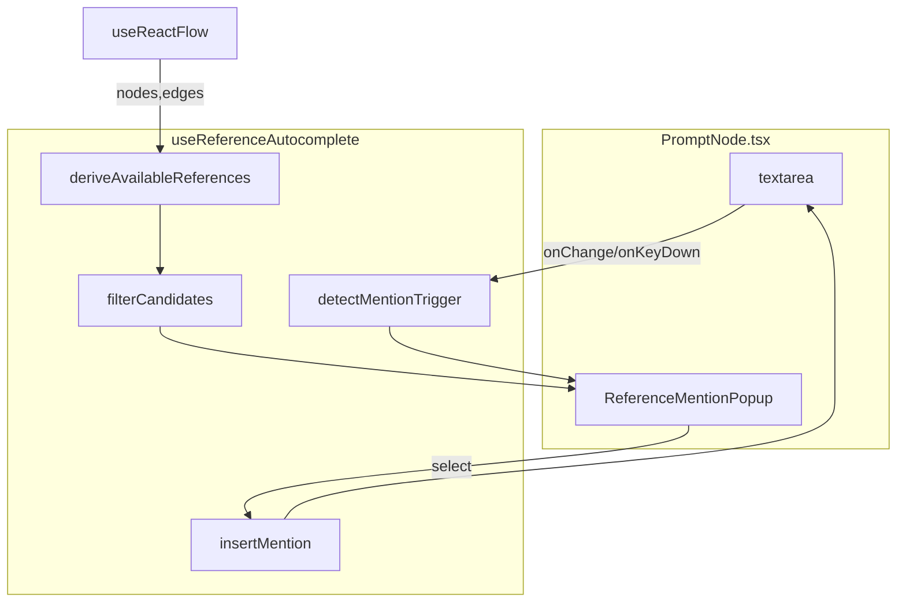
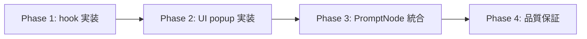
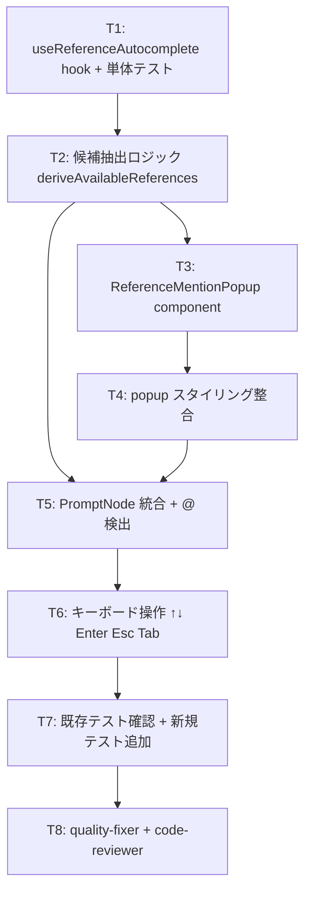

# Reference Mention Autocomplete — Design Doc + 実装計画書

**作成日**: 2026-05-19
**作成者**: noritaka
**親計画書**: [`docs/plans/2026-05-18_seedance-omni-reference-v3.md`](./2026-05-18_seedance-omni-reference-v3.md)
**関連コミット**: `176fd7c` (メイン), `9b71ee6` (テスト), `6824885` (フォローアップ)
**Status**: Proposed
**想定総工数**: 2-3 時間

---

## 1. 概要

PromptNode のテキストエリアで `@` を入力した瞬間、Node Editor 上で利用可能な参照素材 (`@image1` / `@video1` / `@audio1` …) の候補をポップアップ表示し、選択肢からの挿入を可能にする UX 改善機能。

Seedance Omni Reference (v3) で導入された `@image1`/`@video1`/`@audio1` 構文 (PiAPI Seedance 1-indexed) のオーサリング体験を向上させるための「入力補助」機能であり、**保存テキストの構造や検証ロジックには影響しない**。

### 1.1 背景

v3 で追加された参照記法は強力だが、現状は以下の課題がある:

- ユーザーが「いまどのスロットに何が入っているか」を把握しないと正しい index を打てない
- 手書きで `@image3` と書いても OmniReferenceNode 側の slot 3 が空ならランタイムで参照が外れる
- 構文ミス (`@iamge1` など) を実行直前まで気付けない

Slack / Discord / Notion のスラッシュコマンド系 UX に倣い、`@` 押下を契機に**動的に候補を提示**することでこれらを解決する。

### 1.2 デモ用 UX イメージ

```
[ PromptNode textarea ]
A girl waving her hand @|
                       └─┐
                         ▼
  ┌──────────────────────────────────────┐
  │ @image1   character.png              │
  │ @image2   background.png             │
  │ @video1   dance.mp4 (5.0s)           │ ← hover highlight
  │ @audio1   bgm.mp3 (3.2s)             │
  └──────────────────────────────────────┘
```

---

## 2. 目標 / 非目標

### 2.1 目標 (Goals)

| ID | 内容 |
|----|------|
| G1 | `@` 入力時にカーソル位置近傍にポップアップ表示 |
| G2 | 候補は Node Editor の **現在の接続状態と slot の埋まり状況** から動的計算 |
| G3 | 候補に filename / duration などのメタ情報を併記 |
| G4 | prefix match による絞り込み (`@v` で video 系のみ) |
| G5 | キーボード操作 (↑↓ Enter Tab Esc) で完結する操作 |
| G6 | 候補ゼロ時にも「参照素材なし」と教育的に表示 |
| G7 | 既存手書き `@image1` テキストとの完全互換 |

### 2.2 非目標 (Non-goals)

| ID | 内容 | 理由 |
|----|------|------|
| NG1 | カーソル直下 (caret coordinate) への精密配置 | Phase 1 では textarea 直下で十分。`textarea-caret-position` 等は後続改善 |
| NG2 | ファジー一致 (fuse.js 等) | prefix match で要件を満たす |
| NG3 | リッチエディタ化 (mention を pill 化) | テキスト保存形式を変えるとバックエンド波及大 |
| NG4 | カスタム alias (`@hero` → `@image1`) | スコープ外 |
| NG5 | バックエンド構文検証の強化 | graph-to-api 検証は既存実装維持 |
| NG6 | スマホ / タッチ操作の最適化 | デスクトップ前提 |

---

## 3. 既存コードベース分析

### 3.1 関連ファイル一覧

| パス | 役割 | 本機能での扱い |
|------|------|----------------|
| `movie-maker/components/node-editor/nodes/PromptNode.tsx` | 日本語プロンプト textarea を持つノード (~250 行) | **修正**: textarea に autocomplete を統合 |
| `movie-maker/components/node-editor/nodes/OmniReferenceNode.tsx` | image×8 / video×3 / audio×3 の参照 slot ノード | **参照のみ** (候補ソース) |
| `movie-maker/components/node-editor/nodes/ImageInputNode.tsx` | base 画像入力 (= `@image1` の出典) | **参照のみ** |
| `movie-maker/lib/types/node-editor.ts` | `OmniReferenceNodeData` / `OmniReferenceSlot` / `HANDLE_IDS` 定義 | **参照のみ** |
| `movie-maker/components/node-editor/utils/emit-node-data.ts` | `emitNodeDataUpdate` 共通化 helper | **不使用** (PromptNode 内 local state のみで完結する想定) |

### 3.2 既実装の前提

- **PiAPI Seedance 構文**: `@image{N}` / `@video{N}` / `@audio{N}` (N は 1-indexed)
- **`@image1` の特殊性**: ImageInputNode から GenerateNode に流れる base 画像が `image1`、OmniReferenceNode の `imageSlots[0..7]` が `image2..image9` にマップされる (`story_processor` が `[base_image] + image_reference_asset_ids` を `image_urls` に統合)
- **接続パス**: PromptNode → GenerateNode → ProviderNode (Seedance) ← OmniReferenceNode (`OMNI_REFERENCE_INPUT`)
- **`useReactFlow()`**: PromptNode 内で既に使用済 (DialogueNode 検出ロジック)
- **`emitNodeDataUpdate`**: L-4 で共通化済。本機能では node data を更新しないので不使用

### 3.3 統合点 (Integration Points)

| 統合点 | 既存実装 | 影響度 |
|--------|----------|--------|
| PromptNode の textarea | `onChange` → 翻訳デバウンス | 中 (キーイベント追加だが既存 onChange 維持) |
| `useReactFlow().getNodes()` / `getEdges()` | PromptNode で `getNodes` 使用済 | 低 (read only) |
| graph-to-api 検証 | 既存ロジック維持 | **影響なし** (保存テキスト不変) |

---

## 4. 採用案と比較

### 4.1 実装方式: Hook 切り出し vs インライン実装

| 比較項目 | A. PromptNode 内部に直接実装 | **B. hook + component に切り出し (採用)** |
|----------|------------------------------|---------------------------------------------|
| ファイル分割 | 単一 | hook + popup + 既存 PromptNode |
| テスト容易性 | DOM mount 必須 | hook 単体 / popup 単体テスト可 |
| 再利用性 | PromptNode 限定 | 将来 DialogueNode 等にも転用可 |
| 初期工数 | 低 | 中 (差分は 30 分程度) |
| 可読性 | PromptNode 肥大化 | 関心分離 |

**採用**: B。テスト容易性と関心分離を優先。30 分程度の初期工数増は許容範囲。

### 4.2 位置決め: caret 精密 vs textarea 直下

| 比較項目 | A. caret 直下 (理想) | **B. textarea 直下 (採用)** |
|----------|---------------------|------------------------------|
| 実装複雑度 | 高 (`textarea-caret-position` 等の外部ライブラリ or 自作 measurement) | 低 (`getBoundingClientRect`) |
| UX | 理想的 | 十分許容できる (textarea 自体が ~80px と小さい) |
| エッジケース | textarea スクロール時の補正が必要 | ほぼ無し |

**採用**: B。Phase 1 では simplicity 優先。caret 精密配置は将来改善 (NG1)。

### 4.3 候補ゼロ時: 非表示 vs 教育的表示

| 比較項目 | A. ポップアップ出さない | **B. 「参照素材なし」表示 (採用)** |
|----------|------------------------|------------------------------------|
| 学習効果 | 低 (なぜ出ないか分からない) | 高 (OmniReferenceNode の存在を知れる) |
| 視覚ノイズ | 無し | 小さい (1 行のメッセージ) |

**採用**: B。「無反応」より「説明的フィードバック」を選好。

### 4.4 IME 対応

日本語 IME 変換中の `@` 入力は **`compositionstart` / `compositionend`** で抑止する。`isComposing` フラグを保持し、`true` の間はトリガしない。

---

## 5. 設計詳細

### 5.1 候補抽出ロジック (擬似コード)

```ts
// useReferenceAutocomplete.ts
function deriveAvailableReferences(
  promptNodeId: string,
  nodes: Node[],
  edges: Edge[]
): ReferenceCandidate[] {
  const candidates: ReferenceCandidate[] = [];

  // 1. PromptNode → GenerateNode のパスを辿る
  const generateNode = findDownstream(promptNodeId, nodes, edges, 'generate');
  if (!generateNode) return [];

  // 2. base 画像 = ImageInputNode → GenerateNode.IMAGE_INPUT
  const baseImage = findUpstream(generateNode.id, edges, HANDLE_IDS.IMAGE_INPUT)
    .map((id) => nodes.find((n) => n.id === id))
    .find((n) => n?.type === 'imageInput') as ImageInputNode | undefined;

  if (baseImage?.data.imageUrl) {
    candidates.push({
      id: '@image1',
      kind: 'image',
      index: 1,
      filename: extractFilename(baseImage.data.imageUrl),
    });
  }

  // 3. ProviderNode (Seedance) → OmniReferenceNode
  const providerNode = findUpstream(generateNode.id, edges, HANDLE_IDS.CONFIG_INPUT)
    .map((id) => nodes.find((n) => n.id === id))
    .find((n) => n?.type === 'provider');

  if (!providerNode) return candidates;

  const omniRef = findUpstream(providerNode.id, edges, HANDLE_IDS.OMNI_REFERENCE_INPUT)
    .map((id) => nodes.find((n) => n.id === id))
    .find((n) => n?.type === 'omniReference') as OmniReferenceNode | undefined;

  if (!omniRef) return candidates;

  // 4. imageSlots[0..7] → @image2..@image9 (base image があれば +1 offset)
  const imageOffset = baseImage?.data.imageUrl ? 2 : 1;
  omniRef.data.imageSlots.forEach((slot, i) => {
    if (slot.assetId) {
      candidates.push({
        id: `@image${i + imageOffset}`,
        kind: 'image',
        index: i + imageOffset,
        filename: slot.filename ?? `slot-${i + 1}`,
      });
    }
  });

  // 5. videoSlots → @video1..@video3
  omniRef.data.videoSlots.forEach((slot, i) => {
    if (slot.assetId) {
      candidates.push({
        id: `@video${i + 1}`,
        kind: 'video',
        index: i + 1,
        filename: slot.filename ?? `video-${i + 1}`,
        durationSeconds: slot.durationSeconds,
      });
    }
  });

  // 6. audioSlots → @audio1..@audio3
  omniRef.data.audioSlots.forEach((slot, i) => {
    if (slot.assetId) {
      candidates.push({
        id: `@audio${i + 1}`,
        kind: 'audio',
        index: i + 1,
        filename: slot.filename ?? `audio-${i + 1}`,
        durationSeconds: slot.durationSeconds,
      });
    }
  });

  return candidates;
}
```

### 5.2 トリガ検出 (擬似コード)

```ts
function detectMentionTrigger(text: string, caretPos: number): MentionState | null {
  // カーソルから逆順に走査
  for (let i = caretPos - 1; i >= 0; i--) {
    const ch = text[i];
    if (ch === '@') {
      // @ より右をクエリとして扱う (ただしスペースが入ったら invalid)
      const query = text.slice(i + 1, caretPos);
      if (/\s/.test(query)) return null;
      return { startIndex: i, query };
    }
    if (/\s/.test(ch)) return null; // スペースに当たったら break
  }
  return null;
}
```

### 5.3 候補フィルタリング

```ts
function filterCandidates(
  candidates: ReferenceCandidate[],
  query: string
): ReferenceCandidate[] {
  if (!query) return candidates;
  const prefix = `@${query}`.toLowerCase();
  return candidates.filter((c) => c.id.toLowerCase().startsWith(prefix));
}
```

**例**:
- query=`""` → 全候補
- query=`"v"` → `@video1`, `@video2`, ...
- query=`"image"` → `@image1`, `@image2`, ...
- query=`"image1"` → `@image1` のみ

### 5.4 挿入ロジック

```ts
function insertMention(
  text: string,
  state: MentionState,
  caretPos: number,
  selected: ReferenceCandidate
): { newText: string; newCaret: number } {
  const before = text.slice(0, state.startIndex);
  const after = text.slice(caretPos);
  const inserted = `${selected.id} `; // 末尾スペースで自動 close
  return {
    newText: before + inserted + after,
    newCaret: before.length + inserted.length,
  };
}
```

### 5.5 UI 構造 (mermaid)



### 5.6 コンポーネント Props 設計

```ts
// useReferenceAutocomplete.ts
export interface UseReferenceAutocompleteOptions {
  promptNodeId: string;
  textareaRef: React.RefObject<HTMLTextAreaElement>;
  value: string;
  onChange: (next: string) => void;
}

export interface UseReferenceAutocompleteResult {
  isOpen: boolean;
  query: string;
  candidates: ReferenceCandidate[];
  highlightedIndex: number;
  handlers: {
    onTextareaChange: (e: React.ChangeEvent<HTMLTextAreaElement>) => void;
    onTextareaKeyDown: (e: React.KeyboardEvent<HTMLTextAreaElement>) => void;
    onCompositionStart: () => void;
    onCompositionEnd: () => void;
    onTextareaBlur: () => void;
    onPopupSelect: (candidate: ReferenceCandidate) => void;
    onPopupClose: () => void;
  };
}
```

```ts
// ReferenceMentionPopup.tsx
export interface ReferenceMentionPopupProps {
  candidates: ReferenceCandidate[];
  highlightedIndex: number;
  onSelect: (candidate: ReferenceCandidate) => void;
  onClose: () => void;
  anchorRef: React.RefObject<HTMLElement>; // 通常は textarea
}
```

### 5.7 キーボード/マウス操作仕様

| 操作 | 動作 |
|------|------|
| `@` 入力 | ポップアップ open, highlightedIndex=0 |
| `↓` | highlightedIndex を +1 (modulo len) |
| `↑` | highlightedIndex を -1 (modulo len) |
| `Enter` | 候補挿入 + close (preventDefault で改行を抑止) |
| `Tab` | 候補挿入 + close (preventDefault) |
| `Escape` | close (テキスト変更なし) |
| 候補 click | 候補挿入 + close |
| 候補 hover | highlightedIndex 更新 |
| textarea blur | close (click 競合は `onMouseDown` で吸収) |
| outside click | close |
| IME composition | 期間中はキーイベント無視 |

### 5.8 ポップアップ位置決め

```ts
// textarea の下端から 4px 下に表示。横位置は textarea の左端揃え。
const rect = textareaRef.current.getBoundingClientRect();
const style = {
  position: 'absolute' as const,
  top: rect.bottom + window.scrollY + 4,
  left: rect.left + window.scrollX,
  minWidth: rect.width,
  zIndex: 1000,
};
```

`React Flow` のキャンバスは zoom/pan を持つが、ポップアップは **viewport 座標**で `position: fixed` に近い扱い (`position: absolute` + `document.body` への portal) とする。

---

## 6. ファイル構成

### 6.1 新規追加

| パス | 内容 | 行数目安 |
|------|------|---------|
| `movie-maker/components/node-editor/hooks/useReferenceAutocomplete.ts` | hook 本体 (検出・抽出・フィルタ・挿入・キー処理) | ~180 |
| `movie-maker/components/node-editor/hooks/useReferenceAutocomplete.test.ts` | hook 単体テスト (`@testing-library/react` の `renderHook`) | ~250 |
| `movie-maker/components/node-editor/components/ReferenceMentionPopup.tsx` | ポップアップ UI コンポーネント (portal + キー処理は親) | ~80 |
| `movie-maker/components/node-editor/components/ReferenceMentionPopup.test.tsx` | popup 単体テスト | ~120 |

### 6.2 修正

| パス | 修正内容 |
|------|---------|
| `movie-maker/components/node-editor/nodes/PromptNode.tsx` | `useReferenceAutocomplete` 統合, textarea に handlers 接続, popup 描画 |
| `movie-maker/components/node-editor/nodes/__tests__/PromptNode.test.tsx` | autocomplete 統合テスト追加 |

### 6.3 影響なし (明示)

| パス | 理由 |
|------|------|
| `movie-maker/lib/types/node-editor.ts` | 型追加なし (候補型は hook ファイル内 export) |
| `movie-maker-api/**` | バックエンド契約変更なし |
| `movie-maker/lib/graph/*` (graph-to-api) | 保存テキスト形式不変 |

---

## 7. データ型定義

```ts
// useReferenceAutocomplete.ts 内 export
export type ReferenceKind = 'image' | 'video' | 'audio';

export interface ReferenceCandidate {
  id: string;             // "@image1", "@video1", "@audio1"
  kind: ReferenceKind;
  index: number;          // 1-indexed
  filename: string;
  durationSeconds?: number; // image は undefined
}

interface MentionState {
  startIndex: number;     // @ の絶対 index
  query: string;          // @ 以降カーソルまでの文字列
}
```

---

## 8. エッジケース対応表

| # | ケース | 対応 |
|---|--------|------|
| 1 | 複数 `@` (`@image1 と @video1`) | 直近の `@` のみ対象。`detectMentionTrigger` がカーソルから逆順走査 |
| 2 | `@` 直後にスペース | `detectMentionTrigger` が `/\s/` 検出で `null` 返却 → close |
| 3 | 完成済 `@image1` の途中で再編集 | カーソルが `@` 直後の領域内に戻ると再 open |
| 4 | `@@image1` の誤入力 | 最後の `@` 以降を対象。逆順走査の自然な振る舞い |
| 5 | OmniRef slot が後から埋まる | `useReactFlow().getNodes()` を hook 内で毎レンダ参照 → 動的に反映 |
| 6 | OmniRef 接続解除 | 同上、edges 変化で候補から消える |
| 7 | 候補 0 件 | popup に「アップロード済みの参照素材がありません」を表示 |
| 8 | ポップアップ表示中 outside click | `mousedown` listener (`document`) で close |
| 9 | textarea blur | `onBlur` で close (ただし popup item click は `onMouseDown` で先取り) |
| 10 | IME 入力中の `@` | `isComposing` true の間は trigger 検出を skip |
| 11 | base image なし + OmniRef 接続 | imageSlot[0] が `@image1` になる (offset=1) |
| 12 | PromptNode が GenerateNode に未接続 | 候補ゼロ。「参照素材なし」表示 |

---

## 9. テスト戦略

### 9.1 テストケース一覧

| ID | テスト内容 | 対象ファイル |
|----|----------|--------------|
| AT-1 | `@` 押下でポップアップが表示される | PromptNode.test.tsx |
| AT-2 | OmniRef 接続済 + slot 埋まり → 候補リスト正確 (count / id / order) | useReferenceAutocomplete.test.ts |
| AT-3 | OmniRef 未接続 → 「参照素材なし」表示 | ReferenceMentionPopup.test.tsx |
| AT-4 | `@v` 入力で video 系のみ絞り込み | useReferenceAutocomplete.test.ts |
| AT-5 | `↓` で highlightedIndex 移動 → `Enter` で挿入 | PromptNode.test.tsx |
| AT-6 | 候補 click で挿入 + close | ReferenceMentionPopup.test.tsx |
| AT-7 | `Escape` で close (テキスト不変) | PromptNode.test.tsx |
| AT-8 | document 外側 click で close | PromptNode.test.tsx |
| AT-9 | 手書きの `@image1` を含むテキストでも翻訳 API が呼ばれる (既存挙動維持) | PromptNode.test.tsx |
| AT-10 | 候補メタ情報 (filename, duration) の表示 | ReferenceMentionPopup.test.tsx |
| AT-11 | IME composition 中の `@` は popup を開かない | PromptNode.test.tsx |
| AT-12 | textarea blur で close | PromptNode.test.tsx |
| AT-13 | 複数 `@` 環境で最新 `@` のみ反応 | useReferenceAutocomplete.test.ts |
| AT-14 | base image なし環境で imageSlot[0] が `@image1` にマップ | useReferenceAutocomplete.test.ts |
| AT-15 | `Tab` で候補挿入 | PromptNode.test.tsx |

合計 **15 ケース** (要件最低 12 を満たす)。

### 9.2 受け入れ条件 (Acceptance Criteria)

| AC | 内容 | 検証方法 |
|----|------|---------|
| AC1 | `@` 押下で popup が viewport 内に表示される | E2E (manual) + AT-1 |
| AC2 | 候補リストが Node Editor の実状態と一致する | AT-2, AT-13, AT-14 |
| AC3 | prefix match で絞り込みが動く | AT-4 |
| AC4 | キーボードのみで候補選択 → 挿入できる | AT-5, AT-15 |
| AC5 | 既存の手書きユーザーに影響を与えない | AT-9 |
| AC6 | IME 中に誤発火しない | AT-11 |
| AC7 | コードは ESLint / TypeScript エラーゼロ | `npm run lint` & `tsc --noEmit` |
| AC8 | テストカバレッジ: 新規ファイル 80% 以上 | vitest --coverage |
| AC9 | 既存 PromptNode テストが全て pass | `npm run test PromptNode` |

---

## 10. Phase 分解と想定工数

### 10.1 Phase 構造図 (mermaid)



### 10.2 タスク依存図 (mermaid)



### 10.3 Phase 詳細

#### Phase 1: Hook 実装 (~50 分)

- [ ] **T1**: `useReferenceAutocomplete` 新規 hook の skeleton 実装 + 単体テスト (Red→Green)
  - `detectMentionTrigger` / `filterCandidates` / `insertMention` の pure 関数化
  - 検証: AT-4, AT-13 を pass
  - 完了条件: hook 単体テスト pass / lint OK
- [ ] **T2**: 接続済ノードから候補生成ロジック (`deriveAvailableReferences`) 実装
  - PromptNode→Generate→Provider←OmniRef のパス探索
  - base image offset 処理 (AT-14)
  - 検証: AT-2 (3 種類の slot ミックスケース) を pass
  - 完了条件: hook 全テスト pass

#### Phase 2: UI Popup 実装 (~40 分)

- [ ] **T3**: `ReferenceMentionPopup` component 新規実装
  - props: candidates, highlightedIndex, onSelect, onClose, anchorRef
  - `createPortal` で `document.body` へマウント
  - 候補ゼロ時の「参照素材なし」表示 (AT-3)
  - 完了条件: popup 単体テスト pass (AT-3, AT-6, AT-10)
- [ ] **T4**: スタイリング (Tailwind v4)
  - 既存 BaseNode / NodePalette の dark theme (`#1a1a1a` 系) と整合
  - hover / highlight 状態の視覚区別
  - 注意: `globals.css` に `@source` を追加しない (CLAUDE.md ルール)
  - 完了条件: 視覚確認 + 既存 UI 崩壊なし

#### Phase 3: PromptNode 統合 (~50 分)

- [ ] **T5**: PromptNode 修正
  - `useReferenceAutocomplete(id, textareaRef, localPrompt, setLocalPrompt)` 呼び出し
  - textarea に `onChange` / `onKeyDown` / `onCompositionStart` / `onCompositionEnd` / `onBlur` を bind
  - popup を条件レンダ
  - 既存翻訳デバウンス / DialogueNode 検出は **無改変**
  - 完了条件: AT-1, AT-9, AT-11, AT-12 pass
- [ ] **T6**: キーボード操作の総合テスト
  - `↑↓ Enter Tab Esc` 全てが期待通り動作
  - `preventDefault` 抜けによる改行混入なし
  - 完了条件: AT-5, AT-7, AT-15 pass
- [ ] **T7**: 既存 `PromptNode.test.tsx` の regression 確認 + 新規 AT-1〜AT-15 追加
  - 完了条件: `npm run test PromptNode` 全 pass

#### Phase 4: 品質保証 (~20 分)

- [ ] **T8**: quality-fixer + code-reviewer 実行
  - `npm run lint` エラーゼロ
  - `tsc --noEmit` エラーゼロ
  - `npm run test` 全 pass
  - カバレッジ 80% 以上 (新規ファイル)
  - PR description で「Seedance v3 親計画書 §X.Y を満たす」明記
  - 完了条件: 全 AC1〜AC9 達成

### 10.4 想定総工数

| Phase | 工数 |
|-------|------|
| Phase 1 | 50 分 |
| Phase 2 | 40 分 |
| Phase 3 | 50 分 |
| Phase 4 | 20 分 |
| **合計** | **~2 時間 40 分** (バッファ込み 3 時間) |

---

## 11. 後方互換性

| 観点 | 互換性 |
|------|--------|
| 既存の手書き `@image1` を含むプロンプト | **完全互換**。autocomplete は入力補助のみで、保存テキストに介入しない |
| 既存の翻訳デバウンス (`videosApi.translateStoryPrompt`) | **無改変**。`localPrompt` 変更を従来通り監視 |
| 既存の DialogueNode 検出ロジック | **無改変** |
| graph-to-api 検証 / バックエンド側 PiAPI 構文サポート | **無改変** |
| OmniReferenceNode / ImageInputNode の挙動 | **無改変** (read only) |

---

## 12. リスクと対策

| # | リスク | 対策 |
|---|--------|------|
| R1 | popup が React Flow zoom/pan の影響を受けて位置ズレ | `document.body` portal + viewport 座標で固定描画 |
| R2 | `↑↓` キーが textarea のカーソル移動と競合 | popup open 中は `preventDefault` |
| R3 | IME 確定の `Enter` が popup 選択を誤発火 | `isComposing` チェックで吸収 |
| R4 | OmniReferenceNode の slot.filename が undefined のケース | `?? \`slot-${i+1}\`` でフォールバック |
| R5 | textarea blur 直後の popup click が無視される | `onMouseDown` (capture) で先取り → `onClick` 不要パス |
| R6 | base image offset 計算ミスで `@image2` が `@image1` を上書き | AT-14 で明示テスト |
| R7 | popup の z-index が他の UI に埋もれる | `zIndex: 1000` (React Flow node は ~100 程度) |

---

## 13. 完了報告チェックリスト

実装完了時に確認:

- [ ] `npm run lint` エラーゼロ
- [ ] `npm run test` 全 pass (新規 AT-1〜AT-15 含む)
- [ ] `tsc --noEmit` エラーゼロ
- [ ] `useReferenceAutocomplete.test.ts` 新規追加
- [ ] `ReferenceMentionPopup.test.tsx` 新規追加
- [ ] `PromptNode.test.tsx` に autocomplete テスト 5 件以上追加
- [ ] 親計画書 (`2026-05-18_seedance-omni-reference-v3.md`) の関連セクションを update
- [ ] PR description で AC1〜AC9 の対応箇所を明示

---

## 14. 参考資料

- 親計画書: `docs/plans/2026-05-18_seedance-omni-reference-v3.md`
- PiAPI Seedance @構文仕様: 親計画書 §6.10
- 既存実装コミット: `176fd7c`, `9b71ee6`, `6824885`
- 類似 UX 参考: Slack mention, Discord, Notion slash command
