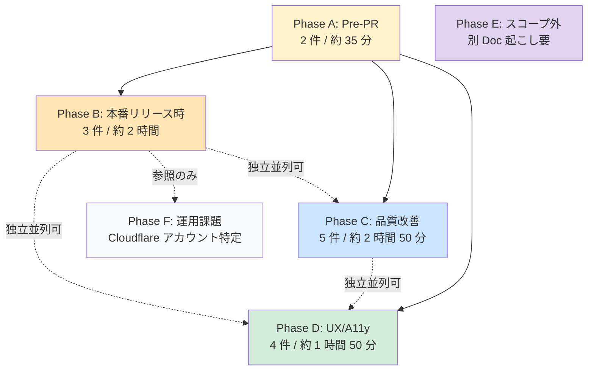
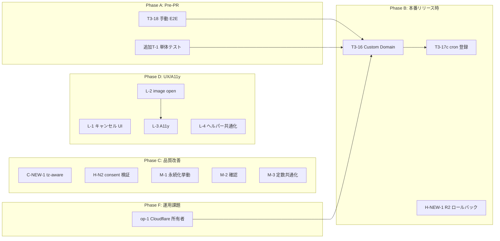

# Seedance 2.0 omni_reference 機能 — コミット後フォローアップ計画書

- **作成日**: 2026-05-19
- **作成者**: AI Manager (Claude Code)
- **対象機能**: Seedance 2.0 omni_reference (multi-modal reference: video / audio / image)
- **メイン実装コミット**: `176fd7c`
- **親計画書 (v3)**: `docs/plans/2026-05-18_seedance-omni-reference-v3.md`
- **タスク分解**: `docs/plans/tasks/2026-05-18_seedance-omni-reference/`
- **本計画書のスコープ**: メイン実装完了後の品質・運用・将来対応フォローアップ
- **ステータス**: Draft (作成直後・未着手)

---

## 1. 概要 (Executive Summary)

### 1.1 メイン実装の完了状況

Seedance 2.0 omni_reference 機能のメイン実装は完了している。完了範囲は次のとおり。

| 項目 | 状態 | 詳細 |
|------|------|------|
| Phase 1 Backend | 完了 | DB マイグレーション、R2 SDK、upload API、PiAPI 連携、GC バッチ実装 |
| Phase 2 Frontend | 完了 | OmniReferenceNode、API client、validation、edge handle、node palette 統合 |
| T3-19 (README/Docs) | 完了 | 公開ドキュメントへの API 仕様・利用手順反映 |
| E2E 実データ動作検証 | 完了 | R2 への video/audio/image upload、公開 GET、DB INSERT を実機確認 |
| Backend テスト | 984+ 件 pass | 既存失敗 3 件 (omni_reference 機能とは無関係、CLAUDE.md 既知問題) は維持 |
| Frontend テスト | 447 件 pass | OmniReferenceNode 単体テストは未作成 (本計画書 T-追加 1 で補完) |

### 1.2 本計画書の位置付け

本計画書は **「機能完成のための計画」ではなく「品質・運用・将来対応のための計画」** である。

メイン機能はすでに end-to-end で動作するが、以下に対応する残作業を Phase A〜F に整理する。

- **Phase A**: PR マージ前に推奨される手動 E2E と単体テスト補完
- **Phase B**: 本番リリースに必要な運用設定 (R2 Custom Domain、GC cron、ロールバック実装)
- **Phase C**: 品質改善 (datetime tz 統一、validation 強化、定数共通化)
- **Phase D**: UX / A11y 改善
- **Phase E**: スコープ外 (将来別 Doc 起こし要)
- **Phase F**: プロジェクト全体運用課題 (Cloudflare アカウント所有者特定)

合計 16 件 (Phase A〜D の実施対象 14 件 + Phase E 記載のみ 2 件 + Phase F 1 件)。

### 1.3 想定総工数 (Phase 別)

| Phase | 件数 | 推定工数 | 自動化可能件数 |
|-------|------|----------|----------------|
| A: Pre-PR / Merge 前推奨 | 2 | 約 35 分 | 1 件 |
| B: 本番リリース時 | 3 | 約 2 時間 | 1 件 |
| C: 品質改善 (任意) | 5 | 約 2 時間 50 分 | 4 件 |
| D: UX/A11y 改善 | 4 | 約 1 時間 50 分 | 4 件 |
| E: スコープ外 (記載のみ) | 2 | (別 Doc 化要) | — |
| F: プロジェクト運用課題 | 1 | 不確定 | — |
| **合計 (A〜D)** | **14** | **約 7 時間 15 分** | **10 件** |

---

## 2. 改訂履歴 (v3 計画書からの差分)

| 版 | 日付 | 差分内容 |
|----|------|----------|
| v3 (親) | 2026-05-18 | 初版。フル機能の Phase 1〜3 を網羅 |
| **本書 (フォローアップ)** | 2026-05-19 | v3 で Phase 1/2 と T3-19 が完了。残存タスク 16 件をフォローアップとして再整理。新規追加項目 (H-NEW-1: R2 ロールバック、C-NEW-1: tz-aware 統一、追加T-1: OmniReferenceNode 単体テスト、op-1: Cloudflare アカウント特定) を含む |

### 親計画書 (v3) との関係

- 本計画書は v3 のサブセット (未完了部分) + 実装中に発見された追加項目で構成
- v3 で「完了済」とマークされたタスクは本計画書では扱わない
- v3 の「スコープ外」リストから 2 件 (storyboard 経由伝搬、usage refund) を Phase E に転載

---

## 3. 目的と非目的

### 3.1 目的 (In-scope)

1. **PR レビュー前に必要な最終確認の手順化** — 手動 E2E と未作成テストの補完
2. **本番リリース時に必須となる運用設定の明文化** — R2 ドメイン、cron、ロールバック
3. **品質・UX・A11y の段階的改善計画** — 機能ではなく「磨き込み」
4. **将来別 Doc 起こしすべき項目の明示** — 忘却防止のための記載
5. **プロジェクト全体の運用リスク (Cloudflare アカウント所有者問題) の顕在化**

### 3.2 非目的 (Out-of-scope)

- 新しい omni_reference 機能の追加 (例: 3 種以上の同時参照、参照アセットの編集 UI など)
- v3 計画書で完了済の項目の再実装
- Phase E (scope-out-1/2) の具体実装 — 別 Doc 起こしが前提
- 既存テスト失敗 3 件の修正 (本機能と無関係。CLAUDE.md 既知問題)

---

## 4. Phase 構造

### 4.1 Phase 一覧と依存



### 4.2 並列実行可能性

| Phase 組 | 並列可否 | 備考 |
|----------|----------|------|
| A → B/C/D | 順次 | A 完了後に B/C/D 着手推奨 (PR マージ前提) |
| B / C / D | 並列可 | 相互依存なし |
| E | 独立 | 別 Doc 起こし時に判断 |
| F | 独立 | Phase B の R2 Custom Domain 設定までに解決必須 |

### 4.3 Phase 分割の根拠

- **A (Pre-PR)**: マージブロッカー扱い。手動 E2E と単体テスト未作成項目をクリアしないと PR レビュアに不安を残す
- **B (本番リリース時)**: 本番環境固有の設定 (R2 Custom Domain、cron、孤児防止) を分離。ローカル/Preview では Phase A までで動く
- **C (品質改善)**: 機能影響なし。リファクタとガード強化中心
- **D (UX/A11y)**: ユーザ体験向上。リリース後の追加リリースで対応可能
- **E (スコープ外)**: 別機能扱い。本計画書では「記載のみ」
- **F (運用課題)**: プロジェクト全体課題。本機能リリース判断と独立

---

## 5. タスク一覧

### Phase A: Pre-PR / Merge 前推奨

#### T3-18: ブラウザ E2E 手動検証

| 項目 | 内容 |
|------|------|
| id | T3-18 |
| title | ブラウザで E2E 手動検証 (OmniReferenceNode 配置 → アップロード → Generate → PiAPI payload 確認) |
| auto/manual | 手動 |
| estimated | 15 分 |
| dependencies | なし |
| priority | 高 (PR マージ前推奨) |
| acceptance | ノードエディタで OmniReferenceNode を配置し、video/audio/image を 1 件ずつアップロードして Generate 実行、PiAPI へのリクエスト payload に asset URL 配列が含まれることを DevTools / Backend ログで確認 |

#### 追加T-1: OmniReferenceNode 単体テスト作成

| 項目 | 内容 |
|------|------|
| id | 追加T-1 |
| title | OmniReferenceNode.test.tsx 単体テスト作成 (`__tests__/` 配下) |
| auto/manual | 自動 (task-executor-frontend) |
| estimated | 20 分 |
| dependencies | なし |
| priority | 高 (T2-11 で「報告のみ実体未作成」と判明) |
| acceptance | render / アップロード dropzone / 削除ボタン / consent toggle / 容量超過バリデーションを最低 8 ケース網羅。Vitest + RTL。npm run test pass |

### Phase B: 本番リリース時

#### T3-16: R2 Custom Domain 設定

| 項目 | 内容 |
|------|------|
| id | T3-16 |
| title | R2 Custom Domain 設定 (Cloudflare ダッシュボード → `R2_PUBLIC_URL` env 更新) |
| auto/manual | ユーザ手動 (Cloudflare ダッシュボード) |
| estimated | 30 分 |
| dependencies | Phase F op-1 (アカウント所有者特定) |
| priority | 必須 (本番リリースブロッカー) |
| acceptance | Custom Domain (例: `r2.non-turn.com`) で public GET 可能。Railway/Vercel の `R2_PUBLIC_URL` を更新。r2.dev 直 URL の本番利用を回避 |

#### T3-17c: GC バッチを Railway scheduled job に登録

| 項目 | 内容 |
|------|------|
| id | T3-17c |
| title | GC バッチ `gc_expired_omni_assets` を Railway scheduled job に登録 (cron `0 18 * * *` UTC = JST 03:00 日次) |
| auto/manual | ユーザ手動 (Railway ダッシュボード) |
| estimated | 30 分 |
| dependencies | T3-16 完了推奨 (両方とも本番運用設定) |
| priority | 必須 (本番リリースブロッカー) |
| acceptance | Railway cron が日次起動し、expired_at 経過レコードを R2 + DB から削除。初回起動ログを確認 |

#### H-NEW-1: R2 オブジェクトロールバック実装

| 項目 | 内容 |
|------|------|
| id | H-NEW-1 |
| title | upload-omni-* API で DB INSERT 失敗時の R2 オブジェクトロールバック実装 (孤児化防止) |
| auto/manual | 自動 (task-executor) |
| estimated | 60 分 |
| dependencies | なし |
| priority | 高 (本番リリース前推奨) |
| acceptance | R2 PUT 成功後 DB INSERT 失敗で R2 DELETE が呼ばれる。例外時の R2 DELETE 失敗もログ警告。Unit test 追加 (Mock R2 + Mock Supabase で INSERT 失敗注入) |

### Phase C: 品質改善 (任意・推奨)

#### C-NEW-1: tz-aware datetime 統一

| 項目 | 内容 |
|------|------|
| id | C-NEW-1 |
| title | tz-naive datetime 比較を tz-aware (timezone.utc) に統一 (`resolve_asset_ids` 周辺) |
| auto/manual | 自動 (task-executor) |
| estimated | 20 分 |
| dependencies | なし |
| priority | 中 |
| acceptance | `datetime.utcnow()` を `datetime.now(timezone.utc)` に置換。Supabase TIMESTAMPTZ との比較で tz mismatch warning が出ない。既存 unit test pass |

#### H-N2: useWorkflowValidation の consent 検証強化

| 項目 | 内容 |
|------|------|
| id | H-N2 |
| title | useWorkflowValidation の consent 検証で `edge.targetHandle === OMNI_REFERENCE_INPUT` と target が ProviderNode/seedance かを併用チェック |
| auto/manual | 自動 (task-executor-frontend) |
| estimated | 30 分 |
| dependencies | なし |
| priority | 中 |
| acceptance | 誤接続 edge を持つワークフローで consent 検証が誤発火しない。Vitest で 4 ケース追加 (正常 / handle 不一致 / target type 不一致 / 両方不一致) |

#### M-1: consentAccepted 永続化挙動定義と実装

| 項目 | 内容 |
|------|------|
| id | M-1 |
| title | `consentAccepted` ワークフロー保存/再読込時の挙動定義と実装 (リロード時にリセット or 保持の選択) |
| auto/manual | 自動 (task-executor-frontend) |
| estimated | 45 分 |
| dependencies | なし |
| priority | 中 |
| acceptance | 設計判断 (リセット推奨: 法的安全側) を本計画書か Design Doc に追記し、実装と Vitest 2 ケース追加 (保存時 false に reset / 復元時 false 維持) |

#### M-2: consent false 検証実装確認

| 項目 | 内容 |
|------|------|
| id | M-2 |
| title | useWorkflowValidation に consent false 検証追加 (既に実装済の可能性、要確認) |
| auto/manual | 確認のみ (実装済なら無作業) |
| estimated | 15 分 |
| dependencies | なし |
| priority | 中 |
| acceptance | Source を grep / Read で確認し、実装済なら本計画書にチェックマーク。未実装なら H-N2 と統合 |

#### M-3: 定数の Backend/Frontend 共通化

| 項目 | 内容 |
|------|------|
| id | M-3 |
| title | OmniReferenceNode の constants (MAX_VIDEO_TOTAL_SECONDS 等) を Backend と共通化 (or `/api/v1/config/omni-reference-limits` で配信) |
| auto/manual | 自動 (task-executor: backend + frontend 両方) |
| estimated | 60 分 |
| dependencies | なし |
| priority | 中 |
| acceptance | Backend に `GET /api/v1/config/omni-reference-limits` 追加 (or 共通 JSON 配置)。Frontend は起動時 fetch → state cache。両側の定数二重定義を解消 |

### Phase D: UX/A11y 改善

#### L-1: アップロード中キャンセル UI

| 項目 | 内容 |
|------|------|
| id | L-1 |
| title | OmniReferenceNode のキャンセル UI (アップロード中 AbortController 対応) |
| auto/manual | 自動 (task-executor-frontend) |
| estimated | 45 分 |
| dependencies | なし |
| priority | 低 |
| acceptance | アップロード中に Cancel ボタンが表示され、押下で AbortController.abort() が走り進行中の `fetch` が中断。Vitest 2 ケース (キャンセル成功 / 完了後押下無効) |

#### L-2: image セクション初期 open + 件数バッジ

| 項目 | 内容 |
|------|------|
| id | L-2 |
| title | image セクションを初期 open + 件数バッジ表示 |
| auto/manual | 自動 (task-executor-frontend) |
| estimated | 15 分 |
| dependencies | なし |
| priority | 低 |
| acceptance | `<details open>` で image セクション初期展開。`(3)` 形式のバッジを summary 横に追加 |

#### L-3: details 折り畳み内 dropzone の A11y 改善

| 項目 | 内容 |
|------|------|
| id | L-3 |
| title | `<details>` 折り畳み内 dropzone の A11y 改善 (focus 制御) |
| auto/manual | 自動 (task-executor-frontend) |
| estimated | 20 分 |
| dependencies | L-2 と相性良 (並列可) |
| priority | 低 |
| acceptance | summary 開く → 内部 dropzone へ focus 自動移動。aria-expanded / aria-controls 適切設定。Playwright a11y check pass |

#### L-4: emitNodeDataUpdate ヘルパー共通化

| 項目 | 内容 |
|------|------|
| id | L-4 |
| title | `emitNodeDataUpdate` CustomEvent ヘルパー共通化 (Rule of Three リファクタ) |
| auto/manual | 自動 (task-executor-frontend) |
| estimated | 30 分 |
| dependencies | なし |
| priority | 低 |
| acceptance | 3 箇所以上で重複している CustomEvent dispatch を `lib/node-editor/emit-node-data-update.ts` に集約。既存 Vitest pass |

### Phase E: スコープ外 (記載のみ / 別 Doc 起こし要)

| ID | 内容 | 必要性 | 別 Doc 起こし時の参考 |
|----|------|--------|------------------------|
| scope-out-1 | Storyboard 経由での omni_reference 伝搬対応 (v3 §17 #7) | Storyboard ノード経由で動画生成する経路にも omni_reference を引き継ぐ機能。現状は ProviderNode 直接接続のみサポート | v3 計画書 §17 #7 を起点に新規 Design Doc 化 |
| scope-out-2 | usage カウント refund ロジック (PiAPI 失敗時の課金枠戻し) | PiAPI 失敗時に使用枠を戻す。現状は consume 後の失敗で戻らないユーザ不利状態 | Polar / subscription quota 周りの ADR が必要。billing 影響大のため別 Doc 必須 |

**本計画書では実装しない**。これらに着手する際は新規 PRD / Design Doc / Plan の作成が必要。

### Phase F: プロジェクト運用課題

#### op-1: Cloudflare アカウント所有者特定

| 項目 | 内容 |
|------|------|
| id | op-1 |
| title | Cloudflare アカウント所有者 (`2e1f85f8c4a833bbf38c1cec2eb8c931` 紐づくメール) 特定 + 必要なら所有権移管 or 自分の `snp.inc.info@gmail.com` アカウントへの R2 移行 |
| auto/manual | 手動 (ユーザ調査) |
| estimated | 不確定 (調査次第) |
| dependencies | なし |
| priority | 高 (Phase B T3-16 の前提) |
| acceptance | 所有者メールを特定し、(a) 引き続き使用する場合は admin 招待で snp.inc.info@gmail.com を追加 (b) 移行する場合は新規 R2 bucket + データ migration 計画策定 |
| リスク | アカウント所有者不明のまま本番リリースすると、トラブル時に Cloudflare サポートへの問い合わせ・課金管理・キーローテーション全てが滞る |

---

## 6. 依存関係グラフ



### 重要な依存関係

- **op-1 → T3-16**: Cloudflare アカウント所有者不明のまま Custom Domain 設定不可
- **T3-18 / 追加T-1 → Phase B 全般**: PR マージ前提のため、Phase A 通過がリリース工程の入口
- **L-2 → L-3**: `<details open>` 化と focus 制御は同時実施が UX 上自然 (並列可能だが順次推奨)

---

## 7. ステップバイステップ実行手順

ユーザは以下のいずれかの指示で Phase 単位 or 個別タスク単位で進められる。

### 7.1 Phase 単位の実行指示例

```
「Phase A を実行して」
  → T3-18 (手動 E2E チェックリスト提示) + 追加T-1 (task-executor-frontend に委託)

「Phase B を実行して」
  → op-1 未解決確認 → T3-16/T3-17c (ユーザ手動手順提示) + H-NEW-1 (task-executor)

「Phase C を実行して」
  → C-NEW-1/H-N2/M-1/M-2/M-3 を順次 task-executor へ委託

「Phase D を実行して」
  → L-1〜L-4 を順次 task-executor-frontend へ委託
```

### 7.2 個別タスク実行指示例

```
「H-NEW-1 だけ実装して」
「T3-18 のチェックリスト出して」
「M-3 の Backend API 仕様を提案して」
```

### 7.3 推奨実行順

1. **Step 1**: Phase A 完了 (T3-18 → 追加T-1) → PR レビュー / マージ
2. **Step 2**: op-1 解決 (Cloudflare アカウント所有者特定)
3. **Step 3**: Phase B 完了 (T3-16 → T3-17c → H-NEW-1) → 本番リリース
4. **Step 4 (任意・並列可)**: Phase C / Phase D (リリース後の追加リリース)
5. **Step 5**: Phase E の別 Doc 起こし判断

### 7.4 各タスク開始時の標準フロー

```
1. 本計画書から対象タスクの acceptance を確認
2. 自動化可能なら subagent_type と model を選択して委託
   - frontend: task-executor-frontend (sonnet 推奨)
   - backend / mixed: task-executor (sonnet 推奨)
3. 完了後、verifier / code-verifier で検証
4. quality-fixer で品質修正 (必要なら)
5. 本計画書のチェックボックスを更新
```

---

## 8. 推定総工数 (再掲)

| Phase | 件数 | 推定 |
|-------|------|------|
| A: Pre-PR | 2 | 35 分 |
| B: 本番リリース時 | 3 | 2 時間 (op-1 除く) |
| C: 品質改善 | 5 | 2 時間 50 分 |
| D: UX/A11y | 4 | 1 時間 50 分 |
| E: 記載のみ | 2 | (別 Doc 起こし時に計上) |
| F: 運用課題 | 1 | 不確定 |
| **合計 (A〜D)** | **14** | **約 7 時間 15 分** |

- 自動化可能 10 件: subagent 委託で実時間圧縮可能 (Manager 側待ち時間のみ)
- 手動 4 件 (T3-18 / T3-16 / T3-17c / op-1): ユーザ操作必須

---

## 9. 想定リスク

### 9.1 Cloudflare アカウント所有者特定できない場合の本番リリースリスク

**影響度**: 高 / **発生確率**: 中

- R2 bucket 設定変更 (Custom Domain、CORS、Lifecycle Policy) が不可
- 課金カードの管理者不明 → 支払い停止リスク
- セキュリティインシデント時のキーローテーション不可

**対策**:
1. Phase F op-1 を Phase B T3-16 の前提条件として明示済
2. 解決不能の場合は snp.inc.info@gmail.com で新規 R2 bucket を作成し、データ移行 (新 Doc 化必須)
3. 暫定運用: r2.dev 直 URL を本番でも使用 (推奨されないが機能はする)

### 9.2 R2 Custom Domain 設定タイミング遅延の影響

**影響度**: 中 / **発生確率**: 中

- r2.dev 直 URL は本番非推奨 (Cloudflare 公式) — Rate Limit / TOS 上のリスク
- 公開 URL を後から変更すると、既存 DB レコードの `public_url` カラム値が無効化

**対策**:
1. T3-16 を本番リリース前に完了 (Phase B の最初に配置)
2. 万が一遅延した場合の暫定運用と URL マイグレーションスクリプトを別途準備
3. `public_url` を完全 URL ではなくキーのみ保存し、配信時に Base URL を結合する設計変更を Phase C 拡張として検討

### 9.3 GC cron 未登録時の R2 ストレージコスト膨張リスク

**影響度**: 中 / **発生確率**: 高 (cron 設定忘れは常に起きる)

- expired_at 経過レコードが削除されず R2 に滞留
- 1 ユーザ video 1 件 ≈ 数 MB〜数十 MB、利用増加でコスト線形増加

**対策**:
1. T3-17c を本番リリース前に完了
2. 監視: R2 bucket size を Cloudflare ダッシュボードで週次確認 (チェックリスト化)
3. 手動 fallback: `make gc-omni-assets` のような one-shot コマンドを Backend に追加検討 (本計画書外)

### 9.4 H-NEW-1 未実装時の R2 孤児オブジェクトリスク

**影響度**: 低〜中 / **発生確率**: 低 (Supabase 障害時のみ)

- DB INSERT 失敗時に R2 オブジェクトのみ残留 → GC バッチも対象外
- 障害時に孤児ファイルが増加し、コストと管理性を悪化

**対策**:
1. Phase B H-NEW-1 で対応
2. 暫定: Supabase ダウン時の upload API は 503 早期 return とし、R2 PUT を遅延実行する設計も将来検討

### 9.5 Phase C M-3 (定数共通化) の API 変更影響

**影響度**: 低 / **発生確率**: 低

- Backend に新規 endpoint 追加 → Frontend が起動時 fetch 依存
- fetch 失敗時のフォールバック値を Frontend に保持しないと UI が壊れる

**対策**:
1. Frontend は fetch 失敗時 hardcoded fallback 値を使用 (acceptance に追記必要)
2. Backend endpoint は public (auth 不要) で配信し、可用性確保

---

## 10. 完了基準 (Phase 別)

### Phase A 完了基準

- T3-18 手動 E2E チェックリストを実機で実施し、全項目 pass
- 追加T-1 で OmniReferenceNode.test.tsx が `__tests__/` 配下に存在し、`npm run test` pass
- Frontend テスト件数が 447 → 455+ (8 ケース以上追加) に増加

### Phase B 完了基準

- op-1 が解決済 (Cloudflare アカウント所有者特定 or 移行完了)
- `R2_PUBLIC_URL` が Custom Domain に更新され、Railway / Vercel env 反映
- Railway scheduled job 一覧に `gc_expired_omni_assets` が表示され、初回実行ログを確認
- H-NEW-1 実装で R2 ロールバック unit test pass、`pytest` 全体 pass

### Phase C 完了基準

- C-NEW-1: `datetime.utcnow` の grep ヒットが omni_reference 関連で 0 件
- H-N2: Vitest pass、誤接続 edge での consent 誤発火が再現しない
- M-1: 設計判断を本計画書 (or Design Doc) に追記済、Vitest 2 ケース追加 pass
- M-2: grep / Read で実装状態を確認し、結果を本計画書に追記済
- M-3: Backend endpoint or 共通 JSON が機能し、Frontend が fetch して使用、両側の hardcode 重複が解消

### Phase D 完了基準

- L-1: アップロード中 Cancel ボタン表示・動作、Vitest pass
- L-2: image セクション初期 open + バッジ表示、視覚確認
- L-3: focus 制御実装、Playwright a11y check pass
- L-4: emit-node-data-update ヘルパーが `lib/node-editor/` に存在し、3 箇所以上から import

### Phase E 完了基準

- 該当なし (本計画書では「記載のみ」)
- 着手判断時に scope-out-1 / scope-out-2 それぞれ新規 Doc (PRD or Design Doc) を起こすこと

### Phase F 完了基準

- op-1: Cloudflare ダッシュボードログイン可能なメールアドレスを特定済 (または移行完了)

### 全体完了基準 (Phase A〜D 全完了時)

- Backend テスト 984+ 件 + 新規テスト追加分すべて pass
- Frontend テスト 455+ 件 pass
- 本番環境で omni_reference 機能が end-to-end で動作 (Custom Domain 経由)
- GC cron が日次実行されている (Railway ログ 1 週間分確認)
- 既知の R2 孤児オブジェクトが 0 件 (一度棚卸し)

---

## 補足: タスク分解の責務について

本計画書は **Phase / タスク一覧 / 依存 / 工数 / リスク / 完了基準** を定義する Work Plan であり、各タスクの **詳細実装手順・コードスケルトン・テストケース完全列挙** は範囲外である。

それらは **task-decomposer** エージェントの責務であり、必要に応じて以下のパスにタスクファイルを生成すること。

```
docs/plans/tasks/2026-05-19_seedance-omni-reference-followup/
├── phase-a/
│   ├── T3-18_manual_e2e.md
│   └── TA-1_omni_reference_node_test.md
├── phase-b/
│   ├── T3-16_r2_custom_domain.md
│   ├── T3-17c_gc_cron.md
│   └── HNEW-1_r2_rollback.md
├── phase-c/
│   ├── CNEW-1_tz_aware.md
│   ├── HN-2_consent_validation.md
│   ├── M-1_consent_persistence.md
│   ├── M-2_consent_false_check.md
│   └── M-3_constants_sync.md
└── phase-d/
    ├── L-1_cancel_ui.md
    ├── L-2_image_open.md
    ├── L-3_a11y.md
    └── L-4_emit_helper.md
```

本計画書では **タスクファイル生成は実施しない**。ユーザの「Phase X を進めて」指示時に task-decomposer / task-executor を都度起動する運用とする。

---

## 付録 A: 進捗トラッキング用チェックリスト

### Phase A

- [ ] T3-18: 手動 E2E 検証
- [ ] 追加T-1: OmniReferenceNode 単体テスト

### Phase B

- [ ] op-1 解決済確認
- [ ] T3-16: R2 Custom Domain 設定
- [ ] T3-17c: GC cron 登録
- [ ] H-NEW-1: R2 ロールバック実装

### Phase C

- [ ] C-NEW-1: tz-aware 統一
- [ ] H-N2: consent 検証強化
- [ ] M-1: consentAccepted 永続化挙動
- [ ] M-2: consent false 検証確認
- [ ] M-3: 定数共通化

### Phase D

- [ ] L-1: キャンセル UI
- [ ] L-2: image 初期 open
- [ ] L-3: A11y focus 制御
- [ ] L-4: emit ヘルパー共通化

### Phase E (記載のみ・着手不要)

- [ ] scope-out-1: Storyboard 経由伝搬 (別 Doc 起こし判断)
- [ ] scope-out-2: usage refund (別 Doc 起こし判断)

### Phase F

- [ ] op-1: Cloudflare アカウント所有者特定 / 移行
