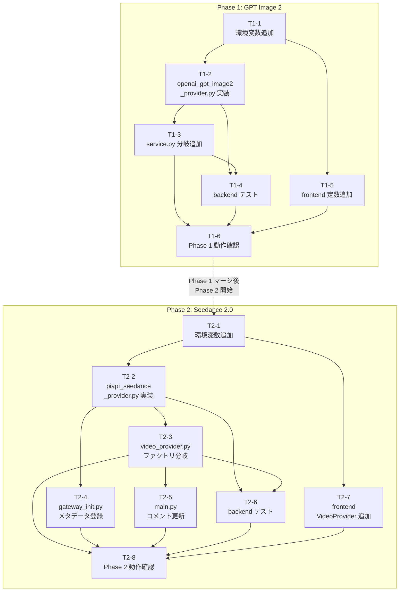

# タスクインデックス: GPT Image 2 & Seedance 2.0

**対象 Design Doc**: `docs/plans/2026-05-13_gpt-image-2-and-seedance-2.0.md`
**生成日**: 2026-05-13
**DB マイグレーション**: 不要 (Design Doc §8 で検証済み)

---

## タスク一覧

### Phase 1: GPT Image 2 (先行リリース)

| ID | ファイル | タイトル | 規模 | 依存 |
|----|----------|---------|------|------|
| T1-1 | `phase-1-gpt-image-2/T1-1_add_env_vars.md` | 環境変数追加 (GPT Image 2) | S | なし |
| T1-2 | `phase-1-gpt-image-2/T1-2_implement_openai_gpt_image2_provider.md` | openai_gpt_image2_provider.py 新規実装 | M | T1-1 |
| T1-3 | `phase-1-gpt-image-2/T1-3_add_service_branch.md` | service.py への openai_gpt_image2 分岐追加 | S | T1-2 |
| T1-4 | `phase-1-gpt-image-2/T1-4_backend_tests.md` | backend テスト追加 (GPT Image 2) | M | T1-2, T1-3 |
| T1-5 | `phase-1-gpt-image-2/T1-5_frontend_constants.md` | frontend 定数追加 (GPT Image 2) | S | T1-1 |
| T1-6 | `phase-1-gpt-image-2/T1-6_phase1_verification.md` | Phase 1 動作確認 | S | T1-3, T1-4, T1-5 |

### Phase 2: Seedance 2.0

| ID | ファイル | タイトル | 規模 | 依存 |
|----|----------|---------|------|------|
| T2-1 | `phase-2-seedance-2.0/T2-1_add_env_vars.md` | 環境変数追加 (Seedance 2.0) | S | なし |
| T2-2 | `phase-2-seedance-2.0/T2-2_implement_piapi_seedance_provider.md` | piapi_seedance_provider.py 新規実装 | M | T2-1 |
| T2-3 | `phase-2-seedance-2.0/T2-3_add_video_provider_factory_branch.md` | video_provider.py ファクトリに seedance 分岐追加 | S | T2-2 |
| T2-4 | `phase-2-seedance-2.0/T2-4_register_gateway_metadata.md` | gateway_init.py に Seedance メタデータ登録 | S | T2-2 |
| T2-5 | `phase-2-seedance-2.0/T2-5_update_main_py_comment.md` | main.py の video-provider 有効値コメント更新 | S | T2-3 |
| T2-6 | `phase-2-seedance-2.0/T2-6_backend_tests.md` | backend テスト追加 (Seedance 2.0) | M | T2-2, T2-3 |
| T2-7 | `phase-2-seedance-2.0/T2-7_frontend_video_provider.md` | frontend VideoProvider 型 + provider-support.ts への Seedance 追加 | S | T2-1 |
| T2-8 | `phase-2-seedance-2.0/T2-8_phase2_verification.md` | Phase 2 動作確認 | S | T2-3, T2-4, T2-5, T2-6, T2-7 |

---

## 依存グラフ

---

## 実行順序 (推奨)

### Phase 1

1. **T1-1** (環境変数) — 起点。即実行可能
2. **T1-2** (プロバイダー実装) — T1-1 完了後。メインの実装タスク
3. **T1-3** (service.py 分岐) と **T1-5** (frontend 定数) — T1-2 完了後、並行実行可能
4. **T1-4** (テスト) — T1-2 + T1-3 完了後 (TDD の場合は T1-2 前に RED で書く)
5. **T1-6** (動作確認) — T1-3, T1-4, T1-5 全て完了後

### Phase 2

Phase 1 マージ後に開始する。

1. **T2-1** (環境変数) — 起点
2. **T2-2** (プロバイダー実装) — T2-1 完了後。メインの実装タスク
3. **T2-3**, **T2-4**, **T2-7** — T2-2 完了後、並行実行可能
4. **T2-5** (コメント更新) — T2-3 完了後
5. **T2-6** (テスト) — T2-2 + T2-3 完了後 (TDD の場合は T2-2 前に RED で書く)
6. **T2-8** (動作確認) — T2-3〜T2-7 全て完了後

---

## スコープ外 (本タスク群で対応しない)

Design Doc §10 に記載の以下は本タスク群のスコープ外:

- Sora 2 残骸削除 (`docs/runway_anime_best_practices.md` 等)
- `ImageProviderInterface` 抽象化
- Seedance audio / video refs / extension
- Gateway 有効化 (`GATEWAY_ENABLED=true`)
- GPT Image 2 `/edits` エンドポイント (Phase 3+)

---

## Phase マージ条件サマリー

### Phase 1 マージ条件

- `pytest tests/videos/test_openai_gpt_image2_provider.py` 全テスト PASS
- `image_provider="openai_gpt_image2"` で画像が R2 に保存されることを手動確認
- モデレーション拒否・Org エラーが日本語メッセージで返ることを確認

### Phase 2 マージ条件

- `pytest tests/videos/test_piapi_seedance_provider.py` 全テスト PASS
- `VIDEO_PROVIDER=seedance` で動画タスクが作成されることを手動確認 (PiAPI ダッシュボード)
- `GATEWAY_ENABLED=false` 時に影響がないことを確認

### 両 Phase 共通

- `pytest` 既存テスト失敗なし (既知の 2 件は除く)
