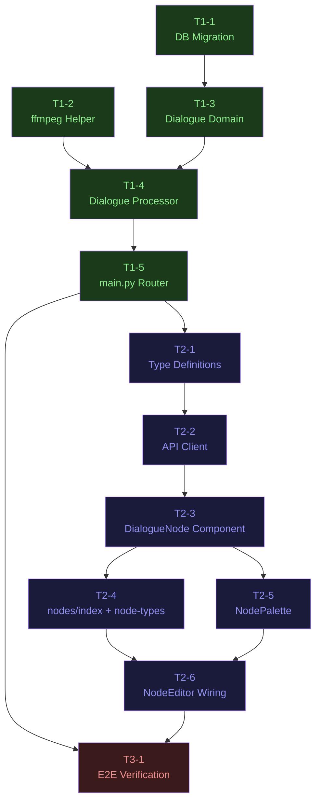

# タスク一覧: DialogueNode 実装

**元 Design Doc**: `docs/plans/2026-05-14_dialogue-node.md`
**生成日**: 2026-05-14
**フェーズ数**: 3 (BE → FE → E2E)

---

## タスク一覧

| ID | ファイル | タイトル | 規模 | 依存 |
|----|---------|---------|------|------|
| T1-1 | phase-1-backend/T1-1_db_migration.md | dialogue_generations DB マイグレーション SQL 作成 + Supabase 適用 | S | なし |
| T1-2 | phase-1-backend/T1-2_ffmpeg_helper.md | ffmpeg ヘルパー mix_audio_to_video + _has_audio_track 追加 + 単体テスト | M | なし |
| T1-3 | phase-1-backend/T1-3_dialogue_domain.md | app/dialogue/ ドメイン雛形 (schemas + service + router CRUD のみ) | M | T1-1 |
| T1-4 | phase-1-backend/T1-4_dialogue_processor.md | dialogue_processor.py 実装 (TTS 直列 await → ffmpeg → R2) + 単体テスト | L | T1-2, T1-3 |
| T1-5 | phase-1-backend/T1-5_main_router_registration.md | app/main.py に dialogue_router を登録 | S | T1-4 |
| T2-1 | phase-2-frontend/T2-1_type_definitions.md | lib/types/node-editor.ts に DialogueNodeData, HasVideoOutput, HANDLE_IDS, NodeType 追加 | S | T1-5 |
| T2-2 | phase-2-frontend/T2-2_api_client.md | lib/api/client.ts に ttsApi.listVoices(), dialogueApi.create(), getStatus() 追加 | S | T2-1 |
| T2-3 | phase-2-frontend/T2-3_dialogue_node_component.md | components/.../DialogueNode.tsx 新規実装 + React Testing Library テスト | L | T2-2 |
| T2-4 | phase-2-frontend/T2-4_nodes_export.md | nodes/index.ts と node-types.ts への export / 登録追加 | S | T2-3 |
| T2-5 | phase-2-frontend/T2-5_node_palette.md | NodePalette.tsx に Mic アイコン + パレットエントリ追加 | S | T2-3 |
| T2-6 | phase-2-frontend/T2-6_node_editor_wiring.md | NodeEditor.tsx に handleStartDialogue リスナー + ポーリングロジック追加 | M | T2-4, T2-5 |
| T3-1 | phase-3-e2e/T3-1_e2e_verification.md | E2E 手動確認 (実 API 課金あり) | S | T1-5, T2-6 |

---

## 依存グラフ



---

## 推奨実行順序

### Phase 1 — バックエンド

T1-1 と T1-2 は依存関係がなく**並行実行可能**:

```
[並行]
  T1-1  DB マイグレーション → Supabase 適用
  T1-2  ffmpeg ヘルパー実装 + テスト

    ↓ (両方完了後)
  T1-3  dialogue/ ドメイン雛形 (schemas + service + router CRUD)
    ↓
  T1-4  dialogue_processor.py 実装 + テスト
    ↓
  T1-5  main.py router 登録
```

### Phase 2 — フロントエンド (Phase 1 完了後)

T2-4 と T2-5 は**並行実行可能**:

```
  T2-1  型定義 (node-editor.ts)
    ↓
  T2-2  API クライアント (client.ts)
    ↓
  T2-3  DialogueNode コンポーネント実装 + テスト

    ↓ [並行]
  T2-4  nodes/index.ts + node-types.ts 登録
  T2-5  NodePalette.tsx エントリ追加

    ↓ (両方完了後)
  T2-6  NodeEditor.tsx リスナー + ポーリング
```

### Phase 3 — E2E (Phase 1 + 2 完了後)

```
  T3-1  手動 E2E 確認 (課金あり — ユーザー承認必須)
```

---

## Phase マージ条件

### Phase 1 マージ条件

以下を全て満たしてから Phase 2 に着手する:

- [ ] `pytest movie-maker-api/tests/dialogue/ -v` が全件 pass
- [ ] `POST /api/v1/dialogue` が `status: "pending"` を返す
- [ ] `GET /api/v1/dialogue/{id}/status` がステータスを返す
- [ ] `app/main.py` に dialogue_router が登録されている
- [ ] Supabase に `dialogue_generations` テーブルが存在する

### Phase 2 マージ条件

以下を全て満たしてから Phase 3 に着手する:

- [ ] `npm run build` がエラーなし
- [ ] `npm test -- --watchAll=false` が全件 pass (既存テストも含む)
- [ ] `npx tsc --noEmit` がエラーなし
- [ ] ローカルで DialogueNode がパレットから配置でき、接続できる

### Phase 3 完了条件

- [ ] E2E 手動確認 (T3-1 の全 AC) が確認済み
- [ ] R2 上の合成動画 URL が再生可能
- [ ] TTS 音声が元動画にミックスされている

---

## スコープ外

以下は **今回実装しない** (Design Doc §2, §14):

- Hedra リップシンク統合 (セリフと口の動きの同期)
- 複数セリフ (1 ノード = 1 セリフ固定)
- 音声タイミング指定 (常に先頭から再生)
- BGM との音量バランス自動調整
- 多言語対応 (`language: "ja"` 固定)
- セリフのトリミング・編集 UI
