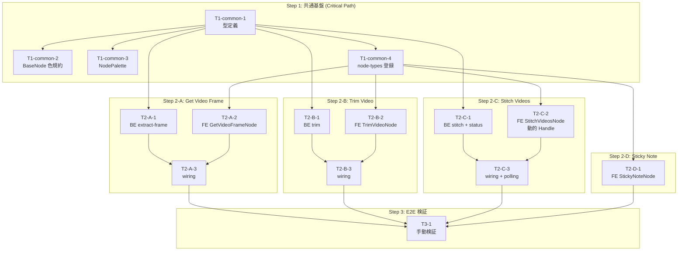

# Utility Nodes MVP - タスク分解インデックス

**ソース Design Doc**: `docs/plans/2026-05-14_utility-nodes-mvp.md`
**作成日**: 2026-05-14
**スプリント期間**: 1 週間 (Design Doc §12 に基づく単一スプリント並列実装)

---

## 1. 全体方針

4 つの Utility ノード (Get Video Frame, Trim Video, Stitch Videos, Sticky Note) を **1 スプリントで並列実装**する。

- **Step 1**: 共通基盤 (型定義、色規約、パレット、ノード登録) を**先行投入**。これが全 Step 2 タスクをブロック解除する critical path。
- **Step 2**: Step 1 完了後、4 ノードを **BE 1 名 + FE 4 名で並列実装**。各ノードは独立 PR で順次マージ可能。
- **Step 3**: 全 Step 2 マージ後の E2E 手動検証 (実 API 課金あり)。

詳細は Design Doc §12 (段階リリース計画) と §13 (チーム構成と並列化戦略) を参照。

---

## 2. タスク一覧

### Step 1: 共通基盤 (Common Infrastructure)

| ID | ファイル | タイトル | 規模 | 担当 | 依存 |
|----|----------|---------|------|------|-----|
| T1-common-1 | `step-1-common-infra/T1-common-1_type_definitions.md` | `lib/types/node-editor.ts` への型・HasImageOutput・category・HANDLE_IDS・createDefaultNodeData 追加 | M | FE | — |
| T1-common-2 | `step-1-common-infra/T1-common-2_basenode_handle_color.md` | `BaseNode.tsx` に Krea 流ハンドル色規約ヘルパー追加 | S | FE | T1-common-1 |
| T1-common-3 | `step-1-common-infra/T1-common-3_node_palette.md` | `NodePalette.tsx` に utility カテゴリ + 4 ノードエントリ + アイコン追加 | S | FE | T1-common-1 |
| T1-common-4 | `step-1-common-infra/T1-common-4_node_types_registration.md` | `utils/node-types.ts` に 4 ノードを登録 (stub コンポーネント import OK) | S | FE | T1-common-1 |

### Step 2-A: Get Video Frame (動画→画像)

| ID | ファイル | タイトル | 規模 | 担当 | 依存 |
|----|----------|---------|------|------|-----|
| T2-A-1 | `step-2-node-a-get-video-frame/T2-A-1_be_extract_frame_api.md` | BE `POST /api/v1/videos/extract-frame` 同期エンドポイント + 単体テスト | M | BE | T1-common-1 |
| T2-A-2 | `step-2-node-a-get-video-frame/T2-A-2_fe_get_video_frame_node.md` | FE `GetVideoFrameNode.tsx` 新規 + 単体テスト | M | FE | T1-common-1〜4 |
| T2-A-3 | `step-2-node-a-get-video-frame/T2-A-3_wiring_node_editor.md` | `NodeEditor.tsx` への `handleStartGetVideoFrame` + `utilityApi.extractFrame()` 追加 | S | FE | T2-A-1, T2-A-2 |

### Step 2-B: Trim Video (動画→動画)

| ID | ファイル | タイトル | 規模 | 担当 | 依存 |
|----|----------|---------|------|------|-----|
| T2-B-1 | `step-2-node-b-trim-video/T2-B-1_be_trim_video_api.md` | BE `POST /api/v1/videos/trim` 同期エンドポイント + 単体テスト | M | BE | T1-common-1 |
| T2-B-2 | `step-2-node-b-trim-video/T2-B-2_fe_trim_video_node.md` | FE `TrimVideoNode.tsx` 新規 + 単体テスト | M | FE | T1-common-1〜4 |
| T2-B-3 | `step-2-node-b-trim-video/T2-B-3_wiring_node_editor.md` | `NodeEditor.tsx` への `handleStartTrimVideo` + `utilityApi.trimVideo()` 追加 | S | FE | T2-B-1, T2-B-2 |

### Step 2-C: Stitch Videos (動画×1〜5→動画)

| ID | ファイル | タイトル | 規模 | 担当 | 依存 |
|----|----------|---------|------|------|-----|
| T2-C-1 | `step-2-node-c-stitch-videos/T2-C-1_be_stitch_api.md` | BE `POST /stitch` + `GET /stitch/{id}` 非同期エンドポイント (既存 `video_concat_processor` 流用) + 単体テスト | M | BE | T1-common-1 |
| T2-C-2 | `step-2-node-c-stitch-videos/T2-C-2_fe_stitch_videos_node.md` | FE `StitchVideosNode.tsx` 新規 (**動的 Handle + useUpdateNodeInternals 必須**) + 単体テスト 4 ケース最低 | M | FE | T1-common-1〜4 |
| T2-C-3 | `step-2-node-c-stitch-videos/T2-C-3_wiring_node_editor_polling.md` | `NodeEditor.tsx` への `handleStartStitchVideos` + ポーリング (5s × 120 回) + `utilityApi.stitchVideos()` / `getStitchStatus()` 追加 | M | FE | T2-C-1, T2-C-2 |

### Step 2-D: Sticky Note (FE のみ)

| ID | ファイル | タイトル | 規模 | 担当 | 依存 |
|----|----------|---------|------|------|-----|
| T2-D-1 | `step-2-node-d-sticky-note/T2-D-1_fe_sticky_note_node.md` | FE `StickyNoteNode.tsx` 新規 + 単体テスト (BE 不要、wiring 不要) | S | FE | T1-common-1〜4 |

### Step 3: E2E 手動検証

| ID | ファイル | タイトル | 規模 | 担当 | 依存 |
|----|----------|---------|------|------|-----|
| T3-1 | `step-3-verification/T3-1_e2e_manual_verification.md` | 4 ノードすべて UI から動作確認 (実 API 課金あり) | S | verifier | 全 Step 2 タスク完了 |

---

## 3. 依存関係グラフ



---

## 4. 推奨実行順序と並列化戦略

### Phase 1: Step 1 を完全完了させる (Critical Path, 直列推奨)

```
T1-common-1 (型定義) → 完了 →
T1-common-2 / T1-common-3 / T1-common-4 (3 並列可) → 全完了 → Step 2 解放
```

**注意**: T1-common-1 (`node-editor.ts`) が完了するまで他の Step 1 タスクは型エラーで停滞するため、まず T1-common-1 を最優先で完了させる。

### Phase 2: Step 2 を 4 並列で起動

- **BE 担当 (1 名)**: T2-A-1 → T2-B-1 → T2-C-1 を直列で実装 (同一 `router.py` 編集のため衝突回避)
- **FE 担当 (4 名)**: T2-A-2, T2-B-2, T2-C-2, T2-D-1 を完全並列で実装 (それぞれ新規ファイル、衝突なし)

### Phase 3: 各ノードの wiring (BE と FE の完了次第)

- T2-A-3, T2-B-3, T2-C-3 はすべて `NodeEditor.tsx` を編集するため**順次マージが必要** (競合リスクファイル、§5 参照)。
- T2-D-1 は wiring 不要 (FE のみで完結)。

### Phase 4: T3-1 (E2E 手動検証)

全 Step 2 タスクのマージ後に実施。

---

## 5. 競合リスクファイル (警告)

以下のファイルは Step 2 の複数タスクで編集対象となるため、**Step 1 で先に登録だけ済ませる方針**を採用し、Step 2 では当該ファイルでの**追記のみ**に留める。

| ファイル | Step 1 で済ませる作業 | Step 2 でやること | 競合回避策 |
|---------|---------------------|------------------|-----------|
| `lib/types/node-editor.ts` | 4 ノードの型・HANDLE_IDS・createDefaultNodeData をすべて先行追加 (T1-common-1) | 編集不要 | Step 1 で完了済み |
| `components/node-editor/utils/node-types.ts` | 4 ノードコンポーネントを先行 import + 登録 (T1-common-4 で stub import 許可) | 編集不要 (Step 1 の registration がそのまま使われる) | Step 1 で完了済み |
| `components/node-editor/NodePalette.tsx` | 4 ノードのエントリ + 'utility' カテゴリ + 4 アイコン追加 (T1-common-3) | 編集不要 | Step 1 で完了済み |
| `components/node-editor/NodeEditor.tsx` | 編集なし (Step 1 範囲外) | T2-A-3, T2-B-3, T2-C-3 で handler 追加 | **wiring タスクを順次マージ** (3 並列マージ禁止) |
| `lib/api/client.ts` | 編集なし | T2-A-3, T2-B-3, T2-C-3 で `utilityApi` の各メソッド追加 | wiring タスクを順次マージ (上と同じ) |
| `movie-maker-api/app/videos/router.py` | 編集なし | T2-A-1, T2-B-1, T2-C-1 で endpoint 追加 | BE は 1 名担当なので順次実装 |
| `movie-maker-api/app/videos/schemas.py` | 編集なし | T2-A-1, T2-B-1, T2-C-1 で Pydantic schema 追加 | BE は 1 名担当なので順次実装 |

**並列化の原則**: 「同じ commit を競合しない 4 ノードの FE は同時に起動可能」。各 FE 担当は新規ファイル (`GetVideoFrameNode.tsx`, `TrimVideoNode.tsx`, `StitchVideosNode.tsx`, `StickyNoteNode.tsx`) のみを編集する範囲では完全並列実行可能。

---

## 6. Phase マージ条件

各ノードは以下の状態でマージ可能:

- [ ] 該当ノードの **BE タスクが完了** (該当する場合): API テスト green
- [ ] 該当ノードの **FE タスクが完了**: 単体テスト green、TS strict 通過
- [ ] 該当ノードの **wiring タスクが完了** (該当する場合): NodeEditor 経由でノードが動作
- [ ] **lint 通過**: `pnpm lint` (FE) / `ruff check` (BE) が clean
- [ ] **既存テストが壊れていない**: 各タスクの完了条件 (AC) を参照

Sticky Note (T2-D-1) は BE / wiring がないため、T2-D-1 単独で完了。

---

## 7. スコープ外 (明示 OUT)

Design Doc §14 に記載。本タスク群では実装しない:

- Trim Audio (DialogueNode 主体で需要少)
- Image Mask Editor (inpaint 未対応で消費先なし)
- Stitch のクロスフェード / トランジション (Phase 2)
- Get Video Frame の中間時刻指定 (現状 first/last のみ)
- Trim の動画長プレビュー / 波形 UI (Phase 2 で動画メタデータ API 追加後)
- **既存ノードへのハンドル色規約遡及適用** (別 Design Doc で計画)
- Krea の残りノード (Blur, Compositor, Hue/Sat, etc.)
- Stitch の "Quick preview" UI

---

## 8. 重要事項 (B1/B2/B3/N1/N4 修正の反映)

Design Doc レビューで指摘された blocker / nit 修正が以下のタスクに反映済み:

| 修正 ID | 内容 | 反映タスク |
|---------|------|------------|
| **B1** | `useUpdateNodeInternals` フック必須 (Handle 数変化時) | T2-C-2 の AC に明記 |
| **B2** | `NodePaletteItem.category` union に `'utility'` 追加 | T1-common-1 の AC に明記 |
| **B3** | `HasImageOutput` interface + `getNodeImageOutput()` helper 新設 | T1-common-1 の AC に明記 |
| **N1** | `HailuoEndFrameNode` 参考誤りを修正 (実際の参考: `_extract_and_upload_last_frame()` + `DialogueNode` + `BGMNode`) | T2-A-2 の参照に明記 |
| **N4** | Phase 分割せず 1 スプリント並列実装 | 本 README + 全タスク構造で反映 |

---

## 9. 参照

- Design Doc: `/Users/noritakasawada/AI_P/practice/movie-project/docs/plans/2026-05-14_utility-nodes-mvp.md`
- Krea ハンドル色仕様: `docs/flow.md` §1.2
- 既存パターン参考:
  - Pipeline 型: `movie-maker/components/node-editor/nodes/DialogueNode.tsx`
  - Source 型: `movie-maker/components/node-editor/nodes/BGMNode.tsx`
  - 動画→画像処理: `movie-maker-api/app/tasks/storyboard_processor.py` L176-215 (`_extract_and_upload_last_frame()`)
  - 非同期 concat 処理: `movie-maker-api/app/tasks/video_concat_processor.py`
- xyflow 公式: https://reactflow.dev/api-reference/hooks/use-update-node-internals
