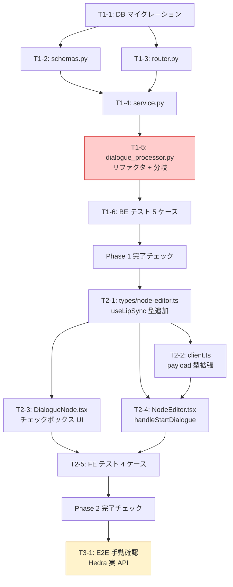

# タスク一覧: DialogueNode リップシンク拡張

**元 Design Doc**: `docs/plans/2026-05-15_dialogue-lip-sync.md`
**Overview**: `_overview-2026-05-15_dialogue-lip-sync.md`
**作成日**: 2026-05-15

---

## タスク全体表

| ID | ファイル | タイトル | 規模 | 依存 |
|----|---------|---------|------|------|
| T1-1 | `phase-1-backend/T1-1_db_migration.md` | DB マイグレーション作成 + Supabase 適用 | S | なし |
| T1-2 | `phase-1-backend/T1-2_schemas_use_lip_sync.md` | schemas.py に use_lip_sync 追加 | S | T1-1 |
| T1-3 | `phase-1-backend/T1-3_router_use_lip_sync.md` | router.py で use_lip_sync を service に渡す | S | T1-1, T1-2 |
| T1-4 | `phase-1-backend/T1-4_service_use_lip_sync.md` | service.py create/update シグネチャ拡張 | S | T1-2, T1-3 |
| T1-5 | `phase-1-backend/T1-5_processor_refactor_and_branch.md` | dialogue_processor.py リファクタ + 分岐ロジック | L | T1-4 |
| T1-6 | `phase-1-backend/T1-6_be_unit_tests.md` | BE 単体テスト 5 ケース | M | T1-5 |
| — | `phase-1-backend/phase1-completion.md` | Phase 1 完了チェック | S | T1-6 |
| T2-1 | `phase-2-frontend/T2-1_types_use_lip_sync.md` | node-editor.ts に useLipSync 型追加 | S | T1-6 |
| T2-2 | `phase-2-frontend/T2-2_api_client_use_lip_sync.md` | client.ts payload 型拡張 | S | T2-1 |
| T2-3 | `phase-2-frontend/T2-3_dialogue_node_ui.md` | DialogueNode.tsx チェックボックス UI | M | T2-1 |
| T2-4 | `phase-2-frontend/T2-4_node_editor_start_dialogue.md` | NodeEditor.tsx handleStartDialogue 拡張 | S | T2-1, T2-2 |
| T2-5 | `phase-2-frontend/T2-5_fe_unit_tests.md` | FE 単体テスト 4 ケース | M | T2-3, T2-4 |
| — | `phase-2-frontend/phase2-completion.md` | Phase 2 完了チェック | S | T2-5 |
| T3-1 | `phase-3-e2e/T3-1_e2e_manual_verification.md` | E2E 手動確認 (Hedra 実 API 課金あり) | M | T2-5 |

---

## Mermaid 依存グラフ



(T1-5 は最重要実装タスク / T3-1 は課金注意)

---

## 推奨実行順序

### Phase 1 — バックエンド (順次)

1. **T1-1** — DB マイグレーション (Supabase 適用まで完了)
2. **T1-2 + T1-3** — schemas / router (並行可能、T1-4 待ち)
3. **T1-4** — service シグネチャ拡張
4. **T1-5** — `dialogue_processor.py` リファクタ + 分岐 (**最重要、Lサイズ**)
5. **T1-6** — BE テスト 5 ケース
6. **Phase 1 完了チェック**

### Phase 2 — フロントエンド (Phase 1 完了後)

7. **T2-1** — 型定義拡張 (後続の FE タスク全ての前提)
8. **T2-2 + T2-3 + T2-4** — 並行可能
9. **T2-5** — FE テスト 4 ケース
10. **Phase 2 完了チェック**

### Phase 3 — E2E (Phase 1+2 完了後、課金承認後)

11. **T3-1** — E2E 手動確認 (Hedra 実 API $0.10-0.20)

---

## 重要制約 (実装者必読)

### B1: errorMessage 再宣言禁止

`DialogueNodeData` で `errorMessage` フィールドを再宣言しない。`BaseNodeData` から継承される `string | undefined` をそのまま使う。`createDefaultNodeData` でも `errorMessage: null` をセットしない。

**確認コマンド**:
```bash
grep -n 'errorMessage' /Users/noritakasawada/AI_P/practice/movie-project/movie-maker/lib/types/node-editor.ts
# DialogueNodeData のブロック内に出現しないこと
```

### N1: lipSyncGenerationId はフロントに露出しない (YAGNI)

`DialogueNodeData` に `lipSyncGenerationId` フィールドを追加しない。バックエンドのデバッグ用 FK として `dialogue_generations.lip_sync_generation_id` は保持するが、フロントには露出しない。

**確認コマンド**:
```bash
grep -rn 'lipSyncGenerationId' /Users/noritakasawada/AI_P/practice/movie-project/movie-maker/lib/
# 出力が空であること
```

### B3: process_lip_sync_generation は直 await

`_run_lip_sync_and_get_video_url` 内で `asyncio.create_task` を使わない。`await process_lip_sync_generation(lip_sync_id)` として直列実行する。

**確認コマンド**:
```bash
grep -n 'create_task' /Users/noritakasawada/AI_P/practice/movie-project/movie-maker-api/app/tasks/dialogue_processor.py
# 出力が空であること
```

### status 同期の注意点

`process_lip_sync_generation` は内部で例外を握り潰して DB に `failed` を書くだけで raise しない。そのため `await` 後に必ず `get_lip_sync_status` を呼んで DB から status を再 fetch して判定する必要がある (Design Doc §7-2)。

---

## スコープ外

以下は今回実装しない (Design Doc §11):

- 他リップシンクプロバイダー (Wav2Lip、SadTalker 等)
- `source_type='image'` (画像入力対応)
- リップシンク品質設定 (Hedra モデル選択)
- 多言語対応
- 専用 LipSyncNode UI (既存 `POST /api/v1/lip-sync` の UI 統合)
- 進捗バー段階別表示 (TTS / Hedra 分割)
- 動画長の FE 事前バリデーション
