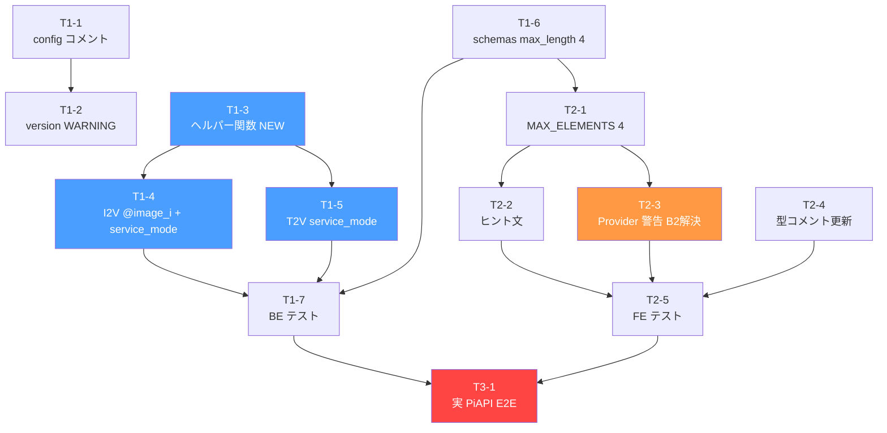

# タスクマスターインデックス: Kling Elements 3.0 Omni 完全有効化

## 全タスク一覧

| ID | フェーズ | タイトル | 規模 | 依存 | ファイル |
|----|---------|---------|------|------|---------|
| T1-1 | Phase 1 BE | config.py バージョンコメント更新 | S | なし | `core/config.py` |
| T1-2 | Phase 1 BE | __init__ version バリデーション WARNING | S | T1-1 | `piapi_kling_provider.py` |
| T1-3 | Phase 1 BE | `_inject_image_references_into_prompt` ヘルパー新規追加 | S | なし | `piapi_kling_provider.py` |
| T1-4 | Phase 1 BE | I2V 3.0 Omni 経路: @image_i 付加 + service_mode | S | T1-3 | `piapi_kling_provider.py` |
| T1-5 | Phase 1 BE | T2V 3.0 Omni 経路: service_mode 追加 | S | T1-3 | `piapi_kling_provider.py` |
| T1-6 | Phase 1 BE | schemas.py element_images max_length 3→4 | S | なし | `videos/schemas.py` |
| T1-7 | Phase 1 BE | BE 単体テスト (helper 5件 + I2V + T2V) | M | T1-3, T1-4, T1-5, T1-6 | `tests/external/test_piapi_kling_provider.py` |
| T2-1 | Phase 2 FE | MAX_ELEMENTS 4 + grid-cols-4 + min-w 拡大 | S | T1-6 | `KlingElementsNode.tsx` |
| T2-2 | Phase 2 FE | @image_1 ヒント文追加 | S | T2-1 | `KlingElementsNode.tsx` |
| T2-3 | Phase 2 FE | Provider 警告 useNodes 全スキャン (B2 解決) | M | T2-1 | `KlingElementsNode.tsx` |
| T2-4 | Phase 2 FE | node-editor.ts コメント更新 (3→4) | S | なし | `node-editor.ts` |
| T2-5 | Phase 2 FE | FE 単体テスト (4 ケース) | M | T2-1, T2-2, T2-3, T2-4 | `KlingElementsNode.test.tsx` |
| T3-1 | Phase 3 E2E | 実 PiAPI API 検証 ($0.50-1.00 課金あり) | M | T1-7, T2-5 | なし (手動検証) |

> 規模: S = ~15分, M = ~30-45分

---

## Mermaid 依存グラフ



**凡例**:
- 青: 主要ロジック変更 (新規ヘルパー + I2V/T2V 経路修正)
- 橙: B2 解決 (useNodes 全ノードスキャン — 要注意)
- 赤: 課金発生 (実行前にユーザー承認必要)

---

## 推奨実行順序

### ストリーム A (BE — 直列):
```
T1-1 → T1-2       (config 変更: コメント → validation)
T1-3               (ヘルパー: T1-4/T1-5 の独立前提)
```

### ストリーム B (BE — T1-3 完了後、並行可):
```
T1-4 ┐
     ├→ T1-7 → T3-1 (フェーズ完了)
T1-5 ┘
T1-6 ┘  (T1-6 は独立、T1-7 が揃ったら実行)
```

### ストリーム C (FE — T1-6 完了後):
```
T2-1 → T2-2 ┐
             ├→ T2-5 → T3-1 (フェーズ完了)
T2-1 → T2-3 ┘
T2-4 ┘ (独立、いつでも可)
```

**最短パス**: T1-6 → T2-1 → T2-3 → T2-5 (FE の重要チェーン)  
**BE の重要パス**: T1-3 → T1-4 → T1-7 (ヘルパー → I2V 修正 → テスト)

---

## スコープ外 (今回実装しない)

| ID | 内容 | 理由 |
|----|------|------|
| - | Kling 1.6 ダウングレード経路 | 永久対象外 (バージョンポリシー §8-2) |
| - | 2.6 以前 `using_elements=False` 解除 | 永久対象外 (同上) |
| FU-1 | Virtual Try-On (`ai_try_on`) | 別エンドポイント、別 Design Doc |
| FU-2 | 動画 reference (`reference_video`) | 今回は画像 reference のみ |
| FU-3 | 音声生成 (`enable_audio: true`) | BGMNode / DialogueNode で代替可 |
| FU-4 | multi_prompt (6 shots) | 高度機能 |
| FU-5 | storyboard_processor Elements 連携 | 未検証、別 Follow-up |
| FU-6 | 動画 reference 併用時の画像上限 4 枚 | 今回は画像のみ |
| FU-7 | UI 上限 4→7 (公式仕様の理論値) | 視認性検証が必要 |
| FU-8 | Kling 3.x 新版対応 | PiAPI リリース待ち |

---

## バージョンポリシー (Design Doc §8-2)

| バージョン | ポリシー |
|----------|---------|
| **3.0** | デフォルト・推奨 (現在) |
| **3.0 Omni** | 推奨 (3.0 上位互換) |
| **3.1 / 3.x (将来)** | リリース次第アップグレード |
| **2.6 / 2.5 / 2.0** | **禁止** (production 使用不可) |
| **1.6** | **禁止** (今後サポートしない) |

`PIAPI_KLING_VERSION` が `"3."` 未満の場合、`PiAPIKlingProvider.__init__` (T1-2 で追加) で WARNING ログが出力される。

---

## 変更ファイルサマリー

```
movie-maker-api/
  app/core/config.py                         # T1-1: コメント追加 (3行)
  app/external/piapi_kling_provider.py       # T1-2/T1-3/T1-4/T1-5: ロジック追加
  app/videos/schemas.py                      # T1-6: max_length 3→4 (3箇所)
  tests/external/test_piapi_kling_provider.py # T1-7: 新規テスト (7ケース)

movie-maker/
  components/node-editor/nodes/KlingElementsNode.tsx  # T2-1/T2-2/T2-3: UI変更
  lib/types/node-editor.ts                   # T2-4: コメント更新
  components/node-editor/nodes/KlingElementsNode.test.tsx  # T2-5: 新規テスト (4ケース)
```

**新規ファイル**: `test_piapi_kling_provider.py` (新規 or 拡張)、`KlingElementsNode.test.tsx` (新規)  
**DBマイグレーション**: 不要  
**新規環境変数**: なし
