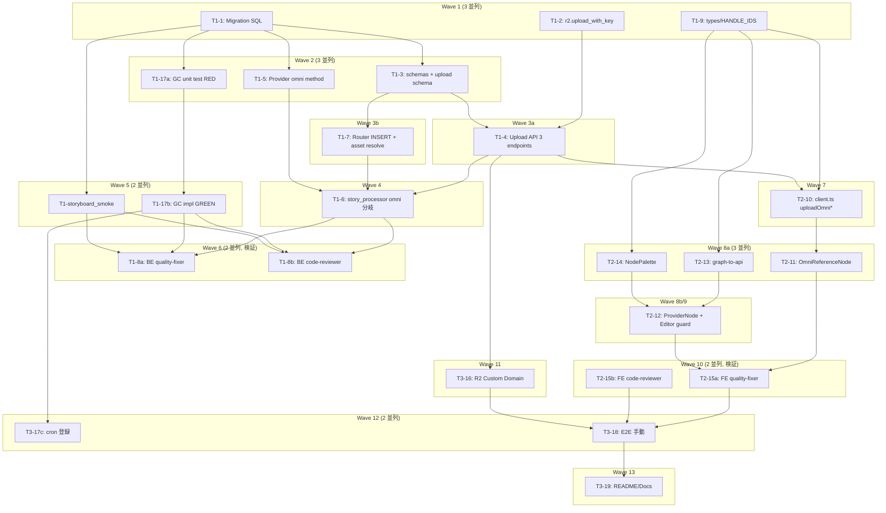
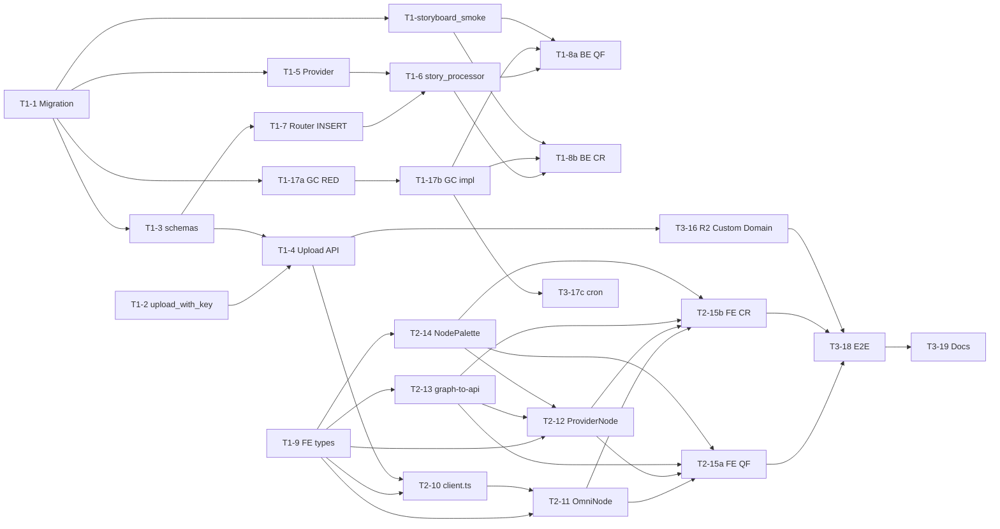

# Seedance 2.0 omni_reference 対応 — タスク分解 (v3 / Wave 構造)

**作成日**: 2026-05-18
**v3 計画書**: [`docs/plans/2026-05-18_seedance-omni-reference-v3.md`](../../2026-05-18_seedance-omni-reference-v3.md)
**前バージョン**: v1 / v2 (致命的指摘を全反映)
**総タスク数**: **22**
**想定総工数**: **15-19h** (Phase1 ~7.5h / Phase2 ~4h / Phase3 ~3.5h + バッファ 1h)

## 概要

PiAPI Seedance 2.0 の omni_reference (image/video/audio 参照 mix) 対応を、レビュー反映後の Wave 構造に従って 22 タスクに分解。1 タスク = 1 コミット粒度、Wave 内は並列実行可能。

主要セキュリティ事項 (v3):
- RLS は SELECT only、INSERT/UPDATE/DELETE policy 不作成 (= service-role 経由のみ)
- CHECK 制約 `r2_key LIKE 'omni-references/%'` で外部 URL 注入完全遮断
- `r2.upload_with_key()` 新規追加で二重 prefix bug 回避
- audio_urls 合計 ≤15s (PiAPI 公式)、image_urls base+ref 合算 ≤9 厳守

## Wave 構造図



## 依存関係グラフ (詳細)



## タスク一覧表

| ID | Phase | Wave | Title | depends_on | parallel_with | Agent | Effort |
|----|-------|------|-------|------------|---------------|-------|--------|
| T1-1 | 1 | 1 | Migration SQL + Supabase 適用 | [] | T1-2, T1-9 | backend | S |
| T1-2 | 1 | 1 | r2.upload_with_key() 新規追加 | [] | T1-1, T1-9 | backend | S |
| T1-9 | 1 | 1 | types/node-editor.ts + HANDLE_IDS 拡張 | [] | T1-1, T1-2 | frontend | S |
| T1-3 | 1 | 2 | schemas.py 拡張 + upload schema 全所有 | [T1-1] | T1-5, T1-17a | backend | M |
| T1-5 | 1 | 2 | PiAPISeedanceProvider omni method + tests | [T1-1] | T1-3, T1-17a | backend | M |
| T1-17a | 1 | 2 | GC unit テスト先行作成 (RED) | [T1-1] | T1-3, T1-5 | backend | S |
| T1-4 | 1 | 3 | Upload API 3 endpoints 実装 | [T1-3, T1-2] | T1-7 | backend | L |
| T1-7 | 1 | 3 | Router INSERT + asset 解決 | [T1-3] | T1-4 | backend | M |
| T1-6 | 1 | 4 | story_processor omni 分岐 | [T1-7, T1-5] | - | backend | M |
| T1-17b | 1 | 5 | GC バッチ実装 (GREEN) | [T1-17a] | T1-storyboard_smoke | backend | S |
| T1-storyboard_smoke | 1 | 5 | storyboard 新カラム NULL 回帰テスト | [T1-1] | T1-17b | backend | S |
| T1-8a | 1 | 6 | Backend quality-fixer | [T1-6, T1-17b, T1-storyboard_smoke] | T1-8b | ops | S |
| T1-8b | 1 | 6 | Backend code-reviewer | [T1-6, T1-17b, T1-storyboard_smoke] | T1-8a | ops | S |
| T2-10 | 2 | 7 | client.ts uploadOmni*Reference + 型拡張 | [T1-9, T1-4] | - | frontend | M |
| T2-11 | 2 | 8 | OmniReferenceNode + nodeTypes 登録 + tests | [T1-9, T2-10] | T2-13, T2-14 | frontend | L |
| T2-13 | 2 | 8 | graph-to-api.ts 拡張 + tests | [T1-9] | T2-11, T2-14 | frontend | M |
| T2-14 | 2 | 8 | NodePalette + useNodesAvailability | [T1-9] | T2-11, T2-13 | frontend | S |
| T2-12 | 2 | 9 | ProviderNode handle + Editor guard + validation | [T1-9, T2-13, T2-14] | - | frontend | M |
| T2-15a | 2 | 10 | Frontend quality-fixer | [T2-11, T2-12, T2-13, T2-14] | T2-15b | ops | S |
| T2-15b | 2 | 10 | Frontend code-reviewer | [T2-11, T2-12, T2-13, T2-14] | T2-15a | ops | S |
| T3-16 | 3 | 11 | R2 Custom Domain 設定 + 検証 | [T1-4] | - | ops | M |
| T3-17c | 3 | 12 | cron 登録 (scheduled jobs) | [T1-17b] | T3-18 | ops | S |
| T3-18 | 3 | 12 | E2E 手動検証 | [T2-15a, T2-15b, T3-16] | T3-17c | mixed | M |
| T3-19 | 3 | 13 | README/Docs 追記 | [T3-18] | - | mixed | S |

## 並列実行のガイド (最大 3 並列)

各 Wave 内のタスクは並列着手可能。Wave 間はバリア (前 Wave 全完了が次 Wave 着手の前提)。

### 並列起動コマンド例

```bash
# Wave 1: 3 並列 (Migration / r2.py / FE 型)
task-executor T1-1 &
task-executor T1-2 &
task-executor T1-9 &
wait

# Wave 2: 3 並列 (schemas / Provider / GC RED)
task-executor T1-3 &
task-executor T1-5 &
task-executor T1-17a &
wait

# Wave 3a / 3b: Upload API と Router INSERT を 2 並列
task-executor T1-4 &
task-executor T1-7 &
wait

# Wave 4: story_processor (依存収束)
task-executor T1-6

# Wave 5: GC GREEN + storyboard smoke
task-executor T1-17b &
task-executor T1-storyboard_smoke &
wait

# Wave 6: Backend 検証
quality-fixer T1-8a &
code-reviewer T1-8b &
wait

# Wave 7: client.ts (Frontend 着手の起点)
task-executor T2-10

# Wave 8: 3 並列 (Node / graph-to-api / Palette)
task-executor T2-11 &
task-executor T2-13 &
task-executor T2-14 &
wait

# Wave 9: Editor guard
task-executor T2-12

# Wave 10: Frontend 検証
quality-fixer T2-15a &
code-reviewer T2-15b &
wait

# Wave 11: R2 Custom Domain (ops)
task-executor T3-16

# Wave 12: cron + E2E
task-executor T3-17c &
task-executor T3-18 &
wait

# Wave 13: Docs
task-executor T3-19
```

## 実行順序の絶対制約

| 制約 | 説明 |
|------|------|
| **T1-1 は最初** | Migration は全 backend タスクの起点。Wave 1 で最初に実施 (T1-2 / T1-9 と並列可)。 |
| **Wave 6 完了まで Wave 7 着手禁止** | Backend が quality-fixer / code-reviewer を通過するまで Frontend は着手しない (H-4 解消: T2-10 から契約固定) |
| **T3-18 (E2E) は Backend + Frontend + R2 全完了後** | E2E は本物の R2 Custom Domain + 両端の実装完了が前提 |
| **T1-17a (RED) → T1-17b (GREEN)** | GC バッチは TDD で書く (テスト先行必須) |
| **T2-10 が Wave 7 単独** | mock contract 固定のため (H-4)、T2-10 完了後に T2-11/T2-13/T2-14 を並列着手 |

## 参考

- v3 計画書: `docs/plans/2026-05-18_seedance-omni-reference-v3.md`
- 類似タスク fmt 参考: `docs/plans/tasks/2026-05-13_gpt-image-2-and-seedance-2.0/phase-2-seedance-2.0/T2-1_add_env_vars.md`
- 実装アプローチ: 垂直スライス + TDD (Red→Green→Refactor)
