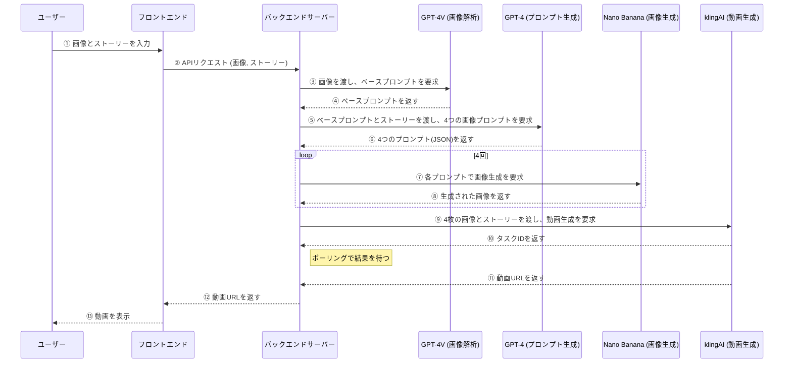

# AI主導ストーリーテリング機能：設計・実装ガイド

## 1. コンセプト：究極のユーザー体験

ユーザーが **「最初の1枚の画像」** と **「簡単なストーリー（例：猫がテーブルに飛び乗る）」** を入力するだけで、AIがすべてを自動処理し、高品質な動画を生成する、という革新的なワークフローを設計します。

このアプローチにより、ユーザーはklingAIの複雑な仕様（時間軸、複数画像など）を一切意識することなく、直感的な操作だけで意図した通りの動画を手に入れることができます。

### ユーザーフロー

1.  **ユーザー入力:**
    -   基準となる **画像1枚** をアップロード。
    -   実現したい **ストーリーを簡単な文章で入力** する。

2.  **AIによる自動処理（バックエンド）:**
    -   **ステップA (画像解析):** AIが基準画像を分析し、キャラクター、背景、画風などの特徴を抽出する。
    -   **ステップB (ストーリーボード生成):** AIがストーリーを4つの重要な「フレーム」に分解し、それぞれの場面を描写するプロンプトを自動生成する。
    -   **ステップC (画像生成):** 画像生成AI（Nano Banana等）が、生成された4つのプロンプトを基に、時間軸に沿った4枚の連続画像を生成する。
    -   **ステップD (動画生成):** 生成された4枚の画像をklingAIに渡し、最終的な動画を生成する。

3.  **最終出力:**
    -   完成した動画をユーザーに提示する。

---

## 2. UI/UXデザイン

ユーザーインターフェースは、極限までシンプルに設計します。

**画面タイトル:** 「ストーリー動画を作成」

**入力コンポーネント:**

1.  **基準画像アップロードエリア (1つ):**
    -   `[+]` アイコンと「**物語の始まりとなる画像を1枚アップロード**」というテキストを表示。
    -   UIガイダンス: 「この画像を基に、AIが物語の続きを生成します。」

2.  **ストーリー入力テキストボックス (1つ):**
    -   プレースホルダーテキスト: 「**例：この女性がゆっくりと振り返り、驚いた表情になる**」
    -   UIガイダンス: 「画像の中のキャラクターや物が、次にどうなるかを簡単な言葉で教えてください。」

3.  **生成ボタン:**
    -   「動画を生成する」

この設計により、ユーザーは迷うことなく、必要な2つの情報（画像1枚＋ストーリー）を入力できます。

---

## 3. バックエンド技術設計：AI連携の核心

このワークフローの心臓部となる、バックエンドでのAI連携プロセスを詳細に定義します。

### ステップA：画像解析とベースプロンプト生成

1.  **目的:** ユーザーがアップロードした基準画像から、後続の画像生成で一貫性を保つための「ベースプロンプト」を作成する。
2.  **使用技術:** マルチモーダル大規模言語モデル（例：GPT-4V）
3.  **プロセス:**
    -   基準画像をGPT-4Vに入力。
    -   **指示プロンプト:** `「この画像について、キャラクター（性別、年齢、髪型、服装）、背景（場所、雰囲気）、全体的な画風（写真風、アニメ風、油絵風など）、照明、色調を詳細に記述してください。この説明文は、後で別のAIが類似の画像を生成するために使います。」`
    -   **出力（ベースプロンプトの例）:** `「ピンク色の背景の前で、水色のしわ加工シャツと濃い色のジーンズを着た、茶色い髪のアジア人女性が木製の椅子に座って明るく笑っている。スタジオで撮影されたような柔らかい照明。全体的に暖色系の写真のような画風。」`

### ステップB：ストーリーボード（4フレーム）プロンプトの自動生成

1.  **目的:** ユーザーの簡単なストーリー指示とベースプロンプトを組み合わせ、klingAIに最適な「時間軸に沿った4つの場面」を描写するプロンプトを生成する。
2.  **使用技術:** 大規模言語モデル（例：GPT-4）
3.  **プロセス:**
    -   GPT-4に以下の情報を入力する。
        -   **ベースプロンプト**（ステップAで生成）
        -   **ユーザーストーリー**（例：「彼女がゆっくりと振り返り、驚いた表情になる」）
    -   **指示プロンプト:** `「以下の【ベース説明】を基に、【ユーザーストーリー】を実現するための4つの連続した場面を考えてください。各場面は、前の場面から少しだけ時間が進んだ状態を描写し、最終的にストーリーが完結するようにしてください。出力は、画像生成AIが直接使えるような、詳細な英語のプロンプト4つをJSON配列形式で提供してください。」`
    -   **出力（JSON配列の例）:**
        ```json
        [
          "A photo of a smiling Asian woman with brown hair, wearing a light blue wrinkled shirt, sitting on a wooden chair against a pink background. She is looking forward. Soft studio lighting, warm tones.",
          "A photo of the same woman, her body slightly turning, her smile fading as she begins to look over her shoulder. Soft studio lighting, warm tones.",
          "A photo of the same woman, now looking mostly backward over her shoulder, her eyes widening with early signs of surprise. Soft studio lighting, warm tones.",
          "A photo of the same woman, fully turned to look backward, her eyes wide and mouth slightly open in full surprise. Soft studio lighting, warm tones."
        ]
        ```

### ステップC：4枚の連続画像生成

1.  **目的:** ステップBで生成された4つのプロンプトを使い、連続した画像を生成する。
2.  **使用技術:** 高性能な画像生成AI（DALL-E 3, Midjourney API, Stable Diffusionなど。ここでは「Nano Banana」とする）
3.  **プロセス:**
    -   ステップBで生成されたJSON配列からプロンプトを1つずつ取り出し、Nano Banana APIを4回呼び出す。
    -   各APIコールから生成された画像（URLまたはBase64形式）を収集し、`[image1, image2, image3, image4]` のように配列に格納する。

### ステップD：klingAIによる最終動画生成

1.  **目的:** 生成された4枚の画像を使って、最終的な動画を生成する。
2.  **使用技術:** klingAI `Multi-Image to Video` API
3.  **プロセス:**
    -   klingAI APIを呼び出す。
    -   **`image_list` パラメータ:** ステップCで収集した4つの画像を指定。
    -   **`prompt` パラメータ:** ユーザーが入力した元のストーリー（例：「彼女がゆっくりと振り返り、驚いた表情になる」）を指定。これにより、AIは画像間の動きを補完しやすくなる。
    -   タスクIDを取得し、生成が完了するまでポーリング。完了後、動画URLをフロントエンドに返す。

---

## 4. 実装アーキテクチャ（例）



## 5. 結論

このAI主導のストーリーテリング機能は、ユーザーの創造性を最大限に解放し、klingAIの技術的制約を完全に隠蔽する理想的なソリューションです。ユーザーは「何をしたいか」を伝えるだけで、複雑なプロセスはすべてAIが代行します。これにより、アプリは単なる「ツール」から、ユーザーのアイデアを形にする「クリエイティブ・パートナー」へと進化します。
